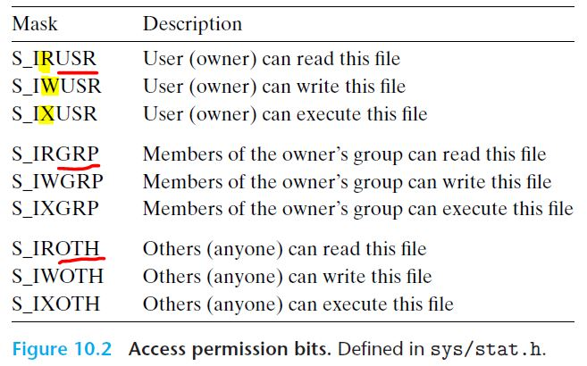

> # Part 3: 프로그램들 간의 상호작용과 통신
>
> 응용프로그램들은 다른 프로그램들과, 그리고 입출력 장치들과 통신하기 위해서 **운영체제가 제공하는 서비스들**을 사용한다.
>
> - Unix 운영체제가 제공하는 기본 입출력 서비스
>   - 웹 서버와 웹 클라이언트 사이의 통신
> - 다수의 클라이언트에 서비스할 수 있는 동시성 프로그램을 작성하는 기술
>   - 현대 멀티 코어 프로세서에서 더 빨리 실행된다.

# 10장. 시스템 수준 입출력

입출력(I/O)은 `메인 메모리`와 `외부 장치`들 간에 **데이터를 복사**하는 작업이다.

- 외부 장치 - 디스크 드라이브, 터미널, 네트워크 등

모든 언어의 `런타임 시스템`은 입출력을 수행하기 위한 고급 기능들을 제공한다.

> **리눅스 시스템**에서 이러한 고급 I/O 함수들은 **커널이 제공하는 시스템 수준 Unix I/O 함수**들을 사용해서 구현되어 있다.

- ANSI C의 표준 I/O 라이브러리
  - printf, scanf `함수` - 버퍼를 이용해서 I/O를 수행함
- C++의 오버로드 `연산자`
  - << ("put to")
  - \>\> ("get from")

**목표**

- Unix I/O

  - I/O는 시스템 동작이 합쳐진 것으로, 다른 시스템 아이디어와 **순환되는 의존성**이 존재한다.

    - ex) I/O는 프로세스의 생성과 실행과정에서 **서로 다른 프로세스들이 어떻게 파일을 공유하는가**에 대한 핵심 역할을 수행한다.

      => 따라서 I/O를 정말로 이해하려면 프로세스를 이해할 필요가 있으며, 그 반대도 마찬가지다.

  - 고급 I/O 함수를 사용하는 것이 부적절한 경우들에 사용한다.

    - 파일의 메타데이터에 접근하는 경우 - 표준 I/O 라이브러리는 메타데이터에 접근하는 방법 제공x
    - 네트워크 프로그래밍 - 표준 I/O 라이브러리에는 문제들이 존재함

- 표준 I/O (C 프로그램)

- 네트워크 프로그래밍과 동시성 기초

## 1. Unix I/O

`리눅스`에서 파일은 **연속된 m개의 바이트**이다.

​	B*0*, B*1*, . . . , B*k*, . . . , B*m-1*

> `리눅스 커널`은 네트워크, 디스크, 터미널 같은 **모든 `외부 장치`들을 파일로 모델링(매핑)**하며, 모든 입력과 출력은 **해당 파일을 읽거나 쓰는 형식으로 수행**된다.
>
> => 따라서 디바이스 I/O를 하기 위해 **파일의 low level 응용 프로그램 인터페이스인 `Unix I/O`**를 사용할 수 있다. 이는 모든 입력과 출력이 통일된 방식으로 수행되도록 해준다.

- open

  1. 응용은 I/O 디바이스에 접근한다는 것을 **해당 파일을 열겠다고 커널에 요청**하는 방법으로 알린다.

  2. 커널은 `식별자(descriptor)`라고 하는 비음수를 리턴한다.

     - 식별자는 이후의 파일에 관한 모든 연산에서 해당 파일을 나타냄

     > - 커널 - 열린 파일에 관한 모든 정보를 추적
     > - 응용 - 식별자만을 추적

  `리눅스 쉘`이 만든 프로세스는 세 개의 열린open 파일을 가지고 동작한다:

  - 표준 입력(식별자 0) - 헤더 파일 <unistd.h>에 상수 STDIN_FILENO로 정의됨
  - 표준 출력(식별자 1) -  STDOUT_FILENO
  - 표준 에러(식별자 2) -  STDERR_FILENO

- 현재 파일 위치의 변경

  : 커널은 파일을 열 때마다 `파일 위치 k`를 관리한다.

  - 파일 위치는 처음에는 0이다.
  - 파일 위치는 파일의 시작 부분에서부터의 **바이트 오프셋** (파일은 바이트로 구성되므로)

  - seek 연산

    : 응용프로그램은 `seek 연산`을 수행해서 현재 파일 위치를 명시적으로 설정할 수 있다.

- read/ write 연산

  - read

    1. 현재 파일 위치 k에서 시작해서 n > 0 바이트를 파일에서 `메모리`로 복사
    2. k를 n 증가시킴

    > k (파일 위치-바이트) ≥ m (파일의 크기-바이트)인 read 연산을 수행하는 경우
    >
    > **=> EOF(end-of-file) 조건이 발생하며, 응용프로그램에서 감지한다.**
    >
    > - 실제 파일의 끝에 "EOF 문자"가 명시적으로 존재하는 것은 아니다!

  - write

    1. 현재 파일 위치 k에서 시작해서 n > 0 바이트를 `메모리`에서 파일로 복사
    2. k를 n 증가시킴

- close

  1. 응용이 파일 접근을 끝마치면 **커널에 파일을 닫아줄 것을 요청**한다.
  2. 커널은 파일을 열었을 때 만든 `자료구조`들을 반환하고, `식별자`를 가용 식별자 풀로 복원한다.

  프로세스가 어떤 이유에서든 `종료`될 때, 커널은 모든 open 파일을 close하고 메모리 자원을 반환한다. 


## 2. 파일

리눅스 파일은 시스템에서의 역할을 나타내는 **타입**을 가진다.

- 일반 파일

  : **데이터**를 저장

  - 응용프로그램은 일반 파일을 `텍스트 파일`과 `이진 파일`로 구분한다.
    - 텍스트 파일 - ASCII문자나 유니코드만을 포함하는 파일
      - 텍스트 라인들로 구성된다.
      - 각 라인은 '\n' 뉴라인 문자로 종료된다. (= 아스키의 LF 라인피드 문자와 같음. 0xa)
    - 이진 파일 - 그 외의 모든 파일
  - 커널은 `텍스트 파일`과 `이진 파일`을 구분하지 않는다.

- 디렉토리

  : **링크들의 배열**을 저장. 각각의 링크는 `파일 이름`을 파일로 대응시키며, 파일 이름은 또 다른 디렉토리일 수도 있다.

  - 디렉토리는 최소 두 개 항목을 포함한다.
    - `.` - 자신의 디렉토리로의 링크
    - `..` - 부모 디렉토리로의 링크

- 소켓

  : 네트워크상의 다른 **프로세스**와 통신하기 위해 사용되는 파일

- 이름 있는 파이프

- 심볼형 링크

- 문자(character)

- 블록 장치(block devices)

리눅스 커널은 파일들을 `루트 디렉토리`에 연결된 **단일 디렉토리 계층구조**로 구성한다.

각 프로세스는 `현재 작업 디렉토리`(디렉토리 계층구조 내에서 자신의 현재 위치)를 *컨텍스트*에 저장한다.

- 쉘의 `현재 작업 디렉토리`를 cd 명령으로 변경할 수 있다.

- 디렉토리 계층구조에서의 위치는 **경로 이름pathnames**으로 명시한다.
  - 절대 경로 이름 - 루트로부터의 경로
  - 상대 경로 이름 - 현재 작업 디렉토리로부터의 경로


## 3. 파일 열기와 닫기

- open

  : 기존의 파일을 열거나 새 파일을 생성

  ``` c
  #include <sys/types.h>
  #include <sys/stat.h>
  #include <fcntl.h> // file control 헤더. open() 함수를 정의한다.
  
  int open(char *filename, int flags, mode_t mode);
  // 리턴값: file descriptor, 에러 발생시 -1 리턴
  ```

  open 함수는 `filename`을 `파일 식별자`로 변환하고, 식별자 번호를 리턴한다.

  > 리턴된 식별자는 항상 프로세스 내에서 현재 열려 있지 않은 **가장 작은 식별자**이다.

  - flags 인자

    : 프로세스가 파일에 접근하는 권한 방법

    - O_RDONLY - Read only
    - O_WRONLY - Write only
    - O_RDWR - Read and Write

    **쓰기 작업**을 위한 추가적인 명령을 제공하도록 한 개 이상의 비트마스크를 OR 형태로 작성할 수도 있다.

  - mode 인자

    : 파일의 접근 권한 비트. 헤더 파일 <sys/stat.h>에 정의되어 있다.

    - 비트들에 대한 심볼 이름

    

    

    프로세스는 *컨텍스트*의 일부로 **umask**를 갖는다.

    - umask는 `umask 함수`를 호출해서 설정한다.