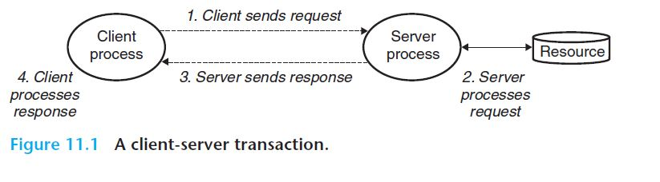

> # Part 3: 프로그램들 간의 상호작용과 통신
>
> 응용프로그램들은 다른 프로그램들과, 그리고 입출력 장치들과 통신하기 위해서 **운영체제가 제공하는 서비스들**을 사용한다.
>
> - Unix 운영체제가 제공하는 기본 입출력 서비스
>   - 웹 서버와 웹 클라이언트 사이의 통신
> - 다수의 클라이언트에 서비스할 수 있는 동시성 프로그램을 작성하는 기술
>   - 현대 멀티 코어 프로세서에서 더 빨리 실행된다.

# 11장. 네트워크 프로그래밍

모든 네트워크 응용프로그램들은

- 동일한 기본적인 **프로그래밍 모델**에 기초한다.
  - 기본적인 `클라이언트-서버` 프로그래밍 모델
- 비슷한 전체 **논리 구조**를 가진다.
- 동일한 **프로그래밍 인터페이스**를 사용한다.
  - 소켓 인터페이스
  - `인터넷`이 제공하는 서비스를 이용

네트워크 응용프로그램은 시스템의 개념들에 의존하고 있다.

- 프로세스
- 시그널
- 바이트 순서
- 메모리 매핑
- 동적 저장장치 할당

**목표**

정적 및 동적 컨텐츠를 서비스할 수 있는 아주 작은 **웹 서버**를 개발한다.

## 1. 클라이언트-서버 프로그래밍 모델

모든 네트워크 응용프로그램은 `클라이언트-서버 모델`에 기초하고 있다.

=> 응용프로그램은 **한 개의 서버 프로세스**와, **한 개 이상의 클라이언트 프로세스**로 구성된다. 

- 서버

  : **일부 리소스**를 관리하고, 이 리소스를 조작하여 클라이언트를 위한 **일부 서비스**를 제공하는 `프로세스`

  - 웹 서버
    - 리소스 - 디스크 파일을 관리
    - 서비스 - 클라이언트를 대신해서 디스크 파일을 가져오고 실행한다.
  - FTP 서버
    - 리소스 - 디스크 파일을 관리
    - 서비스 - 클라이언트를 위해 디스크 파일을 저장하고 가져온다.
  - 이메일 서버
    - 리소스 - 스풀 파일을 관리
    - 서비스 - 클라이언트를 위해 스풀 파일을 read 하고 갱신한다.

클라이언트-서버 모델에서 **근본적인 연산은 `트랜잭션`이다**.

> `클라이언트-서버 트랜잭션`은 단순히 **클라이언트와 서버가 수행한 일련의 네 단계**를 의미한다.
>
> => 데이터베이스 트랜잭션과 다르며, 원자성 같은 특성도 갖지 않는다.

1. 클라이언트는 한 개의 `요청request`을 서버에 보낸다.
2. 서버는 `요청`을 받고, 해석하고, 자신의 자원들을 조작한다.
3. 서버는 `응답response`을 클라이언트로 보내고, 다음 `요청`을 기다린다.
4. 클라이언트는 `응답`을 받고 처리한다.

