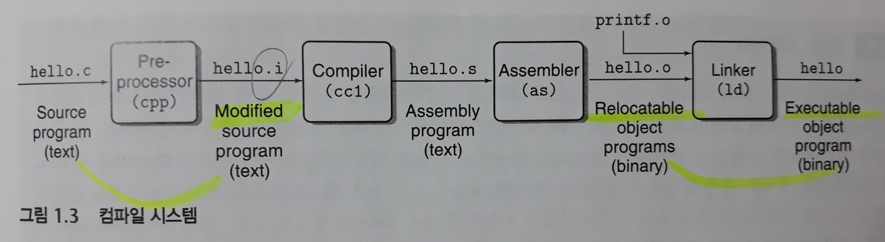
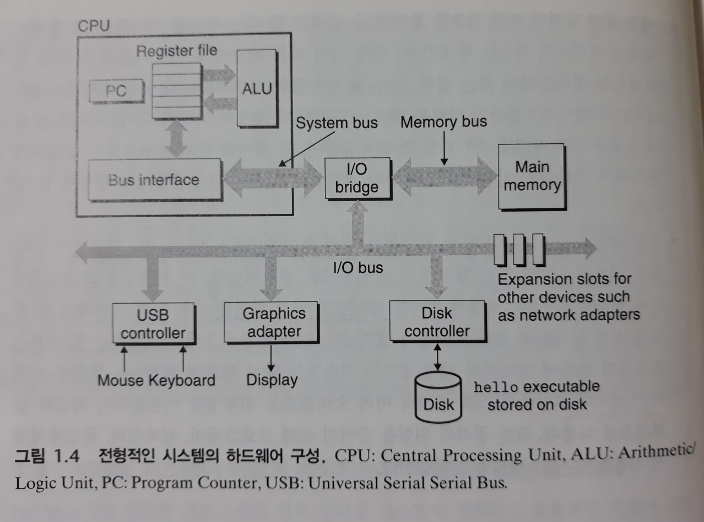
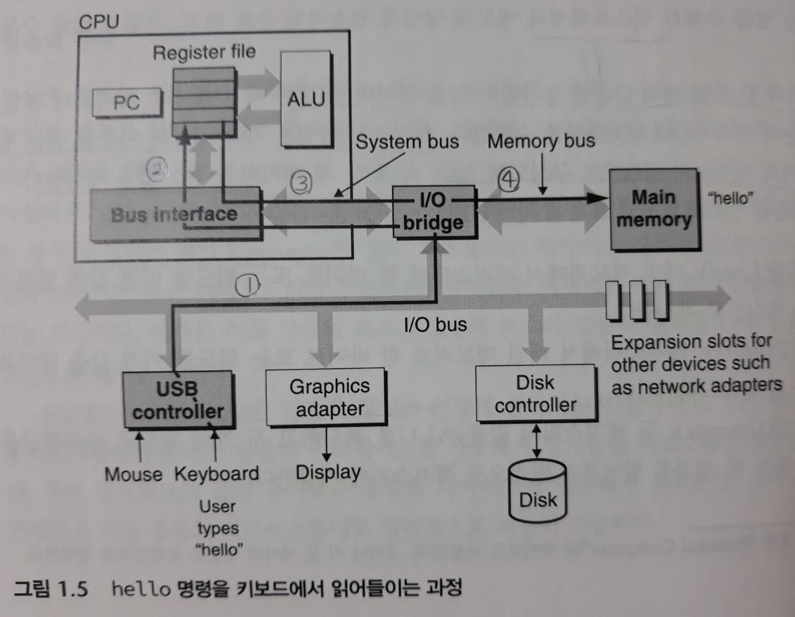
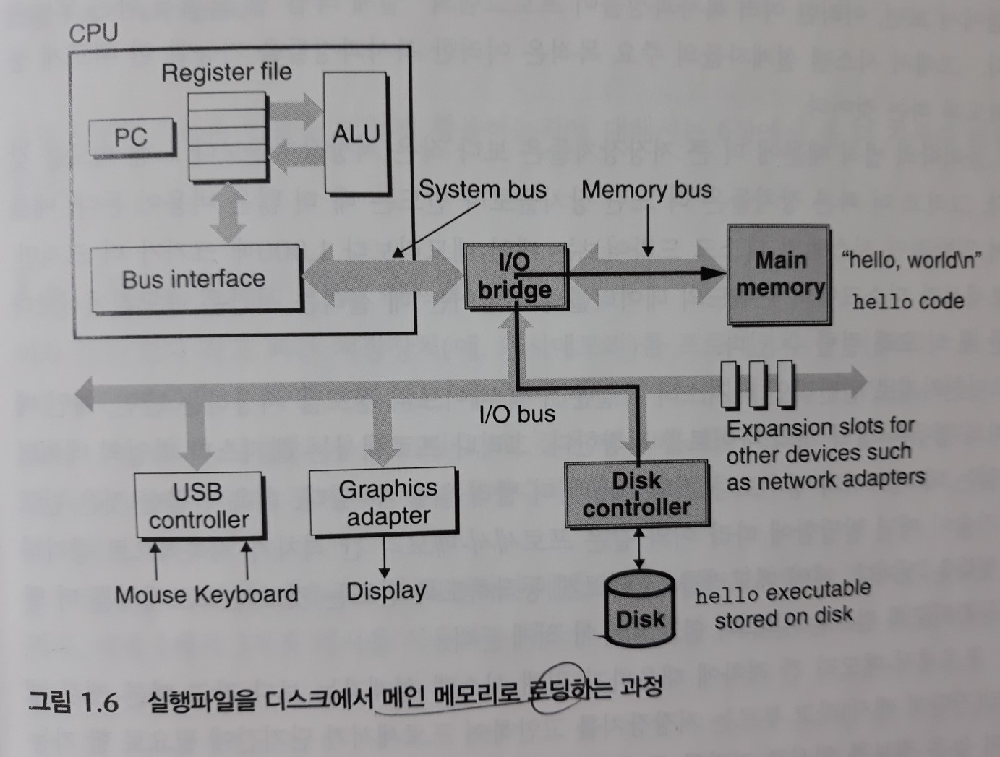
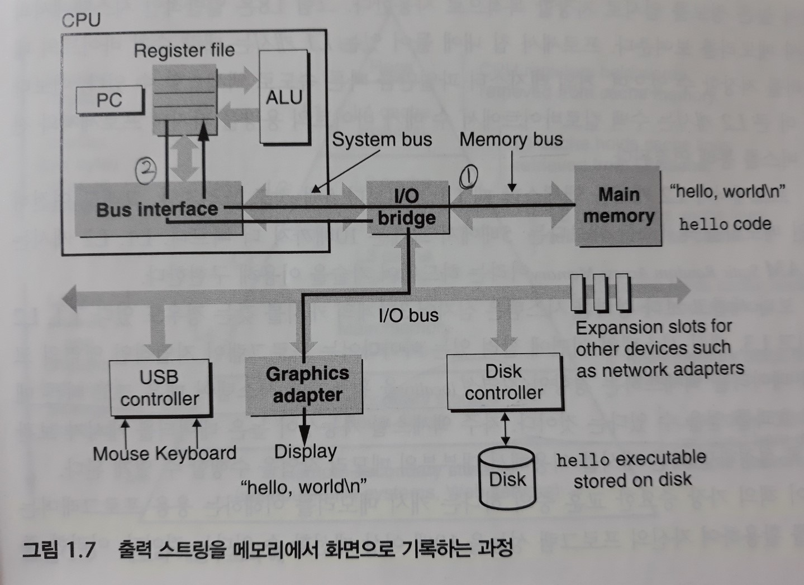
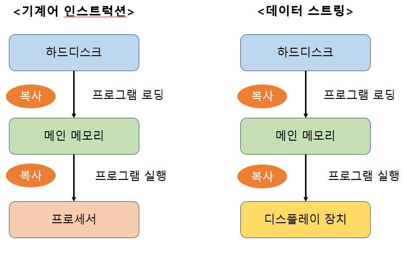
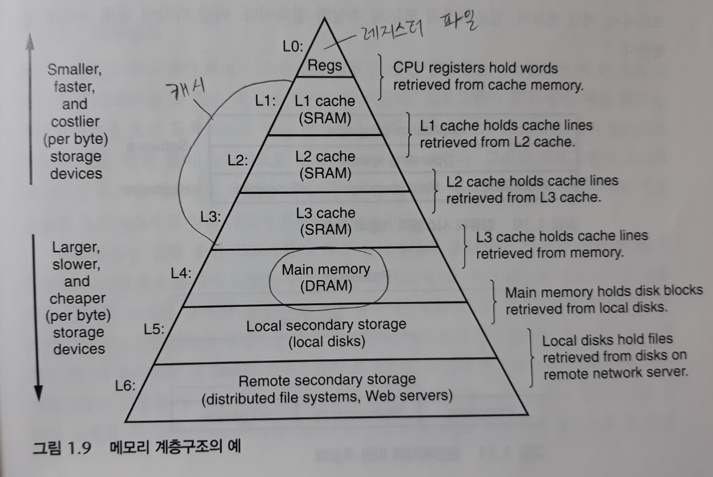

# 1장. 컴퓨터 시스템으로의 여행

> 컴퓨터 시스템 = 하드웨어 + 시스템 소프트웨어, 이들이 함께 작동하여 응용프로그램을 실행한다.
>
> 시스템의 구현방법은 시간에 따라 바뀔 수 있지만, **근본적인 개념들은 변하지 않는다**.
>
> 모든 컴퓨터 시스템들은 유사한 기능을 수행하는 유사한 하드웨어와 소프트웨어 컴포넌트를 가지고 있다.

**목표**

- 하부의 컴퓨터 시스템과

- 시스템이 응용프로그램에 미치는 영향을 이해함

## 1. 정보는 비트와 컨텍스트로 이루어진다

대부분의 컴퓨터 시스템은 텍스트 문자를 `아스키(ASCII)` 표준을 사용하여 표시한다.

- hello.c 프로그램은 연속된 바이트들로 파일에 저장된다.

  ``` c
  #include <stdio.h>
  
  int main(){
      printf("hello, world\n");
      return 0;
  }
  ```

- 텍스트 파일 - hello.c처럼 오로지 아스키 문자들로만 이루어진 파일들

  바이너리 파일 - 다른 모든 파일들

> 표시방법의 `기본개념`은 다음과 같다.
>
> : 모든 시스템 내부의 정보-디스크 파일, 메모리상의 프로그램, 데이터, 네트워크를 통해 전송되는 데이터-는 비트들로 표시된다.
>
> 서로 다른 객체들을 구분하는 유일한 방법은 이들을 바라보는 컨텍스트에 의해서다. (코드 표가 다름 =부호화 방법이 다르다)
>
> ex. 동일한 일련의 바이트가 다른 컨텍스트에서는 정수, 부동소수, 문자열 또는 기계어 명령을 의미한다.


## 2. 프로그램은 다른 프로그램에 의해 다른 형태로 번역된다

hello.c를 시스템에서 실행시키려면, 다른 프로그램들에 의해 저급 **기계어** 인스트럭션들로 번역되어야 한다.

이 인스트럭션들은 `Executable object program(실행가능 목적 프로그램)`이라고 하는 형태로 합쳐져서 **바이너리 디스크 파일로 저장**된다.

``` bash
linux> gcc -o hello hello.c
```

*GCC 컴파일러 드라이버는 소스파일 hello.c를 읽어서 실행파일인 hello로 번역한다.*

**[컴파일 시스템]**

아래와 같은 4단계를 수행하는 각기 다른 4개의 프로그램을 합쳐서 컴파일 시스템이라고 부른다. 



- 전처리 단계

  : `전처리기(cpp)`는 본래의 C 프로그램을 #문자로 시작하는 디렉티브(directive)에 따라 수정한다.

  #include <stdio.h>는 전처리기에게 시스템 헤더파일인 stdio.h를 프로그램 문장에 직접 삽입하라고 지시한다.

  - **결과=> `.i`로 끝나는 새로운 C 프로그램이 생성됨**

- 컴파일 단계

  : `컴파일러(cc1 - 소문자 l이 아니라 숫자 1임) `는 텍스트파일 hello.i를 텍스트파일인 hello.s로 번역하며, 이 파일에는 어셈블리어 프로그램이 저장된다.

  - **결과=> `.s`로 끝나는 어셈블리어 프로그램이 생성됨**
  - 어셈블리어는 여러 상위수준 언어의 컴파일러들을 위한 공통의 출력언어를 제공하기 때문에 유용하다.

- 어셈블리 단계

  : `어셈블러(as)`가 hello.s를 기계어 인스트럭션으로 번역하고, 이들을 `Relocatable object program(재배치가능 목적프로그램)`의 형태로 묶어서 hello.o라는 목적파일에 그 결과를 저장한다. 

  목적파일은 바이너리 파일이다.

  - **결과=> `.o`로 끝나는 기계어 프로그램이 생성됨**

- 링크 단계

  : printf 함수는 이미 컴파일 된 별도의 목적파일인 printf.o에 들어 있으며, 이 파일은 hello.o 파일과 결합되어야 한다.

  `링커(ld)`가 이 통합작업을 수행한다.

  - **결과=> `실행가능 목적파일`로 메모리에 적재되어 시스템에 의해 실행됨**


## 3. 컴파일 시스템이 어떻게 동작하는지 이해하는 것은 중요하다

프로그래머들이 `컴파일 시스템`이 어떻게 동작하는지 이해해야 하는 중요한 이유는 다음과 같다.

- 프로그램 성능 최적화하기

  : 프로그래머로서 효율적인 코드를 작성하기 위해서 컴파일러의 내부 동작을 알 필요는 없다.

  그렇지만 C 프로그램 작성 시 올바른 판단을 하기 위해서는 **기계어 수준 코드에 대한 기본적인 이해**를 할 필요가 있으며, **컴파일러가 어떻게 C 문장들을 기계어 코드로 번역하는지** 알 필요가 있다.

  - 리눅스, 매킨토시, 윈도우 컴퓨터의 기계어인 x86-64 기계어

- 링크 에러 이해하기

  : 가장 당혹스러운 프로그래밍 에러는 링커의 동작과 관련되어 있다.

- 보안 약점(security hole) 피하기
  : 안전한 프로그래밍을 배우는 첫 단계는 **프로그램 `스택`에 데이터와 제어 정보가 저장되는 방식 때문에 생겨나는 영향**을 이해하는 것이다.

  - 버퍼 오버플로우(buffer overflow) 취약성

    : 인터넷과 네트워크상의 보안 약점의 주요 원인.

    프로그래머들이 데이터의 양과 형태를 주의 깊게 제한하지 못할 때 발생하는 취약성이다.


## 4. 프로세서는 메모리에 저장된 인스트럭션을 읽고 해석한다

hello.c 소스 프로그램은 `컴파일 시스템`에 의해 hello라는 실행가능한 목적파일로 번역되어 디스크에 저장되었다.

- 쉘 - 커맨드라인 인터프리터. 프롬프트를 출력하고 명령어 라인을 입력 받아 그 명령을 실행한다.

  ``` shell
  linux> ./hello
  hello, world
  linux>
  ```

### 1) 시스템의 하드웨어 조직



- 버스(Buses)

  : 시스템 내를 관통하는 전기적 배선군으로, 컴포넌트들 간에 **바이트 정보**들을 전송한다.

  `워드(word)`라고 하는 고정 크기의 바이트 단위로 데이터를 전송하도록 설계된다.

  - 한 개의 워드를 구성하는 바이트 수는 시스템마다 보유하는 `기본 시스템 변수`다.
  - 대부분은 4바이트(32bit) 또는 8바이트(64bit) 워드 크기를 갖는다.

- 입출력 장치

  : 입출력 장치는 시스템과 외부세계와의 연결을 담당한다.

  - 각 입출력 장치는 입출력 버스와 `컨트롤러`나 `어댑터`를 통해 연결된다. 이 두 장치의 차이는 패키징(packaging)에 있다.

  - 컨트롤러는 디바이스 자체가 칩셋이거나 시스템의 마더보드에 장착된다.

    어댑터는 마더보드의 슬롯에 장착되는 카드이다.

- 메인 메모리

  : 프로세서가 **프로그램을 실행하는 동안** 데이터와 프로그램을 모두 저장하는 임시 저장장치

  - 물리적으로 메인 메모리는 DRAM(Dynamic Random Access Memory) 칩들로 구성되어 있다.
  - 논리적으로는 연속적인 바이트들의 배열로, 0부터 시작해서 고유의 주소(배열 인덱스)를 갖고 있다.
  - 일반적으로 한개의 프로그램을 구성하는 각 **기계어 인스트럭션은 다양한 바이트 크기를 갖는다**.
  - C프로그램 변수들의 **데이터 크기는 데이터 형에 따라 다르다**.

- 프로세서(CPU)

  : 메인 메모리에 저장된 인스트럭션들을 해독(실행)하는 엔진

  프로세서의 중심에는 **워드 크기**의 저장장치(또는 레지스터)인 `프로그램 카운터(PC)`가 있다.

  - 프로세서는 자신의 `인스트럭션 집합 구조(Instruction set architecture)`로 정의되는 매우 '단순한' 인스트럭션 실행 모델을 따라 *작동하는 것처럼 보인다.*
    - **그러나 최신 프로세서는 인스트럭션 집합 구조를 단순하게 구현한 것이 아니라, 프로그램의 실행 속도를 높이기 위해 훨씬 더 복잡한 방식을 사용한다.** 
  - 이 '단순한' 모델에서 인스트럭션들은 규칙적인 순서로 실행되고, 한 개의 인스트럭션을 실행하는 것은 여러 단계를 수행함으로써 이루어진다.

  > 아래와 같이 인스트럭션의 요청에 의한 몇 개의 `단순한` 동작만 있을 뿐이며, 
  >
  > 이들은 메인 메모리, 레지스터 파일, 수식/논리 처리기(ALU) 주위를 순환한다.
  >
  > - 레지스터 파일 - 각각 고유의 이름을 갖는 워드 크기의 레지스터 집합으로 구성됨
  > - ALU - 새 데이터와 주소 값을 계산한다.

  - 적재(Load)
  
    : 메인 메모리에서 레지스터에 한 바이트 또는 워드를 이전값에 덮어쓰는 방식으로 **복사**한다.
  
  - 저장(Store)
  
    : 레지스터에서 메인 메모리로 한바이트 또는 워드를 이전 값을 덮어쓰는 방식으로 **복사**한다.
  
  - 작업(Operate)
  
    : 두 레지스터의 값을 ALU로 복사하고 두 개의 워드로 수식연산을 수행한 뒤, 결과를 덮어쓰기 방식으로 레지스터에 **`저장`**한다.
  
  - 점프(Jump)
  
    : 인스트럭션 자신으로부터 한 개의 워드를 추출하고, 이것을 PC에 덮어쓰기 방식으로 **복사**한다.

### 2) hello 프로그램의 실행

1. 키보드로 `.\hello`를 입력하면 쉘 프로그램은 각각의 문자를 `레지스터`에 먼저 읽어들인 다음, `메모리`에 저장한다.

   

2. 키보드로 엔터(Enter) 키를 누르면 쉘은 명령 입력을 끝마쳤다는 것을 알게 된다.

   그러면 쉘은 **파일 내의 코드와 데이터를 복사하는 일련의 인스트럭션을 실행**하여 실행파일 hello를 디스크에서 메인 메모리로 `로딩`한다.

   - 데이터 부분은 문자 스트링인 "hello, world\n"을 포함한다.

   - **DMA(직접 메모리 접근) 기법을 이용해서 코드와 데이터는 프로세서를 거치지 않고 디스크에서 메인 메모리로 직접 이동한다.**

   

3. hello 목적파일의 코드와 데이터가 메모리에 적재(로딩)된 후, 프로세서는 hello 프로그램의 **main 루틴**의 기계어 인스트럭션을 실행한다.

   - 이 인스트럭션들은 "hello, world\n" 스트링을 `메모리`로부터 `레지스터 파일`로 복사하고, 거기로부터 디스플레이 장치로 전송하여 화면에 글자들이 표시된다.

   


## 5. 캐시가 중요하다

위의 예제(hello 프로그램 실행)로부터 얻게 되는 중요한 교훈은 **시스템이 정보를 한 곳에서 다른 곳으로 이동시키는 일에 많은 시간을 보낸다는 것**이다.



> 프로그래머 관점에서 보면, 이러한 여러 **복사**과정들이 프로그램의 "실제 작업"을 느리게 하는 오버헤드다.
>
> 그래서 시스템 설계자들의 주요 목적은 이러한 **복사과정들을 가능한 한 빠르게 동작하도록** 하는 것이다.


물리학의 법칙(탐색 범위가 늘어나므로) 때문에 더 큰 저장장치들은 보다 작은 저장장치들보다 느린 속도를 갖는다.

- 프로세서-메모리 간 격차에 대응하기 위해 시스템 설계자는 보다 작고 빠른 `캐시 메모리(캐시)`라고 부르는 저장장치를 고안했다.
  - L1 캐시

    : **프로세서 칩 내에 들어 있으며**, 대략 수천 바이트의 데이터를 저장할 수 있다.

    거의 레지스터 파일만큼 빠른 속도로 액세스할 수 있다.

  - L2 캐시

    : L1보다 좀 더 큰 캐시

    수백 KB에서 수 MB의 용량을 가지며 **프로세서와 전용 버스를 통해 연결**된다.

  > 프로세서가 L2 캐시를 액세스할 때 L1 캐시보다 5배 정도 느리지만, 그래도 메인 메모리를 액세스할 때보다는 5배에서 크게는 10배까지 더 빠르다.
  >
  > L1, L2 캐시는 **SRAM(Static Random Access Memory)**이라는 하드웨어 기술을 이용해 구현한다.

- 지역성(locality)

  : 프로그램이 지엽적인 영역의 코드와 데이터를 액세스하는 경향

  자주 액세스할 가능성이 높은 데이터를 캐시가 보관하도록 설정한다.

> :bulb: **중요**
>
> 응용 프로그래머는 캐시를 활용하여 프로그램 성능을 10배 이상 개선할 수 있다.


## 6. 저장장치들은 계층구조를 이룬다

> **모든 컴퓨터 시스템의 저장장치**들은 **메모리 계층구조**로 구성되어 있다.
>
> 메모리 계층구조의 주요 아이디어는 한 레벨의 저장장치가 다음 하위레벨 저장장치의 캐시 역할을 한다는 것이다.

계층의 꼭대기에서부터 맨 밑바닥까지 이동할수록 저장장치들은 더 느리고, 더 크고, 바이트 당 가격이 싸진다.




## 7. 운영체제는 하드웨어를 관리한다

