> # Part 1: 프로그램의 구조와 실행
>
> 컴퓨터 시스템에 대한 탐구는 프로세서와 메모리 서브시스템으로 구성된 컴퓨터 자체를 공부하는 것으로 시작한다.
>
> - 응용 프로그램이 어떻게 표시되고 실행되는지에 대한 깊은 이해를 할 수 있게 된다.
> - 안전하고 안정적인 프로그램을 작성하고, 컴퓨팅 자원을 가장 잘 사용할 수 있도록 하는 기법을 배운다.

# 2장. 정보의 표현과 처리

`디지털 혁명` 이후, 현대의 컴퓨터는 **두 개의 값을 갖는 신호로 표현되는 정보(=`비트`)**를 저장하고 처리한다.

인간에게는 십진수 표기를 사용하는 것이 당연한 것이지만, **정보의 `저장`과 `처리`를 위한 기계**를 만들 때는 이진수 값들이 더 잘 동작한다.

- 두 개의 값을 갖는 신호를 저장하고 계산하기 위한 전자회로는 매우 간단하고 안정적이기 때문이다.

**목표**

- 여러 인코딩의 기본 정의로 시작해서,
  - 세 개의 가장 중요한 숫자 표현 - 비부호형 인코딩, 2의 보수 인코딩, 부동소수점 인코딩
- 표시 가능한 숫자의 범위,
  - 컴퓨터에서는 하나의 수를 인코딩하기 위해 **제한된** 개수의 비트를 사용한다. 그래서 결과값이 표시할 수 없을 정도로 큰 경우 `오버플로우`를 발생시킬 수 있다.
    - 정수 연산
      - 양수들 간의 곱셈 결과가 너무 크면 음수가 될 수 있다.
      - 곱셈에서 `교환법칙`과 `분배법칙`이 성립한다.
    - 부동소수점 연산
      - **양수들 간의 곱은 항상 양수**이지만, 오버플로우인 경우 특별한 값인 `+∞`를 만들어 낸다. 
      - 부동소수점 연산은 수의 제한된 정밀도 때문에 `교환법칙`이 성립하지 않는다.
- 비트수준 표시방법,
  - 비트수준 표시방법을 직접적으로 조작하여 **산술연산을 하는 여러 가지 방법**을 도출한다.
  - 산술식 계산 성능을 최적화하기 위해 `컴파일러`가 만들어 내는 기계어 코드를 이해하는 데 중요하다.
- 산술연산 성질 같은 특성을 도출한다.
  - 정수와 부동소수점 연산에서의 서로 다른 수학 특성은 그들이 **표시 방법의 유한성을 어떻게 처리하는지**에 기인한다.
  - **정수 표현은 비교적 작은 범위의 값을 인코딩하지만 매우 정밀하게 하는 반면, 부동소수점 표시는 넓은 범위의 값을 근사값으로만 인코딩해야 한다.**

> 이러한 내용은 **핵심 수학법칙**에 근거하여 설명된다.
>
> 프로그래머는 컴퓨터 산술연산이 어떻게 보다 익숙한 정수와 소수 연산에 연관되는지 완벽한 이해를 해야 하기 때문에 이러한 내용들을 이처럼 `추상적인 관점`에서 살펴보는 것이 중요하다.

``` c
*C++ 언어는 C언어를 기초로 완전히 동일한 숫자 표현과 연산을 사용하여 만들어졌다.
따라서 C언어에 대한 언급한 모든 내용은 C++에도 적용된다.
    =>광범위한 구현을 할 수 있도록 설계
*반면 자바 언어는 숫자 표현과 연산을 위해 새로운 표준을 만들었다.
    =>특정한 형식과 인코딩을 사용한다.
```

## 1. 정보의 저장

대부분의 컴퓨터들은 메모리의 비트에 접근할 때, 메모리에서 주소지정이 가능한 최소단위인 **바이트 단위**로 접근하는 방식을 사용한다.

**기계수준의 프로그램**은 메모리를 `가상메모리`라고 하는 거대한 바이트의 배열로 취급한다.

메모리의 각 바이트는 **주소**라고 하는 고유한 숫자로 식별할 수 있으며, 모든 가능한 주소들의 집합을 `가상 주소공간`이라고 부른다.

> 이름처럼 가상 주소공간은 **기계수준 프로그램에게 제공되는** 개념적인 이미지에 불과하다.
>
> 실제 구현은 DRAM, 플래시메모리, 디스크, 기타 하드웨어와 운영체제 소프트웨어로 이루어진다.

다음 장들에서는 어떻게 `컴파일러`와 `런타임 시스템`이 가상메모리 공간을 **분할**하고, 프로그램 객체(program object)들, 즉 프로그램 데이터, 인스트럭션, 제어정보 등을 **저장**하는지에 대해 다룰 것이다.

- 이러한 관리기법들은 모두 가상 주소공간 내에서 수행된다.

- C 컴파일러의 예시
  
  - C에서 어떤 **포인터의 값은**-정수, 구조체, 다른 프로그램 객체 등 유형에 관계없이-저장장치의 동일한 블록의 **첫 바이트의 가상주소**가 된다.
  
    => 기계수준 프로그램의 추상화 윗계층인 소스코드에서도 포인터 문법으로 가상 메모리에 접근할 수 있다.
  
  - C 컴파일러는 값의 타입에 따라 다른 기계수준 코드를 생성할 수 있다.
  
  - 비록 C 컴파일러가 타입 정보를 관리하지만, 컴파일러가 생성하는 실제 기계수준 프로그램은 데이터 타입에 대한 정보를 전혀 가지고 있지 않다.

### 1) 16진수 표시

C에서 0x나 OX로 시작하는 숫자 상수들은 16진수로 해석한다.

> 기계수준 프로그램으로 하게 되는 일반적인 작업은 비트 패턴을 십진, 이진, 16진수 간에 수동으로 변환하는 것이다.

- 이진수와 16진수 간의 변환은 한 번에 하나의 16진수 숫자에 대해 실행할 수 있으므로 즉각적으로 이루어진다.
  - 16진수 -> 이진수: 해당하는 십진수를 생각하여 이진수로 변환한다.
  - 이진수 -> 16진수: 4비트씩 나누어 16진수로 변환한다.
- 십진수와 16진수 표시 간의 변환은 **곱셈**과 **나눗셈**을 사용해야 한다.
  - 십진수 -> 16진수: x를 16으로 반복해서 나누고, 나머지를 나타내는 16진수 숫자를 least significant digit으로 사용한다.
  - 16진수 -> 십진수: 16진수 숫자들을 적절한 16의 제곱수로 곱해야 한다.

### 2) 데이터의 크기

모든 컴퓨터는 **워드 크기(word size)**를 규격으로 가지게 되는데, 이것은 `포인터`의 정규 크기를 표시한다.

> 하나의 가상주소가 한 개의 워드로 인코딩되기 때문에, **워드 크기가 결정하는 가장 중요한 시스템 변수는 `가상 주소공간의 최대 크기`**이다.
>
> - 즉, w비트 워드 크기를 갖는 컴퓨터에서 가상주소는 0에서 2^w - 1 범위를 가지며
> - 프로그램은 최대 2^w 바이트(`= 가상 주소공간의 크기*바이트`)에 접근할 수 있게 된다.

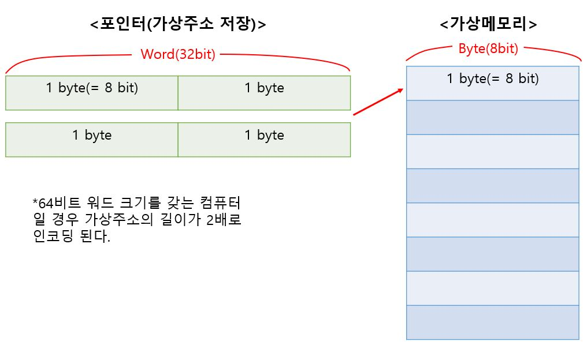

*바이트(Byte)는 메모리에서 주소지정이 가능한 최소단위이다.*

- 32비트 워드 크기는 가상 주소공간의 크기를 4 GB(= 2^32 Byte), 약 4*(10^9) 바이트로 한정한다.
- 64비트 워드 크기는 16 Exabyte, 즉 1.84*(10^19) 바이트의 가상 주소공간으로 확장되었다.

대부분의 64비트 컴퓨터들은 역방향 호환성을 가지고 있어서 32비트 머신들을 위해 컴파일 된 프로그램들도 실행할 수 있다.

그렇기 때문에 어떤 프로그램이 실행되는 머신의 종류가 아니라 **프로그램이 어떻게 컴파일되었는가에 따라** "`32비트 프로그램`" 또는 "`64비트 프로그램`"이라고 부른다.

``` shell
linux> gcc -m32 prog.c
# 이 프로그램은 32비트나 64비트 머신 양쪽에서 정확하게 동작한다.
linux> gcc -m64 prog.c
# 이렇게 컴파일 한 프로그램은 64비트 머신에서만 실행된다.
```


ISO C99는 컴파일러와 컴퓨터 설정에 관계없이 데이터의 크기가 고정된 자료형들을 제안하였다.

- int32_t : 4바이트
- int64_t : 8바이트

> 고정된 정수형 크기를 이용하는 것이 프로그래머들이 **데이터의 표현을 안전하게 통제하는 최상의 방법**이다.

포인터는 프로그램의 워드 크기를 이용한다.

### 3) 주소지정과 바이트 순서

여러 바이트에 걸쳐 있는 **프로그램 객체**들에 대한 `관습` (거의 모든 컴퓨터에서 설정됨)

1. 무엇이 객체의 주소가 되어야 하는지

   : 사용된 바이트의 **최소 주소**

2. 메모리에 바이트들을 어떻게 정렬해야 하는지

   : 멀티 바이트 객체는 **연속된 바이트**에 저장됨


**어떤 객체를 나타내는 바이트들을 정렬**하는 데는 두 가지 일반적인 `관습`이 존재한다.

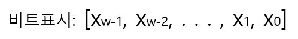

w가 8의 배수라면 이 비트들은 바이트들로 나눌 수 있다.

- 가장 중요한 바이트(most significant byte)

  : [X*w-1*, X*w-2*, . . . , X*w-8*]

- 가장 덜 중요한 바이트(least significant byte)

  : [X*7*, X*6*, . . . , X*0*]

1. 리틀 엔디안

   : 객체를 메모리에 least significant byte부터 저장한다.

   - 대부분의 인텔 호환 머신들

2. 빅 엔디안

   : 객체를 메모리에 most significant byte부터 저장한다.

   - 대부분의 IBM과 Oracle 머신들

- "대부분" => 관례들은 회사라는 경계로 정확하게 나누어지지 않는다.

> 많은 최신 마이크로프로세서 칩들은 두 가지 방식으로 동작이 가능하도록 구성할 수 있다.
>
> 그러나 일단 특정 운영체제가 결정되면 바이트 순서는 고정되는 게 일반적이다.

ex) int형의 변수 x가 주소 0x100에 있으며, 16진수 값 0x01234567을 갖는다고 하자.

주소 범위 0x100 ~ 0x103까지의 바이트들의 순서는 컴퓨터의 타입에 따라 달라진다.

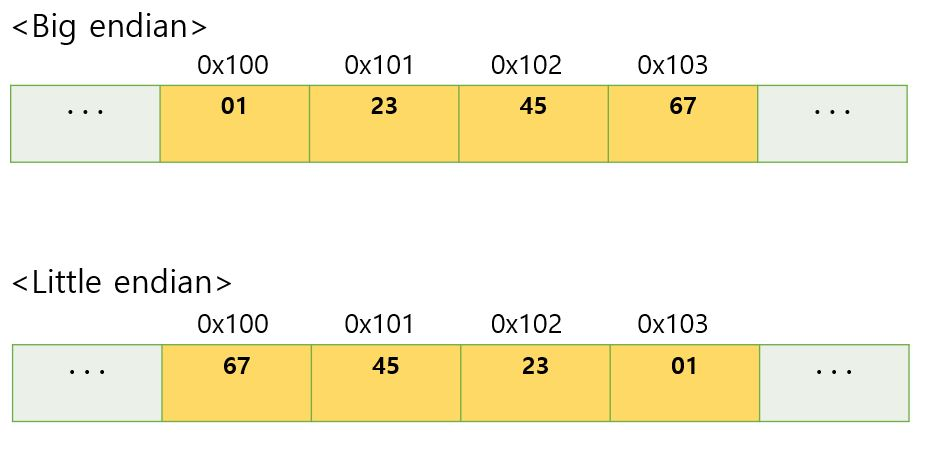

> 위에서 **주소지정**과 **바이트 순서**에 대해 `관습`이라고 했던 이유는, 다른 관습 대신에 선택해야 하는 기술적 이유는 없기 때문이다.
>
> 하나의 관습이 선택되고 일정하게 지켜지는 한 선택은 상관이 없다.

그러나 때때로 바이트 순서가 이슈가 되기도 한다.

1. 이진 데이터가 **네트워크**를 통해 다른 컴퓨터로 전송될 때

   : 문제는 리틀 엔디안 컴퓨터에서 만들어진 데이터를 빅 엔디안 컴퓨터에 보내야 해서, 수신 측 프로그램에서는 워드들 내 바이트의 순서가 뒤바뀌는 경우이다.

   - `네트워크 응용프로그램`으로 작성된 코드는 송신 측 컴퓨터가 내부 표시를 **네트워크 표준**으로 변경하고,
   - 수신 측 컴퓨터가 **네트워크 표준**을 자신의 내부 표시방식으로 변환하도록 하는 `관습`을 따라야 한다.

2. 기계수준 프로그램에서 **정수 데이터**를 나타내는 바이트들을 해석할 때

   : 리틀 엔디안 컴퓨터를 위해 생성한 기계수준 프로그램을 해석할 때, 정수 데이터를 나타내는 바이트의 순서를 뒤집어야 실제 표현하고자 하는 정수를 알 수 있다.

   - `4004d3: 01 05 43 0b 20 00	add	%eax, 0x200b43(%rip)`

     이 라인은 인텔x86-64 프로세서용 기계수준 코드로, 역어셈블러에 의해 만들어졌다.

   - 이 바이트들의 마지막 4바이트인 `43 0b 20 00`을 **역순으로 `00 20 0b 43`라고 써야 원래 정수를 사람이 해석할 수 있다**. = 0x200b43

3. 프로그램이 정상적인 타입 체계를 회피하도록 작성되었을 때

   : 이러한 코딩 기술은 대부분의 응용 프로그램 작성시에 엄격히 제한되어야 하지만, 시스템-수준 프로그램에서는 상당히 유용하고 심지어 꼭 필요하기까지 하다.

   - C 언어에서 `캐스트(cast)`나 `유니온(union)`을 사용해서, 객체가 만들어졌을 때와는 **다른 타입의 데이터로 참조**될 수 있도록 할 수 있다.
   
   - 아래 코드의 예시는, C 프로그램의 멀티 바이트 객체들인 int, float, void *가 저장하고 있는 `값(멀티 바이트)`을 인간이 읽기 쉽고 이해하기 쉬운 **16진수 형식**으로 출력하는 코드이다. 
     

  => 그러나 빅 엔디안과 리틀 엔디안의 출력값이 달라서 의도하지 못한 결과가 나올 수 있다.
     
     - 그러기 위해서 각 1 바이트의 `비트패턴`을 **unsigned char 인코딩(1장에 의하면 컨텍스트)**을 이용해서 해석하면 `음이 아닌 정수`로 **해석**된다. 
     
       (실제 저장된 값과는 다르다. int형은 2의 보수법 인코딩을 사용하고 unsigned char형은 비부호형 인코딩을 사용하므로, 음의 정수를 양의 정수로 해석한다.)
     
     - 그 결과를 printf를 이용하여 16진수로 출력한다.

   ``` c
   #include <stdio.h>
   
   typedef unsigned char* byte_pointer;
   
   void show_bytes(byte_pointer start, size_t len){ // len은 바이트 수
       type_t
       for(i = 0; i < len; ++i)
           printf(" %.2x", start[i]);
       printf("\n");
   }
   
   void show_int(int x){
       // 이 캐스트는 이 포인터가 본래의 데이터 타입을 갖는 하나의 '객체를 가리키는 것이 아니라'
       // '일련의 바이트들을 가리킨다는 것'을 컴파일러에게 지시한다.
       show_bytes((byte_pointer) &x, sizeof(int));
   }
   
   void show_float(float x){
    show_bytes((byte_pointer) &x, sizeof(float));
   }

   void show_int(void* x){
       show_bytes((byte_pointer) &x, sizeof(void*));
   }
   ```

   - show_int의 경우 (워드크기= 32bit 컴퓨터, 리틀 엔디언)
   
     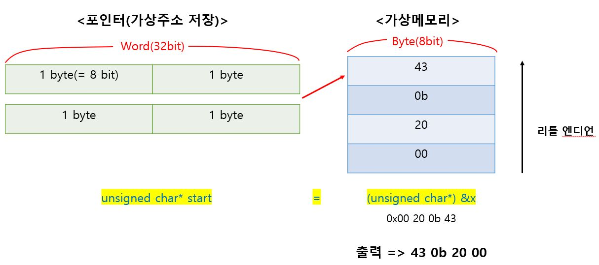
     
   - 빅 엔디언인 경우 출력은 `00 20 0b 43`이 된다.

   > int와 float 데이터의 바이트들은 **바이트 순서**를 제외하고는 모든 컴퓨터에서 동일한 결과를 얻었다.
   >
   > 반면에 포인터 값들은 완전히 다른 결과를 얻었다.
   >
   > 서로 다른 컴퓨터=운영체제 구성은 **저장장치의 할당**에 있어서 서로 다른 `관습`을 사용하기 때문이다.

### 4) 스트링의 표시

C에서 스트링은 `null(값 0을 갖는)` 문자로 종료하는 문자열로 인코딩된다.

<u>각 문자</u>는 표준 인코딩에 따라 표시되며, 이 중 가장 일반적인 인코딩이 **ASCII 문자코드**이다.

=> 스트링 타입은 각 문자별로 ASCII 인코딩을 하는데, **문자 인코딩은 멀티 바이트가 아니므로 바이트 순서 이슈가 발생하지 않는다**.

- UTF-8(유니코드 구현체)은 바이트 순서 이슈가 발생하지 않아서 주로 사용된다.
- UTF-16과 UTF-32는 멀티 바이트 인코딩이므로 바이트 순서 이슈가 발생한다. (UTF-16 : `자바 char` 표준) 

> 따라서 **ASCII를 문자코드로 사용하는 모든 컴퓨터에서** 바이트 순서나 워드 크기와 무관하게 show_bytes의 결과가 똑같다.
>
> ex) show_bytes("12345", 6) 의 결과 = 31 32 33 34 35 00
>
> - 그 결과 텍스트 데이터는 이진 데이터보다 `플랫폼 독립적`이다.

### 5) 코드의 표현

이진 코드(기계어 코드, `인스트럭션 인코딩`)는 컴퓨터와 운영체제들의 여러 가지 조합들 간에 호환성을 갖는 경우가 드물다.

``` c
int sum(int x, int y){
    return x+y;
}
```

위와 같은 C 함수를 여러 컴퓨터들에서 컴파일하면, 각자 다른 바이트 표시를 갖는 기계어 코드를 생성한다.

> 컴퓨터 시스템에서 근본 개념은 컴퓨터의 관점에서 볼 때 프로그램이라는 것은 단순히 바이트의 연속이라는 것이다.
>
> 컴퓨터는 디버깅 시 도움을 주기 위해 관리하는 일부의 **보조용 표**를 제외하고는 본래의 소스 프로그램에 대한 정보를 전혀 가지고 있지 않다.

``` c
*ASCII 문자집합은 영어 문서를 인코딩하는 데는 적합하지만 다른 언어로 된 문서를 인코딩하는 데는 
 전혀 적합하지 못하다.
*유니코드(Universal Character Set)
    : 기본 인코딩은 32비트 문자 표시를 사용한다.
     이 방법을 사용하면 문자열들이 4바이트로 인코딩되는 문자들의 연속으로 이루어져야 한다.
*UTF-8
    : 유니코드에서 변형된 인코딩.
     자주 사용되는 문자들은 1 또는 2바이트를 사용하고,그렇지 않은 문자들은 더 많은 바이트를 사용해서 인코딩한다.
	각 문자를 바이트의 연속으로 인코딩해서 표준 ASCII 문자들은 ASCII에서와 동일한 단일 바이트 인코딩을 사용한다.
```

- 자바는 스트링을 표시할 때 유니코드를 사용한다. C에서도 유니코드를 지원하기 위한 프로그램 라이브러리를 제공한다.

### 6) 부울Boolean 대수

1850년경 George Boole은 이진수 값 1과 0을 논리값 TRUE와 FALSE로 `인코딩`하면 *논리 추론의 기본 원리*들을 구현할 수 있는 **대수학을 수식화**할 수 있다는 점을 발견하였다.

- 각 `부울 대수 연산(~, &, |, ^)`은 `논리연산(NOT¬, AND∧, OR∨, EXCLUSIVE-OR⊕)`에 대응한다.

  즉, ~, &, |, ^ 연산자는 논리연산 NOT, AND, OR, EXCLUSIVE-OR을 각각 `인코딩`한다.

후에 정보이론 학문분야를 개척한 Claude Shannon이 최초로 부울 대수와 디지털 논리회로를 연계하였다.

- 부울 대수는 `디지털 시스템`의 설계와 해석에 중요한 역할을 하고 있다.

**[비트 벡터로 확장]**

네 가지 부울 연산을 0과 1로 이루어진 길이 w의 숫자 스트링인 `비트 벡터`에도 적용할 수 있다.

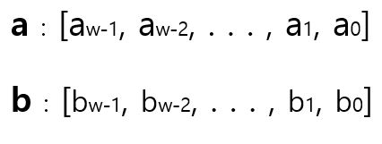

**응용에 따라서** 비트벡터의 각 대응하는 원소들에 대해 연산을 정의할 수 있다.

- `a & b`는 길이가 w인 비트 벡터로, `a & b`의 i번째 원소는 0 ≤ i ＜ w인 i에 대해 a*i* & b*i*로 정의할 수 있다.

- 연산 `|, ^, ~`도 같은 방식으로 비트 벡터에 확장할 수 있다.

``` dc
*부울 대수와 부울 링(ring)
	: 부울 연산 |, &, ~를 길이 w(w>0)의 비트 벡터에 대해 실행하면 [부울 대수]가 된다.
**부울 대수의 특성
	1. &연산은 |에 대해 분배법칙이 성립한다.
		a&(b|c) = (a&b)|(a&c)
	   |연산은 &에 대해 분배법칙이 성립한다.
	    a|(b&c) = (a|b)&(a|c)
	2. 부울 링(연산)
		: ^, &, ~ 같은 연산들을 길이 w의 비트 벡터에 적용할 때는 부울 링이라고 하는 다른 수학적 형태를 얻게 된다.
		부울 링은 정수 산술연산과 많은 공통점을 갖는다.
		[^와 "덧셈" 연산]
			^연산에서는 각 원소 자신이 ^에 대한 역이 된다.
			a^0 = a (0은 ^연산의 항등원)
			a^a = 0 (각 원소 자신은 ^연산의 역원)
		이 특성은 항들의 순서를 바꾸고 다른 순서로 묶는 경우에도 성립한다. (a^b)^a = b
		이 특성은 몇 개의 재미있는 결과와 교묘한 기법들을 만들어준다.
```

**응용1.** 유한집합의 표시

​	: 비트 벡터를 사용해서 집합을 `인코딩`한다.

​	i ∈ A이면 a*i* = 1인 비트 벡터 [a*w-1*, . . . , a*1*, a*0*]를 갖는 부분집합 A ⊆ {0, 1, . . . , w-1}을 `인코딩` 할 수 있다. 

​	ex) 비트 벡터 a = [01101001]은 집합 A = {0, 3, 5, 6}을 인코딩 한다.

- `집합 인코딩`에서 부울연산 인코딩
  - | : 합집합 연산
  - & : 교집합 연산
  - ~ : 여집합(complement)

### 7) C에서의 비트수준 연산

C에서는 비트들 간의 **부울 연산**을 지원한다.

- 이 연산은 모든 "완전한" 자료형들에 대해서 적용될 수 있다.

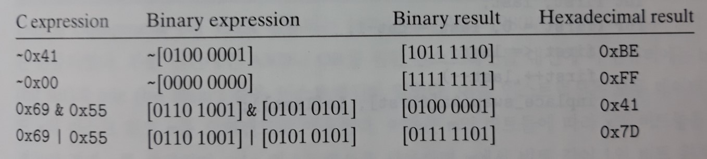

비트수준 연산은 일반적으로 `마스크 연산`을 구현할 때 사용한다.

- **마스크**는 일종의 비트 패턴으로, 워드 중에 일부 선택된 비트 집합을 표시한다.
  - x & 0xFF : 다른 바이트는 0으로 하고, x의 least significant byte만으로 구성된 값을 나타냄
  - ~0 : 프로세서의 데이터 표현의 크기와 관계없이 비트가 모두 1인 마스크를 만든다. **(호환성)**

### 8) C에서의 논리 연산

C에서는 **논리 연산**의 OR, AND, NOT에 해당하는 논리연산자 ||, &&, ! 을 제공한다.

> 비트수준 연산과 이들의 동작은 전혀 다르다.

**차이점 1.**

- 논리 연산은 0이 아닌 인자들을 '참'으로 취급하고, 0은 '거짓'으로 처리한다.

- 결과가 참이면 1, 거짓이면 0을 리턴한다.

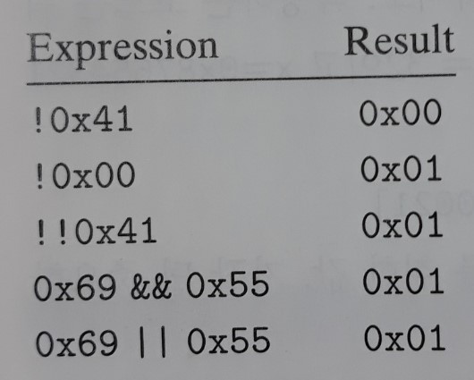

**인자들이 0이나 1로 제한되는 특별한 경우에만 `비트단위 연산`과 이에 대응하는 논리 연산이 동일한 동작을 한다.** 

**차이점2.**

논리연산자는 수식의 결과가 첫 번째 인자를 계산해서 결정될 수 있으면 두 번째 인자는 계산하지 않는다.

- a && 5/a 는 division by zero 오류를 절대 발생시키지 않는다.
- p && *p++ 는 널 포인터의 역참조를 절대 발생시키지 않는다. 

### 9) C에서의 쉬프트 연산

C는 비트 패턴을 좌우로 이동시키는 **쉬프트 연산** 집합을 제공한다.

- 좌측 쉬프트 연산

  : x<<k . 좌측의 k비트가 밀려서 삭제되며 우측에는 k개의 **0으로 채워진다**.

- 우측 쉬프트 연산

  : x>>k . 일반적으로 컴퓨터는 두 종류의 `우측 쉬프트`를 제공한다.

  - 논리 우측 쉬프트

    : 좌측 끝을 k개의 **0들로 채운다**.

  - 산술 우측 쉬프트

    : 좌측 끝을 k개의 **most significant bit들로 채운다**.

    `부호형 정수 데이터`의 연산에서 유용하게 작용한다.

**[C 표준 vs 자바]**

- C 표준은 `부호형 숫자`의 경우에 어떤 타입의 우측 쉬프트가 사용되어야 하는지 명확히 정의하고 있지 않다.

  산술 또는 논리 쉬프트 둘 다 사용 가능하므로, 호환성 문제를 만날 가능성이 있다.

  - 그러나 실제로는 대부분의 컴파일러/컴퓨터 조합들은 `부호형 데이터`에 대해서 **산술 우측 쉬프트**를 사용하고 있다.
  - `비부호형 데이터`에 대해서는 **논리 우측 쉬프트**를 사용해야 한다.

- 자바는 우측 쉬프트가 어떻게 실행되는지에 대해 정확한 정의를 하고 있다.

  - x>>k : x를 산술적으로 쉬프트
  - x>>>k : 논리적으로 쉬프트


## 2. 정수의 표시

정수를 인코드하기 위해 사용할 수 있는 두 가지 방법

1. 양수만 표시할 수 있는 방법
2. 음수, 0, 양수 모두를 표시할 수 있는 방법

- 이들은 **수학적 특성**으로 볼 때, 그리고 이들의 **기계수준 구현**을 볼 때 매우 연관되어 있다.

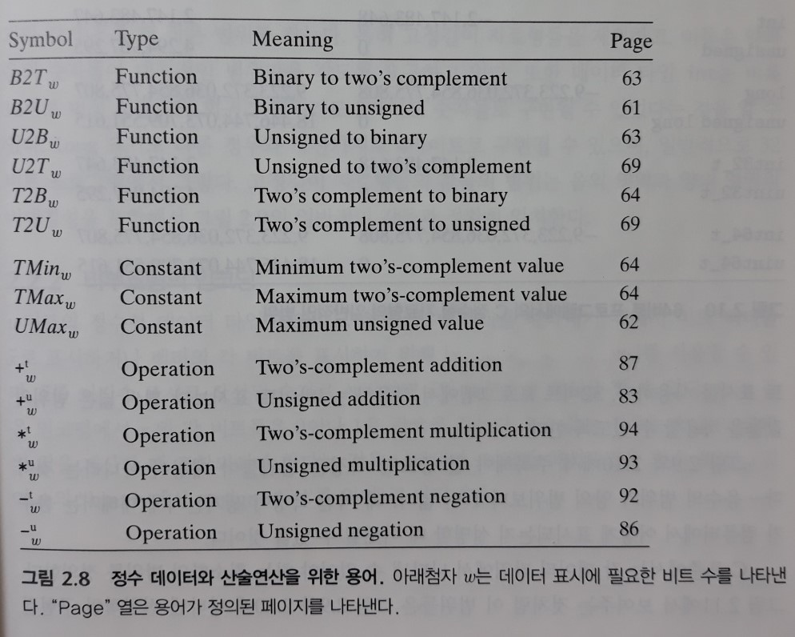

### 1) 정수형 데이터 타입

C는 다양한 *정수형*(≠정수) 데이터 타입-정수의 유한한 범위를 나타내는 데이터 타입-을 지원한다.

- 유일하게 컴퓨터에 의존적인 범위로 표시된 것은 크기 지정어 `long`에 대해서다.
  - 64비트 프로그램 - 8바이트 표시
  - 32비트 프로그램 - 4바이트 표시
- 중요한 특징은 범위들이 대칭이 아니라는 것이다. 음수의 범위가 양의 범위보다 1 더 넓다.

> C 표준에서는 각 데이터 타입에서 나타낼 수 있어야 하는 **최소한의 범위**를 정의한다.
>
> - C와 C++는 부호형(기본 설정)과 비부호형을 지원한다. 자바는 부호형만을 지원한다.
> - 표준에서는 양과 음의 숫자들이 대칭적인 범위만을 갖도록 요구하고 있다.
>   - 고정길이 자료형들(int32_t, uint32_t, int64_t, uint64_t)의 범위는 음의 영역과 양의 영역의 비대칭성을 만족해야 하며, 컴퓨터의 워드 크기와 컴파일러에 상관 없이 모든 프로그램에서 이 범위를 지켜야 한다.
> - int형은 최소 2바이트 숫자들로 구현될 수 있다.

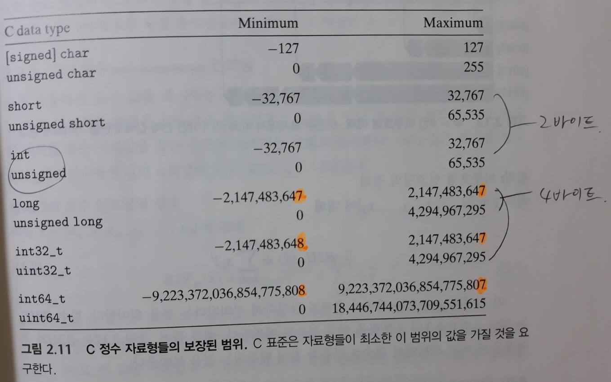

### 2) 비부호형의 인코딩

`비트 벡터 x`를 **이진수 표시로 작성된 <u>숫자</u>**로 생각하면 x의 `비부호형 해석(인코딩)`을 할 수 있다.

전체 해석과정을 `함수` B2U*w*(= 길이 w의 "binary에서 unsigned로"의 의미)로 **정의**하면,

1. 비트 벡터 x를 **이진수 표시로 작성된 숫자**로 표현한다.
2.  x*i*의 각 비트들은 0이나 1을 값으로 갖는데, 1인 경우는 2^i 값을 숫자의 값을 계산할 때 포함한다.

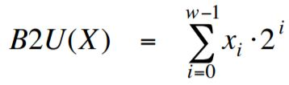

> 비부호형 이진수 표시는 0과 2^w - 1 사이의 모든 숫자가 **`w비트` 값으로 유일한 인코딩을 갖는다(함수적 측면에서 전단사 특성을 가짐)**는 중요한 특징을 나타낸다.
>
> - ex) 십진수 11은 유일한 비부호형 4비트 표시인 [1011]이 존재한다.

이 특성을 수학적 법칙을 이용해서 **정의**한다. (= 이름 붙여준다. 예를 들어 '유일성'이라는 이름)

- 유일성

  : 함수 B2U*w*는 `전단사(bijection)` 특성을 갖는다.

  - 전단사 특성은 어떤 함수 *f*가 양방향으로 사상할 수 있다는 것을 말한다.
  - y = *f*(x)라고 할 때, 역함수 x = *f-1*(y)도 성립한다.

  함수 B2U*w*는 길이 w의 각 비트 벡터들을 0과 2^w - 1 사이의 유일한 수로 매핑하며 그 **역함수**도 구할 수 있다.

  U2B*w*("unsigned to binary")로 표시하며 0과 2^w - 1 사이의 모든 수를 유일한 w비트 패턴으로 매핑한다.

### 3) 2의 보수(two's complement) 인코딩

부호형 숫자를 컴퓨터에서 표시하는 가장 일반적인 방법은 `2의 보수` 형식이라고 알려져 있다.

이것은 워드의 가장 중요한 비트를 음수 자리값을 갖는 것으로 해석(인코딩)하는 형태로 **정의**된다.

이러한 해석과정을 `함수` B2T*w*(= "binary에서 길이 w의 two's complement로"의 의미)로 **정의**하면,


1. most significant bit인 X*w-1*은 `부호 비트`라고 부른다.

   이 비트의 weight는 **- 2^(w-1)**이고, 이 값은 weight를 비부호형 표현한 것(`2^(w-1)`)을 음수화(`"-"`)한 것이다.


- w비트 2의 보수로 나타낼 수 있는 값의 범위

  - 가장 작은 수

    : 비트 벡터 [1 0 . . . 0] => 정수값 TMin*w* = - 2^(w-1)

  - 가장 큰 수

    : 비트 벡터 [0 1 . . . 1] => 정수값 TMax*w* = 2^(w-1) - 1

- 유일성

  : 함수 B2T*w*는 `전단사(bijection)` 특성을 갖는다.

  함수 B2T*w*는 길이 w의 각 비트 벡터들을 - 2^(w-1) 과 2^(w-1) - 1 사이의 유일한 수로 매핑하며 그 **역함수**도 구할 수 있다.

  T2B*w*("2의 보수를 이진수로")로 표시하며 - 2^(w-1) 과 2^(w-1) - 1 사이의 모든 수를 유일한 w비트 패턴으로 매핑한다.

**[중요한 숫자들]**

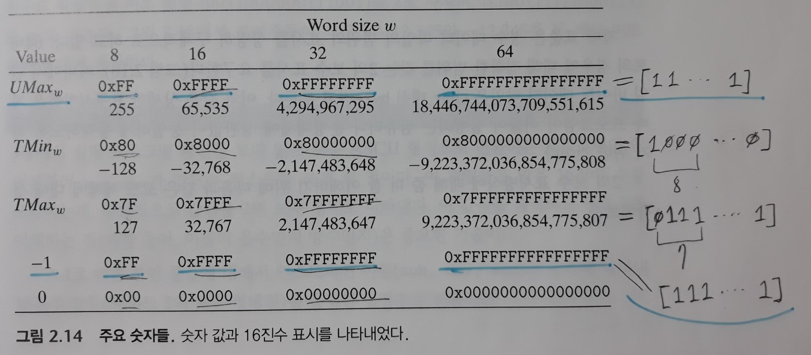

- `2의 보수`의 범위는 **비대칭적**이다.

  : |T*Min*| = |T*Max*| + 1, 즉 T*Min*에 대해서는 대응되는 양수 값이 없다.

  - 이런 사실로 인해 `2의 보수 산술연산`에서 기이한 특성들을 갖게 되며, 난해한 프로그램 **오류**의 원인이 될 수 있다.

  - 비대칭성의 원인은 비트 패턴의 절반(부호비트가 1)이 음수를 표시하고, 나머지 절반(부호비트가 0)이 비음수(nonnegative)를 표시하기 때문이다.

    **0이 비음수**이므로 이것은 양수의 개수가 음수보다 1 적다는 것을 의미한다.

- `비부호형` 최대값은 `2의 보수` 최대값의 두 배보다 1 크다.

  : U*Max* = 2\*T*Max* + 1

- 정수 -1의 `2의 보수형`에서 비트 표시는, `비부호형`에서 비트가 모두 1인 U*Max*의 비트표시와 같다.

- 정수 0은 양쪽의 경우에 모두 비트가 0인 스트링으로 표시한다.


> C 표준에서는 부호형 정수를 `2의 보수 형식`으로 나타낼 것을 요구하지는 않지만, 거의 모든 컴퓨터에서 요구하고 있다.

- C 라이브러리의 <limits.h> 파일은 **컴파일러가 동작하는 특정 머신**에서의 여러 가지 정수 데이터 타입의 범위를 한정하는 상수들을 정의한다.
  - 상수 INT_MAX, INT_MIN, UINT_MAX를 정의

``` c
*고정 크기 정수형
    : 어떤 프로그램에서는 데이터 타입이 특정 크기를 함께 표시하는 인코딩을 해야 하는 경우가 있다.
    ex) 표준 프로토콜에 따라 인터넷으로 통신할 수 있게 해주는 프로그램을 작성할 때, 
	데이터 타입이 프로토콜에 의해 명시된 데이터 타입과 '호환성'이 있도록 하는 것이 중요하다.
    - 특히 C 표준은 데이터 타입들의 최소 범위만을 정의할 뿐 정확한 범위는 정의하지 않기 때문에, 호환성을 보장할 수는 없다.
    - ISO C99 표준은 stdint.h 파일에 고정크기의 정수 타입들을 소개하고 있다.
      이 파일은 intN_t나 uintN_t 같은 형식의 선언으로 데이터 타입들을 정의한다.
      (N의 정확한 값은 구현에 따라 다르지만, 대부분의 컴파일러는 8, 16, 32, 64를 허용한다)
        ex) 비부호형, 16비트 변수: uint16_t
            부호형, 32비트 변수: int32_t
**연관된 매크로들
    - 최소값과 최대값을 정의하는 매크로들도 있다.
      ex) INT32_MIN, INT64_MAX, UINT32_MAX
    - 고정길이의 자료형으로 규격화된 화면인쇄(printf 포맷 등)를 하기 위해서는 
      포맷 스트링을 시스템에 의존적인 방식으로 확장하는 매크로를 사용해야 한다.
      ex) int32_t 타입의 변수 x, int64_t 타입의 변수 y 출력
      	  printf("x = %" PRId32 ", y = %" PRIu64 "\n", x, y);
	- 64비트 프로그램으로 컴파일 할 때, 매크로 PRId32는 스트링 "d"로, PRIu64는 스트링 "l"과 "u"로 확장된다.
      C 전처리기가 스페이스(또는 다른 빈칸 문자)로 나누어진 연속된 스트링 상수들을 만나면 이들을 하나로 연결한다
          printf("x = %d, y = %lu\n", x, y);      
```

> 자바 표준은 정수 데이터 타입의 범위와 표시를 상당히 구체적으로 하고 있다.
>
> - 64비트의 경우에 대해 정확한 범위를 갖는 `2의 보수` 표시를 요구한다.
> - 단일 바이트 데이터 타입은 char 대신 `byte`라고 부른다.
>   - 자바 `char`형은 **UTF-16(유니코드 구현체)** 인코딩을 따르기 때문에 **2바이트**이다.

- 부호형 수의 또 다른 표시방법
     - 1의 보수(**Ones'** Complement)

          : MSB의 weight가 - 2^(w-1)이 아니라 -(2^(w-1) - 1)이라는 점 외에는 2의 보수와 동일하다.

          1의 보수 표시를 따르는 컴퓨터들은 과거에 만들어진 것들이다.

          - B2Ow(x) = - X*w-1*(2^(w-1) - 1) + ∑i=[0,w-2] X*i* * 2^i
          - `+0` : [00 ... 0]
          - `-0` : [11 ... 1]

     - 부호-크기

          : MSB는 부호비트가 된다.

          **부호 크기 인코딩 방식은 `부동소수점` 숫자들에서 사용된다.**

          - B2Sw(x) = (-1)^X*w-1* * (∑i=[0,w-2] X*i* * 2^i)
          - `+0` : [00 ... 0]
          - `-0` : [10 ... 0]

  - 이 두 가지 표시방식은 **0에 대해 2개의 서로 다른 인코딩이 존재**한다는 특성을 갖는다.

### 4) 비부호형과 부호형 간의 변환

C는 서로 다른 숫자 데이터 타입들 간에 `캐스팅(casting)`을 허용한다.

- 부호형 값을 비부호형으로, 비부호형을 부호형으로 캐스팅하는 효과는 무엇이 되어야 할까?

- 대부분의 C에서 이 질문에 대한 대답은 `숫자의 관점`에서가 아닌 `비트수준의 관점`에 기초한다.

  : 캐스팅의 효과가 **비트의 값들은 동일하게 유지**하지만 이들 **비트를 해석하는 방법은 변경**한다.

``` c
unsigned u = 4294967295u; /* UMax */
int	tu = (int) u;
printf("u = %u, tu = %d\n", u, tu);
```

결과(`2의 보수` 컴퓨터에서 실행):

``` c
u = 4294967295, tu = -1
```

- UMax를 표시하는 비트 패턴과 -1의 2의 보수 비트패턴은 동일하다.

> C에서 **동일한 길이**를 갖는 `부호형`과 `비부호형` 숫자들 간의 변환을 다루는 일반적인 방법은
>
> 숫자 값은 변할 수 있지만, 비트 패턴은 변하지 않는 것이다.

**[비트 패턴에 대한 2의 보수와 비부호형 값 사이의 관계]**

두 값 사이의 관계는 **`합성함수` T2U의 특성(법칙)**으로 표현할 수 있다.

​	T2U*w*(x) = B2U*w*(T2B*w*(x))

역함수도 존재한다.

​	U2T*w*(x) = B2T*w*(U2B*w*(x))

- h(x) = g(f(x))의 역함수는 h*-1*(x) = f*-1*(g*-1*(x))

**법칙**

1. `2의 보수`에서 `비부호형`으로의 변환

   : TMin*w* ≤ x ≤ TMax*w*를 만족하는 x에 대해

   

   MSB의 자리값은 `2의 보수`에서는 - 2^(w-1)이고, `비부호형`에서는 + 2^(w-1)이어서 **이들의 차이는 2^w**이 된다.

   - T2U*16*(-12345) = -12345 + 2^16 = 53191
   - T2U*w*(-1) = -1 + 2^w = UMax*w*

   **유도**

   이러한 특성은 `함수` B2U*w*와 B2T*w*의 수식을 비교하면 유도할 수 있다.

   - 비교: B2U*w*(x) - B2T*w*(x) = 2\*(X*w-1* * 2^(w-1)) = X*w-1* * 2^w

   - 따라서 B2U*w*(x) = B2T*w*(x) + X*w-1* * 2^w 

     - MSB가 0이면, 즉 음수가 아닌 정수라면 B2U*w*(x) = B2T*w*(x)
     - MSB가 1이면, 즉 음수라면 B2U*w*(x) = B2T*w*(x) **+ 2^w**

     ∴ T2U*w*(x) = B2U*w*(T2B*w*(x)) 

     ​				   = **B2T*w*(T2B*w*(x))** + X*w-1* * 2^w 

     ​				   = **x** + X*w-1* * 2^w

   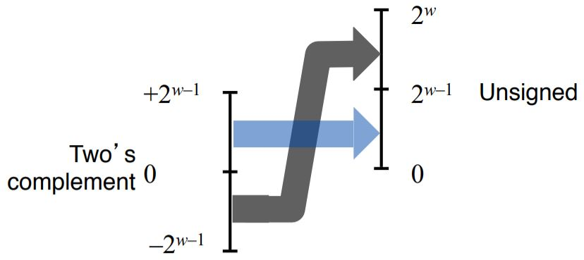

   > 부호형 숫자를 대응하는 비부호형으로 매핑할 때,
   >
   > 음수들은 더 큰 양수들로 변환되지만, 비음수들은 변하지 않고 그대로 남는다.

2. `비부호형`에서 `2의 보수형`으로의 변환

   : 0 ≤ u ≤ UMax*w*인 에 대해서

   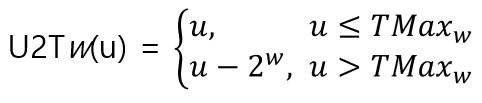

   **유도**

   이러한 특성은 **법칙1.**과 비슷하게 `함수` B2U*w*와 B2T*w*의 수식을 비교하면 유도할 수 있다.

   구하려는 함수가 `합성함수` U2T*w*(u) = B2T*w*(U2B*w*(u))이므로, 비교한 수식을 B2T*w*에 대해 정리하면 된다.

   - 비교: B2U*w*(u) - B2T*w*(u) = 2\*(U*w-1* * 2^(w-1)) = U*w-1* * 2^w

   - 따라서 B2T*w*(u) = B2U*w*(u) - U*w-1* * 2^w 

     - MSB가 0이면, 즉 2^(w-1) - 1(`=TMaxw`)보다 작거나 같은 정수라면 B2T*w*(u) = B2U*w*(u)
     - MSB가 1이면, 즉 2^(w-1) - 1(`=TMaxw`)보다 큰 정수라면 B2U*w*(u) = B2T*w*(u) **- 2^w**

     ∴ U2T*w*(u) = B2T*w*(U2B*w*(u)) 

     ​				   = **B2U*w*(U2B*w*(u))** - U*w-1* * 2^w 

     ​				   = **u** - U*w-1* * 2^w

   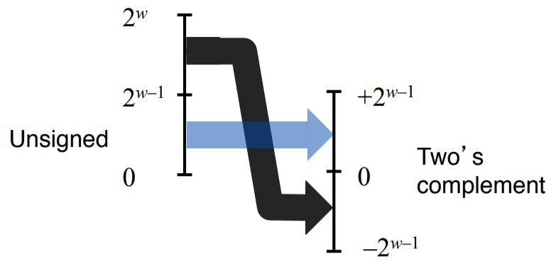

   > 작은(≤ TMax*w*) 수에 대해서, 비부호형에서 부호형으로의 변환은 숫자 값을 그대로 유지한다.
   >
   > 큰(> TMax*w*) 수들은 음수값으로 변환된다.

함수들은 비트패턴을 정수로 해석할 뿐, 비트를 변경하지 않으므로

그 함수들을 합성한 합성함수에 대해서도 입력값과 출력값(결과)의 **비트패턴은 변하지 않는다**.

> 범위 0 ≤ x ≤ TMax*w*를 갖는 x 값에 대해서 T2U*w*(x) = x이고, U2T*w*(x) = x이다.
>
> 즉, 이 범위의 수들은 동일한 비부호형과 2의 보수 표시를 갖는다. 
>
> 이 범위 밖의 값들에 대해 변환하면 2^w를 더하거나 빼야 한다.

### 5) C에서 부호형과 비부호형의 비교

**[변환]**

C는 비부호형과 부호형 간의 `변환`을 **허용**하지만, **C 표준에서 변환이 어떻게 이루어져야 하는지 명확하게 언급하고 있지는 않다**.

하지만 대부분의 시스템은 바로 위에서와 같이 `기본 비트 표시는 바뀌지 않는다`는 규칙을 따른다.

1. 변환은 `명시적인 캐스팅`에 의해 발생할 수 있다.

   ``` c
   int tx, ty;
   unsigned ux, uy;
   
   tx = (int) ux;
   uy = (unsigned) ty;
   ```

2. 한 가지 타입의 수식이 **다른 타입의 변수에 할당**될 때 `묵시적`으로 발생할 수 있다.

   ``` c
   int tx, ty;
   unsigned ux, uy;
   
   tx = ux; /* 부호형으로 캐스트 */
   uy = ty; /* 비부호형으로 캐스트 */
   ```

3. 그 외

   - 숫자 값을 printf로 출력할 때

     : 디렉티브 %d, %u, %x는 수를 부호형 십진수, 비부호형 십진수, 16진수 형식으로 출력하기 위해 사용한다.

     > printf는 타입 정보를 활용하지 않는다.
     >
     > 그래서 int 타입의 값을 디렉티브 %u를 사용해서 출력할 수 있고, unsigned 타입의 값을 %d를 사용해서 출력할 수 있다.

     ``` c
     int x = -1;
     unsigned u = 2147483648; /* 2^31 */
     
     printf("x = %u = %d\n", x, x);
     printf("u = %u = %d\n", u, u);
     ```

     결과(`32비트 프로그램`으로 컴파일):

     ``` c
     x = 4294967295 = -1
     y = 2147483648 = -2147483648
     ```

**[산술연산]**

C는 **모든 정수 데이터 타입에 대해** 부호형과 비부호형 `산술연산`을 지원한다.

일반적으로 대부분의 수들은 기본적으로 `부호형`이다.

- 12345, 0x1A2B - 부호형 상수로 간주
- 12345`U`, 0x1A2B`u` - 비부호형 상수("U", "u" 추가)

C에서 비부호형과 부호형 값들이 섞여 있는 수식을 처리하는 방식

- C는 묵시적으로 **부호형 인자를 비부호형으로 변환**하여 계산한다.
  - 이러한 관습은 관계 연산(<, >)에 대해서 덜 직관적인 결과를 만든다.

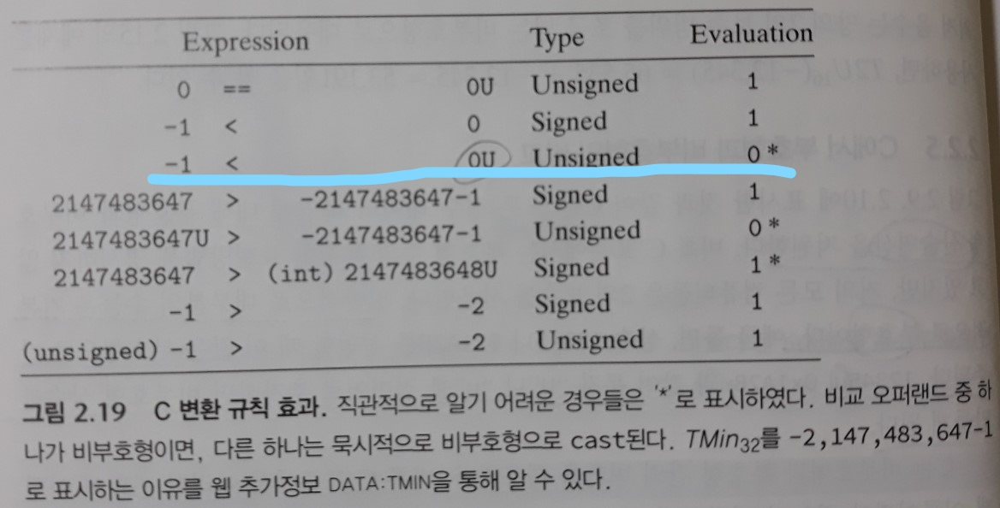

### 6) 수의 비트 표시를 확장하기

값은 동일하게 유지한 채 다른 길이의 워드로 정수를 변환하는 것은 **일반적인 연산**의 하나이다.

보다 작은 길이에서 더 큰 길이의 자료형으로 변환하는 것은 언제나 가능해야 한다.

**법칙**

1. 비부호형 수를 `영의 확장(zero extension)`으로 확대하기

   : 앞에 0들을 추가한다. 

   w´ > w일 때, 길이 w의 비트 벡터 u = [u*w-1*, u*w-2*, . . . , u*0*]와 길이가 w´인 벡터 u´ = [**0, . . . , 0**, u*w-1*, u*w-2*, . . . , u*0*] 에 대해서 B2U*w*(u) = B2U*w´*(u´)가 성립한다.

   **유도**

   **비부호형 인코딩의 정의**로부터 곧바로 도출된다.

   

2. 2의 보수를 `부호 확장(sign extension)`으로 확대하기

   : MSB를 복사해서 앞부분에 추가한다.

   w´ > w인 길이 w의 비트 벡터 x = [x*w-1*, x*w-2*, . . . , x*0*]와 길이가 w´인 벡터 x´ = [**x*w-1*, . . . , x*w-1***, x*w-1*, x*w-2*, . . . , x*0*] 에 대해서 B2T*w*(x) = B2T*w´*(x´)가 성립한다.

   **유도**

   증명은 **k에 대한 귀납법**으로 이루어진다.

   만일 부호 비트를 **1비트 확장**해도 숫자 값을 보존할 수 있다는 것을 증명할 수 있다면, 이 특성은 부호 비트를 임의의 길이로 늘리더라도 만족된다는 것이다.

   그래서 증명 과정을 다음과 같이 단순화할 수 있다.

   ​	B2T*`w+1`*([**x*w-1***, x*w-1*, x*w-2*, . . . , x*0*]) = B2T*w*([x*w-1*, x*w-2*, . . . , x*0*])

   위 식의 좌변을 B2T 함수의 정의대로 전개하면 도출된다.

   - 사용한 주요 성질은 2^w - 2^(w-1) = 2^(w-1)