> # Part 1: 프로그램의 구조와 실행
>
> 컴퓨터 시스템에 대한 탐구는 프로세서와 메모리 서브시스템으로 구성된 컴퓨터 자체를 공부하는 것으로 시작한다.
>
> - 응용 프로그램이 어떻게 표시되고 실행되는지에 대한 깊은 이해를 할 수 있게 된다.
> - 안전하고 안정적인 프로그램을 작성하고, 컴퓨팅 자원을 가장 잘 사용할 수 있도록 하는 기법을 배운다.

# 3장. 프로그램의 기계수준 표현

컴퓨터는 `인코딩`한 연속된 바이트인 **기계어 코드(machine code)를 실행**한다.

컴파일러는 프로그램 언어의 규칙, 대상 컴퓨터의 인스트럭션 집합, 운영체제의 관례 등에 따라 **기계어 코드를 생성**한다.

1. GCC `C 컴파일러`는 기게어 코드를 문자로 표시한 **어셈블리 코드**의 형태로 출력을 만들어 **프로그램의 각 인스트럭션을 만들어 낸다**.
2. 그리고 나서, GCC는 `어셈블러`와 `링커`를 호출하여 어셈블리 코드로부터 실행 가능한 **기계어 코드**를 생성한다.

컴파일러에서는 **타입체크 기능**을 제공한다.

- 프로그램 에러를 검출하는 데 도움을 준다.
- 데이터를 균일하게 참조하고 처리하는 일을 정확히 할 수 있도록 도와준다.

최신 최적화 컴파일러가 만들어 낸 코드는 대부분 잘 훈련된 어셈블리어 프로그래머가 작성한 것과 유사한 효율성을 갖는다.

> 그럼에도 우리가 기계어 코드를 배워야 하는 이유는, 
>
> 컴파일러가 만들어 내는 어셈블리 코드들을 읽고 이해하는 기술은 진정한 프로그래머들에게 매우 중요한 기술이기 때문이다.
>
> - 컴파일러를 적절한 커맨드라인 인자와 함께 호출하면 `어셈블리 코드 형태의 파일`로 출력을 생성한다.
>
> - 이 코드를 이해하면 **컴파일러의 최적화 성능**을 알 수 있으며, **코드에 내재된 비효율성**을 분석할 수도 있다.
>
>   - 고급 언어에서 제공하는 추상화 계층 때문에 이해가 필요한 프로그램의 **런타임 동작**이 감춰지는 경우
>   - 악성 프로그램의 공격 방법 중 상당수가 프로그램이 런타임 제어 정보를 저장하는 방식의 미묘한 차이와 관련 있음 
>
>   => 런타임 동작의 정보는 기계어 코드 수준에서 알 수 있다.

**목표**

- C, 어셈블리 코드, 기계어 코드 간의 관계

  - 이 장에서는 한 개의 특정 어셈블리어(`x86-64`)를 배우고, C 프로그램이 어떻게 이들 기계어 코드 형태로 컴파일 되는지 공부한다.

  - 이것은 `역엔지니어링(reverse engineering)`의 일종이다.

    - 역엔지니어링

      : 시스템이 만들어진 과정을 연구하고 역방향으로 분석하여 이해하려는 작업

- x86-64의 세부 사항들

  : 이 기계어는 요즘 사용하는 대부분의 컴퓨터 뿐만 아니라 대규모 데이터 센터나 슈퍼컴퓨터에서도 이용된다.

  - 데이터의 표현과 처리
  - 제어의 구현
    - C언어에서의 제어 구조인 if, while, switch문들이 어떻게 구현되어 있는지

- 프로시저의 구현

  - 지역변수와 프로시저 간에 데이터와 제어를 전달하기 위한 `런타임 스택`을 프로그램이 어떻게 관리하는지

- 배열, 구조체, 유니온 같은 자료구조들이 기계수준에서 어떻게 구현되었는지

  - out-of-bound 메모리 참조 문제
  - 버퍼 오버플로우 공격에 대한 시스템 취약성

- 부동소수점 데이터와 연산과 관련된 코드의 기계어 표현


컴퓨터 업체들은 최근에 32비트에서 64비트 머신으로 전환했다.

- 32비트 컴퓨터 - **4 GB (2^32)**의 램만 사용 가능
- 64비트 컴퓨터 - 최대 **256 TB (2^48)**의 램 사용 가능. 쉽게 16 엑사바이트(2^64)까지도 확장될 수 있다.

> x86-64 프로세서들의 기능 중에서 GCC와 리눅스에서 사용하는 일부분의 기능들만 다루고자 한다.
>
> 아래의 복잡하고 불가사의한 부분들은 대부분 피할 것이다.
>
> - 초창기 16비트 마이크로프로세서 시절의 레거시를 지원하기 위한 x86-64의 많은 기능들
>
> - 대부분의 개발을 인텔이 주도하였지만, 경쟁사인 AMD(Advanced Micro Devices)도 중요한 기여를 해왔기 때문에 다소 기형적인 설계를 가지게 됨

``` c
*IA32(Intel Architecture 32-bit) 프로그래밍
: x86-64의 전 버전인 IA32는 인텔사에 의해 1985년 소개되었다.
 요즘 판매되는 대부분의 x86 마이크로프로세서와 이들 머신에 설치된 대부분의 운영체제는 x86-64를 실행하기 위해 설계된다.
 그렇지만, 이들은 '역방향 호환성 모드' 때문에 IA32 프로그램들도 실행할 수 있다.
 그 결과로 많은 응용 프로그램들은 여전히 IA32에 기초하고 있다.
```

## 1. 역사적 관점

`x86`이라고 통칭하는 **인텔 프로세서 제품군**은 오랜 기간 진화를 통한 개발을 해 왔다.

- 8086 (1978, 29 K 트랜지스터)

  : 이 제품들은 **최초의 단일칩 `16비트` 마이크로프로세서**로 출발했다.

  - 8087 부동소수점 보조 프로세서(1980, 45 K 트랜지스터)

    : 8086이나 8088과 함께 사용하며 `부동소수점 인스트럭션`을 실행하였다.

    8087은 x86 제품군을 위한 부동소수점 모델을 정립하였으며, "`x87`"이라고 불렸다.

- i386 (1985, 275 K 트랜지스터)

  : 구조를 32비트로 확장. 리눅스와 최신 윈도우 운영체제에서 사용하는 `선형 주소모델` 추가

  **유닉스 운영체제를 완벽하게 지원할 수 있는 최초의 컴퓨터**

- 펜티엄 시리즈 (1993 ~ 2004)

  - 펜티엄 4E (2004, 125 M 트랜지스터)

    - `하이퍼쓰레딩(hyperthreading)` 기법의 추가

      : 두 개의 프로그램을 하나의 프로세서에서 동시에 실행할 수 있는 기법

    - AMD사에서 개발한 IA32의 64비트 확장 구현인 EM64T 추가

      => 이를 `x86-64`라고도 한다.

- Core 시리즈 (2006 ~ 2013)

  - Core2 (2006, 291 M 트랜지스터)

    : P6와 유사한 마이크로 구조로 복귀.

    한 개의 칩 내에 멀티 프로세서를 구현한 **최초의 `멀티코어` 인텔 마이크로프로세서**

    멀티코어를 지원하는 대신 `하이퍼쓰레딩`을 지원하지 않음

    - 이후의 Core i7, Nehalem (2008, 781 M 트랜지스터)부터는 멀티코어와 하이퍼쓰레딩을 함께 지원한다.

> - 초기 8086과 그 확장형인 80286에서 사용하는 메모리 모델은 i386(=선형 주소모델)에서는 더 이상 사용되지 않는다.
> - 오리지날 x87 부동소수점 인스트럭션들은 SSE2가 도입되면서부터는 사용하지 않게 되었다.

각각의 인접한 프로세서는 이전 버전과 **호환성**을 갖도록 설계되었다.

따라서 인스트럭션 집합에는 이러한 진화적인 유산 때문에 많은 이상한 잔재기능들이 존재한다.

- x86

  : IA32 (Intel Architecture 32-bit)

  i3**86**과 i4**86**에서 파생된 명명법이다.

- x86-64

  : Intel64 라고도 부른다.

  Intel64는 IA32의 64비트 확장형이라는 의미로 붙여진 이름이다.

> 비록 이 책에서는 인텔 프로세서들에 대해서만 다루겠지만, 본문 내용은 인텔의 경쟁사가 만든 **호환성이 있는 프로세서**들에도 동일하게 적용된다. 


## 2. 프로그램의 인코딩

C 프로그램을 두 개의 파일 p1.c와 p2.c에 작성한다고 하자.

이 코드를 유닉스 커맨드 라인으로 다음과 같이 컴파일 한다:

``` shell
linux> gcc -0g -o p p1.c p2.c
```

- 명령어는 GCC의 `C 컴파일러`를 지정한다.

  (GCC C 컴파일러가 `리눅스에서 기본 컴파일러`이기 때문에 간단히 cc로 호출할 수도 있다)

- 커맨드 라인 옵션 -0g 

  : 공부를 위해서 본래 C 코드의 전체 구조를 따르는 기계어 코드를 생성하는 `최적화 수준`을 적용

  - GCC 4.8 버전 이상부터 사용 가능한 최적화 수준이다.

일반적으로 최적화 수준을 올리게 되면 최종 프로그램은 더 빨리 동작하게 되지만, 컴파일 시간이 증가하고, 디버깅 도구를 실행하기가 어려워질 위험이 있다.

**gcc** 명령은 `소스 코드`를 `실행 코드`로 변환하기 위해 일련의 프로그램들을 호출한다.

1. C 전처리기

   - #include로 명시된 파일을 코드에 삽입
   - #define으로 선언된 `매크로`를 확장

2. 컴파일러

   : 두 개의 소스파일의 `어셈블리` 버전인 p1.s와 p2.s를 생성

3. 어셈블러

   : 어셈블리 코드를 `바이너리 목적코드`인 p1.o와 p2.o를 생성

   - 목적코드는 **기계어 코드의 한 유형**이다

     ; 모든 인스트럭션의 바이너리 표현을 포함하고 있지만 **전역 값들의 주소는 아직 채워지지 않았다**.

4. 링커

   : 두 개의 목적코드 파일을 `라이브러리 함수`들을 구현한 코드와 함께 합쳐서 `최종 실행파일`인 p를 생성한다.

   (명령줄 디렉티브 -o p)

   - 실행 코드는 **기계어 코드의 두 번째 유형**이다

     ; 실행 코드는 **프로세서가 실행할 정확한 코드의 형태**이다.

### 1) 기계수준 코드

컴퓨터 시스템은 보다 간단한 `추상화 모델`을 이용해서 세부 구현내용을 감추면서 추상화의 여러 가지 다른 형태를 사용하고 있다.

이들 중에 두 가지 **추상화**가 기계수준 프로그래밍에서 특히 중요하다.

1. ISA (인스트럭션 집합구조, Instruction set architecture)

   : 기계수준 프로그램의 **형식**과 **동작**은 `ISA`에 의해 정의된다.

   ISA는 `프로세서의 상태`, `인스트럭션의 형식`, `프로세서 상태에 대한 각 인스트럭션들의 영향들`을 정의한다.

   - ISA는 실제 **프로세서 하드웨어의 추상화**를 제공한다. 

     이러한 추상화로 인해 기계어 코드 프로그램은 마치 한 번에 하나의 인스트럭션을 실행하는 프로세서에서 실행되는 것처럼 동작한다.

   - (x86-64 포함) 대부분의 ISA는 마치 하나의 인스트럭션이 다음 인스트럭션의 실행 전에 완료되는 `순차적인 실행`을 하는 것처럼 프로그램의 동작을 설명한다.

     프로세서 하드웨어는 훨씬 정교해서 여러 인스트럭션을 동시에 실행하지만, `ISA에 의한 순차적 동작`과 일치하는 전체 동작을 보이도록 해주는 **안전장치**를 사용한다.

   - 위와 같이 동일한 실행모델(=순차적인 모델)을 유지하기 때문에, **다른 프로세서에 구현될 때도 동일한 기계어 코드를 실행할 수 있게 된다**.

     - 하지만 그 비용과 성능의 범위는 다양하다. 

2. 가상주소

   : 기계수준 프로그램이 사용하는 주소는 `가상주소`이며, 메모리가 **매우 큰 바이트 배열**인 것처럼 보이게 하는 메모리 모델을 제공한다.

   실제 메모리 시스템은 여러 개의 메모리 하드웨어와 운영체제 소프트웨어로 구현되어 있다.

`컴파일러`는 C에서 제공하는 추상화된 실행모델로 표현된 프로그램을, 프로세서가 실행하는 인스트럭션들로 변환하는 대부분의 일을 수행한다.

- 어셈블리 코드 - 텍스트 형식. 더 읽기 쉽다.

- 기계어 코드 - 바이너리 형식

x86-64를 위한 기계어 코드는 C 코드와 달리 `프로세서의 상태`를 명시한다:

- 프로그램 카운터(PC, x86-64에서는 %rip라고 함)

  : 실행할 다음 인스트럭션의 메모리 주소를 가리킨다.

- 정수 레지스터 파일

  : `64비트 값`을 저장하기 위한 **16개의 이름을 붙인 위치**를 갖는다.

  이들 레지스터는 **주소**(C언어의 포인터에 해당하는)나 **정수 데이터**를 저장할 수 있다.

  - 일부 레지스터는 프로그램의 중요한 `상태`를 추적하는 데 사용
  - 다른 레지스터들은 함수의 `리턴 값`, 프로시저의 `지역변수`와 `인자` 같은 임시 값을 저장

- 조건코드 레지스터

  : **가장 최근에 실행한 산술 또는 논리 인스트럭션에 관한 `상태 정보`**를 저장한다.

  이들은 if나 while문을 구현할 때 필요한 제어나 조건에 따른 데이터 흐름의 변경을 구현하기 위해 사용된다.

- 벡터 레지스터

  : 벡터 레지스터들의 집합은 `하나 이상의 정수`나 `부동소수점 값`들을 각각 저장할 수 있다.

C가 다른 종류의 `데이터 타입`을 **선언**하고 **메모리에 할당**할 수 있는 모델을 제공하는 반면, 기계어 코드는 메모리를 단순히 `바이트 주소지정이 가능한 큰 배열`로 본다. (1byte 단위로 가상주소 할당하기가 가능함)

- 기계어 코드에서는 C에서 배열과 구조체 같은 연결된 데이터 타입들은 **연속된 바이트들**로 표시된다.
- 어셈블리 코드는 스칼라(scalar) 데이터 타입-단 하나의 값만을 저장할 수 있는 데이터 타입-의 경우에도 데이터 타입들 사이를 전혀 구분하지 않는다. (데이터 타입에 관한 모든 정보는 삭제됨)
  - 부호형과 비부호형
  - 포인터와 정수형 사이 등 (어셈블리 코드에는 포인터 데이터 타입이 없음)

**[프로그램 메모리(가상메모리)]**

- 프로그램의 실행 기계어 `코드`, 운영체제를 위한 일부 정보, 프로시저 호출과 리턴을 관리하는 `런타임 스택`, 사용자에 의해 할당된(ex. malloc 라이브러리 함수) 메모리 블록들을 포함하고 있다.
- 가상주소의 일부 제한된 영역만이 `유효`하다.
  - x86-64 가상주소들은 **64비트 워드**들로 표현된다.
  - 현재(책 출시 당시) x86-64 기계들의 구현은 상위 16비트는 0으로 지정되어야 하고, 따라서 주소는 2^48 B = 256 TB 범위까지의 메모리를 이용할 수 있으며, 그 이상은 16엑사바이트(2^64 B)까지도 쉽게 확장될 수 있다.
  - 하지만 전형적인 프로그램들은 오직 몇 MB 혹은 몇 GB에 접근할 것이다.

> **운영체제**는 이 가상 주소공간을 **관리**해서 가상주소를 실제 프로세서 메모리 상의 **물리적 주소 값으로 번역**해준다.

하나의 기계어 인스트럭션은 매우 기초적인 동작만을 수행한다.

`컴파일러`는 **일련의 인스트럭션을 생성**해서 산술연산식의 계산, 반복문, 프로시저 호출과 리턴 등의 프로그램 구문을 구현해야 한다.

### 2) 코드 예제

다음과 같은 **프로시저 정의**를 포함하고 있는 C 코드 파일 mstore.c를 작성한다.

``` c
long mult2(long, long);

void multstore(long x, long y, long* dest){
    long t = mult2(x, y);
    *dest = t;
}
```

C 컴파일러가 생성한 **어셈블리 코드**를 보기 위해서 명령줄에서 `-S` 옵션을 사용할 수 있다.

- 이것은 컴파일러를 실행해서 어셈블리 파일 mstore`.s`를 만들고, 더 이상 진행하지 않는다.

``` shell
linux> gcc -0g -S mstore.c
```

``` c
*지속적으로 변하는 생성된 코드의 형태
 : 다른 컴파일러나 다른 버전의 GCC를 사용하면 다른 코드를 생성한다.
  GCC를 지원하는 오픈소스 커뮤니티는 '마이크로프로세서 생산업체에서 제공하는 변경된 코드 가이드라인'에 따라
  보다 효율적인 코드를 생성하려고 코드 생성기를 지속적으로 수정하고 있다.
```

이 어셈블리 코드 파일은 아래의 내용을 포함한다.

``` assembly
multstore:
	pushq	%rbx
	movq	%rdx, %rbx
	call	mult2
	movq	%rax, (%rbx)
	popq	%rbx
	ret
```

> 코드의 각 라인은 **하나의 기계어 인스트럭션에 대응**된다.
>
> 지역변수 이름이나 데이터 타입에 관한 모든 정보는 삭제되었다.

- pushq 인스트럭션 - `레지스터 %rbx`가 **프로그램 스택에 저장(push)**되어야 한다는 것을 의미한다.


바이너리 형식의 **목적코드(실행코드x)** 파일 mstore.o를 생성하기 위해 명령줄에서 `-c` 옵션을 사용한다.

``` shell
linux> gcc -0g -c mstore.c
```

기계어 코드 파일의 내용을 조사하려면, `역어셈블러(disassembler)`라고 하는 프로그램이 매우 중요해진다.

**[프로그램의 바이트 표현을 표시하는 방법]**

1. `역어셈블러`를 사용하여 mstore에 대한 이진 목적코드를 (어셈블리어 코드와 유사한 형태로)표시한다.

   - 역어셈블러 프로그램들은 기계어 코드로부터 어셈블리어 코드와 유사한 형태를 생성한다.

   - 리눅스 시스템에서 프로그램 OBJDUMP(object dump의 약어)에 `-d` 커맨드 라인을 사용하면 된다.

     ``` shell
     linux> objdump -d mstore.o
     ```

     => 결과를 보면 multstore프로시저를 위한 코드가 14바이트라는 것을 알 수 있다.

2. GNU 디버깅 도구인 `GDB`를 파일 mstore.o와 함께 실행시키고 다음과 같이 명령을 준다.

   ``` shell
   (gdb)x/14xb multstore
   ```

   - 14개의 16진수 형태(x)의 바이트들(b)을 multstore함수가 위치한 주소에서 시작하여 나타내라는(맨 앞의 x) 명령이다.


목적코드 파일에서의 multstore함수:

   ``` 
53 48 89 d3 e8 00 00 00 00 48 89 03 5b c3
   ```

역어셈블리 후 GDB를 사용해서 multstore함수만 나타낸 결과:

``` assembly
0000000000000000 <multstore>:
/*offset	Bytes				동치인 어셈블리어*/
	  0:	53					push	%rbx
	  1:	48 89 d3			mov		%rdx, %rbx
	  4:	e8 00 00 00 00		callq	9 <multstore+0x9> /*mult2 함수 프로토타입만 선언됨*/
	  9:	48 89 03			mov		%rax, (%rbx)
	  c:	5b					pop		%rbx
	  d:	c3					retq
```

기계어 코드의 특징

- x86-64 인스트럭션들은 1에서 15바이트 길이를 갖는다.
  - 자주 사용되는 인스트럭션들, 오퍼랜드가 적은 인스트럭션들 -> 짧은 길이로 인코딩
  - 그 반대의 경우 -> 좀 더 긴 길이로 인코딩
- 인스트럭션의 형식은 **시작 위치의 바이트들로부터 유일하게 디코딩**할 수 있도록 설계한다.
  - ex) pushq %rbx 인스트럭션만이 바이트 값 53으로 시작될 수 있다.

기계어 코드의 역어셈블된 표현

- 역어셈블러는 기계어 코드 파일의 **바이트 순서**에만 전적으로 의존해서 어셈블리 코드를 결정한다.
- 역어셈블러는 GCC가 생성한 어셈블리 코드와는 약간 다른 명명법을 인스트럭션에 사용한다.
  - 많은 인스트럭션들이 접미어 'q'를 생략
  - 반대로 역어셈블러는 접미어 'q'를 call과 ret 명령어에 붙인다.
    - 접미어들은 대부분의 경우에 **생략**할 수 있다.


**실행 가능 코드**를 생성하기 위해서 `링커`를 목적코드들에 대해 실행해야 한다.

- 이들 중 한 개의 파일은 main함수를 포함해야 한다. 

``` shell
linux> gcc -0g -o prog main.c mstore.c
```

파일의 크기가 증가하는 이유는

- 우리가 제공한 두 개의 프로시저,
- 운영체제와 상호작용하기 위한 코드,
- 프로그램을 시작하고 종료하기 위한 코드들까지 포함하기 때문이다.

파일을 다음과 같이 역어셈블 할 수 있다.

``` shell
linux> objdump -d prog
```

역어셈블리 후 GDB를 사용해서 multstore함수만 나타낸 결과:

``` assembly
0000000000400540 <multstore>:
/*offset	Bytes				동치인 어셈블리어*/
400540:		53					push	%rbx
400541:		48 89 d3			mov		%rdx, %rbx
400544:		e8 42 00 00 00		callq	40058b <mult2> /*mult2 함수의 정의가 main.c에 있음*/
400549:		48 89 03			mov		%rax, (%rbx)
40054c:		5b					pop		%rbx
40054d:		c3					retq
40054e:		90					nop
40054f:		90					nop
```

이 코드는 mstore.c를 역어셈블러 해서 생성한 것과 거의 동일하지만 중요한 차이점들이 있다.

1. 왼쪽에 나타낸 주소가 다르다.

   : 링커가 이 코드의 위치를 `다른 주소 영역`으로 이동하였다.

2. 링커가 callq 인스트럭션이 함수 mult2를 호출할 때 사용해야 하는 주소를 채웠다.

   > 링커의 한 가지 임무는 함수들을 위한 실행 코드의 위치들과 함수 호출을 일치시키는 것이다.

3. 두 줄의 라인이 추가되었다.
   : 이들 인스트럭션은 리턴 인스트럭션 후에 발생하기 때문에 프로그램에는 아무 효과가 없다.

   함수를 위한 코드 길이를 **16바이트**로 늘려서 **코드의 다음 블록을 메모리 시스템 성능 면에서 더 잘 배치하기 위해** 삽입되었다.

### 3) 형식에 대한 설명

`컴파일러`에 의해 생성된 mstore.s

``` assembly
	.file	"010-mstore.c"
	.text
	.global	multstore
	.type	multstore, @function
/* void multstore(long x, long y, long* dest) */
/* x in %rdi, y in %rsi, dest in %rdx */
multstore:
	pushq	%rbx		/* Save %rbx */
	movq	%rdx, %rbx	/* Copy dest to %rbx */
	call	mult2		/* Call mult2(x, y) */
	movq	%rax, (%rbx)/* Store result at *dest */
	popq	%rbx		/* Restore %rbx */
	ret					/* Return */
```

- '.'으로 시작하는 모든 라인은 `어셈블러`와 `링커`에게 지시하기 위한 디렉티브(directive)들이다.

  일반적으로 이들은 무시해도 된다.

``` c
*ATT와 인텔 어셈블리 코드 형식
 1. ATT형식
    : 본문에서는 어셈블리 코드를 ATT형식(AT&T사의 이름을 땄다)으로 나타낸다.
     GCC, OBJDUMP, 그 외 다른 여러 도구들에서도 사용하는 기본형식이다.
 2. 인텔 형식
    : 마이크로소프트사와 인텔에서는 인텔형식으로 어셈블리 코드를 보여준다.
     GCC는 다음과 같은 명령어를 사용하면 multstore함수를 인텔 형식의 코드로 생성해준다.
        linux> gcc -0g -S -masm=intel mstore.c
     결과는
        multstore:
			push	rbx
            mov 	rbx, rdx
            call	mult2
            mov		QWORD PTR [rbx], rax
            pop		rbx
            ret
**인텔 형식의 특징
 1. 크기를 나타내는 q 접미어를 생략한다.
 2. '%' 문자를 레지스터 이름 앞에서 생략한다.
 3. 다른 방법을 사용해서 메모리 위치를 나타낸다.
    ex) (%rbx) 대신 QWORD PTR [rbx] 사용
 4. 여러 개의 오퍼랜드를 갖는 인스트럭션들을 역순으로 나열한다. 따라서 매우 혼란스러울 수 있다.
    ex) %rax, (%rbx) 대신 QWORD PTR [rbx], rax 사용
```

**[어셈블리 코드를 C 프로그램과 연동하는 방법]**

C 프로그램으로 접근할 수 없는 하드웨어 기능들이 존재한다.

- ex) 조건코드 PF(parity flag)

어셈블리 코드를 C 프로그램 내에 연결하는 두 가지 방법이 있다.

1. 전체 함수를 별도의 어셈블리 파일로 작성하고, `어셈블러`와 `링커`가 이것을 C로 작성한 코드와 함께 연결하도록 하는 방법

2. GCC의 인라인(inline) 어셈블리 기능을 사용하는 방법

   : 어셈블리 코드의 간단한 영역을 C 프로그램에서 **asm 디렉티브**를 사용해서 연결하는 것이다.

   이 방법은 기계어와 관련된 코드의 양을 최소화 할 수 있다는 장점이 있다.

> 어셈블리 코드를 C 프로그램 내에 삽입하면 코드를 특정한 종류의 컴퓨터(x86-64 같은)에 국한하게 된다.
>
> 따라서 원하는 기능이 오직 이러한 방법으로만 구현할 수 있는 경우로 제한되어야 한다.


## 3. 데이터의 형식

인텔 프로세서들이 근본적으로 `16비트 구조`를 사용하다가 추후에 `32비트`로 확장했기 때문에 인텔은 **"워드"**라는 단어를 **16비트 데이터 타입**을 말할 때 사용한다.

- 워드 = 16비트
- 더블워드 = 32비트
- 쿼드워드 = 64비트

**[C에서 기본 데이터 타입에 사용되는 x86-64표시]**

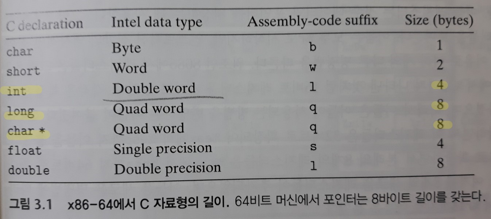

- 표준 int값 - `더블워드`로 저장(32비트)
- 포인터 - 64비트 머신이므로 `쿼드워드`로 저장(64비트)
- long - **x86-64에서 64비트로 구현됨.** `쿼드워드`로 저장

> 이 장의 대부분의 코드 예제들은 **포인터**와 **long** 데이터 타입을 이용하며, 그래서 이들은 `쿼드워드`로 동작한다.

x86-64 인스트럭션 집합은 쿼드워드(64비트 머신) 외에도 바이트, 워드, 더블워드를 위한 **보조 인스트럭션**들도 포함한다.

`GCC`가 생성한 대부분의 어셈블리 코드 인스트럭션들은 **오퍼랜드의 크기를 나타내는 접미어**를 가지고 있다.

- 데이터 이동 인스트럭션

  - movb (바이트 이동)

  - movw (워드 이동)

  - mov`l` (더블워드 이동)

    : 32비트 양(4바이트 정수)이 "long word"로 간주되기 때문

  - movq (쿼드워드 이동)

> 부동소수점의 경우에는 완전히 다른 인스트럭션과 레지스터들을 사용한다.
>
> 따라서 어셈블리 코드가 접미어 '`l`'을 4바이트 정수뿐만 아니라 8바이트 더블 정밀도 부동소수점 수를 나타내기 위해서도 사용한다는 사실이 혼란을 야기하지는 않는다.

부동소수점 숫자에는 두 개의 기본 형태가 있다:

1. C의 float 타입에 대응되는 단일 정밀도(4바이트) 값
2. C의 double 타입에 대응되는 이중 정밀도(8바이트) 값

x86 계열의 마이크로 프로세서들은 역사적으로 특별한 80비트(10바이트) 부동소수점 형식으로 동작하는 부동소수점 연산을 구현하였다.

이 형식은 C 프로그램에서는 long double을 선언해서 명시할 수 있다.

그러나 이 형식을 이용하지 않는 것을 추천한다.

- x86 머신이 아닌 다른 종류의 머신들에서는 호환성이 없고,
- 단일 정밀도와 이중 정밀도 산술연산을 위한 경우에서와 동일한 고성능의 하드웨어로 구현되어 있지 않다.


## 4. 정보 접근하기

x86-64 주처리장치 CPU는 **64비트 값**을 저장할 수 있는 **16개의 범용 레지스터(정수 레지스터)**를 보유하고 있다.

이들 레지스터는 `정수 데이터`와 `포인터`를 저장하는 데 사용한다.

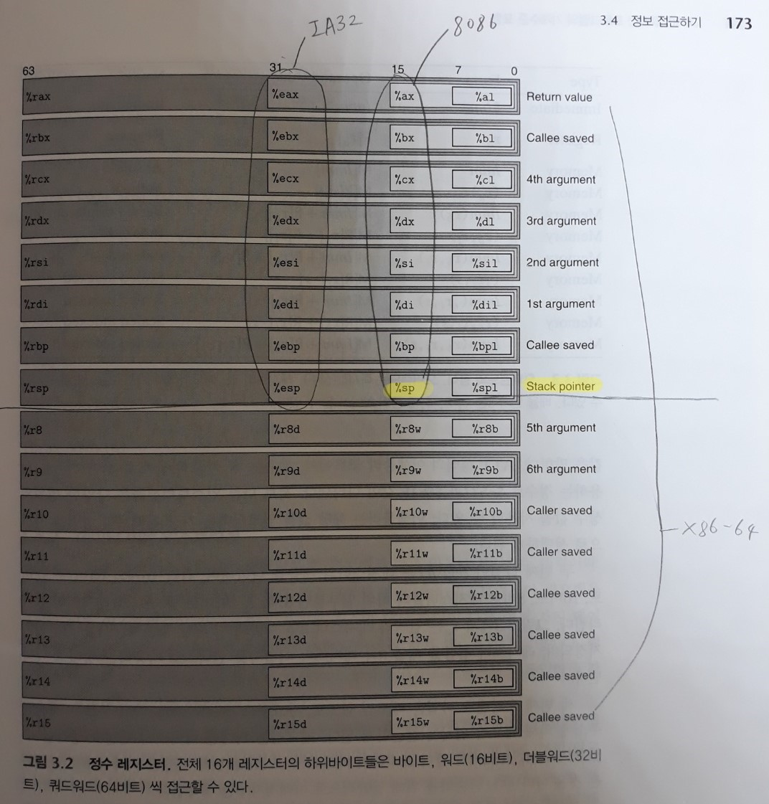

이름은 모두 **%r**로 시작하지만, 인스트럭션 집합의 역사적인 진화 과정을 이유로 여러 개의 다른 명명법을 따른다.

- 8086

  : %ax에서 %sp까지 `16비트` 레지스터를 가짐

  각각은 **특정한 목적**을 가졌으며, 따라서 사용되는 방법을 반영하는 이름을 붙였다.

- IA32로 확장

  : 이 레지스터들은 `32비트`로 확장되어 %**e**ax에서 %**e**sp까지 이름을 붙였다.

- x86-64로 확장

  : 본래의 8개 레지스터들은 %**r**ax에서 %**r**sp까지 `64비트`로 확대되었다.

  여기에 8개의 새로운 레지스터들이 추가되었으며, 이들은 새로운 명명법에 따라 %**r**8에서 %**r**15까지로 이름을 붙였다.

인스트럭션들은 16개의 레지스터 하위 바이트들에 저장된 다양한 크기의 데이터에 대해 연산할 수 있다.

- 바이트 수준 연산 - LSB에 대해 접근해서 연산을 할 수 있다.
- 16비트 연산 - LSB부터 2바이트에 접근 가능
- 32비트 연산 - LSB부터 4바이트에 접근 가능
- 64비트 연산 - 레지스터 전체에 접근 가능

1, 2, 4, 8바이트 값들을 `복사`하고 `생성`하는 인스트럭션들이 있다.

이 인스트럭션들이 **레지스터들을 목적지로 할 때**에는 8바이트보다 작은 바이트를 `생성`하는 인스트럭션들의 레지스터에서 남는 바이트들에 대해 어떻게 처리해야 하는지 결정해야 한다.

1. 1 또는 2바이트를 생성하는 경우에는 나머지 바이트들은 변경 없이 그대로 유지된다.

2. 4바이트 길이의 값을 생성하는 경우는 상위 4바이트를 0으로 설정한다.

   이러한 방식은 IA32에서 x86-64로 오면서 채택한 방식이다.


> 일반적인 프로그램에서 서로 다른 레지스터들은 서로 다른 목적으로 이용된다.

가장 특이한 스택 포인터를 제외하고 다른 15개의 레지스터들은 사용이 좀 더 자유롭다.

- 스택 포인터 %rsp

  : `런타임 스택`의 끝부분을 가리키기 위해 사용됨.

  **일부 인스트럭션들은 특별히 이 레지스터를 읽고 쓴다.**

몇 개의 인스트럭션들은 특정 레지스터들에 국한되어 사용한다.

중요한 것은 '레지스터가 어떻게 사용되는지'는 `일련의 표준 프로그래밍 관습(프로시저 구현방법 등의 관례)`에 의해 정해진다는 점이다.

- 스택을 관리
- 함수의 인자 넘기기
- 함수에서 값을 리턴하기
- 로컬 데이터와 임시 데이터를 저장

### 1) 오퍼랜드 식별자(specifier)

대부분의 인스트럭션은 하나 이상의 `오퍼랜드`를 가진다.

오퍼랜드는 연산을 수행할 **소스(source) 값**과 그 결과를 저장할 **목적지(destination)의 위치**를 명시한다.

- 소스 값 - `상수`로 주어지거나 `레지스터`나 `메모리`로부터 읽을 수 있다.
- 결과 값 - `레지스터`나 `메모리`에 저장된다.

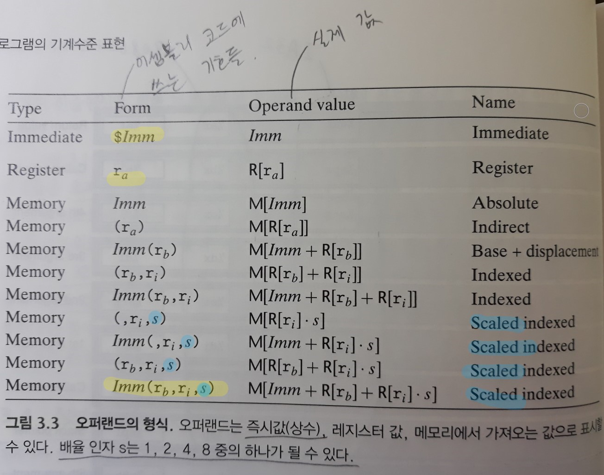

**[오퍼랜드의 종류(x86-64, ATT 형식)]**

1. immediate (즉시값)

   : 상수값을 말한다.

   - 어셈블리 코드에서 쓰는 기호 - `$ 기호 + C 표준 서식을 사용하는 정수` ex) $-577, $0x1F

   - 실제 값 - $ 기호를 뺀 `C 표준 서식을 사용하는 정수`

   인스트럭션에 따라 다양한 범위의 상수 값을 사용할 수 있다.

   - **어셈블러**는 해당 값을 인코딩하는 **가장 컴팩트한 방법을 자동으로 선택**한다.

2. register (레지스터 값)

   : 각각 16개의 64비트, 32비트, 16비트, 8비트 레지스터들의 하위 일부분인 8, 4, 2, 1바이트 중에, 하나의 레지스터를 가리킨다.

   - 어셈블리 코드에서 쓰는 기호 - `r_a`는 임의의 레지스터 a를 나타낸다.
   - 실제 값 - 해당 값은 `R[r_a]`을 참조하여 지정되며, 레지스터 집합을 배열 R과 레지스터 식별자를 인덱스로 사용하는 형태로 나타낸다.

3. 메모리(= 가상메모리) 참조

   : **유효주소(effective address)**라고 부르는 계산된 주소에 의해 메모리 위치에 접근하게 된다.

   - 실제 값 - `M_b[Addr]`. 메모리는 거대한 바이트의 배열 M으로 생각하고(= 가상메모리) <u>메모리 주소 Addr(= 유효주소)</u>부터 저장된 b 바이트를 참조하는 것을 나타낸다.

     (단순화를 위해 일반적으로 아래첨자 b는 생략한다)

   여러 가지 유형의 메모리 참조를 가능하게 하는 많은 **주소지정방식**이 존재한다.

   - 가장 일반적인 형태 `Imm(r_b, r_i, s)`

     - 상수 오프셋 Imm
     - 베이스 레지스터 r_b - 64비트 레지스터
     - 인덱스 레지스터 r_i - 64비트 레지스터
     - 배율 s - 1, 2, 4, 8의 값을 가짐

     : **유효주소**는 Imm + R[r_b] + R[r_i]*s 로 계산된다.

     이 형태는 `배열`의 원소를 참조할 때 종종 볼 수 있다.

     > 위 그림에서 다른 형태들은 모두 이들 구성요소의 일부가 생략된 특별한 경우이다. 

   - 배열과 구조체 원소의 참조

     : 보다 복잡한 주소지정방식이 필요함

### 2) 데이터 이동 인스트럭션

가장 많이 사용되는 인스트럭션은 데이터를 한 위치에서 다른 위치로 `복사`하는 명령이다. (= 데이터 이동)

- 인스트럭션 클래스

  : 클래스의 인스트럭션들은 동일한 동작을 **다른 오퍼랜드 크기(1, 2, 4, 8바이트)**를 사용하여 수행한다.

**[데이터 이동 인스트럭션]**

- MOV 클래스

  ``` assembly
  MOV		S, D	/* D <- S */
  /* ==================================== */
  movb
  movw
  movl
  movq
  movabsq	I, R 	/* R <- I, Move absolute quad word */
  ```

  : 데이터 이동 인스트럭션의 가장 간단한 형태.

  이 인스트럭션들은 `소스 위치`에서 데이터를 `목적지 위치`로 **어떤 변환도 하지 않고 복사**한다.

  `movl의 한 가지 경우`을 제외하고, 특정 레지스터 바이트들이나 지정된 메모리 위치만을 업데이트할 것이다.

  > movl이 레지스터를 목적지로 갖는 경우
  >
  > - 레지스터의 상위 4바이트도 0으로 설정한다.
  > - IA32에서 x86-64로 오면서 채택된 관습 때문에 이러한 예외가 생겨났다.
  >   - 어떤 레지스터(64비트)를 위한 32비트 값을 `생성`하는 인스트럭션은 레지스터의 남은 상위 4바이트를 0으로 설정한다.

  - 소스 오퍼랜드 - 상수, <u>레지스터</u> 저장 값, 메모리 저장 값

  - 목적 오퍼랜드 - <u>레지스터</u> 또는 메모리 주소의 위치를 지정

    => 레지스터 오퍼랜드는 레지스터 16개 중에서 이름을 붙인 부분이 되며, 여기서 레지스터의 크기는 인스트럭션의 마지막 문자('b', 'w', 'l', 'q')가 나타내는 크기와 일치해야 한다.

  > x86-64는 `데이터 이동 인스트럭션`에서 **두 개의 오퍼랜드(소스, 목적)가 동시에 `메모리 위치`가 될 수 없도록** 제한하고 있다. 
  >
  > => 하나의 **메모리** 위치에서 다른 위치로 어떤 값을 복사하기 위해서는 두 개의 인스트럭션이 필요하다.
  >
  > 1. 소스 값을 레지스터에 적재하는 인스트럭션
  > 2. 이 레지스터의 값을 목적지에 쓰기 위한 인스트럭션

  - `movabsq`

    : 임의의 **64비트 상수 값**을 `소스 오퍼랜드`로 가질 수 있으며, `목적지`로는 **레지스터**만을 가질 수 있는 인스트럭션

    - `레지스터(목적지) movq 인스트럭션`은 오직 **32비트 2의 보수 숫자로 나타낼 수 있는 상수** `소스 오퍼랜드`들만을 갖는다.

      이 값은 그 후 64비트 레지스터 목적지를 위해 **부호 확장(2의 보수 확장)되어 64비트 값**을 생산한다.

**[작은 소스 값을 더 큰 목적지(레지스터만 가능)로 복사할 때 사용하기 위한 데이터 이동 인스트럭션]**

- 두 종류의 인스트럭션 모두 아래와 같다.
  - 소스 오퍼랜드 - 레지스터 저장 값, 메모리 저장 값
  - 목적 오퍼랜드 - **레지스터**의 위치를 지정

- 이 명령들의 이름에는 마지막 두 개의 문자가 크기를 나타내는 지시자를 갖는다.
  
- 첫 번째는 소스의 크기, 두 번째는 목적지의 크기
  
- 이들 클래스에는 세 개의 인스트럭션이 각각 포함되며, 이들은 1, 2바이트 소스 크기와 2, 4바이트 목적지 크기를 지원한다.

  물론 목적지가 소스보다 더 긴 경우들에 대해서만 다룬다.

  - 목적지의 크기가 **8바이트(64비트)**인 경우는 조금 특이하다. 

- MOVZ 클래스 (Move with zero extension)

  ``` assembly
  MOVZ	S, R 	/* R <- ZeroExtend(S) */
  /* ==================================== */
  movzbw			/* byte to word */
  movzbl			/* byte to double word */
  movzwl			/* word to double word */
  /* movzbq */
  /* movzwq */
  ```

  : 목적지의 남은 바이트들을 모두 0으로 채워준다.

  - 4바이트 소스 값을 8바이트 목적지로 **0으로 확장(MOVZ)**하는 인스트럭션은 존재하지 않는다.

  - 대신, 이런 유형의 데이터 이동은 `레지스터를 목적지로 하는 movl 인스트럭션`을 이용해서 구현될 수 있다.

    이러한 기술은 레지스터를 목적지로 이용해서 4바이트 값을 `생성`하는 인스트럭션이 상위 4바이트를 0으로 채울 수 있다는 성질을 활용한다.

  - 반면에 8바이트 목적지로, **부호 확장(MOVS)**으로 이동하는 것은 세 종류의 소스에 대해 모두 지원된다.

    - movsbq, movswq, movslq

- MOVS 클래스 (Move with sign extension)

  ``` assembly
  MOVS	S, R 	/* R <- SignExtend(S) */
  /* ==================================== */
  movsbw
  movsbl
  movswl
  /* movsbq */
  /* movswq */
  /* movslq */
  cltq		 	/* %rax <- SignExtend(%eax) */
  ```

  : 목적지의 남은 바이트들을 `부호 확장`으로 채운다. (소스 오퍼랜드의 MSB-bit-를 반복해서 복사)

  - `cltq`

    : 이 인스트럭션은 **오퍼랜드가 없다**.

    언제나 레지스터 %**e**ax (32비트)를 소스로, %**r**ax (64비트)를 목적지로 사용해서 `부호 확장` 결과를 만든다.

    이것은 `movslq %eax, %rax`와 정확히 동일한 효과를 내지만, 좀 더 **압축적인 인코딩**을 갖는다.

``` assembly
*바이트 이동 인스트럭션
 - MOV, MOVZ, MOVS 클래스 인스트럭션 비교(목적지가 '레지스터'인 경우)
 : MOV클래스의 movl를 제외하고 movb, movw는 목적지의 상위 바이트들을 변경하지 않는다.
  반면에, MOVZ와 MOVS 클래스의 인스트럭션들은 목적지의 상위 바이트들을 변경한다.
     => 값을 확장해서 데이터 이동
  	movabsq	$0x0011223344556677, %rax	%rax = 0011223344556677
  	movb	$0xAA, %dl					%dl = AA
  	movb 	%dl, %al					%rax = 00112233445566AA /* 상위 바이트 변경x */
	movsbq	%dl, %rax					%rax = FFFFFFFFFFFFFFAA /* 부호 확장 */
	movzvq	%dl, %rax					%rax = 00000000000000AA	/* 0 확장 */
```

### 3) 데이터 이동 예제

C 코드:

``` c
// call by reference - xp는 포인터 변수이므로 주소를 저장함
long exchange(long* xp, long y){
    long x = *xp;
    *xp = y;
    return x;
}
```

`GCC`가 생성한 어셈블리 코드:

``` assembly
/* xp in %rdi, y in %rsi */
exchange:
	movq	(%rdi), %rax	/* 메모리의 주소 xp에서 값을 읽어 x를 얻고, 그 값을 리턴값으로 셋팅 */
	movq	%rsi, (%rdi)	/* 값 y를 메모리 주소 xp에 저장 */
	ret
```

> **함수의 인자**들은 `레지스터`로 함수에 전달된다.
>
> - **리턴 값을 레지스터 %rax에 저장**해서 함수가 값을 리턴하거나, 이 레지스터의 하위 부분 중의 하나로 리턴한다.

1. 프로시저가 **실행**을 시작하면, 프로시저 매개변수 xp와 y는 레지스터 `%rdi`와 `%rsi`에 저장된다.

2. 이 예제는 어떻게 MOV 인스트럭션을 이용해서 메모리에서 레지스터로 읽어들이는지(2번 줄), 

   레지스터에서 메모리로 쓰는지(3번 줄) 보여준다.

[예제 어셈블리 코드의 특징]

1. C언어에서 "`포인터`"라고 부르는 것이 어셈블리어에서는 단순히 **(가상메모리)주소**라는 점이다.

   - 포인터를 **역참조(dereferencing, 연산자 `*`)**하는 것은 포인터를 레지스터에 복사하고, **=> 어셈블리어의 관점에서는 주소를 레지스터에 복사하는 것**
   - 이 레지스터를 가상메모리 참조에 사용하는 과정으로 이루어진다.

2. x 같은 **지역변수**들은 메모리에 저장되기보다는 종종 레지스터에 저장된다.

   레지스터의 접근은 메모리보다 속도가 훨씬 더 빠르다.

``` c
*포인터
 - & : 주소화 연산자. 이 예제에서는 지역변수 a를 저장하고 있는 위치의 주소를 '생성'한다.
 - * : 역참조 연산자.
     long a = 4;
	 long b = exchange(&a, 3);
```

### 4) 스택 데이터의 저장과 추출 push, pop

``` assembly
pushq	S	/* R[%rsp] <- R[%rsp]-8; 
			   M[R[%rsp]] <- S 		*/
popq	D	/* D <- M[R[%rsp]];
			   R[%rsp] <- R[%rsp]+8 */
```

마지막으로 두 개의 **데이터 이동 연산**을 더 살펴본다.

`프로그램 스택`에 데이터를 **저장(push)**하거나 스택에서 데이터를 **추출(pop)**하기 위해 사용한다.

> 스택은 **프로시저 호출**을 처리하는 데 중요한 역할을 한다. 

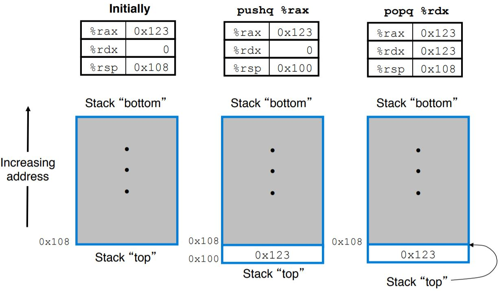

x86-64에서 프로그램 스택은 **(가상)메모리의 특정 영역에 위치**한다.

관습적으로 스택의 아래위가 뒤바뀐 형태로, <u>스택의 맨 위가 그림의 아래에 위치</u>하도록 그린다.

(<u>스택이 성장할수록 top이 가리키는 주소가 작아지기 때문에</u>, 스택이 아래 방향으로 성장하는 것처럼 그림)

- 스택의 `top 원소`가 모든 스택 원소 중에서 가장 낮은 주소를 갖는다.
- 스택은 아래 방향으로 성장한다.
- 스택 포인터 레지스터 `%rsp`는 스택 맨 위 원소의 주소(`= top`)를 저장함

**[스택 데이터 이동 인스트럭션]**

- popq

  : 데이터를 추출함

  - 오퍼랜드 - 추출을 위한 데이터 목적지

  쿼드워드를 pop하는 것은 스택 탑 위치에서의 읽기 작업 후에, 스택 포인터를 8 증가시키는 것으로 구현된다.

  따라서 `pop %rax`는 다음 한 쌍의 인스트럭션과 동일하다.

  ``` assembly
  movq	(%rsp), %rax
  addq	$8, %rsp
  ```

  > 예를 들어, popq에 의해 값 0x123을 메모리에서 읽어서 레지스터에 기록했다고 하자.
  >
  > 그러면 레지스터 %rsp가 8 증가해도, 직전에 %rsp가 가리키던 위치에 저장되었던 값 0x123은 **다른 값이 덮어써질 때가지 메모리 주소에 여전히 남아 있다**(예를 들어 다른 push 연산에 의해서).
  >
  > - 그렇지만 스택 top은 언제나 %rsp가 가리키는 주소를 의미하므로, 스택 top보다 윗부분에 저장된 값은 모두 무효인 값들이다.

- pushq

  : 데이터를 스택에 추가함

  - 오퍼랜드 - 추가할 소스 데이터

  쿼드워드 값을 스택에 추가하려면, 먼저 스택 포인터를 8 감소시키고, 그 값을 스택 주소의 새로운 top(`%rsp` 위치)에 기록하는 것으로 구현된다.

  따라서 `pushq %rbp`는 다음 한 쌍의 인스트럭션과 동일하다.

  ``` assembly
  subq	$8, %rsp
  movq	%rbp, (%rsp)	/* %rsp가 가리키는 가상메모리 주소에 %rbp값 저장 */
  ```

  위의 두 개의 인스트럭션은 총 **8바이트**가 필요하지만, pushq 인스트럭션은 **1바이트**의 기계어 코드로 인코딩 된다.

스택이 **프로그램 코드**, **다른 형태의 프로그램 데이터(힙, 전역 데이터)**와 함께 `동일한 메모리(가상메모리)`에 저장되기 때문에

프로그램들은 `표준 메모리 주소지정 방법(유효주소, effective address)`을 사용해서 top 외에도 스택 내 임의의 위치에 접근할 수 있다.

- ex) 스택 최상위 원소가 쿼드워드라면, `movq 8(%rsp), %rdx` 인스트럭션은 스택의 두 번째 쿼드워드를 레지스터 %rdx에 복사한다.


## 5. 산술연산과 논리연산

오퍼랜드의 길이에 따른 다양한 변형이 가능하기 때문에 대부분의 연산을 `인스트럭션 클래스`에 따라 나열했다.

(`leaq`만은 길이에 따른 변형이 없다)

- 각 인스트럭션 클래스는 네 개의 서로 다른 크기의 데이터 연산을 갖는다: b, w, l, q

### 1) 유효주소 적재(Load Effective Address)

``` assembly
leaq	S, D	/* D <- &S */
```

유효주소 적재 인스트럭션 leaq는 실제로는 `movq 인스트럭션의 변형`이다.

- 메모리에서 레지스터로 읽어들이는 인스트럭션의 형태를 갖지만, **메모리를 전혀 참조하지 않는다**.
  - 인스트럭션의 첫 번째 오퍼랜드는 일종의 메모리 참조처럼 보이지만, 가리키는 위치에서 `읽기`를 수행하는 대신에 **유효주소**를 목적지에 복사한다.
- 소스 오퍼랜드 - 메모리 참조 오퍼랜드 *형식(form)을 따른다*. (3.4.1 표)
- 목적 오퍼랜드 - 반드시 **레지스터**만 올 수 있다.

사용 목적

1. 나중의 메모리 참조에 사용하게 되는 **포인터를 생성**하기 위해 사용한다.

   : `C 주소 연산자 &S`를 사용해서 이러한 계산을 수행할 수 있다.

2. 일반적인 **산술연산을 간결하게** 설명하기 위해 사용된다.

   - 레지스터 %rdx가 x를 가지고 있다면, 인스트럭션 `leaq 7(%rdx, %rdx, 4), %rax`는 레지스터 `%rax`에 5x + 7을 저장한다.
     - 유효주소 계산: 7(%rdx, %rdx, 4) => 7 + R[%rdx] + R[%rdx]*4 = 5x + 7
     - 메모리 참조 오퍼랜드를 사용할 때만 쓸 수 있었던 `유효주소 계산`을 사용한 후, 그 계산된 주소의 메모리 위치로 가서 읽지 않고 **계산된 유효주소(산술연산 결과)**만 그대로 레지스터에 저장된다.
       - `유효주소 계산` 자체는 메모리 참조 오퍼랜드를 사용할 수 있는 모든 명령에서 사용 가능함
       - 계산과정에서 레지스터를 읽기는 하지만(R[%rdx]), 메모리 참조보다 접근 속도가 훨씬 빠르다.
   
   > 컴파일러는 자주 실제 유효 주소계산과 무관한 경우에 leaq를 적절히 사용한다.
   

C 코드:

``` c
   long scale(long x, long y, long z){
       long t = x + 4*y + 12*z;
       return t;
   }
```

   컴파일 후:

   ``` assembly
   /* x in %rdi, y in %rsi, z in %rdx */
   scale:
   	leaq	(%rdi, %rsi, 4), %rax	/* x + 4*y --> 짝수 상수인 경우, 곱셈 후 2개 항 덧셈 가능 */
   	leaq	(%rdx, %rdx, 2), %rdx	/* z + 2*z = 3*z --> 홀수 상수인 경우, 곱셈만 하는데 인스트럭션 하나 필요 */
   	leaq	(%rax, %rdx, 4), %rax	/* (x+4*y) + 4*(3*z) = x + 4*y + 12*z */
   	ret
   ```

   `leaq` 인스트럭션이 **덧셈**과 **제한된 형태의 곱셈**을 할 수 있는 능력은 간단한 수식을 컴파일할 때 유용하다.

   - 배율 인자s는 1, 2, 4, 8 중의 하나만 가능하므로 상수곱셈이 제한된다.
   
     그래서 3*z = z + 2\*z 로 계산해서 구한다.
   
   - x + a*y (a = 1, 2, 4, 8) 형태 뿐 아니라, 모든 '메모리 참조 오퍼랜드' 형식에서 계산할 수 있는 `유효주소 공식`을 표현할 수 있다.

### 2) 단항 및 이항 연산

- 단항(unary) 연산

  ``` assembly
  INC		D		/* D <- D+1 */
  DEC		D		/* D <- D-1 */
  NEG		D		/* D <- -D */
  NOT		D		/* D <- ~D */
  ```

  : 하나의 오퍼랜드가 소스와 목적지로 동시에 사용된다.

  - 오퍼랜드 - 레지스터, 메모리 위치
  - ex) `incq (%rsp)` - 스택 top의 8바이트(q) 원소의 값을 증가시켜준다.
    - 이 문법은 C에서의 `증가(++)`와 `감소(--) 연산자`를 연상시킨다.

- 이항(binary) 연산

  ``` assembly
  ADD		S, D		/* D <- D+S */
  SUB		S, D		/* D <- D-S */
  IMUL	S, D		/* D <- D*S */
  XOR		S, D		/* D <- D^S */
  OR		S, D		/* D <- D|S */
  AND		S, D		/* D <- D&S */
  ```

  : 두 번째 오퍼랜드는 소스이면서 목적지로 사용된다.

  > 이항 연산을 할 때, 연산자 앞에 목적지가 먼저 오고, 연산자 뒤에 소스가 온다.

  - 첫 번째 오퍼랜드 - 상수, 레지스터, 메모리 위치

    두 번째 오퍼랜드 - 레지스터, 메모리 위치

  - ex) `subq %rax, %rdx` - 레지스터 %rdx에서 %rax 값만큼 빼준다.

    - 이 문법은 C에서의 `할당 연산자`인 x `-=` y 같은 문장과 유사하다.

  - 이항 연산은 **비교환성(noncommutative) 연산**이다.

    - `교환법칙`을 만족하지 않는 연산
    - 목적 오퍼랜드의 값만 변경되기 때문이다.

  > x86-64는 MOV 인스트럭션에서처럼, `이항 연산 인스트럭션`에서 **두 개의 오퍼랜드(소스, 목적)가 동시에 `메모리 위치`가 될 수 없도록** 제한하고 있다.
  >
  > => 하나의 **메모리** 위치에서 다른 위치로 어떤 값(**= 연산 결과**)을 복사하기 위해서는 두 개의 인스트럭션이 필요하다.
  >
  > 1. 소스 값을 레지스터에 적재하는 인스트럭션
  > 2. 이 레지스터의 값을 목적지에 쓰기 위한 인스트럭션

### 3) 쉬프트 연산

``` assembly
SAL		k, D		/* D <- D << k */
SHL		k, D		/* D <- D << k --> SAL와 같다. */
SAR		k, D		/* D <- D >> K_Arithmetic */
SHR		k, D		/* D <- D >> K_Logical */
```

산술형과 논리형 우측 쉬프트가 모두 가능하다.

- 첫 번째 오퍼랜드 - 쉬프트하는 크기 (**Immediate-즉시값**- 또는 **단일 바이트 레지스터 %cl**)

  두 번째 오퍼랜드(목적 오퍼랜드) - 쉬프트할 값  (**레지스터**나 **메모리 위치**)

  > 쉬프트 연산 인스트럭션들은 이 특정 레지스터 `%cl`만을 오퍼랜드로 허용한다.

  - 1바이트 쉬프트 양의 범위는 0 ~ (2^8 - 1) = 255까지 가능하다.

  - x86-64에서는 **w비트 길이의 데이터 값**에 적용하는 쉬프트 연산은 레지스터 `%cl`의 **하위 m비트**로 쉬프트 양을 결정하며,

    **2^m = w**의 관계가 성립한다. 이때 쉬프트 양은 0 ~ (2^m-1) = w-1의 범위를 갖는다. 

  - ex) 레지스터 `%cl`이 16진수 값 0xFF를 가질 때,

    - salb - 7만큼 쉬프트 (2^3 = 8, 하위 3비트)
    - salw - 15만큼 쉬프트 (2^4 = 16, 하위 4비트)
    - sall - 31만큼 쉬프트 (2^5 = 32, 하위 5비트)
    - salq - 63만큼 쉬프트 (2^6 = 64, 하위 6비트)

  ``` c
  *왜 2^m 이상, 즉 w비트 데이터에서 k ≥ w인 k로 쉬프트하지 않는가?
   : w 이상의 값으로 쉬프트하는 동작은 C 표준에서 보장되지 않기 때문이다.
    따라서 쉬프트하는 양은 쉬프트 되는 값의 비트 수보다 작도록 유지해야 한다.
  ```

좌측 쉬프트 인스트럭션

- SAL
- SHL
  - 모두 동일한 효과를 내며, 우측에서부터 **0**을 채운다.

우측 쉬프트 인스트럭션

- SHR - 논리 쉬프트(**0**으로 채운다)
- SAR - 산술 쉬프트(**부호 비트**를 복사해서 채운다)

### 4) 토의

> 앞에서 봤던 대부분의 **정수 산술 연산** 인스트럭션들은 **`비부호형`과 `2의 보수형`의 산술연산**에 사용될 수 있다.
>
> 오직 **우측 쉬프트**만이 `부호형`과 `비부호형` 데이터를 구분하는 인스트럭션을 요구한다.
>
> - `부호형` 정수 데이터의 연산에서는 **산술 우측 쉬프트**를 사용한다.
>   - 이것은 C 표준에는 정의되어 있지 않지만, 실제로 대부분의 컴파일러/컴퓨터 조합들은 부호형 데이터에 대해서 산술 우측 쉬프트를 사용하고 있다.
> - `비부호형` 데이터에 대해서는 **논리 우측 쉬프트**여야 한다.
>
> => 이것이 **부호형 정수 산술연산을** 구현하는 방식으로 `2의 보수 산술연산`을 선호하는 주요 특징이다.

산술연산을 수행하는 C 함수:

``` c
long arith(long x, long y, long z){
    long t1 = x ^ y;
    long t2 = z * 48;
    long t3 = t1 & 0x0F0F0F0F;
    long t4 = t2 - t3;
    return t4;
}
```

어셈블리 코드로 번역:

``` assembly
/* x in %rdi, y in %rsi, z in %rdx */
arith:
	xorq	%rsi, %rdi				/* t1 = x ^ y */
	leaq	(%rdx,%rdx,2), %rax		/* 3*z */
	salq	$4, %rax				/* t2 = 16 * (3*z) = 48*z */
	andl	$252645135, %edi		/* t3 = t1 & 0x0F0F0F0F */
	subq	%rdi, %rax				/* Return t2 - t3 */
	ret
```

- z * 48은 `leaq`와 `쉬프트 인스트럭션`을 결합해서 계산한다.

일반적으로 **컴파일러**는 각각의 레지스터를 여러 가지 프로그램의 값을 **저장**하는 데 사용하고, 레지스터들 간에 프로그램 값을 **이동**하는 데 사용한다.

- 예시의 어셈블리 코드에서 `%rax`가 리턴값만 저장하는 것이 아니라, 일련의 값들 3\*z, z\*48, t4(리턴 값으로 사용된)을 저장한다.

### 5) 특수 산술연산

두 개의 **64비트** `부호형` 또는 `비부호형 정수`들 간의 **곱셈**은 결과값을 표시하기 위해 **128비트**를 필요로 한다.

x86-64 인스트럭션 집합은 **128비트(16바이트) 숫자와 관련된 연산**에 대해서는 제한적인 지원을 제공한다.

- 인텔은 기존의 명명법을 이어가 16바이트 워드를 `옥트워드(oct word)`라고 명명하였다.

**[특수 산술연산]**

``` assembly
imulq	S	/* R[%rdx]:R[%rax] <- S * R[%rax] --> Signed full multiply */
mulq	S	/* R[%rdx]:R[%rax] <- S * R[%rax] --> Unsigned full multiply */
cqto		/* R[%rdx]:R[%rax] <- SignExtend(R[%rax]) --> Convert to oct word */
idivq	S	/* R[%rdx] <- R[%rdx]:R[%rax] mod S;
			   R[%rax] <- R[%rdx]:R[%rax] / S	--> Signed divide */
divq	S	/* R[%rdx] <- R[%rdx]:R[%rax] mod S;
			   R[%rax] <- R[%rdx]:R[%rax] / S	--> Unsigned divide */
```

> 레지스터 `%rdx`와 `%rax`는 한 개의 128비트 8워드를 구성하는 것처럼 사용된다.

`imulq 인스트럭션`은 두 가지 형식을 갖는다.

- "2 오퍼랜드" 곱셈 인스트럭션

  : 일반 정수 산술연산의 `IMUL 인스트럭션 클래스`의 멤버인 형태.

  이 형식은 두 개의 64비트 오퍼랜드로부터 64비트 곱을 생성하는 "2 오퍼랜드" 곱셈 인스트럭션을 제공한다.

  이것은 <u>일반적인</u> **비부호형 곱셈** `*(u,64)`와 **2의 보수 곱셈** `*u(t,64)`를 구현한 것이다.

  - C언어에서 **부호형 곱셈**과 **비부호형 곱셈**은 <u>일반적으로</u> 2w비트를 w비트로 **절삭**하는 형태로 실행한다.

- "단일 오퍼랜드" 곱셈 인스트럭션

  : 추가적으로 x86-64는 두 개의 다른 "단일 오퍼랜드" 곱셈 인스트럭션을 제공하며, 두 64비트 값의 완전한 128비트 곱을 계산한다.

  - mulq

    : 비부호형 곱셈

  - imulq

    : 2의 보수 곱셈

  이들 모두 곱셈에서 한 개의 인자는 레지스터 `%rax`에 보관해야 하고, 다른 하나는 인스트럭션 `소스 오퍼랜드`로 주어진다.

  곱셈 결과는 레지스터 `%rdx`(상위 64비트)와 `%rax`(하위 64비트)에 저장된다.

  > 비록 `imulq`라는 이름은 두 종류의 다른 곱셈 연산에 사용되지만, `어셈블러`는 **오퍼랜드의 수에 따라** 어느 경우에 해당하는지 알 수 있다.

  두 개의 비부호형 수 x와 y의 128비트 곱을 생성하는 C 코드:

  ``` c
  #include <inttypes.h>
  
  typedef unsigned __int128 uint128_t; // inttypes.h의 명명법을 본따서 정의
  
  void store_uprod(uint128_t* dest, uint64_t x, uint64_t y){
      *dest = x * (uint128_t) y;
  }
  ```

  - C표준의 확장 형태인 파일 `inttypes.h`에 선언된 정의들을 이용해서 x와 y를 **64비트** 숫자로 명시적으로 선언한다.
  - 하지만 이 표준은 **128비트** 값들에 대해서는 제안하지 않으므로, 대신 128비트를 위해 `GCC`가 제공하는 `__int128`을 이용해서 선언한다.

  GCC로 생성한 어셈블리 코드:
  
  ``` assembly
  /* dest in %rdi, x in %rsi, y in %rdx */
  store_uprod:
  	movq	%rsi, %rax		/* 한 개의 인자를 먼저 %rax로 복사 */
  	mulq	%rdx			/* %rax에 저장된 값 x에 y를 곱함 */
  	/* %rax, %rdx에 저장된 결과를 연속된 바이트 배열로 복사 */
  	movq	%rax, (%rdi)	/* dest에 하위 8바이트 저장 */
	movq	%rdx, 8(%rdi)	/* dest+8에 상위 8바이트 저장 */
  	ret
  ```

  
  - 곱을 저장하기 위해서는 **두 개의 `movq` 인스트럭션**이 필요하다:
  
    이 코드는 **리틀 엔디안** 머신을 위해 생성된 것이기 때문에 주소지시자 8(%rdi)로 표기한 것처럼 상위 바이트들은 높은 주소에 저장된다.

`나눗셈`이나 `나머지 연산`들은 "단일 오퍼랜드" 나눗셈 인스트럭션으로 제공된다.

- 나눗셈 인스트럭션은 **피제수(dividened)**를 **128비트**로 레지스터 `%rdx`(상위 64비트)와 `%rax`(하위 64비트)에 저장한다.

  **제수(divisior)**는 인스트럭션의 `오퍼랜드`로 주어진다.

  > 64비트 나눗셈의 응용 대부분에서, 피제수는 **64비트** 값으로 주어진다.
  >
  > 이 값은 레지스터 `%rax`에 저장되어야 한다.(하위 64비트로 취급)

  - idivq

    : 부호형 나눗셈 인스트럭션

    - 피제수가 64비트 값으로 주어질 때, `%rdx`(상위 64비트)의 비트들은 모두 `%rax`의 부호비트로 설정되어야 한다.
    - 이 연산은 `cqto` 인스트럭션을 이용해서 실행될 수 있다.
      - 이 인스트럭션은 오퍼랜드가 없다. - `%rax`의 부호비트를 묵시적으로 읽어서 `%rdx` 전체에 복사한다.

  - divq

    : 비부호형 나눗셈

    - 피제수가 64비트 값으로 주어질 때, `%rdx`(상위 64비트)의 비트들은 모두 0으로 설정되어야 한다. 

- 인스트럭션의 **몫**은 레지스터 `%rax`에, **나머지**는 레지스터 `%rdx`에 저장한다.

두 64비트 부호형 수의 몫과 나머지를 계산하는 C 코드:

``` c
void remdiv(long x, long y, long* qp, long* rp){
    long q = x/y;
    long r = x%y;
    *qp = q;
    *rp = r;
}
```

GCC로 생성한 어셈블리 코드:

``` assembly
/* x in %rdi, y in %rsi, qp in %rdx, rp in %rcx */
remdiv:
	movq	%rdx, %r8		/* 인자 레지스터 %rdx가 나눗셈 연산을 위해 필요하므로 다른 레지스터에 인자 qp를 복사시킨다 */
	/* x를 부호 확장해서 복사하여 피제수를 준비한다. */
	movq	%rdi, %rax		
	cqto
	idivq	%rsi			/* y로 나눈다 */
	movq	%rax, (%r8)		/* 몫은 qp에 저장 */
	movq	%rdx, (%rcx)	/* 나머지는 rp에 저장 */
	ret
```

- 비부호형 나눗셈은 `divq` 인스트럭션을 활용한다. 비부호형 나눗셈에서 일반적으로 레지스터 `%rdx`는 계산에 앞서 **0**으로 설정된다.


## 6. 제어문

기계어 코드에서는 `조건부 동작(반복문, 스위치문 등)`을 구현하기 위해 두 개의 기본적인 낮은 수준의 방법을 제공한다: 

데이터 값들을 시험해서 이 시험 결과에 따라

- 데이터흐름 변경
- 제어흐름 변경

**데이터 의존성 제어흐름**이 조건부 동작을 구현하는 보다 일반적이고 공통적인 방법이기 때문에 먼저 살펴본다.

보통, C와 기계어 코드의 인스트럭션들은 모두 프로그램에 나타나는 순서대로 순차적으로 실행된다. 

기계어 인스트럭션들의 실행 순서는 `점프(jump)` 인스트럭션으로 변경할 수 있다.

`컴파일러`는 **C의 제어 구문**을 구현하는 데 이러한 낮은 수준 방법에 기초하여 인스트럭션 코드를 생성해야 한다.

### 1) 조건 코드

**CPU**는 정수 레지스터들과 함께, 가장 최근 산술 또는 논리연산의 특성을 설명하는 단일 비트 *조건 코드(Condition code)*로 구성된 레지스터들을 운영한다.

이 레지스터들은 조건부 분기를 수행하기 위해서 시험될 수 있다.

- CF (Carry flag, 캐리 플래그)

  : **가장 최근의 연산**에서 MSB로부터 받아 올림이 발생한 것을 표시

  - `비부호형 연산`에서 `오버플로우`를 검출할 때 사용

- ZF (Zero flag, 영 플래그)

  : **가장 최근 연산**의 결과가 0인 것을 표시

- SF (Sign flag, 부호 플래그)

  : **가장 최근 연산**이 음수를 생성한 것을 표시

- OF (Overflow flag, 오버플로우 플래그)

  : **가장 최근 연산**이 `양/음의 2의 보수 오버플로우`를 발생시킨 것을 표시

예를 들어, 정수 변수 a, b, t를 사용하는 C 할당문 `t = a + b`를 수행하기 위해 `ADD` 인스트럭션을 사용했다고 가정하자.

그러면, 조건 코드는 다음의 **C 수식에 따라 설정**된다:

``` c
CF	(unsigned) t < (unsigned) a				// 비부호형 덧셈에서 오버플로우 감지
    // 오직 t < a인 경우(또는 t < b)에만 s의 결과가 오버플로우한다. (if and only if)
ZF	(t == 0)
SF	(t < 0)
OF	(a < 0 == b < 0) && (t < 0 != a < 0)	// 2의 보수 덧셈에서 오버플로우 감지
    // 1) 양의 오버플로우 - x > 0, y > 0, t ≤ 0인 경우에만 양의 오버플로우가 발생한다. (if and only if)
    // 2) 음의 오버플로우 - x < 0, y < 0, t ≥ 0인 경우에만 음의 오버플로우가 발생한다. (if and only if)
```

- `leaq` 인스트럭션은 값을 계산(=정수 산술/논리연산)하지 않고, **주소계산**에 사용하기 위한 것이므로 **조건 코드를 변경하지 않는다**.

- 반면에, 정수 `산술/논리연산을 하는 모든 인스트럭션들`은 **조건 코드 값을 변경**한다.

  - 논리연산

    : 캐리(CF)와 오버플로우 플래그(OF)가 0으로 세팅된다.

  - 쉬프트 연산

    : 캐리 플래그(CF)가 **쉬프트되어 없어지는 마지막 비트**로 설정되며,

    오버플로우 플래그(OF)는 0으로 세팅된다.

  - INC와 DEC 인스트럭션들

    : 오버플로우(OF)와 영 플래그(ZF)를 세팅하지만, 캐리 플래그(CF)는 영향을 주지 않는다.

- 다른 `레지스터`들은 변경시키지 않으면서 조건 코드만 변경해주는 `인스트럭션 클래스(8, 16, 32, 64비트 형식을 갖는)`

  - CMP

    ``` assembly
    CMP		S1, S2 		/* Compare; S2 - S1 */
    /* ==================================== */
    cmpb
    cmpw
    cmpl
    cmpq
    ```

    : 두 오퍼랜드의 차에 따라 조건 코드를 설정한다.

    이 인스트럭션들은 만일 두 오퍼랜드가 같으면 영 플래그(ZF)를 1로 설정한다.

    다른 플래그들은 두 오퍼랜드의 순서관계를 결정하는 데 사용될 수 있다.

    ​	ex) SF = 1이면 S2 - S1 < 0

    - 이들은 목적지를 갱신하지 않고 조건 코드를 설정한다는 점을 제외하고는 `SUB 인스트럭션`과 같은 방법으로 동작한다.

  - TEST

    ``` assembly
    TEST	S1, S2 		/* Test; S1 & S2 --> 논리연산이므로 CF = 0, OF = 0 */
    /* ==================================== */
    testb
    testw
    testl
    testq
    ```

    : 일반적으로 같은 오퍼랜드가 반복되거나,

    - ex) `%rax`가 음수인지, 0인지, 양수인지 알기 위해서는 testq %rax, %rax 와 같이 사용한다.

    오퍼랜드 중의 하나는 시험할 비트를 가리키는 **마스크**이다.

    - 이들은 목적지를 갱신하지 않고 조건 코드를 설정한다는 점을 제외하고는 `AND 인스트럭션`과 같은 방법으로 동작한다.

### 2) 조건 코드 사용하기

조건 코드를 이용하는 보편적인 세 가지 방법이 있다:

1. 조건 코드의 조합에 따라 0 또는 1을 한 개의 바이트에 기록
2. 조건에 따라 프로그램의 다른 부분으로 이동 (jump를 이용한 제어흐름, 제어의 조건부 전환 **=> 분기 예측 실행**)
3. 조건에 따라 데이터를 전송하는 방법 (cmov를 이용한 데이터흐름, 데이터의 조건부 전송 **=> 분기문 전부 실행**)

*방법 2, 3이 갈리는 이유는 최신 프로세서의 **파이프라인** 방식 때문이다.*

**[1. 조건 코드의 조합에 따라 0 또는 1을 한 개의 바이트에 기록]**

첫 번째 경우에서는 `SET` 인스트럭션들은 조건 코드들의 일부 조합에 따라서 **하나의 바이트**를 0 또는 1로 기록한다.

- SET

  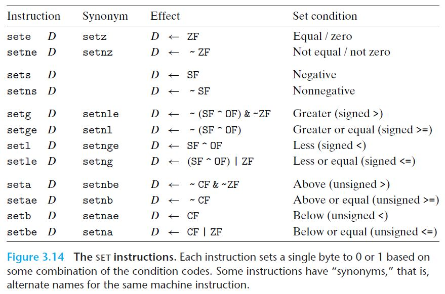

  *Set condition과 Effect는 **비교 인스트럭션 CMP** 실행 직후의 조건 코드를 기준으로 한다.*

  > 유사어
  >
  > : 일부 기계어 인스트럭션들이 갖는 **다수의 이름**.
  >
  >  컴파일러와 역어셈블러는 어떤 이름을 사용할지 랜덤으로 결정한다.
  >
  > - ex) `setg`(더 큰 경우에 1을 저장)와 `setnle`(작거나 동일하지 않으면 1을 저장)은 동일한 기계어 인스트럭션을 의미

  : 조건 코드들의 일부 조합에 따라서 **하나의 `바이트`를 0 또는 1로 기록**

  접미어는 오퍼랜드의 크기가 아니라, 조건 코드의 어떤 조합을 사용할 것인지를 나타낸다.

  - 목적지 오퍼랜드 - 하위 **단일 바이트** 레지스터 가운데 한 개나, **단일 바이트** 메모리 주소
    -  32비트나 64비트 결과를 만들려면, 다른 상위 비트들을 0으로 만들어줘야 한다.

  - ex) C에서 자료형 long인 a와 b 사이에 수식 a < b를 계산하는 전형적인 인스트럭션들:

  ``` assembly
  /* int comp(data_t a, data_t b) --> a < b를 계산하고 결과값을 int로 리턴한다. */
  /* a in %rdi, b in %rsi */
  comp:
  	cmpq	%rsi, %rdi	/* a와 b 비교; a - b */
  	setl	%al			/* %eax의 하위 1바이트 레지스터 %al을 0 또는 1로 set */
  	/* D <- SF ^ OF */
  	movzbl	%al, %eax	/* %eax(와 %rax = 리턴값)의 나머지 바이트들 0으로 clear */
  	ret
  ```
  
> `cmpq` 인스트럭션의 비교 순서에 유의하라. 
  >
  > 비록 인자들이 b, a 순서로 나열되어 있지만, 비교는 실제로 a - b로 하게 된다.

- x86-64의 관습에 의해 `movzbl` 인스트럭션은 %eax의 상위 3바이트만을 지우는 게 아니라 전체 레지스터인 %rax의 상위 4바이트도 0으로 지운다.
  
  => 원래 작성된 IA32 코드와 호환성을 갖게 해줌

**반드시 `SET 인스트럭션` 직전에 `비교 인스트럭션 CMP`를 실행해서 조건 코드(flag)들을 설정하도록 되어있다.**

`SET 인스트럭션 클래스`의 Set condition과 Effect는 `비교 인스트럭션 CMP` 실행 직후의 조건 코드를 기준으로 한다.

> C에서 **비교 연산(<, >, ==, ≤, ≥)**은 전형적으로 `CMP` 인스트럭션과 `SET` 인스트럭션으로 번역된다. 
>
> - `부호형` 비교와 `비부호형` 비교 모두 가능하다.

**[부호형 비교]**

예를 들어, a, b, t가 2의 보수이고 t = a -(t,w) b로 표시된다.

- sete (D <- ZF; 같으면 단일 바이트를 1로 설정)

  : 만일 a = b라면, t = 0이 되므로 영 플래그(ZF)는 동일함을 나타낸다.

- setl (D <- SF ^ OF; 값이 작으면 단일 바이트를 1로 설정)

  : 부호형 비교를 `setl`을 이용해서 테스트하는 경우

  1. 오버플로우가 발생하지 않았고(OF = 0), t = a -(t,w) b < 0일 때(SF = 1) 

     => a < b

  2. 오버플로우가 발생하지 않았고(OF = 0), t = a -(t,w) b ≥ 0일 때(SF = 0) 

     => a ≥ b

  3. 오버플로우가 발생하고(OF = 1),  t = a -(t,w) b > 0일 때(SF = 0)

     => 음의 오버플로우이므로 a < b 

  4. 오버플로우가 발생하고(OF = 1),  t = a -(t,w) b < 0일 때(SF = 1)

     => 양의 오버플로우이므로 a > b

  a = b인 경우에는 오버플로우가 발생하지 않으므로, OF = 1이고 SF = 0인 경우에는 a < b 이다.

  종합하면,  OF ^ SF 값은 a < b 여부를 테스트할 수 있는 방법이 된다.

- 이 외에 다른 부호형 비교시험은 SF^OF와 ZF의 조합으로 만들 수 있다.

**[비부호형 비교]**

a, b가 비부호형 정수이고 t = a -(u,w) b로 표시될 때,

a - b < 0인 경우 `CMP` 인스트럭션 실행 후에 CF = 1이 되므로 비부호형 비교는 CF와 ZF의 조합을 사용한다.

> C에서와는 달리, 기계어에서는 데이터의 타입과 프로그램에서의 값을 연관시키지 않는다.
>
> - 많은 산술연산들이 `비부호형`과 `2의 보수` 산술연산에서 **동일한 비트수준 동작**을 갖기 때문에, 두 경우에 있어서 **대부분 동일한 인스트럭션을 사용**한다.
>
> - 일부 경우에는 `부호형`과 `비부호형`을 다루는 데 **다른 인스트럭션**을 사용한다.
>   - 다른 버전의 우측 쉬프트
>   - 나눗셈 인스트럭션
>   - "단일 오퍼랜드" 곱셈 인스트럭션 (mulq, imulq)
>   - 조건 코드의 다른 조합을 사용하는 경우 ex) 비교 인스트럭션

### 3) 점프(Jump) 인스트럭션

`점프 인스트럭션`은 프로그램이 완전히 새로운 위치로 실행을 전환하도록 한다. **=> 데이터 의존성 제어흐름**

- 레이블(label)

  : 점프의 목적지는 일반적으로 어셈블리 코드에서는 `레이블`로 표시한다.

``` assembly
	movq	$0, %rax		/* %rax를 0으로 set */
	jmp		.L1				/* Goto .L1 */
	movq	(%rax), %rdx	/* 널 포인터 역참조 (스킵) */
.L1:
	popq	%rdx			/* Jump target */
```

> **목적 코드파일**을 만들기 위해서 `어셈블러`는 모든 레이블이 붙은 인스트럭션들의 **주소를 결정**하고, 
>
> 점프 인스트럭션의 일부분인 **"점프 목적지jump target"**(목적지 인스트럭션의 주소)을 **인코딩**한다.

**[여러 가지 점프 인스트럭션]**

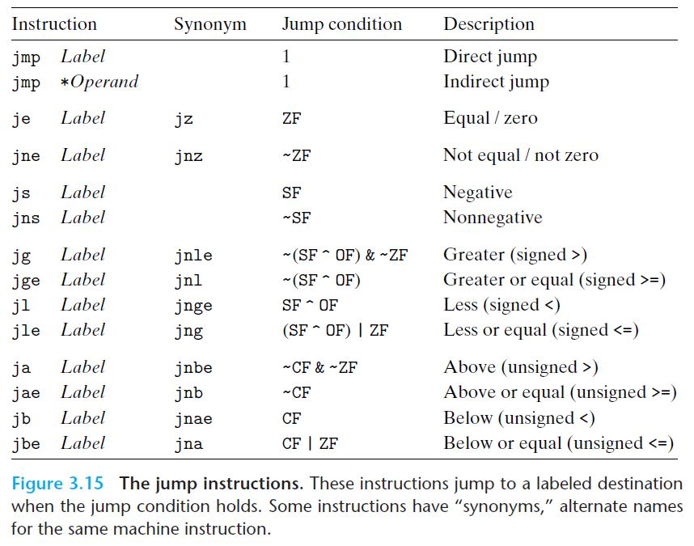

- jmp

  : 무조건적으로 점프한다.

  - 직접 점프 - 점프 목적지가 인스트럭션의 일부로 인코딩되는 경우
    
    - .L1과 같이 점프 대상을 `레이블`로 프로그램 내에 작성한다.
  - 간접 점프 - 점프 대상을 **레지스터**나 **메모리 위치**로부터 읽어들여야 하는 경우
    
    - \* + 메모리 오퍼랜드 중의 하나를 이용한 오퍼랜드 식별자
    
      ex. jmp *%rax - 레지스터 %rax의 값을 점프 목적지로 사용
    
      ​	jmp *(%rax) - %rax에 저장된 값을 `읽기 주소`로 사용하여 메모리에서 점프 목적지를 읽어들임
  
- 조건부 점프

  : 표에 남아 있는 다른 점프 인스트럭션들.

  **조건 코드(플래그 레지스터)의 일부 조합에 의해** 코드 순서의 다음 인스트럭션을 실행하거나, 아니면 점프를 실행한다.

  - 접미어와 점프를 실행하기 위한 조건들은 `SET` 인스트럭션에서의 조건들과 일치한다. (마찬가지로 여러 개의 이름을 가짐)
  - `직접 점프`만 가능하다.

### 4) 점프 인스트럭션 인코딩

점프 인스트럭션의 대상이 어떻게 인코딩되는지를 이해하는 것은 `링커`와 `역어셈블러`의 결과를 해석하는 데 도움을 준다.

어셈블리 코드에서, **점프 목적지**는 `심벌 레이블`(ex) .L1, .L3)을 사용해서 작성한다.

`어셈블러`와 `링커`는 **점프 목적지**를 적절히 **인코딩**한다.

**[점프를 인코딩하는 방법]**

1. PC 상대적(PC relative) 방법

   : 가장 일반적인 방법으로, 대상 인스트럭션 ~ 점프 인스트럭션(현재 실행중) <u>바로 다음에 오는 인스트럭션</u> 주소와의 **차이**를 인코딩

   이들 오프셋은 1, 2, 4바이트로 인코딩 될 수 있다.

   - 컴파일 과정에서 생성된 어셈블리 코드(branch.c 파일의 어떤 함수):

     ``` assembly
     	movq	%rdi, %rax	/* 첫 번째 인자를 리턴값으로 복사 */
     	jmp		.L2			/* Goto .L2 */
     .L3:
     	sarq	%rax		/* 산술 우측 쉬프트 - 왜 오퍼랜드 한 개? */
     .L2:
     	testq	%rax, %rax	/* 리턴값이 음수인지, 0인지, 양수인지 테스트 => CF = 0, OF = 0 */
     	jg		.L3			/* test 인스트럭션 실행에 의해, %rax가 양수일 때만 Goto .L3 */
     	rep; ret
     ```

     어셈블러가 생성한 `.o 형식(바이너리 목적코드 파일)`의 역어셈블 버전:

     ``` assembly
     0:	48 89 f8		mov		%rdi, %rax
     3:	eb 03			jmp		8 <loop+0x8>	/* 점프 목적지 = 0x8(인스트럭션 주소) */
     5:	48 d1 f8		sar		%rax
     8:	48 85 c0		test	%rax, %rax
     b:	7f f8			jg		5 <loop+0x5>	/* 점프 목적지 = 0x5(인스트럭션 주소) */
     d:	f3 c3			repz retq
     ```

     - 인스트럭션의 바이트 인코딩을 보면, 첫 번째 점프 인스트럭션의 목적지가 0x03으로 인코딩 되었다.(두 번째 바이트)

       이것을 점프 바로 **다음 인스트럭션**의 주소인 0x05에 더하면 점프 목적지 주소인 0x8을 얻을 수 있다.

     - 두 번째 점프 인스트럭션의 목적지는 0xf8(십진수 -8)로 단일 바이트 **2의 보수 표시(부호형)로 인코딩** 되엇다.(두 번째 바이트)

       이것을 점프 바로 **다음 인스트럭션**의 주소인 0x0d에 더하면 점프 목적지 주소인 0x5를 얻을 수 있다.

     > PC-상대 주소지정을 수행할 때 **프로그램 카운터(PC)의 값**은 점프 인스트럭션 자신의 주소가 아니라, **점프 다음에 나오는 인스트럭션의 주소**가 된다.
     >
     > 이러한 `관습`은 프로세서가 인스트럭션을 실행할 때, 첫 번째 단계로 PC를 갱신하던 **초기 구현 시절에 정립**되었다. 

     ``` assembly
     *rep와 repz 인스트럭션
     : 위의 코드들에서는 'rep 인스트럭션'의 일반적인 사용과는 완전히 다른 이유로 사용되었다.
      'AMD의 컴파일러 개발자를 위한 가이드라인'에서 rep 다음에 ret가 나오게 해서 
      ret 인스트럭션이 조건부 점프 인스트럭션의 목적지가 되는 것을 피하도록 추천하고 있다.
      - rep 인스트럭션이 없다면 jg 인스트럭션은 분기가 성립하지 않는 경우에 ret 인스트럭션까지 진행할 것이다.
      - AMD 프로세서들은 ret 인스트럭션이 점프 인스트럭션으로 실행하게 되었다면,
        ret 인스트럭션의 목적지를 적절하게 예측할 수 없다.
      - ret 인스트럭션은 일종의 비연산(non-operation)의 형태로 사용되어서 이것을 jump의 목적지로 삽입하면
        AMD 프로세서의 속도를 높여주는 것 이외에 코드의 동작을 변경시키지 않는다.
      따라서 이 책에 나오는 rep나 repz 인스트럭션은 무시할 수 있다.
     ```

     링크 단계 후에 역어셈블한 결과:

     ``` assembly
     4004d0:	48 89 f8		mov		%rdi, %rax
     4004d3:	eb 03			jmp		4004d8 <loop+0x8>	/* 점프 목적지 = loop함수 시작 주소 + 0x8 */
     4004d5:	48 d1 f8		sar		%rax
     4004d8:	48 85 c0		test	%rax, %rax
     4004db:	7f f8			jg		4004d5 <loop+0x5>	/* 점프 목적지 = loop함수 시작 주소 + 0x5 */
     4004dd:	f3 c3			repz retq
     ```

     - 인스트럭션들은 다른 주소에 재배치되었지만, 점프 목적지 값은 바뀌지 않은 채로 남아 있다. (0x03, 0xf8)

     - PC-상대 방식으로 **점프 목적지**를 인코딩하면, 인스트럭션들이 간결하게 인코딩(1, 2, 4바이트) 될 수 있고,

       `목적코드`는 **수정 없이** 메모리 상의 다른 위치로 이동될 수 있다.

2. "절대" 주소를 제공하는 방법

   : 대상을 직접 명시하기 위해 4바이트를 사용한다.

> 어셈블러와 링커는 점프 목적지를 인코딩하는 방법을 적절히 선택한다.

점프 인스트럭션들은 몇 가지 종류의 **루프 구조**뿐만 아니라 **조건부 실행(if)**을 구현하는 방법을 제공한다.

### 5) 조건부 분기를 조건제어로 구현하기

C에서 **조건부 수식과 문장(if-else)**을 `기계어 코드`로 번역하는 가장 일반적인 방법은 **조건부 점프와 무조건 점프를 함께 사용**하는 것이다.

- 다른 방법으로, 다음 절에서 일부 조건문들은 `제어의 이동(제어흐름)`보다는 `데이터의 이동(데이터흐름)`을 통해서 구현할 수 있다.

**[머신 코드의 C 해석 - 제어흐름]**

예를 들어, 두 수의 차이를 절대값으로 계산하는 C 함수, GCC가 만들어낸 어셈블리 코드, 이 머신코드를 C 코드로 해석한 함수는 다음과 같다.

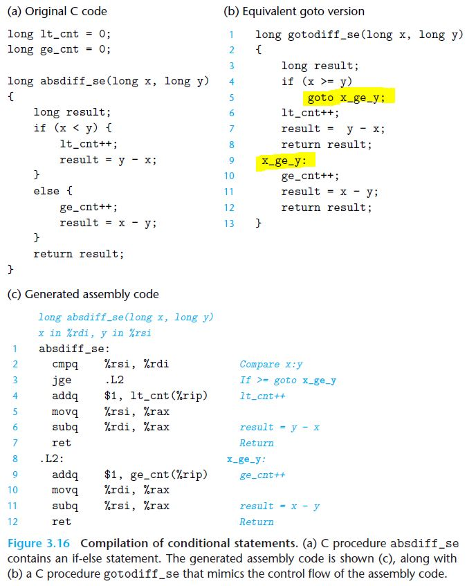

머신코드를 C 코드로 해석한 함수는, **어셈블리 코드에서의 `무조건 점프`**와 유사한 **C의 `goto문`**을 사용한다.

> goto 코드
>
> : 어셈블리 코드의 **제어흐름**을 설명하는 C 프로그램을 구성하는 방법. 또는 그러한 프로그래밍 스타일.

C에서 if-else의 일반적인 형태는 다음과 같은 유형을 갖는다.

``` c
if (test-expr)
    then-statement
else
    else-statement
```

- test-expr는 **정수 수식**으로 계산 결과가 0("거짓"으로 해석)이거나, 0이 아닌 값("참"으로 해석)을 갖는다.

C 문법을 사용해서 어셈블리 구현의 **제어흐름**을 나타내면,

``` c
	t = test_expr;
	if (!t)
        goto false;
	then-statement
    goto done;
false:
	else-statement
done:
```

- 컴파일러는 `else-문`(false 레이블)과 `then-문`(done 레이블)에 대해 **별도의 코드 블록을 생성**한다.
- 정확한 블록이 실행되도록 `조건부 분기`(if (!t) goto false;)와 `무조건 분기`(goto done;)를 삽입한다.

### 6) 조건부 이동으로 조건부 분기 구현하기

조건부 동작을 구현하는 전형적인 방법은 앞에서 다뤘던, `조건이 만족되면` 프로그램의 한 가지 **실행경로**를 따르고,

아닌 경우에는 **다른 경로**를 따라가도록 하는 *제어*의 조건부 전환**(제어흐름)**을 통해 이루어진다.

> 이 방법은 간단하고 일반적이지만 **최신 프로세서**들에서는 매우 비효율적일 수 있다.

또 다른 전략은 *데이터*의 조건부 전송**(데이터흐름)**을 이용하는 것이다.

- 이 방법은 조건부 동작의 **산출물 모두를 계산**하고, 조건에 따라 **하나만 선택**하는 방식이다.
-  이 전략은 `제한적인 경우`에만 의미를 갖지만, 최신 프로세서의 성능특성과 잘 일치하는 `조건부 이동(move)` 인스트럭션으로 구현될 수 있다.

x86-64로 이를 구현하는 방법과 전략을 살펴본다.

**[머신 코드의 C 해석 - 데이터흐름]**

예를 들어, 두 수의 차이를 절대값으로 계산하는 C 함수, GCC가 만들어낸 어셈블리 코드, 이 머신코드를 C 코드로 해석한 함수는 다음과 같다. (이전 예제와는 다르게 카운터 전역변수 없이 리턴값만 계산한다)

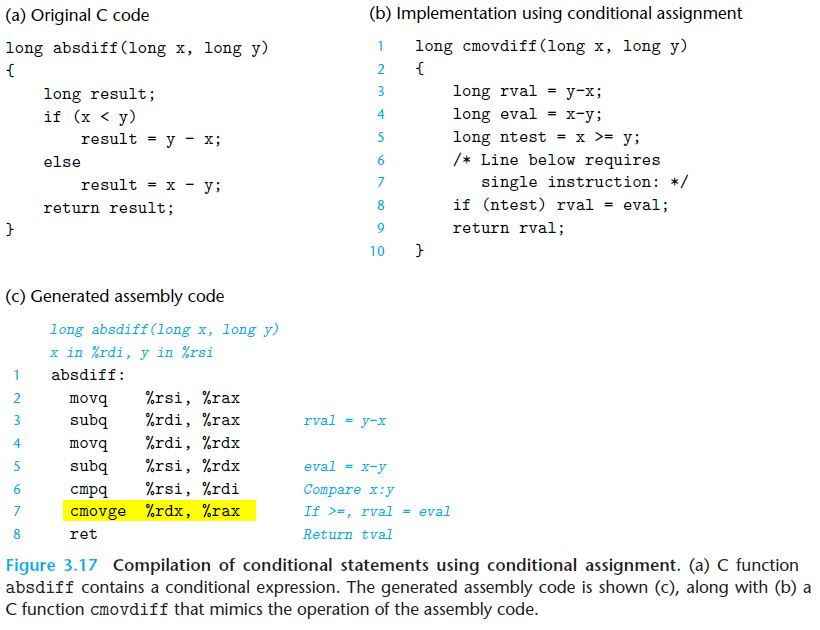

- 어셈블리 코드를 C버전으로 나타낸 것(기계가 만든 코드가 아니라 사람이 어셈블리 코드를 보고 C로 만든 것)을 보면, y-x와 x-y를 **모두 계산**해서 rval, eval로 명명한다.
- 핵심은 어셈블리 코드의 단일 `cmovge` 인스트럭션(7번 줄)이 **`조건부 할당`(8번 줄)을 구현**한다는 것이다.
  - 6번 줄의 `cmpq` 인스트럭션 실행 후, 조건코드의 조합이 >= **(ge)**를 나타내는 경우에만 데이터를 소스 레지스터에서 목적지로 전송하게 된다.

**[조건부 제어 이동 기반 코드보다 조건부 데이터 이동 코드가 성능이 우수한 이유]**

이를 이해하기 위해서는 **최신 프로세서**들이 어떻게 동작하는지 이해해야 한다.

프로세서들은 각 인스트럭션을 `일련의 단계`로 처리하며, 이 단계들은 **각각 요구된 동작의 작은 부분만을 실행**하는 `파이프라인`을 통해 높은 성능을 얻는다.

- 메모리로부터 인스트럭션의 인출
- 인스트럭션 타입의 결정
- 메모리로부터의 읽기
- 산술연산의 수행
- 메모리에 쓰기
- 프로그램 카운터의 갱신

=> 예를 들면, `이전 인스트럭션`의 산술연산을 수행하는 동안에 `다른 인스트럭션`을 인출하는 것처럼 연속되는 인스트럭션들의 단계들을 **중첩**시켜서 고성능을 얻는다.

> 이를 위해서는 파이프라인을 실행할 인스트럭션들로 미리 채우기 위해, **실행할 인스트럭션의 순서**를 훨씬 일찍 결정할 수 있어야 한다.

- 조건부 점프 (branch)

  : 프로세서가 조건부 점프를 만나게 되면, 프로세서는 `분기 조건`에 대한 계산이 완료될 때까지는 어느 쪽으로 분기될지 결정할 수 없다.

  - 프로세서는 각 점프 인스트럭션이 실행될지를 추측하기 위한 복잡한 **분기예측 회로**를 채택하고 있다.

    - 안정적으로 예측할 수 있다면(최신 설계는 성공률 90% 대에 임박함), `인스트럭션 파이프라인`은 인스트럭션들로 가득 채워질 수 있다.

    - 반면에 `점프` 하나를 잘못 예측하면**(예측오류)**, 미래의 인스트럭션을 위해 이미 실행한 작업결과들을 상당 부분 버려야 하고, 정확한 위치에서 다시 인스트럭션들을 파이프라인에 채우는 작업을 수행해야 한다.

      => 15~30 클럭 사이클의 손실을 발생시켜서 성능이 상당히 감소한다.


absdiff 함수를 `조건부 실행의 두 가지 방법(제어흐름, 데이터흐름)`을 사용하여 인텔 Haswell 프로세서에서 실행하면,

- 조건부 점프를 사용해서 컴파일한 코드(제어흐름)

  > 조건부 점프 코드에서는 **프로세서가 테스트의 결과를 예측**하여 인스트럭션을 실행한다.

  : 보통 x < y 테스트의 결과는 매우 예측하기가 어려워서 약 50%의 정확성을 나타냈다.

  => 따라서 **분기의 예측오류 손실**이 이 함수의 성능을 결정한다.

  - 결과: 함수의 실행시간이 분기가 정확히 예측되었는지에 따라 8에서 27 사이클의 범위를 갖는다.

  ``` c
  *손실값 계산
   - 예측오류 확률 p
   - 예측오류 없이 코드를 실행한 시간 Tok
   - 예측오류 손실 Tmp
   : 평균 코드 실행시간 Tavg(p) = (1-p)*Tok + p*(Tok + Tmp) = Tok + p*Tmp
       p = 0.5일 때, 분기 패턴을 쉽게 예측할 수 있는 경우에는 함수가 호출당 약 8 클럭을 소모하므로 Tok = 8, 
  	분기 패턴이 랜덤인 경우에는 약 17.5 클럭 사이클을 소모하므로, 평균시간T_random = 17.5라는 결과를 관찰했다. 
      수식에 대입하면
  		T_random = Tavg(0.5) = Tok + 0.5*Tmp
          Tmp = 2*(T_random - Tok)
          	= 2*(17.5 - 8)
          	= 19
  ```

- 조건부 이동명령을 사용해서 컴파일한 코드(데이터흐름)

  > **프로세서가 테스트의 결과를 예측하지 않고**서도 조건부 이동 인스트럭션을 실행할 수 있다.

  - 결과: 테스트하는 데이터와 상관없이 약 8 클럭 사이클을 필요로 한다.
  - **제어흐름은 데이터와 관계없고**, 이것은 프로세서가 파이프라인을 꽉 찬 상태로 유지하는 것을 더욱 쉽게 해준다.

**[조건부 이동 move 인스트럭션]**

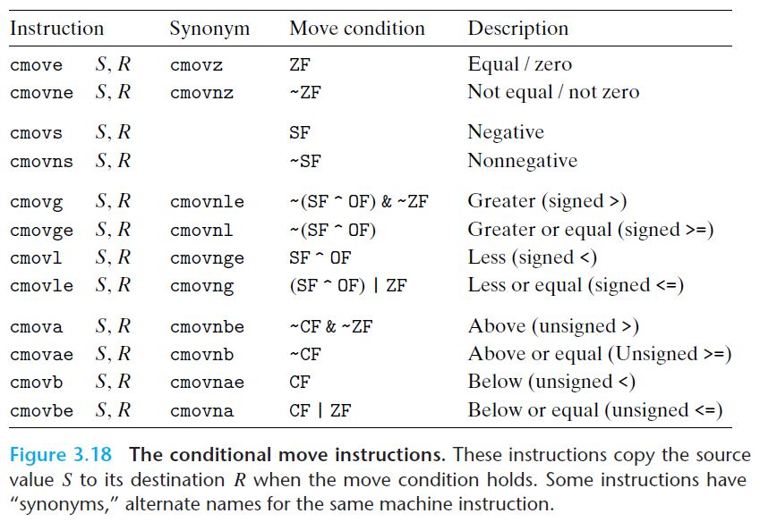

소스와 목적지 값은 **16, 32, 64비트** 길이를 갖는다. 단일 바이트 조건부 이동은 지원되지 않는다.

- 소스 오퍼랜드 - 레지스터, 메모리 위치 S
- 목적 오퍼랜드 - 목적지 레지스터 R

소스 값은 메모리나 소스 레지스터로부터 읽히지만, 목적지에는 **명시된 조건이 만족될 때만 복사**된다.

이 인스트럭션들의 결과는 **조건 코드** 값에 따라 달라진다. (`SET`과 `점프` 인스트럭션에서처럼)

> `어셈블러`는 **조건형 인스트럭션**들에 대해서, 목적지 레지스터의 이름으로부터 오퍼랜드의 길이를 추정한다. 
>
> 그래서 동일한 인스트럭션 이름이 모든 오퍼랜드 길이에 대해서 사용될 수 있다.
>
> - SET
> - 점프
> - 조건부 이동

조건부 점프와는 달리, **프로세서는 테스트의 결과를 예측하지 않고**서도 `조건부 이동 인스트럭션`을 실행할 수 있다.

- 프로세서는 간단히 소스 값을 읽고(대개 메모리로부터),
- 조건 코드를 검사하고,
- 목적지 레지스터를 갱신하거나 그대로 유지한다.

**[일반적인 조건부 수식과 할당]**

``` c
v = test-expr ? then-expr : else-expr;
```

- 위 수식을 조건부 제어 전송(제어흐름)을 이용해서 컴파일하는 표준방식

  ``` c
  	if(!test-expr)
          goto false; // 조건부 점프
  	v = then-expr;
  	goto done;		// 무조건부 점프
  false:
  	v = else-expr;
  done:
  ```

  : `조건부 점프`와 `무조건부 점프`의 조합을 사용해서 오직 하나의 코드만이 계산되도록 한다.

- 위 수식을 조건부 이동(데이터흐름)을 이용한 추상화된 코드로 나타내면

  ``` c
  v = then-expr;
  ve = else-expr;
  t = test-expr;
  if (!t) v = ve;
  ```

  : 조건부 이동에서는 then식과 else식이 모두 계산되고, 최종 test식의 계산 결과에 따라 선택된다.

  이 코드의 마지막 문장은 `조건부 move`로 구현된다.

**[조건부 이동(데이터흐름)으로 컴파일되지 않는 경우]**

1. then-expr와 else-expr 둘 중의 어느 한 곳에서라도 **에러**나 **side effect**를 만든다면, 유효하지 않는 동작이 발생한다.

   - 3.6.5절의 예시함수에서 두 식을 모두 계산하면, 카운터 변수 2개(lt_cnt, ge_cnt)의 값을 모두 1씩 증가시켜버린다.(`side effect`)

   - 널포인터 역참조 `에러`

     ``` c
     long cread(long* xp){
         return (xp ? *xp : 0); // 주소가 0이 아니면 메모리의 그 주소에 저장된 값을 리턴, 주소가 0이면 0을 리턴
     }
     ```

     *주소가 0이라는 것은 포인터가 null이라는 의미이다.*

     조건부 이동을 이용해서 컴파일한 결과(invalid):

     ``` assembly
     /* xp in %rdi */
     cread:
     	movq	(%rdi), %rax	/* v = *xp */
     	testq	%rdi, %rdi		/* Test xp; xp가 양수인지, 0인지, 음수인지 확인 */
     	movl	$0, %edx		/* ve = 0 */
     	cmove	%rdx, %rax		/* If xp==0, v = ve */
     	ret						/* Return v */
     ```

     movq 인스트럭션을 사용하는 xp의 역참조(dereferencing)가 테스트가 실패한 경우에도 발생해서 **널포인터 역참조 에러**를 발생시킨다.

2. then-expr와 else-expr의 계산이 상당한 양의 계산을 요하는 경우

   : 조건부 이동을 사용한다고 해서 언제나 코드 효율성을 개선할 수 있는 것은 아니다.

   `컴파일러`는 **낭비되는 계산량(데이터흐름)**과 **분기 예측오류에 의한 잠재적 성능 손실(제어흐름)** 사이의 상대적 성능을 고려해야 한다.

   > 실제로는 컴파일러가 결정을 내리기 위한 정보가 충분하지 않다.
   >
   > - `GCC`는 하나의 add 인스트럭션과 같이 (분기의)두 수식이 매우 간단히 계산될 수 있는 경우만 `조건부 이동(move)`을 사용한다.
   > - `GCC`는 심지어 분기 예측 오류의 비용이, 복잡한 계산의 비용보다 더 큰 경우에서도 `조건부 제어 이동(transfer)`을 사용한다. 

비록 매우 제한적인 경우에만 사용될 수 있지만, 이들은 상당히 보편적이고, 최신 프로세서들의 연산과도 보다 더 잘 동작한다.

### 7) 반복문

C에서는 여러 가지 반복문 구문을 제공한다.

- do-while
- while
- for

 **기계어에는 여기에 대응되는 인스트럭션이 없다.** 그 대신 `조건부 테스트`와 `점프`를 함께 사용해서 반복문의 효과를 구현한다.

`GCC`와 다른 컴파일러들은 **두 개의 기본 `루프 패턴`**에 기초해서 반복문 코드를 생성한다.

**[Do-While 반복문]**

C 코드:

``` c
do
    body-statement	// 적어도 한 번은 실행된다.
    while (test-expr); // 결과가 0이 아니면 반복 수행
```

"goto 코드":

``` c
loop:
	body-statement
    t = test-expr;
	if (t)
        goto loop;
```

**[머신 코드의 C 해석 - Do-While 반복문]**

예를 들어, 인자의 계승(factorial) n!을 do-while 반복문으로 구현한 C 함수, GCC가 만들어낸 어셈블리 코드, 이 머신코드를 C 코드로 해석한 함수는 다음과 같다.

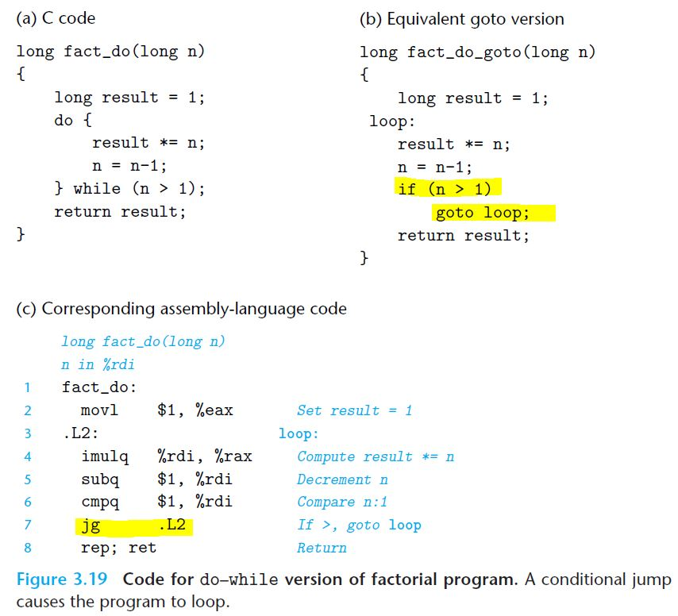

- goto형 코드를 보면 do-while 루프 구조가 `하위수준의 테스트`와 `조건부 점프`의 조합들로 변환되었음을 알 수 있다.
  - 테스트
    - goto형 코드: t = (n > 1);
    - 어셈블리어: cmpq  $1, %rdi
  - 조건부 점프
    - goto형 코드: if (t) goto loop;  
    - 어셈블리어: jg  .L2

> 어셈블리 코드를 **역엔지니어링**하기 위해서는 프로그램 값들과 `레지스터`들 간의 매핑을 찾는 것이 중요하다.

``` c
*반복문 역엔지니어링 하기
 : 프로그램 값들과 레지스터들 간의 매핑을 찾는 것은 복잡한 프로그램에서 매우 어렵다.
     - C 컴파일러가 종종 계산 순서를 뒤바꾸기 때문에, C 코드의 일부 변수들은 기계어 코드에 관련 내용이 없는 경우가 있다.
     - 또는 소스코드에는 없던 새로운 값들이 기계어 코드에 등장하는 경우도 있다.
     - 여러 개의 프로그램 값들을 한 개의 레지스터에 매핑하여 레지스터 사용을 최소화하기도 한다.
  일반적인 반복문의 역엔지니어링 전략은 다음과 같다.
     1. 반복문의 실행 전에 레지스터들이 어떻게 초기화되고, 갱신되고,
	 2. 반복문 내에서 어떻게 테스트되는지,
	 3. 반복문 이후에 어떻게 사용되는지 살펴본다.
```

**[While 루프]**

C 코드:

``` c
while (test-expr)
    body-statement
```

while문을 기계어 코드로 번역하는 여러 가지 방법이 있으며, 이 중 두 개의 방법이 `GCC`가 생성하는 코드에서 이용된다.

이 둘은 do-while 루프와 루프 구조가 동일하고, **초기 테스트**의 구현방법에서만 다르다.

1. 중간으로-점프 (jump to middle)

   : 루프의 맨 마지막의 `테스트`로 `무조건 점프`를 수행하기 위한 **초기 테스트**를 한다.

   "goto 코드":

   ``` c
   	goto test;
   loop:
   	body-statement
   test:
       t = test-expr;
   	if (t)
           goto loop;
   ```

   **[머신 코드의 C 해석 - While 루프]**

   예를 들어, 인자의 계승(factorial) n!을 while 반복문으로 구현한 C 함수, GCC가 만들어낸 어셈블리 코드, 이 머신코드를 C 코드로 해석한 함수는 다음과 같다.

   > GCC 최적화는 -0g 옵션을 사용했다.

   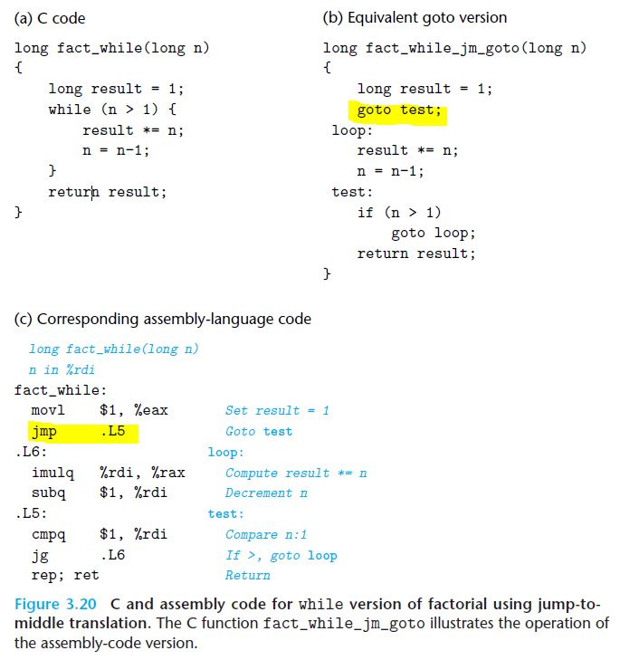

   - 이 함수는 앞의 do-while 예제함수와는 달리 0! = 1을 정확히 계산한다.
   - "goto 코드"를 보면, `무조건 점프`가 `테스트`를 먼저 수행하도록 한다는 점을 제외하고는 do-while 예제함수와 매우 유사하다.

2. 조건형-do (guarded do)

   : **초기 테스트**가 실패하는 경우에 루프를 건너뛰도록 `조건부 분기`를 이용해서 **do-while 루프로 번역**한다.

   > `GCC`는 **상위수준의 최적화**로 컴파일 할 때는 이 전략을 따른다. ex) 명령줄 옵션 -01

   C 코드(do-while 루프 포함):

   ``` c
   t = test-expr;
   if (!t)
       goto done;
   do
       body-statement
       while (test-expr);
   done:
   ```

   "goto 코드":

   ``` c
   t = test-expr;
   if (!t)
       goto done;
   loop:
       body-statement
       t = test-expr;
   	if (t)
           goto loop;
   done:
   ```

   


## 7. 프로시저

프로시저 호출은 **`소프트웨어`에서의 주요 추상화**다.

이들은 지정된 `인자`들과 `리턴 값`으로 **특정 기능을 구현하는 코드를 감싸주는 방법**을 제공한다.

`소프트웨어`는 다음과 같은 방식으로 프로시저를 추상화 메커니즘으로 이용한다.

- 명쾌하고 간결한 인터페이스 정의를 제공
  - 무슨 값이 계산되고,
  - 이 프로시저가 프로그램 상태에 무슨 효과를 갖는지에 대한 인터페이스
- 구체적인 구현은 감춰주는 방식

> 프로시저는 서로 다른 프로그래밍 언어에서 다른 모습으로 사용된다.
>
> - 함수, 메소드, 서브루틴, 핸들러 등
>
> 그러나 이 모두는 **일반적인 특징**들을 공유한다.

**프로시저에 대한 기계어수준 지원**을 제공할 때 처리되어야 하는 여러 가지 특성들이 존재한다.

프로시저의 `동작(action)`들은 다음과 같은 하나 이상의 `메커니즘`이 연관된다:

논의를 풀어나가기 위해 프로시저 P가 프로시저 Q를 호출하고, Q가 실행한 후에 다시 P로 리턴한다고 가정하자.

- 제어권 전달

  : `프로그램 카운터`는 진입할 때 Q에 대한 **코드의 시작주소**로 설정되고, 리턴할 때는 P에서 Q를 **호출하는 인스트럭션 다음의 인스트럭션**으로 설정되어야 한다.

- 데이터 전달

  : P는 **하나 이상의 `매개변수`**를 Q에 제공할 수 있어야 하며, Q는 다시 P로 **하나의 값을 `리턴`**할 수 있어야 한다.

- 메모리 할당과 반납

  : Q는 시작할 때 **지역변수들을 위한 공간**을 `할당`할 수도 있고, 리턴할 때 이 저장소를 `반납`할 수 있다.

x86-64에서의 프로시저 구현은 (레지스터와 프로그램 메모리 같은)머신의 자원들을 사용하는 방법에 관한 `특수 인스트럭션`들과 일련의 `관습`들과 연관되어 있다.

프로시저를 **호출**하는 데 연관된 오버헤드를 최소화하기 위해, 위의 `3가지 동작방식(메커니즘)` 중 각 프로시저가 요구하는 메커니즘만을 최소한으로 구현하는 **최소주의자 전략**으로 볼 수 있는 방식들을 따른다. 

### 1) 런타임 스택

> C언어와 다른 대부분의 언어에서의 `프로시저 호출 동작방식(메커니즘)`의 주요 특징은 **스택 자료구조가 제공하는 후입선출(last-in, first-out) 메모리 관리 방식**을 활용할 수 있다는 점이다.


## 8. 배열의 할당과 접근

C에서 배열은 `스칼라 데이터(단 하나의 값만을 저장할 수 있는 데이터)`를 보다 큰 자료형으로 연계시키는 수단이다.

**C는 매우 단순한 구현 방법을 사용**하고 있어서 기계어로의 번역도 매우 손쉽게 할 수 있다.

C의 특이한 점은 **배열 원소들에 대한 `포인터`**를 만들고, 이들 **포인터 간에 연산**을 할 수 있다는 점이다.

- 이것은 기계어에서 (가상)주소 계산으로 번역된다.

> `최적화 컴파일러`는 '배열의 인덱스를 사용할 때 필요한 주소계산'을 단순화하는 데 특히 우수한 성능을 보인다.
>
> 이 때문에 C 코드와 그 기계어 번역 간의 관계는 다소 해석하기 어려워질 수 있다.