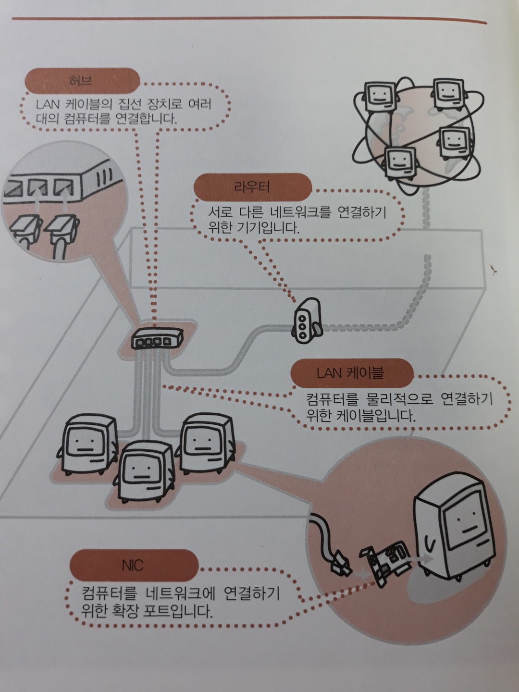

# 1. 네트워크 개론

## 1) LAN과 WAN

> 네트워크 = 정보(파일과 같은 전자 데이터)가 흘러가는 경로
>
> ​	-> Windows OS에는 네트워크 기능이 **표준**으로 탑재되어 있다.

LAN(Local Area Network): 사무실이나 빌딩 안 등 좁은 범위의 네트워크

- 접속 형태에 따른 규격 - 버스형, **스타형(허브를 이용하며 가장 일반적이다)**, 링형

WAN(Wide Area Network): 거리가 떨어져 있는 `LAN끼리를 전용선 등으로 연결`한 네트워크
- LAN보다 속도가 큰 폭으로 저하된다.
- **인터넷**도 전 세계의 LAN들을 연결한 것으로 볼 수가 있으므로 넓은 의미에서 WAN의 일종이라고 할 수 있다.
  - 예전에 WAN은 비용이 비싼 전용선을 사용하여 구축했었지만, 최근에는 `암호화 통신`이 발달함으로써 **인터넷을 이용하여 저가로 구축**하는 예도 늘고 있다.

## 2) 클라이언트와 서버

> **네트워크의 등장인물**로는 서버와 클라이언트가 있다.

- 클라이언트: 네트워크에서 서비스를 요구하는 컴퓨터

  서버: 네트워크에서 서비스를 제공하는 컴퓨터

- **[네트워크를 관리하는 방법]**

  1) Peer-to-Peer(P2P)형 네트워크

  ​	: 컴퓨터가 5~6대 정도인 소규모 LAN의 경우, **서버 전용 컴퓨터를 설치하지 않고** 대부분 Peer-to-Peer형 네트워크로 되어있다.

  ​	각 컴퓨터가 때로는 서버가 되기도 하고 때로는 클라이언트가 되기도 해서 그때그때의 상황에 따라 역할을 바꾼다.

  - 파일이나 프린터와 같은 `자원을 서로 공유`한다.
  - 각 컴퓨터는 동등한 권한을 갖고 있으며 독립되어 있다. 그렇기 때문에 네트워크에 컴퓨터를 추가하거나 분리시키는 일이 자유롭다.

  2) 클라이언트-서버형 네트워크

  ​	: 서버 전용 컴퓨터를 마련하여 네트워크를 관리하는 방법. **네트워크의 관리를 `서버`에서 일괄적으로 수행한다.**

  - 서버에 있는 파일이나 프린터 등의 이용을 `의뢰`하여 필요한 서비스를 받는다.
  - 서버가 이용자에게 제한을 가하거나 참가를 거부하는 등의 권한을 갖고 있어 **보안**이 우수하다.

## 3) 네트워크를 구성하는 장치

> 네트워크에는 물리적인 연결 방법부터 그 위를 흐르는 전기 신호의 정의, 통신 내용의 송수신 방법 등 다양한 규칙이 정해져 있다. **이러한 규칙에 따라 기기를 구성함으로써 컴퓨터의 종류에 의존하지 않고 네트워크에서 정보를 주고받을 수 있는 것이다.**

컴퓨터는 전화처럼 신호 교환 기능이 들어있지 않고, 마련된 공중 회선에 연결되어 있지도 않기 때문에 **다양한 장치가 필요하다**.

**[Ethernet의 경우 네트워크를 구성하는 기기]** (`LAN 규격`으로 널리 보급됨)

1. 컴퓨터를 연결하여 LAN을 구성하기 위한 기본장치
   - NIC(Network Interface Card): **컴퓨터를 네트워크에 연결**하기 위한 `확장 보드`
     - 컴퓨터의 데이터를 전기적인 신호로 변환하여 잭으로 송신, 수신함
     - 요즘은 마더보드에 내장되어 있다.
   - LAN 케이블: 전기신호의 물리적인 통로. **컴퓨터를 물리적으로 연결**하기 위한 케이블
   - 허브: `LAN 케이블의 집선 장치`로 **여러대의 컴퓨터를 연결**함
     - 허브는 연결된 LAN 케이블들의 `전기적인 중계기`가 되므로 이 장치에 연결된 컴퓨터들은 정보를 서로 주고받을 수 있게 됨

2. LAN과 인터넷을 연결하거나 지사 간의 LAN을 연결하여 WAN을 구축하는 경우 필요한 장치

	- 라우터: **서로 다른 네트워크를 연결**하기 위한 기기
	  - 통신 데이터가 어떤 네트워크로 보내져야 하는지를 판단하여 적절한 장소로 전송하는 `분류인` 역할을 함

## 4) 네트워크의 서비스

> **서비스**란 서버가 네트워크에서 제공하는 기능을 말한다.

1. 자신의 자원을 공유시키기 위해 사용하는 서비스

   - 파일 공유, 프린터 공유

2. 네트워크 전체를 원활하게 관리 및 운영하기 위해 필수적인 **서비스**

   - **클라이언트 측의 설정을 대부분 자동화시켜주므로 관리에 드는 부담이 줄어든다.**

   - DHCP (Dynamic Host Configuration Protocol)

     : 클라이언트에 대한 네트워크 설정이나 IP 주소의 할당을 자동화하기 위한 서비스

     - 네트워크의 **DHCP 서버**에 각 클라이언트가 액세스함으로써 자신이 사용할 IP주소를 할당받아 네트워크에 참여할 수 있다.

       이 IP 주소는 TCP/IP 네트워크에서 각 컴퓨터를 식별하기 위해 필요한 것으로, 중복되지 않는 값을 할당하여 사용해야 한다.

     - DHCP 서비스를 사용함으로써 복잡한 IP 주소 관리를 편리하게 할 수 있는 것이다.

   - DNS (Domain Name System)

     : IP 주소와 컴퓨터명과의 대응을 관리하는 서비스

     - 기억하기 쉬운 **컴퓨터명**으로 IP 주소를 알아내어 액세스 할 수 있다. 

   - 최근에는 가정용 브로드밴드 라우터(공유기)에도 이러한 기능이 탑재되어, 가정에서 LAN 구축을 하는 경우 용이하게 해주고 있다.

3. LAN을 편리하게 이용하기 위한 서비스

   - NTP (Network Time Protocol)

     : 모든 컴퓨터의 시각을 NTP 서비스가 가동되는 컴퓨터의 시각으로 동기화시킴

   - 게이트웨이 서비스

     : 외부 네트워크와의 출입구. **여러 대의 컴퓨터**가 **동시에** 외부 네트워크에 액세스할 수 있도록 해준다.

     - LAN 외의 서비스로서 유명한, 인터넷의 WWW(World Wide Web)가 있는데 이것을 동시에 이용할 수 있게 된다.

## 5) 인터넷 기술

> LAN끼리를 서로 연결함으로써 세계 규모로 확장시킨 네트워크가 인터넷이다.

이 네트워크는 **TCP/IP 프로토콜**을 기반으로 하고 있으며, **IP 주소를 바탕으로 컴퓨터를 식별한다**.

LAN과 LAN은 라우터로 연결하고 통신 데이터는 라우터가 경로 선택을 하면서 목적하는 네트워크로 보내는 구조이다.

가장 많이 이용되는 서비스는 WWW(World Wide Web)와 전자메일.

1. 인터넷의 서비스

   - WWW

     : 인터넷에서 표준적으로 사용되고 있는 `문서 시스템`.

     - HTML(HyperText Markup Language) 언어를 사용하여 기술한다.

     - 문서 사이에 **링크**를 설정하거나 문서 안에 그림이나 음성, 영상과 같은 **다양한 컨텐츠**를 표시할 수 있다.

     - URL이라는 형식으로 주소를 지정함으로써 전 세계 어디에서든 열람할 수 있다.

   - 전자메일, 뉴스그룹, 인스턴스 메시지 등

2. 통신 인프라로 취급하여 활용하기

   - VPN (Virtual Private Network)

     : 인터넷에 **가상의 전용선 공간**을 만들어 놓음으로써 **거점 간을 안전하게 연결**하기 위한 기술

     - 거점 간에 `암호화 된 통신 데이터`를 주고받는다.
     - 고가의 전용선 대신, 기존의 인터넷 회선과 VPN을 이용하여 WAN을 저가로 도입할 수 있다. 

