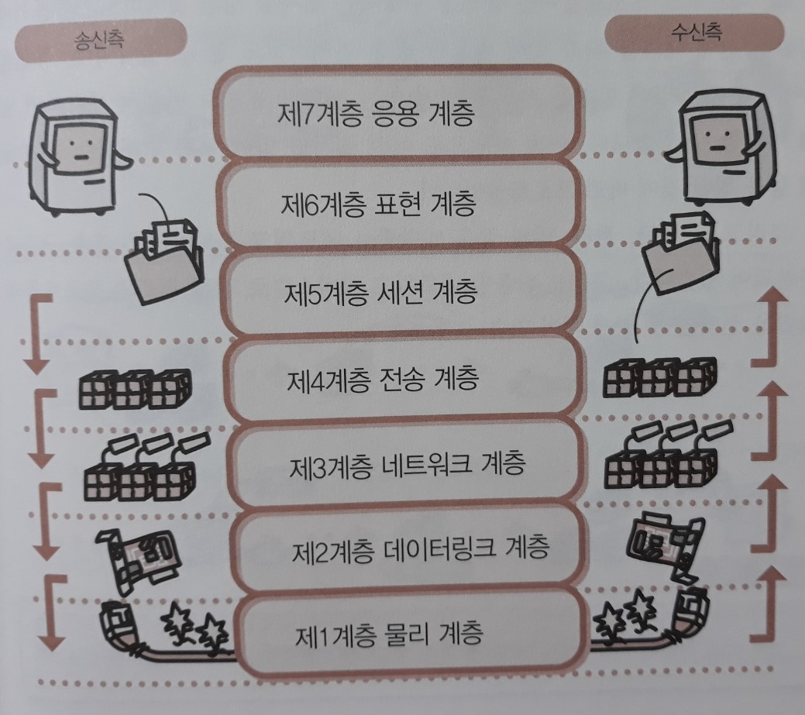
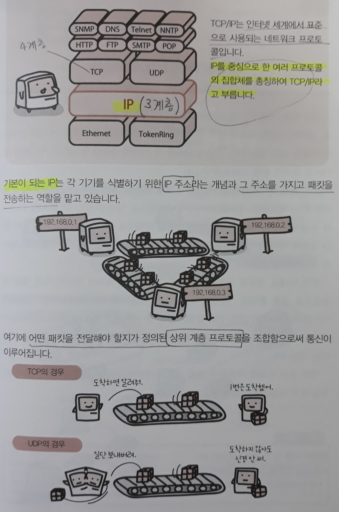
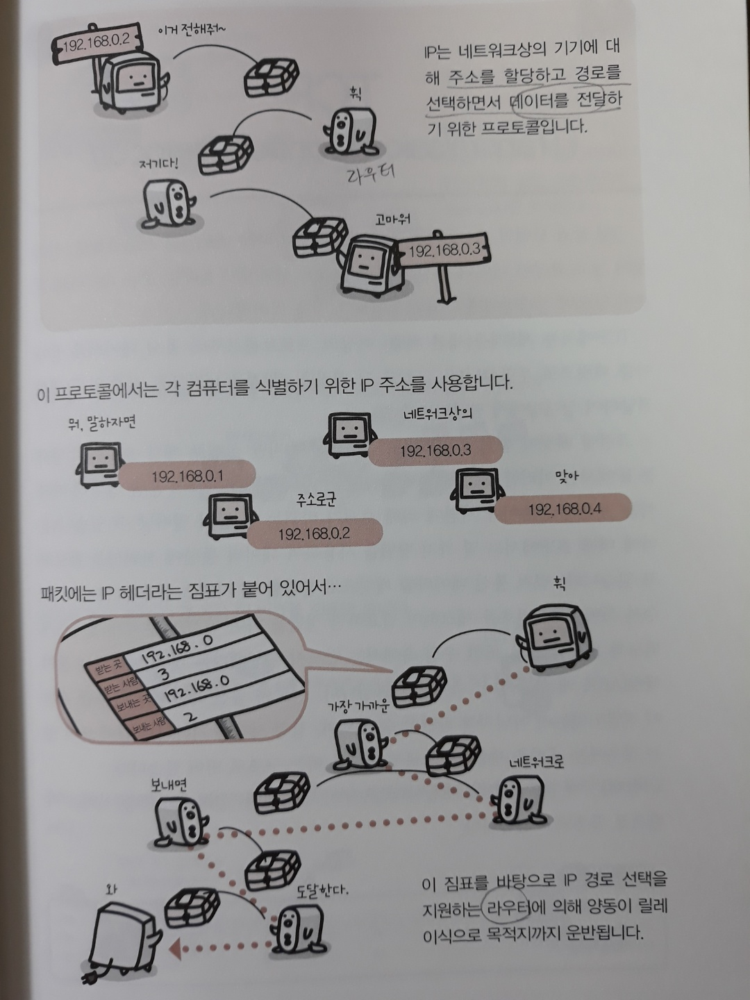
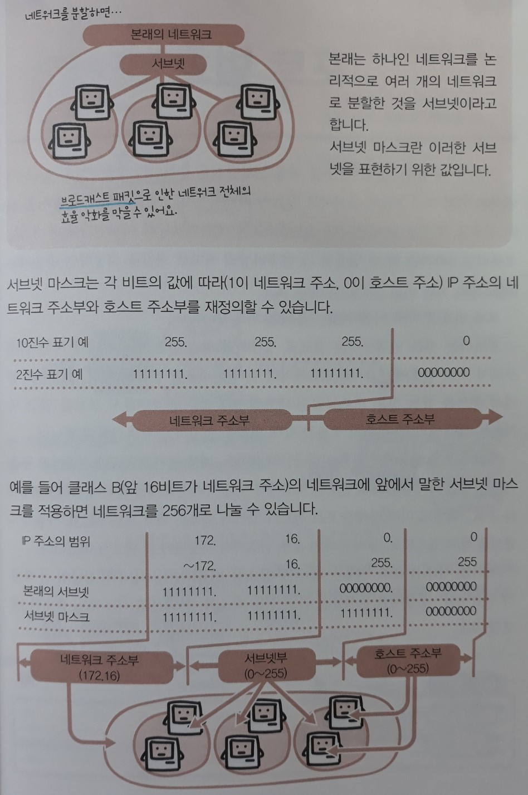
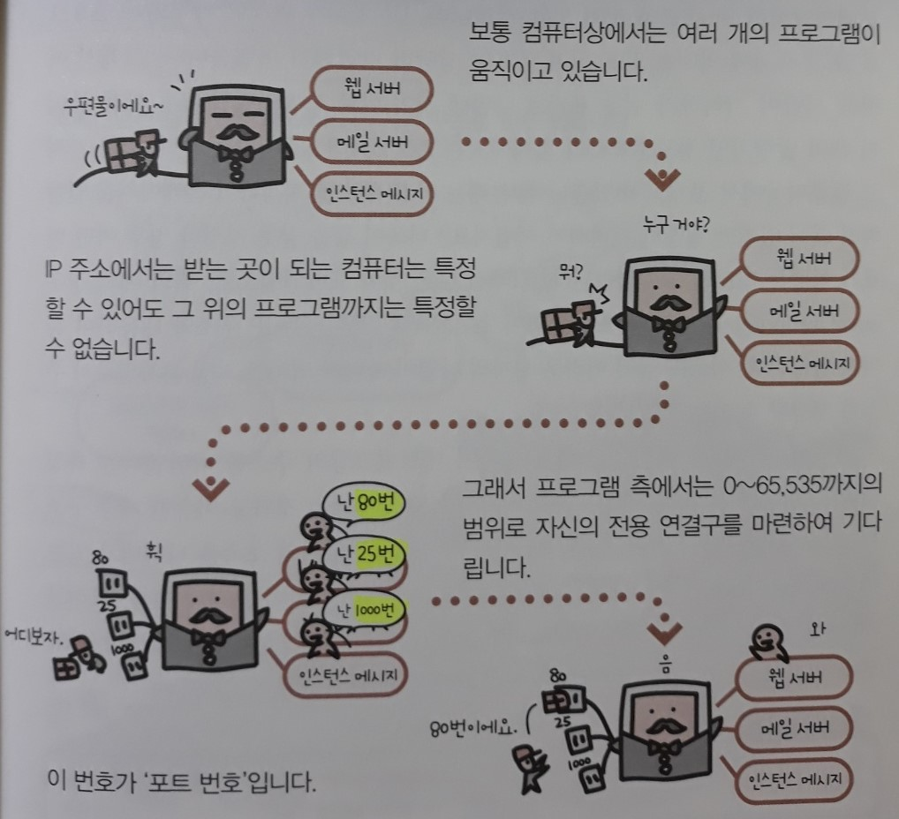

# 2. OSI 참조 모델과 TCP/IP 기초편

## 1) OSI 참조(계층) 모델

> **상호 운용성**과 **기능의 확장성**을 실현하기 위해 네트워크는 그 기본 구조를 7개 계층으로 나눠서 관리하고 있다.
>
> *상호 운용성 - **서로 다른 기기들 간**에 데이터를 문제 없이 송수신 할 수 있는 것
>
>   기능의 확장성 - 네트워크에 기능 확장 서비스를 추가하거나 새로운 기술을 도입하는 것

- 1계층 - 물리 계층
    - 케이블의 핀 수나 전기 특성을 정함
    - 송출 데이터의 전기적인 변환 등을 수행
- 2계층 - 데이터링크 계층

  - 직접 연결되는 상대와의 통신로 확보
  - 데이터의 오류 정정, 재송신 요구 등을 수행
- 3계층 - 네트워크 계층

  - 데이터의 경로 선택
  - 네트워크에서 각각을 식별하기 위한 주소를 관리
      - **IP 주소**라는 개념은 이 계층에 위치한다.
- 4계층 - 전송 계층
    - `네트워크 계층`에서 보내져 온 데이터의 정렬과 오류 정정 등을 수행
    - 송수신된 데이터의 신뢰성을 확보
    - **TCP나 UDP와 같은 프로토콜**은 이 계층에 위치함
- 5계층 - 세션 계층
  - 통신의 시작과 종료와 같은 통신 프로토콜 간의 연결을 관리
  - 통신 경로를 확립
- 6계층 - 표현 계층
  - 압축 방법이나 문자 코드(인코딩)를 관리
  - 애플리케이션 소프트웨어와 네트워크와의 중개를 수행
- 7계층 - 응용 계층
  - 통신을 이용하기 위해 필요한 서비스를 사람과 다른 컴퓨터에 제공

**송신측은 응용 계층에서 물리 계층의 순서로 데이터를 가공함으로써 송신을 하고, 수신측은 받은 데이터를 반대 순서대로 가공함으로써 데이터를 복원한다.**

이와 같이 네트워크 구조를 계층별로 나눔으로써 계층별로 프로토콜을 바꿀 수 있게 된다.

## 2) 네트워크 프로토콜

> 네트워크를 통해 컴퓨터 간에 **정보를 주고받기 위한 약속(규약)**을 네트워크 프로토콜이라고 한다.

즉, 네트워크 프로토콜이란 어떤 수단으로 어떤 절차를 밟아 어떤 말로 정보를 보낼지 등을 정한 것이다.

그리고 그 수단, 절차, 말과 같은 역할별로 네트워크 프로토콜은 계층 구조로 구분되어 있다.

그래서 사용할 네트워크 서비스별로 각각 최적의 프로토콜의 조합을 선택할 수 있게 되어있다.

## 3) TCP/IP

> TCP/IP는 **인터넷에서 표준**으로 사용되고 있는 네트워크 프로토콜로, OSI 참조 모델의 제 3계층(네트워크 계층)의 `IP를 중심으로 한 여러 프로토콜의 집합체`를 총칭하여 부르는 것이다.
>
> 주로 제 4계층(전송 계층)의 TCP와 조합하여 구성되기 때문에 TCP/IP라고 부른다.
>
> - 인터넷에서는 전송 계층으로 TCP 대신 UDP를 사용하는 경우도 있다.

인터넷상의 대표적인 `서비스`인 HTTP 등은 **TCP/IP 프로토콜**을 기반으로 작동한다.

통신상에서 주고받는 데이터는 **패킷**이라는 단위로 나눠져 각각에 **보낼 주소(상대방의 IP 주소)**가 붙어 있다.

- IP (하위 계층)
  - 각 기계의 주소 할당
  - 주소를 참조하여 패킷을 전송
- TCP (상위 계층)
  - 패킷의 수신을 확인
  - 패킷이 순서대로 올바르게 전달될 것을 보장
    - **신뢰성이 높은** 데이터 송수신이 가능하다.
    - `수신 확인`이나 `패킷 재전송`과 같은 절차 때문에 TCP 프로토콜을 사용하면 **상당히 무거워진다**.
- UDP (상위 계층)
  - 신뢰성보다 가볍고 빠른 처리를 중시한다.

## 4) IP (Internet Protocol)

> OSI 참조 모델에서 제3계층인 네트워크 계층에 위치하는 네트워크 프로토콜.
>
> IP는 **각 기기에 주소를 할당**하고 거기까지 데이터를 보내기 위한 프로토콜이다.

IP는 패킷을 TCP나 UDP와 같은 상위 계층으로부터 전달받으면 **IP 헤더라는 정보를 추가**하여 네트워크로 내보낸다.

- `IP헤더` - 송신자와 수신자의 IP 주소를 중심으로 한 정보의 집합으로, 패킷이라는 소포에 붙어 있는 짐표와 같은 것.

IP는 **경로를 선택하는 방법도 정의**하고 있어서 여러 개의 네트워크를 걸친 통신도 가능하다.

- 실제로는 LAN과 외부 네트워크를 연결하는 기기인 **`라우터`가 이 IP의 경로 선택(라우팅)을 지원하고 있다**.

## 5) TCP (Transmission Control Protocol)

>OSI 참조 모델에서 제4계층인 전송 계층에 위치하는 네트워크 프로토콜.
>
>**신뢰성이 높고 확실한 데이터 통신을 보증**한다.
>
> *`신뢰성`이 높다는 것은 데이터의 결손이 없으며 상대방에게 확실히 전달되는 것을 의미한다.

TCP에서는 제 5계층(세션 계층) 이상의 프로토콜로부터 **통신 데이터를 받아 이를 패킷으로 분할**한다.

그리고 그 패킷을 제 3계층(네트워크 계층)인 IP에게 전달하여 상대방에게 전달되도록 한다.

그런데 실제로 패킷 송신을 수행하는 IP에서는, 패킷이 송출된 순서대로 전달되는 것을 보증하지 않는다.

**[TCP가 데이터 통신에 신뢰성을 확보하는 방법]**

1. 통신 데이터를 패킷으로 분할할 때 **시퀀스 번호**를 붙인다.
   - 수신 측에서 이 번호를 체크하여 필요하면 정렬할 수 있다.
2. 수신 측에서는 수신했다는 것을 나타내는 **통지 패킷(ACK 패킷)**을 송신 측으로 보낸다.
   - 받은 패킷의 **시퀀스 번호**를 되돌려 준다.
   - 일정 시간을 기다려도 ACK 패킷이 오지 않는 경우에는 패킷을 재송출함으로써 결손을 막을 수 있다.

## 6) UDP (User Datagram Protocol)

> OSI 참조 모델에서 제4계층인 전송 계층에 위치하는 네트워크 프로토콜.
>
> **커넥션리스형(데이터그램형) 통신 기능을 제공**한다.
>
> *`커넥션리스형` - 지금부터 정보를 보낸다는 것을 상대편에게 알리지 않고 갑자기 송신해버리는 방법. 통신의 신뢰성은 낮아지지만, 프로토콜 자체의 처리가 가볍게 끝나므로 고속으로 통신할 수 있다.

UDP는 제 3계층(네트워크 계층)의 **IP에 의한 데이터 전송 기능**을, 제 5계층(세션 계층) 이상의 **상위 계층 프로토콜에서 직접 사용**할 수 있도록 하기 위한 다리 역할을 한다.

제 5계층(세션 계층) 이상의 프로토콜로부터 **통신 데이터를 받아 이를 패킷으로 분할**한다.

그리고 그 패킷을 제 3계층(네트워크 계층)인 IP에게 전달하여 상대방에게 송출하기만 할 뿐, TCP와 같이 수신 확인을 하지는 않는다.

- 신뢰성이 떨어진다.
- 처리가 가벼워서 다음과 같은 용도로 사용된다.
  - 작은 크기의 패킷을 주고받기만 하면 되는 애플리케이션
    - `DNS 서비스`
    - `DHCP 서비스`
  - 시간적 연속성이 중요한 애플리케이션
    - 음성 통화
    - 동영상 배포

## 7) 패킷

> 소포(packet)라는 뜻으로, 컴퓨터 통신을 할 때 사용하는 **작게 분할된 데이터 덩어리**를 말한다.

통신 회선을 1초 동안 흐를 수 있는 데이터의 양은 네트워크의 규격별로 정해져 있다.

그래서 큰 데이터를 분할하지 않고 네트워크상으로 보내면, 그 데이터가 회선을 모두 점유해버려서 다른 기기가 전혀 통신할 수 없게 되는 문제가 발생한다.

=> 따라서 회선을 공유할 수 있도록 데이터를 패킷으로 분할하여 송수신하는 '**패킷 통신**' 방식을 사용한다.

- 패킷에 추가되는 속성 정보
  - 보내는 곳과 받는 곳의 IP 주소
  - 사용하는 네트워크 프로토콜에 관한 정보
    - 이 정보를 기재함으로써 **동일 네트워크 회선 상에서도 여러 개의 네트워크 프로토콜을 섞어서 이용**할 수 있다.

## 8) 노드

> 네트워크의 분기점은 모두 **노드(node)**다.
>
> - 네트워크에 연결되어 있는 기기(컴퓨터)
> - 네트워크의 연결 포인트
>   - 허브 - 집선 장치
>   - 라우터 - 네트워크들을 연결함

'노드 간에 패킷을 송수신한다'라고 하는 경우에는 네트워크상의 모든 기기 간에 패킷을 주고받는다는 뜻으로 이해하면 된다.

## 9) IP 주소

> 인터넷과 같이 `IP를 기반으로 하는 네트워크`에서 한 대의 컴퓨터마다 할당되어 있는 식별번호
>
> **32비트** 수치로 표현한다.
>
> - 보통 8비트씩 4개로 나눠서 각각을 10진수로 표기하여 읽는다.
>
>   ex) 192.168.0.1

IP 주소 = 네트워크 주소부 + 호스트 주소부

- 네트워크 주소부 (주소): 네트워크 단위로 나누는 주소 

- 호스트 주소부 (이름): 네트워크 안에서 컴퓨터를 식별하기 위한 주소

**패킷**에는 반드시 보내는 곳과 받는 곳의 IP 주소가 속성 정보로서 추가된다.

각각의 컴퓨터에 할당되는 IP 주소값은 중복되어서는 안 된다.

- 하지만 32비트 값으로 표현할 수 있는 값의 범위는 한정되어 있으므로, 차세대 규격으로 **128비트** 값으로 표현하는 `IPv6`로 옮길 것을 권장하고 있다.

## 10) 서브넷 마스크

> 네트워크가 대규모가 되면 단일 네트워크로서 관리하기가 사실상 어려워진다. 
>
> - `브로드캐스트`라는 네트워크 전체를 향해 발신하는 데이터 전송이 발생한 경우, 필요 없는 범위까지 회선을 사용해 버리기 때문에 효율이 떨어진다.
>
> 따라서 네트워크를 **논리적으로 분할**하게 된다.
>
> 이와 같이 **서브넷**이란 본래는 하나여야 하는 네트워크를 작은 단위(논리적 단위)로 분할한 것을 말한다. 

**서브넷 마스크**란 이 서브넷을 표현하기 위한 값으로, **IP 주소의 상위 몇 비트까지를 `네트워크 주소`로 사용할지를 정의**하기 위해 사용한다.

서브넷 마스크를 사용하면 이 **호스트 주소 부분의 몇 비트를 네트워크 주소부로 다시 정의함**으로써 `단일 네트워크 아래를 서브넷으로 구분`할 수 있다.

- IP 주소 = 네트워크 주소부 + (서브넷부) + 호스트 주소부
  - 네트워크 주소부: 네트워크를 식별하기 위한 주소
  - (서브넷부): 단일 네트워크 아래의 서브넷을 구분하기 위한 주소
  - 호스트 주소부: 그 네트워크상의 컴퓨터를 식별하기 위한 주소

## 11) 포트 번호

> `TCP/IP 네트워크`에서는 IP 주소를 바탕으로 통신을 수행한다.
>
> 그런데 IP 주소로는 네트워크상의 컴퓨터만 식별할 수 있을뿐, 그 컴퓨터상의 어느 프로그램으로 패킷을 전달하면 좋을지는 모른다.
>
> - 컴퓨터상에서는 여러 프로그램들이 동시에 통신을 하는 경우도 있다.
>
> 포트 번호란 컴퓨터상에서 프로그램을 식별하는데 사용된다.

포트는 **(네트워크에 대한) 연결구**라는 뜻으로, 0 ~ 65,535 (16 비트)까지의 수치를 적용할 수 있다.

프로그램은 네트워크에 대한 연결구로서 포트를 열고 목적하는 상대방의 IP 주소의 포트를 향해 패킷을 송신하거나 수신하게 된다.

- **인터넷상의 서비스**인 WWW나 전자메일 등을 이용할 때에도 포트 번호를 지정하여 상대 서버에 요청한다.
- `TCP/IP`에서는 프로그램별로 미리 정해진 포트 번호가 있어서 보통은 해당 포트 번호를 사용하여 통신을 받고 있다.
  - 따라서 사용자가 매번 포트 번호까지 지정해야 할 필요가 없다.

## 12) 도메인

> - 도메인 - 인터넷상에 존재하는 컴퓨터의 소속
> - 도메인명 - 도메인을 사용하여 컴퓨터나 네트워크의 **주소**를 나타낸 것. IP 주소를 사람이 기억하기 쉽게 표기한 것이다.

**IP 주소**는 숫자로 나열되어 있으므로 표기 자체에 의미를 갖고 있지 않으며 기억하기 어렵다.

그래서 이것을 사람이 기억하기 쉬운 표기로 나타낸 것이 **도메인명**이다.

- 계층 구조를 갖고 있다.
  - 오른쪽부터 넓은 범위의 소속을 나타낸다.
  - ex) www. infopub. co. kr
    - kr - 나라
    - co - 조직의 종류
    - infopub - 조직의 이름
    - www - 컴퓨터명 (www라는 이름의 컴퓨터)

## 13) IPv6

> Internet Protocol version 6의 약자

`TCP/IP 네트워크`에서 이용하는 제 3계층(네트워크 계층) 의 프로토콜인 IP의 `후속 버전`으로서 표준화가 진행되고 있다.

- IPv4

  : 현재 널리 보급되어 있는 IP는 version 4로, IPv4라고 부른다. 이 프로토콜에서는 **32 비트** 수치로 IP 주소를 할당하기 때문에 표현할 수 있는 주소의 수가 한계에 이르고 있다. (약 43억 개)

IPv6에서는 IP 주소를 **128 비트**의 수치로 표현한다. 약 340간(澗) 개의 수치를 표현할 수 있는데, 이는 1조의 1조배의 1조배보다 큰 사실상 무한대라고 할 수 있는 개수다.

- 전화번호와 같은 **계층 구조**를 가지므로 IPv4보다 관리가 쉽다.
- **IP 레벨에 암호화/복호화** 기능을 가지게 함으로써 보안성을 높였다.