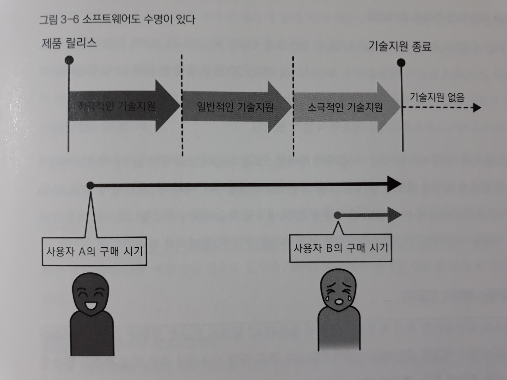

# 3장. 데이터베이스에 얽힌 돈 이야기

> 초기비용과 운영비용

## 1. 데이터베이스의 초기비용

**[시스템의 전체비용 내역]**

> 시스템을 구축하고 운영하는 활동에 드는 비용 = 초기비용 + 운영비용

- 초기비용 - 최초에 지급하는 돈

  - 하드웨어 구매비용
  - 엔지니어나 프로그래머의 급여

- 운영비용 - 서비스를 이용하는 기간에 계속 지급하는 돈

  - 장애 대응이나 프로그램 수정과 같은 유지보수 비용

**[데이터베이스의 초기비용]**

데이터베이스를 도입할 때의 초기비용은 **소프트웨어의 라이선스(License) 요금**이다.

- 라이선스 요금이란 '소프트웨어 사용허가료'이다.

- 라이선스 요금은 물리적인 단위가 아니라 논리적인 단위로 판매되고 있다.

  - 프로세서 라이선스(Processor License)

    : **DB서버의 CPU 성능(프로세서 코어 수)**에 따라 가격이 결정됨.

    실제로 어느 정도 규모를 가진 상용 시스템에서는 사용자 수를 파악하기가 어려워서 `프로세서 라이선스`를 사용하는 경우가 대부분이다.

  - 사용자 라이선스(User License)

    : DBMS를 이용하는 사용자 수에 따라 가격이 결정되는 라이선스 체계

  => 프로세서 성능이나 사용자 수는 `시스템의 규모`를 측정하기 위한 척도이다.

- PostgreSQL이나 MySQL 같은 `오픈소스 DBMS`는 라이선스료 자체가 무료인 경우가 있다.

  > 오픈소스 DBMS는 데이터베이스의 초기비용을 0원으로 할 수 있기 때문에 인기가 있다.

**[초기비용을 늘리는 범인]**

> **에디션**과 **옵션**을 이해해야 미래에는 필요하지 않을 기능까지 구매하지 않는다.

대부분 DBMS 제품은 다음 2가지의 **에디션**을 사용한다.

- 스탠다드 에디션 (SE, Standard Edition)

  : 중소규모 시스템용

- 엔터프라이즈 에디션 (EE, Enterprise Edition)

  : 대규모 시스템용

  **스탠다드 에디션에는 없는 편리한 기능이 있어서 그만큼 가격이 높다.**

  - `신뢰성(가용성)`
    - 클러스터 구성
    - 리플리케이션(Replication)
  - `성능`
    - 일정 수량 이상의 프로세서 기술지원(서포트)
    - 테이블 파티셔닝
    - 성능 리포트 출력
    - 데이터 압축
  - `보안`
    - 데이터 암호화
    - 감사로그 기록

  => 오픈소스 데이터베이스와 비교해서 벤더에 의해 개발된 데이터베이스 제품 쪽이 이런 편리한 기능에 대한 **고급 기능**을 가지고 있다.

어느 정도 큰 시스템이라면 데이터베이스의 라이선스료만으로도 '억' 단위가 넘기 때문에 그 타당성에 대해 검토해야 한다.

``` java
*익스프레스 에디션(Express Edition)이란?
    -'시험판'을 의미한다.
    -평범한 기능 확인이나 동작 확인용 환경 구성과 같이 한정된 영역에서 주로 사용한다.
    -특징은 다음과 같다.
    	1. 벤더가 제시하는 이용 요건을 지키는 한 라이선스료는 무료다.
    	2. 기능 일부에 제한을 두어 사용할 수 없다.
```


## 2. 데이터베이스의 운영비용

데이터베이스에서 운영비용은 **기술지원 비용**이다.

- 기술 Q&A
- 버그 수정을 위한 프로그램(패치) 배포
- 최신 버전으로의 업데이트 권리
- 새로운 OS나 하드웨어에의 대응
- 전문 기술자나 컨설턴트를 통한 문제 해결
- 노하우나 버그 정보 같은 기술 데이터베이스로의 접근 권리

> 사실 대부분의 상용 OS나 미들웨어를 **기술지원** 없이 사용하는 경우는 없다.
>
> => 가장 큰 이유는 OS나 미들웨어가 매우 복잡한 로직을 쌓아 올려 구현된 소프트웨어라서 버그와 무관할 수 없기 때문이다.

**[기술지원 수준은 매년 내려간다]**

기술지원 서비스를 이용할 때 서비스의 수준(서비스 레벨)은 제품 구매 시점이 아닌 **제품의 배포 시점을 기준으로 해서** 시간이 경과함에 따라 낮아져서 최후에는 `기술지원 종료`를 맞게 된다.



- **EOSL (End of Service Life)**

  : 기술지원이 종료하는 타이밍

  > **EOSL**은 시스템 개발의 초기단계에서 어떤 소프트웨어를 채택할지 검토할 때에 자주 나오는 단어이므로 기억해두자.

**[라이선스와 서브스크립션]**

- 서브스크립션 (Subscription)

  : 기한을 정한 사용허가. `사용권의 대여`라고 할 수 있다.

  소프트웨어의 사용권 뿐만이 아니라 기술지원 서비스도 포함되어 있다.

  **이는 모든 비용이 운영비용에 포함되어 있어서 초기비용이 없는 패턴이라고 생각할 수 있다.**


*라이선스는 돈을 지급하면 기본적으로 무기한으로 사용할 수 있다. (기술지원 기간이 종료되면 지원을 받지 못하는 상태가 되고, 그 이후는 고객의 책임이 되어 알아서 해야 한다)


## 3. 초기비용과 운영비용의 조합

1. 초기비용 있음 + **운영비용 있음**

   : `Oracle`이나 `SQL Server` 등 일반 벤더 제품의 데이터베이스를 사용하는 경우로, 상용 시스템에서 가장 일반적이다.

   **구매 모델**이라고도 하며, 반영구적으로 이용 가능하며 장기적인 계획을 세울 수 있다.

2. 초기비용 없음 + **운영비용 있음**

   : `오픈소스 소프트웨어(OSS, Open Source Software)`를 이용한다.

   따라서 라이선스료는 무료로 하고 '기술지원료'만을 유상으로 하거나, 기한이 정해진 소프트웨어 사용권과 기술지원을 받을 수 있는 권리를 묶어서 판매하는 `서브스크립션 형식`을 따르는 것도 있다.

   대표적으로 `MySQL`이 있다.

   **임대 모델**이라고도 하며, 시범 도입이 가능하고 타 데이터베이스로 마이그레이션이 쉽다는 장점이 있다.

   ``` java
*PaaS(Platform as a Service)
      -미들웨어까지 포함한 클라우드 서비스의 임대 모델
      -Amazon사가 제공하는 클라우드 서비스인 AWS에서는 클라우드에 준비된 Oracle이나 MySQL을 이용할 수 있는 서비스가 제공된다.
   ```
   
3. 초기비용 있음 + 운영비용 없음

   : 기술지원이 없는 것을 의미하므로 현실적인 선택지가 아니다.

4. 초기비용 없음 + 운영비용 없음

   : 완전 무료인 소프트웨어라서 상용 시스템에 사용하는 수준의 품질을 요구하는 데이터베이스에서는 현실적으로 존재하지 않는다.

