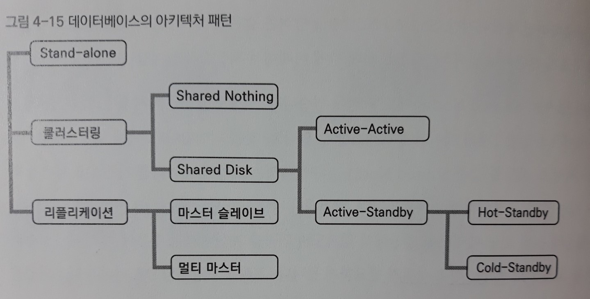
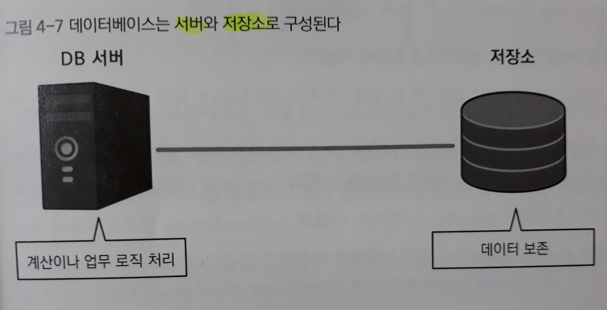
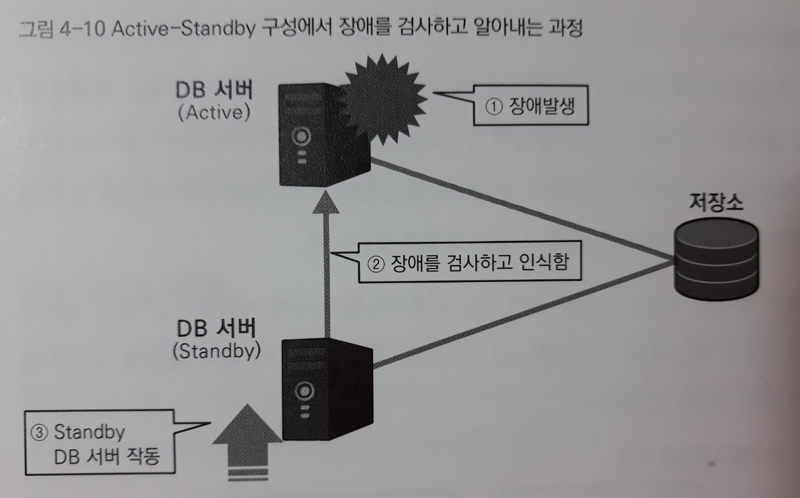
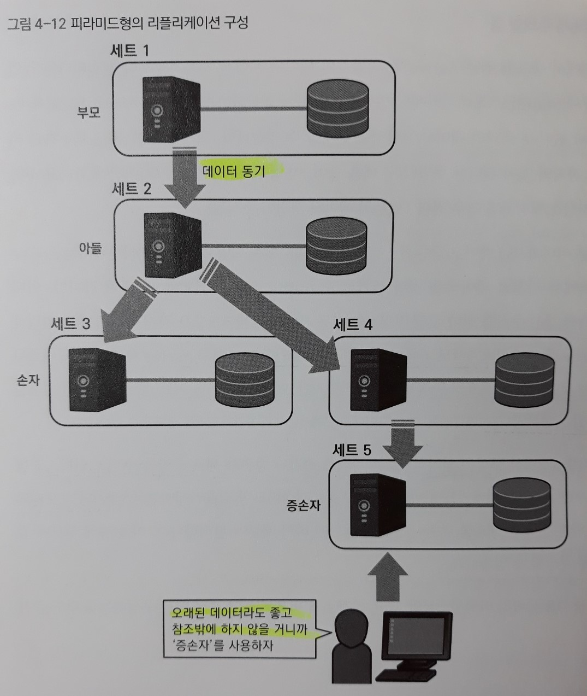
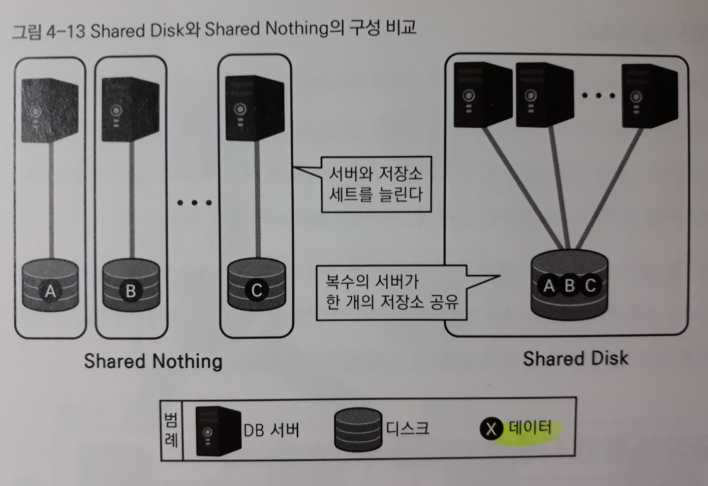

# 4장. 데이터베이스와 아키텍처 구성

> 고속의 견고한 시스템을 구축하기 위해서는 아키텍처가 명확한 의도로 설계되어야 한다.

**데이터베이스는 견고하게 유지되는 것이 요구된다.** 문제가 발생할 때마다 정지해서는 인프라로써의 역할을 다하지 못하기 때문.

- 다중화 - DB 서버를 여러대 두어 1대가 고장난다 하더라도 나머지 서버가 동작하면 서비스의 정지를 막을 수 있다.

  ​	즉 예비용이 준비된 것. `고가용성`이라고도 부른다.

## 1. 아키텍처란

> 데이터베이스의 설계 중에서 **아키텍처(시스템의 구성)**에 관해 살펴본다.

'아키텍처'란 말은 다양한 의미가 있지만, 이 장에서는 주로 '**시스템을 만들기 위한 물리 레벨의 조합**'이란 의미로 사용한다.

구체적으로는 '어떤 기능을 가진 서버를 준비하고 어떠한 저장소나 네트워크 기기와 조합해서 시스템을 만들 것인가' 즉 **하드웨어와 미들웨어의 구성**을 가리킨다.

이 구성을 **시스템이 완수해야 할 목적과 비교하면서 결정**해 가는 것이 `아키텍처 설계`이다.

('물리 설계'로 불러도 좋겠지만, 시스템의 '뼈대'를 생각하는 상위 설계란 함축적 의의가 담겨있다)

- 아키텍처 설계는 매우 심도 있는 영역이라서 이를 목표로 한다면 데이터베이스 + 서버부터 OS, 기타 미들웨어, 저장소, 로드밸런서에 방화벽 같은 네트워크 기기까지 폭넓은 지식이 필요하다.
- 아키텍처는 시스템 개발 후반이 되면 변경하기가 어려우므로 프로젝트의 성패는 초반에 결정되는 것이 일반적이다.


## 2. 데이터베이스의 아키텍처



(데이터베이스에서 가용성과 성능을 높이는 기술은 '클러스터링'과 '리플리케이션'으로 크게 나눌 수 있다)

### ① 역사와 개요

1. Stand-alone (~1980년대)

   > 데이터베이스만으로 시스템이 성립하는 가장 간단한 방법

   직역하면 '혼자'라는 의미이다. Stand-alone은 문자 그대로 DB 서버가 LAN이나 인터넷 등의 네트워크에 접속하지 않고 **독립되어** 동작하는 구성이다.

   이 구성에서는 DBMS와 애플리케이션 소프트웨어는 같은 DB 서버에서 동작한다.

   따라서 데이터베이스를 사용하고 싶은 사용자는 **DB 서버가 설치된 장소까지 물리적으로 접근**하여 서버 앞에 앉아서 데이터베이스를 이용해야 한다.

   **[Stand-alone의 단점]**

   현대적인 컴퓨터가 막 등장하기 시작한 이 시기에는 `네트워크`라는 아이디어가 없었기 때문에 모든 컴퓨터가 Stand-alone 구성이었다. 현재는 이 원시적인 Stand-alone 구성은 극히 소규모 작업 환경이나 테스트 환경을 제외하면 거의 볼 수 없다.

   - 물리적으로 떨어진 장소에서 접근할 수 없다

   - 복수 사용자가 동시에 접속할 수 없다

     : 서버 앞에서 1명씩만 사용할 수 있으므로 대기열이 늘어난다.

   - 가용성이 낮다

     : 서버가 1대밖에 없으므로 이 1대에 장애가 발생하면 서비스가 정지한다는 큰 단점이 있다.

     - **가용성(Availablity)** - 시스템이 서비스 제공시간에 **장애 없이** 서비스를 계속 지속할 수 있는 비율이 어느 정도인가를 나타내는 개념

   - 확장성이 부족하다

     : '성능이 나쁘다'는 것 이상으로 성능이 나쁠 때 '개선 수단'이 매우 부족하다.

     실제 머신이 1대밖에 없다는 것은 머신 그 자체의 성능을 올리는 방법(서버를 상위기종으로 교환하거나 더 고성능의 부품으로 교환함) 이외에 개선 수단이 없다는 것을 의미한다.

     이러한 구성을 '`확장성(Scalability)`이 부족하다'고 표현한다. 

   => 물리적으로 떨어진 장소에서는 접근할 수 없고, 복수 사용자가 동시에 접속할 수 없다는 두 가지 단점은, 서버와 네트워크를 연결하는 것이 해결책이다. 하지만 가용성과 확장성은 단순히 서버를 네트워크에 접속하게 하는 것으로는 해결되지 않고 **특별한 대책**이 필요하다.

   **[Stand-alone의 장점]**

   - 구축이 매우 간단해서 소규모 작업이나 테스트를 빨리 할 수 있다

   - 보안이 매우 높다

     : 네트워크를 매개로 침입할 위험이 없기 때문

2. 클라이언트/서버 (1990년대~2000년)

   > 클라이언트와 서버로 계층을 분리하여 상호 간에 네트워크로 접속하는 방법

   Stand-alone의 단점을 극복하기 위해 데이터베이스를 **네트워크**에 연결하여, 복수 사용자가 물리적으로 떨어진 장소에서 데이터베이스에 접속할 수 있게 되었다.

   

   DB 서버에서는 DBMS가 동작하고 클라이언트에서는 업무 애플리케이션이 동작하는 분업체제로 볼 수 있다.

   ``` java
   **서버와 클라이언트의 구별
       -클라이언트: 엔드 사용자가 직접 조작해서 수행하고 싶은 처리 명령을 내보내는 머신
       -서버: 클라이언트로 받은 명령을 실행하여 업무 처리(비즈니스 로직)를 실행하기 위한 머신
           용도에 따라 '웹 서버, 애플리케이션 서버, DB 서버' 등의 이름이 붙어있다.
   ```

   **[클라이언트/서버의 확장]**

   이 구성은 주로 기업이나 조직 내에 **닫힌 네트워크(LAN)에서 이용**되었다. 즉 인터넷 등 외부 네트워크를 거쳐 데이터베이스 서버에 사용자가 접속하는 일은 없었다.

   그 이유는 데이터베이스가 매우 중요한 정보를 많이 축적하고 있는 서버라서 외부로부터의 접속을 허가해버리면 **보안상의 위험**이 증가하기 때문이다.

   - 현재는 조직 내에서 제한된 용도의 시스템으로 이용되고 있다.

   **[클라이언트/서버 구성의 단점]**

   **인터넷을 통해 시스템을 이용할 때** 이 구성은 2가지 문제점이 존재한다.

   1) 인터넷에서 직접 데이터베이스에 접속하는 것에 대한 보안 위협

   2) 불특정 다수의 사용자가 사용하는 클라이언트에서의 애플리케이션 `관리비용`이 많이 든다

   - 클라이언트/서버 시대에는 개인이 이용하는 PC에 `애플리케이션`을 설치해 동작하게 했다. (=**네이티브Native 애플리케이션: 애플리케이션을 클라이언트에서 관리함**- Windows용 GUI 애플리케이션은 C나 Basic을 이용하여 만들었다)

     그러나 인터넷을 통해 전 세계 불특정 다수가 이용하는 애플리케이션은 각자의 환경에 대응해 애플리케이션을 작성하고 버전 관리를 따로 해야 하므로 비현실적인 비용이 필요하게 된다.

   

3. Web 3계층 (2000년~현재)

   > 클라이언트/서버를 더욱더 발전시킨 것
   >
   > 현재 웹 시스템에서 거의 표준으로 사용된다.
   
   '네이티브 애플리케이션의 관리비용 문제' 때문에 비즈니스 로직을 실행하는 **애플리케이션을 서버에서 관리**해 비용을 절감하는 `Web 3계층` 구성이 제시되었다. (서버에서 Java로 구현)
   
   Web 3계층은 시스템을 다음 3가지 계층의 조합으로 생각하는 모델이다.

   - 웹 서버 계층
   - 애플리케이션 계층
   - 데이터베이스 계층

   

   `클라이언트/서버` 구성과 다른 점은 클라이언트와 데이터베이스 계층 사이에 '**웹 서버 계층**'과 '**애플리케이션 계층**'이 추가된다는 점이다.

   - 웹 서버 계층
   
     : 클라이언트로부터 **접속 요청(HTTP 요청)을 직접 받아서** 그 처리를 뒷단의 애플리케이션 계층(애플리케이션 서버)에 넘기고 그 결과를 클라이언트에 반환한다. 
   
     즉 애플리케이션 서버와 클라이언트 웹 브라우저 사이의 다리 역할을 한다.
   
     - 아파치(Apache), IIS(Internet Information Services) 등
   
   - 애플리케이션 계층
   
     : **비즈니스 로직을 구현한 애플리케이션이 동작하는 층**이다. 
   
     웹 서버로부터 연계된 요청을 처리하고, 필요하면 데이터베이스 계층(DB 서버)에 접속해서 데이터를 추출하고 이를 가공한 결과를 웹 서버로 반환한다.
   
     - 톰캣(Tomcat), 웹로직(WebLogic), 웹스피어(WebSphere) 등

   > 이처럼 **사용자로부터 직접적인 접속 요청을 받는 역할을 웹 서버 계층에 한정**하여 애플리케이션 계층과 데이터베이스 계층의 **보안**을 높일 수 있다. 
   >
   > 동시에 애플리케이션 계층에 비즈니스 로직을 집중해서 애플리케이션 관리 비용을 낮추는 구성이 될 수 있다.

### ② 가용성과 확장성의 확보

`Web 3 계층`으로 `Stand-alone` 구성의 단점 중 2가지 문제는 해결했다.

​	① 물리적으로 떨어진 장소에서 접근할 수 없다 

​	② 복수 사용자가 동시에 작업할 수 없다

하지만 아직 다음과 같은 문제들이 남아있다.

​	③ 가용성이 낮다 (**서버가 1대밖에 없기 때문에** 장애가 일어나면 서비스가 정지한다) 

​	④ 확장성이 부족하다 (**서버가 1대밖에 없기 때문에** 해당 서버의 성능이 한계에 달하는 경우 서버를 상위 기종으로 교환하거나 고성능 부품으로 교환하는 것 외에는 성능을 개선할 방법이 없다)

**[가용성을 높이는 2가지 전략]**

아키텍처 설계에서 **견고한 시스템**을 만들기 위해 가장 중요한 점이 `가용성`이다.

1. 고품질-소수전략

   : 시스템을 구성하는 **각 컴포넌트의 <u>신뢰성</u>을 높여 장애 발생률을 낮게 억제해서** <u>가용성</u>을 높인다.

   ``` java
   *신뢰성과 가용성
       -신뢰성(Reliability)
        : 하드웨어나 소프트웨어 같이 시스템을 구성하는 컴포넌트에 적용하는 개념으로, 컴포넌트가 고장나는 빈도나 고장기간을 나타냄
       -가용성(Availability)
        : 시스템 전체에 적용하는 개념으로, 사용자 입장에서 볼 때 시스템을 어느 정도 사용할 수 있는지를 나타냄.
          일반적으로 백분율로 나타낸다.(가용률)
   	=> 따라서 신뢰성이 낮은 하드웨어나 소프트웨어를 사용하고 있다 하더라도 다중화(클러스터링) 한다면
         시스템 전체의 가용성을 높일 수 있다.
   ```

   - FT 서버 (Fault Tolerant Server)

     : 1대의 물리 머신의 신뢰성을 매우 높이고, 장애 발생률을 매우 낮게 억제하도록 만들어졌다.

     전환시간을 짧게 하고, 무정지에 가까운 서비스를 계속하는 것이 가능하다는 장점이 있다.

     => 하지만 FT 서버 내부는 CPU, 메모리, 네트워크 인터페이스 같은 부품을 `다중화`해서 신뢰성이 높도록 설계된 부분이 많다.  

2. 저품질-다수전략

   : 시스템을 구성하는 각 컴포넌트의 신뢰성을 계속 높이기보다는 **여분을 준비**해 둔다. (컴포넌트를 병렬화한다)

   **효율성이 우수하다는 것이 증명되어 현재는 거의 이 전략을 채택하고 있다.**

   - 클러스터

     : 이처럼 **동일한 기능의 컴포넌트를 병렬화하는 것**을 `클러스터링(Clustering)`이라고 부른다.

     '클러스터'는 사물이나 사람의 집합을 가리키는 말이다. 이 의미처럼 시스템 세계에서는 '**<u>동일한 기능</u>의 컴포넌트를 복수 개 준비해 <u>한 개의 기능</u>을 실현한다**'는 의미로 사용한다.

   - 단일 장애점

     : 다중화되어 있지 않아서 시스템 전체 서비스의 계속성에 영향을 주는 컴포넌트를 `단일 장애점(SPOF, Single Point Of Failure)`이라고 한다.

     단일 장애점의 신뢰성이 시스템 전체의 가용성을 결정한다.

     => 그래서 대부분 단일 장애점을 없애기 위해 이중화는 해둔다.


## 3. DB 서버의 다중화 - 클러스터링

> DB 서버는 다중화에서 특유의 어려운 문제점을 안고 있다.
>
> 현재도 다양한 노력으로 방법이 고안되고 있지만, 간단히 병렬화해서 대수를 증가시키는 **웹 서버**나 **애플리케이션 서버**와 비교하면 다중화에 대해 고민해야 할 부분이 많다.
>
> 그 이유는 **DB 서버가 데이터를 보존하는 '영속(Persistence) 계층'이기 때문**이다.
>
> 따라서 **저장소라는 병목 지점**이 생기는 것이 웹 서버와 애플리케이션 서버와는 다른 점이며, 이 때문에 데이터베이스가 성능 문제를 쉽게 일으킨다.

데이터베이스는 **데이터를 장기간 보존하는 `매체`가 필요**하다. 이것이 기본적으로 데이터를 일시적으로 처리할 뿐인 웹 서버나 애플리케이션 서버와 다른 점이다.

데이터베이스는 대량의 데이터를 영구적으로 보존해야 하고 그에 따른 성능도 요구되기 때문에 `데이터를 보존하는 매체`에 요구조건이 높다.

- 일반적으로는 서버 내부의 로컬 저장소나 메모리로는 이런 요건을 충족시키지 못하기 때문에 **전용의 외부 저장소**를 사용

  => **DB 서버의 아키텍처는 저장소와 묶어서 생각해야 한다.**



- CPU나 메모리 같은 데이터 처리에 필요한 컴포넌트를 다중화하는 것은 간단하지만, 데이터를 다중화하는 것은 매우 힘들다.

  **데이터는 항상 갱신되기 때문에** 다중화를 유지하는 중에 `데이터의 정합성`도 중요하게 의식해야 하기 때문이다.

**[가장 기본적인 다중화]**

> 가장 간단한 다중화 구성은 DB 서버만을 다중화하고 저장소는 하나만 두는 구성이다.
>
> 이 경우 데이터가 보존되는 저장소가 1개라서 정합성을 신경 쓸 필요가 없다.

- Active-Active 구성

  : 클러스터를 구성하는 컴포넌트(DB 서버)를 동시에 가동한다.

  저장소를 공유한 Active-Active 구성이 가능한 DBMS는 현재 `Oracle`과 `DB2` 뿐이다.

  - 장점

    1. 시스템 다운 시간이 짧다

       : 한 대가 다운되어도 남은 서버가 처리를 계속해 시스템 전체가 정지하는 것을 방지할 수 있다.

    2. 성능이 좋다

       : DB 서버 대수가 증가하면 동시에 가동하는 **CPU나 메모리도 증가**하기 때문에 성능도 향상될 수 있다.

       **단, 저장소가 병목이 되기 때문에 생각만큼 성능이 향상되지 않는 경우도 있다.** (`Shared Disk`, `Shared Nothing`)

- Active-Standby 구성

  : 클러스터를 구성하는 컴포넌트 중 실제 가동하는 것은 Active, 남은 것은 대기(Standby)하고 있는다.

  보통 Standby 상태의 DB 서버는 사용되지 않다가 Active DB 서버에서 장애가 일어날 때만 사용된다. 
  
  이 때문에 전환될 때까지 시차(수십 초~수 분)가 생기고 그 사이 시스템은 다운 상태가 된다.
  
  
  
  - Heartbeat
  
    : Standby DB 서버는 **일정 간격(보통 수 초~수십 초)으로 Active DB에 이상이 없는지를 조사하기 위한 통신**을 하고 있다.
  
    이 통신을 `Heartbeat`라고 한다.
  
    Active DB에 장애가 발생하면 이 신호가 끊기기 때문에 Standby 측은 Active가 다운되었다는 것을 알게 된다.
  
  - Active-Standby 구성의 종류
  
    - Cold-Standby
  
      : 평소에는 Standby DB가 작동하지 않다가 Active DB가 다운된 시점에 작동
  
    - Hot-Standby
  
      : 평소에도 Standby DB가 작동
  
      항상 2대의 DB 서버를 사용하지만, 실제로 작동하는 것은 Active DB 1대뿐이기 때문에 전환 시간을 줄이기 위해 라이선스료를 많이 지급하는 매우 사치스러운 구성이다. (그래도 Active-Active보다는 저렴함)
  
    두 구성은 성능 관점에서는 차이가 없으며, Hot-Standby 구성이 가용성 관점에서는 더 좋다.

``` java
** 각 구성을 가용성과 성능이 좋은 순으로 정리하면 다음과 같다.(라이선스료의 '가격순'과 같다)
    1. Active-Active
    2. Active-Standby(Hot-Standby)
    3. Active-Standby(Cold-Standby)
```

- Active-Active와 Active-Standby의 단점

  : 서버 부분은 다중화할 수 있어도 저장소 부분은 다중화할 수 없어서 데이터를 다중화하지 않는다. 즉, 저장소가 부서질 경우에는 데이터를 잃게 된다.


## 4. DB 서버와 데이터의 다중화 - 리플리케이션

> <u>**저장소**도 보통은 내부 컴포넌트가 다중화되어 있지만</u>, 데이터 센터 전체가 자연재해를 만나면 끝이다.
>
> 이런 상황을 대응하기 위한 클러스터 구성이 '**리플리케이션(Replication, 복제)**'이다.
>
> 이는 DB 서버와 저장소 세트를 복수로 준비하는 것을 말한다.

리플리케이션은 DB 서버와 저장소가 동시에 사용 불능일 때, 예를 들어 자연재해로 하드웨어가 설치된 시설이 파괴된 경우에 다른 1세트가 멀리 떨어진 지점에 놓여 있다면 서비스를 계속하는 것이 가능하다는 점에서 **매우 가용성이 높은 아키텍처**이다.

금융이나 공공관서 시스템과 같은 중요한 시스템에서는 위험 분산을 한다.

- 데이터를 물리적으로 멀리 떨어진 DB에 복사하는 기술은 리플리케이션 외에도 있다.

  멀리 떨어진 DB에 원격으로 SQL문을 실행하여 테이블 데이터를 복사하는 방법도 있다. 이런 기능은 `개발`에서 구현해야 한다.

``` java
**디스크를 다중화하는 RAID
    -저장소 내부의 컴포넌트(대부분 하드디스크)를 다중화하는 기술
     RAID(Redundant Array of Independent Disks)
    -클러스터링과 동일하게 단일 장애점을 없애는 것이 목표다.
    -디스크를 병렬로 나열해 디스크 한 개가 망가져도 데이터를 소실하지 않게 한다.
```

**[리플리케이션에서 주의할 점]**

1. 동기화 과정 중의 트레이드오프

   Active 측 저장소의 데이터는 항상 사용자로부터 갱신된다. 따라서 Standby 측 데이터에도 일정 주기로 갱신을 반영해야 한다. 

   이 최신화 처리를 **동기화(sync)**라고 한다. (Active 측을 마스터, Standby 측을 슬레이브라고 하여 `마스터 슬레이브 방식`이라고도 부른다)

   => 이때 **갱신 주기**와 **성능** 사이에 `트레이드오프` 관계가 생긴다.

   - 데이터 보호의 관점에서는 Standby 측 DB 서버에도 기록이 성공한 것을 `확인`한 후 Active 측의 갱신도 완료된 것으로 하는 것이 바람직하지만, 이 확인 처리를 어느 정도 생략하면 성능을 향상할 수 있기 때문이다.
   - Oracle이나 DB2에서는 이런 동기화 단계를 선택할 수 있다. 

2. 피라미드형 리플리케이션

   리플리케이션 구성은 손자나 증손자 세트를 만들 수 있다. 이런 구성을 **피라미드형**이라고 부른다.
   
   **'데이터가 오래되어도 상관 없으니 참조만 하면 된다'는 처리가 요청되는 경우, 손자나 증손자 세트에서 처리하여 부모에 걸리는 부하를 분산할 수 있다.**
   
   

> **결론** - 100% 장애대책은 불가능하다. '모든 전원 끊김' 같은 상황이 발생할 수 있기 때문이다.
>
> 따라서 다음으로 생각해야 할 것은 '짧은 시간 안에 복구'이다. **=> 데이터의 백업과 복구**


*MySQL은 리플리케이션 기능이 에디션에 상관없이 `DBMS 기본 기능`으로 이용할 수 있어서 리플리케이션용의 DB 서버 세트를 구축하기 위한 초기비용을 낮출 수 있다. (Oracle이나 DB2 등 벤더에 의해 개발된 DBMS에서는 상위 에디션이나 옵션을 사야 하고, DB 서버 세트가 증가할수록 라이선스료도 올라간다)

 

##  5. 성능을 추구하기 위한 다중화 - Shared Nothing

- Shared Disk

  : 복수의 서버가 1대의 디스크(저장소)를 사용하는 구성

  - 단점

    : Shared Disk 타입의 **Active-Active 구성**은 DB 서버를 무한으로 늘려도 무한으로 `처리율(Throughput: 단위 시간당 처리능력)`이 향상되지 않고 한계점에 도달하게 된다.

    이것은 **저장소가 공유 자원이라서** 쉽게 늘리기 어렵고 DB 서버 대수가 증가할수록 **DB 서버 간의 정보공유를 위한 오버헤드**가 크기 때문이다.

    **복잡한 동기화 구조**가 필요해서 구축하기가 복잡하다.

    - 이 단점을 극복하기 위한 아키텍처가 `Shared Nothing`이다.

- Shared Nothing

  : 네트워크 이외의 자원을 모두 분리하는(아무것도 공유하지 않는) 방식

  - 서버와 저장소의 세트를 늘리면 **병렬처리 때문에 성능이 `선형적`으로 향상된다**.

    저장소가 병목이 되는 것을 방지한다.

  

  - Shared Nothing 구성은 이전부터 연구가 진행되고 있었지만, Google이 그 유효성을 증명함으로써 단번에 주목을 받았다.

    Google은 자사가 개발한 Shared Nothing 구조를 '**샤딩Sharding**'으로 부르고 있다.

  - 장점

    : **비용 대비 성능이 좋다**.
    
    같은 구성의 DB 서버를 횡으로 나열하기 때문에 **구조가 간단**하다.
    
  - 단점
  
    : 저장소를 공유하지 않는 것은 결국 '각각의 DB 서버가 동일한 1개의 데이터에 엑세스할 수 없다'란 것을 의미한다.
  
    => DB 서버들의 데이터를 합산해서 계산하려는 경우에는 각 세트로부터 데이터를 모아서(네트워크로 연결) 집계하는 `정리 서버`가 필요하게 된다.
  
    또, 어떤 DB 서버가 다운되었을 때는 그 데이터에 액세스할 수 없게 된다.
  
    - **커버링(Covering) 구성**
  
      : 이런 문제에 대처하기 위해 DB 서버 하나가 다운되었을 때 다른 DB 서버가 이를 이어받아 계속 처리할 수 있게 하는 구성
  
  