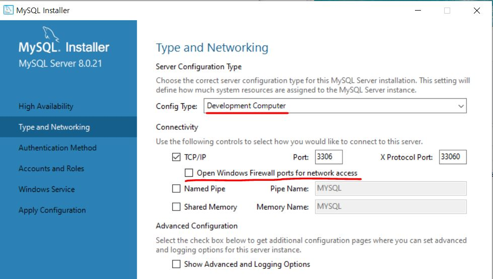
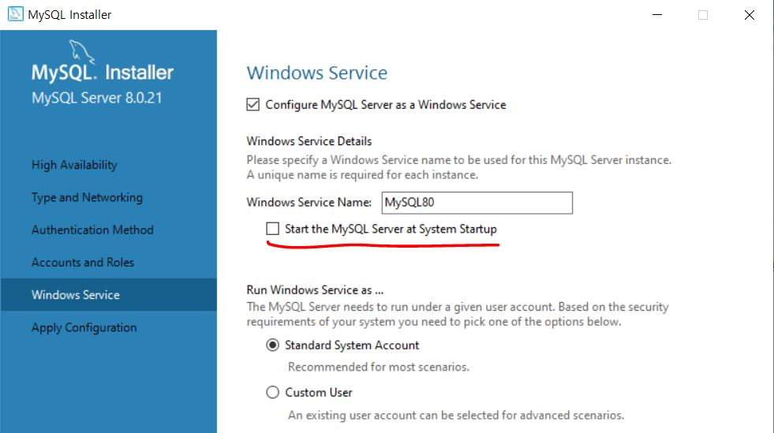

# 5장. DBMS를 조작할 때 필요한 기본 지식

> MySQL을 설치하는 방법과 MySQL을 조작하는 데 있어 알아두어야 할 기본 지식을 설명한다.

## 1. MySQL 설치하기

1. https://dev.mysql.com/ 홈페이지에서 MySQL Installer를 다운로드한다.

2. Configuration의 'Config Type'(서버 구성 타입)에서는 'Development Machine'을 선택한다.

   - 나머지는 기본 설정 그대로 괜찮지만, MySQL 서버와 클라이언트만을 이용하고 머신 외부에서는 접속하지 않는 경우에 **TCP/IP 네트워크를 무효화** 할 수도 있다. 이때는 'TCP/IP'에 있는 'Open Windows Firewall ports for network access'의 체크를 해제한다.

   

3. 서비스명을 설정한다.

   - `Windows`에서는 메모리에 상주하며 기능을 실행하기 위해 '서비스'라는 형태로 실행한다. 기본으로 Windows 기동 시에 시작하는(Start the MySQL Server at System Startup) 설정으로 되어 있지만, 메모리 등의 자원이 부족하거나 머신의 CPU 성능이 떨어지는 경우에는 설정에서 제외한다.

   

## 2. MySQL과 커넥션 만들기

MySQL 설치가 끝나면 처음으로 MySQL에 **로그인**한다.