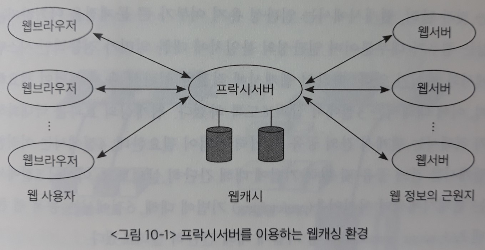

# 10장. 웹캐싱 기법

> 빠른 웹서비스를 위해 사용되는 웹캐싱 기술의 필요성과 종류, 각종 알고리즘에 대해 살펴본다.

## 1. 웹캐싱

- 캐싱(caching) 기법

  : 저장장치 계층 간의 속도 차이를 완충시켜주기 위한 기법

  - 컴퓨터 구조 - 캐시 메모리

  - 운영체제 - 페이징 기법

  - 데이터베이스 - 버퍼링 기법

  - 웹, 컨텐츠 전송 네트워크(Contents Delivery Network: CDN) 서비스

    => **단일 시스템** 내에서 속도 차가 있는 저장장치 간에 이루어지는 캐싱 기법뿐 아니라, **원격지의 객체를 캐싱하는 기법**의 중요성이 커지고 있다.

- 웹캐싱(Web caching)

  : 웹 사용자에 의해 빈번히 요청되는 데이터를 사용자와 지리적으로 가까운 **웹캐시 서버**에 보관해 빠른 서비스를 가능하게 하는 기법

  - 웹 사용자 차원에서의 캐싱

  - 프록시서버

    : 웹캐싱만을 전담하는 서버

    - 그룹의 `웹 사용자`에 대한 **서비스 지연시간을 줄이기 위해** 사용됨
    - 궁극적으로는 **네트워크의 대역폭 절약**과 함께, **`웹서버`의 부하를 줄이는 역할**도 담당한다.

  - 웹서버

    - `역방향 프록시 캐시(reverse proxy cache)`를 사용한다.
    - 그룹에 속한 `웹서버`의 객체들을 캐싱하여 **`웹서버`의 부하를 직접적으로 줄인다**.
    - 궁극적으로 `웹 사용자`의 **서비스 지연시간을 줄이는 역할**을 하게 된다.

  

`캐싱 시스템`의 성능에 있어서 중요한 역할을 하는 부분 중 하나가 **캐시 교체 알고리즘(cache replacement algorithm)**이다.

- 캐시 교체 알고리즘

  : **한정된 캐시 공간**을 가지고 사용자들의 지속적인 요청을 처리하기 위해, **어떠한 객체를 캐시에 보관하고 어떠한 객체를 캐시에서 삭제할지 온라인으로 결정**하는 알고리즘

  - 전통적인 캐싱 시스템(버퍼캐싱, 페이징)
    - `LRU(Least Recently Used)` 알고리즘 등
  - 웹캐시
    - 기존의 `캐싱 시스템`과 다른 여러 가지 독자적인 특성을 반영하는 새로운 교체 알고리즘

`캐싱 시스템`은 통상적으로 **일관성 유지(consistency policy) 기법**을 필요로 한다.

- 일관성 유지 기법

  : 사용자가 요청한 객체가 캐싱되어 있는 경우, 이 객체가 근원지에 있는 객체와 동일한지를 확인해서 사용자에게 최신의 정보를 전달하는 기법

  - `웹캐싱 환경`에서는 **캐시**에 보관된 웹 객체가 **근원지 서버**에서 변경될 수 있다.

  > - 전통적인 컴퓨터 시스템
  >
  >   : `캐시 일관성`을 유지하지 못하면 시스템 전체에 치명적인 문제점을 발생시킬 수 있다.
  >
  > - 웹캐시
  >
  >   : 일관성 유지 여부가 큰 문제점을 야기하지는 않는 경우가 대부분이다.
  >   
  >   **일관성의 불일치**에 대한 의미가 전통적인 시스템에서와 차이가 있다.
  >
  > => 따라서 웹캐시에 적절한 일관성 유지 기법이 필요하다.

## 2. 웹캐시의 교체 알고리즘

