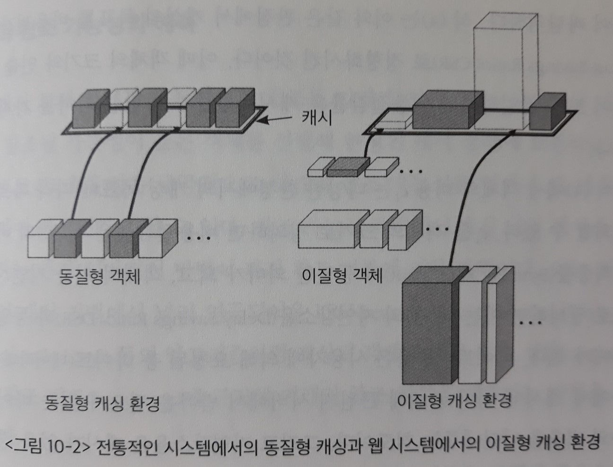
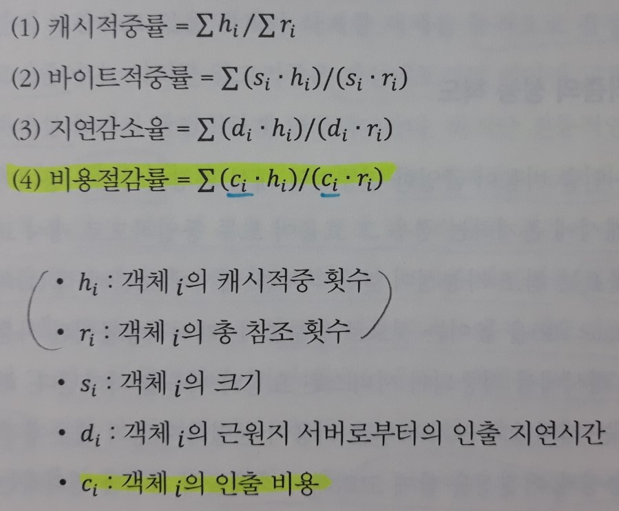
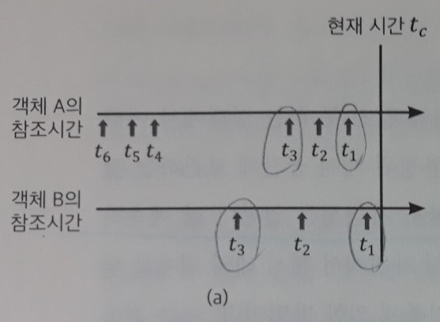
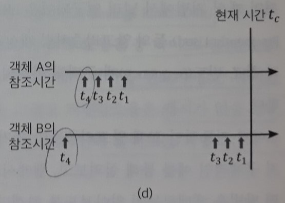
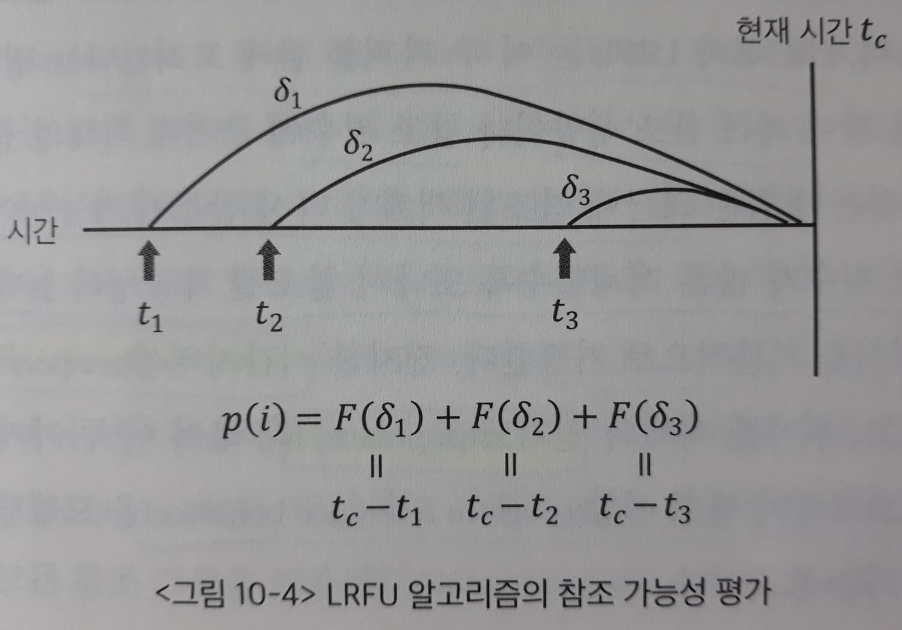
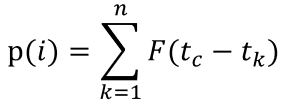
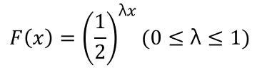

# 10장. 웹캐싱 기법

> 빠른 웹서비스를 위해 사용되는 웹캐싱 기술의 필요성과 종류, 각종 알고리즘에 대해 살펴본다.

## 1. 웹캐싱

- 캐싱(caching) 기법

  : 저장장치 계층 간의 속도 차이를 완충시켜주기 위한 기법

  - 컴퓨터 구조 - 캐시 메모리

  - 운영체제 - 페이징 기법

  - 데이터베이스 - 버퍼링 기법

  - 웹, 컨텐츠 전송 네트워크(Contents Delivery Network: CDN) 서비스

    => **단일 시스템** 내에서 속도 차가 있는 저장장치 간에 이루어지는 캐싱 기법뿐 아니라, **원격지의 객체를 캐싱하는 기법**의 중요성이 커지고 있다.

- 웹캐싱(Web caching)

  : 웹 사용자에 의해 빈번히 요청되는 데이터를 사용자와 지리적으로 가까운 **웹캐시 서버**에 보관해 빠른 서비스를 가능하게 하는 기법

  - 웹 사용자 차원에서의 캐싱

  - 프록시서버

    : 웹캐싱만을 전담하는 서버

    - 그룹의 `웹 사용자`에 대한 **서비스 지연시간을 줄이기 위해** 사용됨
    - 궁극적으로는 **네트워크의 대역폭 절약**과 함께, **`웹서버`의 부하를 줄이는 역할**도 담당한다.

  - 웹서버

    - `역방향 프록시 캐시(reverse proxy cache)`를 사용한다.
    - 그룹에 속한 `웹서버`의 객체들을 캐싱하여 **`웹서버`의 부하를 직접적으로 줄인다**.
    - 궁극적으로 `웹 사용자`의 **서비스 지연시간을 줄이는 역할**을 하게 된다.

  

`캐싱 시스템`의 성능에 있어서 중요한 역할을 하는 부분 중 하나가 **캐시 교체 알고리즘(cache replacement algorithm)**이다.

- 캐시 교체 알고리즘

  : <u>미래의 참조를 미리 알지 못하는 상태에서</u> 한정된 캐시 공간에 **보관하고 있을 객체와 삭제할 객체를 동적으로 결정**하는 온라인 알고리즘

  - 전통적인 캐싱 시스템(버퍼캐싱, 페이징)
    - `LRU(Least Recently Used)` 알고리즘 등
  - 웹캐시
    - 기존의 `캐싱 시스템`과 다른 여러 가지 독자적인 특성을 반영하는 새로운 교체 알고리즘

`캐싱 시스템`은 통상적으로 **일관성 유지(consistency policy) 기법**을 필요로 한다.

- 일관성 유지 기법

  : 사용자가 요청한 객체가 캐싱되어 있는 경우, 이 객체가 근원지에 있는 객체와 동일한지를 확인해서 사용자에게 최신의 정보를 전달하는 기법

  - `웹캐싱 환경`에서는 **캐시**에 보관된 웹 객체가 **근원지 서버**에서 변경될 수 있다.

  > - 전통적인 컴퓨터 시스템
  >
  >   : `캐시 일관성`을 유지하지 못하면 시스템 전체에 치명적인 문제점을 발생시킬 수 있다.
  >
  > - 웹캐시
  >
  >   : `캐시 일관성` 유지 여부가 큰 문제점을 야기하지는 않는 경우가 대부분이다.
  >   
  >   **일관성의 불일치**에 대한 의미가 전통적인 시스템에서와 차이가 있다.
  >
  > => 따라서 웹캐시에 적절한 일관성 유지 기법이 필요하다.

## 2. 웹캐시의 교체 알고리즘

`캐싱 기법`의 성능은 `캐시 교체 알고리즘`에 의해 크게 좌우된다.

- 전통적인 캐싱 환경

  - **객체의 동질성**

    : 캐싱 대상이 되는 **객체들의 크기**와 **인출 비용**이 균일하다.

    - `가상메모리`의 페이지 교체 알고리즘
      - 객체 = 동일한 크기의 페이지
      - 인출 = 캐시부재(cache miss) 시 페이지를 `디스크(스왑 영역)`에서 `메모리`로 읽어오기 때문에 비용이 균일함
    - 버퍼캐싱
      - 객체 = 동일한 크기의 논리블록
      - 인출 = 캐시부재(cache miss) 시 페이지를 `디스크(파일 시스템)`에서 `메모리`로 읽어오기 때문에 비용이 균일함

- 웹캐싱

  - **객체의 이질성**

    : 캐싱 대상이 되는 **객체들의 크기**와 **인출 비용**이 균일하지 않기 때문에, 효율적인 교체 알고리즘의 설계에 어려움이 따른다.

    - 객체 = **하나의 URL에 대응하는 `파일` 단위**로 캐싱이 이루어지기 때문에 캐싱 단위의 크기가 균일하지 않음
    - 인출 = 객체를 가지고 있는 **`근원지 서버`의 위치 및 특성**에 따라 객체를 캐시로 읽어오는 비용이 다름

### 1) 교체 알고리즘의 성능 척도

- 식 (1) - 캐시 적중률(Hit Rate: HR)
  : 사용자의 총 요청 중 캐시에서 **적중**되어 서비스된 요청의 비율

  > 객체의 **크기**와 **인출 비용**이 균일한 `전통적인 캐싱 환경`에서는, 사용자가 요청한 객체가 캐시에 존재하는 경우 그 **효용이 모두 동일**하다.
  >
  > => 따라서 `캐시 교체 알고리즘`의 **목표**는 참조 가능성이 높은 객체를 캐시에 보관해 `캐시 적중률`을 높이는 것이다.

- 식 (4) **비용** 절감률(Cost-Savings Ratio: CSR)

  : `캐시 적중률`(참조 가능성) 식을 일반화하여, 캐싱 대상이 되는 <u>객체들의 **비용**</u>(이질성)까지 포함한 식

  > `웹캐싱`에서는 객체들의 **크기**와 **인출 비용**이 균일하지 않기 때문에, 객체들의 **참조 가능성**과 **이질성**을 함께 고려해서 객체들의 가치를 평가한다.
  >
  > => 따라서 `캐시 교체 알고리즘`의 **목표**는 참조 가능성이 높고 비용을 절감할 수 있는 객체를 캐시에 보관해 `비용 절감률`을 높이는 것이다.

  <u>객체의 비용 C*i*</u>는 **다양한 캐싱 환경**에서의 목표에 따라 다르게 정의할 수 있다. 

  - 객체의 **크기**와 **인출 비용**이 모두 균일하다면, 식(1)의 `캐시 적중률`과 동일한 의미가 된다.
  - C*i*를 객체의 **크기**로 정의하면, 식(2)의 `바이트 적중률`과 동일한 의미가 된다.
  - C*i*를 객체의 **인출 지연시간**으로 정의하면, 식(3)의 `지연 감소율`과 동일한 의미가 된다.

- 식 (2) 바이트 적중률(Byte Hit Rate: BHR)

  : 사용자에 의해 요청된 총 바이트(데이터의 양) 중에서, 캐시에 이미 존재해 근원지 서버에서 받아올 필요가 없는 바이트 수의 비율

- 식 (3) 지연 감소율(Delay Savings Ratio: DSR)

  : 캐시가 없을 경우의 총 사용자 지연시간 중, 캐시가 있음으로 인해 줄어드는 지연시간의 비율

### 2) 참조 가능성의 예측

`캐시 교체 알고리즘`의 `효율성`은 **미래의 참조 가능성을 얼마나 잘 예측하는가**에 좌우된다.

참조 가능성 차원에서 캐시 내의 객체를 평가하는 가장 일반적인 방법은 **과거 참조 기록**에 의한 방법이다.

=> 이는 캐싱된 객체의 **최근 참조 성향(recency)**과 **참조 빈도(frequency)**에 근거해 객체의 `참조 가능성`을 예측하는 방법을 말한다. 이 방법은 `시간지역성`과 `참조 인기도`라는 두 가지 개념을 기본적으로 가정한다.

- 시간지역성(temporal locality)

  : 최근에 참조된 객체가 다시 참조될 가능성이 높다.

- 참조 인기도(popularity)

  : 참조 횟수가 많은 객체일수록 또다시 참조될 가능성이 높다.

> 이 두 가지 개념은 **컴퓨터 프로그램의 참조 성향(program reference behavior)**을 모델링하는 데 널리 사용되는 요소이다.

**[전통적인 캐싱 환경에서의 교체 알고리즘]**

`LRU`는 **최근 참조 성향**만을 고려하고, `LFU`는 **참조 횟수**만을 고려한다.

`LRU-K`와 `LRFU`는 이 두가지를 함께 고려한다.

- LRU(Least Recently Used)

  : 좀 더 최근에 참조된 객체에 더 높은 가치를 부여한다.

  - 단점

    : **가장 최근의 참조 기록만을 활용**하기 때문에, 자주 참조되는 객체와 그렇지 않은 객체를 구분할 수 없다.

- LFU(Least Frequently Used)

  : 참조 횟수가 많은 객체에 더 높은 가치를 부여한다.

  - 단점

    : 최근에 전혀 참조되지 않았더라도 **오래전에 많이 참조된 객체에 높은 가치를 부여**하므로, 새로 참조되기 시작한 객체를 캐시에서 쫓아낼 우려가 있다. 

`LRU-K`와 `LRFU`는 **버퍼캐싱**에서 연구되고 사용된 기법들이다.

- LRU-K

  : 가장 최근에서 K번째 참조된 시각에 의거해 가치를 평가한다.

  - ex) K = 3이면, 가장 최근에서 3번째 참조된 시각이 `현재 시각`에 더 가까운 객체의 가치를 더 높게 평가한다.

    즉 `LRU`에서는 t*1*이 현재 시각에 더 가까운 B에 더 높은 가치를 부여하지만, `LRU-K`에서는 t*3*이 현재 시각에 더 가까운 A에 더 높은 가치를 부여한다.

    

  - 단점

    : **K번째 참조 시각만을 고려**하고 최근 K-1번 참조된 시점들은 무시된다.

    - ex) K = 4인 경우, A의 t*4*가 현재 시각에 더 가깝기 때문에 A의 가치가 더 높게 평가된다.

    

- LRFU(Least Recently Frequently Used)

  : `LRU 기반 알고리즘`들의 문제점을 해결하기 위해, **각각의 참조 시점을 그 최근성에 근거해 고려**한다.

  과거 시점에서의 각각의 참조가 현재 객체의 `참조 가능성`을 예측하는 데 기여하게 되며, **최근의 참조일수록 기여도를 더 높게 계산한다**.

  - 객체의 참조 가능성 p(i) 계산

    > `LRFU`는 p(i)를 계산할 때, 객체 i에 대한 **모든 과거 참조 시점**과 **참조 횟수**를 다 이용한다.

    

    : 과거 시점에서의 각각의 참조가 객체의 가치를 높이는 데 기여하는 바를 각 시점의 최근성에 근거해 계산하고, **이를 더한다**. (n: 캐시에 들어온 후 참조된 횟수)

    

    - 함수 F(x)

      : `x시간 이전`의 참조에 의한 가치를 평가하는 함수

      => 최근의 참조가 객체의 가치를 높이는 데 더 큰 역할을 할 수 있도록 F(x)는 다음과 같이 **감소함수**로 정의된다.

      

      - λ = 1인 경우

        : `LRU 알고리즘`과 같은 방식으로 동작한다.

        **가장 최근의 참조 한 번**에 의한 F(x) 값이 그 이전에 이루어진 무수히 많은 참조에 의한 F(x) 값의 합보다 크기 때문이다. (∵ 이산 - 등비수열)

      - λ = 0인 경우

        : `LFU 알고리즘`과 같은 방식으로 동작한다.

        F(x) = 1이 되어 p(i)는 객체 i의 **과거 참조 횟수**를 뜻하게 되기 때문이다.

      - 0 ≤ λ ≤ 1인 경우

        : `LRU 알고리즘`과 `LFU 알고리즘`의 성질을 모두 가진다.

**[웹캐시의 교체 알고리즘]**

- `시간지역성`의 관점에서, 대부분의 웹캐싱 알고리즘들은 객체의 **직전 참조 시각**을 활용한다.

  - GD-SIZE

- `참조 인기도`의 관점에서, 일부 알고리즘의 경우 **객체의 참조 횟수**를 이용하고, 또 다른 부류의 알고리즘들은 **`노화 기법`을 추가해 `캐시오염(cache pollution)`을 방지**한다.

  - 노화 기법

    : 오래전에 이루어진 참조에 대해서는 참조 횟수를 계산할 때 **가중치**를 줄이는 방법

  - 캐시오염 현상

    : 오래전에 참조 횟수가 많았다는 이유로 **최근에 전혀 참조가 이루어지지 않는 객체들이 캐시 내에 유지되어 성능 저하를 초래**하는 현상

- `시간지역성`과 `참조 인기도`를 모두 고려하는 알고리즘들

  - LRV, MIX
    - **직전 참조 시각**과 **객체의 참조 횟수**를 동시에 고려
  - LNC-R
    - 과거 K번째 참조 시각을 이용한다. (`버퍼캐싱` 기법인 `LRU-K 알고리즘`을 이질형 객체를 위한 캐싱 기법에 맞게 **일반화**)
    - `시간지역성`과 `참조 인기도`를 결합시키는 또 다른 방법으로 볼 수 있다.
  - GD-SIZE(`시간지역성` 기반) + `참조 인기도` 결합
  - LUV
    - 과거의 모든 참조 기록을 이용한다. (`버퍼캐싱` 기법인 `LRFU 알고리즘`을 이질형 객체를 위한 캐싱 기법에 맞게 **일반화**)

### 3) 객체의 이질성에 대한 고려

- 전통적인 캐싱 환경

  : `전통적인 캐싱 환경`에서는 객체의 **크기**와 **인출 비용**이 균일하기 때문에, 사용자가 요청한 객체가 캐시에 존재하는 경우 그 **효용이 모두 동일**하다.

  => 따라서 `캐시 교체 알고리즘`의 **목표**는 참조 가능성이 높은 객체를 캐시에 보관해 `캐시 적중률(Hit Rate: HR)`을 높이는 것이다.

- 웹캐싱

  : `웹캐싱`에서는 객체들의 **크기**와 **인출 비용**이 균일하지 않기 때문에, 객체들의 **참조 가능성**과 **이질성(= 객체의 크기, 인출 비용)**을 함께 고려해서 객체들의 가치를 평가한다.

  => 따라서 `캐시 교체 알고리즘`의 **목표**는 참조 가능성이 높고 비용을 절감할 수 있는 객체를 캐시에 보관해 `비용 절감률(Cost-Savings Ratio: CSR)`을 높이는 것이다.

이와 같은 **비용**에 대한 고려는 최적화하고자 하는 `성능 척도`와 관련이 있다.

- `캐시적중률`을 높이기 위해서 `교체 알고리즘`은 **크기가 작은 객체에 높은 가치를 부여**하는 것이 좋다.

  이는 한정된 캐시 공간에 많은 객체를 보관해 `캐시적중률`을 높일 수 있기 때문이다.

  - SIZE
  - LRU-MIN

- `비용절감률`을 높이기 위한 `교체 알고리즘`은 크게 두 부류로 나누어볼 수 있다.

  1. 웹 객체의 **참조 가능성**에 대한 예측치와 그 객체의 **단위 크기당 비용을 곱해(정규화)** 객체의 전체적인 가치를 평가하는 방법

     (`노화 메커니즘`이 객체의 **비용에 비례하는 감소치를 적용**한다)

     - LNC-R
     - SW-LFU
     - SLRU
     - LRV
     - LUV

  2. 객체의 크기와 비용을 고려하지만, 객체의 **참조 가능성**과 **이질성**을 **정규화된 방법으로 고려하지 않는다**. (`GD-SIZE` 계열의 알고리즘)

     - GD-SIZE

       : 시간이 흐름에 따라 참조되지 않은 객체의 가치를 감소시키는 `노화 메커니즘`을, 객체의 **인출 비용에 관계없이 모든 객체들에 대해 동일한 값으로 적용**시킨다.

### 4) 알고리즘의 시간 복잡도

`캐시 교체 알고리즘`이 실제 시스템에 유효하게 사용되기 위해서는 **시간 복잡도** 측면에서 현실성이 있어야 한다.

이는 `캐싱 알고리즘`이 **온라인 알고리즘**으로서, 빈 공간이 필요할 때마다 즉시 삭제할 객체를 선별해야 해서 **시간적인 제약 조건**이 따르기 때문이다.

> 캐시 운영에 드는 시간 복잡도는 **O(log n)**을 넘지 않는 것이 바람직하다.

- 프록시 캐시의 경우 캐시 내에 수십만 개 ~ 수백만 개의 객체가 존재한다.

**[시간 복잡도에 따른 알고리즘]**

- O(1)

  - `LRU`
  - **리스트** 자료구조 - 가장 최근에 참조된 시각을 기준으로 객체들의 가치를 일렬로 세워놓고, **새롭게 참조된 객체만 가치가 가장 높은 위치로 옮겨주면 된다**.

- O(log n)

  - `LRU`를 제외한 나머지 알고리즘들은 새롭게 참조된 객체라 하더라도 가장 가치가 높아지는 것은 아니므로, **새롭게 참조된 객체의 가치에 맞는 위치를 찾아주는 연산이 필요**하다.

  - **힙(heap)** 자료구조 - 각종 캐시 연산을 **O(log n)**의 시간 복잡도로 구현

    - LFU

    - GD-SIZE, LUV

      : `최근 참조 시각`을 이용하는 알고리즘이지만, 참조되지 않은 객체들 간의 대소관계가 변하지 않는 좋은 성질을 가지고 있어 힙을 이용해서 구현 가능

- O(n)

  - `최근 참조 시각`(가장 최근 X)을 이용하는 알고리즘에서는, 객체의 가치가 시간이 지남에 따라 다르게 평가되기 때문에 **참조되지 않은 객체들 간에도 가치의 대소관계가 변할 수 있다**.

  - **힙을 이용한 구현이 불가능** - 매 순간 객체들의 가치 평가를 새롭게 해주어야 하므로 **O(n)**

    => 따라서 <u>근사적인 구현 방법</u>을 사용해 알고리즘의 시간 복잡도를 낮춘다.

    - LNC-R

      : 힙을 사용하고 주기적으로 업데이트

    - SLRU, LRU-MIN, LRV

      : LRU 리스트를 객체의 가치에 따라 여러 개 둠

## 3. 웹캐시의 일관성 유지 기법

캐싱된 웹 객체가 **근원지 서버**에서 변경될 수 있으므로 웹캐시에는 `일관성 유지 기법`이 필요하다.

`전통적인 컴퓨터 시스템`에서와 달리, `웹캐시`에서는 일관성의 불일치가 큰 문제를 야기하지 않는 경우가 대부분이다.

> 따라서 일반적인 `웹캐싱 시스템`에서는 **약한 일관성 유지 기법**을 사용한다.

- 약한 일관성 유지(weak consistency) 기법

  : 사용자의 요청이 있을 때마다 캐싱된 객체가 변경되었는지 확인하는 것이 아니라, **변경되었을 가능성이 높은 경우에만 확인**하는 기법

- 강한 일관성 유지(strong consistency) 기법

  : 반드시 최신 정보가 사용자에게 전달되는 것을 보장하는 기법

  => `웹캐싱`에서는 `강한 일관성 유지 기법`을 사용할 경우, 이로 인한 웹서버와 네트워크의 부담이 커서 득보다는 실이 많다.

**[웹캐시의 일관성 유지를 위한 기법들]**

`polling-every-time`과 `invalidation` 기법은 사용자에게 변경되기 이전의 정보를 제공할 가능성이 없는 **강한 일관성 유지 기법**이다.

- polling-every-time

  : 캐시 내에 이미 존재하는 객체에 대한 요청이 있을 때**(cache hit)**마다, 근원지 서버에 객체의 변경 여부를 확인하는 방법

  - 문제점
    - 사용자 지연시간 증가
    - 네트워크 유통량 증가
    - 웹서버의 과부하 문제

- invalidation

  : **근원지 서버가 자신의 객체를 캐싱하고 있는 모든 프록시 서버를 기록**해두었다가, 해당 객체가 변경된 경우 해당 프록시 서버들에 변경 사실을 알려주는 방법

  - 문제점
    - 근원지 서버가 객체를 캐싱하고 있는 모든 프록시 서버를 기억하고 있어야 하는 부담이 있다.

`adaptive TTL` 기법은 **약한 일관성 유지 기법**이다.

- 적응적 TTL(adaptive Time-To-Live)

  : 캐시 내에 이미 존재하는 객체에 대한 요청이 있을 때**(cache hit)**, **해당 객체에 대한 최종 변경 시각과 최종 확인 시각을 고려해서 변경되었을 가능성이 높다고 판단되는 경우에만** 근원지 서버에 변경 여부를 확인하는 방법

  - 변경가능성은 `LMF(Last Modified Factor)`에 의해 판단한다.

    `LMF`가 **임계값(threshold)** 이상인 경우에만 변경가능성이 높다고 보아, 근원지 서버에 변경 여부를 확인한다.

    ​	LMF = (C-V)/(V-M)

    - M: 해당 객체의 최종 변경 시각(last modified time)
    - V: 최종 확인 시각(last validated time)
    - C: 현재 시각(current time)

> 대부분의 상용 **프록시 서버**들은 **약한 일관성 유지 기법**인 `adaptive TTL` 방법을 사용한다.

## 4. 웹캐시의 공유 및 협력 기법

웹캐싱의 효과를 극대화하기 위해서는 웹캐시 간의 **공유 및 협력 기법**이 필요하다.

1. 인터넷 캐시 프로토콜(Internet Cache Protocol: ICP)

   > 웹캐시 간의 공유는 일반적으로 `인터넷 캐시 프로토콜(ICP)`에 의해 이루어진다.

   : 동료 프록시 캐시들 사이에서 **웹 객체의 검색 및 전송을 지원**하기 위한 프로토콜

   - 1) ICP 질의

     : 사용자가 프록시 서버에 웹 객체를 요구했는데 프록시 서버가 그 객체를 캐싱하고 있지 않은 경우, `ICP`에서는 **모든 동료 프록시들에게 `ICP 질의`를 `멀티캐스트(multicast)`해서 누가 요청된 웹 객체를 가지고 있는지 확인**한다.

   - 2) HTTP 요청

     : 만약 동료들 중 하나가 요청된 객체를 가지고 있다는 답신을 보내면, `ICP 질의`를 보냈던 프록시는 객체를 가지고 있는 동료 프록시에게 `HTTP 요청`을 보낸다.

     해당 객체를 받아온 후 사용자에게 전달한다.

     > - HTTP - **웹 객체의 전송**을 위한 프로토콜
     > - ICP - 공유 웹캐시들 간에 **객체의 위치를 확인**하기 위한 프로토콜. **HTTP에 비해 매우 부담이 적은 프로토콜이다.**

2. 캐시 배열 간 경로지정 프로토콜(Cache Array Routing protocol: CARP)

   : 공유 웹캐시들에 동일한 웹 객체들이 **중복 저장되는 것을 막기 위해 `URL 공간`을 분할**해, 각각의 캐시는 자신에게 배정되는 객체들만을 캐싱한다.

3. 디렉토리 기반 프로토콜(directory based protocol)

   : `ICP 프로토콜`의 멀티캐스트 부담을 없애기 위해, 공유 웹캐시에 저장된 **객체들의 위치 정보를 `디렉토리`에 유지**한다.

   - 하지만 디렉토리의 유지 및 관리에 또 다른 부담이 생기게 된다.
   - 디렉토리는 공유 프록시 자체 또는 **별도의 디렉토리 서버**에 구현

## 5. 웹캐시의 사전인출 기법

웹서비스의 `응답 지연시간`을 줄이기 위한 방법으로, 아직 요청되지 않은 객체를 미리 받아오는 **사전인출 기법(prefetching)**의 중요성이 커지고 있다.

`웹캐시`에서의 사전인출 기법은 `예측 사전인출 기법`과 `대화식 사전인출 기법`으로 나누어볼 수 있다.

- 예측 사전인출 기법(predictive prefetching)

  : 새로운 웹페이지가 참조될 확률을 **과거의 참조 기록을 통해 예측**하고, 이 확률을 기반으로 사전인출을 수행하는 방법

  - 웹페이지들 간의 관계 그래프(dependency graph) 등을 이용함

- 대화식 사전인출 기법(interactive prefetching)

  : 사용자가 `HTML(Hypertext Markup Language)` 문서에 대한 요청을 했을 때, 웹캐시는 **캐싱하고 있던 HTML 문서를 미리 `파싱(parsing)`해 <u>그 문서에 포함(embed)되거나 연결(link)된 웹 객체</u>를 미리 받아와서** 사용자의 후속 요청에 곧바로 전달하는 기법

`웹캐시`에서는 **일관성 유지 기법**과 관련해 `유효성의 사전확인 기법` 연구도 이루어지고 있다.

- 유효성의 사전확인(prevalidation) 기법

  : **캐싱된 객체의 유효성을 미리 확인**해두었다가, 사용자가 해당 객체의 요청 시 웹서버에 변경 여부를 확인하지 않고 곧바로 보내주는 방법

## 6. 동적 웹 객체의 캐싱 방법

> 지금까지 설명한 `웹캐싱 기법`들은 **정적 웹 콘텐츠(static Web contents)에 대한 캐싱**에 초점을 맞추었다.
>
> - HTML
> - JPG
> - GIF

실시간성을 요구하는 컨텐츠인 **동적 웹 콘텐츠(dynamic Web contents)**에 대한 `웹캐싱`은 **정적 웹 콘텐츠**의 캐싱에 비해 데이터 관리에 어려움이 따른다.

- 정적 웹 콘텐츠의 요청 - `웹서버`가 단순히 저장장치에 있는 `파일`을 그대로 보내준다.

- 동적 웹 콘텐츠의 요청 - `웹서버`가 요청받은 내용에 대해 **프로그램을 실행한 후 그 결과물**을 보내준다.

  => 즉 동적 웹 콘텐츠에 대한 요청의 결과물은, 동일한 URL에 대해서도 다른 결과물이 나올 수 있다.

  => 정확히 일치하지는 않지만 **결과를 부분적으로 캐싱하여 추후에 활용**할 수 있다.

하지만 URL에 대응하는 파일 전체를 캐싱하는 `기존의 웹캐싱 체계`에서는, 부분적 캐싱 방법을 활용하는 데에 어려움이 있다.

따라서 현재까지의 **동적 웹콘텐츠 캐싱**은 주로 `웹서버` 내부에서 일부 활용되고 있는 실정이다.

- 웹서버 전위(front-end)에 설치하는 역방향 프록시 캐시(reverse proxy cache)
- 웹서버 가속기(Web server accelerator)

> 하지만 HTML 등의 규약에 **동적 웹콘텐츠 중 캐싱 가능한 곳을 부분적으로 표시하는 태그** 등을 활용하고 있어, 향후에는 `일반적인 웹캐시`에서도 `부분적 캐싱 기법`이 활용될 수 있을 것으로 기대된다.