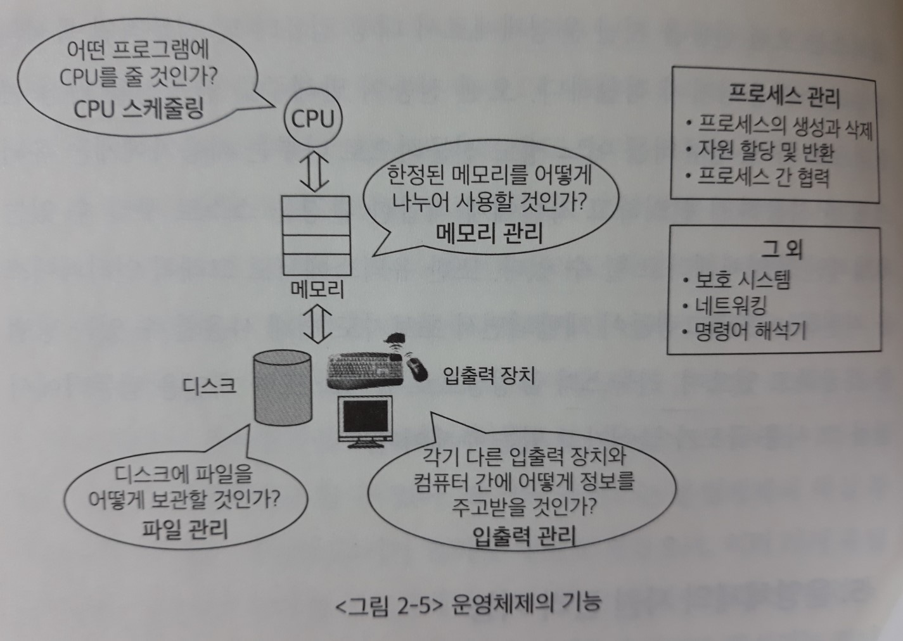
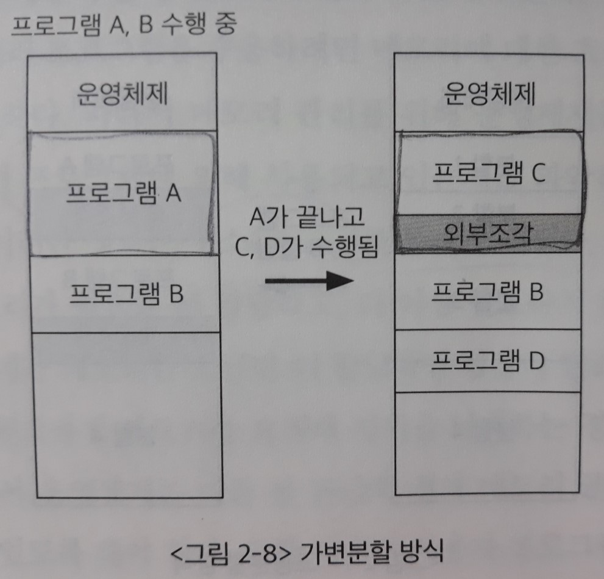

# 2장. 운영체제 개요

> 운영체제란 무엇인가?
>
> 운영체제의 정의와 핵심적 역할, 운영체제의 분류 및 종류에 대해 알아본다.

## 1. 운영체제의 정의

> 컴퓨터 하드웨어 바로 윗단에 설치되는 `소프트웨어`
>
> 각종 소프트웨어들은 **하드웨어와 운영체제가 한 몸으로 존재하는 컴퓨터 시스템** 위에서 수행된다.

소프트웨어가 컴퓨터 시스템에서 실행되기 위해서는 **메모리**에 그 프로그램이 올라가 있어야 한다. 운영체제 자체도 `소프트웨어`로서 전원이 켜짐과 동시에 메모리에 올라간다. 하지만 운영체제처럼 규모가 큰 프로그램이 모두 메모리에 올라가면 자원의 낭비가 심하므로, 운영체제 중 항상 필요한 부분만을 올려놓고 나머지 부분은 필요할 때 메모리로 올려서 사용한다.

- 커널(kernel) : 이 때 메모리에 상주하는 운영체제의 부분. 커널은 운영체제 코드 중에서도 핵심적인 부분임

- 유틸리티(utility) : 필요할 때 메모리로 올려서 사용하는 별도의 프로그램

  ​	ex) 윈도우 환경에서 파일 복사 프로그램

## 2. 운영체제의 기능

컴퓨터 하드웨어와 사용자 사이에 운영체제가 존재하므로, 운영체제의 역할은 `하드웨어를 위한 역할`과 `사용자를 위한 역할` 두 가지로 나누어 볼 수 있다.

1) 하드웨어를 위한 역할

​	: 컴퓨터 시스템 내의 자원(resource)을 효율적으로 관리

- **자원관리자(resource manager)**
  - `자원(resource)` : CPU, 메모리, 하드디스크 + 소프트웨어 자원
  - 성능[가장 큰 목표] + 형평성
- 사용자와 운영체제 자신을 보호하는 역할(보안)
  - 악의성 프로그램 차단

2) 사용자를 위한 역할

​	: 컴퓨터 시스템을 편리하게 사용할 수 있는 환경을 제공

- 여러 사용자 및 프로그램들에게 각각 독자적으로 컴퓨터를 사용하는 것 같은 '환상'을 제공함
- 사용자는 파일이 디스크에 어떻게 저장되는지 자세히 알지 못하지만, 인터페이스를 통해 손쉽게 파일을 저장하거나 파일의 내용을 꺼내볼 수 있다.

## 3. 운영체제의 분류

운영체제는 **동시 작업을 지원하는지** 여부에 따라 `단일작업(single tasking)` 운영체제와 `다중작업(multi tasking)` 운영체제로 나누어 볼 수 있다.

1) 단일작업 운영체제(single tasking)

​	: 한 번에 하나의 프로그램만 실행시킬 수 있는 운영체제

- 초창기 운영체제

- 도스(DOS : Disk Operating System)

  : MS-DOS 프롬프트 상에서는 한 명령의 수행을 끝내기 전에 다른 명령을 수행시킬 수 없음

2) 다중작업 운영체제(multi tasking)

​	: 동시에 2개 이상의 프로그램을 처리할 수 있는 운영체제

- 최근의 대부분 운영체제

- 윈도우, 유닉스

- 다중작업, 시분할, 다중 프로그래밍, 대화형 시스템 모두 **여러 프로그램이 하나의 컴퓨터에서 동시에 실행**된다.

  - 시분할 시스템(time sharing system)

    : `CPU`의 작업시간을 여러 프로그램들이 조금씩 나누어 쓰는 시스템

    (**CPU**의 시간을 분할하여 나누어 쓴다는 의미를 강조)

  - 다중 프로그래밍 시스템(multi-programming system)

    : CPU와 달리 `메모리`의 경우 여러 프로그램들이 조금씩 메모리 공간을 보유하며 동시에 메모리에 올라가 있을 수 있다. 이처럼 메모리 공간을 분할해 여러 프로그램들을 동시에 메모리에 올려놓고 처리하는 시스템

    (여러 프로그램이 **메모리**에 올라가 있음을 강조)
  
  - 대화형 시스템(interactive system)
  
    : 다중작업 운영체제에서 여러 프로그램을 같이 실행시킬 때, 사용자의 관점에서는 각 프로그램에 대한 결과를 바로 보여주기 때문에 그 서버를 자기 혼자 사용하는 것처럼 느끼게 해준다.

이 외에 `다중처리기 시스템(multi-processor system)`은 하나의 컴퓨터 안에 CPU가 여러 개 설치된 경우를 뜻한다.

 **=> 더욱 복잡한 메커니즘이 필요하므로 특별한 언급이 없는 이상 CPU가 하나만 탑재된 컴퓨터를 다룬다.**

**작업을 처리하는 방식**에 따라 분류할 수 있다.

1) 일괄처리(batch processing) 방식

​	: 요청된 작업을 일정량씩 모아서 한꺼번에 처리하는 방식. 모든 작업이 완전히 종료된 후에 결과를 얻을 수 있다. 따라서 **응답시간이 길다**는 단점이 있다.

- 초창기 컴퓨터에 사용되던 펀치 카드(punch card) 처리 시스템

2) 시분할 방식

​	: 컴퓨터의 처리 능력을 일정한 시간 단위로 분할해 사용하는 방식. 여러 사용자의 작업을 짧은 시간 단위씩 번갈아가며 처리하므로 **짧은 응답시간**을 갖게 된다. 

- 현대의 대부분의 범용 컴퓨터

 **=> 운영체제 과목에서는 대부분 시분할 시스템을 위한 운영체제를 다룬다.**

3) 실시간(real time) 운영체제

​	: 정해진 시간 안에 어떠한 일이 반드시 처리됨을 보장해야 하는 시스템에서 사용

- 원자로, 공장 제어 시스템, 미사일 제어 시스템
- Hard realtime system (경성 실시간 시스템)

  Soft realtime system (연성 실시간 시스템)

## 4. 운영체제의 예

1) MS 윈도우 계열

- MS-DOS와 윈도우3.1 등을 발전시켜 만든, `개인용 컴퓨터(PC)`를 위한 운영체제
  - 윈도우3.1까지는 그 자체로 독립적인 운영체제가 아니라 **MS-DOS 위에서 수행되는 프로그램**이었다. 따라서 컴퓨터 시스템을 완전히 제어할 수 없다는 점과 DOS를 함께 사용해야 한다는 문제점이 있었다.
  - 하나의 온전한 운영체제인 **윈도우 95**가 나오고, 그 이후 윈도우 98을 거쳐 XP, Vista, 윈도우 7, 윈도우 10에 이르게 되었다.
  - **윈도우 NT** : 안정성이 높고 웹서버 등 `다중 사용자용 운영체제`로 사용됨. 웹서버, 전자우편, 파일서버, DB 등으로 사용
  
- 그래픽 인터페이스와 마우스의 기능을 지원
  
  - `아이콘 방식` 지원
  
- 다중 작업(multi tasking) 지원

- `플러그 앤 플레이(plug and play)` 지원

  : 시스템에 새로운 하드웨어를 장착하면 **운영체제가 자동으로 하드웨어를 감지하여 그에 맞게 설정**된다.

- 자체적으로 네트워크 프로그램을 지원

  : 윈도우 사용자들끼리 파일을 공유하거나 프린터 등의 하드웨어를 공유할 수 있는 기능을 갖고 있다.

2) 유닉스 계열

- 1969년 벨 연구소에서 개발
  - **프로그램 개발 환경을 위해 설계된 운영체제**
- 이식성(portability)이 좋고, 커널의 크기가 작으며, 소스 코드가 공개되었다.
  - 이식성 : 소프트웨어를 다른 기종의 기계로 옮기는 것이 얼마나 용이한가를 나타내는 지표
  - 당시의 운영체제는 `어셈블리 언어`로 작성되는 것이 일반적이었으나 유닉스는 대부분 `C언어`로 작성되었다. C언어는 기계어와 독립적인 언어이기 때문에 기계어집합이 다른 컴퓨터에서 다시 컴파일하면 된다. 그리고 고급 언어로 작성되었기 때문에 소스 코드를 이해하기 쉽고, 따라서 다른 기종에 이식하는 것이 훨씬 쉬웠다.
- 하드웨어 기술이나 소프트웨어 기술이 발전하더라도 **`확장성`을 지원할 수 있게 설계되어** 현재까지 널리 사용되고 있다.
- **안정성**이 가장 큰 장점
- 다양한 버전 - System V, FreeBSD, SunOS, Solaris
- `리눅스(Linux)` : 개인용 컴퓨터에서 유닉스를 사용할 수 있게 만든 버전

## 5. 운영체제의 자원 관리 기능

운영체제의 가장 핵심적인 기능은 자원을 효율적으로 관리하는 것으로, 여기서 자원은 하드웨어 자원과 소프트웨어 자원으로 나뉜다.

> 하드웨어 자원의 속도: CPU > 메모리 >>> 디스크, I/O 장치
>
> 디스크는 CPU에 비해 약 100만 배 느리다.

### 1) 하드웨어 자원

​	: CPU, 메모리 + 주변장치 + `입출력 장치`

​	=> CPU와 메모리는 전원이 꺼지면 처리 중이던 정보가 모두 지워지기 때문에, 전원이 나가도 기억해야 하는 부분을 `입출력 장치` 중 한 종류인 **보조기억장치에 <u>파일</u> 형태로 저장한다**.

**[CPU 스케줄링(CPU scheduling)]**

> CPU 스케줄링의 **목표**는 CPU를 가장 효율적으로 사용하면서도, 특정 프로세스가 불이익을 당하지 않도록 하는 것이다.

- 선입선출(FCFS, First Come First Served) 기법
  - 도착한 프로세스들 중 먼저 온 것을 먼저 처리해주는 방식
  - CPU의 효율적인 사용 측면에서는 좋다. 하지만 장시간 CPU를 사용하는 프로세스가 먼저 도착하면, 다른 프로세스들은 그 작업이 완료될 때까지 오랜 시간 기다려야 한다.
    - 단점을 보완하기 위해 `라운드 로빈` 기법이 고안됨
- 라운드 로빈(Round Robin) 기법
  - CPU를 할당받는 시간을 **고정된 시간으로 제한**하는 방식. 정해진 시간이 지나면 `CPU 대기열의 제일 뒤`에 가서 줄을 서야 한다.
  - 일반적으로 1회 할당시간은 밀리초 단위를 사용
- 우선순위(priority) 스케줄링
  - 대기 중인 프로세스에 우선순위를 부여하고 우선순위가 `높은` 프로세스에 CPU를 먼저 할당
  - 지나치게 오래 기다리는 프로세스가 발생하지 않도록, **기다린 시간이 늘어날수록 우선순위를 높여준다**.

**[메모리 관리]**

물리적 메모리(`가상메모리가 아니다!`)를 관리하는 방식에는 고정분할 방식, 가변분할 방식, 가상메모리 방식 등이 있다. 

메모리 관리를 위해 운영체제는 메모리의 어느 부분이 어떤 프로그램에 의해 사용되고 있는지를 파악하여 이를 유지하게 된다.

이러한 정보는 **주소(address)**를 통해 관리된다.

> 메모리 관리의 **목표**는 메모리 공간과 할당 속도의 효율성을 높이면서, 서로 다른 프로세스의 영역을 침범하지 않도록 보안을 유지하는 것이다.
>
> 1. 너무 많은 프로그램을 메모리에 동시에 올리기 보다는, 적어도 CPU에서 원활하게 실행하기 위해 필요한 메모리 용량만큼은 할당받을 정도로 지원해주는 것이 좋다. (`working set model`)
> 2. 메모리 크기가 한정되어 있으므로, 디스크에서 새로 할당하여 꽉 찼을 때 어떤 것을 쫓아내야 하는가 정해야 한다. (어떤 데이터가 자주 사용될지 미래 예측 => 과거 동향을 보고 결정)

- 고정분할(fixed partition) 방식
  
  - 물리적 메모리를 몇 개의 분할로 미리 나누어 관리한다. **각 분할에는 하나의 프로그램이 적재될 수 있다.**
  - 비효율적 
    - 메모리에 동시 적재되는 최대 프로그램의 개수가 분할의 개수로 한정됨
    - `분할 크기보다 큰 프로그램은 적재 불가능`
    - 분할 크기보다 작은 프로그램이 적재되는 경우 남는 영역**-내부조각(internal fragmentation)-** 발생
    - **외부조각**도 발생한다.
  
- 가변분할(variable partition) 방식

  - 매 시점 프로그램의 크기에 맞게 메모리를 분할해서 사용
  - 비효율적
    - `여전히 물리적 메모리의 크기보다 더 큰 프로그램의 실행은 불가능하다.`
    
    - **내부조각**은 발생하지 않는다.
    
    - **외부조각(external fragmentation)** - 크기가 큰 프로그램이 메모리를 할당 받고 실행되는 도중에 바로 다음 영역에 또 다른 프로그램이 메모리를 할당 받아 실행되는 상황이다. 이 때 크기가 큰 프로그램의 `작업이 완료된 후`, 더 작은 크기의 프로그램이 그 공간을 할당 받으면 **크기가 작아 프로그램을 올리지 못하는 남는 메모리 영역**이 생긴다. 
    
      

- 가상메모리(virtual memory) 방식

  - 현대의 범용 컴퓨터 환경에서 가장 널리 사용되는 기법

  - 모든 프로그램은 물리적 메모리와는 독립적으로 **0번지부터 시작하는 자신만의 가상메모리 주소**를 갖는다. 운영체제는 이 가상메모리의 주소를 물리적 메모리의 주소로 **매핑(mapping)**하여 물리적 메모리에 올리게 된다.

  - `물리적 메모리보다 더 큰 프로그램이 실행되는 것을 지원한다.`

    - **실행될 수 있는 프로그램의 크기는 가상메모리의 크기에 의해 결정된다.**

    - 프로그램의 전체 부분이 항상 동시에 사용되는 것은 아니기 때문에 가능함

      => 현재 사용되고 있는 부분만 메모리에 올리고, 나머지는 하드디스크와 같은 보조기억장치에 저장해두었다가 필요할 때 적재하는 방식

      => 스왑 영역(swap area) : 이 때 사용되는 보조기억장치의 영역

  *가상메모리 기법은 뒤에서 다룬다.

**[파일 관리(디스크 스케줄링)]**

>1. 파일을 연속적으로 저장하는 것이 좋은지, 조각조각 관리하는 것이 좋은지
>
>2. 디스크의 특성에 맞게 파일을 관리

- CPU 스케줄링 vs 디스크 스케줄링

  : CPU는 너무 빠르기 때문에 그런 CPU를 어떻게 관리해야 하는가를 중점으로 다루고,
  디스크는 헤드가 움직이면서 처리해야 하므로, 헤드의 움직임을 최소화 해서 빠르게 처리하는 것을 중점으로 다룬다. (엘리베이터 버튼 누르기와 비슷함)

**[주변장치 및 입출력 장치]**

> 컴퓨터 내부인 CPU, 메모리와 속도차이가 매우 크기 때문에 어떻게 통신할 것인지가 주요 이슈다.
>
> => **인터럽트**

주변장치 및 입출력 장치는 CPU나 메모리와 달리 `인터럽트(interrupt)`라는 메커니즘을 통해 관리가 이루어진다. 주변장치들은 CPU의 서비스가 필요한 경우에 신호를 발생시켜 서비스를 요청하는데, 이 때 발생시키는 신호를 인터럽트라고 한다.

- CPU는 평소에 `CPU 스케줄링`에 따라 작업을 수행하다가, 인터럽트가 발생하면 먼저 **수행 중이던 작업의 상태를 저장**해둔다.
- **인터럽트 처리루틴** - 인터럽트가 발생했을 때 해주어야 할 작업을 정의한 프로그램 코드. **`커널` 내에 존재한다.**

`주변장치`들은 각 장치마다 그 장치에서 일어나는 업무를 관리하기 위한 작은 CPU를 가지고 있다. 이것을 **컨트롤러(controller)**라고 부른다. 컨트롤러는 해당 장치에 대한 업무를 처리하고, 메인 CPU에 인터럽트를 발생시켜 보고한다.

### 2) 소프트웨어 자원

​	: 프로세스, 파일, 메시지 등을 관리