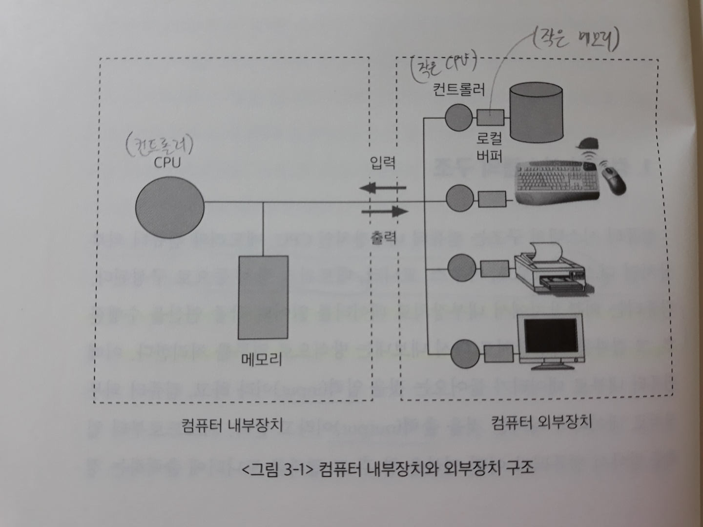
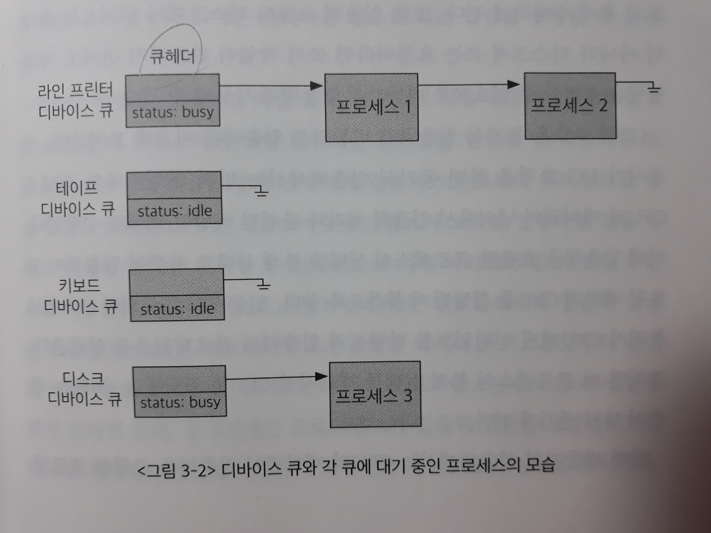
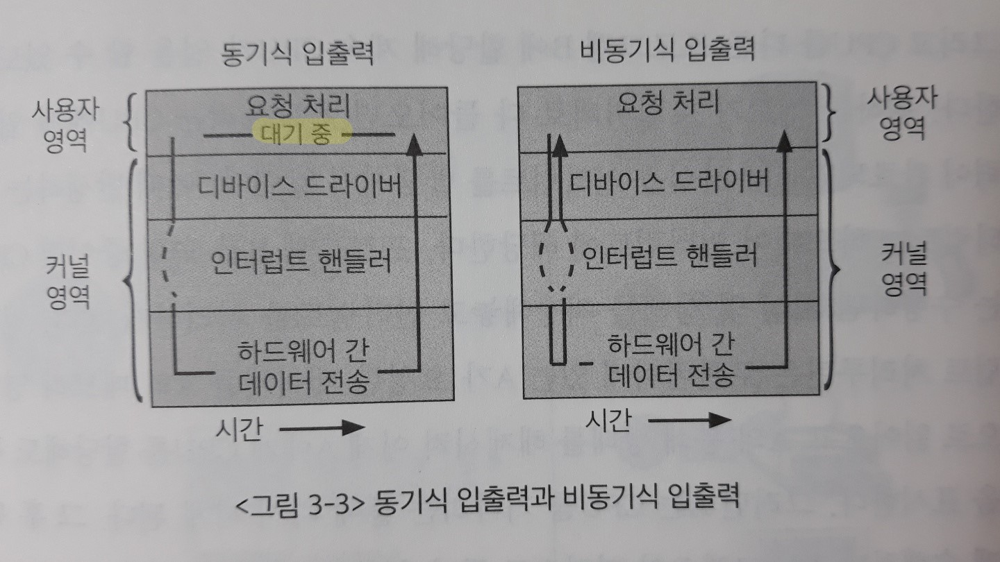
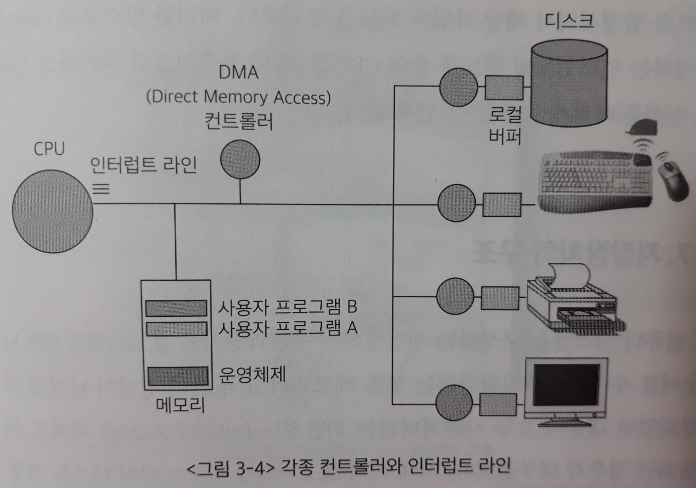
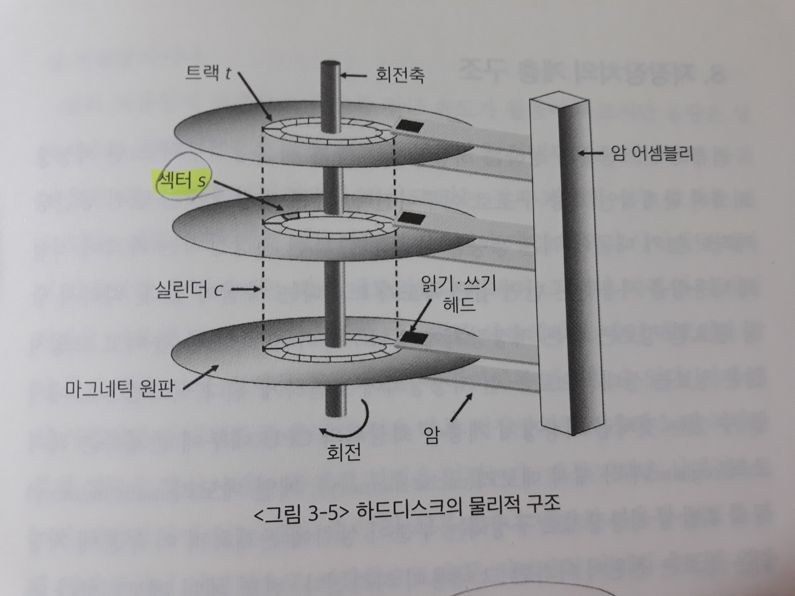
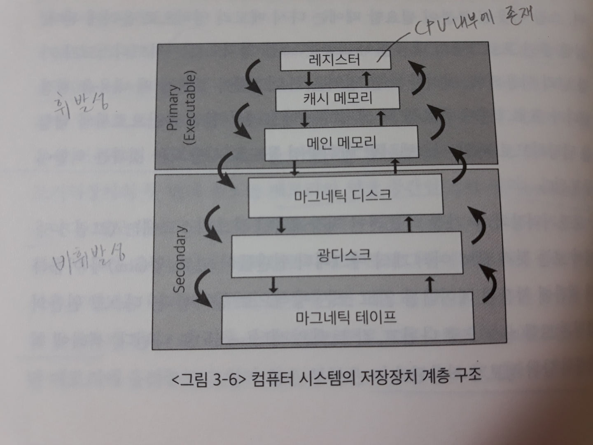
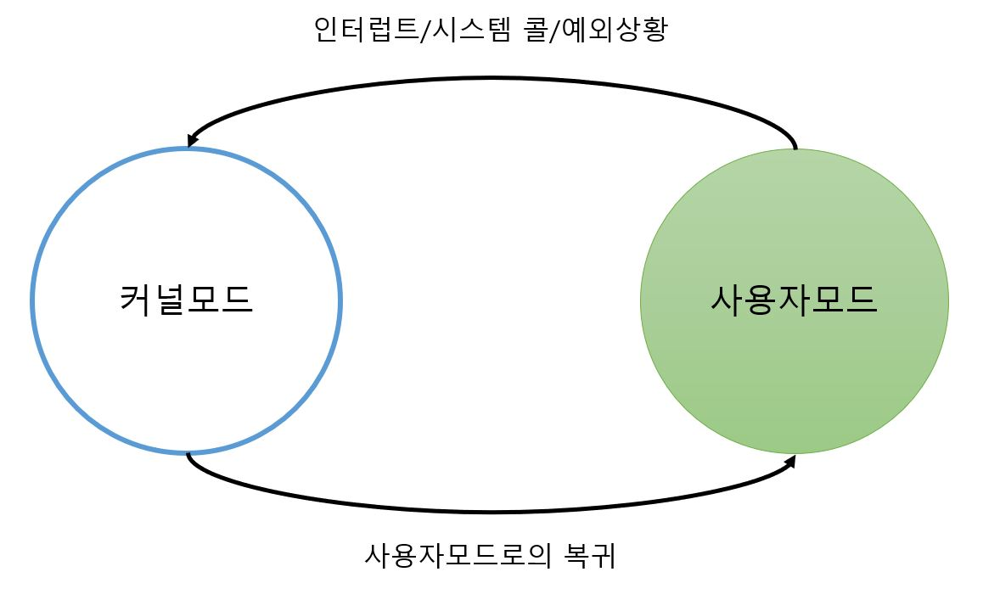
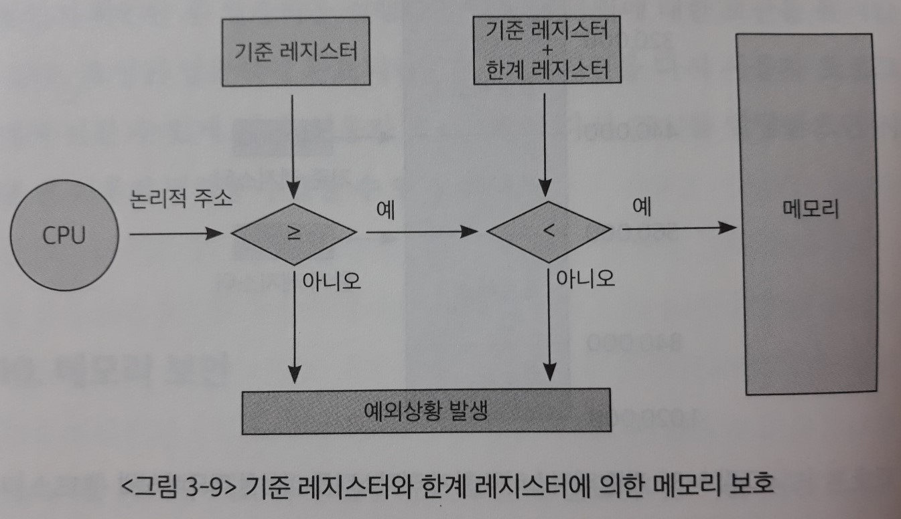

# 3장. 컴퓨터 시스템의 동작 원리

> 운영체제를 이해하기 전에 우선적으로 알아두어야 할 컴퓨터 하드웨어의 구성 및 동작 원리를 살펴본다.
>
> 컴퓨터 내부장치인 CPU와 메모리에 대해 살펴보고, 컴퓨터 외부의 주변장치에 대해서도 간단히 살펴본다.

## 1. 컴퓨터 시스템의 동작 원리

> 컴퓨터 시스템 구조 = 컴퓨터 내부장치(CPU, 메모리) + 컴퓨터 외부장치(디스크, 키보드, 마우스, 네트워크 장치 등)

메모리는 CPU의 작업공간이며, CPU는 클럭사이클 마다 메모리에서 기계어를 읽어서 실행한다.

(CPU 레지스터 중 PC 레지스터가 가리키는 주소를 참조해서 실행하는 일만 반복한다 + 인터럽트, 모드 비트 확인)

컴퓨터는 외부장치에서 내부장치로 데이터를 읽어와 각종 연산을 수행한 후, 그 결과를 외부장치로 다시 내보내는 방식으로 업무를 처리한다. **=> 입력/출력**

메모리 및 입출력장치 등의 하드웨어 장치에는 [컨트롤러](Device%20Controller.md)라는 것이 붙어 있다. 컨트롤러는 각 하드웨어 장치마다 존재하면서 이들을 제어하는 작은 CPU다.

- 디스크 내부에서 헤드를 어떻게 움직일지, 어떤 데이터를 읽을지 등 디스크 내부를 통제하는 것은 CPU가 아니라 디스크 컨트롤러의 역할이다. (컨트롤러 안의 펌웨어 코드의 지시를 받아서 함)

로컬버퍼는 컨트롤러의 작업공간이다.




## 2. CPU와 I/O 연산

입출력 장치들의 연산(**I/O 연산**)은 `입출력 컨트롤러`가 담당하고, 컴퓨터 내에서 수행되는 연산은 `메인 CPU`가 담당한다. 이때 입출력 장치와 메인 CPU는 동시 수행이 가능하다.

ex) B라는 프로그램이 현재 CPU를 할당받아 프로그램 코드를 수행하고, A라는 프로그램은 하드디스크에서 어떠한 정보를 읽어오는 작업을 수행해야 한다. 이러한 경우 두 가지 일이 다른 곳에서 발생하므로 동시에 수행되는 것이 가능함.

- 로컬버퍼(local buffer)

  : 장치 컨트롤러는 장치로부터 들어오고 나가는 데이터를 임시로 저장하기 위한 **작은 메모리**를 가지고 있다. 이를 로컬버퍼라고 부른다.

  - 디스크나 키보드 등에서 데이터를 읽어오는 경우, 우선 로컬버퍼에 데이터가 임시로 저장된 후 메모리에 전달된다. **이때 장치에서 로컬버퍼로 읽어오는 일은 컨트롤러가 담당한다.**

  - 이때 로컬버퍼로 읽어오는 작업이 다 끝났는지를 메인 CPU가 지속적으로 체크하는 것이 아니라 장치에 있는 컨트롤러가 `인터럽트`를 발생시켜 CPU에 보고하게 된다.
  
- 인터럽트(interrupt)

  : 컨트롤러들이 CPU의 서비스가 필요할 때 이를 통보하는 방법.

  키보드 입력 혹은 요청된 디스크 입출력 작업의 완료 등 CPU에 알려줘야 하는 이벤트가 일어난 경우 컨트롤러가 발생시키는 신호다.

  - CPU는 메모리에서 명령(instruction)을 하나씩 읽어와서 수행하는데, 수행할 때마다 인터럽트가 발생했는지 확인한다.

    (CPU 옆에는 `인터럽트 라인(interrupt line)`이 있어서 그 곳을 통해 신호가 들어온다)

    - 인터럽트가 발생했으면 다음 명령을 수행하기 전에 인터럽트 처리를 함
    - 그렇지 않으면 다음 명령을 계속 수행


## 3. 인터럽트의 일반적 기능

> 현대의 운영체제는 인터럽트에 의해 구동된다.
>
> 인터럽트가 들어올 때만 운영체제가 개입하고, 평소에는 사용자 프로그램이 CPU를 사용하게 된다.

운영체제 **커널**에는 인터럽트가 들어왔을 때 해야할 일이 미리 다 프로그래밍되어 그 코드(`인터럽트 처리루틴`)가 보관되어 있다.

1. `프로그램이 요청한 데이터`를 디스크 **컨트롤러가** 로컬버퍼에서 읽어온 후, **인터럽트를 발생시키면** CPU는 인터럽트가 들어옴을 인지하고 인터럽트 관련 업무(인터럽트 처리루틴)를 수행한다.
2. 이 때 수행하는 일은 **디스크의 로컬버퍼에 있는 내용**을 사용자 프로그램의 **메모리**로 전달하고, 해당 프로그램이 CPU를 할당받을 경우 다음 명령을 수행할 수 있음을 표시해두는 일이다. (`봉쇄(blocked)` -> `준비(ready)`)

**[인터럽트 처리루틴]**

다양한 인터럽트에 대해 각각 처리해야 할 업무들을 정의한 것

``` java
운영체제의 기능
    1. 하드웨어 및 소프트웨어 자원 관리
    2. 사용자를 위한 편리한 환경(인터페이스) 제공
    3. 사용자 프로그램에 필요한 서비스 제공 => 인터럽트 처리루틴
```


**[인터럽트]**

CPU의 서비스가 필요한 경우, CPU 옆에 있는 **인터럽트 라인**에 신호를 보내서 인터럽트가 발생했음을 알려주는 방식은 둘 다 동일하다.

1. 하드웨어 인터럽트

   : `컨트롤러` 등 하드웨어 장치가 CPU의 인터럽트 라인을 set

2. 소프트웨어 인터럽트

   : 소프트웨어가 CPU의 인터럽트 라인을 set
   
   - 통상적으로 인터럽트라고 하면 하드웨어 인터럽트를 의미하고, 소프트웨어 인터럽트는 **트랩(trap)**이라는 용어로 주로 불린다.
   
   - 예로는 예외상황(exception)과 시스템 콜(system call)이 있다.
   
     - 예외상황
   
       : 사용자 프로그램이 비정상적인 작업을 시도하거나(0으로 나누기), 권한이 없는 작업을 시도할 때(자신의 메모리 영역 바깥에 접근하려는 시도)
   
     - 시스템 콜
   
       : 사용자 프로그램이 운영체제 내부에 정의된 코드를 실행하고 싶을 때 운영체제에 서비스를 요청하는 방법(키보드 입력이나 화면 출력 등의 입출력 작업)
       
       > 시스템 콜과 일반 함수 호출의 차이점은, 호출하고 있는 프로그램의 메모리 내부에서 주소를 이동하느냐(모드비트=1), 운영체제의 주소를 참조하느냐(모드비트=0)의 차이 
   
   - **프로그램 코드가 직접 인터럽트 라인을 set하는 명령을 실행하여 인터럽트를 발생시킨다.** 그 후에는 CPU의 제어권이 사용자 프로세스로부터 운영체제로 넘어가게 된다.


운영체제는 인터럽트 코드를 쉽게 찾아가기 위해 **인터럽트 벡터(interrupt vector)**를 가지고 있다.

인터럽트 벡터란 인터럽트 종류마다 번호를 정해서, 번호에 따라 처리해야 할 코드가 위치한 부분을 가리키고 있는 자료구조를 말한다. 실제 처리해야 할 코드는 `인터럽트 처리루틴(interrupt service routine)` 또는 `인터럽트 핸들러(interrupt handler)`라고 불리는 다른 곳에 정의된다.

- ex) 하드 디스크가 인터럽트를 걸어서 인터럽트 라인의 3번 라인이 set 되면, 인터럽트 벡터에 3번에 해당하는 주소를 참조한다. 그 주소에 해당하는 함수로 가면 CPU가 해당 인터럽트를 처리하기 위한 커널 함수가 정의되어 있다.


## 4. 인터럽트 핸들링

> 인터럽트 핸들링(interrupt handling)이란 인터럽트가 발생한 경우에 처리해야 할 일의 절차를 의미한다.

1. 프로그램 A가 실행되고 있을 때 인터럽트가 발생하면 A의 **현재 상태를 PCB에 먼저 저장**한다.

   (현재 CPU에서 실행 중인 명령어의 메모리 주소 + 레지스터값 + 부가 정보)

   *CPU에서 명령이 실행될 때에는 CPU 내부에 있는 임시 기억장치인 레지스터(register)에 데이터를 읽거나 쓰면서 작업을 한다.

   - `프로세스 제어블록(Process Control Block: PCB)`

     : 운영체제가 현재 실행되는 프로그램들을 관리하기 위해 두는 자료구조

     **커널에 존재한다.**
     
     PCB는 각각의 프로그램마다 하나씩 존재하며 해당 프로그램의 어느 부분이 실행 중이었는지를 저장하고 있다.

2. **CPU의 제어권**이 인터럽트 처리 루틴으로 넘어간다.

3. 인터럽트 처리가 끝나면 저장된 상태를 **PCB**로부터 CPU상에 복원한다. 그러면 인터럽트 당하기 직전의 위치부터 실행이 이어지게 된다.

오늘날의 컴퓨터에서 운영체제는 인터럽트가 발생할 때에만 실행된다. 시스템이 **부팅** 후 정상 상태에 머무르게 되면 CPU가 항상 사용자 프로그램에 의해 사용되며, 인터럽트가 발생했을 때에만 운영체제가 잠깐 제어권을 획득할 수 있기 때문이다.


## 5. 입출력 구조

> 입출력(I/O)이란 컴퓨터 시스템이 컴퓨터 외부의 입출력 장치들과 **데이터를 주고받는 것**을 말한다.

1. 동기식 입출력 (synchronous I/O)

   : 어떤 프로그램이 입출력 요청을 했을 때 **입출력이 완료된 후**에야 그 프로그램이 후속 작업을 수행할 수 있는 방식.

   입출력이 완료되어 인터럽트를 set하면 CPU의 제어권이 다시 그 프로그램에게 넘어가서 다음 명령을 수행할 수 있게 된다.

   1) CPU는 입출력 연산이 끝날 때까지 인터럽트를 기다리며 **자원을 낭비**하게 된다. **따라서 일반적으로 프로그램이 입출력을 수행하는 중인 경우 CPU를 다른 프로그램에게 이양해 CPU가 계속 쉬지 않고 일할 수 있도록 관리한다.**

   - 이를 관리하기 위해 운영체제는 프로그램을 몇 가지 `상태`로 나누고 입출력 중인 프로그램의 경우 **봉쇄 상태(blocked state)**로 전환시킨다.

   - 봉쇄 상태의 프로그램에게는 CPU를 할당하지 않는다.

   2) 입출력이 수행 중일 때 다른 프로그램에게 CPU를 양도하게 되므로 **다수의 입출력 연산이 동시에** 요청되거나 처리될 수 있다.

   ​	(새로 제어권을 갖게 된 프로그램 역시 입출력 요청을 할 수 있다)

   - 이 때 매 시점 2개 이상의 입출력 연산을 수행할 수 있다면, `컨트롤러`는 프로그램A와 프로그램B의 순서를 바꾸어 수행할 가능성이 있다. 즉 A가 입출력을 요청한 다음 B가 요청했다고 할 때, 컨트롤러는 작업을 바꿔서 B의 요청을 먼저 처리할 수 있다. (사용자가 프로그램B의 입력을 먼저 끝낼 수 있음)

   - 따라서 동기식 입출력에서는 **입출력 요청의 동기화를 위해 장치별로 `큐(queue)`를 두어** 요청한 순서대로 처리할 수 있도록 한다.

     - 큐에 있는 순서대로 처리하는 대신, 요청들을 모으고 처리 순서를 바꾸어 입출력의 효율성을 높일 수도 있는데, 이러한 경우 동기화를 보장하기 위한 별도의 방안이 마련되어야 한다.

     

   3) 이때 CPU의 수행 속도에 비해 `컨트롤러`의 수행 속도나 `장치 자체의 작업 수행 능력`은 매우 떨어진다. 따라서 CPU가 입출력과 관련 없는 프로그램을 수행하도록 하고, 요청된 입출력 연산이 완료되면 CPU에게 알려준다.

   - 연산 완료의 통보는 **인터럽트**를 통해 수행되며, 운영체제 **커널**은 인터럽트 처리루틴으로 가서 입출력 연산을 끝낸 프로그램이 CPU를 할당받을 수 있도록 **봉쇄 상태를 해제**시킨다.

   ``` java
   => 입출력의 요청과 완료는 인터럽트 set을 통해 이루어진다.
   	(요청 - 사용자 프로그램이 시스템 콜을 통해 set명령어 직접 실행 =소프트웨어 인터럽트
        완료 - 컨트롤러가 set =하드웨어 인터럽트)
   ```

   

2. 비동기식 입출력 (asynchronous I/O)

   : 입출력 연산을 요청한 후에 연산이 끝나기를 기다리는 것이 아니라, CPU의 제어권을 입출력 연산을 호출한 그 프로그램에게 곧바로 다시 부여하는 방식

   - 프로그램이 데이터를 디스크에서 읽어오라는 요청을 하고, 그 데이터와 관련 없이 수행할 수 있는 일이 있을 수 있다. **비동기식 입출력에서는 그러한 작업을 먼저 수행하고, 읽어오는 데이터가 반드시 있어야 수행할 수 있는 일들은 입출력이 완료된 후에 수행하게 된다. => `무조건 동기화하지 않는 것이 아님!`**
   - 디스크에 쓰는 요청이라면 쓰기 작업이 완료되기 전에도 다음 명령을 수행할 수 있다.

   ``` java
   => 동기식과 마찬가지로 입출력의 요청과 완료는 인터럽트 set을 통해 이루어진다.
   ```



*디바이스 드라이버는 소프트웨어로, OS 코드 중 각 장치별 처리루틴이다. CPU가 장치를 수행하기 위해 필요한 코드를 담고있다.*

일반적으로 운영체제에게 입출력 요청을 할 경우 해당 프로그램의 입출력이 완료될 때까지 그 프로그램을 봉쇄시키는 **동기식 입출력**을 사용한다.

- [동기식 입출력의 과정](동기식%20입출력의%20과정(Synchronous%20IO).md)


## 6. DMA

원칙적으로 메모리는 CPU에 의해서만 접근할 수 있는 장치이다. 따라서 CPU 외의 장치가 `메모리의 데이터`에 접근하기 위해서는 **CPU에게 인터럽트를 발생시켜 CPU가 이를 대행**하는 식으로만 가능하다.

한편 모든 메모리 접근 연산이 CPU에 의해서만 이루어질 경우 입출력 장치가 메모리 접근을 원할 때마다 **인터럽트에 의해 CPU의 업무가 방해를 받게 되어** CPU 사용의 효율이 떨어지는 문제점이 발생하게 된다.

> 이러한 비효율성을 극복하기 위해 CPU 이외에 메모리 접근이 가능한 장치를 하나 더 두는 경우가 많은데, 이와 같은 장치를 **DMA(Direct Memory Access)**라고 부른다.



DMA는 일종의 `컨트롤러`로서, **로컬버퍼에서 메모리로 읽어오는 작업을 CPU 대신 대행**한다.

- CPU는 원래 하던 작업을 멈추고 인터럽트를 처리할 필요가 없어진다.

- DMA는 바이트(byte) 단위가 아니라 **블록(block)**이라는 큰 단위로 메모리를 읽어온 후에 CPU에게 인터럽트를 발생시켜서 해당 작업의 완료를 알려준다.

  => CPU에 발생하는 인터럽트의 빈도를 줄여준다.


## 7. 저장장치의 구조

> 컴퓨터 시스템을 구성하는 저장장치는 **주기억장치(메모리)**와 **보조기억장치**로 나뉜다. 

1) 주기억장치(메모리)

  : 전원이 나가면 저장되었던 내용이 모두 사라져버리는 `휘발성(volatile)의 RAM`을 매체로 사용하는 경우가 대부분이다.

2) 보조기억장치

 : 전원이 나가도 저장된 내용을 기억할 수 있는 `비휘발성(nonvolatile)`의 마그네틱 디스크를 주로 사용한다. (플래시 메모리, CD, 마그네틱 테이프 등이 사용되기도 한다)

- 용도

  1. 파일 시스템(file system)용

     - 전원이 나가도 유지해야 할 정보가 있으면 그것을 **파일 형태**로 보조기억장치에 저장한다.

  2. 메모리의 연장 공간인 스왑 영역(swap area)용

     - **스왑 아웃(swap out)**

       : 운영체제는 프로그램 수행에 당장 필요한 부분만 메모리에 올려놓고 그렇지 않은 부분은 디스크의 스왑 영역에 내려놓는다. 이처럼 디스크에 내려놓는 일을 스왑 아웃(swap out)시킨다고 말하며, 스왑 아웃된 부분이 필요할 때에는 다시 메모리 영역으로 올리게 된다.

     - 프로그램이 종료되면 내용이 삭제되므로 파일 시스템처럼 비휘발성 용도로 사용되는 것과는 다르다.

- 하드디스크

  : 보조기억장치 중 가장 대표적인 저장매체

  

  여러 개의 마그네틱 원판들이 있고, 암(arm)이 이동하며 원판에 저장된 데이터를 읽고 쓰는 방식으로 동작한다. 디스크 원판의 표면은 트랙(track)으로 나뉘고, 각 트랙은 섹터(sector)로 나뉜다.

  섹터에는 최소한의 단위 정보가 저장된다.


## 8. 저장장치의 계층 구조

> 빠른 저장장치는 단위 공간당 가격이 높기 때문에 적은 용량을 사용한다.
>
> 느린 저장장치는 가격이 저렴해 대용량을 사용하는 반면 접근 속도가 느리다.
>
> ​	**=> 따라서 당장 필요한 정보는 빠른 저장장치에 넣어두어 수행 속도를 높인다.**

- Primary (Executable)

  : CPU에서 직접 접근해서 실행할 수 있는 저장장치

  - **CPU에서 직접 접근하려면 byte 단위로 접근 가능한 매체여야 한다.**
  - `DRAM 메모리(메인 메모리)` 같은 경우는 `byte 단위`로 주소를 매기기 때문에 CPU가 바로 읽어서 실행할 수 있다.

- Secondary

  : CPU에서 직접 접근해서 실행할 수 없는 저장장치

  - `하드디스크`는 byte 단위가 아닌 `섹터 단위`로 접근할 수 있다.



- 캐싱 기법

  : 상대적으로 용량이 적은 빠른 저장장치를 이용해 느린 저장장치의 성능을 향상시키는 총체적 기법.

  상대적으로 느린 저장장치에 있는 내용 중 `당장 사용되거나 빈번히 사용될 정보`를 **빠른 저장장치에 선별적으로 저장**함으로써 두 저장장치 사이의 속도를 완충시킨다. (재사용)

  - 캐싱 기법이 적은 용량으로도 효과를 거둘 수 있는 것은 데이터나 프로그램을 구성하는 모든 부분이 균일하게 사용되는 것이 아니라 일부분만이 집중적으로 사용되기 때문이다.


## 9. 하드웨어의 보안

> 현대의 대부분의 운영체제는 **다중 프로그래밍(multi-programming)** 환경에서 동작한다. 그러므로 각 프로그램이 다른 프로그램의 실행을 방해하거나 프로그램 간에 충돌을 일으키는 문제를 막기 위해 `하드웨어 또는 시스템(=하드웨어+OS)`에 대한 각종 보안 기법이 필요하다.
>
> ​	*하드웨어 보안 위협의 예시 => 어떤 프로그램이 이상한 명령을 수행시켜 다른 프로그램의 메모리 영역이나 파일 영역을 침범하는 경우

하드웨어적인 보안을 유지하기 위해서 운영체제는 기본적으로 **커널모드(kernel mode, system mode)**와 **사용자모드(user mode)**의 두 가지 모드를 지원한다.

- 커널모드

  : 운영체제가 CPU의 제어권을 가지고 운영체제 코드를 실행하는 모드. **모든 종류의 명령을 다 실행할 수 있다.**

- 사용자모드

  : 일반 사용자 프로그램이 실행되며 제한적인 명령만을 수행할 수 있다.

=> 그러나 중요한 연산을 운영체제만이 수행할 수 있도록 정의하더라도, 사용자 프로그램이 `프로그램 내에서` 그런 종류의 연산을 수행해버리면 제어가 아무런 소용이 없게 된다. 사용자 프로그램이 CPU를 가지고 있는 동안에는 운영체제가 자신의 코드를 실행하지 못하므로 사용자 프로그램을 감시할 방법이 없기 때문이다.

그러므로 이러한 상황을 방지하기 위해서는 **하드웨어적인 지원**이 필요하다.

- 컴퓨터 시스템은 **CPU 내부에 모드비트(mode bit)**를 두어 사용자 프로그램을 감시한다.

  - 모드비트= 0이면 ` 커널 모드`

    모드비트= 1이면 `사용자 모드`

- **CPU는 `보안과 관련된 명령`을 수행하기 전에는 항상 모드비트를 조사해 그 값이 0으로 세팅된 경우에만 그 명령을 수행한다.**

  - 그리고 운영체제가 CPU를 점유해 자신의 코드를 수행하다가 사용자 프로그램에게 CPU의 제어권을 넘길 때 모드비트를 1로 세팅해 넘기게 된다.

- 사용자 프로그램이 수행되다가 `하드웨어 접근` 등 보안이 필요한 중요한 명령을 수행해야 할 경우에는 **시스템 콜**을 통해 운영체제가 대신해줄 것을 요청한다. 그러면 CPU의 제어권은 다시 운영체제로 넘어가게 된다.

  - **인터럽트**가 발생할 때 모드비트는 자동으로 0이 세팅되므로 운영체제는 서비스에 필요한 모든 종류의 명령을 수행할 수 있게 된다.
  - 요청된 작업이 모두 끝난 후에는 모드비트를 다시 1로 만들어 사용자 프로그램에 CPU를 넘겨준다.

`특권명령`: 시스템의 보안과 관련된 명령들. 모드비트= 0일 때에만 수행할 수 있다. (**커널모드**에서 운영체제에 의해서만 수행가능)

> **결론:** 하드웨어(시스템)의 보안을 지키기 위해서는 소프트웨어적인 지원 뿐만으로는 부족하며, 하드웨어적인 지원이 추가로 필요하다.



**[각종 하드웨어 장치에서 보안이 유지되는 방식 - 디스크]**

사용자 프로그램이 디스크에 저장된 파일에 자유롭게 접근할 수 있다면 보안상 문제가 발생할 수 있다.

자신의 소유가 아닌 다른 사람의 파일에 접근할 수 있기 때문이다.

그래서 **모든 입출력 명령은 특권명령**으로 규정해서 사용자 프로그램이 직접 입출력을 하는 것을 차단한다.

사용자 프로그램이 입출력을 하고 싶으면 **시스템 콜**로 운영체제에 요청해야 한다.

​	=> 운영체제는 입출력 요청이 올바른 요청인지 확인한 후 입출력을 실행하기 때문에 `파일에 대한 보안`을 유지할 수 있다.


## 10. 메모리 보안

> **다중 프로그래밍(multi-programming)** 환경에서 여러 프로그램이 메모리에 동시에 올라가서 실행되기 때문에 하나의 사용자 프로그램이 다른 사용자 프로그램이나 운영체제가 위치한 메모리 영역을 침범할 수 있다.

사용자 프로그램이 C언어의 포인터 등 **메모리 주소 참조 연산**을 잘못 사용해 다른 사용자 프로그램의 메모리 영역이나 운영체제 커널이 위치한 영역을 참조하려는 시도를 할 수 있다.

=> 이러한 문제를 해결하기 위해 **2개의 레지스터**를 사용해서 **프로그램이 접근하려는 메모리 부분이 합법적인지 체크**함으로써 메모리를 보호할 수 있다.

- 기준 레지스터(base register)

  : 어떤 프로그램이 수행되는 동안 그 프로그램이 합법적으로 접근할 수 있는 메모리상의 `가장 작은 주소`를 보관하는 레지스터

  (어떤 프로그램이 **실제 메모리**에 올라가 있는 부분의 시작 주소)

- 한계 레지스터(limit register)

  : 프로그램이 기준 레지스터값부터 접근할 수 있는 `메모리의 범위`를 보관하는 레지스터 (프로그램의 길이)

메모리 접근 연산이 있을 때마다 **하드웨어적으로** 현재 접근하려는 위치가 합법적인 범위에 있는지 체크하게 된다.

접근하려는 주소가 이 범위 안에 없으면 불법적인 메모리 접근이므로 `예외상황`이라는 일종의 **소프트웨어적인 인터럽트**가 발생하게 된다.

- `예외상황`: 운영체제에 소프트웨어 인터럽트를 발생시켜 CPU의 제어권을 해당 프로그램으로부터 운영체제로 이양시키고, 운영체제는 예외상황을 발생시킨 프로그램을 강제로 종료시킨다.



단 여기서 살펴본 기준 레지스터와 한계 레지스터를 통한 메모리 보호 기법은 하나의 프로그램이 메모리의 한 영역에 **연속적으로 위치하는 단순화된 메모리 관리 기법**을 사용하는 경우에 한정된 설명이다. 

- 페이징(paging) 기법처럼 하나의 프로그램이 메모리의 여러 영역에 나뉘어 위치하는 메모리 관리 기법을 사용할 경우, 다른 하드웨어의 지원이 추가로 필요하다.

**[입출력 연산과 메모리 접근 연산의 차이점]**

메모리 접근 연산은 사용자 프로그램이 CPU를 가지고 있는 동안 수행할 수 있는 연산이므로 `특권명령`은 아니다. 

> 따라서 모드비트가 0이냐, 1이냐의 구분으로는 메모리를 보호할 수 없어서(메모리 접근 연산은 특권명령이 아니기 때문에 모드비트가 1이어도  실행되기 때문) 추가로 2개 레지스터가 필요한 것이다.

그러나 기준 레지스터와 한계 레지스터의 값을 세팅하는 연산은 `특권명령`이다.

- 사용자 프로그램이 직접 그 값을 변경할 수 있다면 메모리에 무제한 접근하는 것이 가능하기 때문

사용자모드인 경우에는 기준 레지스터와 한계 레지스터를 사용해서 메모리를 보호하게 되고, 커널모드에서는 메모리에 무제한으로 접근하는 것이 가능하다.


## 11. CPU 보호

> 일반적으로 CPU는 컴퓨터 시스템 내에 하나밖에 존재하지 않기 때문에 특정 프로그램이 무한반복문을 수행하는 등 부적절한 방법으로 **CPU의 사용 권한을 독점**하고 있다면 다른 프로그램 및 운영체제가 CPU를 빼앗을 방법이 없게 된다.

이와 같이 CPU가 하나의 프로그램에 의해 독점되는 것을 막기 위해 운영체제는 **타이머(timer)**라는 `하드웨어`를 사용한다.

타이머는 정해진 시간이 지나면 **인터럽트를 발생**시켜 운영체제가 CPU의 제어권을 획득할 수 있도록 하는 역할을 수행한다.

- 타이머에 의해 발생되는 인터럽트 처리루틴

  : 지금 CPU를 점유하고있는 프로그램으로부터 CPU를 빼앗아 다른 프로그램에게 CPU를 이양한다.

- 타이머는 일정한 시간 단위로 세팅할 수 있다.

  여기서 타이머의 값을 세팅하는 명령을 **로드 타이머(load timer)**라고 하며, 이는 `특권명령`에 속한다.

- 타이머는 시분할 시스템에서 현재 시간을 계산하기 위해서도 사용된다.


## 12. 시스템 콜을 이용한 입출력 수행

사용자 프로그램이 디스크의 파일에 데이터를 쓰거나 읽어오는 행위, 키보드로부터 입력을 받거나 수행 결과를 화면에 출력하는 행위 등은 모두 `특권명령`인 **입출력 명령**에 해당하므로 사용자 프로그램이 직접 수행할 수 없다.

1. **시스템 콜**로 운영체제에 요청한다. 사용자 프로그램이 시스템 콜을 할 경우 **트랩(소프트웨어 인터럽트)**이 발생해 CPU의 제어권이 운영체제로 넘어가게 된다.
2. 그러면 운영체제는 해당 시스템 콜을 처리하기 위한 **루틴**으로 가서 정의된 명령을 수행한다.
   - **해당 입출력 장치의 컨트롤러**에게 입출력 요청을 수행하도록 명령함
   - 읽어오는 시스템콜의 경우 - 컨트롤러는 데이터를 읽어와서 자신의 로컬버퍼에 저장한다. 
3. 컨트롤러가 입출력 수행을 마치면 CPU에게 **인터럽트**를 발생시켜 입출력이 완료되었음을 알려줌으로써 해당 프로그램이 다시 CPU를 할당받을 수 있도록 한다.

