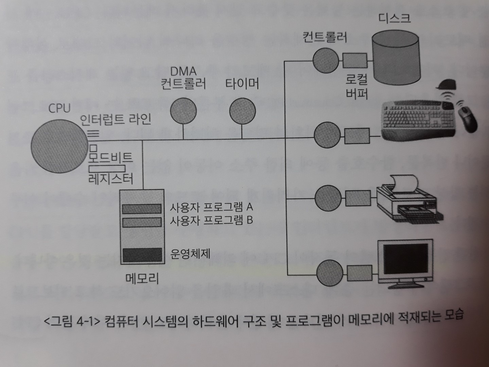
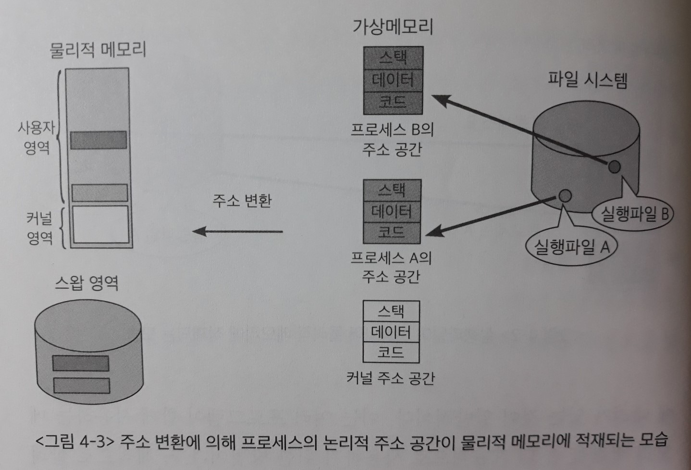
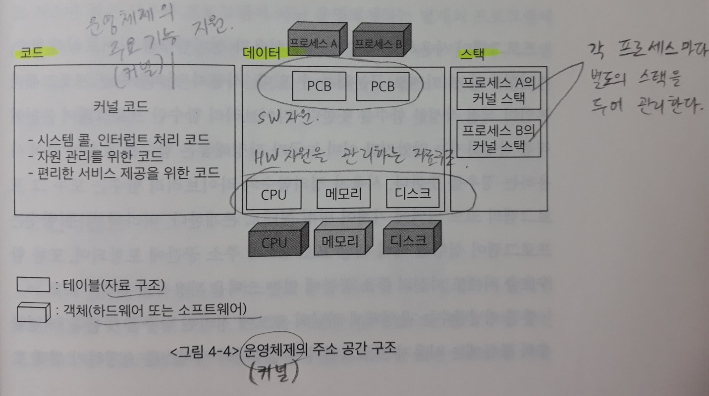
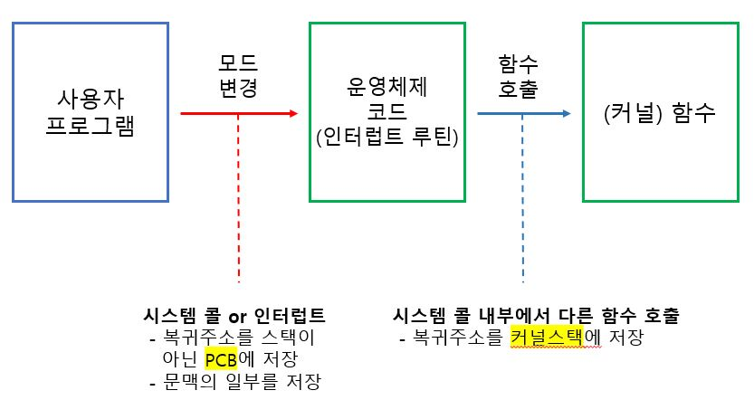
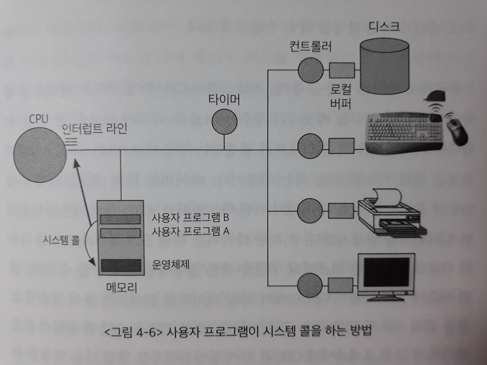
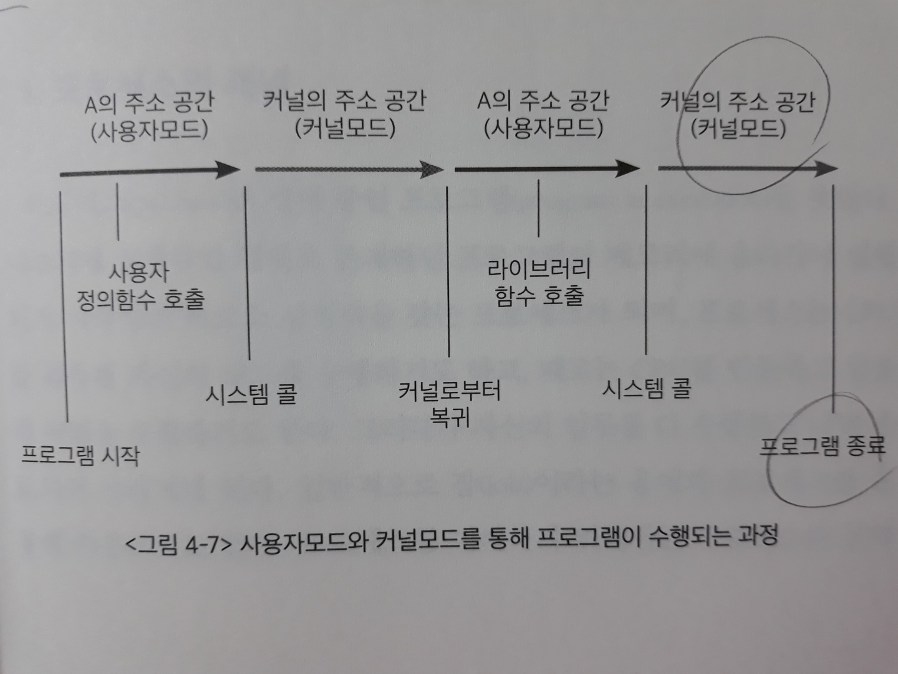

# 4장. 프로그램의 구조와 실행

> 운영체제를 이해하기 전에 우선적으로 알아두어야 할 컴퓨터 하드웨어의 구성 및 동작 원리를 살펴본다.
>
> 컴퓨터 내부장치인 CPU와 메모리에 대해 살펴보고, 컴퓨터 외부의 주변장치에 대해서도 간단히 살펴본다.

## 1. 프로그램의 구조와 인터럽트

> 우리가 사용하는 컴퓨터 프로그램은 어떠한 프로그래밍 언어로 작성되었든 그 **내부 구조는 함수들로 구성된다**.
>
> 하나의 함수가 수행되는 중에 다른 함수를 호출하고, 호출된 함수의 수행이 끝나면 다시 원래 호출했던 함수의 위치로 돌아가 프로그램을 계속 실행하게 된다.

한편 프로그램이 CPU에서 명령을 수행하려면 해당 명령을 담은 **`프로그램의 주소 영역`이 메모리에 올라가 있어야 한다**.

이때 프로그램의 주소 영역은 크게 `코드(code)`, `데이터(data)`, `스택(stack)` 영역으로 구분된다.

- 코드 영역

  : 우리가 작성한 프로그램 함수들의 코드가 CPU에서 수행할 수 있는 **기계어 명령(machine instruction) 형태로 변환되어 저장**되는 부분

- 데이터 영역

  : `전역 변수(global variable)` 등 프로그램이 사용하는 데이터를 저장하는 부분

- 스택 영역

  : **함수가 호출될 때** 호출된 함수의 수행을 마치고 **복귀할 주소 및 데이터를 임시로 저장**하는 데에 사용되는 공간

  함수가 호출되면 다음에 실행할 명령(instruction)의 메모리 위치가 바뀌게 된다. 이는 CPU가 명령을 순차적으로 수행하다가 호출된 함수의 위치로 점프해서 새로운 위치의 명령을 실행하기 때문이다. 호출된 함수를 모두 수행하고 나면 원래 함수가 수행되던 위치로 돌아가는데, 이때 스택에 저장되어 있는 복귀 주소를 사용하게 되는 것이다. 

  **[함수호출과 인터럽트의 차이]**

  `인터럽트`의 동작 원리도 함수의 호출과 비슷하다. 하지만 한 가지 차이점이 있다.

  - 함수호출 - 복귀 주소는 각 프로그램의 주소 공간 중 **스택 영역**에 보관한다.
  
  - 인터럽트 - 복귀 주소는 운영체제가 관리하는 **PCB(프로세스 제어블록)**에 저장된다.
  
    > 인터럽트가 발생하면 다른 프로그램(운영체제)으로 제어가 넘어가므로, `논리적 주소`가 프로세스 주소 공간의 범위에서 커널 주소 공간의 범위로 넘어가는 분기점이 된다. 
    >
    > => 따라서 인터럽트가 발생한 프로그램의 **스택 영역**, 또는 커널의 **스택 영역**에 **복귀 주소를 저장하지 않는다**. 


## 2. 컴퓨터 시스템의 작동 개요

> 컴퓨터 시스템의 `동작`은 CPU에서 명령을 수행하는 부분과, 컴퓨터 외부장치와 입출력이 이루어지는 부분으로 이루어진다.

CPU는 매 시점 메모리의 특정 주소에 존재하는 명령을 하나씩 읽어와 그대로 실행한다. 

이때 CPU가 수행해야 할 메모리 주소를 담고 있는 `레지스터`를 **프로그램 카운터(Program Counter: PC)**라고 부른다. 즉 CPU는 매번 프로그램 카운터가 가리키는 메모리 위치의 명령을 처리하게 된다.

일반적으로 조건문이나 반복문, 함수호출 등에 의한 주소 이동이 없는 이상 프로그램 카운터는 항상 바로 다음 명령을 가리키게 되어 순차적인 수행이 이루어진다.



*(입출력 장치별로 존재하는 작은 CPU와 메모리를 각각 입출력 컨트롤러와 로컬버퍼라고 부른다)*

메모리에는 사용자 프로그램들과 운영체제가 같이 올라가 수행된다.

`프로그램 카운터`가 메모리 주소 중 운영체제가 존재하는 부분을 가리키고 있다면 현재 운영체제의 코드를 수행 중이며, **CPU가 커널모드에서 수행 중**이라고 말한다.

반대로 `프로그램 카운터`가 사용자 프로그램이 존재하는 메모리 위치를 가리키고 있다면 그 메모리 위치에 올라가 있는 사용자 프로그램이 수행 중이며, **CPU가 사용자모드에서 수행 중**이라고 말한다.


CPU가 수행하는 명령에는 일반명령과 특권명령이 있다.

- 일반명령 

  : **메모리에서 자료를 읽어와 CPU에서 계산하고 결과를 메모리에 쓰는 일련의 명령들**을 말한다.

  모든 프로그램이 수행할 수 있다.

- 특권명령

  : **`보안`이 필요한 명령**으로 입출력 장치, 타이머 등 **메모리 외의 각종 장치에 접근하는 명령**이다.

  운영체제만이 수행할 수 있다.
  
  => 컴퓨터 시스템은 이 두 명령의 `실행 가능성`을 체크하기 위해 CPU 내에 **모드 비트(mode bit)**를 둔다.

인터럽트를 발생시키기 위해 주변장치는 인터럽트 라인(interrupt line)을 세팅하고, CPU는 **매번 명령을 수행한 직후 인터럽트 라인을 체크**해 서비스 요청이 들어왔는지 확인한다.

이때 인터럽트의 종류는 다양하기 때문에 **각각의 인터럽트 발생 원인마다 라인을 다르게 해서 구분**하게 된다.


## 3. 프로그램의 실행

> **'프로그램이 실행(program execution)되고 있다'**는 것은 컴퓨터 시스템 차원에서 볼 때 크게 두 가지 중요한 의미를 가진다.
>
> 첫 번째는 디스크에 존재하던 `실행파일`이 메모리에 적재된다는 의미이고, 두 번째는 프로그램이 CPU를 할당받고 명령(instruction)을 수행하고 있는 상태라는 의미이다.

실행파일이 메모리에 적재될 때, 일부분만 메모리에 올라가고 나머지는 `디스크의 특정 영역`에 내려가 있는 것이 일반적이다.

이는 여러 프로그램이 함께 사용하는 메모리 공간을 좀 더 효율적으로 사용하기 위한 방법이다.

구체적으로 살펴보면, **프로그램의 주소 공간 중 당장 CPU의 수행에 필요한 부분은 메모리에 올려놓고** 그렇지 않은 부분은 디스크 중 메모리의 연장 공간으로 사용되는 `스왑 영역`에 내려놓는 방식으로 운영된다.



프로세스의 주소 공간은 코드(code), 데이터(data), 스택(stack) 등으로 구성된다.

각각의 프로그램마다 이러한 주소 공간을 별도로 가지며, 프로그램마다 독자적으로 존재하는 이와 같은 주소 공간을 **가상메모리(virtual memory)** 또는 **논리적 메모리(logical memory)**라고 부른다.

- 운영체제도 하나의 프로그램이므로 운영체제 **커널** 역시 코드, 데이터, 스택의 주소 공간 구성을 가지고 있다.

  - 커널의 코드 영역

    = CPU, 메모리 등의 자원을 관리하기 위한 부분 + 사용자에게 편리한 인터페이스를 제공하기 위한 부분 + 시스템 콜 및 인터럽트를 처리하기 위한 부분

    - 각각 운영체제의 주요 기능인, 운영체제 아랫단의 하드웨어 자원을 효율적으로 관리하는 것과/ 윗단의 사용자에게 편리한 서비스를 제공하는 것,/ 응용프로그램에게 편리한 서비스를 제공하는 기능을 지원한다.

  - 커널의 데이터 영역

    : 각종 **자원을 관리하기 위한 자료구조**가 저장된다.

    = 하드웨어 자원을 관리하기 위한 자료구조(CPU, 메모리) + 소프트웨어 자원을 관리하기 위한 자료구조(현재 수행 중인 프로그램 =`프로세스`)

    - 하드웨어 자원
      - CPU - 준비 큐
      - 메모리 - 자원 큐(공유메모리 관리)
      - 디스크 - 디스크 입출력 큐
  
    - 소프트웨어 자원
        - 커널의 데이터 영역 내에는 각 프로세스의 상태, CPU 사용 정보, 메모리 사용 정보 등을 유지하기 위한 자료구조인 **PCB**를 두고 있다.
  
  - 커널의 스택 영역
  
    : **커널 역시 함수 구조로 이루어져 있으므로**, 일반 프로그램의 스택 영역과 마찬가지로 함수호출시의 복귀 주소를 저장하기 위한 용도로 스택을 사용된다.
  
    하지만 일반 사용자 프로그램의 스택과는 달리 **현재 수행 중인 프로세스마다 별도의 스택을 두어 관리**한다.
    
    - 각 프로세스마다 `별도의 커널 스택`을 두어 관리하는 이유
    
      1.  프로세스가 함수를 호출할 때 **자기 주소 영역 내부에 정의된 함수를 호출하면** 자신의 스택에 복귀 주소를 저장하지만, **프로세스가 특권명령을 수행하려고 커널에 정의된 `시스템 콜`을 호출하고 `시스템 콜` 내부에서 다른 함수를 호출하는 경우** 그 복귀 주소는 커널 내의 주소가 되어(사용자 프로그램의 주소 영역 밖임) 사용자 프로그램의 스택과는 별도의 저장공간이 필요하게 되기 때문이다.
    
      2. **커널은 일종의 공유 코드**로서 모든 사용자 프로그램이 시스템 콜을 통해 커널의 함수를 접근할 수 있으므로(`멀티프로그래밍 환경`), 일관성 유지를 위해 각 프로세스마다 커널 내에 별도의 스택을 두게 되는 것이다.
    
         ​	=> 커널스택은 프로세스마다 별도로 두고 있기 때문에, 커널 내에서 이루어지는 함수 호출은 `직전에 CPU를 가지고 있던 프로세스의 커널스택`을 사용하게 된다.
    
    
    
    - 정리하자면 프로그램이 **자기 자신의 코드 내에서** 함수 호출 및 복귀 주소를 유지하기 위해서는 **자기 주소 공간 내의 스택을 사용**하고, 시스템 콜이나 인터럽트 등으로 **운영체제의 코드가 실행되는 중에**(현대의 운영체제는 부팅이 완료된 후 시스템 콜이나 인터럽트 발생시에만 실행됨) **함수호출이 발생할 경우 커널 스택을 사용**하게 되는 것이다.
  
  ``` java
  **유의할 점
      -사용자 프로그램과 커널은 모두 함수 구조로 이루어져 있으므로, 
  	다른 함수를 호출할 때 스택을 이용하여 복귀주소를 저장한다는 공통점이 있다. 
      -시스템 콜이나 인터럽트 발생은 '함수호출'이기는 하지만, 
  	CPU의 주체가 프로그램->운영체제로 바뀌는 메커니즘은 일반 함수호출과는 상이한 메커니즘이므로(모드 변경) 
  	프로그램의 복귀 정보를 스택이 아닌 PCB에 저장한다.
      (하드웨어 인터럽트의 경우, 인터럽트 라인에 전기 신호를 보내서 set한다.
      시스템콜(소프트웨어 인터럽트)의 경우, 인터럽트 라인을 set하는 명령어를 직접 실행한다.)
  ```
  
  
  
  > 커널스택은 프로세스마다 별도로 두고 있기 때문에, 커널 내에서 이루어지는 함수호출은 **직전에 CPU를 가지고 있던 (해당 인터럽트와 상관 없는)프로세스의 `커널스택`을 사용**하게 된다.


## 4. 사용자 프로그램이 사용하는 함수

> 프로그램이 사용하는 함수는 크게 **사용자 정의함수**와 **라이브러리 함수**, **커널함수**의 세 가지로 구분해볼 수 있다.

1. 사용자 정의함수

   : 프로그래머 본인이 직접 작성한 함수

2. 라이브러리 함수

   : 프로그래머 본인이 직접 작성하지는 않았지만 이미 누군가 작성해놓은 함수를 호출만 하여 사용하는 경우

- 사용자 정의함수와 라이브러리 함수는 모두 그 프로그램의 `코드 영역`에 **기계어 명령 형태로 존재**한다.

  따라서 이 두 함수는 프로그램이 **실행될 때에 해당 프로세스의 주소 공간에 포함되며(`동적연결, dynamic linking`)**, 또한 함수호출 시에도 자신의 주소 공간에 있는 스택을 사용하게 된다.

3. 커널 함수

   : 운영체제 커널의 코드에 정의된 함수.

   **[커널함수의 종류]**

   - 시스템 콜 함수

     : 사용자 프로그램이 `운영체제의 서비스를 요청`하기 위해 호출하는 함수

   - 인터럽트 처리 함수

     : 각종 하드웨어 및 소프트웨어가 `CPU의 서비스를 요청`하기 위해 발생시키는 함수

   CPU를 운영체제에 넘기기 위해 두 함수는 모두 동일한 메커니즘, 즉 **CPU의 인터럽트 라인을 세팅**하는 방법을 사용한다.

- 커널 함수는 운영체제 커널의 주소 공간에 코드가 정의된다.

  운영체제 내에는 **시스템 콜 함수**로 `read()` 함수와 `write()` 함수가 정의되어 있으며, 이들은 운영체제라는 별개의 프로그램에 CPU를 넘겨서 실행하는 것이다.

  예를 들어 화면에 문자열을 출력하는 `printf()` 함수는 그 자체로는 라이브러리 함수이지만 궁극적으로 **`특권명령`인 입출력을 수반하므로** printf() 내에서 커널함수를 호출하는 시스템 콜을 동반하게 된다.


## 5. 인터럽트

> 인터럽트 처리 중에 또 다른 인터럽트가 발생하는 경우에는 어떻게 처리되는지 알아보자

**원칙적으로는 인터럽트 처리 중에 또 다른 인터럽트가 발생하는 것을 허용하지 않는다.**

그 이유는 인터럽트 처리 중에 다른 인터럽트를 처리하면 `데이터의 일관성`이 유지되지 않는 문제가 발생할 수 있기 때문이다. => `동기화 문제`

- 인터럽트를 처리하는 중에 **운영체제 커널에 정의된 데이터를 변경**하고 있는데, 다른 인터럽트가 발생해 앞선 인터럽트에서 변경 중이던 데이터를 또다시 변경하게 되면 의도하지 않았던 결과값으로 변경될 수 있기 때문이다.

> 그렇지만 경우에 따라 **예외**가 존재할 필요성이 있다.
>
> 인터럽트마다 우선순위가 다르기 때문에 상대적으로 낮은 중요도를 가진 인터럽트를 처리하는 도중에 중요도가 더 높은 인터럽트가 발생하는 것을 허락할 필요가 있다.
>
> => 따라서 싱글 프로세서 환경이라도 **커널**의 `동기화`를 위해 **enable/disable interrupt** 외에도 **lock/unlock 알고리즘**이 필요하다.
>
> - 근데 우선순위 높은 인터럽트가 lock 걸린 공유 데이터에 접근하는 코드를 실행하지 못하면, 우선순위가 높아서 먼저 실행한 이유가 없다. 그래서 lock/unlock 알고리즘이 필요 없을지도..

현재 처리 중인 인터럽트보다 더 높은 우선순위의 인터럽트가 발생한다면 **현재 처리 중이던 인터럽트 코드의 수행 지점을 (커널 스택에) 저장하고**, 우선순위가 높은 인터럽트 처리가 끝나면 저장된 주소로 복귀해 이전에 수행하던 인터럽트 처리 코드를 마저 수행하게 된다.

- 두 인터럽트 모두 `커널 모드`로 변환되기 **직전에 수행되던 프로세스의 커널 스택**을 이용한다. (편의상)


## 6. 시스템 콜

> 시스템 콜은 비록 **함수호출**이기는 하지만 자신의 주소 공간을 거스르는 영역에 존재하는 함수를 호출하는 것을 말한다.

일반적인 함수호출이 **자신의 스택**에 복귀 주소를 저장한 후 호출된 함수 위치로 점프하는 것임에 비해, **시스템 콜은 주소 공간 자체가 다른 곳으로 이동해야 하므로 일반 함수호출과는 상이한 방법을 사용한다**.

그 방법은 *프로그램 자신이* `인터럽트 라인`에 인터럽트를 세팅하는 명령을 통해 이루어진다. 

=> 아직 운영체제 커널로 제어가 넘어가기 전이므로 운영체제가 간섭할 수 없다.

- 디스크의 파일 입출력 과정 (시스템 콜 사용의 예)

  1. 사용자 프로그램이 CPU에서 명령을 수행하던 중 디스크의 파일을 읽어와야 할 경우 `시스템 콜`로 커널의 함수를 호출하게 된다.

     이때 **입출력 함수의 호출이 자신의 주소 공간에서 이루어질 수 없기 때문에** 사용자 프로그램은 CPU의 제어권을 운영체제에 이양하게 되는데, 이는 `인터럽트 라인`을 세팅하는 명령을 통해 이루어진다.

  

  2. 인터럽트 라인이 세팅되면 CPU는 다음 명령을 수행하기 전에 인터럽트가 발생했는지 점검하게 되며, 이 과정에서 인터럽트가 발생한 것을 인지하고 현재 수행 중인 사용자 프로그램을 잠시 멈춘 후 **CPU의 제어권을 운영체제로 이양**시키게 된다.
  
  3. **운영체제는 `설정된 인터럽트 라인에 의해` 이번에 발생한 인터럽트가 입출력을 요청하는 인터럽트임을 알게 된다**. 
  
     그런 다음에 해당 `서비스루틴`으로 이동해 입출력 작업을 수행하게 된다. => 여기서부터 입출력 작업 시작!
  
     - 이 과정(`서비스루틴`)에서 CPU는 디스크 `컨트롤러`에게 파일을 읽어오라는 명령을 하게 된다.
     - 한편 디스크 컨트롤러가 디스크에서 데이터를 읽어오는 일은 CPU가 명령을 수행하는 일과 비교할 때 상대적으로 많은 시간이 소요된다.
  
  4. 따라서 대부분의 경우 운영체제는 입출력을 요청한 다음 **CPU의 제어권을 다른 프로세스에게 이양**한다.
  
     다른 프로세스가 CPU에서 명령을 수행하던 중, 입출력 작업이 완료되면 디스크 **컨트롤러가 CPU에게 인터럽트를 발생**시켜 작업이 완료되었음을 알린다. (`하드웨어 인터럽트`)
  
  5. 그러면 CPU는 사용자 프로세스의 수행을 잠시 멈추고 **인터럽트 처리루틴**으로 그 제어권이 넘어간다. 
  
     `처리루틴`은 디스크로부터 **로컬버퍼**로 읽어온 내용을 컴퓨터 내의 메모리로 복사한 후 디스크 입출력을 요청했던 **프로세스에게 다시 CPU를 획득할 수 있는 권한을 주는 것(blocked -> ready)**이다. 
  
  6. 그러면 해당 프로세스는 CPU를 기다리는 큐에 삽입되고 CPU의 제어권은 다시 인터럽트를 당한 프로세스로 넘어가 하던 작업을 계속 수행하게 된다.

``` java
**프로그램이 CPU를 할당받고 명령을 수행하다가 중간에 CPU를 빼앗기는 경우
    1. 타이머에 의해 인터럽트가 발생하는 경우
    	-타이머: 특정 프로그램에 의해 CPU가 독점되는 것을 방지하기 위한 하드웨어, 
				CPU 할당시간이 만료되면 인터럽트를 발생시킴
        -시분할 시스템의 구현을 위한 필수적인 요소
    2. 입출력 요청을 위해 시스템 콜을 하는 경우
        -시간이 오래 걸리므로 CPU를 다른 프로세스에게 이양하게 된다.
        -입출력 요청이 완료된 후 컨트롤러가 인터럽트를 발생시킨 시점부터 다시 CPU를 얻을 수 있는 자격을 얻게 된다.
```


## 7. 프로세스의 두 가지 실행 상태

> 하나의 프로세스가 시작되어 수행을 완료하기까지는 프로세스 **자신의 주소 공간에 있는 코드(사용자 정의함수, 라이브러리 함수)**만 실행되는 것이 아니라 **커널 주소 공간에 있는 코드(커널 함수)**도 실행된다.

전자를 `사용자모드에서의 실행 상태(user mode running)`라 하고, 후자를 `커널모드에서의 실행 상태(kernel mode running)`라 한다.

이때 한 가지 주의할 점은, 비록 시스템 콜을 통해 실행되는 것이 운영체제 커널의 코드이지만, **시스템 콜이 수행되는 동안 커널이 `실행 상태(running state)`에 있다고 하지 않고 프로세스 A가 `실행 상태`에 있다고 말한다**는 점이다.

- 이유: 커널의 코드가 실행 되는 것이 사실상 프로세스 A가 해야할 일을 대행하는 것이기 때문
- 다만 프로세스 A 자신의 코드를 실행하는 것과 구분지어, 이러한 상태를 '프로세스 A가 `커널모드`에서 `실행`중'이라고 말한다.



프로그램이 사용자 정의함수나 라이브러리 함수를 호출할 때에는 **모드의 변경 없이 사용자모드에서의 실행**을 지속하게 되고, 시스템 콜을 하는 경우에는 커널모드로 진입해 커널의 주소 공간에 정의된 함수를 실행하게 된다.

시스템 콜의 실행이 끝나면 다시 사용자모드로 복귀해서 시스템 콜 이후의 명령들을 계속 실행한다.

**프로그램의 실행이 끝날 때에는 커널모드로 진입해 프로그램을 종료한다.**

