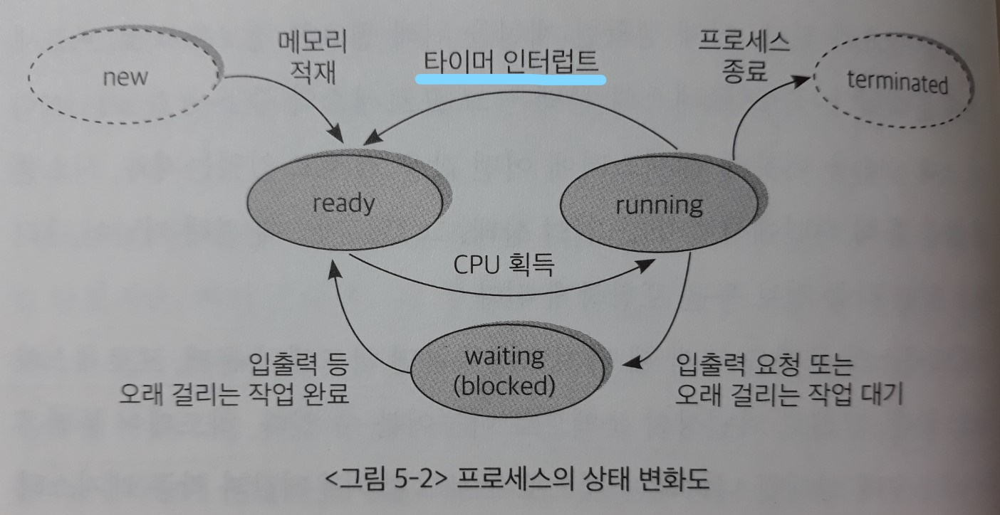

# 5장. 프로세스 관리

> 컴퓨터 프로그램이 어떻게 수행되는지를 설명한다.
>
> 하나의 프로그램이 메모리에 올라가서 프로세스가 되면 CPU를 얻고 빼앗기는 과정을 반복하며 프로그램의 진행이 이루어지고, 최종적으로 자신이 할 일을 끝낸 후 종료하게 된다.
>
> 운영체제가 얼마나 효율적으로 프로세스를 관리하는지 이 장에서 자세히 살펴본다.

## 1. 프로세스의 개념

> 프로세스(process)란 **실행 중인 프로그램(program in execution)**을 뜻한다.

디스크에 `실행파일` 형태로 존재하던 프로그램이 메모리에 올라가서 실행되기 시작하면 프로세스가 되며, 프로세스는 CPU를 흭득해 자신의 코드를 수행하기도 하고, 때로는 CPU를 반환하고 입출력 작업을 수행하기도 한다. 그러다가 자신의 임무를 다 수행하고 나면 종료되어 사라지게 된다.

일반적으로 **잡(job)**이라는 용어와 프로세스를 혼용해 사용하기도 한다.

**[프로세스의 문맥(context)]**

프로세스의 문맥이란 **프로세스가 현재 어떤 상태에서 수행되고 있는지 정확히 규명하기 위해 필요한 `정보`**를 의미한다.

`시분할 시스템 환경`에서 타이머 인터럽트에 의해 CPU를 빼앗겼다가 추후에 다시 CPU를 흭득해 명령의 수행을 재개하는 시점이 되면, 직전 수행 시점의 정확한 상태를 재현할 필요가 있다.

- 하드웨어 문맥

  : CPU의 수행 상태를 나타내는 것. 프로그램 카운터값과 각종 레지스터에 저장하고 있는 값들을 의미한다.

- 프로세스의 주소 공간

  : 프로세스는 코드, 데이터, 스택으로 구성되는 자기 자신만의 독자적인 주소 공간을 가지고 있다.

- 커널상의 문맥

  : 프로그램이 수행되어 프로세스가 되면 운영체제는 프로세스를 관리하기 위한 자료구조를 유지한다.

  **PCB**와 **커널스택(kernel stack)**이 이에 해당한다.

  

## 2. 프로세스의 상태

> 프로세스의 상태는 **실행(running), 준비(ready), 봉쇄(blocked, wait, sleep)**의 세 가지로 구분할 수 있다.

- 실행 상태

  : 프로세스가 CPU를 보유하고, 기계어 명령을 실행하고 있는 상태

- 준비 상태

  : 프로세스가 CPU만 보유하면 당장 명령을 실행할 수 있지만 CPU를 할당받지 못한 상태

- 봉쇄 상태

  : CPU를 할당받더라도 당장 명령을 실행할 수 없는 프로세스의 상태

  ex) 프로세스가 요청한 입출력 작업이 진행 중인 경우

이 밖에 프로세스가 생성 중이거나 종료 중인 일시적 상태를 각각 **시작(new)** 상태, **완료(terminated)** 상태라고 부르기도 한다.

- 시작 상태

  : 프로세스가 시작되어 그 프로세스를 위한 각종 자료구조는 생성되었지만 아직 메모리 흭득을 승인받지 못한 상태

- 완료 상태

  : 프로세스가 종료되었으나 운영체제가 그 프로세스와 관련된 자료구조를 완전히 정리하지 못한 상태

**[문맥 교환(context switch)]**

> 실행시킬 프로세스를 변경하기 위해 원래 수행 중이던 프로세스의 문맥을 저장하고 새로운 프로세스의 문맥을 세팅하는 과정

문맥 교환이 일어나는 경우

1. 타이머 인터럽트가 발생하는 경우

   : `실행` 상태에서 CPU의 제어권을 가지고 프로세스가 실행되는 중에 **타이머 인터럽트**가 발생하면 CPU의 제어권은 운영체제로 이양된다.

   그러면 운영체제는 타이머 인터럽트 처리루틴으로 가서 수행 중이던 프로세스의 문맥을 저장하고 `준비` 상태에 있는 프로세스 중에서 새롭게 CPU의 제어권을 부여할 프로세스를 선택한다.

   그러면 원래 수행 중이던 프로세스는 `준비` 상태로 변하고 새롭게 CPU를 할당받은 프로세스가 `실행` 상태가 된다.

2. 실행 상태에 있던 프로세스가 (입출력 요청 등으로) `봉쇄` 상태로 바뀌는 경우

   : 

문맥 교환이 일어날 때, `준비` 상태에 있는 프로세스들 중에서 CPU를 할당받을 프로세스를 선택한 후 CPU의 제어권을 넘겨받는 과정을 **CPU 디스패치(dispatch)**라고 한다.