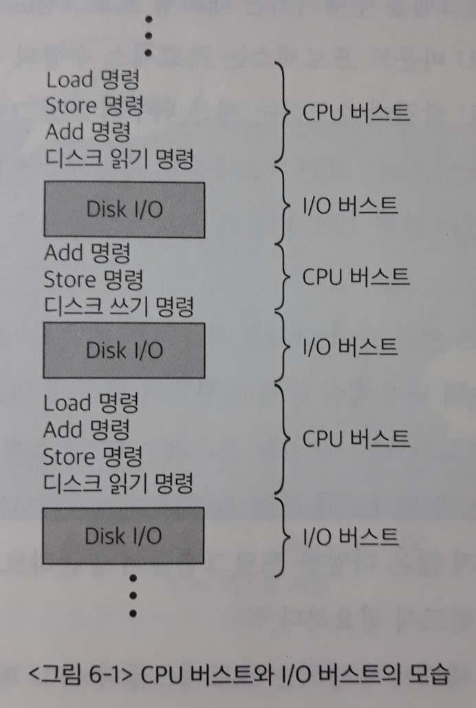

# 6장. CPU 스케줄링

> CPU 관리에 대해 살펴본다.
>
> 현대의 컴퓨터에서는 동시에 여러 프로그램이 수행되는 것을 지원한다.
>
> 이때 어떤 프로그램에게 우선적으로 CPU를 할당할 것인가를 결정하는 CPU 스케줄링 기법에 대해 기술한다.
>
> 어떤 CPU 스케줄링 기법을 사용하는가에 따라 컴퓨터 시스템의 성능이 크게 달라지므로 스케줄링 기법의 성능 평가 방법과 철학에 대해서도 자세히 살펴본다.
>
> CPU 스케줄링은 일상생활에서 대기 중인 고객들을 어떤 순서로 서비스하는 것이 효율적인지를 결정할 때 접하게 되는 문제와 유사하다.
>
> - 연산장치를 여러 개 장착한 CPU도 존재하나, CPU 스케줄링의 기본 철학은 다르지 않다.

- CPU

  : 프로그램의 `기계어 명령`을 실제로 수행하는 컴퓨터 내의 중앙처리장치

  **CPU는 일반적으로 한 시스템 내에 하나씩밖에 없으므로, 여러 프로그램이 동시에 수행되는 시분할 환경에서 매우 효율적으로 관리되어야 하는 자원이다.**

  - 프로그램 카운터(Program Counter: PC)

    : 현재 CPU에서 수행할 코드의 (가상)메모리 주소값을 가지고 있는 `레지스터`

    CPU는 프로그램 카운터가 가리키는 주소의 기계어 명령을 하나씩 수행하게 된다.

**[프로그램 실행과 관련된 기계어 명령]**

1. CPU 내에서 수행되는 명령

   : CPU 내에서만 수행되므로 명령의 수행 속도가 매우 빠르다.

   사용자 프로그램이 직접 CPU를 가지고 수행한다. `=> 일반명령`

   - `Add` 명령

     : CPU 내의 **레지스터에 있는 두 값**을 더해 **레지스터에 저장**하는 명령

2. 메모리 접근을 필요로 하는 명령

   : CPU 내에서 수행되는 명령보다는 시간이 오래 소요되지만 비교적 짧은 시간에 수행할 수 있다.

   사용자 프로그램이 직접 CPU를 가지고 수행한다. (CPU~메모리 이동) `=> 일반명령`

   - `Load` 명령

     : **메모리에 있는 데이터**를 CPU로 읽어들이는 명령

   - `Store` 명령

     : CPU에서 계산된 결괏값을 **메모리에 저장**하는 명령

3. 입출력을 동반하는 명령

   : CPU나 메모리 접근 명령에 비해 대단히 오랜 시간이 소요된다.

   프로그램이 수행되는 중에 I/O를 요청하면 **CPU의 제어권**이 운영체제 `커널`로 넘어갈 뿐 아니라 `=> 특권명령`

   상대적으로 매우 느린 입출력 장치의 접근이 필요하게 된다.

   - 입출력 작업
     - 키보드로부터 입력받기
     - 화면에 결과 출력
     - 디스크에서 `파일` 데이터를 읽어오거나 컴퓨터에서 처리된 결과를 디스크에 `파일` 형태로 저장

> CPU 내에서 수행되는 명령, 메모리 접근을 필요로 하는 명령 **=> 일반명령**
>
> - 일반명령 - 사용자 프로그램이 직접 실행할 수 있는 명령
>
> 모든 입출력 명령 **=> 특권명령**
>
> - 특권명령 - 사용자 프로그램이 직접 수행할 수 없도록 하고 운영체제를 통해 서비스를 대행하도록 하는 명령

**[프로그램의 수행]**

사용자 프로그램이 수행되는 과정은 **CPU 작업**과 **I/O 작업**의 반복-상이한 자원을 번갈아 사용-으로 구성된다.

이와 같이 프로그램의 수행은 서로 다른 두 `단계`의 조합으로 이루어진다. 

- CPU 버스트(burst)

  : 사용자 프로그램이 CPU를 직접 가지고 빠른 명령을 수행하는 일련의 단계

  프로그램이 I/O를 한 번 수행한 후 다음 번 I/O를 수행하기까지 직접 CPU를 가지고 명령을 수행하는 `일련의 작업`을 말한다.

- I/O 버스트

  : I/O 요청이 발생해 커널에 의해 입출력 작업을 진행하는 비교적 느린 단계

  I/O 작업이 요청된 후 완료되어 다시 CPU 버스트로 돌아가기까지 일어나는 `일련의 작업`을 말한다.

각 프로그램마다 `CPU 버스트`와 `I/O 버스트`가 차지하는 비율이 균일하지는 않다.

이 비율의 기준에서 **프로세스**를 나눌 수 있다.

- I/O 바운드 프로세스 (I/O bound process)

  : I/O 요청이 빈번해 CPU 버스트가 짧게 나타나는 프로세스

  - **대화형 프로그램(interactive program)**
  - 프로그램이 수행되는 구조 - 짧은 CPU 버스트를 많이 가지고 있다.

- CPU 바운드 프로세스 (CPU bound process)

  : I/O 작업을 거의 수행하지 않아 CPU 버스트가 길게 나타나는 프로세스

  - 계산 위주의 프로그램
  - 프로그램이 수행되는 구조 - 소수의 긴 CPU 버스트로 구성된다.

> CPU 스케줄링은 이와 같이 **`CPU를 사용하는 패턴`이 상이한 여러 프로그램이 동일한 시스템 내부에서 함께 실행(`시분할 시스템`)되기 때문**에 필요한 것이다.

프로세스들의 CPU 버스트 분포는 다수의 짧은 CPU 버스트와 소수의 긴 CPU 버스트로 구성된다.

다시 말해서 CPU를 한 번에 오래 사용하기보다는, 잠깐 사용하고 I/O 작업을 수행하는 프로세스들이 많다는 것이다.

- CPU 버스트가 짧은 프로세스는 대부분 `대화형 작업(interactive job)`이다.

- 이러한 작업을 수행하는 프로세스는 사용자에 대한 빠른 응답이 중요하므로 **CPU의 빠른 서비스를 필요로 한다**.

  => 따라서 `CPU 스케줄링`을 할 때 CPU 버스트가 짧은 프로세스, 즉 `I/O 바운드 프로세스`의 우선순위를 높여주는 것이 바람직하다.

  [효과]

  ​	1) 대화형 프로세스의 빠른 응답성 제공

  ​	2) I/O 장치의 효율성을 높임

  ​		: I/O 바운드 프로세스에게 먼저 CPU를 할당할 경우 CPU를 잠깐만 사용한 후 곧바로 I/O 작업을 수행할 수 있으므로 **I/O 장치의 이용률이 높아진다**.

  ​		(반대의 경우, 먼저 할당된 프로세스가 CPU를 길게 사용하므로 I/O 바운드 프로세스는 응답시간이 길어질 뿐 아니라, 해당 I/O 장치도 그 시간 동안 휴면 상태가 되기 때문에 비효율적) 

## 1. CPU 스케줄러

> CPU 스케줄러는 `준비` 상태에 있는 프로세스들 중 어떠한 프로세스에게 CPU를 할당할지(`실행` 상태로 만들 것인지) 결정하는 **운영체제 커널의 코드**이다.
>
> - CPU 스케줄러는 `단기 스케줄러(short term scheduler)`라고도 부른다.

CPU 스케줄러 동작의 예시로,

프로세스가 CPU를 할당받고 기계어 명령을 수행하다가 `타이머 인터럽트`가 발생하면 CPU 스케줄러가 호출된다.

그러면 CPU 스케줄러는 **준비 큐**에서 CPU를 기다리는 프로세스 중 하나를 선택해 CPU를 할당하게 된다.

**[CPU 스케줄링이 필요한 경우들]**

1. `실행` 상태에 있던 프로세스가 **I/O 요청** 등에 의해 `봉쇄(blocked)` 상태로 바뀌는 경우

2. `실행` 상태에 있던 프로세스가 **타이머 인터럽트 발생**에 의해 `준비` 상태로 바뀌는 경우 (위의 예시)

3. I/O 요청으로 `봉쇄` 상태에 있던 프로세스의 **I/O 작업이 완료되어 인터럽트가 발생**하고, 그 결과 이 프로세스의 상태가 `준비` 상태로 바뀌는데(일단 준비 큐에 서게 됨),

   => 이때 일반적으로는 CPU 스케줄러가 호출되지 않고, 인터럽트 이전에 실행중이던 프로세스가 타이머 인터럽트가 다 될 때까지 다시 이어서 `실행`된다. (CPU 스케줄링이 발생하지 않고 실행 모드만이 변경됨)

   - 이번에 **I/O 작업이 완료된 프로세스가** 인터럽트 당한 프로세스보다 **우선순위가 높아**, 인터럽트 처리 후 직전에 수행되던 프로세스에게 CPU를 다시 할당하는 것이 아니라 `문맥교환`을 통해 I/O가 완료된 프로세스에게 CPU를 할당하는 경우

4. CPU에서 `실행` 상태에 있는 **프로세스가 `종료`**되는 경우

**[CPU 스케줄링 방식]**

- 비선점형(nonpreemptive) 방식

  : CPU를 획득한 프로세스가 **스스로 CPU를 반납**하기 전까지는 CPU를 빼앗기지 않는 방법

  - 1, 4번이 비선점형 스케줄링에 해당됨

- 선점형(preemptive) 방식

  : **CPU를 강제로 빼앗을 수 있는** 스케줄링 방법

  - CPU를 빼앗는 방법으로는 `할당시간(time quantum)`을 부여한 후 `타이머 인터럽트`를 발생시키는 방법이 대표적이다.
  - 2, 3번이 선점형 스케줄링 방식에 해당됨

## 2. 디스패처

> CPU 스케줄러가 어떤 프로세스에게 CPU를 할당해야 할지 결정하고 나면 **선택된 프로세스에게 실제로 CPU를 이양하는 작업**이 필요하다.
>
> 이와 같이 새롭게 선택된 프로세스가 CPU를 할당받고 작업을 수행할 수 있도록 `환경설정`을 하는 **운영체제의 코드**를 `디스패처(dispatcher)`라고 부른다.

디스패처는 

1. 현재 수행 중이던 프로세스의 `문맥(context)`을 그 프로세스의 **PCB**에 저장하고, 새롭게 선택된 프로세스의 `문맥`을 **PCB**로부터 복원한다. => <u>문맥교환</u>? (p.117의 정의에 의하면 디스패처가 하는 일이 '문맥교환'인 것 같지만, p.120의 정의는 다름)
2. 새로운 프로세스의 `문맥`을 복원시킨 후에는 시스템의 상태를 **사용자모드**로 전환해(환경설정) 사용자 프로그램에게 **CPU의 제어권**을 넘기게 된다.
   - 사용자 프로그램은 복원된 `문맥` 중 **프로그램 카운터**로부터 현재 수행할 주소를 찾을 수 있게 된다.

- 디스패치 지연시간(dispatch latency)

  : 디스패처가 하나의 프로세스를 정지시키고 다른 프로세스에게 CPU를 전달하기까지 걸리는 시간(= 1+2)

  디스패치 지연시간의 대부분은 **<u>문맥교환</u> 오버헤드**에 해당한다. (= 1번)

## 3. 스케줄링의 성능 평가

- 시스템 관점의 지표

  - CPU 이용률(CPU utilization)

    : 전체 시간 중에서 CPU가 일을 한 시간의 비율

    > CPU는 대부분의 시스템에 하나만 존재하는 고비용의 자원이므로 **`CPU의 이용률`은 시스템 전체의 성능과 밀접하게 관련된다**.
    >
    > 따라서 CPU가 일을 하지 않고 휴면(idle) 상태에 머무르는 시간을 최대한 줄이는 것이 **스케줄링의 중요한 목표**이다.

  - 처리량(throughput)

    : <u>주어진 시간</u> 동안 `준비 큐`에서 기다리고 있는 프로세스 중 **몇 개**를 끝마쳤는지(`CPU 버스트`를 완료한 프로세스의 개수)

    즉 CPU의 서비스를 원하는 프로세스 중 몇 개가 **CPU를 원하는 만큼 모두 사용하고 이번 `CPU 버스트`를 끝내어 `준비 큐`를 떠났는지** 측정한 개념이다. 

    - `CPU 버스트`를 완료하지 못한 상태에서 타이머 인터럽트가 걸리는 경우에는, 프로세스가 다시 준비 큐의 맨 뒤로 가게 되므로 처리량에 카운트하지 않는다.
    - <u>주어진 시간</u>에 **더 많은 프로세스들이 CPU 작업을 완료하기 위해서는**, `CPU 버스트`가 짧은 프로세스에게 우선적으로 CPU를 할당하는 것이 유리하다. 

- 사용자 관점의 지표

  : 기다린 시간과 관련된 지표들이 있다.

  - 소요시간(turnaround time)

    : 프로세스가 CPU를 요청한 시점(곧바로 <u>준비 큐</u>로 들어감)부터, 자신이 원하는 만큼 CPU를 다 쓰고 `CPU 버스트`가 끝날 때까지 걸린 시간

    = `준비 큐`에서 기다린 시간(waiting time) + 실제로 CPU를 사용한 시간

    = 소요된 총 시간

    - `현대의 시분할 시스템`에서 사용되는 운영체제는 **장기 스케줄러 없이** 곧바로 `시작(new)` 상태의 프로세스를 메모리를 할당해 <u>준비 큐</u>에 넣어준다.

    > 이는 해당 `CPU 버스트`가 완료될 때까지 소요된 시간으로, 프로그램이 시작해 종료하는 데까지 걸리는 시간이 아님에 주의해야 한다.
    >
    > 우리는 CPU에만 관심이 있기 때문에 하나의 프로세스라 하더라도 소요시간은 `CPU 버스트 `마다 각각 별도로 측정된다.

    - ex) CPU를 사용하다가 I/O 연산을 위해 CPU를 자진 반납했다면 CPU를 사용하기 위해 `준비 큐`에 들어왔을 때부터 CPU를 자진 반납하기까지 걸린 시간이 `소요시간`이 된다.

  - 대기시간(waiting time)

    : 이번 `CPU 버스트`가 끝나기까지 프로세스가 `준비 큐`에서 기다린 시간의 합

    - `시분할 시스템`에서는 **타이머**를 사용해서 하나의 프로세스가 CPU를 연속적으로 사용할 수 있는 시간을 제한한다.

      따라서 한 번의 CPU 버스트 중에도 준비 큐에서 기다린 시간이 여러 번 발생할 수 있다.

  - 응답시간(response time)

    : 프로세스가 `준비 큐`에 들어온 후 처음으로 CPU를 획득하기까지 기다린 시간

    - `타이머 인터럽트`가 빈번히 발생할수록 `응답시간`이 향상된다.

    > 응답시간은 **대화형 시스템에 적합한 성능 척도**로서 **사용자 입장에서 가장 중요한 성능 척도**라 할 수 있다.

## 4. 스케줄링 알고리즘 (scheduling algorithm)

### 1) 선입선출 스케줄링

선입선출(FCFS: First-Come First-Served) 스케줄링은 프로세스가 `준비 큐`에 **도착한 시간 순서대로** CPU를 할당하는 방식을 말한다.

- CPU를 먼저 요청한 프로세스에게 CPU를 먼저 할당하고,

- 그 프로세스가 자발적으로 CPU를 반납할 때까지 빼앗지 않는다.

  **=> 비선점형(nonpreemtive) 방식**

- ex) 은행, 공항, 화장실 등 일상생활

다음과 같은 경우에 비효율적이다.

 Convoy effect

- CPU 버스트가 긴 프로세스가 먼저 도착하는 경우

  : 나중에 도착한 CPU 버스트가 짧은 프로세스들에게 우선적으로 CPU를 할당해주는 알고리즘과 비교하면,

  - `평균 대기시간(average waiting time)`이 길어지게 된다.
  -  I/O 장치들의 이용률도 동반 하락하게 된다.
    - CPU 버스트가 짧은 프로세스들에게 잠깐씩만 CPU를 할당하면, 이 프로세스들이 CPU 버스트를 마친 뒤 I/O 작업을 연이어 수행할 수 있다.

> FCFS 스케줄링 알고리즘에서는 **먼저 도착한 프로세스의 성격에 따라** `평균 대기시간`이 크게 달라진다.

### 2) 최단작업 우선 스케줄링

최단작업 우선(SJF: Shortest-Job Fisrt) 스케줄링은 **CPU 버스트가 가장 짧은 프로세스에게 제일 먼저 CPU를 할당**하는 방식이다.

> SJF 스케줄링 알고리즘은 `평균 대기시간`을 가장 짧게 하는 **최적 알고리즘(optimal algorithm)**으로 알려져 있다.