# 7장. 메모리 관리

> 프로그램이 실행되기 위해서는 실행에 당장 필요한 부분이 **메모리**에 올라가 있어야 한다.
>
> 여러 프로그램이 동시에 실행되는 환경에서는 한정된 메모리 공간을 여러 프로그램이 조금씩 나누어 사용해야 한다.
>
> 이때 어떤 프로그램에 어느 정도의 메모리를 할당할 것인가를 결정해야 한다.
>
> - 운영체제는 모든 프로그램에게 공평하게 메모리를 할당하기보다는 **몇몇 프로그램에게 집중적으로 메모리를 할당**한 후, 시간이 흐르면 이들로부터 메모리를 회수하여 또 다른 프로그램에게 집중적으로 메모리를 할당하는 방식을 채택한다.
> - 이런 방식을 채택하는 이유는 프로그램의 빠른 실행을 위해 프로그램마다 적어도 일정 수준 이상의 메모리 공간을 확보하고 있는 것이 효율적이기 때문이다.

> 이 챕터에서의 주요한 내용은 `주소 변환`이다.
>
> 프로세스가 실행되는 동안, CPU가 논리적 주소를 **MMU**와 같은 HW에 입력으로 주면 물리적 메모리 주소로 변환해서 **메모리 참조**를 하게 된다.
>
> `주소 변환`에서의 운영체제의 역할은 무엇인가?
>
> - **운영체제의 역할은 없다. `주소 변환`은 전부 HW가 한다.**
>
>   - `문맥교환`으로 CPU에서 수행 중인 프로세스가 바뀔 때마다, `주소 변환`을 도와주는 2개의 레지스터 값들을 그 프로세스에 해당되는 값으로 재설정하는 작업만 운영체제가 한다.
>   - `가상메모리`에서는 운영체제가 중요한 역할을 하게 된다.
>
> - 메모리 참조(`주소 변환`이 필요한 작업)는 하나의 프로세스가 CPU를 점유하고 있는 상태에서 **매 클럭사이클마다 이루어진다**.
>
>   만약 이러한 `주소 변환` 과정에 운영체제가 개입한다면, <u>매 클럭사이클마다 CPU의 제어권이 운영체제로 넘어갔다가 다시 사용자 프로세스에게 돌아와야 하므로 매우 비효율적</u>이다.
>
> - cf) 메모리 접근(`일반명령`)이 아니라 I/O장치 접근에는 운영체제가 개입한다.
>
>   - 사용자 프로세스가 직접 I/O장치에 접근하지 못하기 때문에(`특권명령`) 운영체제에게 CPU 제어권을 넘겨준다.

메모리는 `주소`를 통해 접근하는 저장장치이다.

이때의 주소(address)란 서로 다른 위치를 구분하기 위해 사용하는 일련의 숫자로 구성된다.

컴퓨터는 이진수를 사용하므로 **메모리 주소는 이진수**로 매겨지게 된다.

- 흔히 사용하는 컴퓨터 시스템은 32비트 혹은 64비트의 주소 체계를 사용하고 있다.

- 컴퓨터에서는 **`byte` 단위로 메모리 주소를 부여**한다.

  - ex) 32비트 주소 체계

    : 2^32 `바이트`만큼의 메모리 공간에 서로 다른 주소를 할당할 수 있다.

컴퓨터상의 주소도 32비트를 그대로 사용하지 않고 효율적인 운영을 위해 연속된 일련의 영역을 행정구역처럼 묶어서 사용한다. 즉, 주소를 숫자로만 구분하지 않고 계층적으로 나누어 관리한다.

- 페이지(page)

  : 보통 4 KB(= 2^12 byte) 단위로 묶어서 `페이지`라는 행정구역(계층)을 만든다.

   페이지 하나의 크기가 2^12 바이트이므로 페이지 내에서 바이트별 위치 구분을 위해서는 12비트가 필요하다.

  따라서 총 32비트의 주소 중 **하위 12비트는 페이지 내에서의 주소**를 나타내게 된다.

## 1. 주소 바인딩

- Symbolic Address

  : 프로그래머가 코드를 작성할 때에는 숫자 주소를 사용하지 않고, **symbol로 된 변수 이름**을 이용해서 코딩한다.

  - symbolic address가 `컴파일` 된 후에 logical address로 변한다.
- `컴파일 타임 바인딩` 방식에서는 logical address가 그대로 physical address가 된다.
  
- 프로세스의 주소 공간(address space)

  : 프로그램이 실행을 위해 **메모리**에 적재되면 그 프로세스를 위한 독자적인 주소 공간이 생성된다.

  이 주소를 `논리적 주소(logical address)` 혹은 `가상 주소(virtual address)`라고 부른다.

  > CPU는 **논리적 주소(가상 주소)에 근거해 `기계어 명령`을 실행**한다.
  >
  > => 코드상에 남아있는 논리적 주소가 메모리에 그대로 올라가기 때문이다.
  >
  > ​	ex) 0: Add 20, 30	-->	500: Add 20, 30
  >
  > ​		 20: 100						520: 100
  >
  > ​		 30: 330						530: 330
  >
  > 논리적 주소는 각 프로세스마다 독립적으로 할당되며 0번지부터 시작된다.

- 물리적 주소(physical address)

  : 물리적 메모리에 실제로 올라가는 위치

  - 낮은 주소 영역 - 운영체제가 올라감
  - 높은 주소 영역 - 사용자 프로세스들이 올라감

**프로세스가 실행되기 위해서는 해당 프로그램이 `물리적 메모리`에 올라가 있어야 한다.**

CPU가 `기계어 명령`을 수행하기 위해 논리적 주소를 통해 메모리 참조를 하게 되면, 해당 논리적 주소가 물리적 메모리의 어느 위치에 매핑되는지 확인해야 한다.

- 주소 바인딩(address binding)

  : 프로세스의 논리적 주소를 물리적 메모리 주소로 연결시켜주는 작업

**[주소 바인딩의 방식]**

프로그램이 적재되는 **물리적 메모리의 주소가 결정되는 시기**에 따라 세 가지로 분류할 수 있다.

1. 컴파일 타임 바인딩(compile time binding)

   : 물리적 메모리 주소가 **프로그램을 컴파일 할 때 결정**되는 주소 바인딩 방식

   **프로그램이 `절대주소`로 적재된다**는 뜻에서 `절대코드(absolute code)`를 생성하는 바인딩 방식이라고 말하기도 한다.

   - 프로그램이 올라가 있는 물리적 메모리의 위치를 변경하고 싶다면 컴파일을 다시 해야한다.
   - 따라서 비현실적이고 현대의 시분할 컴퓨팅 환경에서는 잘 사용하지 않는다.

2. 로드 타임 바인딩(load time binding)

   : **프로그램의 `실행(running)`이 시작될 때에 물리적 메모리 주소가 결정**되는 주소 바인딩 방식

   `로더(loader)`의 책임하에 물리적 메모리 주소가 부여되며, **프로그램이 `종료(terminated)`될 때까지 물리적 메모리 상의 위치가 고정**된다.

   - 로더 - 사용자 프로그램을 메모리에 적재시키는 프로그램
   - 컴파일러가 `재배치 가능 코드(relocatable code)`를 생성한 경우에 가능한 주소 바인딩 방식이다.
     - 재배치 가능 코드 - 항상 특정 위치에 올라가야 하는 것이 아니라, `실행`시에 비어있는 위치 중에 어느곳에나 올라갈 수 있는 코드 

3. 실행시간 바인딩(execution time binding 또는 run time binding)

   : 프로그램이 `실행(running)`을 시작한 후에도 그 프로그램이 위치한 **물리적 메모리 상의 주소가 변경될 수 있는** 바인딩 방식

   CPU가 주소를 참조할 때마다 해당 데이터가 물리적 메모리의 어느 위치에 존재하는지, `주소 매핑 테이블(address mapping table)`을 이용해 바인딩을 점검해야 한다.

   > 앞의 두 방식은 고정주소 방식이므로 `주소 매핑 테이블`이 필요하지 않다.

   - 다른 방식들과 달리 하드웨어적인 지원이 필요

     - 기준 레지스터(base register)

     - 한계 레지스터(limit register)

     - MMU(Memory Management Unit: 메모리 관리 유닛)
   
       : 논리적 주소를 물리적 주소로 매핑해주는 하드웨어 장치

**[MMU 기법(MMU scheme)]**

MMU를 사용해 가장 기본적인 방식으로 `주소 변환`을 수행하는 기법

- CPU가 특정 프로세스의 **논리적 주소**를 참조하려고 할 때, MMU 기법은 **그 주소값에 기준 레지스터의 값을 더해** 물리적 주소값을 얻어낸다.

  - 기준 레지스터

    : **프로세스의 물리적 메모리 시작 주소**를 가지고 있으며, `재배치 레지스터(relocation register)`라고도 부른다.

> `MMU 기법`이 **프로그램의 주소 공간이 물리적 메모리의 한 장소에 연속적으로 적재되는 것으로 가정**하기 때문에, 물리적 메모리 상의 시작 주소만 알면 주소 변환을 위와 같이 매우 쉽게 할 수 있는 것이다.

MMU 기법에서 `사용자 프로그램`이나 `CPU`는 **논리적 주소만을 다룰 뿐**, 실제 물리적 주소는 알지 못하며 알아야 할 필요도 없다.

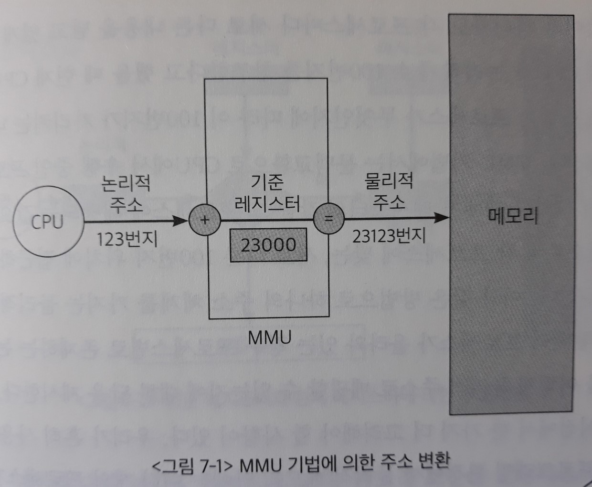

이 그림에서 논리적 주소 123번지는 물리적 메모리의 시작 위치인 `재배치 레지스터`값으로부터 요청된 위치가 얼마나 떨어져 있는지를 나타내는 **일종의 오프셋(offset) 개념**으로 생각할 수 있다.

흔히 사용하는 `다중 프로그래밍 환경`에서 고려해야 할 사항이 있다. 하나의 주소 체계를 가지는 물리적 메모리 내에 **여러 프로세스가 동시에 올라가 있으므로** 다음 두 가지 사항을 고려한다.

1. MMU 기법에서는 `문맥교환`으로 CPU에서 수행 중인 프로세스가 바뀔 때마다 **재배치 레지스터의 값을 그 프로세스에 해당되는 값으로 재설정함**으로써 각 프로세스에 맞는, 서로 다른 123번지 위치에 접근하는 것을 지원한다.

2. CPU가 요청한 논리적 주소값과 재배치 레지스터 값을 더한 결과가 **해당 프로세스의 주소 공간을 벗어나는 경우**가 발생할 수 있다.

   - `다중 프로그래밍 환경`에서 물리적 메모리 안에는 여러 개의 프로세스가 동시에 올라가 있다.

     MMU 기법은 연속 할당 방식을 가정하는데, 예를 들어 하나의 사용자 프로그램이 C 언어의 `포인터` 등 **메모리 주소 참조 연산**을 잘못 사용할 수도 있다.

     이런 경우에는 물리적 메모리 상에서 외부 프로세스의 주소 공간을 가리키게 된다.
     
   

이렇게 되면 `메모리 보안(memory protection)`이 이루어지지 않아 다른 사람이 수행 중인 프로그램 영역을 침범하거나 심지어 운영체제 영역을 변경할 수도 있다.

=> 운영체제는 이러한 상황이 발생하는 것을 방지하기 위해 `한계 레지스터(limit register)`라는 또 하나의 레지스터를 사용한다.

- 한계 레지스터는 프로세스가 자신의 주소 공간을 넘어서는 메모리 참조를 하려고 하는지 체크하는 용도로 사용되며,
   - 현재 CPU에서 수행 중인 프로세스의 논리적 주소의 최대값, 즉 그 프로세스의 크기를 담고 있다.

   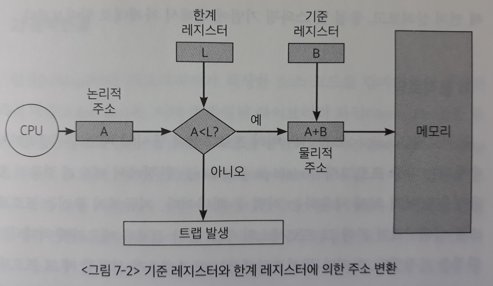
   
   [메모리 보안을 달성하는 방법]
   
   먼저 CPU가 요청한 프로세스의 논리적 주소값이 한계 레지스터 내에 저장된 그 프로세스의 크기보다 작은지 확인한다.
   
   - 작다면 물리적 주소값을 구한 다음 해당 **물리적 메모리 위치에 접근하도록 허락**한다.
   - 크다면 프로세스가 존재하는 물리적 메모리의 바깥 부분, 다시 말하면 다른 프로세스의 주소 영역에 접근하려는 시도이므로 `트랩`을 발생시켜 **해당 프로세스를 강제종료**시킨다.
     - `예외상황`은 운영체제에 소프트웨어 인터럽트를 발생시켜 CPU의 제어권을 해당 프로그램으로부터 **운영체제**로 이양시키고, 운영체제는 예외상황을 발생시킨 프로그램을 강제로 종료시킨다.

## 2. 메모리 관리와 관련된 용어

### 1) 동적 로딩

동적로딩(dynamic loading)은 여러 프로그램이 동시에 메모리에 올라가서 수행되는 `다중 프로그래밍(multi-programming)` 환경에서 **메모리 사용의 효율성을 높이기 위해 사용하는 기법** 중 하나이다.

지금까지 우리는 프로세스를 실행시키기 위해 그 프로세스의 주소 공간 전체가 메모리에 적재되는 환경을 가정했다.

- MMU 기법 - 프로세스 주소 공간의 일부만 적재되면, 논리적 주소가 가리키는 위치가 물리적 메모리에 아직 적재되지 않은 부분이 되는 경우가 발생할 수 있다. 우리는 그러한 경우를 제외했다.
- 프로그램에 에러도 없는데 로더가 적절한 단위로 적재하지 못해서 트랩으로 강제종료 되는 상황은 발생하면 안되기 때문이다.

하지만 동적로딩에서는 해당 부분이 불릴 때 그 부분만을 메모리에 적재하는 방식을 사용한다. 즉 프로세스 내에서 **실행에 필요한 부분이 실제로 불릴 때마다 메모리에 적재**하는 것을 말한다.

- 실제로 프로그램의 코드 중 상당 부분은 오류 처리루틴과 같이 아주 특별한 경우에만 가끔씩 사용되는 `방어용 코드`이다.

  동적로딩 기법은 사용되지도 않을 많은 양의 코드가 메모리에 올라가는 것을 막아 메모리를 좀 더 효율적으로 사용할 수 있도록 한다.

- 따라서 같은 크기의 물리적 메모리에 더 많은 프로그램을 적재할 수 있기 때문에 `메모리 이용의 효율성(memory utilization)`이 향상된다.

> 동적로딩은 운영체제의 특별한 지원 없이 프로그램 자체에서 직접 구현이 가능하며, 
>
> 보통 프로그래머는 운영체제가 지원하는 라이브러리를 이용하여 구현한다.
>
> => 동적로딩은 `운영체제의 페이징 기법`과는 다르다. (코드에 명시되지 않고 운영체제가 알아서 해줌)

### 2) 동적연결

- 연결(linking)

  : 소스 코드를 컴파일하여 생성된 `목적 파일(object file)`과, 이미 컴파일된 `라이브러리 파일(library file)`들을 묶어서 하나의 `실행파일`을 생성하는 과정

  - 정적연결(static linking)

    : 정적연결에서는 프로그래머가 작성한 코드와 **라이브러리 코드가 모두 합쳐져서 `실행파일`이 생성**된다.

    - 단점

      1) 실행파일의 크기가 상대적으로 크다.

      2) 동일한 `라이브러리`를 각 프로세스가 개별적으로 메모리에 적재해야 하므로 물리적 메모리가 낭비된다.

       비록 동일한 라이브러리 코드라 하더라도 **<u>각 프로세스의 주소 공간</u>에 독자적으로 존재하는 코드이므로 별도의 적재가 필요**하기 때문이다. => <u>가상 메모리</u>

  - 동적연결(dynamic linking)

    : 동적연결에서는 라이브러리가 실행 시점에 연결된다.

    **`실행파일`에 라이브러리 코드가 포함되지 않으며**, 프로그램이 실행되면서 **라이브러리 함수를 호출할 때가 되어서야 연결**이 이루어진다.

    - 스텁(stub)

      : `실행파일`의 **라이브러리 호출 부분에** 해당 라이브러리의 위치를 찾기 위한 '스텁'이라는 **작은 코드**를 둔다.

      라이브러리 호출 시 스텁을 통해 해당 라이브러리가 메모리에 이미 존재하는지 살펴본다.

      - 이미 존재하는 경우 - 그 주소의 메모리 위치에서 직접 참조 => <u>물리적 메모리</u>
      - 존재하지 않는 경우 - **디스크**에서 `동적 라이브러리 파일`을 찾아 (물리적)메모리로 적재한 후 수행한다.

    - 다수의 프로그램이 공통으로 사용하는 라이브러리를 메모리**(물리적 메모리)**에 한 번만 적재하므로 메모리 사용의 효율성을 높일 수 있다.

    > 동적연결 기법은 운영체제의 지원을 필요로 한다.

### 3) 중첩

중첩(overlays)이란 **프로세스의 주소 공간(가상 메모리)을 분할해 실제 필요한 부분만을 메모리에 적재하는 기법**을 말한다.

`동적로딩`과 개념적으로 유사하지만, 동적로딩과 중첩을 사용하는 이유는 상이하다.

- 중첩

  - 초창기의 컴퓨터 시스템(단일 프로세스 환경, 물리적 메모리 크기가 작음)

  - 물리적 메모리의 크기 제약으로 인해 **하나의 프로세스조차도 메모리에 한꺼번에 올릴 수 없을 때**,

  - 당장 필요한 일부분을 메모리에 올려 실행하고 <u>해당 부분에 대한 실행이 끝난 후에</u> 나머지 부분을 올려 실행한다.

    => 로딩은 `정적로딩` 기법을 사용

    - 용도: 단일 프로세스만을 올려놓는 환경에서 메모리 용량보다 큰 프로세스를 실행하기 위한 어쩔 수 없는 선택

- 동적로딩

  - 다중 프로그래밍 환경
  - 메모리의 이용률을 향상시키기 위해
  - 프로세스의 주소 공간 중 **당장 필요한 부분을 그때그때 메모리에 동적으로 올린다**.
    - 용도: 메모리에 더 많은 프로세스를 동시에 올려놓고 실행하기 위함

> 중첩은 운영체제의 지원 없이 프로그래머에 의해 구현되어야 했으며, 작은 공간의 메모리를 사용하던 초창기 시스템에서 프로그래머가 손수 구현했다 해서 **수작업 중첩(manual overlays)**이라고도 부른다.
>
> - `동적 로딩`과 달리 라이브러리가 없어서 상세한 부분까지 직접 구현해야 했다.

### 4) 스와핑

스와핑(swapping)이란 **프로세스의 주소 공간(가상 메모리) 중 메모리에 올라온 부분 전체**를 디스크의 `스왑 영역(swap area)`에 일시적으로 내려놓는 것을 말한다.

- 스왑 영역

  : 디스크 내에 파일 시스템과는 별도로 존재하는 일정 영역. `백킹스토어(backing store)`라고도 부른다.

  파일 시스템은 전원이 나가더라도 유지되어야 하는 비휘발성 저장공간임에 비해, 스왑 영역은 프로세스가 수행 중인 동안에만 디스크에 일시적으로 저장하는 공간이다.

  - 다수의 사용자 프로세스를 담을 수 있을만큼 **충분히 큰 저장공간**이어야 한다.
  - 어느 정도의 **접근 속도가 보장**되어야 한다.

- 스왑 인(swap in) - 디스크에서 메모리로 올리는 작업

- 스왑 아웃(swap out) - 메모리에서 디스크로 내리는 작업

> **[동적로딩 vs 스와핑]**
>
> - `동적로딩`은 프로세스 주소공간을 필요한 부분이 호출될 때마다 동적으로 메모리에 적재하는 개념은 맞지만, `스와핑`처럼 degree of multiprogramming을 동적으로 조절(스왑 아웃-스왑 인)하는 개념은 아니다.
> - degree of multiprogramming을 동적으로 조절하기 위해 스왑 아웃이 먼저 일어난 후, 스왑 인이 일어난다.
>
> 현대의 시스템에서는 `동적로딩`과 `스와핑`이 모두 사용된다.

**[스와핑이 일어나는 과정]**

1. `스와퍼(swapper)`라고 불리는 `중기 스케줄러`가 스왑 아웃시킬 프로세스를 선정한다.

   - 중기 스케줄러
     - 현대의 시분할 시스템용 운영체제에서 장기 스케줄러 대신 사용하는 스케줄러
     - 너무 많은 프로세스에게 메모리를 할당해 시스템의 성능이 저하되는 경우(`스레싱`)를 방지하기 위해 메모리에 적재된 프로세스의 수를 **동적으로 조절**한다.

2. 스왑 아웃 대상으로 선정된 프로세스에 대해서는 현재 메모리에 올라가 있는 주소 공간의 내용을 **통째로** 디스크 스왑 영역에 스왑 아웃 시키게 된다.

   > 스와핑의 가장 중요한 역할은 **메모리에 존재하는 프로세스의 수를 조절**하는 것이다.
   >
   > 즉 스와핑을 통해 **다중 프로그래밍의 정도(degree of multiprogramming)**를 조절할 수 있다.

   너무 많은 프로그램이 메모리에 동시에 올라오게 되면 <u>프로세스당 할당되는 메모리의 양의 지나치게 적어져</u> 시스템 전체의 성능이 크게 떨어진다.

   스와핑은 스왑 아웃을 통해 **메모리에 남아있는 프로그램들에게 실행에 필요한 적절한 메모리 공간을 보장**한다. 

3. 지금 메모리에 있는 프로그램이 충분히 실행되고 나면, 이제 이 프로그램을 메모리에서 내쫓고 그 자리에 스왑 아웃되었던 프로그램을 다시 올린다.

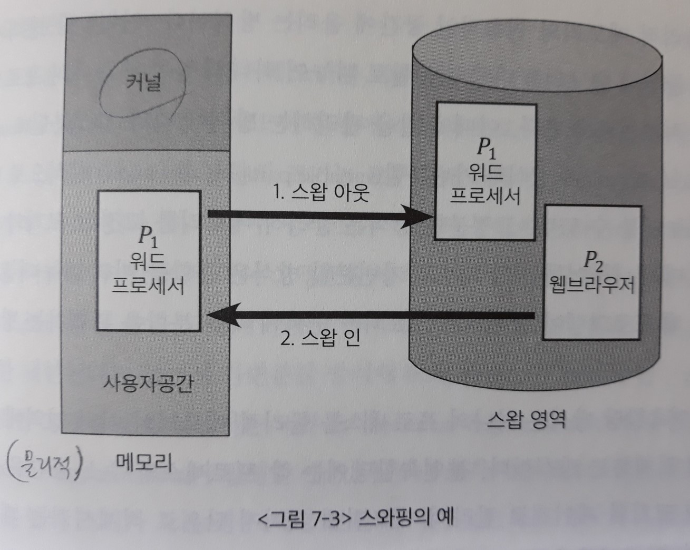

- `컴파일 타임 바인딩 방식`과 `로드 타임 바인딩 방식`에서는, 스왑 아웃된 프로세스가 다시 스왑 인 될 때에는 **원래 존재하던 메모리 위치로 다시 올라가야 한다**.
  - 컴파일 타임 바인딩 방식 - 절대주소. 물리적 메모리에 올라가기 전부터 코드 레벨(절대 코드)에서 주소를 지정한다.
  - 로드 타임 바인딩 방식 - 프로그램이 물리적 메모리에 올라갈 때, 즉 실행되는 시점에 정해진 주소가 종료될 때까지 고정 주소가 된다.
- `실행시간 바인딩 기법`에서는 추후 빈 메모리 영역 아무 곳에나 프로세스를 올릴 수 있다.
  - 프로그램이 실행을 시작한 후에도 물리적 메모리상의 주소가 변경 될 수 있다.

스와핑에서는 보통 디스크 내의 `스왑 영역`에 **프로세스의 주소 공간이 순차적으로 저장**되고, 프로세스 주소 공간 전체의 **용량이 매우 크기** 때문에, 스와핑에 소요되는 시간은 디스크의 탐색시간(seek time)이나 회전지연시간(rotational latency)보다는 **디스크 섹터에서 실제 데이터를 읽고 쓰는 `전송시간(transfer time)`이 대부분을 차지**한다. 

- `전송시간`은 swap되는 데이터 양에 비례한다.
- cf) 보통의 파일 입출력에서 디스크 접근 시간은, 대부분의 시간이 `디스크의 탐색시간(seek time)`이고 `실제 데이터를 전송하는 시간(transfer time)`은 미미하다. 

> 현대의 페이징 시스템(페이징 기법을 사용하는 시스템)에서는 `프로세스 주소 공간 전체`가 쫓겨나는 경우뿐 아니라, 일부 `페이지`가 쫓겨나는 경우에도 **스왑 인, 스왑 아웃** 표현을 사용하기도 한다.
>
> => 하지만 원칙적으로 **스왑 인, 스왑 아웃**은 `프로세스 주소 공간 전체`에 대해서만을 의미한다.
>
> - 그렇기 때문에 `중기 스케줄러`를 `swapper`라고 부르는 것이다.
>
>   (중기 스케줄러는 **스레싱을 방지하기 위해** `페이지` 단위가 아니라 `전체 주소 공간`을 쫓아냄)

## 3. 물리적 메모리의 할당 방식

물리적 메모리는 `운영체제 상주 영역`과 `사용자 프로세스 영역`으로 나뉘어 사용된다.

- 운영체제 상주 영역

  : `인터럽트 벡터`를 포함한 운영체제 **커널**이 위치한다.

  물리적 메모리의 낮은 주소 영역을 사용한다.

- 사용자 프로세스 영역

  : 여러 **사용자 프로세스**들이 적재되어 실행된다.

  물리적 메모리의 높은 주소 영역을 사용한다.

**[사용자 프로세스 영역의 관리 방법]**

프로세스를 메모리에 올리는 방식에 따라 `연속할당(contiguous allocation) 방식`과 `불연속할당(noncontiguous allocation) 방식`으로 나누어 볼 수 있다.

- 연속할당 방식

  : 각각의 프로세스를 *통째로* 물리적 메모리의 **연속적인 공간**에 올리는 방식

  <u>분할을 관리하는 방식</u>에 따라 다음과 같이 다시 나뉜다.

  - 고정분할(fixed partition allocation) 방식

    : 물리적 메모리를 **고정된 크기의 분할로 미리 나누어두는** 방식

  - 가변분할(variable partition allocation) 방식

    : **분할을 미리 나누어놓지 않은 채**, 프로그램이 실행되고 종료되는 순서에 따라 분할을 관리하는 방식

- 불연속할당 방식

  : 하나의 프로세스를 물리적 메모리의 **여러 영역에 분산**해 적재하는 방식
  
  <u>하나의 프로그램을 분할하는 기준</u>에 따라 다음과 같이 나뉜다.
  
  - 페이징(paging) 기법
  
    : 각 프로세스의 주소 공간을 **동일한 크기의 페이지**로 잘라서 메모리에 페이지 단위로 적재시키는 기법
  
  - 세그먼테이션(segmentation) 기법
  
    : 프로그램의 주소 공간을 코드, 데이터, 스택 등 **의미 있는 단위인 세그먼트**로 나누어 세그먼트 단위로 적재하는 기법
  
    세그먼트의 크기는 일정하지 않다.
  
  - 페이지드 세그먼테이션(paged segmentation) 기법
  
    : 세그먼트 하나를 다수의 페이지로 구성하는 기법
  
    **세그먼테이션을 기본으로 하되 이를 다시 동일 크기의 페이지로 나누어** 메모리에 올린다.

### 1) 연속할당 방식

각각의 프로세스를 물리적 메모리의 **한 곳에 연속적으로 적재**하는 방식

물리적 메모리를 **고정된 크기의 분할**로 미리 나누어 놓는지 그렇지 않은지에 따라 `고정분할 방식`과 `가변분할 방식`으로 나뉜다.

- 고정분할 방식

  : 물리적 메모리를 <u>주어진 개수만큼</u>의 **영구적인 `분할(partition)`로 미리 나누어두고, 각 분할에 하나의 프로세스를 적재**해 실행시킨다.

  > 이때 분할의 크기는 모두 동일하게 할 수도 있고 서로 다르게 할 수도 있다.
  >
  > 하지만 두 방식 모두 **하나의 분할에는 하나의 프로그램**만을 적재할 수 있다.

  - 따라서 고정분할 방식은 **동시에 메모리에 올릴 수 있는 프로그램의 수가 고정**되어 있으며,
  
- 수행 가능한 **프로그램의 최대 크기 또한 제한**된다.
  
  - 또한 `외부조각`과 `내부조각`이 발생할 수 있다.
  
    - 외부조각(external fragmentation)
  
      - 프로그램의 크기 > 분할의 크기
      - 해당 분할이 비어 있는데도 불구하고 프로그램을 적재하지 못하기 때문에 발생하는 메모리 공간
  
      > 외부조각은 어떠한 프로그램에게도 배정되지 않은 빈 공간임에도 현재 상태에서 사용될 수 없는 작은 분할을 말한다.
      >
      > 외부조각은 **특정 프로그램에게 배당된 공간이 아니기 때문에**, 만약 이 외부조각의 크기보다 작은 크기의 프로그램이 도착한다면 그 프로그램을 외부조각에 적재시킬 수 있다. 
  
    - 내부조각(internal fragmentation)
  
      - 프로그램의 크기 < 분할의 크기
      - 해당 분할에 프로그램을 적재하고 남는 메모리 공간
  
      > 내부조각은 하나의 분할 내부에서 발생하는 사용되지 않는 메모리 조각을 말한다.
      >
      > 내부조각은 **특정 프로그램에 이미 배당된 공간으로 볼 수 있으므로**, 내부조각에 수용할 수 있는 충분히 작은 크기의 프로그램이 있다 해도 공간을 활용할 수 없어 메모리가 낭비된다.
  
- 가변분할 방식

  : 메모리에 적재되는 <u>프로그램의 크기에 따라</u> **분할의 크기, 개수가 동적으로 변하는** 방식

  따라서 가변분할 방식은 <u>프로그램의 크기</u>를 고려해서 메모리를 할당하고 이를 기술적으로 관리할 수 있는 기법을 필요로 한다.
  
  - `외부조각`이 발생할 수 있으며, `내부조각`은 발생하지 않는다.
  
    - 분할의 크기를 프로그램의 크기보다 일부러 크게 할당하지는 않기 때문에 `내부조각`은 발생하지 않는다.
  
    - 이미 메모리에 존재하는 프로그램이 `종료`될 경우 중간에 빈 공간이 발생하게 되며, 이 공간이 새롭게 시작되는 프로그램의 크기보다 작을 경우 `외부조각`이 발생할 수 있다.
  
    - 컴팩션(compaction)
  
      : 가변분할 방식에서 발생하는 `외부조각` 문제를 해결하기 위한 방법으로,
  
      물리적 메모리 중에서 프로세스에 의해 사용 중인 메모리 영역을 한쪽으로 몰고, 가용 공간들을 다른 한쪽으로 모아서 **하나의 큰 가용 공간**을 만드는 방법이다.
  
      > 가용 공간(Hole) - 사용되지 않은 메모리 공간으로서 메모리 내의 여러 곳에 산발적으로 존재할 수 있다.
  
      - 현재 수행 중인 프로세스의 위치를 이동시켜야 하므로 **비용이 매우 많이 든다**.
      - 프로그램 실행 도중에 프로세스의 주소가 동적으로 바뀔 수 있는 `실행시간 바인딩 방식`이 지원되는 환경에서만 수행될 수 있다.
      - 이론적으로 매우 복잡하다.
  
  - 동적 메모리 할당 문제(dynamic storage-allocation problem)
  
    : 주소 공간의 크기가 n인 프로세스를 메모리에 올릴 때 물리적 메모리 내 가용 공간 중 어떤 위치에 올릴 것인지 결정하는 문제
  
    > `연속할당 기법`에서는 **프로세스의 주소 공간 전체**를 담을 수 있는 가용 공간을 찾아야 한다.
    >
    > - 가용 공간들을 효율적으로 관리하기 위해 `운영체제`는 이미 사용 중인 메모리 공간과 사용하고 있지 않은 가용 공간에 대한 정보를 각각 유지하고 있다.
  
    해결 방법
  
    1. 최초적합(first-fit)
  
       : 크기가 n 이상인 가용 공간 중 가장 먼저 찾아지는 곳에 프로세스를 할당
  
       - 가용 공간을 모두 탐색하지 않으므로 시간적인 측면에서 효율적
  
    2. 최적적합(best-fit)
  
       : 크기가 n 이상인 가장 작은 가용 공간을 찾아 그곳에 새로운 프로그램을 할당
  
       - 가용 공간들의 리스트가 크기순으로 정렬되어 있지 않은 경우에 모든 리스트를 탐색해야 하므로 시간적 오버헤드가 발생함
       - 다수의 매우 작은 가용 공간들이 생성될 수 있음
       - 하지만 공간적인 측면에서는 효율적이다.
  
    3. 최악적합(worst-fit)
  
       : 가용 공간 중에서 가장 크기가 큰 곳에 새로운 프로그램을 할당
  
       - 모든 가용 공간 리스트를 탐색해야 하는 오버헤드가 발생
       - 큰 프로그램을 담을 수 있는 가용 공간을 빨리 소진하는 문제점이 있다.
  
    => 실제 시스템에서 실험한 결과, `최초적합`과 `최적적합` 방식이 `최악적합` 방식에 비해 **속도와 공간 이용률 측면에서 효과적**인 것으로 알려져 있다. 

### 2) 불연속할당 기법

하나의 프로세스를 물리적 메모리의 **여러 위치에 분산**해 적재하는 방식

> `MMU`에 의해 논리적 주소에 `base register 값(= 시작주소)`만 더해서 단순하게 `주소 변환`을 하는 **연속할당 기법**과 달리, 
> **불연속할당 기법**은 `주소 변환`이 복잡하다.
>
> => 각각의 분할이 물리적 메모리의 어느 곳에 위치해 있는지 확인해야 하기 때문이다. 
> 	즉 `주소 변환`을 분할 단위로 해야한다.

<u>하나의 프로그램을 분할하는 기준</u>에 따라 다음과 같이 나뉜다.

- 페이징 기법
- 세그먼테이션 기법
- 페이지드 세그먼테이션 기법

## 4. 페이징 기법

페이징(paging) 기법이란 프로세스의 주소 공간을 **동일한 크기의 `페이지` 단위**로 나누어 물리적 메모리의 서로 다른 위치에 페이지들을 저장하는 방식이다.

각 프로세스의 주소 공간 전체를 물리적 메모리에 한꺼번에 올릴 필요가 없으며, **일부는 백킹스토어(스왑영역)에, 일부는 물리적 메모리에 혼재**시키는 것이 가능하다.

> 물리적 메모리를 **페이지와 동일한 크기의 `프레임(frame)`**으로 미리 나누어둔다.
>
> 메모리를 같은 크기로 미리 분할해두더라도 `연속할당`에서 발생했던 `동적 메모리 할당 문제`가 발생하지는 않는다.
>
> - 이는 메모리에 올리는 단위가 '동일한 크기의 페이지' 단위이므로, 메모리를 같은 크기로 미리 분할해두더라도 '빈 프레임'이 있으면 어떤 위치이든 사용될 수 있기 때문이다.
> - 따라서 메모리상의 가용 공간의 크기가 작아서 빈 공간임에도 활용되지 못하는 `외부조각` 문제가 발생하지 않는다.
> - 그러나 프로그램의 크기가 항상 페이지의 배수가 된다는 보장이 없기 때문에, **프로세스의 주소 공간 중 제일 마지막에 위치한 페이지**에서는 `내부조각`이 발생할 가능성이 있다.

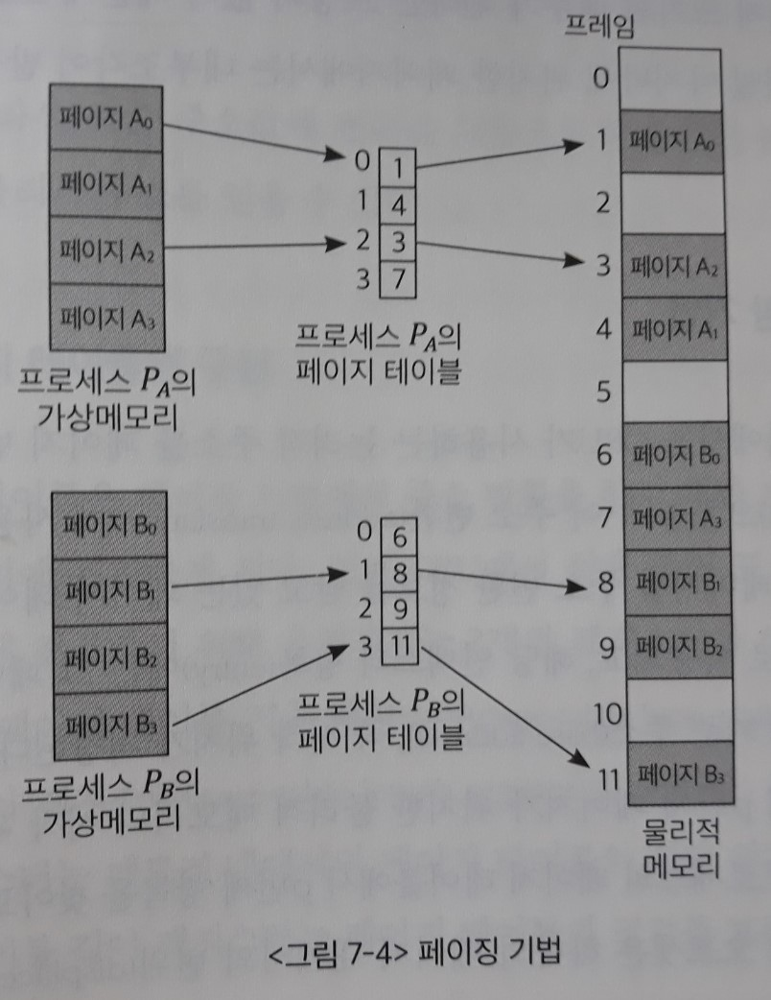

페이징 기법에서는 **주소 변환 절차**가 `연속할당 방식`에 비해 복잡하다.

- 하나의 프로세스라 하더라도 **페이지 단위로 물리적 메모리에 올리는 위치가 상이하므로**, 논리적 주소를 물리적 주소로 변환하는 작업이 **페이지 단위**로 이루어져야 하기 때문이다.

- 즉 특정 프로세스의 <u>몇 번째 페이지</u>가 물리적 메모리의 <u>몇 번째 프레임</u>에 들어 있다는 **페이지별 주소 변환 정보**를 유지하고 있어야 한다.

  - 페이지 테이블(page table)

    : 페이징 기법에서는 **모든 프로세스**가 각각의 **주소 변환**을 위한 `페이지 테이블`을 가진다.

    이 테이블은 프로세스가 가질 수 있는 페이지의 개수만큼 주소 변환 엔트리(항목, 원소)를 가지고 있게 된다.
    
    > 배열 자료구조를 실제로 사용하는 경우에는 `테이블`이라는 이름으로 많이 불린다.
    >
    > => 테이블(배열)에서는 순차탐색을 할 필요 없이 index를 이용하여 곧바로 접근할 수 있다.

### 1) 주소 변환 기법

페이징 기법에서는 CPU가 사용하는 논리적 주소(가상 주소)를 **페이지 번호(p)**와 **페이지 오프셋(d)**으로 나누어 `주소 변환(address translation)`에 사용한다.

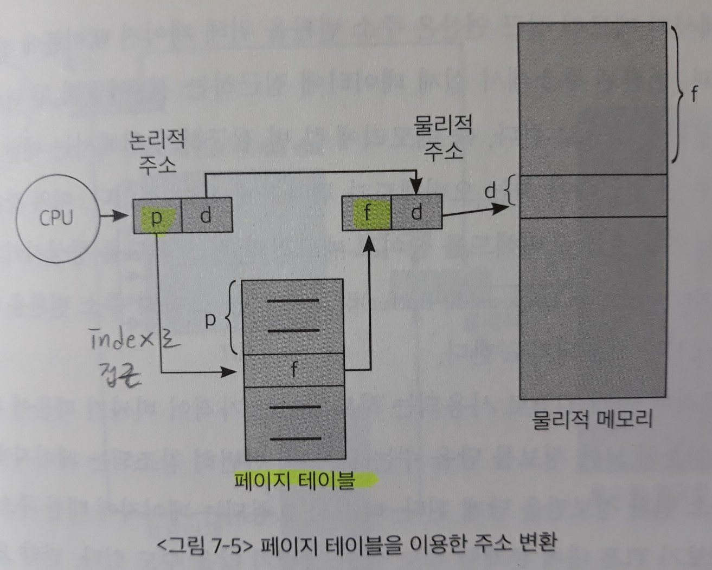

- 페이지 번호

  : 페이지 테이블 접근 시 **인덱스(index)**로 사용된다.

  해당 인덱스의 항목(entry)에는 **그 페이지의 물리적 메모리상의 기준 주소(base address), 즉 시작 위치**가 저장된다.

  => 따라서 특정 프로세스의 <u>p번째 페이지</u>가 위치한 물리적 메모리의 시작 위치를 알고 싶다면, 해당 프로세스의 `페이지 테이블`에서 <u>p번째 항목</u>을 찾아보면 된다.

- 페이지 오프셋

  : 하나의 **페이지 내에서의 변위(displacement)**를 알려준다.

  => 따라서 `기준 주소값`에 `변위`를 더함으로써 요청된 논리적 주소에 대응하는 물리적 주소를 얻을 수 있다.

### 2) 페이지 테이블의 구현

페이지 테이블은 페이징 기법에서 `주소 변환`을 하기 위한 **자료구조**로, CPU가 항상 참조해야 하므로 **물리적 메모리에 위치**하게 된다. (레지스터나 캐시에 들어가기에는 용량이 너무 큼)

<u>현재 CPU에서 실행 중인 프로세스</u>의 페이지 테이블에 접근하기 위해 `운영체제`는 2개의 레지스터를 사용한다.

(`연속할당 방식`에서 **주소 변환 시 사용했던 두 레지스터**가 `페이징 기법`에서도 같은 용도로 필요하다)

- 페이지 테이블 기준 레지스터(page-table base register)

  : <u>현재 CPU에서 실행 중인 프로세스</u>의 `페이지 테이블`의 메모리 내에서 **시작 위치**를 가리킴

- 페이지 테이블 길이 레지스터(page-table length register)

  : <u>현재 CPU에서 실행 중인 프로세스</u>의 `페이지 테이블`의 **크기**를 가리킴

페이징 기법에서의 **메모리 접근 연산**은, 메모리에 한 번 접근하기 위해 **매번 메모리에 두 번 접근해야 하는 오버헤드**가 뒤따른다.

1. 주소 변환을 위해 `페이지 테이블`에 접근하는 것
2. 변환된 주소에서 실제 데이터에 접근하는 것

**[TLB]**

이와 같은 `페이지 테이블` 접근 오버헤드를 줄이고, 메모리의 접근 속도를  향상시키기 위해 `TLB(Translation Look-aside Buffer)`라고 불리는 **고속의 주소 변환용 하드웨어 `캐시`**가 사용되기도 한다.

> 캐시 메모리는 운영체제에서 transparent한 계층이라서 거의 다루지 않는다.

- TLB로 사용되는 하드웨어는 가격이 비싸기 때문에 **빈번히 참조되는 페이지**에 대한 주소 변환 정보만을 담는다.

  따라서 요청되는 페이지에 대한 주소 변환 정보가 TLB 내에 존재할 수도 있고, 그렇지 않을 수도 있다.

  - 요청된 `페이지 번호`가 TLB에 존재하는 경우

    : 곧바로 대응하는 물리적 메모리의 프레임 번호를 얻을 수 있다.

  - 요청된 `페이지 번호`가 TLB에 존재하지 않는 경우

    : 메인 메모리에 있는 **페이지 테이블**로부터 프레임 번호를 알아내야 한다.

- **주소 변환 정보는 프로세스별로 다 다르기 때문에, `문맥교환` 시 이전 프로세스의 주소 변환 정보를 담고 있던 TLB 내용은 모두 지워버려야 한다.**

페이지 테이블과 TLB에 저장되어 있는 정보는 그 구조가 조금 다르다.

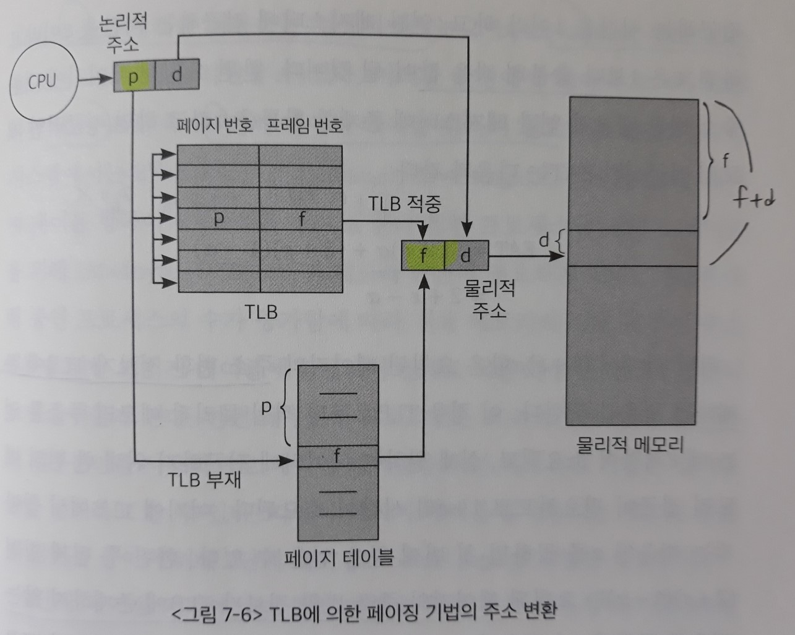

- 페이지 테이블

  : 하나의 프로세스를 구성하는 모든 페이지에 대한 정보가 페이지 번호에 따라 **순차적**으로 들어있기 때문에, **페이지 번호가 index로 주어지면 곧바로 접근**해 대응되는 프레임 번호를 얻을 수 있다.

  => 배열 자료구조

- TLB

  : 프로세스의 모든 페이지에 대한 주소 변환 정보를 가지고 있지 않기 때문에, **페이지 번호와 이에 대응하는 프레임 번호가 쌍으로 저장**되어야 한다.

  또한 해당 페이지에 대한 주소 변환 정보가 TLB에 있는지 확인하기 위해 **TLB의 모든 항목(entry)를 다 찾아봐야 하는 오버헤드**가 발생한다.

  => 해시 자료구조가 아님

  [TLB의 구현]

  이러한 오버헤드를 줄이기 위해 일반적으로 **병렬탐색(parallel search)**이 가능한 `연관 레지스터(associative register)`를 사용한다.

  - 병렬탐색 기능이란 TLB 내의 모든 항목을 동시에 탐색할 수 있는 기능을 말한다.
  - <u>한 번의 TLB 접근시간</u>에 TLB 내의 모든 항목을 한꺼번에 조사함으로써 **주소 변환 정보가 TLB에 있는지 곧바로 확인**할 수 있게 된다.

연관 레지스터를 사용할 때, 즉 TLB가 사용되는 시스템에서의 `평균 메모리 접근시간(EAT: Effective Access Time)`은 다음과 같다.

- 메모리에 접근하는 시간 = 1

- 연관 레지스터에 접근하는 시간 = ε (∵ ε은 1보다 충분히 작은 값)

- 요청된 페이지에 대한 주소 변환 정보가 연관 레지스터에 존재할 확률 = α (∵ α는 1에 매우 가까운 값)

  EAT = (1 + ε)\*α + (2 + ε)\*(1 - α)

  ​		= 2 + ε - α

  - 첫 항은 요청된 페이지의 주소 변환 정보가 TLB에 존재하는 경우
  - 두 번째 항은 요청된 페이지의 주소 변환 정보가 TLB에 존재하지 않는 경우

### 3) 계층적 페이징

> `페이지 테이블` 사용으로 인한 메모리 공간의 비효율적인 사용과, 이를 완화시켜 페이지 테이블을 공간 효율적으로 관리하는 `계측적 페이징 기법`에 대해 살펴본다.

현대의 컴퓨터는 **주소 공간이 매우 큰 프로그램**을 지원한다.

- 예를 들어, `32비트 주소 체계`를 사용하는 컴퓨터에서는 최대 2^32byte(= 4GB)의 주소 공간을 갖는 프로그램을 지원할 수 있다.

  이러한 환경에서 **페이지 크기가 4KB**라면 4GB/4KB = 1M 개의 페이지가 발생하므로, 똑같이 1M 개의 페이지 테이블 항목이 필요하게 된다.

  `32비트 시스템`의 물리적 메모리 주소 범위는 0 ~ (2^32 - 1), 즉 4byte로 표현할 수 있으므로 각 페이지 테이블 항목은 4byte씩을 필요로 한다.

  => 한 프로세스당 페이지 테이블을 위해 최대 1M * 4byte = 4MB 크기의 메모리 공간이 필요하게 된다.

- 그러나 대부분의 프로그램은 4GB의 주소 공간 중 지극히 **일부분만을 사용(프로세스 주소 공간의 윗부분은 `코드`와 `데이터` 영역이 존재하고, 밑부분은 `스택`이 존재하는데 중간부분에 사용되지 않는 공간이 상당하다)**하므로, 페이지 테이블을 위한 메모리의 사용은 심각한 공간 낭비라고 할 수 있다.

따라서 `페이지 테이블`에 사용되는 메모리 공간의 낭비를 줄이기 위해 `2단계 페이징(two-level paging) 기법`을 사용한다. 

- 주소 변환을 위해 **외부 페이지 테이블(out page table)**과 **내부 페이지 테이블(inner page table)**의 두 단계에 걸친 페이지 테이블을 사용한다.
- **사용되지 않는 주소 공간**에 대해서는 `외부 페이지 테이블`의 항목을 NULL로 설정하며, 여기에 대응하는 `내부 페이지 테이블`을 생성하지 않는다.
- 장점
  - 메모리 공간을 줄여 **공간적인 이득**을 볼 수 있음
- 단점
  - 주소 변환을 위해 접근해야 하는 페이지 테이블의 수가 증가하므로 **시간적인 손해**가 발생함

**[2단계 페이징 기법에서의 주소 변환]**

2단계 페이징 기법에서는 `프로세스의 논리적 주소`를 **두 종류의 페이지 번호(P1, P2)**와 **페이지 오프셋(d)**으로 구분한다.

- 첫 번째 페이지 번호(P1) - 외부 페이지 테이블의 index
- 두 번째 페이지 번호(P2) - 내부 페이지 테이블의 index

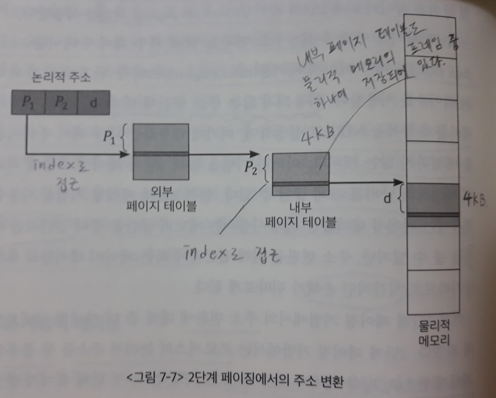

> **외부 페이지 테이블**은 프레임으로 매핑할 수가 없으므로(매핑하려면  매핑 테이블이 필요한데, 맨 처음에 접근하는 매핑 테이블 자체는 `주소 변환`을 할 수 없기 때문) 페이지 단위로 불연속적으로 할당될 수 없다.
>
> => 따라서 **외부 페이지 테이블**은 연속적으로 할당되며 page-table base register와 page-table length register를 이용하여 접근한다. 

1. 먼저 `외부 페이지 테이블`로부터 P1만큼 떨어진 위치에서 `내부 페이지 테이블`의 물리적 메모리 주소를 얻는다.
2. `내부 페이지 테이블`로부터 P2만큼 떨어진 위치에서 요청된 페이지가 존재하는 프레임의 위치를 얻는다.
3. 해당 프레임으로부터 d만큼 떨어진 곳에서 원하는 정보에 접근한다.

`32비트의 논리적 주소` 중 **페이지 번호**와 **페이지 오프셋**을 위해 각각 몇 비트씩을 할당해야 하는지 생각해보자.

- 페이지 크기 = 4KB
- 페이지 테이블 항목의 크기 = 4byte

1. 페이지의 크기가 4KB(= 2^12 byte)이므로 하나의 페이지 내에서의 `바이트 오프셋`을 결정하기 위해 12비트가 필요하다.

   따라서 총 32비트 중에서 **최하위 12비트**가 오프셋 d로 사용된다.

2. > 2단계 페이징 기법에서는 `내부 페이지 테이블` 자체를 **하나의 프레임에 보관**한다.
   >
   > 즉 4KB 페이지를 사용하는 이 예제의 경우, 내부 페이지 테이블의 크기 역시 4KB가 된다.
>
   > => 개념적으로는 `단일 페이지 테이블`을 페이지 단위로 나누어 페이징 기법을 적용한 것이다.
>
   > - 실제로 내부 페이지 테이블들은 프레임에 불연속적으로 할당된다.
> - Σ `내부 페이지 테이블` 크기 = `단일 페이지 테이블` 크기

`32비트 주소 시스템`에서는 페이지 테이블 항목의 크기가 4byte이므로, 내부 페이지 테이블은 4KB/4byte, 즉 1K(= 2^10)개의 항목을 가지게 된다.

   이들 2^10개의 항목을 구분하기 위해서는 10비트가 필요하다.

   따라서 `내부 페이지 테이블`의 index로 사용되는 P2에 **10비트**가 할당되어야 한다.

3. `외부 페이지 테이블`의 index인 P1에는 총 32비트 중 P2와 d에 사용되는 10비트와 12비트를 제외한 **10비트**가 할당된다.

> 프로세스의 주소 공간이 커질수록 `페이지 테이블`의 크기도 커지므로 2단계를 넘어서는 **다단계 페이지 테이블**이 필요하게 된다.
>
> - 장점
>   - `페이지 테이블`을 위해 사용되는 **메모리 공간의 소모를 줄일 수 있다**.
> - 단점
>   - 그만큼 메모리에 대한 접근 횟수가 많아지기 때문에 **메모리 접근시간이 크게 늘어난다**.

이러한 메모리 접근에 의한 시간적인 오버헤드를 줄이기 위해 `TLB`를 사용하는 것이 효과적이다.

`TLB`를 함께 사용하면 `다단계 페이지 테이블`로 인한 공간적인 이득과 동시에, 메모리 접근시간도 그다지 늘어나지 않는 시간적인 효율성 또한 얻을 수 있다.

- ex) 4단계 페이지 테이블과 TLB를 사용하는 경우의 EAT(평균적인 메모리 접근시간)

  - 메모리 접근시간 = 100ns

  - TLB 접근시간 = 20ns

  - 요청된 페이지에 대한 주소 변환 정보가 TLB에 존재할 확률 = 98%

    ​	EAT = 0.98 * 120 + 0.02 * 520 = <u>128(ns)</u>
    
    결과적으로 **주소변환**을 위해 28ns만 소요한다.

- TLB를 사용하지 않는 경우는, **주소 변환**을 위해 네 번의 메모리 접근이 필요하고, **실제 데이터를 접근**하기 위해 한 번의 메모리 접근이 필요하다.

  따라서 100ns가 소요되는 메모리 접근 연산을 한 번 수행하기 위해 총 다섯 번의 메모리 접근이 필요하게 되어 <u>500ns</u>가 소모된다.

### 4) 역페이지 테이블

`페이지 테이블`로 인한 메모리 공간의 낭비가 심한 이유는 모든 프로세스의 모든 페이지에 대해 페이지 테이블 항목을 전부 구성해야 하기 때문이다.

=> **역페이지 테이블 기법**은 이 문제를 해결하기 위한 대안으로 사용된다.

- 역페이지 테이블(inverted page table) 기법

  : 물리적 메모리의 페이지 프레임 하나당 `페이지 테이블`에 하나씩의 항목을 두는 방식이다.

  논리적 주소에 대해 페이지 테이블을 만드는 것이 아니라, **물리적 주소에 대해 `페이지 테이블`을 만드는 것**이다.

  > 즉 각 프로세스마다 페이지 테이블을 두지 않고, **시스템 전체(system-wide)에 페이지 테이블을 하나만 두는 방법**을 말한다.

  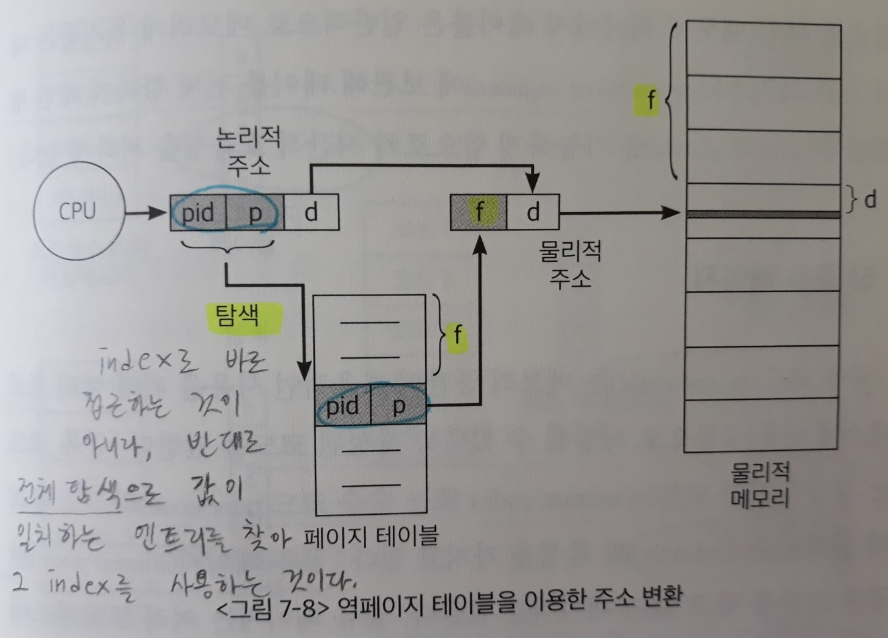

  - 페이지 테이블의 각 `항목`은 어느 프로세스의 어느 페이지가 <u>이 프레임(프레임 번호 f는 페이지 테이블의 index와 같음)</u>에 저장되어있다는 정보를 보관하고 있다.
  - 항목 = 프로세스 번호(pid) + 그 프로세스 내의 논리적 페이지 번호(p)

`주소 변환` 작업이 논리적 주소로부터 물리적 주소를 얻어내는 것임에 비해, `역페이지 테이블`은 반대로 물리적 주소로부터 논리적 주소를 얻기 수월한 구조로 되어 있다. (프레임 번호 f를 이용하면 페이지 테이블의 index로 바로 논리적 주소에 접근할 수 있기 때문)

- CPU는 프로세스마다 독립적으로 갖는 **논리적 주소에 근거해 기계어 명령을 실행**한다.

  따라서 CPU의 `주소 변환 요청`은 '입력=논리적 주소, 출력=물리적 주소'가 된다.

=> 따라서 `역페이지 테이블`에서의 **주소 변환은 다소 비효율적**인 측면이 있다.

역페이지 테이블에 주소 변환 요청이 들어오면, 그 주소를 담은 페이지가 물리적 메모리에 존재하는지 여부를 판단하기 위해 **페이지 테이블 전체를 다 탐색해야 한다**.

- 즉 index를 사용하여 바로 접근할 수 있다는 `테이블(배열) 자료구조`의 장점을 이용하지 못한다.

> 따라서 `역페이지 테이블`은 일반적으로 메모리에 유지하는 대신, **연관 레지스터(associative register)**에 보관해 테이블 전체 항목에 대한 **병렬탐색(parallel search)**를 가능하게 하여 시간적 효율성을 얻는다.
>
> - 연관 레지스터는 **TLB**의 구현에도 사용되는 고속 하드웨어 캐시이다.
> - `32비트 주소 시스템`에서 물리적 메모리의 크기인 4GB(= 2^32byte)에 대한 `역페이지 테이블`의 크기는 4MB이다. (페이지 크기 = 4KB 가정)

### 5) 공유 페이지

- 공유 코드(shared code)

  : 여러 프로세스에 의해 공통으로 사용될 수 있도록 작성된 코드

  - `재진입 가능 코드(re-entrant code)` 또는 `순수 코드(pure code)`라고도 불린다.
  - **읽기전용(read-only)**의 특성을 가짐

- 공유 페이지(shared page)

  : 공유 코드를 담고 있는 페이지

  > 공유 페이지는 여러 프로세스에 의해 공유되는 페이지이므로 **물리적 메모리에 하나만 적재되어** 메모리를 좀 더 효율적으로 사용할 수 있게 한다.
  >
  > - 프로그래머는 `편집기(editor)`처럼 해당 프로그램을 여러 개 수행시킬 수 있는 프로그램을 공유 페이지를 사용해서 작성할 수 있다.

  - 제약점

    - **읽기 전용**의 성질을 가져야 함

    - 모든 프로세스의 논리적 주소 공간에서 동일한 위치에 존재해야 함

      즉 공유 페이지는 그 페이지를 공유하는 모든 프로세스의 주소 공간에서 **동일한 페이지 번호**를 가져야 한다.
      
      - `컴파일`된 코드에도 **논리적 주소**가 남아있기 때문에 모든 프로세스가 똑같은 코드를 공유하려면, 프로세스마다 페이지 위치가 바뀌면 안된다.
      
      > 프로세스 간의 협력 메커니즘을 위해 운영체제가 제공하는 `IPC 메커니즘` 중에서 `공유메모리(shared memory) 방식`이 있었다.
      >
      > - 어떤 **페이지 프레임**을 여러 프로세스의 주소 공간에 동일하게 매핑하다는 점은 `공유 페이지`와 같지만,
      >
      > - `공유메모리`는 프로세스 간의 통신을 목적으로 **read-write** 가능하다는 점에서 다르다.

- 사유 페이지(private page)

  : 프로세스별로 독자적으로 사용하는 페이지

  사유 페이지는 해당 프로세스의 논리적 주소 공간 중 어떠한 위치에 있어도 무방하다.

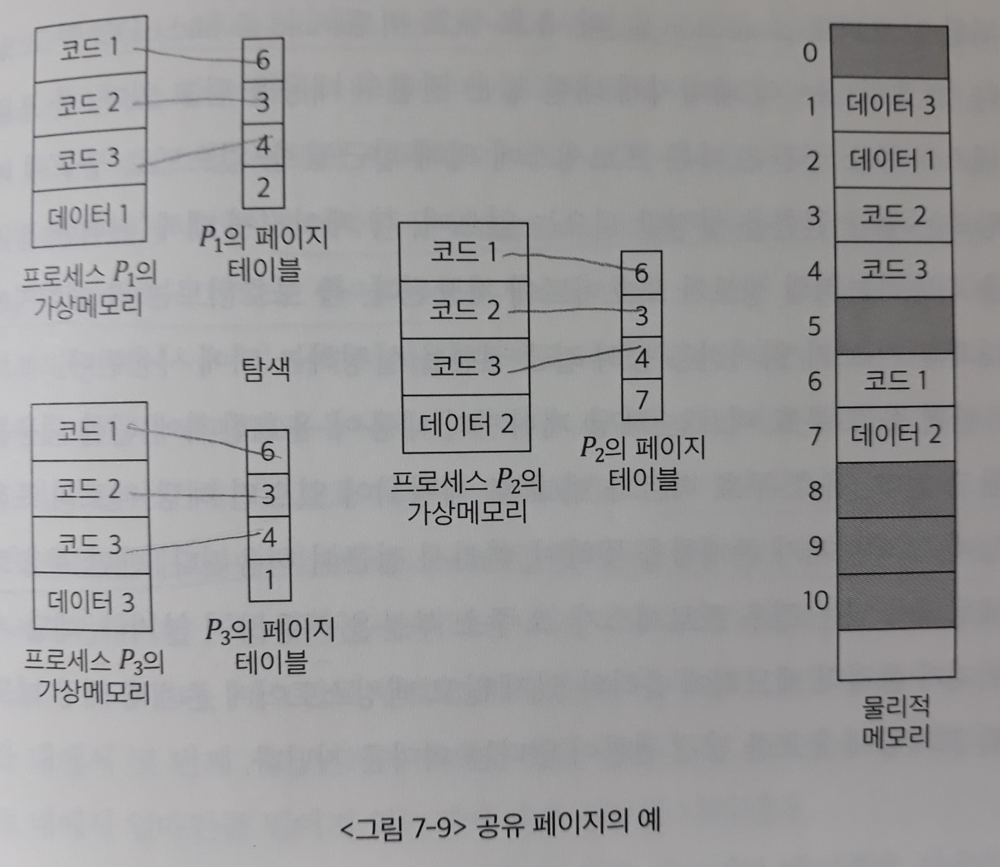

- 코드1, 코드2, 코드3은 `공유 페이지`이므로 세 프로세스의 주소 공간 내에서 동일한 위치에 존재해야 하며, 물리적 메모리에는 하나씩의 코드만이 올라가게 된다.

- 사유 페이지인 데이터1, 데이터2, 데이터3은 각 프로세스의 주소 공간 내의 어느 위치에 존재해도 상관없으며, 프로세스마다 독립적으로 사용하게 된다.

### 6) 메모리 보호

페이지 테이블의 각 `항목`에는 주소 변환 정보뿐 아니라, 메모리 보호를 위한 **보호비트(protection bit)**와 **유효-무효 비트(valid-invalid bit)**를 두고 있다.

- 보호비트

  : **각 페이지에 대한 접근 권한**의 내용을 담고 있다.

  - 한 프로세스의 주소 공간은 다른 프로세스에 의해 접근될 수 없으므로 '누구'에 해당하는 접근 권한은 설정할 필요 없다.
  - 각 페이지에 대해 **읽기-쓰기/읽기전용** 등의 '어떠한' 접근을 허용하는지 설정하는 데에 사용된다.
    - ex) `코드` 영역 - 읽기전용, `데이터`와 `스택` 영역 - 읽기와 쓰기 권한

- 유효-무효 비트

  : **해당 페이지의 내용이 유효한지**에 대한 내용을 담고 있다.

  - 유효-무효 비트가 '`유효`'로 세팅되어 있으면 해당 메모리 프레임에 그 페이지가 존재함을 뜻한다.

    => 따라서 접근이 허용된다.

  - '`무효`'로 세팅되어 있는 경우

    - 프로세스가 그 주소 부분을 사용하지 않거나
    - 해당 페이지가 물리적 메모리에 올라와 있지 않고 `백킹스토어`에 존재함을 뜻한다.

    => 따라서 해당 메모리 프레임에 유효한 접근 권한이 없다.

## 5. 세그먼테이션

- 세그먼테이션(segmentation)

  : `프로세스의 주소 공간`을 **기능 단위 또는 의미 단위의 `세그먼트(segment)`**로 나누어 물리적 메모리에 올리는 기법

  - 세그먼트의 예
    - 프로세스의 주소 공간 전체
    - 일반적으로는 코드(code), 데이터(data), 스택(stack) 등의 기능 단위로 정의
    - 프로그램을 구성하는 함수 하나하나를 각각 세그먼트로 정의

  > 세그먼트가 특정 크기 단위로 나눈 것이 아니라 논리적 단위(logical unit)로 나눈 것이기 때문에 **크기가 균일하지 않다**.
  >
  > => 따라서 크기가 균일하지 않은 세그먼트들을 메모리에 적재하는 **부가적인 관리 오버헤드**가 발생한다.

**[세그먼테이션 기법에서의 주소 변환]**

세그먼테이션 기법에서는 `논리적 주소`가 <세그먼트 번호, 오프셋>으로 나뉘어 사용된다.

- 세그먼트 번호

  : 해당 논리적 주소가 **프로세스 주소 공간 내에서 몇 번째 세그먼트에 속하는지**를 나타냄

- 오프셋

  : 해당 논리적 주소가 **그 세그먼트 내에서 얼마만큼 떨어져 있는지**에 대한 정보를 나타냄

세그먼테이션 기법에서는 `주소 변환`을 위해 **세그먼트 테이블**을 사용한다.

세그먼트 테이블의 각 `항목`은 **기준점(base)**과 **한계점(limit)**을 가지고 있다. 

- 기준점

  : 물리적 메모리에서 그 세그먼트의 시작 위치를 나타냄

- 한계점

  : 그 세그먼트의 길이를 나타냄

> `페이징 기법`에서는 모든 페이지의 길이가 동일하므로, 페이지 테이블의 `항목`에 **기준점이라 할 수 있는 페이지 프레임 위치**만 유지하고 있으면 된다.
>
> 하지만 `세그먼테이션 기법`에서는 세그먼트의 길이가 균일하지 않으므로 **세그먼트의 위치 정보뿐 아니라 길이 정보를 함께 보관**하고 있는 것이다.

`연속할당 방식`, `페이징 기법`에서 **주소 변환 시 사용했던 두 레지스터**가 `세그먼테이션 기법`에서도 같은 용도로 필요하다.

- 세그먼트 테이블 기준 레지스터(Segment-Table Base Register: STBR)

  : <u>현재 CPU에서 실행 중인 프로세스</u>의 `세그먼트 테이블`의 메모리 내에서 **시작 위치**를 가리킴

- 세그먼트 테이블 길이 레지스터(Segment-Table Length Register: STLR)

  : <u>현재 CPU에서 실행 중인 프로세스</u>의 **세그먼트 개수**를 나타냄

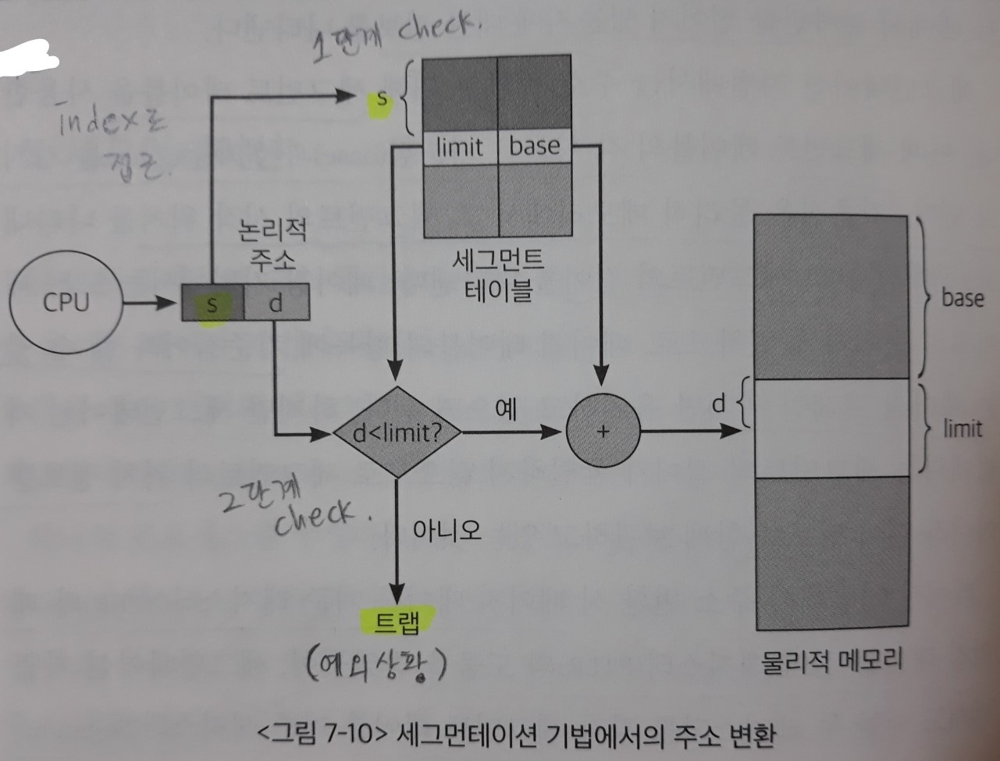

`세그먼테이션 기법`에서는 논리적 주소를 물리적 주소로 변환하기 전에 두 가지 사항을 먼저 확인한다.

1. 요청된 세그먼트 번호가 STLR에 저장된 값보다 작은 값인지 확인한다.

   - 만약 그렇지 않다면, 존재하지 않는 세그먼트에 대한 접근 시도이므로 `예외상황(트랩)`을 발생시킨다.

   - `페이징 기법`에서는 **`프로세스 주소 공간`이 가질 수 있는 최대 영역만큼 `항목(entry)`이 만들어지므로**, 페이지 테이블의 `항목`의 개수는 미리 정해져있다.

     `세그먼트 기법`에서는 **세그먼트 테이블의 `항목`의 개수가 세그먼트의 개수로 정해지므로 이 과정이 필요**하다.

2. 논리적 주소의 오프셋값이 그 세그먼트의 길이보다 작은값인지 확인한다.

   이는 `세그먼트 테이블`의 해당 `항목`에 있는 한계점(limit)과, 요청된 논리적 주소의 오프셋값(d)을 비교해 확인하게 된다.

   - 만약 오프셋값이 세그먼트 길이를 넘어선다면 `예외상황(트랩)`을 발생시킨다.
   - `페이징 기법`과 달리 **세그먼트의 크기가 균일하지 않기 때문에 필요한 과정**이다.

**[세그먼테이션 기법에서의 메모리 보호]**

`페이징 기법`과 마찬가지로 `세그먼트 테이블`의 각 `항목`에 보호비트와 유효비트를 둔다.

- 보호비트

  : 각 세그먼트에 대해 읽기/쓰기/실행 권한이 있는지를 나타냄

- 유효비트

  : 각 세그먼트의 주소 변환 정보가 유효한지, 즉 해당 세그먼트가 현재 물리적 메모리에 적재되어 있는지를 나타냄

**[세그먼테이션 기법에서의 공유 페이지]**

`세그먼테이션 기법`에서도 여러 프로세스가 특정 세그먼트를 공유해 사용하는 **공유 세그먼트(shared segment)** 개념을 지원한다.

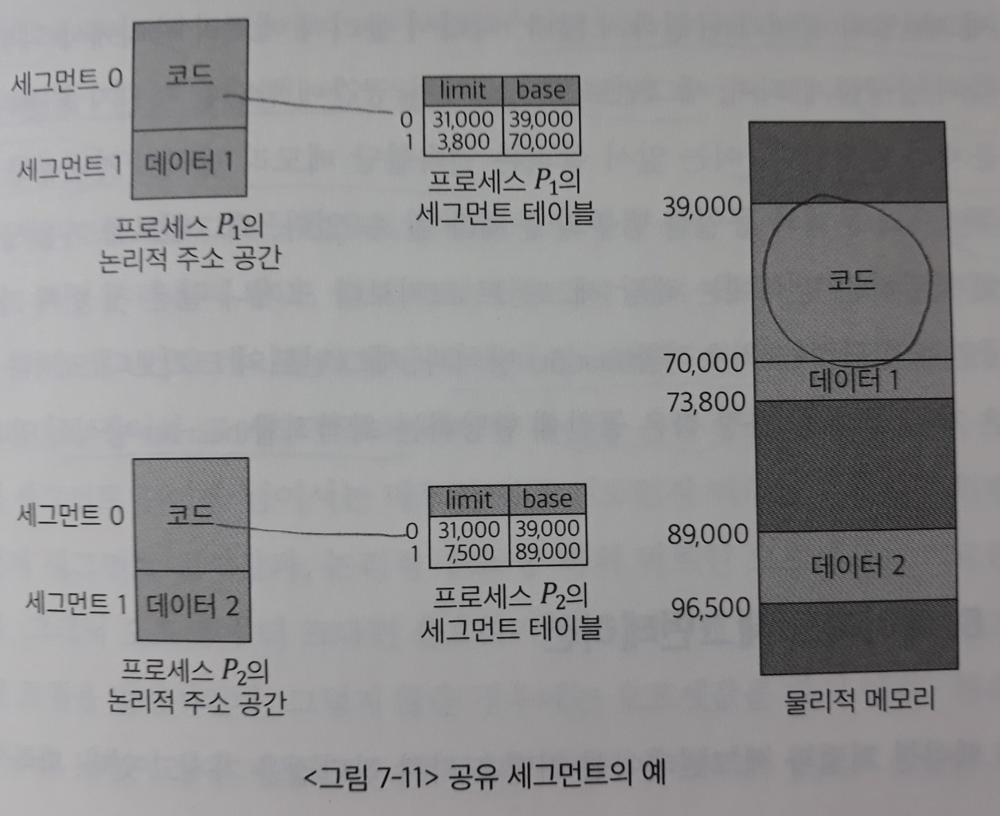

공유 세그먼트는 이 세그먼트를 공유하는 모든 프로세스의 주소 공간에서 **동일한 논리적 주소에 위치**해야 한다.

- 세그먼테이션 기법의 장점

  - **공유**나 **보안**처럼 의미 있는 단위에 대해 수행하는 업무에서는 `페이징 기법`에 비해 훨씬 효과적이다.
    - 주소 공간의 일부를 공유하거나 특정 주소 공간에 접근 권한 제어(읽기 전용 등)를 하고자 할 경우, 이는 어떤 **의미 단위**로 수행되기 때문이다.
    - `페이징 기법`에서는 동일한 크기로 주소 공간을 나누기 때문에, 공유 코드와 사유 데이터 영역이 동일 페이지에 공존하는 경우가 발생할 수 있다.
    
  - 세그먼트의 개수가 페이지의 개수에 비해 매우 작기 때문에, `세그먼트 테이블`의 크기가 작다. 

    따라서 **테이블에 의한 메모리 낭비가 적다**.

- 단점

  - 동적 메모리 할당 문제(dynamic storage-allocation problem)

    : 물리적 메모리를 '프레임' 단위로 **미리 분할해두는** `페이징 기법`과 달리, 세그먼테이션 기법은 `가변분할 방식(연속할당)`에서처럼 메모리에 적재되는 **세그먼트의 크기에 따라 분할의 크기, 개수가 동적으로 변하기 때문에** `동적 메모리 할당 문제`가 발생한다.

    - 분할의 크기를 프로그램의 크기보다 일부러 크게 할당하지는 않기 때문에 `내부조각`은 발생하지 않는다.

    - 하지만 이미 메모리에 존재하는 세그먼트가 종료될 경우 중간에 빈 공간이 발생하게 되며, 이 공간이 새롭게 시작되는 세그먼트의 크기보다 작을 경우 `외부 조각`이 발생할 가능성이 있다.
  
    - 세그먼트를 가용 공간에 할당하는 방식
  
      - 최초적합(first fit) 방식 
  
        : 세그먼트의 크기보다 크거나 같은 첫 번째 가용 공간에 할당
  
      - 최적적합(best fit) 방식
  
        : 세그먼트의 크기보다 크거나 같은 가용 공간 중 가장 작은 공간에 할당
  

## 6. 페이지드 세그먼테이션

> `페이징 기법`과 `세그먼테이션 기법`은 각각 장단점을 가지고 있다.
>
> 따라서 이들 두 기법의 장점만을 취하는 `주소 변환 기법`으로 **페이지드 세그먼테이션 기법**을 생각해볼 수 있다.

- 페이지드 세그먼테이션(paged segmentation)

  : 프로그램을 의미 단위의 **세그먼트**로 나눈다. 단 세그먼트가 **동일한 크기 페이지들의 집합으로 구성**되어야 한다.

  그리고 물리적 메모리에 적재하는 단위는 **페이지 단위**로 한다.

  - 하나의 세그먼트 크기를 페이지 크기의 배수가 되도록 함으로써 `세그먼테이션 기법`에서 발생하는 `외부조각 문제점`을 해결
  - 세그먼트 단위로 프로세스 간의 공유나 프로세스 내의 접근 권한 보호가 이루어지도록 함으로써 `페이징 기법의 약점`을 해소

**[페이지드 세그먼테이션 기법에서의 주소 변환]**

`주소 변환`을 위해 **외부의 세그먼트 테이블**과 **내부의 페이지 테이블**, 이렇게 두 단계의 테이블을 이용한다.

하나의 세그먼트가 여러 개의 페이지로 구성되므로, <u>각 세그먼트마다 페이지 테이블을 가진다</u>.

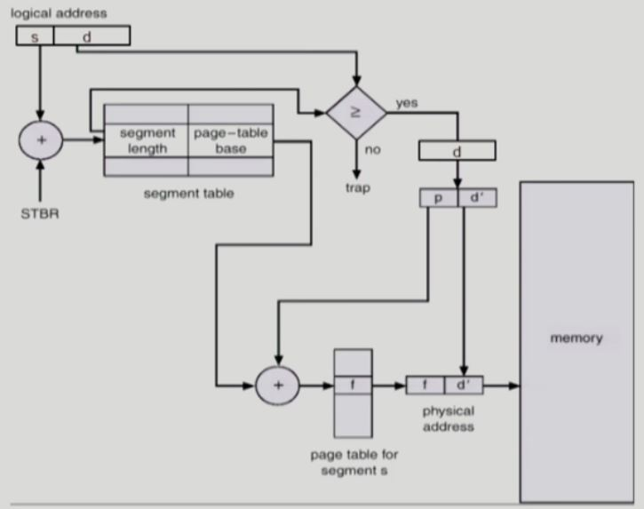

페이지드 세그먼테이션 기법에서는 `논리적 주소`가 <세그먼트 번호, 오프셋>으로 구성된다. (`세그먼테이션 기법`과 동일함)

1. `논리적 주소`의 상위 비트인 **세그먼트 번호**를 통해 `세그먼트 테이블`의 해당 `항목`에 접근한다.

   세그먼트 테이블 `항목`은 한계점(limit)과 기준점(base)을 저장하고 있다.

   - 한계점 - 세그먼트 길이
   - 기준점 - 그 세그먼트의 `페이지 테이블` 시작 주소

2. 이때 세그먼트 길이를 넘어서는 메모리 접근 시도인지 여부를 체크한다.

   => 세그먼트 길이(limit)와 **오프셋값**(`논리적 주소`의 하위 비트)을 비교한다.

   - 오프셋이 더 크면, 유효하지 않은 위치에 대한 접근 시도이므로 `트랩`을 발생시킨다.
   - 유효한 접근시도이면, `페이지 테이블`의 시작 주소(base)에 접근한다. 

3. **오프셋값**을 다시 상위, 하위 비트로 나누어 상위 비트는 **페이지 번호**로 사용하고 하위비트는 **페이지 내에서의 변위**로 사용한다.

   해당 세그먼트를 위한 `페이지 테이블`에서 **페이지 번호** index로 `항목`에 접근하면, 물리적 메모리의 페이지 프레임 위치를 얻는다.

   이 위치에서 **페이지 내의 변위**만큼 떨어진 곳이 변환된 `물리적 메모리 주소`이다.