# 8장. 가상메모리

> 프로그램이 실행되기 위해서는 실행에 당장 필요한 부분이 **메모리**에 올라가 있어야 한다.
>
> 여러 프로그램이 동시에 실행되는 `시분할 환경`에서는 한정된 메모리 공간을 여러 프로그램이 조금씩 나누어 사용해야 한다.
>
> 따라서 `운영체제`는 어떤 프로그램에 어느 정도의 메모리를 할당할 것인가를 결정해야 한다.
>
> - 운영체제는 모든 프로그램에게 공평하게 메모리를 할당하기보다는 **몇몇 프로그램에게 집중적으로 메모리를 할당**한 후, 시간이 흐르면 이들로부터 메모리를 회수하여 또 다른 프로그램에게 집중적으로 메모리를 할당하는 방식을 채택한다.
> - 이런 방식을 채택하는 이유는 프로세스의 빠른 수행을 위해 프로그램마다 최소한 확보해야 하는 메모리의 크기가 존재하기 때문이다.

메모리의 연장 공간으로 **디스크의 스왑 영역**이 사용될 수 있기 때문에 프로그램 입장에서는 `물리적 메모리 크기에 대한 제약`을 생각할 필요가 없어진다.

> 그러나 프로그램 입장에서 `가상 메모리 크기에 대한 제약`은 여전히 고려해야 한다.
>
> 예를 들어, 32bit 시스템에서 4GB 이상의 크기를 갖는 프로세스는 `32bit 가상주소 공간(가상 메모리)`에서 할당할 수 있는 가상주소의 범위를 넘어버리기 때문이다.
>
> - 만약 32bit 시스템에서 4GB 이상의 크기를 갖는 프로그램을 실행하고 싶다면 **Physical Address Extension(PAE)**이라는 기능이 지원되는 시스템에서 실행 가능하다.

나아가 `운영체제`는 프로그램이 물리적 메모리를 고려할 필요 없이 **자기 자신만이 메모리를 사용하는 것처럼 가정해 프로그램하는 것을 지원**한다.

=> 이렇게 되면 프로그램은 0번지부터 시작하는 자기 자신만의 메모리 주소 공간을 가정할 수 있는데, 이러한 메모리 공간을 `가상메모리(virtual memory)` 라고 부른다.

- 가상메모리 기법

  : **`프로세스의 주소 공간`을 메모리에 적재하는 단위에 따라** `요구 페이징(demand paging) 방식`과 `요구 세그먼테이션(demand segmentation) 방식`으로 구현될 수 있다.

  > 대부분의 경우에는 **요구 페이징 방식**을 사용하며, **요구 세그먼테이션 방식**을 사용하는 경우는 대개 **페이지드 세그먼테이션 기법**을 사용하는 경우이다.
  >
  > => 즉 세부적인 구현에서는 **요구 페이징** 기법만이 사용된다고 할 수 있다.

## 1. 요구 페이징

요구 페이징이란 프로그램 `실행` 시 프로세스를 구성하는 모든 페이지를 한꺼번에 `메모리`에 올리는 것이 아니라, **당장 사용될 페이지만을 올리는 방식**을 말한다.

따라서 요구 페이징 기법에서는 특정 페이지에 대해 `CPU의 요청`이 들어온 후에야 해당 페이지를 메모리에 적재한다.

나머지 페이지는 `디스크의 스왑 영역`에 존재한다.

- 장점
  - 메모리 사용량 감소
  - 프로세스 전체를 메모리에 올리는 데 소요되는 입출력 오버헤드 감소
  - 응답시간 단축 (전체 시스템system-wide 관점)
  - 시스템이 더 많은 프로세스를 수용할 수 있음
  - **물리적 메모리의 용량보다 큰 프로그램도 실행 가능**

- 유효-무효 비트(valid-invalid bit)

  : 요구 페이징에서는 `유효-무효 비트`를 두어 각 페이지가 메모리에 존재하는지 표시하게 된다.

  이 비트는 각 프로세스를 구성하는 모든 페이지에 대해 존재해야 하므로 페이지 테이블의 각 `항목`별로 저장된다.

  1. 프로세스가 `실행`되기 전 

     : 모든 페이지의 `유효-무효 비트`가 **무효값**으로 초기화 됨

  2. 특정 페이지가 참조되어 메모리에 적재되는 경우

     : 해당 페이지의 `유효-무효 비트`는 **유효값**으로 바뀜

  3. 메모리에 적재되어 있던 페이지가 디스크의 스왑 영역으로 쫓겨날 때

     : `유효-무효 비트`가 다시 **무효값**으로 바뀜

- `유효-무효 비트`의 값이 **무효**인 경우
  
  1. 페이지가 현재 메모리에 없는 경우
  
  2. 그 페이지가 속한 주소 영역을 프로세스가 사용하지 않는 경우
  
     - 페이지의 `항목(entry)`은 **프로세스 주소 공간의 크기**만큼 만들어지므로, 사용되지 않는 주소 공간도 포함한다. (`코드`, `데이터` 영역과 `스택` 영역 사이의 빈 공간)
     - ex) 밑의 그림에서 실제로 사용하는 주소 공간은 0 ~ 6번 까지이지만 페이지 테이블은 7번까지 지원해준다.
  

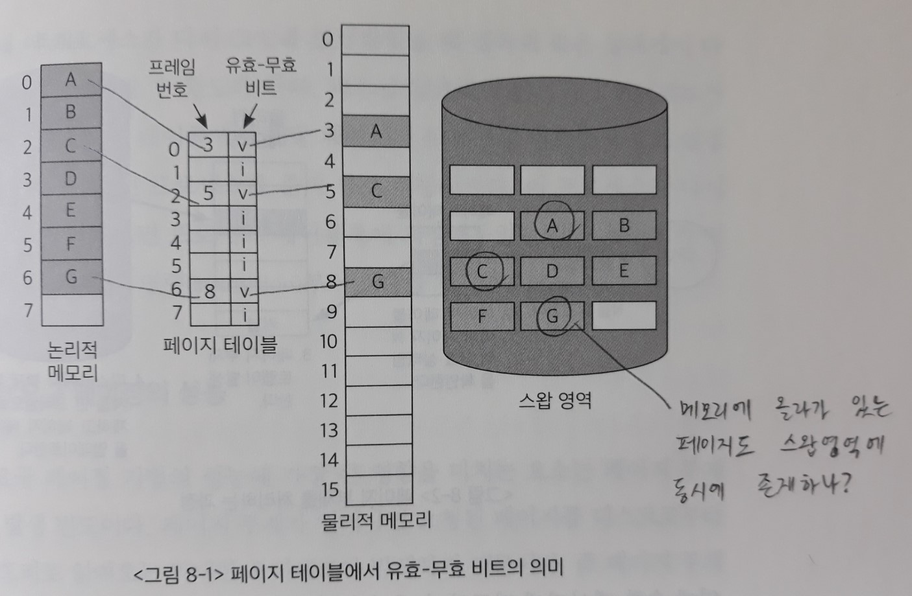

*백킹스토어(스왑 영역)에는 이미 모든 페이지가 저장되어 있다.*

> **CPU가 참조하려는 페이지가 현재 메모리에 올라와 있지 않아** `유효-무효 비트`가 **무효**로 세팅되어 있는 경우를 '**페이지 부재(page fault)**'가 일어났다고 말한다.

### 1) 요구 페이징의 페이지 부재 처리

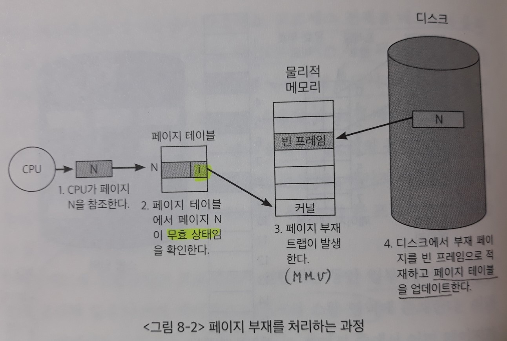

CPU가 무효 페이지에 접근하면 **주소 변환을 담당하는 하드웨어인 `MMU`**가 `페이지 부재 트랩(page fault trap)`을 발생시키게 된다.

- `트랩`은 SW 인터럽트이다.

그러면 CPU의 제어권이 `커널모드`로 전환되고, 운영체제의 `페이지 부재 처리루틴(page fault handler)`이 호출되어 다음과 같은 순서로 페이지 부재를 처리한다.

1. 운영체제는 해당 페이지에 대한 접근이 적법한지를 먼저 체크한다.

   - 사용되지 않는 주소 영역에 속한 페이지에 접근(bad address)

   - 해당 페이지에 대한 접근 권한 위반(protection violation)

     - ex) 읽기전용인 페이지에 대해 쓰기 접근 시도

     => 위 두 가지 경우에 대해서는 해당 프로세스를 `종료`시킨다.

2. 물리적 메모리에서 비어 있는 프레임(free frame)을 `할당`받아 그 공간에 해당 페이지를 읽어온다.

   - 만약 비어 있는 프레임이 없다면 기존에 메모리에 올라와 있는 페이지 중 하나를 디스크로 쫓아낸다. (`스왑 아웃`)

   > 요청된 페이지를 디스크로부터 메모리로 적재하기까지는 오랜 시간이 소요된다. (<u>디스크 입출력</u>)
   >
   > 따라서 **페이지 부재를 발생시킨 프로세스**는 CPU를 빼앗기고 `봉쇄` 상태가 된다.
   >
   > - CPU 레지스터 상태 및 프로그램 카운터값은 PCB에 저장한다.

3. <u>디스크 입출력</u>이 완료되어 `인터럽트`가 발생하면 페이지 테이블에서 해당 페이지의 `유효-무효 비트`를 **유효**로 설정하고, `봉쇄`되었던 프로세스를 `준비 큐`로 이동시킨다.

4. 프로세스가 다시 CPU를 할당받으면 PCB에 저장해두었던 값을 복원시켜 이전에 중단되었던 `명령(instruction)`부터 실행을 재개한다.

   - `페이지 부재 트랩`을 발생시켰던 페이지에 위치한 명령이다.

### 2) 요구 페이징의 성능

요구 페이징 기법의 성능에 가장 큰 영향을 미치는 요소는 **페이지 부재의 발생 빈도**이다.

`페이지 부재`가 일어나면 **요청된 페이지를 디스크로부터 메모리로 읽어오는 막대한 오버헤드**가 발생하기 때문이다. **=> 디스크 입출력**

> 즉 페이지 부재가 적게 발생할수록 요구 페이징의 성능은 향상될 수 있다.

요구 페이징의 성능은 요청한 페이지를 참조하는데 걸리는 `유효 접근시간`으로 측정한다.

- 유효 접근시간(effective access time)

  = (1-P) * <u>메모리 접근시간</u> 

  ​	\+ P * (페이지 부재 발생 처리 오버헤드 + [메모리에 빈 프레임이 없는 경우 `스왑 아웃` 오버헤드] + 요청된 페이지의 `스왑 인` 오버헤드 + 프로세스의 재시작 오버헤드)

  - 메모리 접근시간

    : 페이지 부재가 발생하지 않으면, TLB 접근시간과 메모리에 적재되어 있는 페이지 테이블과 실제 데이터에 접근하는 시간 등이 고려된다.

  - 페이지 부재 발생 처리 오버헤드

    : `페이지 부재 트랩`을 발생시키고 `커널모드`로 전환해 처리루틴 호출 - 해당 페이지에 대한 접근이 적법한지 확인

  - 스왑 아웃 ~ 스왑 인

    : 메모리에 올라와 있는 페이지 중 하나의 페이지를 선택해 디스크로 `스왑 아웃`시킨 후**(교체 알고리즘)**, 스왑 영역에서 요청된 페이지를 메모리로 읽어와야 한다.

    - 스왑 아웃된 페이지와 스왑 인 되는 페이지의 `페이지 테이블`에서의 `유효-무효 비트` 값도 갱신해줘야 한다.

  - 프로세스의 재시작 오버헤드

    : 페이지를 다 읽어왔으면 `인터럽트`를 통해 프로세스가 실행을 재개할 수 있는 상태로 바꿔주고, 자신의 차례가 되면 `문맥교환`을 통해 다시 CPU를 얻을 수 있게 한다.

- 페이지 부재 발생비율(page fault rate) P

  - P = 0: 페이지 부재가 한 번도 일어나지 않은 경우
  - P = 1: 모든 참조 요청에서 페이지 부재가 발생한 경우

  => 페이지 부재가 발생하면 **디스크 입출력**과 **각종 오버헤드**가 포함되어 시간이 오래 걸리므로 P가 0에 가까울 수록 `페이징 기법`의 성능이 향상된다.

## 2. 페이지 교체

- 페이지 교체(page replacement)

  : `페이지 부재`가 발생하여 요청된 페이지를 디스크에서 메모리로 읽어올 때, 물리적 메모리에 **빈 프레임이 존재하지 않을 수 있다**.

  이 경우에 `운영체제`가 **`스왑 아웃`으로 메모리에 빈 공간을 확보하는 작업**을 `페이지 교체`라고 한다.

- 교체 알고리즘(replacement algorithm)

  : 페이지를 교체할 때 어떠한 프레임에 있는 페이지를 쫓아낼 것인지 결정하는 알고리즘

  - `스왑 아웃` 되는 페이지를 `victim page`라고 부른다.
  
    - **백킹스토어에는 이미 모든 페이지가 저장**되어 있으므로, 페이지를 읽기만 하고 수정한 부분 없다면 그냥 메모리에서 지워버리면 된다.

    - 수정된 부분이 있다면 `스왑 아웃` 될 때 백킹스토어에 기록해야 한다.

  > 이 알고리즘의 `목표`는 **페이지 부재율을 최소화**하는 것이다.
>
  > => `가까운 미래`에 참조될 가능성이 가장 적은 페이지를 선택해서 내쫓는 것이 성능을 향상시킬 수 있는 방안이다.

  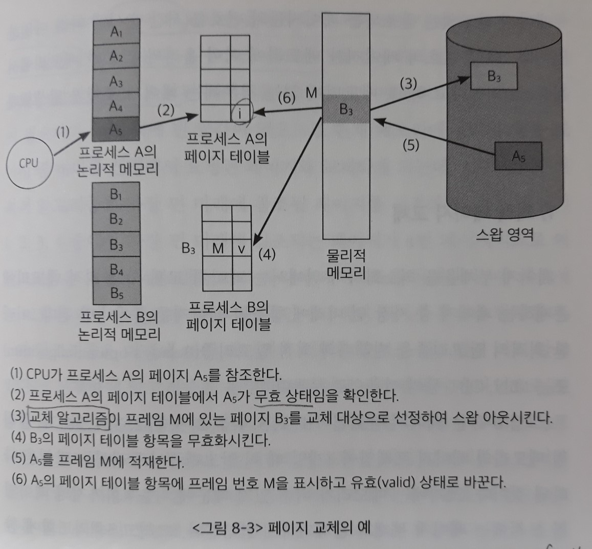

- 페이지 교체 알고리즘의 성능 평가
  
    : 주어진 페이지 참조열(page reference string)에 대해 `페이지 부재율`을 계산한다.
  
    - 페이지 참조열 - 참조되는 페이지들의 번호를 **시간 순서**에 따라 나열한 것
      - ex) 1, 2, 3, 4, 1, 2, 5, 1, 2, 3, 4, 5
    
    - 메모리에서 적중(hit) - 해당 번호의 페이지가 메모리에 이미 올라와 있음
    - 페이지 부재가 발생 - 해당 번호의 페이지가 메모리에 없음

### 1) 최적 페이지 교체

> 페이지 부재율을 최소화하기 위해서는 페이지 교체 시 물리적 메모리에 존재하는 페이지 중 **가장 먼 미래에 참조될 페이지**를 쫓아내면 된다.

이러한 최적의 알고리즘을 **빌레디의 최적 알고리즘(Belady's optimal algorithm)** 또는 **MIN**, **OPT** 등의 이름으로 부른다.

- 페이지 참조열: 1, 2, 3, 4, 1, 2, 5, 1, 2, 3, 4, 5
- 페이지 프레임 4개

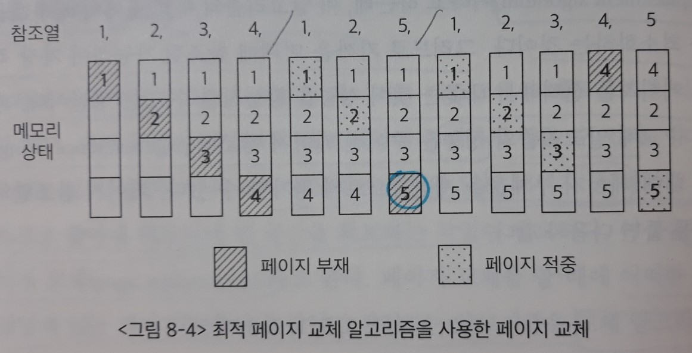

- 초기에는 메모리가 비어 있기 때문에 처음 4회까지의 페이지 참조 시에는 `페이지 부재`가 불가피하게 발생한다.

- 5회와 6회에 참조되는 페이지(1, 2)는 이미 메모리에 올라와 있는 페이지이기 때문에 `페이지 부재`를 발생시키지 않는다.

  (`페이지 적중`)

- 페이지 5를 참조하려 할 때에는 `페이지 부재`가 발생하는데, 메모리에 빈 공간이 없으므로 **교체 알고리즘**이 작동한다.

  - 페이지 1, 2, 3, 4 중에서 가장 먼 미래에 참조되는 페이지가 4번 페이지이므로 페이지 4를 내쫓고, 그 자리에 페이지 5를 적재한다.

  => 이 예에서는 12회의 페이지 참조가 일어나는 동안 총 6회의 페이지 부재가 발생한다.

이 알고리즘은 미래에 어떤 페이지가 어떠한 순서로 참조될지 미리 알고 있다는 전제하에 알고리즘을 운영하므로, 실제 시스템에서 온라인으로 사용할 수 있는 알고리즘은 아니다.

=> 이러한 알고리즘을 **오프라인 알고리즘**이라고 부른다.

> `빌레디의 오프라인 최적 알고리즘`은 어떠한 알고리즘을 사용하는 경우보다도 **가장 적은 페이지 부재율을 보장**하므로, 다른 알고리즘의 성능에 대한 상한선(upper bound)을 제공한다.
>
> - 어떤 시스템에서 새로운 교체 알고리즘의 성능이 `빌레디의 최적 알고리즘`과 유사하다면, 이는 더 이상 그 시스템을 위한 교체 알고리즘의 연구가 필요하지 않음을 뜻한다.

### 2) 선입선출 알고리즘

선입선출(First In First Out: FIFO) 알고리즘은 페이지 교체 시 물리적 메모리에 **가장 먼저 올라온 페이지**를 우선적으로 내쫓는다.

페이지의 향후 참조 가능성을 고려하지 않기 때문에 **비효율적**인 상황이 발생할 수 있다.

- FIFO의 이상 현상(FIFO anomaly)

  : `FIFO 알고리즘`에서 메모리를 증가시켰음에도 불구하고 페이지 부재가 오히려 늘어나는 상황

  즉 물리적 메모리의 공간이 늘어났음에도 오히려 성능이 더 나빠진 것이다.

  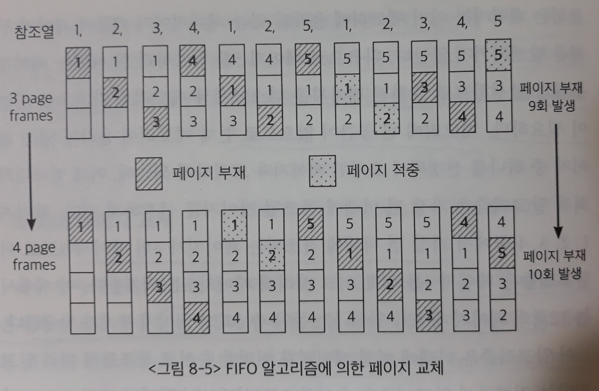

  - 페이지 프레임이 3개인 경우 9번의 `페이지 부재`가 발생했으나,
  - 페이지 프레임이 4개인 경우에 오히려 `페이지 부재`가 10번으로 증가했다.

### 3) LRU 알고리즘

> 페이지 교체 알고리즘의 성능 향상을 위해서는 **향후 사용될 가능성이 낮은 페이지**를 우선적으로 메모리에서 쫓아내는 것이 바람직하다.

- 시간지역성(temporal locality)

  : `메모리 페이지의 참조 성향` 중 한 가지 성질로, **최근**에 참조된 페이지가 **가까운 미래**에 다시 참조될 가능성이 높다. 

- LRU(Least Recently Used) 알고리즘

  : `시간지역성` 성질을 활용해서 페이지 교체 시 **가장 오래전에 참조가 이루어진 페이지**를 쫓아낸다.

  즉 **마지막 참조 시점이 가장 오래된 페이지**를 교체하게 되는 것이다.

  - 페이지 참조열: 1, 2, 3, 4, 1, 2, 5, 1, 2, 3, 4, 5

  - 페이지 프레임 4개

    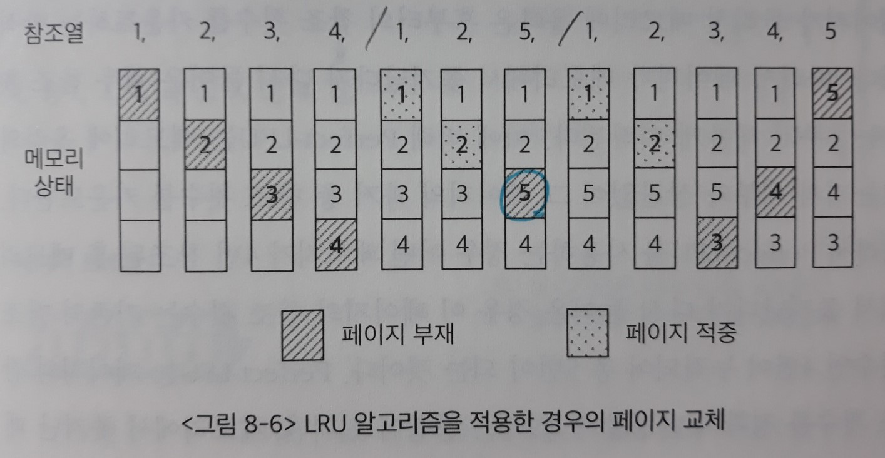

  - 초기에는 메모리가 비어 있기 때문에 처음 4회까지의 페이지 참조 시에는 `페이지 부재`가 불가피하게 발생한다.

  - 5회와 6회에 참조되는 페이지(1, 2)는 이미 메모리에 올라와 있는 페이지이기 때문에 `페이지 부재`를 발생시키지 않는다.

    (`페이지 적중`)

  - 페이지 5를 참조하려 할 때에는 `페이지 부재`가 발생하는데, 메모리에 빈 공간이 없으므로 **교체 알고리즘**이 작동한다.

    - 페이지 1, 2, 3, 4 중에서 가장 오래전에 참조된 페이지가 3번 페이지이므로 페이지 3을 내쫓고, 그 자리에 페이지 5를 적재한다.

    => 이 예에서는 12회의 페이지 참조가 일어나는 동안 총 8회의 페이지 부재가 발생한다.

### 4) LFU 알고리즘

LFU(Least Frequently Used) 알고리즘은 **페이지의 참조 횟수**로 교체시킬 페이지를 결정한다.

즉 **과거에 참조 횟수(reference count)가 가장 적었던 페이지**를 쫓아낸다.

- `최저 참조 횟수`를 가진 페이지가 여러 개 존재하는 경우에는 **임의로 하나를 선정**해 그 페이지를 쫓아낸다.
  - 성능 향상을 위해서는 임의의 페이지가 아니라, `상대적으로 더 오래전에 참조된 페이지`를 쫓아내도록 구현하는 것이 효율적이다.

- 장점
  - `LRU 알고리즘`보다 오랜 시간 동안의 참조 기록을 반영할 수 있다.
  - `LRU`는 직전에 참조된 시점만을 반영하지만, `LFU`는 **참조 횟수**를 통해 장기적인 시간 규모에서의 참조 성향을 고려하기 때문이다.
- 단점
  - **시간지역성** 성질을 활용하는 `LRU`와 달리 시간에 따른 페이지 참조의 변화를 반영하지 못한다.
  - `LRU`보다 구현이 복잡하다.

LFU 알고리즘은 **페이지의 참조 횟수를 계산하는 방식에 따라** `Incache-LFU`와 `Perfect-LFU` 방식으로 구현할 수 있다.

- Incache-LFU

  : 페이지가 물리적 메모리에 올라온 후부터의 참조 횟수를 카운트한다.

  따라서 페이지가 메모리에서 쫓겨났다가 다시 들어온 경우 참조 횟수는 1부터 새롭게 시작된다.

- Perfect-LFU

  : 메모리에 올라와 있는지의 여부와 상관없이 그 페이지의 과거 총 참조 횟수를 카운트한다.

  - 장점 - 페이지의 참조 횟수를 정확히 반영할 수 있음
  - 단점 - 메모리에서 쫓겨난 페이지의 참조 기록까지 모두 보관하고 있어야 하므로 **오버헤드**가 상대적으로 더 크다.

**[LRU 알고리즘과 LFU 알고리즘의 비교 예시]**

- 페이지 참조열: 1, 1, 1, 1, 2, 2, 3, 3, 2, 4, `5`
- 페이지 프레임 4개

현재 시각에 `5번 페이지`가 참조되었다고 할 때, `교체 알고리즘`은 메모리 내에 존재하는 1, 2, 3, 4번 페이지 중에 어떤 것을 쫓아낼지 결정해야 한다.

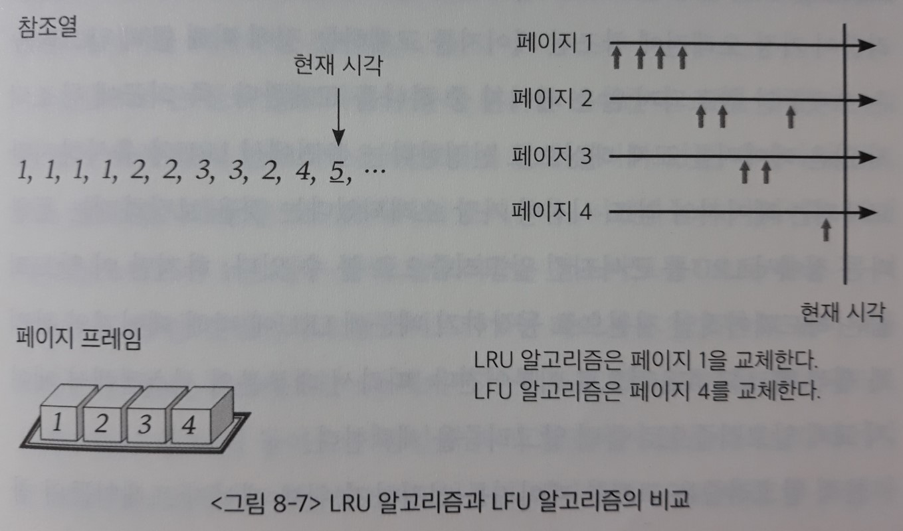

- LRU 알고리즘

  : 1번 페이지를 교체 대상으로 선정한다.

  - 1번 페이지가 **가장 오래전에 참조**되었기 때문이다.
  - 1번 페이지는 **참조 횟수**가 가장 많았지만, `LRU 알고리즘`은 이러한 사실을 인지하지 못한다.

- LFU 알고리즘

  : 4번 페이지를 교체 대상으로 선정한다.

  - 4번 페이지가 **참조 횟수**가 가장 적었기 때문이다.
  - 4번 페이지는 **가장 최근에 참조된 페이지**로 지금부터 인기를 얻기 시작하는 페이지일 수 있지만, `LFU 알고리즘`은 이러한 사실을 인지하지 못한다.

**[LRU 알고리즘과 LFU 알고리즘의 구현]**

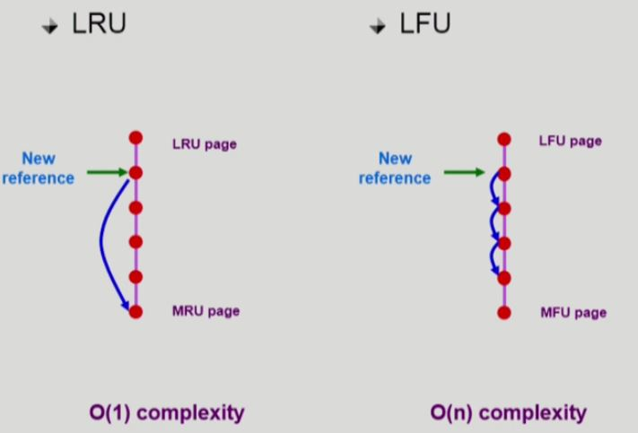

- LRU

  : 메모리 안에 있는 페이지들을 **참조 시간** 순서에 따라 줄 세운다. 

  `운영체제`가 **Linked List** 형태로 관리한다.

  - 새로 참조된 페이지는 원래 위치에서 삭제하고, 가장 앞쪽(MRU)에 삽입한다. (위치 이동)
  - 새로운 페이지가 메모리에 들어오게 되면 가장 앞쪽(MRU)에 삽입한다.
  - 교체가 필요할 때에는 가장 오래전에 참조된 LRU 페이지를 삭제한다.
  - 교체 시간 복잡도 - **O(1)**

    - 쫓아내는 페이지를 결정하기 위해서 **비교가 필요 없다**.

- LFU

  : 메모리 안에 있는 페이지들을 **참조 횟수**에 따라서 <u>줄 세우면 너무 오랜 시간이 걸린다</u>. 

  새로 참조하면 제일 가치가 높아지는 `LRU`와 달리, `LFU`에서는 **참조 횟수**가 1 증가하는 것만으로 끝나기 때문에 **비교를 해줘야 하기 때문이다**. 

  - 교체 시간 복잡도 - **O(n)**

    => 이런 방식으로 구현하면 `교체 알고리즘`으로 사용할 수 없다.

  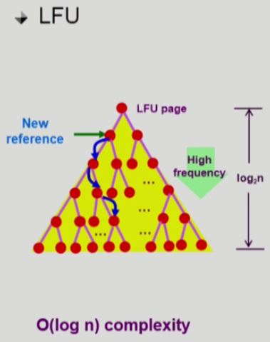

  `운영체제`가 **힙(complete binary tree)** 형태로 관리한다.

  부모보다 자식이 참조횟수가 더 많도록 **Min Heap**을 만든다.

  - 새로 참조된 페이지는 참조 횟수를 1 증가시킨 후, 자손과 비교하면서 자리바꿈 한다. (위치 이동)

  - 새로운 페이지가 메모리에 들어오게 되면 루트(LFU)에 삽입한다.

  - 교체가 필요할 때에는 가장 참조 횟수가 적은 LFU 페이지(루트)를 삭제한다. 

    루트에 있는 페이지를 삭제한 후, 힙을 재구성하는 오버헤드는 **O(log n)**이다.

  - 교체 시간 복잡도 - **O(log n)**

    - **부모-자식간에만 비교한다.**

> `LRU`, `LFU`를 포함한 `교체 알고리즘`은 페이징 시스템 외에 다른 유사한 환경, 즉 **어떤 것을 쫓아낼지 결정해야 하는 컴퓨터 시스템의 여러 곳에서 사용**된다.
>
> 하지만 페이징 시스템에서는 근본적인 제약조건 때문에 `LRU`, `LFU` 알고리즘을 사용할 수 없다.
>
> => 이를 설명하기 위해 **캐싱 기법**에 대해 살펴본다.
>
> - [캐싱 기법](캐싱%20기법.md)

### 5) 클럭 알고리즘

> `LRU`와 `LFU` 알고리즘은 <u>페이지의 참조 시각</u> 또는 <u>참조 횟수</u>를 **소프트웨어적으로 유지하고 비교**해야 하므로 알고리즘의 운영에 **시간적인 오버헤드**가 발생한다.
>
> - 근본적으로 운영체제는 **정보가 부족하여** 가장 오래 전에 참조된 페이지, 또는 가장 적은 참조 횟수를 가진 페이지를 **알 수 없으므로** `LRU`, `LFU` 알고리즘을 사용할 수 없다.
>
> => 클럭 알고리즘(clock algorithm)은 **하드웨어적인 지원**을 통해 이와 같은 알고리즘의 운영 오버헤드를 줄인 방식이다.

클럭 알고리즘은 **`LRU`를 근사(approximation)시킨 알고리즘**으로, `NUR(Not Used Recently)` 또는 `NRU(Not Recently Used)` 알고리즘으로도 불린다.

- LRU 알고리즘 - 가장 오래전에 참조된 페이지를 교체

- 클럭 알고리즘 - 오랫동안 참조되지 않은 페이지 중 하나를 교체

  => 교체되는 페이지의 참조 시점이 가장 오래되었다는 것을 보장하지는 못한다는 점에서 `LRU`를 근사시킨 알고리즘으로 볼 수 있다.

하지만 이 알고리즘은 **하드웨어적인 지원**으로 동작하기 때문에 `LRU`에 비해 **페이지의 관리가 훨씬 빠르고 효율적**으로 이루어진다.

> 따라서 대부분의 시스템에서 페이지 교체 알고리즘으로 `클럭 알고리즘`을 채택한다.

**[동작 원리]**

클럭 알고리즘은 교체할 페이지를 선정하기 위해서 **`하드웨어`가 세팅해놓은 페이지 프레임들의 `참조비트`**를 `운영체제`가 <u>순차적으로</u> 조사한다. (circular list)

- 참조비트(reference bit)

  : 각 `프레임`마다 하나씩 존재하며, 그 프레임 내의 페이지(물리적 메모리에 존재하는 페이지)가 참조될 때 **하드웨어에 의해** 1로 자동 세팅된다.
  
  - CPU가 어떤 페이지를 사용하게 되면, `주소 변환`을 해주는 하드웨어가 **페이지 테이블**의 `valid-invalid bit`을 참조하여 그 값이 valid라면 하드웨어적으로 `reference bit`을 1로 세팅해준다.
  - `운영체제`가 직접 Linked List나 Heap을 이용하여 페이지를 비교할 수 없기 때문에 하드웨어로 bit 1개를 세팅해주는 방식을 사용하는 것이다.

1. `운영체제`가 <u>메모리에 현재 올라와 있는 페이지</u>(= 프레임 내의 페이지)의 `참조 비트` 정보를 시계방향**(circular linked list)**으로 따라가며 조사한다.

   - 시곗바늘이 가리키는 페이지의 `참조비트`가 1인 경우

     : `운영체제`가 참조 비트를 0으로 바꾼 후 시곗바늘을 한 칸 진행시킨다.

   - 시곗바늘이 가리키는 페이지의 `참조비트`가 0인 경우

     : 그 페이지를 교체한다.

     - `참조비트`는 그 페이지가 참조될 때 1로 자동 세팅되므로, **시곗바늘이 한 바퀴 돌아오는 동안에 다시 참조되지 않을 경우(참조비트가 여전히 0인 경우) 그 페이지는 교체**되는 방식이다.

2. 모든 `페이지 프레임`을 다 조사한 경우 첫 번째 `페이지 프레임`부터 조사 작업을 반복한다.

적어도 시곗바늘이 한 바퀴를 도는 데 소요되는 시간만큼 페이지를 메모리에 유지시켜둠으로써 `페이지 부재율`을 줄이도록 설계되었기 때문에 이 알고리즘을 `2차 기회 알고리즘(second chance algorithm)`이라고도 부른다.

**[클럭 알고리즘의 개선]**

- `reference bit`과 `modified bit(dirty bit)`을 함께 사용

- reference bit = 1 : 최근에 참조된 페이지

- modified bit = 1 : 최근에 변경된 페이지 (I/O를 동반하는 페이지, 즉 write으로 참조되는 페이지)

  - 메모리에서 write이 발생하면 하드웨어가 `modified bit`을 1로 세팅한다.

  - 어떤 페이지가 reference bit = 0이라서 메모리에서 쫓겨날 때

    - modified bit = 0

      : 동일한 페이지 복사본이 `백킹스토어`에 저장되어 있으므로, 단순히 해당 페이지를 메모리에서 삭제한다.

    - modified bit = 1

      : 메모리에 올라온 이후로 적어도 한번은 CPU에서 write을 했으므로, `백킹스토어`에 수정된 내용을 반영하고 삭제한다.

      => 쫓아낼 경우 디스크에 write 해줘야 하므로 시간이 오래 걸린다.

      **따라서 가능하면 modified bit = 1인 페이지는 쫓아내지 않도록 하여 알고리즘의 속도를 좀 더 빠르게 개선한다.**

## 3. 페이지 프레임의 할당

- 할당 문제(allocation problem)

  : `프로세스 여러 개가 동시에 수행되는 상황`에서는 각 프로세스에 얼마만큼의 메모리 공간을 **할당**할 것인지 결정해야 한다.

- 할당 알고리즘(allocation algorithm)

  1. 균등할당(equal allocation)

     : 모든 프로세스에게 `페이지 프레임`을 균일하게 할당

  2. 비례할당(proportional allocation)

     : **프로세스의 크기**에 비례해 `페이지 프레임`을 할당

  3. 우선순위 할당(priority allocation)

     : **프로세스의 CPU 우선순위**에 따라 `페이지 프레임`을 다르게 할당

     당장 CPU에서 실행될 프로세스와 그렇지 않은 프로세스를 구분하여, 전자 쪽에 더 많은 페이지 프레임을 할당하는 방식이다.

> 한편 이와 같은 `할당 알고리즘`만으로는 각 프로세스에 메모리 공간 할당할 때, **프로세스의 페이지 참조 특성**을 제대로 반영하지 못할 수 있다.

**[프로세스의 페이지 참조 특성]**

1. 프로세스를 정상적으로 수행하기 위해서는 적어도 **일정 수준 이상의 `페이지 프레임`을 각 프로세스에 할당해야 한다**.

   - 왜냐하면 CPU에서 `명령`을 실행할 때에는 일반적으로 여러 `페이지`를 동시에 참조하기 때문이다.

     이는 **`명령`을 실행할 때 프로세스의 주소 공간 중 코드, 데이터, 스택 등 각기 다른 영역을 참조하기 때문**이다.

   => `할당 알고리즘`만 이용하여 메모리 공간을 할당하면, 현재 수행 중인 프로세스의 수가 지나치게 많을 경우 프로세스당 할당되는 메모리 양이 과도하게 적어질 수 있다.

2. 반복문(loop)을 실행 중인 프로세스의 경우 **반복문을 구성하는 `페이지`들을 한꺼번에 메모리에 올려놓는 것이 유리**하다.

   - 반복문을 구성하는 페이지의 수보다 적은 양의 프레임을 할당하면, 매 반복(iteration)마다 적어도 한 번 이상의 `페이지 부재`가 발생해 시스템의 성능이 현저히 떨어지기 때문이다.

3. 프로세스에게 최소한으로 필요한 메모리의 양은 **시간에 따라 다를 수 있다**.

이와 같이 종합적인 상황을 고려해서 각 프로세스에 할당되는 `페이지 프레임`의 수를 결정해야 한다.

경우에 따라서는 일부 프로세스에게 메모리를 할당하지 않는 방식으로 나머지 프로세스들에게 `최소한의 메모리 요구량`을 충족시킬 수 있어야 한다.

## 4. 전역교체와 지역교체

교체할 페이지를 선정할 때, `교체 대상이 될 프레임의 범위`를 어떻게 정할지에 따라 교체 방법을 **전역교체(global replacement)**와 **지역교체(local replacement)**로 구분할 수 있다.

- 전역교체 방법

  : **모든 페이지 프레임**이 교체 대상이 될 수 있는 방법

  - `전역교체 방법`은 프로세스마다 메모리를 할당하는 것이 아니라, <u>전체 메모리를 각 프로세스가 공유해서 사용하고 `교체 알고리즘`에 근거해서 할당되는 메모리 양이 가변적으로 변하는 방법</u>이다.
    - `LRU`, `LFU`, `클럭` 등의 알고리즘을 물리적 메모리 내에 존재하는 전체 페이지 프레임들을 대상으로 적용하는 경우
      - ex) `LRU 알고리즘`으로 전역교체를 한다면 물리적 메모리 전체에 올라와 있는 페이지 중 가장 오래전에 참조된 페이지를 교체한다. 그 페이지가 어떤 프로세스에 속한 것인지는 고려하지 않는다.
    - 스레싱 발생 방지 알고리즘(MPD 조절 알고리즘)인 `워킹셋 알고리즘`과 `PFF 알고리즘`도 **전역교체 방법**으로 사용될 수 있는 방법들이다.
  
> 이는 `프로세스별 프레임 할당량`을 조절하는 또 다른 방법이 될 수 있다.
  >
  > 전체 시스템 차원에서 더 자주 참조되는 페이지가 메모리에 올라가기 때문에 프로세스의 프레임 할당량이 스스로 조절될 수 있는 것이다.

- 지역교체 방법

  : **현재 수행 중인 프로세스에게 할당된 프레임** 내에서만 교체 대상을 선정할 수 있는 방법

  - `지역교체 방법`은 <u>프로세스마다 페이지 프레임을 미리 할당하는 것</u>을 `전제`로 한다.

    => 즉 프로세스별로 페이지 프레임을 할당하고, 교체할 페이지도 그 프로세스에게 할당된 프레임 내에서 선정하게 되는 것이다.

    - `LRU`, `LFU` 등의 알고리즘을 프로세스별로 독자적으로 운영하는 경우

## 5. 스레싱

- 스레싱(thrashing)

  : 집중적으로 참조되는 페이지들의 집합을 메모리에 한꺼번에 적재하지 못하여 `페이지 부재율(page fault rate)`이 크게 상승해 `CPU 이용률(CPU utilization)`이 급격히 떨어지는 현상

  - CPU 이용률

    : 전체 시간 중에서 CPU가 일을 한 시간의 비율

- 다중 프로그래밍의 정도(Multi-Programming Degree: MPD)

  : 메모리에 동시에 올라가 있는 프로세스의 수

**[스레싱이 발생하는 과정]**

1. `운영체제`는 `CPU 이용률`이 낮을 경우, **메모리에 올라와 있는 프로세스의 수가 적기 때문이라고 판단**한다.

   - `준비 큐`에 프로세스가 단 하나라도 있으면 CPU는 그 프로세스를 실행하므로 쉬지 않고 일하게 된다.
   - 그런데 메모리에 올라와 있는 프로세스의 수가 너무 적어, 이들 프로세스가 모두 `I/O 작업`을 함으로써 `준비 큐`가 비는 경우가 발생하면 `CPU 이용률`은 낮아진다.

   => 따라서 운영체제는 메모리에 올라가는 프로세스의 수**(MPD)**를 늘린다.

2. 그런데 `MPD`가 과도하게 높아지면 각 프로세스에게 할당되는 메모리의 양이 지나치게 감소하게 된다.

   그렇게 되면 각 프로세스는 원활하게 수행되기 위해 필요한 최소한의 페이지 프레임도 할당받지 못하는 상태가 되어 `페이지 부재`가 빈번하게 발생하게 된다.

   - `페이지 부재`가 발생하면 **디스크 I/O 작업(스왑 인, 스왑 아웃)**을 수반하므로 `문맥교환`을 통해 다른 프로세스에게 CPU가 이양된다.
   - 이때 다른 프로세스 역시 할당받은 메모리 양이 지나치게 적으면 `페이지 부재`가 발생하는 것이다.

3. 결국에는 `준비 큐`에 있는 모든 프로세스에게 CPU가 한 차례씩 할당되었는데도 모든 프로세스가 `페이지 부재`를 발생시키게 된다.

   따라서 시스템은 `페이지 부재`를 처리하느라 매우 분주해지고, `CPU 이용률`은 급격히 떨어지게 된다.

4. `운영체제`는 이 상황에서 `CPU 이용률`이 낮은 이유가 **메모리에 올라와 있는 프로세스의 수가 적기 때문이라고 판단**한다.

   => 따라서 운영체제는 메모리에 올라가는 프로세스의 수**(MPD)**를 늘린다.

5. 프로세스당 할당된 프레임의 수가 더욱 감소하고 `페이지 부재`는 더욱 빈번히 발생한다.

   - 이 경우 프로세스들은 서로의 페이지를 교체하며 스왑 인과 스왑 아웃을 지속적으로 발생시키고**(디스크 I/O 작업)**, CPU는 대부분의 시간에 일을 하지 않게 된다.

     => 이러한 상황을 **스레싱**이라고 부른다.

**[MPD와 CPU 이용률의 상관관계]**

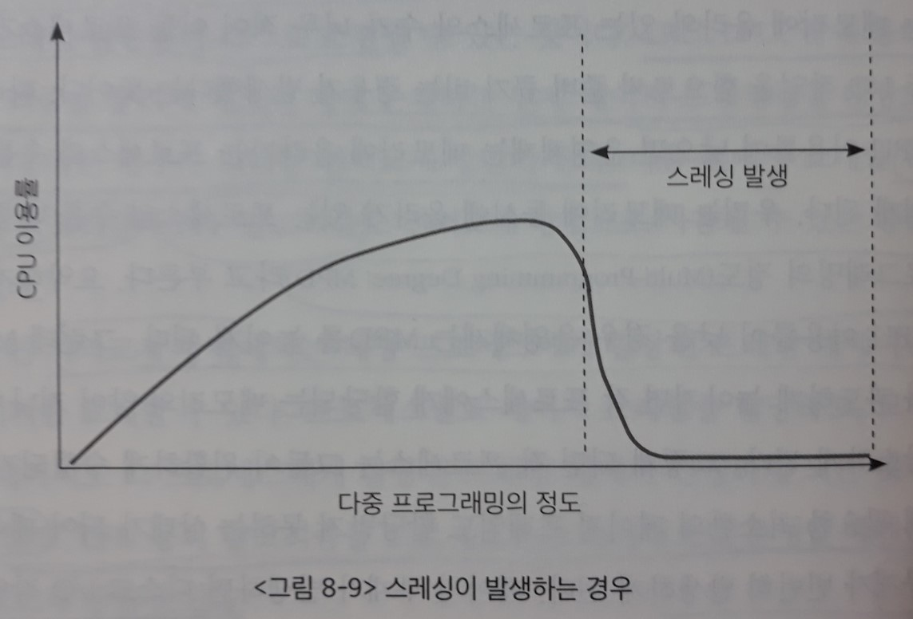

- 메모리 내에 존재하는 프로세스의 수(`MPD`)를 증가시키면 `CPU 이용률`은 이에 비례해서 증가한다.
- 그러나 어느 한계치를 넘어서면 **스레싱**이 발생하여 `CPU 이용률`이 급격히 떨어진다.

> 따라서 **스레싱이 발생하지 않도록 하면서** `CPU 이용률`을 최대한 높일 수 있도록 `MPD`를 조절하는 것이 중요하다.
>
> => `MPD`를 적절히 조절해 `CPU 이용률`을 높이는 동시에 **스레싱 발생을 방지**하는 방법에는 `워킹셋 알고리즘(working-set algorithm)`과 `페이지 부재 빈도 알고리즘(page-fault frequency scheme)`이 있다.

### 1) 워킹셋 알고리즘

- 지역성 집합(locality set)

  : 프로세스는 <u>일정 시간 동안</u> 특정 주소 영역을 집중적으로 참조하는 `경향`이 있다.

  이렇게 **집중적으로 참조되는 페이지들의 집합**을 `지역성 집합`이라고 한다.

- 워킹셋(working-set) 알고리즘

  : `지역성 집합`이 메모리에 동시에 올라갈 수 있도록 보장하는 메모리 관리 알고리즘

  - 워킹셋 알고리즘에서는 프로세스가 <u>일정 시간 동안 원활히 수행되기 위해</u> 한꺼번에 메모리에 올라와 있어야 하는 페이지들의 집합을 **워킹셋(working-set)**이라고 `정의`한다.

    - 프로세스의 **워킹셋을 구성하는 페이지들이 한꺼번에 메모리에 올라갈 수 있는 경우**에만 그 프로세스에게 메모리를 할당한다.
    - 그렇지 않은 경우 프로세스에게 할당된 페이지 프레임들을 모두 반납시킨 후, 그 프로세스의 주소 공간 전체를 디스크로 `스왑 아웃`시킨다. (해당 프로세스의 상태는 `중지(suspended)` 상태가 된다)

    => 워킹셋 알고리즘은 이와 같은 방법을 통해 `MPD`를 조절하고 **스레싱을 방지**한다.

**[워킹셋을 구하는 방법]**

한꺼번에 메모리에 올라가야 할 페이지들의 집합을 결정하기 위해 **워킹셋 윈도우(working-set window)**를 사용한다.

> 워킹셋, 즉 동시에 올라가면 좋은 페이지들의 집합은 미리 알 수 없다.
>
> 따라서 **과거**를 통해서 워킹셋을 추정한다. (과거 Δ시간 동안 참조된 페이지들의 집합)

- 시각 t_i에서의 워킹셋 **WS(t_i)**

  : 윈도우의 크기가 Δ인 경우, 시간 간격 [t_i - Δ, t_i] 사이에 참조된 서로 다른 페이지들의 `집합(set)`

t_i 시점에 `워킹셋`에 포함된 페이지들은 메모리에 유지되고, 그렇지 않은 페이지들은 메모리에서 쫓겨난다.

즉 **페이지가 참조된 시점부터 Δ시간 동안은 메모리에 유지**하고, 그 시점이 지나면 메모리에서 지워버리게 되는 것이다.

`워킹셋 알고리즘`은 다음과 같은 방식으로 `MPD`를 조절해서 `CPU 이용률`을 높이는 동시에 **스레싱을 방지**한다.

- MPD 줄이기

  : **메모리에 올라와 있는 프로세스들의 `워킹셋` 크기의 합**이 프레임의 수보다 클 경우, <u>일부 프로세스</u>를 `스왑 아웃`시켜서 남은 프로세스의 워킹셋이 메모리에 모두 올라가는 것을 보장한다. 이는 `MPD`를 줄이는 효과를 발생시킨다.

  - 스왑 아웃되는 프로세스 (**중기 스케줄러의 기준**)

    - 0순위 - `봉쇄` 상태 프로세스

      (봉쇄 상태인 프로세스들은 당장 CPU를 획득할 가능성이 없기 때문에 메모리를 보유하고 있는 것 또한 큰 의미가 없기 때문)

    - 1순위 - 타이머 인터럽트가 발생해 `준비 큐`로 이동하는 프로세스

- MPD 증가시키기

  : 프로세스들의 `워킹셋`을 모두 할당한 후에도 프레임이 남을 경우, `스왑 아웃`되었던 프로세스를 다시 메모리에 올려서 `워킹셋`을 할당함으로써 `MPD`를 증가시킨다. 

> 윈도우 크기 Δ가 너무 작으면 `지역성 집합`을 모두 수용하지 못할 우려가 있고, 반대로 윈도우 크기 Δ가 너무 크면 여러 규모의 `지역성 집합`을 수용할 수 있는 반면 `MPD`가 감소해 `CPU 이용률`이 낮아질 우려가 있다.
>
> => 따라서 `워킹셋 알고리즘`에서 시스템의 성능을 향상시키기 위해서는, **프로세스들의 `지역성 집합`을 효과적으로 탐지할 수 있는 윈도우 크기 Δ를 결정하는 것이 중요**하다.

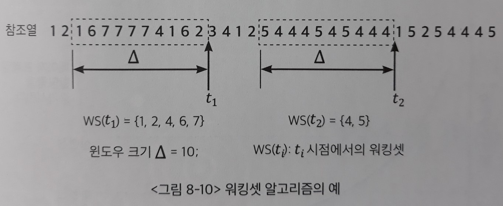

워킹셋 알고리즘에서 `워킹셋`의 크기는 시간이 흐름에 따라 변한다.

- 시각이 t1일 때 이 프로세스의 `워킹셋`은 5개의 페이지로 구성됨
- 시각이 t2일 때 이 프로세스의 `워킹셋`은 2개의 페이지로 구성됨

=> 워킹셋 알고리즘은 이처럼 프로세스가 메모리를 많이 필요로 할 때에는 많이 할당하고, 적게 필요로 할 때에는 적게 할당하는 **일종의 동적인 프레임 할당 기능까지 수행**한다고 할 수 있다.

### 2) 페이지 부재 빈도 알고리즘

페이지 부재 빈도(Page Fault Frequency: PFF) 알고리즘은 프로세스의 `페이지 부재율`을 주기적으로 조사하고, 이 값에 근거해서 **각 프로세스에 할당할 메모리 양을 동적으로 조절**한다.

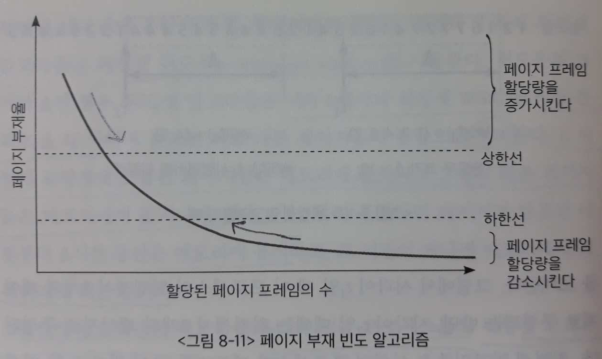

`페이지 부재 빈도 알고리즘`은 다음과 같은 방식으로 `MPD`를 조절해서 `CPU 이용률`을 높이는 동시에 **스레싱을 방지**한다.

- MPD 줄이기

  : 어떤 프로세스의 `페이지 부재율`이 시스템에서 미리 정해놓은 **상한값(upper bound)**을 넘게 되면, 이 프로세스에 할당된 프레임의 수가 부족하다고 판단하여 프레임을 추가로 더 할당한다.

  이때 추가로 할당할 빈 프레임이 없다면, <u>일부 프로세스</u>를 `스왑 아웃`시켜 메모리에 올라가 있는 프로세스의 수를 조절한다. 이는 `MPD`를 줄이는 효과를 발생시킨다.

  - 스왑 아웃되는 프로세스 (`워킹셋 알고리즘`과 같다 **-> 중기 스케줄러의 기준**)
    - 0순위 - `봉쇄` 상태 프로세스
    - 1순위 - 타이머 인터럽트가 발생해 `준비 큐`로 이동하는 프로세스

- MPD 증가시키기

  : 프로세스의 페이지 부재율이 **하한값(lower bound)** 이하로 떨어지면, 이 프로세스에게 필요 이상으로 많은 프레임이 할당된 것으로 간주해 할당된 프레임의 수를 줄인다.

  이런 방식으로 메모리 내에 존재하는 모든 프로세스에 필요한 프레임을 다 할당한 후에도 프레임이 남는 경우, `스왑 아웃`되었던 프로세스에게 프레임을 할당함으로써 `MPD`를 높인다.

## 6. 페이지 사이즈의 결정

Page size를 감소시키면

- 단점
  - 페이지 수 증가
  - 페이지 테이블 크기 증가 => 메모리 낭비
  - Disk transfer의 효율성 감소
    - Seek/rotation vs. transfer
    - 디스크 헤드가 이동하는 seek time은 오래 걸리는 작업이므로, 한 번 이동할 때 가능하면 많은 용량의 단위를 가져오는 것이 효율적이다.
- 장점
  - `내부조각(Internal fragmentation)` 감소
  - 필요한 정보만 메모리에 올라와 메모리 이용이 효율적
    - **그러나 `Locality`의 활용 측면에서는 좋지 않다.**

> Trend는 64bit 운영체제와 더 큰 물리적 메모리에 맞춰서 4 KB보다 큰 **Larger page size를 사용하는 메모리 시스템**이 논의되고 있다.

