# 9장. 디스크 관리

> 하드디스크의 관리 기법에 대해 살펴본다.
>
> - 디스크의 구조
> - 디스크 스케줄링 기법
>   - 디스크 스케줄링과 엘리베이터 스케줄링은 유사한 문제이다.
> - 저전력 디스크 관리 기법

## 1. 디스크의 구조

- <u>디스크 외부</u>에서는 `디스크`를 일정한 크기의 저장공간들로 이루어진 `1차원 배열`처럼 취급하게 된다.

  => 디스크 외부(컴퓨터)에서 디스크 `컨트롤러`에 `1차원 배열`의 몇 번째 index에 위치한 원소를 달라고 요청한다.

  이 일정한 크기의 저장공간을 **논리블록(logical block)**이라고 한다.

  - 디스크에 데이터가 저장될 때

  - 디스크 외부로 입출력이 일어날 때

    => **논리블록 단위**로 저장되거나, **논리블록 단위**로 전송된다.

    1. **논리블록에 저장된 데이터를 접근하기 위해서는 `배열`을 접근하는 것처럼 `해당 블록의 인덱스 번호`를 디스크에 전달해야 한다.**

    2. 그러면 `디스크 컨트롤러`는 해당 논리블록이 저장된 물리적 위치를 찾아 요청된 데이터에 대한 입출력을 수행한다.

       > **디스크 컨트롤러**
       >
       > - 디스크를 실제로 작동시키는 일은 디바이스 `컨트롤러(HW)`가 컨트롤러 안의 **펌웨어 코드(SW)**의 지시를 받아서 하는 것이다. (컴퓨터 외부에서 동작)
       > - 로컬 버퍼를 가짐 (일종의 data register)
       > - 제어 정보를 위해 control register, status register를 가짐
       >   - CPU가 지시를 내리기 위해 사용하는 제어 정보를 저장한다.

- 각 논리블록이 저장되는 <u>디스크 내부</u>의 물리적인 위치를 **섹터(sector)**라고 부른다.

  - 섹터에 데이터를 읽고 쓰는 요청은 `디스크 컨트롤러`가 직접 관리한다.

> **논리블록** 하나가 **섹터** 하나와 1 대 1로 매핑되어 데이터가 저장된다.

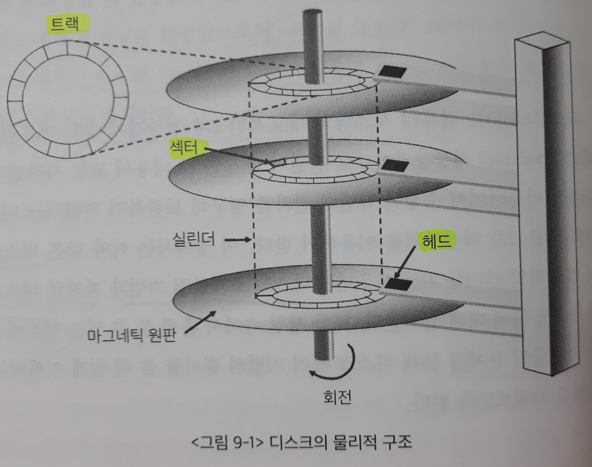

디스크의 물리적인 구조는 **마그네틱의 원판**으로 구성된다.

각각의 원판은 **트랙(track)**으로 구성되고, 각 트랙은 **섹터**로 나뉜다.

- 섹터에는 최소한의 단위 정보가 저장된다.

여러개의 원판에서 상대적 위치가 동일한 트랙들의 집합을 **실린더(cylinder)**라고 부른다.

- `섹터 0`은 최외곽 실린더의 첫 번째 트랙에 있는 첫 번째 섹터이다. 

**[디스크에 데이터를 읽고 쓰기]**

1. 암(arm)이 해당 섹터가 위치한 `실린더`로 이동
2. 원판이 회전하여 디스크 헤드가 저장된 `섹터` 위치에 도달

### 디스크를 사용하는 단계

1. physical formatting (Low-level formatting)

    - 디스크를 `컨트롤러`가 읽고 쓸 수 있도록 `섹터`들로 나누는 과정

      - 공장에서 디스크를 제작한 후에 포맷한다.
      - 예전에는 디스크의 용량이 작아서 포맷 시간이 적게 걸렸으므로, 사용자가 구매 후에 직접 포맷했다.

    - 각 `섹터`는 <u>header</u> + <u>실제 data</u>(보통 512 bytes) + <u>trailer</u>로 구성

      - 실제 data

        : **논리블록(logical block)**을 저장하는 공간

      - header, trailer

        : **논리블록** 앞 뒤로 부가적인 공간이 추가된다. 

    - `header`와 `trailer`는 sector number, ECC(Error-Correcting Code) 등의 정보가 저장되며 `컨트롤러`가 직접 접근 및 운영한다.

      > 모든 데이터에는 데이터를 읽고 쓰는데 부가적으로 필요한 **메타 데이터**가 존재한다.

      - sector number 

        : 주소 매핑을 위한 섹터 번호

      - ECC(Error-Correcting Code) 

        - 내용이 에러 없이 잘 저장되었는지 체크하는 코드(Error-Correction)

        - 해시함수 등을 이용하여 512 byte 데이터를 아주 작은 크기로 요약한 코드(fingerprint)

          : 디스크 `컨트롤러`가 해당 데이터를 읽을 때, 데이터만 읽는 것이 아니라 `섹터` 내부의 header와 trailer도 같이 읽는다.

          ECC 값과 저장된 데이터에 대해 ECC를 생성한 값을 비교하여, 서로 같으면 **bad sector**가 발생하지 않았음을 확인하고 그대로 전송한다.

          (값이 다르면 저장하는 과정에서 오류가 발생한 것임)

          - ECC는 축약본이라 모든 오류를 탐지할 수는 없다.
          - ECC의 규모에 따라 데이터 수정까지 가능한 경우도 있다.

2. Partitioning

    - `섹터`들을 묶어서, 디스크를 하나 이상의 `실린더 그룹`으로 나누는 과정
    - `운영체제`는 이것들을 각각 **독립적인 disk**로 취급 (logical disk, Partition)

3. Logical formatting

    - 파일시스템을 만드는 것

      = 파티션에 `파일시스템`을 설치하는 것

    - **FAT**, **inode**, free space 등의 구조 포함

4. Booting

    > `파일 시스템`을 설치하고 컴퓨터 전원을 켰을 때 Booting이 실행됨

    - ROM에 있는 "<u>small Bootstrap loader</u>"의 실행

      1. 컴퓨터 전원을 키면 CPU의 `PC 레지스터`가 ROM(메모리)의 주소를 가리키게 된다.

         > CPU는 메모리에만 접근할 수 있다.

         - ROM

           : 전원이 나가도 데이터가 유지되는 소량의 메모리 영역

      2. ROM에 있는 "<u>small Bootstrap loader</u>"가 CPU에서 instruction 형태로 실행된다.

         => 하드 디스크의 `0번 섹터`에 있는 내용을 메모리에 올린 후 실행하라고 지시한다.

    - **sector 0 (boot block)**을 load하여 실행

    - sector 0은 "<u>full Bootstrap loader program</u>"

      - 운영체제 **커널** 파일의 위치를 찾아서 메모리에 올린 후 실행하라고 지시한다.

    - OS를 디스크에서 load하여 실행

## 2. 디스크 스케줄링

**디스크에 대한 접근시간(access time)**은 `탐색시간`과 `회전지연시간`, `전송시간`으로 구분된다.

- 탐색시간(seek time)

  : 디스크 헤드를 해당 `실린더` 위치로 이동시키는 데 걸리는 시간

  즉 접근하려는 데이터가 원판의 안쪽에 있는지 바깥쪽에 있는지에 따라 **헤드를 움직이는 데 걸리는 시간**

- 회전지연시간(rotational latency)

  : **디스크가 회전**해서 해당 `섹터`가 헤드 위치에 도달하기까지 걸리는 시간

  `탐색시간`의 1/10 정도만큼의 시간이 걸린다.

- 전송시간(transfer time)

  : 해당 `섹터`가 헤드 위치에 도달한 후 **데이터를 실제로 `섹터`에 읽고 쓰는 데 소요되는 시간**

> **디스크 입출력의 효율**을 높이기 위해서는 디스크 입출력에 소요되는 접근시간을 최소화해야 한다.
>
> - 회전지연시간, 전송시간 - 상대적인 수치가 작고 `운영체제`가 통제하기 힘든 부분이다.
> - 탐색시간 - 반도체 접근이 아니라 **기계장치를 이용하여 접근**하기 때문에, 가장 큰 시간 구성요소이다. 
>
> => 따라서 `운영체제`는 `탐색시간`을 줄이기 위해 헤드의 움직임을 최소화하는 **디스크 스케줄링** 작업을 할 수 있다.

- Disk bandwidth

  : 단위 시간 당 전송된 바이트의 수

  > 디스크의 성능을 평가하는 지표로 사용된다.

- 디스크 스케줄링(disk scheduling)

  : 효율적인 디스크 입출력을 위해, **여러 `섹터`들에 대한 입출력 요청들을 어떠한 순서로 처리할 것인지** 결정하는 메커니즘 

  (해당 `섹터`들을 포함하는 `실린더` 위치의 방문 순서를 결정)

  - 목표 - 디스크 헤드의 이동거리 줄이기

> **`디스크 스케줄링 알고리즘`은 디스크 내부, 즉 `컨트롤러`에 구현되어 있지 않다.**(컨트롤러에 스케줄러 코드 없음)
>
> **윗 계층(layer)의 `운영체제` 쪽에 존재하는 코드다.(= 디스크 스케줄러)**
>
> => 따라서 `디스크 스케줄링 알고리즘`은 디스크 상의 정확한 `실린더` 위치는 알 수 없다.
>
> ​	디스크 스케줄러(커널 코드)는 대신에 **논리블록 번호**를 보고 스케줄링을 하고, **논리블록 번호**가 디스크 상의 **섹터 위치**와 대부분 일치하기 때문에 이와 같은 방식으로 해결한다.
>
> - 편의상 아래 예시들에서는 `실린더` 위치를 기준으로 설명한다.
>
> - cf) `디스크 내부(컨트롤러)`에서 `섹터` 단위의 스케줄링을 하기도 하지만, 실제 구현에서는 쓰지 않는다.

### 1) FCFS 스케줄링

FCFS(First Come First Served) 스케줄링은 디스크에 **먼저 들어온 요청을 먼저 처리**하는 방식이다.

최악의 경우 입출력 요청이 디스크의 한쪽 끝과 반대쪽 끝에 번갈아 도착한다면, 헤드는 디스크를 계속 왕복하며 일을 처리해야 하므로 매우 **비효율적**이다.

- 입출력 요청이 들어온 실린더 위치: 99, 184, 36, 123, 15, 125, 66, 68

- 실린더 개수 200개

- 실린더 0: 디스크 원판의 가장 안쪽 실린더

  실린더 199: 가장 바깥쪽 실린더

  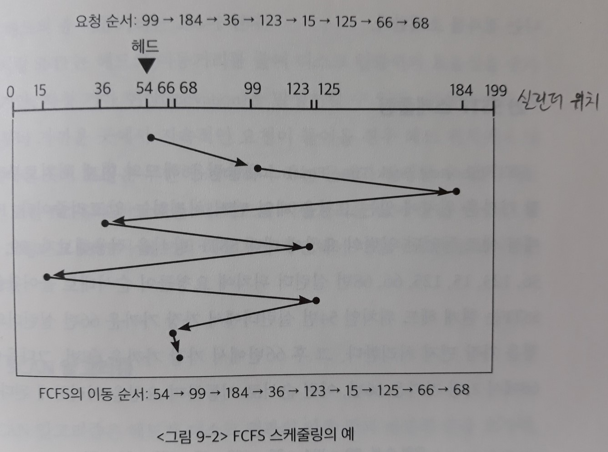

- 현재 디스크 헤드가 54번 실린더에 있을 경우, 헤드는 54에서 출발해 99, 184, 36, 123과 같이 요청이 들어온 순서대로 이동한다.

  => 총 헤드가 이동한 거리는 644가 된다.

### 2) SSTF 스케줄링

SSTF(Shortest Seek Time First) 스케줄링은 (현재 큐에 들어온 요청들 중에서) **헤드의 현재 위치로부터 가장 가까운 위치에 있는 요청을 제일 먼저 처리**한다.

우체부가 같은 지역으로 가는 우편물들을 그룹화해 배달하는 것과 유사한 방식이다.

- 입출력 요청이 들어온 실린더 위치: 99, 184, 36, 123, 15, 125, 66, 68

- 실린더 개수 200개

- 실린더 0: 디스크 원판의 가장 안쪽 실린더

  실린더 199: 가장 바깥쪽 실린더

  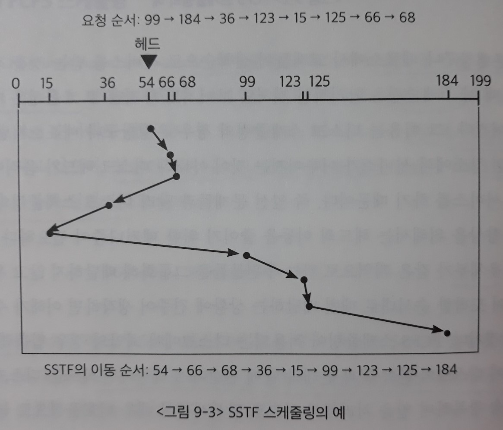

- 현재 디스크 헤드가 54번 실린더에 있을 경우, 가장 가까운 66번 실린더의 요청을 가장 먼저 처리한다.

- 그 후 66번에서 가장 가까운 68번, 그다음에는 68에서 가장 가까운 36번, 이런 순서로 이동하며 요청을 처리한다. 

  => 총 헤드가 이동한 거리는 236이 된다.

SSTF는 헤드의 이동거리를 줄여 **디스크의 입출력 효율성을 증가**시키지만, <u>헤드의 이동거리 측면에서 가장 우수한 알고리즘은 아니다</u>.

- 기아 현상(starvation)

  : 현재의 헤드 위치로부터 가까운 곳에서 지속적인 요청이 들어올 경우, 헤드 위치에서 멀리 떨어진 곳의 요청은 무한히 기다려야 하는 문제가 발생할 수 있다.

### 3) SCAN 알고리즘

> 기본적으로 **디스크 스케줄링 알고리즘**은 `SCAN`에 기반한 알고리즘들을 사용하고 있다.

SCAN 알고리즘은 **헤드가 디스크 원판의 안쪽 끝과 바깥쪽 끝을 오가며, 그 경로에 존재하는 모든 요청을 처리**한다.

즉 디스크의 <u>어떠한 위치에 요청이 들어오는가와 상관없이</u>, 헤드는 정해진 방향으로 이동하면서 길목에 있는 요청들을 처리하며 지나가는 것이다.

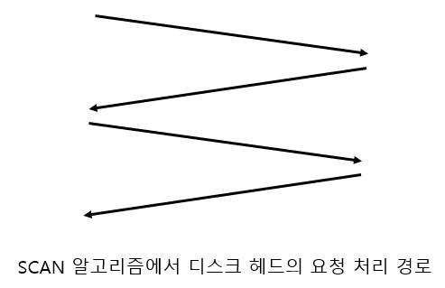

버스가 일정 경로에 따라 움직이며 정류장에서 기다리고 있는 사람들을 태우는 것과 유사한 방식이다.

또한 엘리베이터에서 사용하는 알고리즘과 유사하기 때문에 `엘리베이터 스케줄링 알고리즘(elevator scheduling algorithm)`이라고도 부른다.

- 입출력 요청이 들어온 실린더 위치: 99, 184, 36, 123, 15, 125, 66, 68

- 실린더 개수 200개

- 실린더 0: 디스크 원판의 가장 안쪽 실린더

  실린더 199: 가장 바깥쪽 실린더

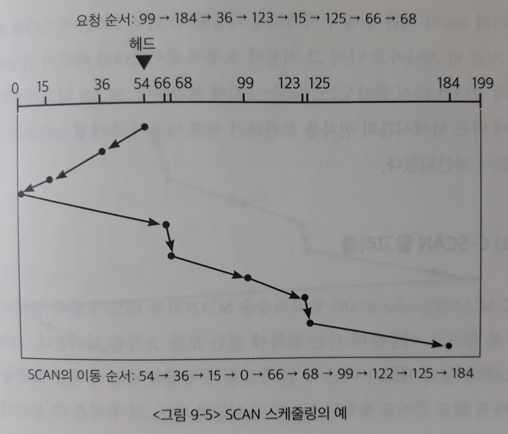

- 현재 디스크 헤드가 54번 실린더이고 디스크 헤드가 0번 실린더 방향으로 이동하고 있는 경우, 가는 길목에 존재하는 36번과 15번 실린더 위치에 들어온 요청을 처리한다.

- 0번 실린더에 도착한 후에는 이동 방향을 바꾸어 199번 실린더를 향해 이동하면서 가는 길목에 존재하는 모든 요청들을 차례로 처리한다.

  => 총 헤드가 이동한 거리는 238이 된다.

`효율성`과 `형평성`을 모두 만족하는 알고리즘이다.

- 효율성

  : `FCFS`처럼 불필요한 헤드의 이동이 발생하지 않는다.

  한쪽 끝에서 다른 쪽 끝으로 한 번만 이동하면 현재 큐에 들어온 모든 요청을 처리할 수 있으므로 <u>이동거리 측면에서 매우 효율적</u>이다.

- 형평성

  : 헤드가 전체 실린더를 한 번 스캔하는 시간이면 기다리던 모든 요청이 처리되므로, `SSTF`처럼 **일부 요청이 지나치게 오래 기다리는 현상이 발생하지 않는다**.

**[위치에 따른 탐색시간의 편차]**

`SCAN 알고리즘`에서 모든 실린더 위치의 기다리는 시간이 공평한 것은 아니다.

제일 안쪽이나 제일 바깥쪽 위치보다는 **가운데 위치가 `기다리는 평균시간`이 더 짧기 때문이다**.

=> 헤드가 **가운데 위치를 지나가는 주기**는 양 끝을 지나가는 주기의 **절반**에 불과하다.

- ex) 헤드가 가장자리인 0번이나 199번 실린더를 막 지나가고 나서 해당 지점에 요청이 들어왔다면, 반대쪽 끝까지 헤드가 갔다 와야 서비스를 받을 수 있으므로 헤드의 이동거리 400(= 200+200)이 지난 후에야 서비스가 가능하다.
- 반면 100번 실린더의 경우, 헤드가 가장자리까지 갔다가 다시 돌아오는 거리는 200에 불과하다.

> SCAN 알고리즘의 `위치에 따른 탐색 시간의 편차`를 보완하기 위해 **C-SCAN 알고리즘**이 제안되었다.

### 4) C-SCAN 알고리즘

C-SCAN(Circular-SCAN) 알고리즘은 `SCAN`처럼 헤드가 한쪽 끝에서 다른 쪽 끝으로 이동하며 가는 길목에 있는 모든 요청을 처리한다.

그러나 `SCAN`과 달리 헤드가 다른 쪽 끝에 도달해 **방향을 바꾼 후에는 요청을 처리하지 않고 곧바로 출발점으로 다시 이동**만 한다.

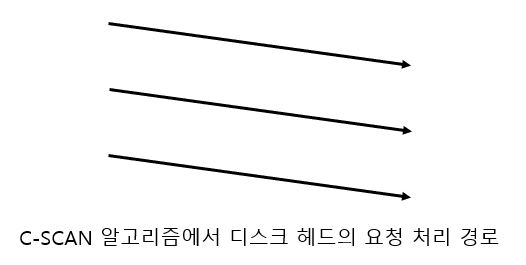

이 방식은 `SCAN`보다 이동거리는 조금 길어지지만, 각 실린더 위치에 대해 좀 더 **균일한 탐색시간**을 제공한다. 

=> **위치에 따른 `탐색시간의 편차`를 줄일 수 있다**.

- ex) 헤드가 가장자리인 0번이나 199번 실린더를 막 지나가고 나서 해당 지점에 요청이 들어왔다면, 반대쪽 끝까지 헤드가 갔다 와야 서비스를 받을 수 있으므로 헤드의 이동거리 400(= 200+200)이 지난 후에야 서비스가 가능하다.
- 100번 실린더의 경우, 헤드가 가장자리까지 갔다가 방향을 바꾸어 출발점으로 이동한 후, 다시 100번 실린더로 돌아오는 거리는 400(= 100+200+100)이다.

- 입출력 요청이 들어온 실린더 위치: 99, 184, 36, 123, 15, 125, 66, 68

- 실린더 개수 200개

- 실린더 0: 디스크 원판의 가장 안쪽 실린더

  실린더 199: 가장 바깥쪽 실린더

  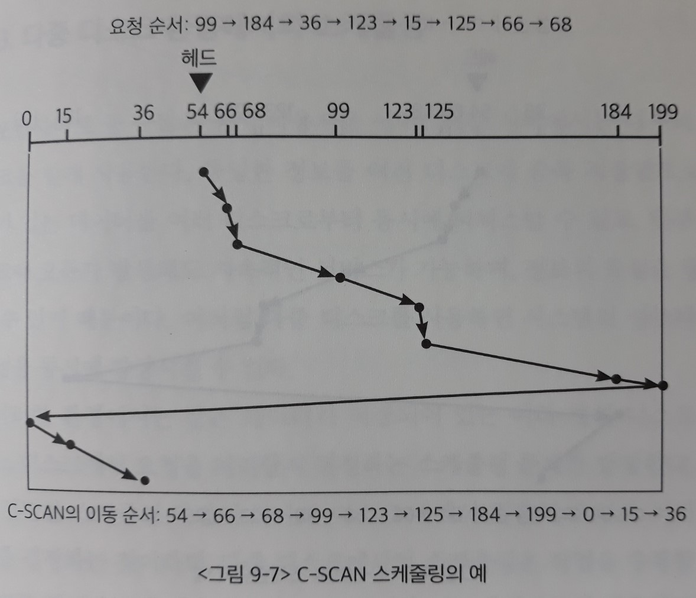

- 현재 디스크 헤드가 54번 실린더이고 디스크 헤드가 199번 실린더 방향으로 이동하고 있는 경우, 가는 길목에 존재하는 모든 실린더 위치에 들어온 요청을 처리한다.

- 199번 실린더에 도착한 후에는 이동 방향을 바꾸어 출발점으로 이동한 후, 다시 199번 실린더를 향해 이동하면서 가는 길목에 존재하는 모든 요청들을 차례로 처리한다.

  => 총 헤드가 이동한 거리는 380이 된다.

### 5) N-SCAN 알고리즘

- `SCAN`의 변형 알고리즘
- 일단 arm이 한 방향으로 움직이기 시작하면(출발)
  - 출발하기 전에 큐에 도착한 job들은 처리하면서 이동한다.
  - 출발 이후, 이동하는 도중에 도착한 job들은 처리하지 않고 되돌아올 때 처리한다.

이 방식은 `SCAN`과 이동거리는 같지만, 각 실린더 위치에 대해 좀 더 **균일한 탐색시간**을 제공한다. 

=> **위치에 따른 `탐색시간의 편차`를 줄일 수 있다**.

### 6) LOOK과 C-LOOK 알고리즘

> `SCAN`과 `C-SCAN`을 개선한 알고리즘

- LOOK 알고리즘

  : `SCAN 알고리즘`과 달리, 헤드가 한쪽 방향으로 이동하다가 **그 방향에 더 이상 대기 중인 요청이 없으면 헤드의 이동 방향을 즉시 반대로 바꾸는** 스케줄링 방식

  => 헤드가 진행하는 방향에 요청이 있는지를 살핀 후 이동하기 때문에 `LOOK`이라고 부른다.

- C-LOOK 알고리즘

  : 전방에 요청이 없을 때 방향을 바꾸는 것은 `LOOK 알고리즘`과 같지만, `C-SCAN`처럼 **한쪽 방향으로 이동할 때에만 요청을 처리**하는 스케줄링 방식

**[C-LOOK 스케줄링의 예]**

- 입출력 요청이 들어온 실린더 위치: 99, 184, 36, 123, 15, 125, 66, 68

- 실린더 개수 200개

- 실린더 0: 디스크 원판의 가장 안쪽 실린더

  실린더 199: 가장 바깥쪽 실린더

  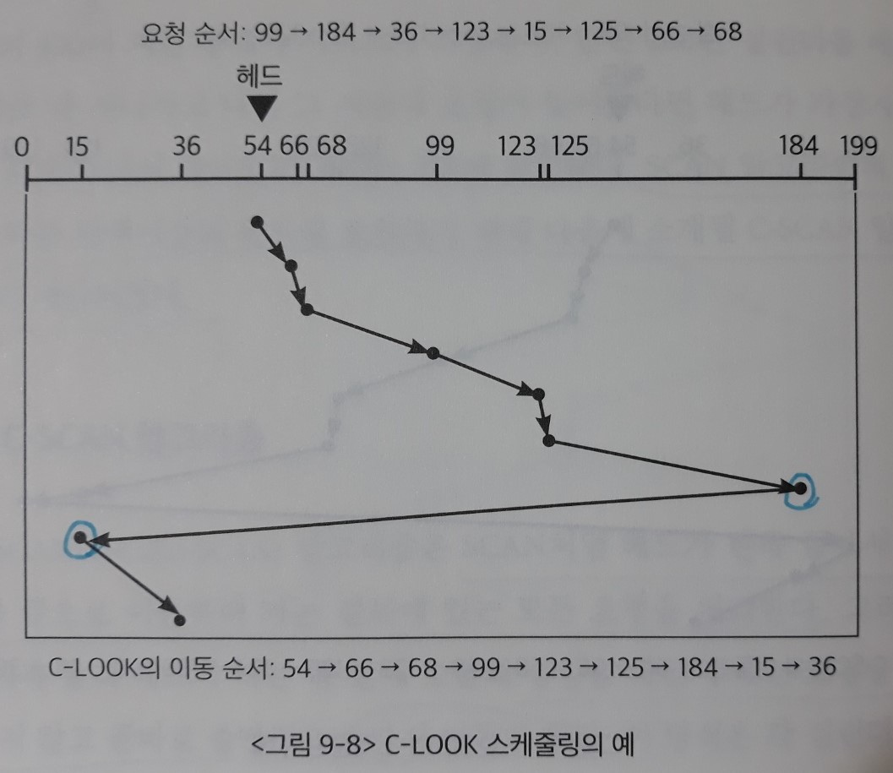

- 현재 디스크 헤드가 54번 실린더이고 디스크 헤드가 199번 실린더 방향으로 이동하고 있는 경우, 가는 길목에 존재하는 모든 실린더 위치에 들어온 요청을 처리한다.

  이때 헤드가 184번 실린더까지 이동한 후, 전방에 더 이상의 요청이 없으므로 199번까지 가는 대신 곧바로 방향을 바꾼다.

- 또한 헤드가 반드시 0번 출발점까지 이동하는 것이 아니라, 요청이 존재하는 가장 낮은 실린더 번호까지만 이동해 서비스를 시작한다.

  다시 199번 실린더를 향해 이동하면서 가는 길목에 존재하는 모든 요청들을 차례로 처리한다.
  
  => 총 헤드가 이동한 거리는 320이 된다.

### 디스크 스케줄링 알고리즘의 결정

> 디스크 입출력이 많은 시스템에서는 `SCAN`, `C-SCAN` 및 이들을 좀 더 개선한 `LOOK`, `C-LOOK` 등의 스케줄링 알고리즘이 `FCFS`나 `SSTF`에 비해 더 효율적인 것으로 알려져 있다.
>
> => 헤드의 이동 거리를 줄일 수 있기 때문이다.

- **File의 할당 방법**에 따라 디스크 스케줄링의 성능에 영향을 미친다.

  - 연속 할당/ 연결 할당/ 인덱스 할당

- `디스크 스케줄링 알고리즘`은 필요할 경우 다른 알고리즘으로 쉽게 교체할 수 있도록, **`운영체제`와 별도의 모듈로 작성되는 것이 바람직하다**.

  - `File 할당 방법`에 따라 알고리즘이 달라질 수도 있기 때문

- 현대의 컴퓨터에서는 디스크 스케줄링을 할 때, 때마다 개별적인 요청을 처리하기 보다는 **여러 요청들을 묶어서(merge) 한꺼번에 처리**한다.

  => 디스크 I/O의 `효율성`이 높아진다.

## 3. 다중 디스크 환경에서의 스케줄링

- 다중 디스크 환경

  : 다수의 디스크를 함께 사용하는 환경

  - 수많은 동시 사용자를 서비스하는 서버 (ex. 포털사이트)

  => **다중 디스크**를 사용하면 시스템의 `성능`과 `신뢰성`을 동시에 향상시킬 수 있다.

  - 성능
    - <u>동일한 정보를 여러 디스크에 중복 저장</u>함으로써 인기 있는 데이터를 여러 디스크로부터 **동시에 서비스**할 수 있다.
  - 신뢰성
    - 일부 디스크에 오류가 발생해도 지속적인 서비스가 가능함
    - 일부 디스크에 오류가 발생해도 정보의 유실을 방지할 수 있음

- 다중 디스크 환경에서의 스케줄링

  : `다중 디스크 환경`에서는 **<u>같은 데이터가 저장되어 있는 여러 개의 디스크</u> 중 어느 디스크에서 요청을 처리할지 결정**하는 스케줄링 문제가 추가로 발생한다.

  ​	= 하나의 디스크 내에서 입출력 요청의 처리 순서를 결정하는 문제 + 작업을 수행할 디스크를 결정하는 문제

  `다중 디스크 환경`에서는 **스케줄링의 목표**에 따라 요청을 처리할 디스크를 결정하는 기준이 달라진다.

  1. 탐색 시간(seek time)을 줄이는 것이 목표인 경우

     : **헤드의 현재 위치가 요청한 데이터와 가장 가까운 디스크를 선택**하는 방법을 사용할 수 있다.

  2. 많은 요청을 동시에 처리할 수 있는 `확장성(scalability)` 있는 서비스가 목표인 경우

     > `다중 디스크 시스템`의 가장 큰 목표는, 다수의 사용자가 오래 기다리지 않고 빠른 서비스를 받을 수 있도록 하는 시스템의 `확장성`에 있다.

     : 각 디스크 간의 **부하균형(load balancing)**을 이루도록 스케줄링한다. 일부 디스크가 과부하 상태에 이르지 않고, 모든 디스크에 요청이 골고루 분배되어야 하기 때문이다.

  3. 전력 소모를 줄이는 것이 목표인 경우

     - 최근에 디스크 관리의 또 다른 중요한 목표로 인식되고 있다.

     - 부하편향 기법

       : 전력 절감 측면에서는 모든 디스크에 요청을 골고루 분산시키기(`부하균형`)보다는, **일부 디스크에 요청을 집중시키고 나머지 디스크는 회전을 정지(`휴면 상태`)시키는 것**이 더 효과적이다.

       > 일부 디스크만으로 요청을 충분히 처리할 수 있을 정도로 **요청이 빈번하지 않은 상황에 한해서 성립**한다.

초고층 빌딩의 `그룹 엘리베이터 시스템`에서 사용하는 `엘리베이터 스케줄링`과 유사하다.

- 그룹 엘리베이터 시스템

  : 이웃한 여러 대의 엘리베이터가 독립적으로 운영되는 것이 아니라, **동일한 제어 시스템에 의해 공동으로 운영**되는 일련의 엘리베이터 그룹

### RAID

- RAID (Redundant Array of Independent Disks)

  - 여러 개의 디스크를 묶어서 사용

- RAID의 사용 목적

  - 디스크 처리 속도 향상

    - 여러 디스크에 block의 내용을 **분산 저장**
    - 병렬적으로 읽어 옴 (`interleaving`, `striping`)

  - 신뢰성(reliability) 향상

    - 동일 정보를 여러 디스크에 **중복 저장**

    - 하나의 디스크가 고장(failure)시 다른 디스크에서 읽어옴

      (`Mirroring`, `shadowing`)

    - 단순한 중복 저장이 아니라 일부 디스크에 `parity`(오류 확인)를 저장하여 공간의 효율성을 높일 수 있다.

  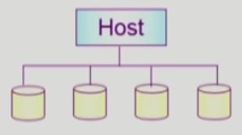

## 4. 디스크의 저전력 관리

### 1) 비활성화 기법

- 디스크의 상태

  : 디스크의 상태는 **전력 소모를 기준으로** 크게 네 가지 상태로 나누어 볼 수 있다.

  => 편의상 디스크가 회전 중인 상태를 `활성 상태`라고 부르고, 디스크가 정지한 상태를 `비활성 상태`라고 부르기로 한다.

  - 활성 상태
    - 활동(active) 상태

      : 디스크가 회전 중이고, 현재 헤드가 데이터를 읽거나 쓰고 있는 상태

    - 공회전(idle) 상태

      : 디스크가 회전 중이지만, 데이터를 읽거나 쓰지는 않는 상태

  - 비활성 상태

    - 준비(standby) 상태

      : 디스크가 회전하지 않지만, 인터페이스가 활성화된 상태

    - 휴면(sleep) 상태

      : 디스크가 회전하지 않고, 인터페이스도 비활성화된 상태

디스크가 회전하고 있는 `활성 상태`보다는 정지하고 있는 `비활성 상태`에서 전력 소모가 적으므로, **요청이 없을 경우 디스크를 정지시키는 것이 전력 절감 측면에서 효과적**이다.

=> 그러나 각 `상태`로 전환할 때는 부가적인 전력 및 시간이 소모된다.

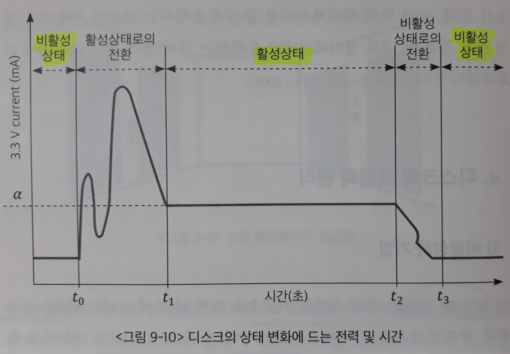

> 따라서 **후속 요청까지의 시간 간격이 `일정 시간(break-even time, 손익분기점)` 이상일 경우에만 디스크의 회전을 정지**시키는 것이 전력 소모를 절감하는 데 효과적이다.
>
> => 장치를 `비활성화`할 시점을 결정하기 위해 **미래의 요청이 도착하는 시점과 간격**을 정확히 `예측`하는 것이 중요하다.

- 디스크를 `비활성화`하는 시점을 결정하는 방법

  - 시간기반(timeout based) 기법

    : **일정 시간** 동안 디스크가 `공회전 상태`이면 장치를 정지시켰다가, 다시 요청이 왔을 때 디스크를 활성화한다.

  - 예측기반(prediction based) 기법

    : **과거 요청을 관찰하여 다음 `공회전` 구간의 길이를 예측**한 후, 디스크를 `비활성화`할 시점을 결정한다.

  - 확률기반(stochastic based) 기법

    : 디바이스의 상태변경 시간 간격을 구하기 위해 **확률분포를 통해 요청을 모델링**하여, `마르코프 체인(Markov chain)` 등과 같은 **통계적 모델**을 이용한다. 

### 2) 회전속도 조절 기법

디스크의 전력 소모를 줄이기 위한 방법으로, 최근에는 **`디스크의 회전속도(Rotations Per Minute: RPM)`를 가변적으로 조절하는 기법**이 제안되었다.

**디바이스 수준에서 이러한 기능이 지원됨**에 따라, `운영체제`에서는 전력 소모를 최소화하기 위해 `디스크의 회전속도`를 관리하는 `지능형 전력 관리 기법`에 대한 연구가 이루어지고 있다.

- `운영체제`는 시스템 자원과 부하를 포괄적으로 볼 수 있기 때문에, 하드웨어 혼자서 전력 관리를 하는 것에 비해 더 많은 전력 절감 효과를 얻을 수 있다.
- 최근에는 워크로드의 특성을 활용해 `회전속도`를 조절하려는 시도가 이루어지고 있다.

**[멀티미디어 환경에서의 저전력을 위한 디스크 스케줄링]**

`멀티미디어 환경`에서는 시간에 따른 **순차적인 데이터 접근**이 이루어지므로 `주기성`과 `규칙성`이 있다. 

=> 따라서 미래의 참조에 대한 예측이 비교적 정확하게 이루어질 수 있으므로, `저전력을 위한 디스크 스케줄링`의 효과가 뛰어나다.

### 3) 디스크의 데이터 배치 기법

디스크의 `용량`은 매년 빠른 속도로 증가하고 있으나, 디스크의 `접근 속도`는 **기계적 메커니즘**으로 인해 그다지 큰 발전이 없다.

디스크 내의 빈 공간에 데이터의 복제본(replica)을 많이 만들어 헤드 위치에서 가까운 복제본에 접근하도록 하는 기법 등이 제안되었다.

### 4) 버퍼캐싱 및 사전인출 기법

디스크가 `저전력 모드`일 때는 입출력 처리를 최대한 지연시켰다가, 디스크가 `정상 전력 모드`로 돌아왔을 때 **사전인출(prefetching)**을 공격적으로 함으로써 `디스크의 상태 변화 횟수`를 최소화하는 방법이 연구된 바 있다.

### 5) 쓰기전략을 통한 저전력 디스크 기법

저장장치의 데이터에 대한 `쓰기 전략(write strategy)`을 통해 전력 소모를 줄이는 기법도 제안되고 있다.

- write-back with eager updates

  : 대상 디스크가 `비활성 상태`일 때에는 디스크 쓰기를 하지 않고 기다렸다가, 디스크가 `활성 상태`로 돌아왔을 때 쓰는 방식

- write-through with deferred update

  : 대상 디스크가 `비활성 상태`일 때에는 일단 블록들을 **로그 디스크**에 썼다가, 디스크가 `활성 상태`로 돌아왔을 때 쓰는 방식

## 5. Swap-Space Management

- 디스크를 사용하는 두 가지 이유

  - 메모리의 volatile한 특성 -> `file system`
  - 프로그램 실행을 위한 메모리 공간 부족 -> `swap space (swap area)`

- file system

  - 기본적으로 512 byte의 `섹터` 단위로 데이터 저장
  - **공간 효율성**을 높이는 저장 방식을 사용한다.
    - 연속 할당, 연결 할당, 인덱스 할당
    - UNIX 파일시스템, FAT 파일시스템

- Swap-space

  - `가상 메모리 시스템`에서는 디스크를 **메모리의 연장 공간**으로 사용

  - `파일시스템` 내부에 둘 수도 있으나, 별도 partition 사용이 일반적

    - 프로세스 주소 공간

      : 일반 파일보다 훨씬 짧은 시간만 존재하고, 자주 참조됨

    - 공간 효율성보다는 **속도 효율성**이 우선

      : 디스크 접근 시간의 대부분을 차지하는 `seek time`을 줄여야 한다.

    => 따라서 <u>block의 크기 및 저장 방식</u>이 `일반 파일시스템`과 다르다.

    - **큰 단위로 데이터를 저장하고 순차적으로 할당**

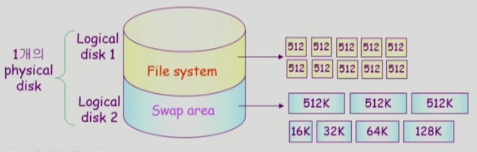