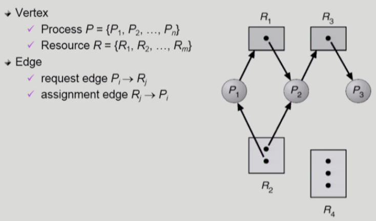
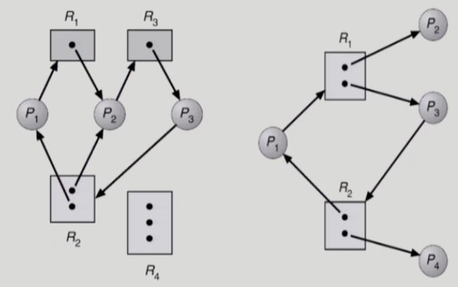
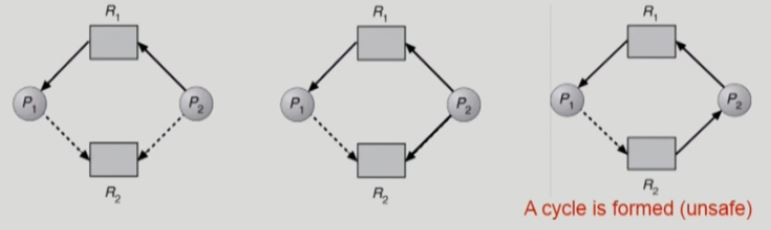

# Deadlock

- 교착상태(Deadlock)

  : 일련의 프로세스들이 **서로가 가진 자원을 기다리며 `block`된 상태**

  > `critical section 문제`는 **코드**에 대한 문제이고, 
  >
  > `deadlock 문제`는 **자원**에 대한 문제이다.

- 자원(resource)
  - 하드웨어, 소프트웨어 등을 포함하는 개념
  - ex) I/O device, CPU cycle, memory space, semaphore 등
  - 프로세스가 자원을 사용하는 절차
    1. 요청(Request)
    2. 할당(Allocate)

    3. 사용(Use)

    4. 반납(Release)

- 예1)

  - 시스템에 2개의 tape drive가 있다.
  - 프로세스 P1과 P2 각각이 하나의 tape drive를 보유한 채 다른 하나를 기다리고 있다.

- 예2)

  - Binary semaphores A and B

    ``` c
    P0	<-- CPU제어권 -->	P1
    ==============================
    P(A);				P(B);		// 각자 자원을 하나씩 차지하고
    P(B);				P(A);		// 상대방 것을 요구한다.
    ...					...
    V(S);				V(Q);		// P0는 B까지 전부 획득한 후에야 S를 내놓을 수 있다. 
    V(Q);				V(S);
    ```

## 1. Deadlock 발생의 4가지 조건

> 이 4가지 조건이 deadlock의 **필요 충분 조건**인지는 교수님도 모른다고 함.
>
> 다만 오래 전부터 학문적으로 정의되어 왔다.

- 상호 배제(Mutual exclusion)

  : 매 순간 하나의 프로세스만이 자원을 사용할 수 있음

  독점적으로 사용하는 자원이어야만 Deadlock이 발생할 수 있다.

- 비선점(No preemption)

  : 프로세스는 자원을 스스로 내어놓을 뿐 **강제로 빼앗기지 않음**

  가진 자원은 빼앗기지 않으면서 추가적인 자원을 요청하기 때문에 Deadlock이 발생한다.

- 보유대기(Hold and wait)

  : **자원을 가진 프로세스가 다른 자원을 요청**할 때 보유 자원을 <u>내어놓지 않고</u> 계속 가지고 있음

  - `보유대기`는 자원을 스스로 내어놓지(Release) 않는다는 점에 초점을 맞춘 조건이다. 

  - Release와 preemption은 다르다. Release는 주체 프로세스가 자기 자신이고, preemption은 주체가 다른 프로세스다. 

    빼앗기는 것이 가능한지 아닌지에 대한 언급은 없다는 점에서 `비선점` 조건과 비교된다.

- 순환대기(Circular wait)

  : 자원을 기다리는 프로세스 간에 **사이클**이 형성되어야 함

  - 프로세스 P0, P1, ... , Pn이 있을 때

    P0은 P1이 가진 자원을 기다림

    P1은 P2가 가진 자원을 기다림

    ...

    Pn-1은 Pn이 가진 자원을 기다림

    Pn은 P0이 가진 자원을 기다림


## 2. Resource-Allocation Graph(자원할당 그래프)

deadlock이 발생했는지 알아보기 위해 **자원할당 그래프**를 그려서 확인한다.



원은 프로세스, 사각형은 자원을 나타낸다.

사각형 안의 점은 **자원의 개수(인스턴스)**를 나타낸다.

화살표는 2가지 종류가 있다.

- 자원 -> 프로세스

  : 자원이 프로세스에 속해 있다. 이 프로세스가 자원을 점유하고 있다.

- 프로세스 -> 자원

  : 프로세스가 자원을 `요청(request)`했는데 아직 `할당(allocate)`되지 않은 상태

deadlock인가?

- 프로세스 P1은 2번 자원을 가지고 있으면서 1번 자원을 요청하고 있다.

  그런데 그 1번 자원은 프로세스 P2가 갖고 있다.

- 프로세스 P2는 1번 자원과 2번 자원을 가지고 있으며, 3번 자원을 요청하고 있다.

  그런데 그 3번 자원은 프로세스 P3가 갖고 있다.
  
  => **사이클**이 없으므로 deadlock이 아니다.

**[deadlock 탐지]**



- 그래프에 cycle이 없으면 deadlock이 아니다.
- 그래프에 cycle이 있으면
  - 자원 당 인스턴스(개수)가 1개씩밖에 없다면, deadlock이 발생한 것이다.
  - 자원 당 인스턴스(개수)가 여러개이면, deadlock일 수도 있고 아닐 수도 있다.
    - **해당 자원을 포함하는 cycle의 수 = 그 자원의 인스턴스 개수** 이면 deadlock이다. 
      - `왼쪽 그래프`의 R2는 인스턴스가 2개 있지만 R2를 포함하는 사이클도 2개 이므로 더 이상 진행이 불가능하다.
    - `오른쪽 그래프`는 P2, P4가 각 자원을 쓰고 나서 반납하면 사이클이 사라지므로 deadlock이 아니다.

> 그래프로 deadlock을 탐지하기는 어려우므로, 뒤에서 **테이블** 형태로 확인하는 방법을 사용한다.
>
> **=> Banker's Algorithm**

## Deadlock의 처리 방법

deadlock에 대한 강한 처리 방법 순으로 나열하면 다음과 같다.

위의 2개 방법은 deadlock이 생기지 않도록 예방하는 방법, 아래 2개 방법은 deadlock이 생기는 것을 허용하는 방법이다.

- Deadlock Prevention

  : 자원 할당 시 `Deadlock의 4가지 필요 조건` 중 **어느 하나가 만족되지 않도록 하는 것**

- Deadlock Avoidance

  : `자원 요청에 대한 부가적인 정보`를 이용해서 **deadlock의 가능성이 없는 경우에만 자원을 할당**

  `시스템 state`가 원래  state로 돌아올 수 있는 경우에만 자원 할당

- Deadlock Detection and recovery

  : Daedlock 발생은 허용하되 그에 대한 **`detection 루틴`을 두어 deadlock 발견시 recover**

- Deadlock Ignorance
  
  - Daedlock을 시스템이 책임지지 않음
  - UNIX를 포함한 **대부분의 현대 OS가 채택**

> 현대의 운영체제 대부분이 `Deadlock Ignorance` 방법을 채택하고 있다.
>
> 사용자가 프로세스를 실행하다가 느려지거나 이상 현상이 발생하면 종료해야 한다.
>
> => **deadlock은 빈번히 발생하는 현상이 아니기 때문에**, 미연에 방지하기 위한 많은 오버헤드를 감수하는 것은 비효율적이라서 아무 조치도 취하지 않는 것이다.

### 1) Deadlock Prevention

자원 할당 시 `Deadlock의 4가지 필요 조건` 중 **어느 하나가 만족되지 않도록 하여** deadlock의 발생을 원천 차단하는 것이다.

- Mutual Exclusion

  : 공유해서는 안되는 자원의 경우 반드시 성립해야 하는 조건이므로, **막을 수 있는 조건이 아니다**.

- Hold and Wait

  : 프로세스가 **자원을 요청할 때 다른 어떤 자원도 가지고 있지 않아야 한다**.

  - 방법 1) 프로세스 시작 시, 일생주기 동안 필요로 하는 모든 필요한 자원을 할당받게 하는 방법
    - 모든 자원을 hold 하므로 wait 할 일이 없으므로 daedlock이 발생하지 않는다.
    - 자원에 대한 비효율성
  - 방법 2) 자원이 필요한 경우 보유 자원을 모두 놓고 다시 요청
    - 어떤 자원도 hold하지 않고 wait 하므로, 다른 프로세스는 필요한 자원을 전부 얻을 수 있으므로 daedlock이 발생하지 않는다.
    - preemption이 아니라 자진해서 내어놓는(release) 방법이다.

- No Preemption

  : 프로세스가 어떤 자원을 **기다려야 하는 경우 이미 보유한 자원이 선점됨(Preemption이 가능하게 함)**

  모든 필요한 자원을 얻을 수 있을 때 그 프로세스는 다시 시작된다.

  - `State(자원의 현재 상태)`를 쉽게 save하고 restore할 수 있는 자원에서 주로 사용 (CPU, memory)
    - CPU - 주로 preemptive scheduling을 사용(타이머 인터럽트). PCB로 프로세스의 `state`를 저장함

- Circular wait

  : 모든 자원 유형에 **할당 순서**를 정하여 정해진 순서대로만 자원 할당

  `cycle`이 형성되는 것을 방지한다. 

  - ex) 순서가 3인 자원 Ri를 보유 중인 프로세스가 순서가 1인 자원 Rj를 할당받기 위해서는 우선 Ri를 release해야 한다.

장점

- Daedlock의 발생을 원천적으로 차단할 수 있다.

단점

- 자원에 대한 이용률(Utilization) 저하
- 전체 시스템의 성능(throughput) 감소
- starvation 문제가 발생할 수 있음

=> deadlock은 빈번히 발생하는 현상이 아니기 때문에, 이러한 오버헤드를 두는 것은 **비효율적**이다.

### 2) Deadlock Avoidance

`자원 요청에 대한 부가적인 정보`를 이용해서 **자원 할당이 deadlock으로부터 `안전(safe)`한지를 <u>동적으로 조사해서</u> 안전한 경우에만 할당**한다.

> 가장 단순하고 일반적인 모델은 **프로세스들이 필요로 하는 `각 자원별 최대 사용량`을 미리 선언하도록 하는 방법**이다.

- safe state

  : 시스템 내의 프로세스들에 대한 `safe sequence`가 존재하는 상태

- safe sequence

  : 프로세스의 sequence <P1, P2, ... , Pn>가 `safe`하려면 **Pi(1 ≤ i ≤ n)의 자원 요청이 "가용자원 + 모든 Pj (j < i)의 보유 자원"에 의해 충족**되어야 함

  - 조건을 만족하면 다음 방법으로 모든 프로세스의 수행을 보장한다.
    - Pi의 자원 요청이 즉시 충족될 수 없으면 **모든 Pj(j < i)가 종료될 때까지 기다린다**.
    - Pi-1이 종료되면 Pi의 자원요청을 만족시켜 수행한다.

**[2가지 경우의 avoidance 알고리즘]**

시스템이 `safe state`에 있으면

=> deadlock 발생 x

시스템이 `unsafe state`에 있으면

=> deadlock이 발생할 가능성이 있다.

- Deadlock avoidance

  : 시스템이 `unsafe state`에 들어가지 않는 것을 보장하는 알고리즘

  - 2가지 경우의 avoidance 알고리즘
    1. 자원의 인스턴스가 자원 당 하나씩만 존재할 때
       - Resource Allocation Graph algorithm 사용
    2. 자원의 인스턴스가 자원 당 여러개가 존재할 때
       - Banker's Algorithm 사용

**[Resource Allocation Graph algorithm]**

앞에서 보았던 `자원할당 그래프`에 claim edge라는 개념이 추가되었다.

- request edge (프로세스 -> 자원)

  : 프로세스가 자원을 `요청(request)`했는데 아직 `할당(allocate)`되지 않은 상태

- assignment edge (자원 -> 프로세스)

  : 자원이 프로세스에 속해 있다. 이 프로세스가 자원을 점유하고 있다.

- claim edge (Pi -> Ri)

  - 프로세스 Pi가 **자원 Ri를 미래에 요청할 수 있음**을 뜻함 (`점선`으로 표시)
  - 프로세스가 **해당 자원 요청시** `request edge`로 바뀜 (`실선`)
  - Rj가 **release 되면** `assignment edge`는 다시 `claim edge`로 바뀐다.

- request edge를 assignment edge로 변경하는 경우를 확인하여 **(점선을 포함하여) cycle이 생기지 않는 경우에만 요청 자원을 할당**한다.

  - 아래 그림에서 P2 -> R2의 claim edge가 자원을 요청하는 시점이 되어 request edge로 바뀌었다.

    그런데 만약 이 자원을 실제로 할당하여 request edge를 assignment edge로 바꾸어 보면, R2 -> P2 방향의 화살표가 되므로 <u>점선을 포함하여 cycle이 생긴다</u>.

  - 따라서 `unsafe` 상태가 되므로 미래에 deadlock이 발생할 가능성이 있다.

    deadlock avoidance는 최악의 상황, 즉 P1이 R1을 요청하여 deadlock이 발생할 수 있는 상황을 가정하는 알고리즘이므로 P2에게 R2 자원을 할당하지 않는다.

  
  
  - 언젠가 P1이 R2를 할당받아서(cycle이 발생하지 않으므로) 작업을 완료하고 자원을 모두 내려놓으면, 그 다음에 P2가 자원을 다시 할당받아서 작업을 완료할 수 있다. 

cycle 생성 여부 조사시 프로세스의 수가 n일 때 `O(n^2)` 시간이 걸린다.

**[Banker's Algorithm]**

- 가정
  - 모든 프로세스는 `자원의 최대 사용량`을 미리 명시
  - 프로세스가 요청 자원을 모두 할당받은 경우 **유한 시간 안에 이들 자원을 다시 반납**한다.
- 방법
  - **기본 개념: 자원 요청시 `safe` 상태를 유지할 경우에만 할당**
    - 총 요청 자원의 수가 가용 자원의 수보다 적은 프로세스를 선택 (그런 프로세스가 없으면 `unsafe` 상태)
    - 그런 프로세스가 있으면 그 프로세스에게 자원을 할당
  - 할당받은 프로세스가 종료되면 모든 자원을 반납
  - 모든 프로세스가 종료될 때까지 이러한 과정을 반복


> Banker's algorithm은 자원이 요청될 때, 그 요청을 받아들일 것인지 아닌지에 대해서만 결정한다.
>
> - Deadlock avoidance 알고리즘은 **자원 할당이 deadlock으로부터 `안전(safe)`한지를 <u>동적으로 조사해서</u> 안전한 경우에만 할당**

- Available = instances - ΣAllocation
- P1이 **미래에 추가로 요청할 최대 자원의 개수(Need)** [1, 2, 2]는, **현재 가용 자원의 개수(Available)** [3, 3, 2]보다 작으므로 자원을 할당한다.
- 반면에 P0이 현재 [0, 2, 0]을 요청하면 Available 자원이 남아있지만, **미래에 추가로 요청할 최대 자원의 개수(Need)** [7, 4, 3]이 **현재 가용 자원의 개수(Available)** [3, 3, 2]보다 크므로 자원을 할당하지 않는다.
  - 자원을 할당하고 바로 다음 순간에 Need [7, 2, 3]을 요청한다면 deadlock이 발생할 수 있기 때문이다.

=> Need ≤ Available 을 만족해야만 `safe`하므로 자원을 할당할 수 있다.

- 안전한 이유?

  : 필요한 자원(Need)을 모두 할당 받을 수 있기 때문에 deadlock의 `hold and wait` 조건을 만족하지 않는다.

  hold만 하고 자원을 위해 wait 하는 상황이 발생하지 않기 때문이다. 

### 3) Deadlock Dection and Recovery

### 4) Deadlock Ignorance

