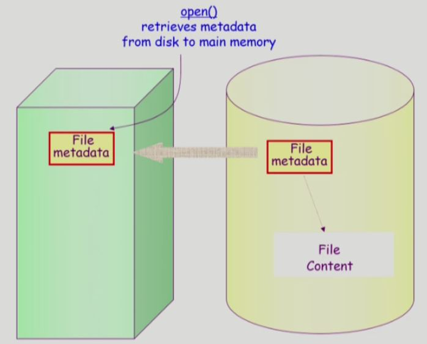
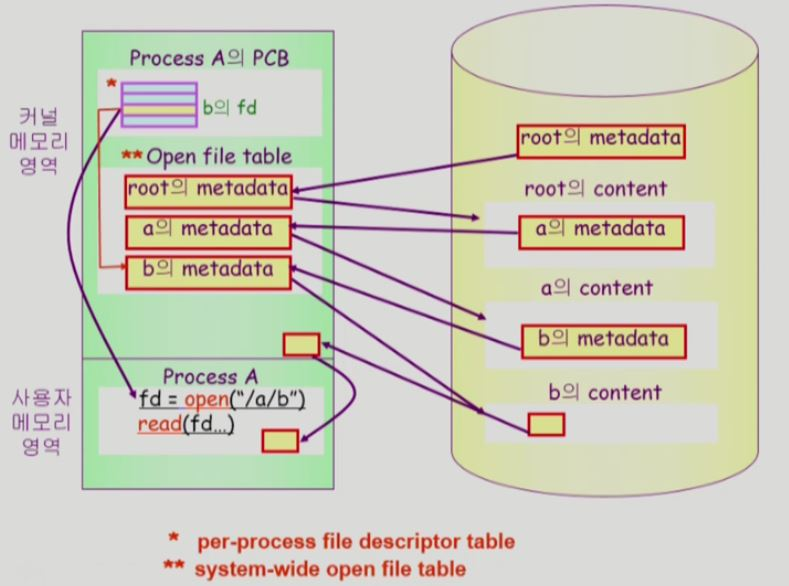
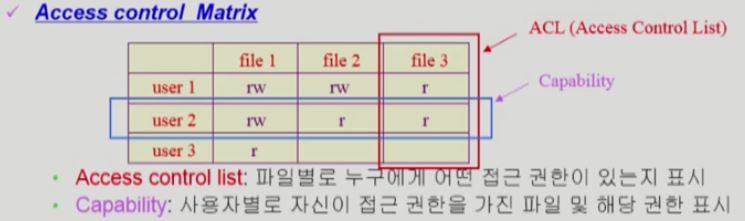
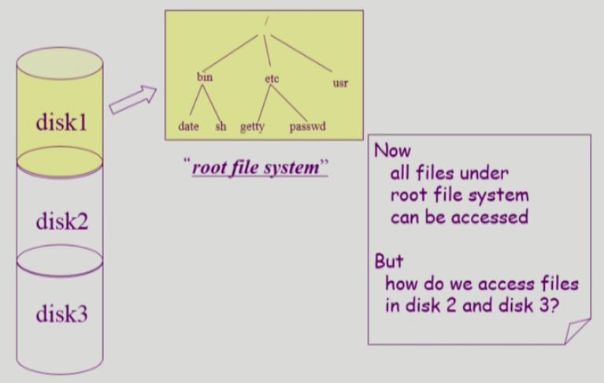
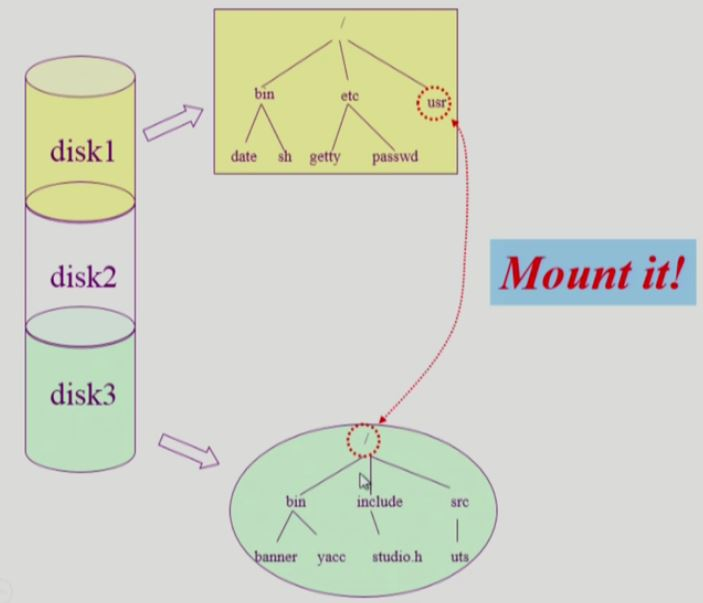

# File Systems

- 메모리 시스템 - 메모리는 **주소**를 통해 접근하는 `저장 장치`이다.

- 파일 시스템 - 파일은 **이름**을 통해 접근하는 `저장 단위`이다. 일반적으로 디스크에 저장된다.

  > `파일`의 정의 - "A named collection of related information"
  >
  > 즉 관련 정보를 **이름**을 통해서 저장하는 것을 `파일`이라고 한다.

- 데이터를 저장하는 목적 외에도, 리눅스와 같은 `운영체제`에서는 여러가지 장치들도 `파일`이라는 **"이름"**을 사용해서 관리한다.

  => 장치별로 다른 파일로 관리**(device special file)**

## 1. File and File System

- File

  - 정의 - "A named collection of related information"

  - 일반적으로 비휘발성의 **보조기억장치**에 저장

    - ex) 하드디스크

  - `운영체제`는 <u>다양한 저장 장치</u>를 **file이라는 동일한 논리적 단위**로 볼 수 있게 해줌

  - 연산(Operation)

    - create, delete 

      : 파일 생성/삭제

    - read, write 

      : 파일 읽기/쓰기

    - reposition (lseek) 

      : 파일은 매우 크기 때문에 어느 위치를 읽거나 쓸 것인지 가리키는 `포인터`가 있다. 

      `포인터`는 원래 읽거나 쓰면 자동으로 다음 위치를 가리키게 되는데, `reposition 연산`은 이 `포인터`의 위치가 원하는 곳을 가리키도록 바꿔준다.

    - open, close 

      : read, write 이전에 반드시 파일을 open을 하도록 `인터페이스`가 정의되어 있다. 

      더 이상 파일에 작업할 일이 없으면 파일을 close해야 한다.

      > open과 close가 따로 정의되어야 하는 이유는 이후에 설명한다.
      >
      > - open: 디스크에서 메모리로 **파일의 내용**을 올려놓는 것이 아니라, 파일의 **메타 데이터**를 `메모리`에 올려 놓는 작업을 한다.

- File attribute (파일의 meta data)

  - 파일 자체의 내용이 아니라 **파일을 관리하기 위한 각종 정보들**
    - 파일 이름, 유형, 저장된 위치, 파일 사이즈
    - 접근 권한(읽기/쓰기/실행), 시간(생성/변경/사용), 소유자 등

- File system

  - `운영체제`에서 파일을 관리하는 부분**(SW)**
  - 파일 및 파일의 메타데이터, 디렉토리 정보 등을 저장 및 관리
    - 대부분의 파일시스템이 **디렉토리**를 제공하여 1차원적이 아니라 `계층적`으로 저장한다.
  - 파일의 저장 방법 결정
  - 파일 보호 등

### Directory and Logical Disk

- Directory

  - **파일의 메타데이터 중 일부를 보관**하고 있는 일종의 특별한 `파일`
    
    - 그 디렉토리에 속한 파일 이름 및 파일 attribute들을 저장함
    - `디렉토리`에 저장되지 않은 메타데이터는 다른 곳에 저장되기도 한다.
  - 연산(Operation)
    - search for a file, create a file, delete a file

      : 디렉토리에 속한 파일 찾기/생성/삭제
    - list a directory, rename a file, traverse the file system 

      : 디렉토리에 속한 파일의 목록을 보는것/ 파일 이름 바꾸기/ 파일 시스템 전체를 탐색하기

- Partition (= Logical Disk, 논리적 디스크)

  > `운영체제`가 보는 것은 **논리적 디스크(파티션)**이다.
  >
  > ex) 하나의 하드 디스크를 C 드라이브, D 드라이브 등의 논리적 디스크로 분할

  - 하나의 (물리적) 디스크 안에 여러 `파티션`을 두는게 일반적
  - 여러 개의 물리적인 디스크를 하나의 `파티션`으로 구성하기도 함
  - (물리적) 디스크를 파티션으로 구성한 뒤 각각의 `파티션`에 <u>file system</u>을 설치하거나 <u>swapping</u>(가상 메모리의 `swap area`로 사용) 등 다른 **용도**로 사용할 수 있음

### open()

파일의 **메타 데이터**를 `메모리`에 올려놓는 연산이다.

- 메타 데이터에는 **파일의 저장 위치**를 가리키는 `포인터`도 있다.

*물리적 메모리와 논리적 디스크*

- open("/a/b/c") - 디렉토리 경로가 `계층적`으로 구성되어 있는 경우의 open() 예

  - `디스크`로부터 **파일 c의 메타데이터**를 `메모리`로 가지고 오는 연산

  - 이를 위하여 directory path(디렉토리 경로)를 search

    1. 루트 디렉토리 "/"를 `open`하고 그 안에서 파일 "a"의 위치 획득

       > **루트 디렉토리의 <u>메타 데이터</u>의 위치는 알려져 있기 때문에**, 루트 디렉토리의 위치부터 경로를 따라가서 파일 c의 위치를 찾게 된다.

    2. 파일 "a"를 `open`한 후 `read`하여 그 안에서 파일 "b"의 위치 획득

    3. 파일 "b"를 `open`한 후 `read`하여 그 안에서 파일 "c"의 위치 획득

    4. 파일 "c"를 `open`한다

    => Directory path의 search에 너무 많은 시간 소요

    - **Open을 read/write와 별도로 두는 이유임**
    - <u>한 번 open한 파일은 read/write 시 directory search 불필요</u>

- Open file table

  - 현재 `open`된 파일들의 **메타데이터** 보관소 

  - 물리적 메모리에 저장

  - **global**한 `테이블(배열)`이 유지된다.

  - `디스크`의 메타데이터보다 몇 가지 정보가 추가됨

    - Open한 프로세스의 수

    - File offset: 각 프로세스가 파일의 어느 위치에 접근 중인지 표시

      **=> 각 프로세스가 접근하는 각 파일마다 offset을 저장하려면 별도의 테이블이 추가로 필요하다.**

- File descriptor (file handle, file control block)

  - Open file table에 대한 위치 정보
  - **프로세스마다 `File descriptor 테이블(배열)`이 하나씩 존재한다.**

**[파일 open과 read를 하는 과정]**

- file descriptor table - 프로세스마다 가지고 있다.
- open file table - open된 파일의 목록들을 시스템 전체적으로 관리한다. (파일의 **메타 데이터**)

> *운영체제의 구현에 따라서 테이블이 3종류 이상 존재하는 경우도 있다.
>
> **메타 데이터**가 `디스크`에 존재할 때에는 아래와 같은 정보들이 저장되어 있다.
>
> - 파일 이름, 유형, 저장된 위치, 파일 사이즈
> - 접근 권한(읽기/쓰기/실행), 시간(생성/변경/사용), 소유자 등
>
> 그런데 **메타 데이터**를 `메모리`에 올려놓게 되면 추가적으로 한 가지 메타 데이터가 더 필요하다.
>
> - 프로세스가 접근하고 있는 파일의 위치(= offset)
>
>   => **각 프로세스마다 파일에 대한 offset을 별개로 가지므로**, system-wide하게 **메타 데이터**를 저장하는 `open file table` 외에, 프로세스별 offset을 저장하는 `프로세스별 테이블`을 하나 더 두는 것이 일반적이다.

1. 사용자 프로그램이 open("/a/b")이라는 **I/O 시스템 콜**을 호출한다.

   - I/O 시스템 콜
     - open(), read(), write()

2. 그러면 CPU 제어권이 `운영체제`로 넘어가고, **`루트 디렉토리`의 메타 데이터의 위치는 알려져 있기 때문에** 루트 디렉토리의 메타 데이터를 먼저 `메모리`에 올린다.

   - 즉 root를 먼저 `open`한다.

3. root의 **메타 데이터를 통해 `루트 디렉토리`의 실제 위치를 찾는다**. 루트는 디렉토리 파일이기 때문에 파일의 내용은 '그 디렉토리에 속한 파일들의 메타 데이터'이다.

   그 중에 파일 a의 메타 데이터를 찾아서 메모리에 올린다. 

   - 즉 파일 a를 `open`한다.

4. a의 메타 데이터에는 a의 파일 시스템에서의 위치 정보가 들어있다. 따라서 a의 내용 중에는 또 b의 메타 데이터가 들어있다. 

   b라는 파일의 메타 데이터를 찾아서 메모리에 올린다. 

   - 즉 파일 a를 `read`하여 그 안에서 파일 "b"의 위치 획득한 후, 파일 b를 `open`한다.

5. > 각 프로세스마다 프로세스가 open한 파일들에 대한 메타 데이터를 가리키는 포인터들을 저장하는 배열이 정의되어 있다.

   - open("/a/b")이라는 **I/O 시스템 콜**이 리턴되면서 리턴값 = 파일 b의 메타 데이터를 가리키는 포인터가 저장된 배열 index = file descriptor

   - open을 했기 때문에 b 파일을 read/write 할 때 다시 루트 디렉토리로부터 b의 디스크 위치를 찾는 작업을 할 필요 없다.

     - b의 메타 데이터도 이미 메모리에 올라와 있으므로, 사용자 프로세스는 fd(배열의 index)라는 숫자만 가지고 read/write 요청을 할 수 있다.

       => read() 안의 인자로 파일 "이름"이 아니라 file descriptor를 인자로 한다.

6. 사용자 프로그램이 open("/a/b")이라는 **I/O 시스템 콜**을 호출한다.

7. CPU 제어권이 `운영체제`로 넘어가고, 해당 프로세스의 PCB로 가서 해당 file descriptor에 대응하는 파일의 메타 데이터를 open file table에서 찾는다. 메타 데이터에 저장되어 있는 파일 시작 위치로 가서 읽는다.

8. 사용자 프로그램에게 직접 전달하는 것이 아니라, `운영체제`가 먼저 자신의 커널 메모리 영역에 일부를 저장한다.

   그리고 사용자 프로그램에게 그 내용을 복사해서 전달한다.

   > Buffer Caching
   >
   > : 만약 이 프로그램이나 다른 프로그램이 동일한 파일의 동일한 위치를 read시스템콜 요청한다면, 디스크로 가지 않고 한번 읽어놓은 내용을 바로 전달한다.
   >
   > - 가상메모리 시스템 - 페이징 기법 - 이미 메모리에 올라와 있는 페이지에 대해서는 운영체제가 중간에 끼어들지 못하고, 주소변환을 HW가 하여 바로 접근. page fault일 때 CPU가 운영체제로 넘어가서 swap area에서 읽어옴
   >   - LFU, LRU 알고리즘을 못 쓰고 클락 알고리즘을 사용한다.
   > - 파일 시스템 - read/write - 버퍼 캐시 - 요청한 내용이 버퍼 캐시 안에 있든 없든간에 무조건 CPU 제어권이 운영체제로 넘어간다.
   >   - read/write는 I/O 시스템 콜이기 때문에 요청한게 있는지 없는지는 `운영체제`가 판단한다.
   >   - 따라서 Buffer Caching 환경에서는 모든 정보를 운영체제가 알고있기 때문에 LFU, LRU 알고리즘을 자연스럽게 사용할 수 있다.

### File Protection

> - Memory Protection
>   - 연산(read/write)에 대한 권한을 확인
>   - 메모리는 프로세스마다 별도로 가지고 있기 때문에 다른 프로세스가 접근할 수 없으므로, '누구'에 해당하는 권한은 따로 확인할 필요 없다.
>
> - File Protection
>   - 여러 사용자와 여러 프로세스가 파일을 사용할 수 있으므로 접근 권한이 누구에게 있는지, 어떤 연산이 가능한지의 두 가지를 확인해야 한다.

- 각 파일에 대해 누구에게 어떤 유형의 접근(read/write/execution)을 허락할 것인가?

- Access Control 방법

  1. Access control Matrix

     

     - 희소 행렬(sparse matrix)이 된다.
     - 파일의 개수는 매우 많은데, 특정 사용자가 본인만 사용하려고 만든 파일은 다른 사용자에게는 접근권한이 전혀 없을 것이다. 그런데 행렬의 칸을 전부 만들면 낭비가 된다.

     > 따라서 Linked list를 이용하는 두 가지의 방법이 있다. 주체가 누구냐에 따라서 한 가지 방법을 사용한다.
     >
     > - Access control list: 파일 중심
     > - Capability list: 사용자 중심
     >
     > => 이 방법도 부가적인 오버헤드가 너무 크다.

  2. Grouping

     > 일반적인 운영체제에서 사용
     >
     > 모든 사용자에 대해 다루는 것이 아니라 각각의 파일에 대해 사용자를 3가지로 구분한다.

     - 전체 user를 owner, group, public의 세 그룹으로 구분

       - owner - 파일의 소유자
       - group - 소유자와 동일 그룹에 속한 사용자
       - public - 나머지 전체 사용자

     - 각 파일에 대해 세 그룹의 접근 권한(rwx)을 3비트씩으로 표시

     - ex) UNIX. 각 파일마다 9개 bit로 표시

       

  3. Password

     - **파일마다 password**를 두는 방법 (디렉토리 파일에 두는 방법도 가능)

       - 모든 접근 권한에 대해 하나의 password

         : all-or-nothing

       - 접근 권한별 password

         : 암기 문제, 관리 문제

### File System의 Mounting

하나의 물리적 디스크를 파티셔닝을 통해서 여러 개의 논리적 디스크로 나눌 수 있다.

각각의 논리적 디스크에 파일 시스템을 설치하여 사용할 수 있다.

- 루트 파일 시스템(root file system)

  : 운영체제는 `루트 파일 시스템`을 통해서 "하나의 파일 시스템"에 접근할 수 있다.

  (`루트 디렉토리`와는 다르다!)

- 다른 파티션에 설치되어 있는 파일 시스템에 접근하려면?

- 마운팅(Mounting)

  : `루트 파일 시스템`의 특정 디렉토리에 또 다른 파티션의 파일 시스템을 마운팅하면, 

  그 디렉토리로 접근 = `마운팅 된 파일 시스템`의 루트 디렉토리에 접근

### Access Methods

- 시스템이 제공하는 파일 정보의 접근 방식
  - 순차 접근(sequential access)
    - 카세트 테이프를 사용하는 방식처럼 접근
    - 읽거나 쓰면 offset은 자동적으로 증가
  - 직접 접근(direct access, random access - 임의 접근)
    - LP 레코드 판, CD, 하드디스크와 같이 접근하도록 함
    - 파일을 구성하는 레코드를 임의의 순서로 접근할 수 있음

> 직접 접근이 지원되는 매체라도 관리를 어떻게 하느냐에 따라서 순차접근만 가능한 경우가 있다.

## 2. Allocation of File Data in Disk

## 3. Page Cache and Buffer Cache