# File Systems

- 메모리 시스템 - 메모리는 **주소**를 통해 접근하는 `저장 장치`이다.

- 파일 시스템 - 파일은 **이름**을 통해 접근하는 `저장 단위`이다. 일반적으로 디스크에 저장된다.

  > `파일`의 정의 - "A named collection of related information"
  >
  > 즉 관련 정보를 **이름**을 통해서 저장하는 것을 `파일`이라고 한다.

- 데이터를 저장하는 목적 외에도, 리눅스와 같은 `운영체제`에서는 여러가지 장치들도 `파일`이라는 **"이름"**을 사용해서 관리한다.

  => 장치별로 다른 파일로 관리**(device special file)**

## 1. File and File System

- File

  - 정의 - "A named collection of related information"

  - 일반적으로 비휘발성의 **보조기억장치**에 저장

    - ex) 하드디스크

  - `운영체제`는 <u>다양한 저장 장치</u>를 **file이라는 동일한 논리적 단위**로 볼 수 있게 해줌

  - 연산(Operation)

    - create, delete 

      : 파일 생성/삭제

    - read, write 

      : 파일 읽기/쓰기

    - reposition (lseek) 

      : 파일은 매우 크기 때문에 어느 위치를 읽거나 쓸 것인지 가리키는 `포인터`가 있다. 

      `포인터`는 원래 읽거나 쓰면 자동으로 다음 위치를 가리키게 되는데, `reposition 연산`은 이 `포인터`의 위치가 원하는 곳을 가리키도록 바꿔준다.

    - open, close 

      : read, write 이전에 반드시 파일을 open을 하도록 `인터페이스`가 정의되어 있다. 

      더 이상 파일에 작업할 일이 없으면 파일을 close해야 한다.

      > open과 close가 따로 정의되어야 하는 이유는 이후에 설명한다.
      >
      > - open: 디스크에서 메모리로 **파일의 내용**을 올려놓는 것이 아니라, 파일의 **메타 데이터**를 `메모리`에 올려 놓는 작업을 한다.

- File attribute (파일의 meta data)

  - 파일 자체의 내용이 아니라 **파일을 관리하기 위한 각종 정보들**
    - 파일 이름, 유형, 저장된 위치, 파일 사이즈
    - 접근 권한(읽기/쓰기/실행), 시간(생성/변경/사용), 소유자 등

- File system

  - `운영체제`에서 파일을 관리하는 부분**(SW)**
  - 파일 및 파일의 메타데이터, 디렉토리 정보 등을 저장 및 관리
    - 대부분의 파일시스템이 **디렉토리**를 제공하여 1차원적이 아니라 `계층적`으로 저장한다.
  - 파일의 저장 방법 결정
  - 파일 보호 등

### Directory and Logical Disk

- Directory

  - **파일의 메타데이터 중 일부를 보관**하고 있는 일종의 특별한 `파일`
    
    - 그 디렉토리에 속한 파일 이름 및 파일 attribute들을 저장함
    - `디렉토리`에 저장되지 않은 메타데이터는 다른 곳에 저장되기도 한다.
  - 연산(Operation)
    - search for a file, create a file, delete a file

      : 디렉토리에 속한 파일 찾기/생성/삭제
    - list a directory, rename a file, traverse the file system 

      : 디렉토리에 속한 파일의 목록을 보는것/ 파일 이름 바꾸기/ 파일 시스템 전체를 탐색하기

- Partition (= Logical Disk, 논리적 디스크)

  > `운영체제`가 보는 것은 **논리적 디스크(파티션)**이다.
  >
  > ex) 하나의 하드 디스크를 C 드라이브, D 드라이브 등의 논리적 디스크로 분할

  - 하나의 (물리적) 디스크 안에 여러 `파티션`을 두는게 일반적
  - 여러 개의 물리적인 디스크를 하나의 `파티션`으로 구성하기도 함
  - (물리적) 디스크를 파티션으로 구성한 뒤 각각의 `파티션`에 <u>file system</u>을 설치하거나 <u>swapping</u>(가상 메모리의 `swap area`로 사용) 등 다른 **용도**로 사용할 수 있음

### open()

파일의 **메타 데이터**를 `메모리`에 올려놓는 연산이다.

- 메타 데이터에는 **파일의 저장 위치**를 가리키는 `포인터`도 있다.

*물리적 메모리와 논리적 디스크*

- open("/a/b/c") - 디렉토리 경로가 `계층적`으로 구성되어 있는 경우의 open() 예

  - `디스크`로부터 **파일 c의 메타데이터**를 `메모리`로 가지고 오는 연산

  - 이를 위하여 directory path(디렉토리 경로)를 search

    1. 루트 디렉토리 "/"를 `open`하고 그 안에서 파일 "a"의 위치(메타 데이터) 획득

       > **루트 디렉토리의 <u>메타 데이터</u>의 위치는 알려져 있기 때문에**, 루트 디렉토리의 위치부터 경로를 따라가서 파일 c의 위치를 찾게 된다.

    2. 디렉토리 파일 "a"를 `open`한 후 `read`하여 그 안에서 파일 "b"의 위치(메타 데이터) 획득

    3. 디렉토리 파일 "b"를 `open`한 후 `read`하여 그 안에서 파일 "c"의 위치(메타 데이터) 획득

    4. 파일 "c"를 `open`한다

    => Directory path의 search에 너무 많은 시간 소요

    - **Open을 read/write와 별도로 두는 이유임**
    - <u>한 번 open한 파일은 read/write 시 directory search 불필요</u>

- Open file table

  - 현재 `open`된 파일들의 **메타데이터** 보관소 

  - 물리적 메모리에 저장

    - 커널 메모리 영역

  - **global**한 `테이블(배열)`이 유지된다.

  - `디스크`의 메타데이터보다 몇 가지 정보가 추가됨

    - 해당 파일을 open한 프로세스의 수

    - File offset: 각 프로세스가 파일의 어느 위치에 접근 중인지 표시

      **=> 하나의 파일마다 각 프로세스별 offset을 저장하려면 별도의 테이블이 추가로 필요하다.**

- File descriptor (file handle, file control block)

  - `Open file table`에 대한 위치 정보를 저장하고 있는 항목의 **index**

    - 각 프로세스마다 존재하는 `File descriptor table`의 `항목(entry)`은, 해당 프로세스가 open한 파일의 **메타 데이터 주소(`Open file table`에 위치)를 가리키는 포인터**를 저장하고 있다.

      => 이 포인터를 저장하는 항목의 index를 File descriptor라고 한다.

    - I/O 시스템콜 open()의 리턴값은 **file descriptor**이다. 

      - ex) b라는 파일의 메타데이터의 주소를 가리키는 포인터가 File descriptor table(배열)에서 index가 3인 항목에 위치한다면, open("/a/b")의 리턴값은 3이 된다.

  - `File descriptor table`은 물리적 메모리에 저장됨

    - 커널 메모리 영역의 PCB

  - **프로세스마다 `File descriptor 테이블(배열)`이 하나씩 존재한다.**

**[파일 open과 read를 하는 과정]**

- file descriptor table - <u>각 프로세스마다</u> 프로세스가 open한 파일들에 대한 **메타 데이터를 가리키는 포인터**들을 저장하는 배열이 정의되어 있다.
- open file table - `open`된 파일의 목록들을 <u>시스템 전체적으로 관리</u>한다. (파일의 **메타 데이터**)

> *운영체제의 구현에 따라서 테이블이 3종류 이상 존재하는 경우도 있다.
>
> **메타 데이터**가 `디스크`에 존재할 때에는 아래와 같은 정보들이 저장되어 있다.
>
> - 파일 이름, 유형, 저장된 위치, 파일 사이즈
> - 접근 권한(읽기/쓰기/실행), 시간(생성/변경/사용), 소유자 등
>
> 그런데 **메타 데이터**를 `메모리`에 올려놓게 되면 추가적으로 한 가지 메타 데이터가 더 필요하다.
>
> - 프로세스가 접근하고 있는 파일의 위치(= offset)
>
>   => **각 프로세스마다 파일에 대한 offset을 별개로 가지므로**, system-wide하게 **메타 데이터**를 저장하는 `open file table` 외에, 프로세스별 offset을 저장하는 테이블을 하나 더 두는 것이 일반적이다.

1. 사용자 프로그램이 open("/a/b")라는 **I/O 시스템 콜**을 호출한다.

   - I/O 시스템 콜
     - open(), read(), write()

2. 그러면 CPU 제어권이 `운영체제`로 넘어가고, **`루트 디렉토리`의 메타 데이터의 위치는 알려져 있기 때문에** 이를 먼저 `메모리`에 올린다.

   => 즉 root를 먼저 `open`한다.

3. root의 **메타 데이터를 통해 `루트 디렉토리`의 내용(content)이 저장된 위치를 찾는다**. 루트는 디렉토리 파일이기 때문에 파일의 내용은 '그 디렉토리에 속한 파일들의 메타 데이터'이다.

   그 중에 파일 a의 메타 데이터를 찾아서 메모리에 올린다. 

   => 즉 파일 a를 `open`한다.

4. a의 메타 데이터에는 a의 파일 시스템에서의 위치 정보가 들어있다. a도 디렉토리 파일이므로 파일의 내용 중에는 b의 메타 데이터가 들어있다. 

   파일 b의 메타 데이터를 찾아서 메모리에 올린다. 

   => 즉 파일 a를 `read`하여 그 안에서 파일 b의 메타 데이터를 찾은 뒤, 파일 b를 `open`한다.

5. open("/a/b")라는 **I/O 시스템 콜**이 종료되면서 <u>리턴값</u>을 반환한다.

   - 리턴값 

     = 파일 b의 메타 데이터(메모리에 올라와 있음)를 가리키는 포인터가 저장된 배열(`File descriptor table`)의 index 

     = **file descriptor**

   > `open`을 했기 때문에 파일 b를 read/write 할 때 다시 루트 디렉토리로부터 b의 디스크 상 위치를 찾는 작업을 할 필요가 없다.
   >
   > - b의 위치는 **메타 데이터**를 보면 알 수 있다.

6. 사용자 프로그램이 read(fd, ...)라는 **I/O 시스템 콜**을 호출한다.

   b의 메타 데이터도 이미 메모리에 올라와 있으므로, 사용자 프로세스는 fd(배열의 index, 즉 file descriptor)라는 숫자만을 이용해서 read/write 요청을 할 수 있다.

   => read() 안의 인자로 파일 "이름"이 아니라, file descriptor를 받는다.

7. CPU 제어권이 `운영체제`로 넘어가고, 해당 프로세스의 **PCB**로 가서 해당 file descriptor에 대응하는 파일의 메타 데이터를 `open file table`에서 찾는다. 

   시작 위치를 지시하는 인자가 없다면, 메타 데이터에 저장되어 있는 '파일의 시작 위치'로 가서 내용을 메모리로 읽어들인다.

8. 읽은 내용을 사용자 프로그램에게 직접 전달하는 것이 아니라, `운영체제`가 먼저 자신의 커널 메모리 영역에 일부를 저장한다.

   그리고 **사용자 프로그램에게 그 내용을 복사해서 전달**한다.

   > **Buffer Caching**
   >
   > : 만약 read를 요청한 해당 프로그램이나 다른 프로그램이 **동일한 파일의 동일한 위치를 다시 read 요청**한다면, 다시 `디스크`까지 가지 않고 `메모리(커널 영역)`에 저장해놓은 내용을 바로 전달한다.
   >
   > - 가상메모리 시스템 - 주소 변환 (**페이징 기법** 이용)
   >   
   >   - 이미 `메모리`에 올라와 있는 페이지에 대해서는 **운영체제**가 중간에 끼어들지 못하고, HW가 주소 변환을 하여 `메모리`에 바로 접근한다. 
   >   
   >     `page fault`가 발생할 때만 CPU가 **운영체제**로 넘어가서 페이지를 `swap area`에서 `메모리`로 읽어온다.
   >   
   >     (요청한 페이지가 메모리에 존재하는지 여부를 **MMU**가 판단한다)
   >   
   >   => 따라서 `LFU`, `LRU` 알고리즘을 사용할 수 없으므로 `clock 알고리즘`을 사용한다.
   >   
   > - 파일 시스템 - read/write (**버퍼 캐시** 이용) 
   >   
   >   - 요청한 내용(content)이 `버퍼 캐시(메모리)` 안에 존재하는지 여부와 상관 없이 무조건 CPU 제어권이 **운영체제**로 넘어간다.
   >   
   >     (read/write는 **I/O 시스템 콜**이기 때문에 무조건 CPU 제어권이 **운영체제**로 넘어가고, 요청한 내용이 메모리에 존재하는지 여부도 **운영체제**가 판단한다)
   >   
   >   => 따라서 Buffer Caching 환경에서는 운영체제가 모든 정보를 알고있기 때문에 `LFU`, `LRU` 알고리즘을 사용할 수 있다.

### File Protection

> - Memory Protection
>   - <u>연산(read/write)에 대한 권한</u>만 확인
>   - 메모리는 프로세스마다 별도로 가지고 있기 때문에 다른 프로세스가 접근할 수 없으므로, '누구'에 해당하는 권한은 따로 확인할 필요 없다.
>
> - File Protection
>   - 여러 사용자와 여러 프로세스가 파일을 사용할 수 있으므로 <u>접근 권한이 누구에게 있는지</u>, <u>어떤 연산이 가능한지</u>의 두 가지를 확인해야 한다.

- 각 파일에 대해 **누구에게, 어떤 유형의 접근(read/write/execution)을 허락할 것인가?**

- Access Control 방법

  1. Access control Matrix

     

     - 희소 행렬(sparse matrix)이 된다.
     - 파일의 개수는 매우 많은데, 특정 사용자가 본인만 사용하려고 만든 파일은 다른 사용자에게는 접근권한이 전혀 없을 것이다. 그런데 **행렬의 칸을 전부 만들면 낭비**가 된다.

     > 따라서 Linked list를 이용하여 구현하는 두 가지 방법이 있다.
     >
     > - Access control list: 파일 중심
     > - Capability list: 사용자 중심
     >
     > => `행렬(Access control Matrix)`의 빈 칸은 list에 연결하지 않아도 되지만, 이 방법도 부가적인 **오버헤드**가 너무 크다.

  2. Grouping

     > **일반적인 운영체제에서 사용한다.**
     >
     > 모든 사용자에 대해 `접근 권한`을 다루는 것이 아니라, 각각의 파일에 대해 사용자를 세 그룹으로 구분한다.

     - 전체 user를 owner, group, public의 세 그룹으로 구분

       - owner - 파일의 소유자
       - group - 소유자와 동일 그룹에 속한 사용자
       - public - 나머지 전체 사용자

     - 각 파일에 대해 세 그룹의 접근 권한(rwx)을 3비트씩으로 표시

     - ex) UNIX. 각 파일마다 9개 bit로 표시

       

  3. Password

     - **파일마다 password**를 두는 방법 (디렉토리 파일에 두는 방법도 가능)

       - 모든 접근 권한에 대해 하나의 password

         : all-or-nothing

       - 접근 권한별 password

         : 암기 문제, 관리 문제

### File System의 Mounting

하나의 물리적 디스크를 `파티셔닝`을 통해서 여러 개의 논리적 디스크로 나눌 수 있다.

각각의 논리적 디스크에 **파일 시스템**을 설치하여 사용할 수 있다.

- 루트 파일 시스템(root file system)

  : **운영체제는 `루트 파일 시스템`을 통해서 "하나의 파일 시스템"에 접근할 수 있다.**

  (`루트 디렉토리`와는 다르다!)

- 다른 파티션에 설치되어 있는 파일 시스템에 접근하려면?

- 마운팅(Mounting)

  : `루트 파일 시스템`의 특정 디렉토리에 또 다른 파티션의 파일 시스템을 **마운팅**하면, 그 디렉토리로 접근하는 것이 `마운팅 된 파일 시스템`의 루트 디렉토리에 접근하는 것과 같게 된다.

### Access Methods

- `시스템`이 제공하는 **파일 정보(content)의 접근 방식**
  - 순차 접근(sequential access)
    - 카세트 테이프를 사용하는 방식처럼 접근
    - 읽거나 쓰면 offset은 자동적으로 증가
  - 직접 접근(direct access, random access-임의 접근)
    - LP 레코드 판, CD, 하드 디스크와 같이 접근하도록 함
    - 파일을 구성하는 레코드를 임의의 순서로 접근할 수 있음

> `직접 접근`이 지원되는 매체라도 `정보`를 어떻게 관리하느냐에 따라서 **순차접근만 가능한 경우도 있다**.
>
> => 디스크의 `Linked Allocation(연결 할당)` 방식

## 2. Allocation of File Data in Disk

<u>디스크 내부</u>에서는 파일을 동일한 크기의 **섹터** 단위로 나누어서 저장한다.

<u>파일 시스템이나 디스크 외부</u>에서 볼 때에는 `섹터` 단위를 **논리블록(logical block)**이라고 부른다.

- cf) 임의의 크기의 파일을 동일한 블록 단위로 나누어서 저장하는 것은 메모리 관리의 페이징 기법과 유사하다.

`디스크`에 파일을 저장하는 방법에는 이론적으로 3가지 방법이 있다.

### 1) Contiguous Allocation(연속 할당)

하나의 파일이 디스크 상에서 연속해서 저장되는 할당 방법이다.

따라서 파일 섹터들이 인접한 `블록 번호(인덱스)`를 갖는다.

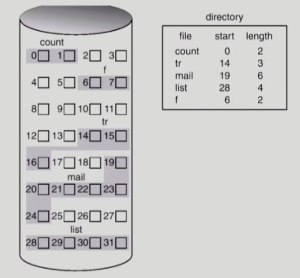

- 디렉토리

  : 디렉토리에 속한 파일들의 `메타데이터` 저장

  - 파일 이름, 저장된 위치(start), 파일 사이즈(length)

- 단점

  - 외부 조각(external fragmentation) 발생

    - 파일의 크기 > 연속된 섹터들의 크기
    - 어떠한 파일에게도 배정되지 않은 빈 공간임에도 현재 상태에서 사용될 수 없는 작은 공간

    : **각각의 파일들의 길이가 균일하지 않기 때문에**, 데이터가 삭제되어 free block들이 중간에 발생하면 이들의 크기도 균일하지 않다.

    => 따라서 파일의 크기가 free block들의 크기보다 큰 경우 그 위치에 할당이 불가능하다.

  - File grow가 어려움

    : 파일을 수정하면 파일의 크기가 증가할 수 있다.

    그런데 뒤에 연속한 빈 블록이 충분하지 않으면 grow의 제약이 있다.

    - file 생성시 얼마나 큰 hole을 미리 배당할 것인가?

    - grow 가능 vs 낭비 (내부조각, internal fragmentation)

      : file grow를 대비해 큰 공간을 미리 할당하면 `내부조각`의 문제가 발생한다. 즉 공간이 낭비된다.

      - 파일의 크기 < 연속된 섹터들의 크기
      - 해당 공간에 파일을 적재하고 남는 디스크 공간

- 장점

  - Fast I/O

    : 한 번의 seek/rotation으로 많은 바이트 transfer

    - **`하드디스크`는 대부분의 접근시간(access time)이 헤드가 바깥쪽 트랙에서 안쪽 트랙으로 이동하는 탐색시간(seek time)이다.** 실제로 읽거나 쓰는 데이터의 크기는 별 상관이 없다.
  
    - ex) 파일 mail의 시작 위치인 `섹터 19`를 seek 하면, 더 이상의 seek 없이 그 다음부터 연속된 6개의 섹터를 읽어올 수 있다. (섹터들이 같은 트랙에 존재한다고 가정)
  
    - 용도
  
      1. Realtime file 용
  
         : deadline이 있어서 **빠른 I/O가 필요**하므로 `연속할당`을 사용한다.
  
      2. `파일 시스템` 용도 외에 이미 run 중이던 process의 swapping 용
  
         - swap area
  
           : `프로세스의 주소 공간` 중 일부를 저장
  
           임시 저장소라서 데이터의 저장 기간이 짧고, **대용량을 빠르게 메모리-디스크 간 I/O 해야하므로 `공간 효율성`보다는 `속도 효율성`이 더 중요하다**.
  
  - **Direct access(= random access) 가능**
    
    : 간단하게 숫자를 더해서 중간 위치에 있는 블록의 위치를 알 수 있다.
    
      - ex) mail 파일의 5번 째 블록의 위치 = 19(start) + 4 = 23

### 2) Linked Allocation(연결 할당)

`연속 할당`의 단점인 hole이 발생하는 것을 막기 위해, 빈 공간(`섹터`)이면 어떤 곳이든 들어갈 수 있도록 구현한다.

- 데이터와 함께, 그 다음 블록을 가리키는 **포인터**를 끝 부분에 저장한다. 

  (파일의 끝은 **포인터**를 -1로 저장하여 표시)

> **연결 할당**은 직접 접근이 가능한 매체인 하드 디스크를 사용함에도 불구하고 `직접 접근(Direct access)`이 불가능하다.

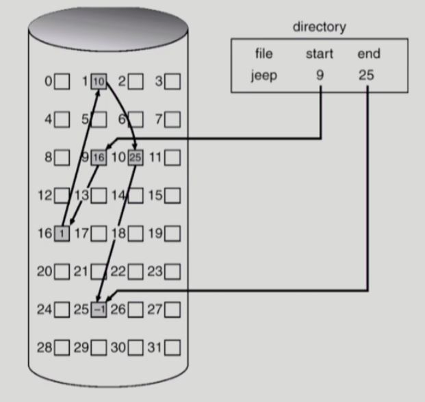

- 디렉토리

  - 파일 이름, 시작 위치(start), 마지막 위치(end)

- 장점

  - 외부 조각(external fragmentation) 발생 안 함

    : 디스크에 비어있는 블록이 존재하면 어떤 곳이든 들어갈 수 있다.

- 단점

  - **No random access**

    - 파일의 중간 위치에 접근하려면 **시작 위치에서부터 순차적으로 탐색해야 함**
      - ex) jeep 파일의 4번 째 블록에 접근하려면, 디렉토리에 저장된 첫 번째 위치로 가서 포인터를 따라 순차적으로 탐색해야 한다.
    - `순차 접근`에 비해 중간 위치에 접근하기 위한 seek time이 크다.

    > `하드 디스크`라는 매체는 `직접 접근`이 가능한 매체이지만, 파일을 관리하는 방법이 **Linked Allocation(연결 할당)**이라면 `직접 접근`이 불가능하다.

  - Reliability 문제

    - bad sector

      : 한 sector가 고장나 pointer가 유실되면 많은 부분을 잃음

  - 포인터를 위한 공간이 block(논리블록, logical block)의 일부가 되어 `공간 효율성`을 떨어뜨림

    - **인터페이스 문제**

      - 보통 디스크에서 **한 섹터당 512 byte**로 구성된다. `연결 할당`은 **포인터로 4 byte**를 사용한다.

        => 실제로 데이터를 저장할 수 있는 용량은 <u>508 byte</u>가 됨

      - 그런데 <u>디스크 외부, 즉 컴퓨터에서 디스크를 접근하는 단위(데이터 저장, 전송)는 **512 byte의 배수**이다</u>. (인터페이스로 정의)

        => 따라서 `연결 할당`을 사용하면, 한 섹터에 저장되어야 할 데이터가 **포인터** 때문에 두 섹터에 나누어져서 저장되는 문제가 발생한다.

- 변형

  - <u>File-allocation table (FAT)</u> 파일 시스템
    - 포인터를 별도의 위치에 보관하여 `reliability`와 `공간효율성` 문제 해결

### 3) Indexed Allocation(인덱스 할당)

`직접 접근(Direct access)`이 가능하도록 `디렉토리`에 파일의 위치 정보를 바로 저장하지 않고, 먼저 **인덱스 블록**을 가리키게 한다.

**인덱스 블록**은 파일의 내용을 저장하는 것이 아니라 **위치 정보만 저장**한다.

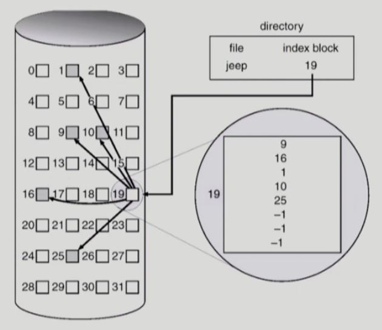

- 디렉토리

  - 파일 이름, 인덱스 블록의 위치(index block)

- 인덱스 블록

  : 파일의 내용을 저장하는 것이 아니라, 파일이 어느 블록에 저장되어 있는지 위치 정보를 저장하는 블록

  - ex) jeep 파일은 5개의 블록으로 구성된다. (9, 16, 1, 10, 25)

  > - Direct access(= random access) 가능
  >
  >   : 간단하게 숫자를 더해서 중간 위치에 있는 블록의 위치를 알 수 있다.
  >
  >   - ex) jeep 파일의 4번째 블록의 위치 = 인덱스 블록의 4번째 숫자 = 10
  >
  > - `순차 접근`의 `hole 문제` 해결
  >
  >   : 비어 있는 위치는 어디든 사용 가능하므로

- 장점

  - 외부 조각(External fragmentation)이 발생하지 않음
  - Direct access 가능

- 단점

  - Small file의 경우 공간 낭비 (실제로 많은 file들이 small)

    - 인덱스 블록이 무조건 하나 필요하므로

  - Too Large file의 경우 하나의 index block으로 index를 저장하기에 부족

    : 512 byte 블록/ 4 byte 포인터 = 128개 인덱스 저장 가능

    - 해결 방안

      1. linked scheme

         : 인덱스 블록의 **마지막 데이터는 index가 아니라 또 다른 인덱스 블록의 위치**를 가리킨다고 약속하는 방법

      2. multi-level index

         : 다단계 페이지 테이블과 유사하게, **각 index가 또 다른 인덱스 블록을 가리키도록** 구현하는 방법

## 3. 실제 파일시스템 구조

실제 파일 시스템에서는 위의 `할당 방법`들을 변형해서 사용한다.

### 1) UNIX 파일시스템의 구조

> UNIX와 LINUX의 <u>가장 기본적인 `파일 시스템`의 구조</u>는 다음과 같다.
>
> - **Indexed Allocation(인덱스 할당)** 기반
>
> - 현재는 이 기본 구조를 좀 더 효율적으로 변형한 `fast file system`, `ext2`, `ext3`, `ext4` 등을 사용하고 있다.

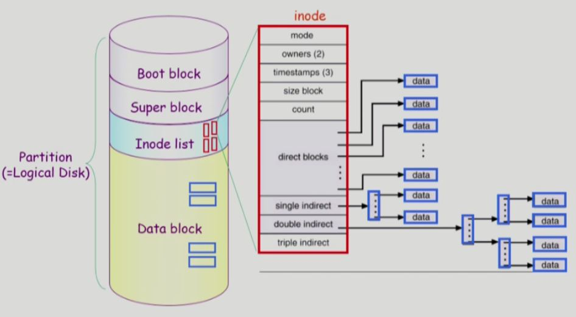

*하나의 논리적 디스크(파티션)에 UNIX 파일 시스템을 설치했다.*

UNIX 파일 시스템은 4가지 구역으로 구성되며, 순서대로 저장된다.

- Boot block

  - 부팅에 필요한 정보 (bootstrap loader)

    > UNIX 시스템 뿐 아니라 어떤 `파일 시스템`이라도 **부트 블록**이 가장 앞 부분에 저장되는 것으로 약속했다.
    >
    > - 컴퓨터에 어떤 `파일 시스템`이 설치되어 있는지 모르는 상태에서도 전원을 켜면 `부팅`이 되어야 하기 때문이다.
    >- 이때 **0번 블록(부트 블록)**을 메모리로 올리면 항상 **부팅에 필요한 정보(bootstrap loader)**가 저장되어 있어야 하는 것이다.
    > 
    >그러면 `파일 시스템`에서 운영체제 **커널**의 위치를 찾아 메모리에 올려 정상적인 `부팅`이 이루어지도록 한다.
  
- Super block

  - **파일 시스템에 관한 총체적인 정보**를 담고 있다.
    - 어디가 빈 블록이고, 어디가 실제로 파일이 저장되어 사용중인 블록인지 관리
    
      => Bit map or bit vector
    
    - Inode list의 범위, Data block의 범위

- Inode list (Inode = Index node)

  - **UNIX 파일 시스템의 가장 핵심적인 구조**
  - 파일 하나당 Inode가 하나씩 할당된다.
  - <u>파일 이름을 제외한</u> 파일의 모든 **메타 데이터**를 저장

  > UNIX 파일 시스템에서는 **`디렉토리`가 메타 데이터의 지극히 일부만 저장**하고, 나머지 메타 데이터들은 별도의 위치(Inode list)에 저장한다.
  >
  > - 메타 데이터 중에 딱 하나, <u>파일 이름</u>은 `디렉토리`가 저장하고 있다.
  >
  > - `디렉토리`는 나머지 메타 데이터를 저장하는 대신 **Inode 번호를 저장**하고 있다.
  >
  >   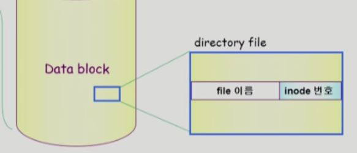

  - UNIX 파일 시스템은 기본적으로 **Indexed Allocation**을 사용하는데, **Inode의 크기는 고정되어 있다**.

    - 하지만 한정된 Inode의 크기로 굉장히 큰 파일을 지원할 수 있다.

      => 파일의 크기에 따라 direct index, single indirect, double indirect, triple indirect의 **4가지 방법 중 하나를 선택**하여 위치 정보를 저장한다.

      - 파일의 크기가 작다면, direct index만으로도 위치를 모두 가리킬 수 있다.

      - 파일이 큰 경우, single indirect는 바로 파일의 내용을 가리키는 것이 아니라 또 다시 index block이 나온다. (index block은 `Data block 영역`에 존재)

        - index 블록에는 실제 파일의 내용을 가리키는 **포인터**가 여러개 존재한다.

      - 파일이 더욱 큰 경우에는 2단계 인덱스 구조인 double indirct 포인터나, 3단계 인덱스 구조인 triple indirect 포인터를 사용한다.

      > 대부분의 파일은 크기가 작기 때문에 이러한 구조가 효율적이다.
  >
      > - 크기가 작은 파일들은 **Inode만 `메모리`에 올려 놓으면, 즉 `open`이 되어있으면** 파일의 위치를 바로 알 수 있다.
      > - 크기가 큰 파일들은 **index block을 추가적으로 `메모리`에 올려** 파일의 위치를 찾는다.

- Data block

  - 파일의 실제 내용을 보관

### 2) FAT File System

> 마이크로소프트사가 MS-DOS에서 최초로 적용한 파일시스템이다.
>
> Windows 계열이나 모바일 기기에서 일부 사용중이다.
>
> - **Linked Allocation(연결 할당)** 기반

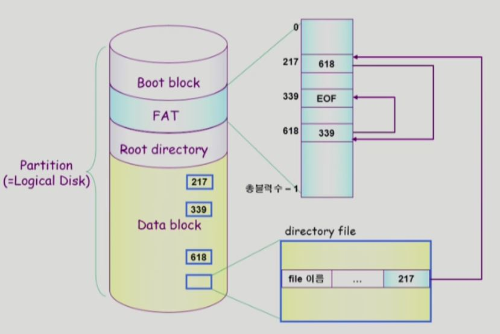

*하나의 논리적 디스크(파티션)에 FAT 파일 시스템을 설치했다.*

- Boot block

  - 부팅에 필요한 정보 (bootstrap loader)

- FAT

  - 파일의 **메타 데이터** 중 <u>위치 정보만 저장</u>

    - **`파일의 시작 블록 위치`를 포함한 나머지 메타 데이터는 모두 `디렉토리`에 저장된다.**

    - **Linked Allocation(연결 할당)**을 기반으로 하므로, `파일의 시작 블록 위치`로 가서 데이터를 읽고 마지막 부분에 약속된 **다음 블록에 대한 포인터**를 따라간다.

      - `bad sector`, `인터페이스 문제` 발생

        => 이를 해결하기 위해 포인터를 Data block의 디렉토리나 섹터에 저장하는 것이 아니라, `FAT`이라는 별도의 테이블(배열)에 저장한다.

  - FAT의 크기 = `Data block 영역`의 블록 개수

  - 배열의 `항목(entry)` = 다음 블록의 번호

    - ex) `파일의 시작 블록 위치`가 217번이므로, FAT의 217 index에 접근하면 두 번째 블록의 번호(index)를 알 수 있다.

      두 번째 블록의 번호는 618번이고, 세 번째 블록의 번호는 339번, 339에는 EOF(약속된 숫자)가 저장되어 있으므로 파일의 끝이다.

  > FAT 파일 시스템은 **Linked Allocation(연결 할당)**의 단점을 모두 해결한다. 
  >
  > 1. `직접 접근(Direct access)`이 가능하다.
  >
  >    => **FAT**이라는 작은 테이블(배열)은 `메모리`에 올라와 있는 상태이므로 원래와 같이 `디스크`까지 가서 순차적으로 블록을 읽을 필요 없이, 배열의 index를 따라가기만 하면 바로 접근할 수 있다.
  >
  >    - ex) 파일의 4번째 위치 접근하려면, FAT의 index를 4번 따라가면 된다.
  >
  > 2. Reliability 문제 해결
  >
  >    - bad sector가 발생하더라도, **FAT**에 포인터가 저장되어 있기 때문에 유실되지 않는다.
  >    - **FAT**은 매우 중요한 정보이므로 디스크에 복사본을 두 개 이상 저장하고 있으므로 Reliability가 개선된다.
  >
  > 3. 공간 효율성, 인터페이스 문제 해결
  >
  >    - 블록의 512 byte를 전부 활용할 수 있다.

- Root directory

- Data block

  - 파일의 실제 내용을 보관

이외에도 파일 시스템의 종류는 매우 다양하다.

## 4. Free-Space Management

`논리적 디스크`에서 **비어있는 block들을 관리**하는 다양한 방법이 존재한다.

1. Bit map or bit vector

   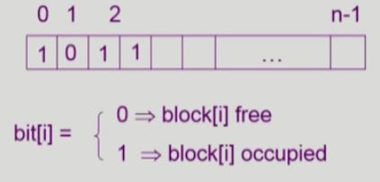

   *UNIX의 경우 Data block의 번호마다 bit를 두어서 사용중인지 아닌지를 0, 1로 표시하는 배열을 Super block에 저장한다.*

   - Bit map은 `디스크`에 **부가적인 공간**을 필요로 함 (적은 공간)

   - **연속적인 n개의 free block을 찾는데 효과적**

     > **연속할당**을 사용하지는 않지만, 가능하면 파일을 연속적인 빈 공간에 할당하는 것이 디스크 헤드가 이동(seek)하는 거리가 작아지므로 효과적이다.

   - `파일 시스템`이 Bit map을 관리한다. 

     - 파일을 생성하거나 file grow가 발생하면 비어있는 블록을 할당하고 bit를 0 -> 1 로 바꿔준다.
     - 파일이 삭제되면 bit를 1 -> 0 으로 바꿔준다.

2. Linked list

   > `Linked Allocation(연결 할당)`을 응용한 방법이다.

   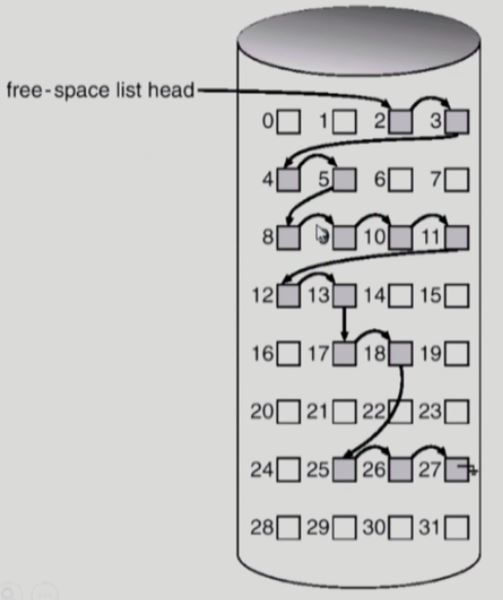

   - 어차피 비어있는 공간이므로 **포인터**를 저장하여 모든 free block들을 링크로 연결 (free list)

     - free-space list head

       : 비어있는 공간의 첫 번째 위치 **포인터**만 알고 있으면 접근가능하다.

   - **연속적인 가용공간을 찾는 것은 쉽지 않다.**

     - 디스크 헤드가 이동(seek)하면서 포인터를 읽고 연속적인 가용공간이 나올 때까지 순차적으로 따라가야 하므로

       => 따라서 실제로는 사용하지 않는 방법이다.

   - 공간의 낭비가 없다.

3. Grouping

   > `Linked list` 방법의 변형
   >
   > `Indexed Allocation(인덱스 할당)`을 응용한 방법이다.

   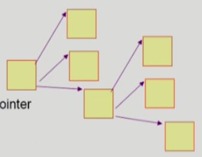

   - 첫 번째 free block이 **n개의 포인터(index)**를 가짐 (어차피 비어있는 공간이므로)
     - n-1개의 포인터는 `free data block`을 가리킴
     - 마지막 포인터는 또 다시 **n개의 포인터(index)를 가지는 block**을 가리킴
   - `Linked list` 방법보다는 낫지만, **연속적인 가용공간을 찾는데에는 그리 효과적이지 못하다**. 

4. Counting

   - 프로그램들이 종종 여러개의 연속적인 block을 할당하고 반납한다는 성질에 착안
   - 연속적인 block들의 정보 (first free block, # of contiguous free blocks)쌍을 유지
     - **포인터** + 연속적으로 비어있는 block의 개수
     - ex) 5개의 연속된 빈 block을 찾고 싶으면, (# of contiguous free blocks) >= 5 인 위치를 찾을 수 있음

## 5. Directory Implementation

`디렉토리`를 구현하는 방법

- Linear list

  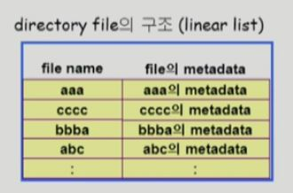

  - <file name, file의 metadata>의 list

    - list - **순차적으로 저장**한다.
    - 파일 이름과 메타 데이터의 크기(bit)를 고정시킨다.

  - 구현이 간단

  - 디렉토리 내에 파일이 있는지 찾기 위해서는 **linear search** 필요 (time-consuming)

    - 메타 데이터의 각 필드가 몇 bit씩으로 구성되어 있는지 알기 때문에, 한 파일을 검사하고 **단위 bit씩 건너뛰면서 검사**할 수 있다.

    => **비효율적**이다.

- Hash Table

  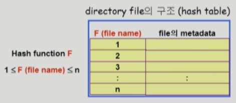

  - linear list + **hashing**

    - hashing

      : 어떠한 입력(파일 이름, 숫자 등)이 주어지더라도 `해시 함수`를 적용하면 결과값은 **특정 범위 안의 숫자**가 된다.

  - Hash table은 file name을 이 파일의 linear list의 위치로 바꾸어줌

    - `해시 함수`의 결과값으로 나온 숫자를 index로 하여, 해당 `항목(entry)`에 파일의 이름을 포함한 메타 데이터를 저장한다.

  - search time을 없앰

    - Hash table의 탐색 시간은 **O(1)**

  - **Collision 발생 가능 (해시 함수)**

    - 해결 방법은 hash table의 구현에 따라 다르다.

이처럼 `디렉토리`에 파일의 **메타 데이터**를 직접 보관할 수도 있지만, `UNIX`나 `FAT`과 같은 구현에서는 `디렉토리`가 **메타 데이터**의 일부를 저장하고 있고, 일부는 `파일 시스템`에서 다른 곳에 별도로 보관한다.

- File의 metadata의 보관 위치

  - 디렉토리 내에 직접 보관

  - 디렉토리에는 **포인터**를 두고 다른 곳에 보관
    - UNIX 파일 시스템 - Inode
    
    - FAT 파일 시스템 - FAT (FAT에는 위치 정보만 저장)

- Long file name의 지원

  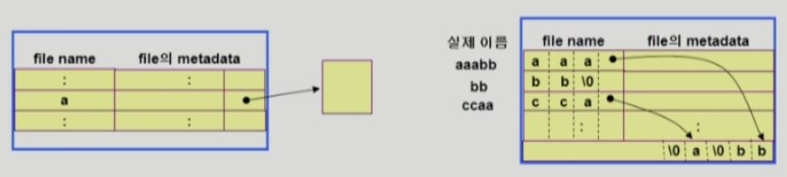

  - <file name, file의 metadata>의 <u>list에서 각 `entry`는 일반적으로 고정 크기</u>
    - `직접 접근(Direct access)`이 가능해야 하므로
    - ex) 접근 권한 = 9 bit
  - file name이 고정 크기의 `entry` 길이보다 길어지는 경우 **`entry`의 마지막 부분에 이름의 뒷부분이 위치한 곳의 `포인터`를 두는 방법**
    - 이름의 나머지 부분은 **동일한 directory file**의 일부에 존재

## 6. VFS and NFS

> 여태까지는 일반적인 `파일 시스템`의 구현에 대해 다루었다.
>
> VFS와 NFS는 구현 방법이 일반적인 `파일 시스템`과는 다르다.

사용자는 **시스템 콜**을 통해 `파일 시스템`에 접근할 수 있다. 이때 `파일 시스템`의 종류별로 다른 **시스템 콜**을 사용해야 한다면 매우 혼란스러울 것이다.

=> 따라서 `파일 시스템`의 윗 계층에 **VFS interface**를 두어, 사용자 입장에서는 **동일한 API(시스템 콜 인터페이스)**를 통해서 개별 `파일 시스템`에 접근할 수 있다.

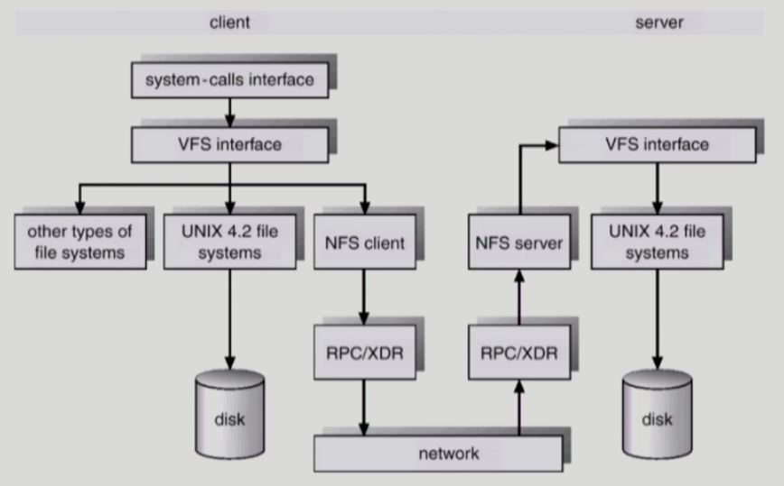

*RPC - 원격 접근 네트워크 프로토콜*

- Virtual File System (VFS)

  - 서로 다른 **다양한 file system에 대해 동일한 시스템 콜 인터페이스(API)를 통해 접근**할 수 있게 해주는 `OS의 layer(계층)`

- Network File System (NFS)

  - 분산 시스템에서는 **네트워크**를 통해 파일이 공유될 수 있음

  - NFS는 `분산 환경`에서의 대표적인 파일 공유 방법임

    - 클라이언트-서버

      : NFS는 <u>`VFS`를 통해서</u> 원격의 `서버 컴퓨터 파일 시스템`에 접근할 수 있는 인터페이스를 지원한다.

      - 클라이언트가 **VFS 인터페이스 시스템 콜**을 이용해서, 마치 local file system을 접근하듯이  `서버 컴퓨터의 파일 시스템`에 접근하고 연산할 수 있다.
      - 서버와 클라이언트가 모두 `NFS 모듈`을 가지고 있어야 한다.

## 7. Page Cache and Buffer Cache

- Page Cache
  - <u>가상 메모리의 paging system</u>에서 사용하는 `물리적 메모리의 page frame`을 caching의 관점에서 설명하는 용어
    - `물리적 메모리의 page frame`은 디스크의 `swap area(백킹스토어)`보다 빠르다.
    - cache hit이 발생하면 HW적인 주소 변환만 하기 때문에 `운영체제`가 정보를 알 수 없어서 `clock 알고리즘`을 사용
  - Memory-Mapped I/O를 쓰는 경우 file의 I/O에서도 page cache 사용

`파일 입출력`을 하는 방법에는 2가지 방식이 존재한다.

1. **read/write 시스템 콜**을 통해서 파일에 접근하는 방법 (Buffer cache 이용)

   - <u>파일시스템을 통한 I/O 연산</u>은 `메모리의 특정 영역인 buffer cache` 사용

   - File 사용의 locality 활용

     - 한 번 읽어온 block에 대한 후속 요청시 buffer cache에서 즉시 전달

   - 모든 프로세스가 공용으로 사용

   - Replacement algorithm 필요(`LRU`, `LFU` 등)

     - 파일의 내용이 `메모리`에 올라와 있든 `디스크`에 있든 간에(cache hit/ cache miss), 파일 접근 연산은 **시스템 콜**이기 때문에 CPU 제어권이 `운영체제`에게 넘어온다.

       따라서 `운영체제`는 모든 정보를 알 수 있으므로 `LRU`, `LFU` 알고리즘을 사용할 수 있다.

2. Memory-Mapped I/O

   > `Memory-Mapped I/O`는 전반적인 I/O에 관한 개념인데, 여기서는 파일 I/O에 대해서만 다룬다.

   - **File의 일부를 `입출력을 요청한 프로세스의 virtual memory`에 mapping시킴**
   - 매핑시킨 영역에 대한 **메모리 접근 연산**은 파일의 입출력을 수행하게 함
     - read/write 시스템 콜을 사용하지 않음
     - 대신 메모리에 읽고 쓴다. 

### Unified Buffer Cache

**최근의 OS(ex. LINUX)에서는 기존의 buffer cache가 page cache에 통합됨**

=> buffer cache도 `page cache 단위`로 관리한다는 뜻이다.

> **`운영체제`에서 물리적 메모리(page frame)를 관리하는 루틴에 page cache와 buffer cache를 같이 관리한다는 뜻**으로, 통합되었다고 해서 각 캐시를 관리하는 방법이 달라지는 것은 아니다.

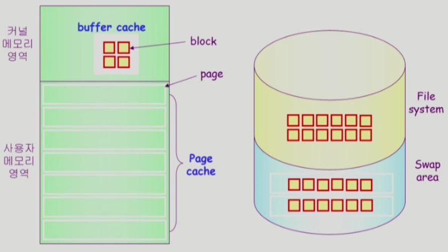

*예전 OS(ex. FreeBSD)의 물리적 메모리와 물리적 디스크*

- <u>사용자 메모리 영역</u>은 **페이지 단위**로 스와핑이 이루어지면서 관리된다.

  - 페이지 크기 = 4 KB

- 버퍼 캐시는 <u>커널 메모리 영역</u>에서 존재하며, 파일을 **블록 단위**로 관리한다.

  - 블록 크기 = 512 byte

  => LINUX와 같은 최근의 OS에서 사용하는 `Unified Buffer Cache` 환경에서는 **블록 크기도 4 KB로 관리**한다.

  - 별도로 공간을 구별하지 않고, 똑같이 **페이지 단위**로 관리하면서 필요할 때마다 버퍼 캐시 용도나 프로세스의 주소 공간 용도로 **메모리를 동적으로 할당**한다.
  - cf) `swap area`는 원래부터 속도 효율성을 위해서 여러 개의 블록을 4 KB 단위로 묶어서 스와핑 했음

**[파일에 접근하는 2가지 방법]**

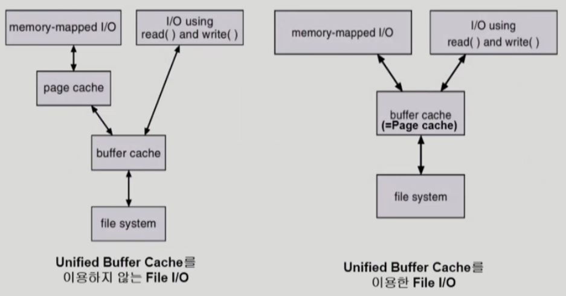

파일을 읽고 쓰는 방식에는 두 가지 `인터페이스`가 존재한다.

1. 파일을 `open`하고 **read/write 시스템 콜**을 하는 방법

   1) 시스템 콜이므로 `운영체제`가 해당하는 파일 내용이 **버퍼 캐시**에 있으면 바로 전달해준다.

   ​	없으면 디스크의 파일 시스템에서 **버퍼 캐시**로 읽어온다.

   2) 사용자 프로그램은 자신의 `논리적 주소 공간(페이지)`에 **버퍼 캐시**에 있는 내용을 복사해서 사용한다.

   > 파일을 읽고 쓰기 위해 **read/write 시스템 콜**을 사용하면 <u>buffer cache hit/ miss 여부와 상관 없이</u> 항상 `운영체제`에 요청해서 파일 내용을 받아와야 한다.

2. Memory-mapped I/O (Memory-mapped File)

   1) **mmap 시스템 콜**을 한다.

   - page cache mapping

     : `운영체제`에게 `Memory-mapped I/O`를 사용할 것임을 알린다.

     즉 자신의 `논리적 주소 공간 중 일부`를 파일에 매핑하는 단계이다.

     - 프로세스의 논리적 주소 공간(가상 메모리)의 위치 정보는, 커널 내의 자료구조인 **PCB**에 저장된다.

   - **파일에 처음 접근할 때, 디스크에 있는 파일을 먼저 buffer cache로 읽어오는 과정은 `read/write 방식`과 똑같다.**

   2) 그 결과를 **page cache**에 복사한다. 
   
   > - page cache hit
   >
   >   : mmap 영역에 데이터를 메모리에 읽고 쓰듯이 요청하면, 그것은 파일의 read/write가 된다.
   >
   >   **=> 따라서 `운영체제`의 도움 없이 자신의 영역에 대한 메모리 접근 연산으로 `파일 입출력`을 할 수 있다.**
   >
   > - page cache miss
   >
   >   : 물론 도중에 **mmap 영역의 페이지가 스왑 아웃**되어 cache miss가 발생하면, `page fault handler`가 호출되어 제어가 `운영체제`로 넘어간다.

- 기존의 **버퍼 캐시 환경**에서는 두 가지 `인터페이스` 모두 **버퍼 캐시**를 거친다.

  => 따라서 `Memory-mapped I/O 방식`의 경우, <u>페이지 캐시에 한 번 복사해야 하는 오버헤드</u>가 존재한다.

- **Unified Buffer Cache 환경**에서는 `운영체제`가 따로 버퍼 캐시 공간을 만들어 놓지 않고, 필요에 따라 `운영체제`가 **페이지 캐시 공간 중 일부를 버퍼 캐시 공간으로 할당**해서 사용한다. **(동적 할당)**

  => `Memory-mapped I/O 방식`의 경우, 페이지 캐시(= 버퍼 캐시) 자체가 `사용자 프로세스의 논리적 주소 영역 페이지`에 매핑되어서, <u>버퍼 캐시를 별도로 거치지 않고 페이지 캐시(= 버퍼 캐시)에 직접 읽고 쓸 수 있다</u>.
  
  > 이것이 `Unified Buffer Cache` 기법의 장점이다.

### 프로그램의 실행

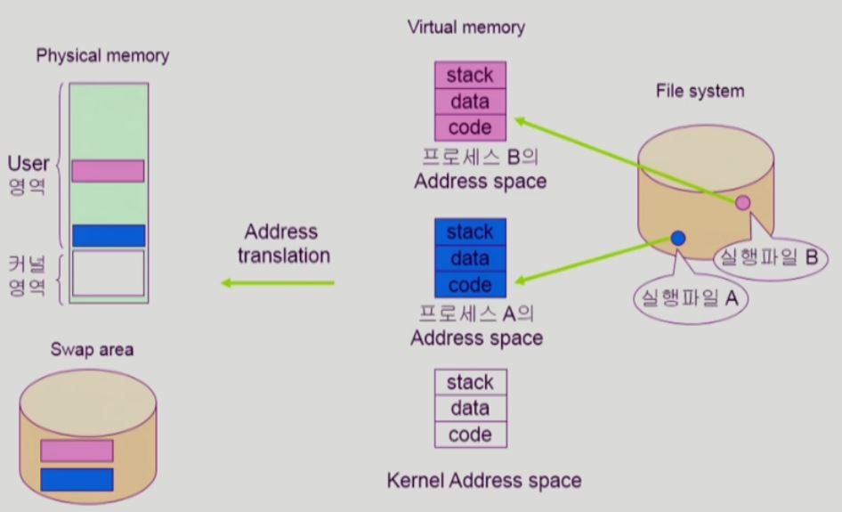

1. 프로그램이 파일시스템에 실행파일 형태로 저장되어 있다가, 실행파일을 실행시키면 프로세스가 된다.

   그러면 그 프로세스만의 독자적인 주소 공간인 Virtual memory가 만들어진다.

2. 주소 변환을 해주는 HW에 의해서 Virtual memory에서 당장 필요한 부분은 물리적 메모리에 올라간다.

3. 물리적 메모리의 공간이 한정되어 있기 때문에 쫓겨나는 부분은 디스크의 swap area로 이동한다.

   - 이때 가상메모리의 code 영역은 메모리에 올라간 다음에 쫓겨날 때, swap area로 내려가지 않는다. 
   - code는 read-only이기 때문에 실행 파일에 이미 저장되어 있는 부분이다. 따라서 쫓겨날 때 swap area에 써줄 필요가 없다.

memory-mapped I/O는 실행파일의 내용을 읽어올때도 사용할 수 있지만, 실제로 실행파일을 실행시킬 때 로더가 프로그램을 메모리에 올릴때 memory-mapped file 을 실행파일의 코드 부분에 사용.

=> 따라서 code영역은 별도의 swap area 영역을 가지고 있지 않다. 파일시스템의 파일 형태로 존재한다.

code영역은 프로세스의 주소 영역(가상메모리)에 그대로 매핑된다.

- 특정 프로그램이 메모리에 안 올라와 있으면 swap area가 아니라 파일 시스템의 실행파일을 올린다.
- page cache mapping, 즉 즉 자신의 `논리적 주소 공간 중 일부`를 파일에 매핑하는 대표적인 경우이다.

