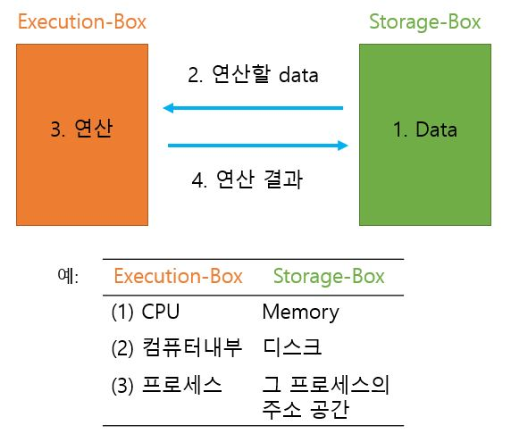
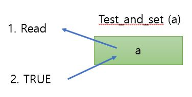
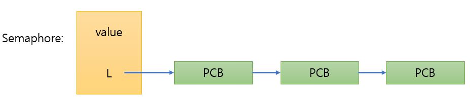
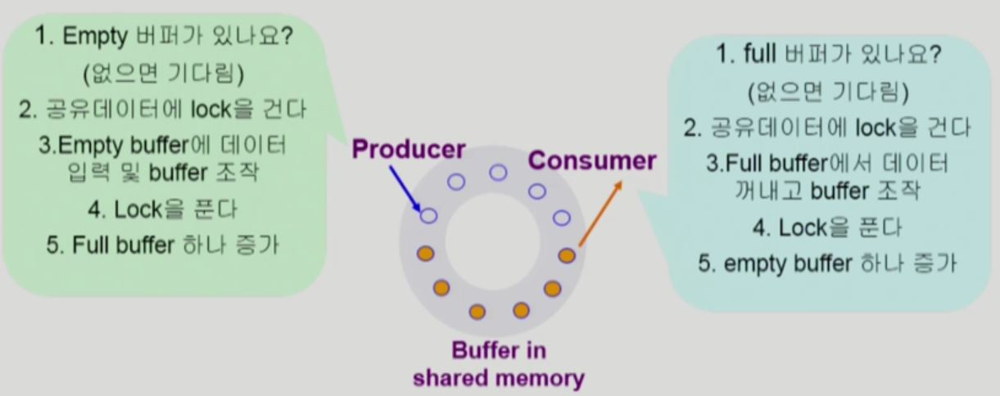
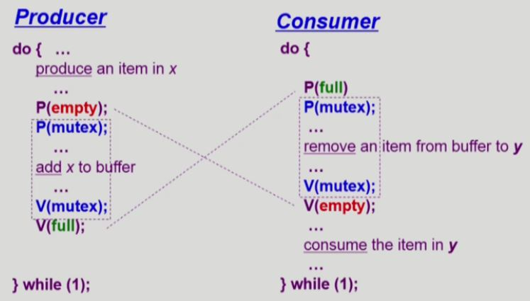
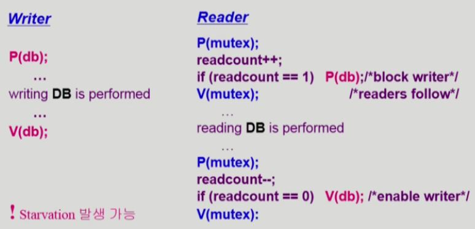
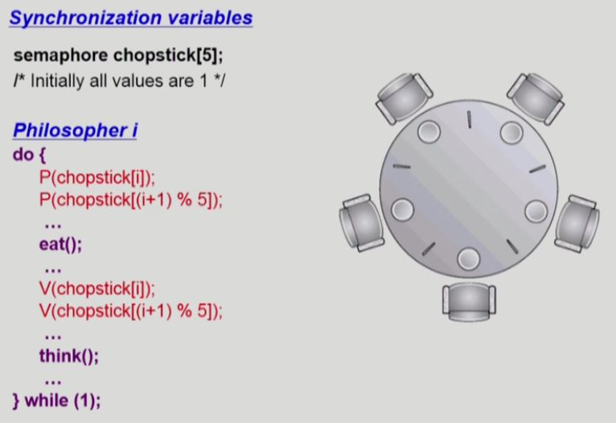

# Process Synchronization

- `공유 데이터의 동시 접근(concurrent access)`은 **데이터의 불일치(inconsistency) 문제**를 발생시킬 수 있다.
- 일관성 유지를 위해서는 **협력 프로세스(cooperating process) 간의 `실행 순서(orderly execution)`를 정해주는 메커니즘**이 필요하다.

- Race condition
  - 여러 프로세스들이 동시에 `공유 데이터`를 접근하는 상황
  - 데이터의 최종 연산 결과는 **마지막에 그 데이터를 다룬 프로세스에 따라 달라짐**
- race condition을 막기 위해서는 동시에 접근하는 프로세스 간의 `동기화`가 되어야 한다.

## 1. 경쟁 상태(Race Condition)

### 데이터의 접근

컴퓨터 시스템 내에서 데이터가 접근되는 패턴

- 컴퓨터 시스템의 어떤 위치에 있던 간에 **데이터를 접근하는 경로**는 아래와 같다.



*Execution-Box와 Storage-Box는 통상적으로 쓰는 용어가 아니라 교수님이 이름 붙인 것이다.*

- 예(1), (2)는 HW 관점
- 예(3)은 SW 관점

데이터를 단순히 읽기만 하면 문제가 없다.

그러나 데이터를 읽고, 연산을 하고, 다시 결과를 저장하는 방식의 시스템에서는 누가(어떤 E-Box가) 먼저 읽었느냐에 따라 결과가 달라질 수 있다.

=> 이러한 문제를 `Synchronization 문제`라고 한다.

### 경쟁 상태(Race Condition)

Storage-Box를 하나의 Execution-Box만이 사용한다고 하면 문제가 발생하지 않는다.

하지만 여러 개의 Execution-Box가 Storage-Box를 공유한다면 Race Condition이 발생할 가능성이 있다.


E-Box가 S-Box의 데이터를 읽어서 연산을 하는 도중에 또다른 E-Box가 S-Box를 읽어서 연산하는 경우, 원치 않았던 결과가 발생할 수 있다.

**[OS에서 race condition이 발생하는 상황]**

- 예(1)의 CPU-메모리의 경우, 하나의 CPU가 메모리를 접근하므로 일반적으로 race condition이 발생하지 않는다.

  - 예외) Multiprocessor 
    - CPU가 여러개 있는 시스템에서 메모리 공유(공유하는 메모리 내의 **커널 데이터**)

- 예(3)의 프로세스-프로세스의 주소 공간의 경우, 일반적으로 프로세스는 각자 자신의 주소 공간만 접근할 수 있으므로 race condition이 발생하지 않는다.

  - 예외 1) 공유메모리를 사용하는 프로세스들

  - 예외 2) 프로세스가 **시스템 콜**을 하여 **커널모드**로 수행 중인데 `문맥 교환`이 발생한 경우

    - `시스템 콜`로 **커널의 코드**를 실행하는 것은 **커널의 데이터**에 접근하고 연산하는 것이다. 

      그런데 도중에 CPU를 빼앗은 새로운 프로세스가 또 다시 `시스템 콜`로 **커널의 코드**를 실행하여 **커널 데이터**에 접근하고 연산하는 경우 race condition이 발생할 수 있다.

  - 예외 3) **커널 코드** 수행 도중에 `인터럽트`가 발생한 경우 

    - **커널 코드** 실행(**커널의 데이터** 접근, 연산) 도중에 또 다른 `인터럽트`가 발생할 수 있다. 

      그런데 인터럽트 핸들러 코드도 **커널코드**라서 **커널의 데이터**를 사용하므로 race condition이 발생할 수 있다.

**[OS에서 race condition이 발생하는 상황의 예시]**

1. 인터럽트 핸들러 vs 커널

   - `커널모드`에서 실행 중에 **인터럽트**가 발생하여 `인터럽트 처리루틴`이 수행된다.

     => `커널모드`와 `인터럽트 처리루틴` 모두 **커널 코드**이므로 **kernel address space를 공유**한다.

   : CPU에서 커널을 실행하다가 **커널 데이터인 count**를 1 증가시키는 코드를 수행하려고 한다. 

   이때 <u>고급 언어</u>의 count++ 문장은 CPU 내부에서 <u>여러 개의 인스트럭션</u>을 통해 실행된다.

   - Load: 메모리에서 레지스터로 데이터를 읽어들임

   - Inc: 레지스터에 저장된 값 1 증가

   - Store: 레지스터 값을 메모리에 저장

     ``` assembly
     load	X, reg1
     inc		reg1
     store	X, reg1
     ```

   Load까지만 수행했는데 `인터럽트`가 들어오면 해당 프로세스의 수행을 멈추고, 인터럽트 핸들러(커널 코드)가 실행된다.

   인터럽트 핸들러는 커널 코드이므로 **커널 데이터인 count**를 1 감소시킬 수 있다.

   인터럽트 처리가 끝나고 이전 프로세스의 커널모드로 다시 돌아오면, count를 1 감소시키기 이전의 값을 레지스터에 이미 읽어온 상태이므로 count--는 최종 결과에 반영되지 않는다.

   - 해결법

     : enable/disable interrupt

     => 커널 수행 중에는 인터럽트를 disable 시키고, 작업이 끝난 후 인터럽트 처리 루틴으로 제어를 넘긴다. 

     **즉, 데이터를 접근하는 순서를 정해주면 된다.**

2. 프로세스가 시스템 콜을 하여 `커널모드`로 수행 중인데 `문맥 교환`이 발생한 경우(time sharing system)

   > `사용자모드`에서 문맥 교환이 일어난 경우는 race condition이 발생하지 않는다.

   - 시스템 콜 중에는 kernel address space의 데이터를 공유하게 된다.

   : CPU에서 커널을 실행하다가 **커널 데이터인 count**를 1 증가시키는 코드를 수행하려고 한다.

   Load까지만 수행했는데 `문맥 교환`이 발생하면 해당 프로세스의 수행을 멈추고, 다른 프로세스에게 제어가 넘어간다. (타이머 인터럽트)

   이때 새로운 프로세스에서 **시스템 콜**을 하여 커널에서 또 **커널 데이터인 count**를 1 감소시켰다.

   다시 원래 프로세스로 돌아오면 count를 1 감소시키기 이전의 값을 레지스터에 이미 읽어온 상태이므로 count--는 최종 결과에 반영되지 않는다.

   해당 시점의 context를 가지고 count++의 나머지 인스트럭션을 수행하므로 최종적으로 count는 1만 증가한다.

   - 해결법

     : enable/disable interrupt (여기서는 타이머 인터럽트)

     프로세스가 `커널모드`에 있을 때는 **할당 시간이 끝나도 CPU를 빼앗지 않는다.**

     `커널모드`에서 `사용자모드`로 돌아갈 때 CPU를 빼앗는다.

     - 할당 시간이 정확하게 지켜지지 않을 수 있지만 time sharing system은 real time system이 아니므로 시스템에 큰 문제가 발생하지 않는다.

3. 멀티프로세서 환경

   - 앞의 두 예시와 달리, `공유 데이터`를 사용하는 작업이 진행되는 동안 interrupt enable/disable하는 방식으로 해결되지 않는다.

     앞의 예시들은 **CPU가 하나**인데 작업 도중에 그 CPU의 제어권이 넘어가서 생긴 문제이다.

   - 반면에, 멀티프로세서 시스템은 근본적으로 작업 주체가 여러개 있기 때문에 발생하는 문제이다.

     > 이 경우 역시 `사용자 프로세스 주소 공간`에서는 race condition이 발생하지 않는다.

   - 해결법:

     1. 한 순간에 하나의 CPU만이 커널에 들어갈 수 있게 하는 방법
        - 비효율적

     2. 커널 내부에 있는 각 공유 데이터에 접근할 때마다 그 데이터에 대한 lock/unlock을 하는 방법

        : 각 데이터 별로 lock을 둔다.

        - 여러 CPU가 동시에 커널 코드를 실행할 수 있으므로 효율적이다.


## 2. 임계 구역(The Critical-Section Problem)

n개의 프로세스가 `공유 데이터`를 동시에 사용하기를 원하는 경우, 각 프로세스의 **코드 영역**에는 **공유 데이터를 접근하는 `코드`인 critical section**이 존재한다.

> 하나의 프로세스가 critical section에 있을 때, 다른 모든 프로세스는 critical section에 들어갈 수 없어야 한다.

- ex) 두 프로세스 P1과 P2의 `공유 데이터`가 X = 2라면,

  P1의 X = X + 1; 코드가 임계 구역으로, 이 코드를 실행하다가 제어가 P2로 넘어가면

  P2의 X = X - 1; 코드가 임계 구역이라서 이 코드를 실행하지 못하고 기다려야 한다.

임계 구역 관점에서 코드는 두 종류로 구분할 수 있다.

1. 임계 구역, 즉 공유 데이터를 접근하는 코드(critical section)

   : entry section과 exit section 코드로 감싸고, 이 코드들을 이용하여 **lock**을 걸거나 풀어준다.

2. 공유 데이터를 접근하지 않는 코드(remainder section)

   ``` c
   do{
       entry section
       critical section
       exit section
      	remainder section
   }
   ```

> 프로세스들은 수행의 `동기화(synchronize)`를 위해 몇몇 **변수를 공유**할 수 있다.
>
> **=> synchronization variable**

### 프로그램적 해결법의 충족 조건

SW적으로 **lock**을 걸어서 해결하는 알고리즘들이 있다.

이 `SW적인 lock 알고리즘`들이 critical section 문제를 해결하기 위해 만족해야 할 조건이 3가지 있다.

> 따라서 임계구역(critical section) 문제를 해결하는 것은 **entry section과 exit section 코드를 이용해서 다음 조건들을 만족시키는 것이 목적**이다.

1. 상호 배제(Mutual Exclusion)

   : 프로세스 Pi가 critical section 부분을 수행 중이면 다른 모든 프로세스들은 그들의 critical section에 들어가면 안된다.

2. 진행(Progress)

   : 아무도 critical section에 있지 않은 상태에서 critical section에 들어가고자 하는 프로세스가 있으면 critical section에 들어가게 해주어야 한다.

   - 당연한 이야기 같지만, 코드를 잘못 짜면 둘이 동시에 들어가는 것을 막고자 하다가 아무도 못 들어가는 문제가 발생할 수 있다.

3. 유한 대기(Bounded Waiting)

   : 프로세스가 critical section에 들어가려고 요청한 후부터 그 요청이 허용될 때까지 다른 프로세스들이 critical section에 들어가는 횟수에 한계가 있어야 한다.

   - 즉, 특정 프로세스가 지나치게 기다리는 starvation이 발생하지 않도록 해야 한다.

- 가정
  - 모든 프로세스의 수행 속도는 0보다 크다.
  - 프로세스들 간의 상대적인 수행 속도는 가정하지 않는다.

### SW적인 lock 알고리즘

#### 1) 순서 정하기

`turn 변수`를 이용한다.

CPU를 빼앗기지 않고 **<u>고급 언어</u>의 critical section**을 모두 수행한 후에 CPU를 넘겨줌으로써 `critical section 문제`를 해결하려고 한다.

- Synchronization variable

  ``` c
  int turn;
  turn = 0;	// 초기화) Pi는 turn == i일 때 임계구역 진입 가능
  ```

- Process P0

  ``` c
  do{
      while(turn != 0);	// 내 차례가 될 때까지 기다림(P1이 turn = 0으로 바꿔줄 때까지)
      critical section
      turn = 1;			// P1에게 차례를 넘겨줌
      remainder section
  }while(1);
  ```

- Process P1

  ``` c
  do{
      while(turn != 1);	// 내 차례가 될 때까지 기다림(P0이 turn = 1으로 바꿔줄 때까지)
      critical section
      turn = 0;			// P0에게 차례를 넘겨줌
      remainder section
  }while(1);
  ```

- turn을 번갈아 갖기 때문에 `mutual exclusion`은 만족하지만, `progress`는 만족하지 않는다.

  - 과잉양보

    : 반드시 한번씩 교대로 들어가야만 하도록 코딩되어 있다. (swap-turn)

    즉, 상대방 프로세스가 critical section을 진입하고 나온 뒤에, turn을 내 차례에 해당하는 값으로 바꿔줘야만 들어갈 수 있다.

    이때, 특정 프로세스가 다른 프로세스에 비해 더 빈번히 critical section에 진입해야 한다면, 상대방이 turn을 바꿔주기 전까지 들어가지 못하고 기다려야 한다.

  => 따라서 `critical section 문제`를 해결하지 못한다.

#### 2) flag(깃발)

`flag`는 깃발을 들어서 본인이 critical section에 들어가고자 한다는 의사를 표시하는 것이다.

깃발을 들은 후에는 상대방도 깃발을 들었는지 확인한다.

=> "이미 들어갔을 수도 있겠구나" 생각하고 기다림 (진짜로 들어갔는지 아닌지는 모른다!)

- Synchronization variable

  ``` c
  boolean flag[2];	  // 참고) c 표준은 bool형 변수가 없다.
  flag[모두] = fasle;	// 초기화) 둘 다 임계구역에 들어가고자 하는 상태는 아님
  // Pi가 임계구역에 들어가려면 먼저 flag를 true로 만들어서 의사 표시를 한다.
  flag[i] = true;
  ```

- Process Pi

  ``` c
  do{
      flag[i] = true;	// Pi가 임계구역에 들어가려면 먼저 flag를 true로 만들어서 의사 표시를 한다.
      while(flag[j]);	// 상대방이 flag를 체크했으면, 상대방이 flag를 체크한 후 임계구역에 들어갔을 수도 있으므로 기다린다.
      critical section
      flag[i] = false; // 상대방이 들어올 수 있게 flag 해제
      remainder section
  }while(1);
  ```

- `mutual exclusion`은 만족하지만, `progress`는 만족하지 않는다.

  - 둘 다 깃발을 올리고(flag[i] = true;) 끊임 없이 양보하는 상황 발생 가능

    : 프로세스i가 flag[i] = true; 까지 실행하고 CPU를 빼앗긴 뒤, 프로세스j에서 flag[j] = true;를 실행한다.

    이때 둘 다 깃발을 올렸지만 아무도 critical section에 들어가지 못한다.

    다시 프로세스i에게 제어권이 넘어가도 계속 while(flag[j]); 문을 실행하게 된다.

  - 들어가기 전에 깃발을 올리고, 나온 후에 깃발을 내리기 때문에 발생하는 문제

  => 따라서 `critical section 문제`를 해결하지 못한다.

#### 3) Peterson's Algorithm

순서를 정하는 변수 `turn`과 깃발 `flag`를 모두 사용한다.

- Process Pi

  ``` c
  do{
      flag[i] = true;	// 깃발을 들어 의사 표현하고,
      turn = j;		// 상대방의 순서로 바꾼다.
      while(flag[j] && turn == j); // 상대방이 깃발을 들고 있고, 상대방의 순서면 기다린다.
      critical section
      flag[i] = false;
      remainder section
  }while(1);
  ```

- 3가지 조건을 모두 만족한다.

  - mutual exclusion

    : critical section에 들어갈 의사가 있다면, turn에 따라 교대로 들어간다.

  - progress

    : critical section에 아무도 들어가 있지 않으면 turn에 관계 없이 들어갈 수 있다.

  => 따라서 `critical section 문제`를 해결한다.

- Busy Waiting (spin lock)

  : 계속 CPU와 메모리를 쓰면서 wait

  lock이 걸려있는 상태라면 임계구역에 진입하려는 프로세스는 CPU 할당시간 동안 while문만 체크하면서(spin) 할당시간을 소진하고 끝낸다.

  ⇒ 따라서 비효율적인 알고리즘이다.


> 고급 언어가 아니라 **인스트럭션 단위**로 CPU의 제어권을 빼앗을 수 있기 때문에 SW적으로 복잡한 코드가 만들어지게 되었다.
>
> => 따라서 **`특수한 인스트럭션`을 HW적으로 구현**하면 critical section 문제는 매우 쉽게 해결된다.

### Synchronization Hardware

`critical section 문제`가 발생한 이유는 **데이터를 읽고 쓰는 것(Test & modify)**이 두 개 이상의 인스트럭션이 필요하기 때문이다.

**데이터를 읽고 쓰는 것**을 `특수한 인스트럭션 하나`만으로 수행할 수 있다면**(atomic)**, 인스트럭션이 실행되는 도중에 CPU를 빼앗기지 않게 되므로 문제가 해결된다.

- Test_and_set(a)

  - 데이터 a는 0과 1의 값만 가진다.

  - 이 함수는 a의 원래값을 읽어서 리턴하고, 그 다음 무조건 a = 1로 바꿔준다.



- Synchronization variable

  ``` c
  boolean lock = false;
  ```

- Process Pi

  ``` c
  do{
      while(Test_and_Set(lock)); // critical section에 들어가기 전에 lock을 건다.
      // lock = 0이면 lock = 1로 바꿔주고 0을 리턴하여 critical section에 들어간다.
      // lock = 1이면 lock = 1로 바꿔주고(변화x) 1을 리턴하여 기다린다.(while문 실행)
      critical section
      lock = false; // 빠져나올 때 lock을 푼다.
      remainder section
  }while(1);
  ```

  - 다른 프로세스가 lock을 해제하면, lock = 0이 되어 critical section에 들어갈 수 있게 된다.

> 프로그래머가 매번 이런 작업을 하는 것은 불편하다.
>
> 따라서 **프로그래머가 더 사용하기 편한 고급 추상 자료형인 `세마포어`**를 제공한다.
>
> 프로그래머는 세마포어를 이용하여 **연산만 해줘서 lock을 걸거나 해제할 수 있다**.

## 3. 세마포어

`세마포어(Semaphore)`는 **앞의 방식들(lock/unlock 알고리즘)을 `추상화`시킨 것**이다.

`공유자원`을 획득하고 반납하는 작업을 세마포어가 처리해준다.

- 추상 자료형

  - object + operation 정의
    - ex) 정수 추상 자료형 = 정수 숫자들 + 숫자들에 대해 정의된 연산(+, -, *, /)
  - **논리적으로 정의된 자료형**으로 실제 시스템에서 어떻게 구현되는지는 정의하지 않는다.

  **=> `세마포어`도 일종의 추상 자료형이다.**

- 세마포어

  - 변수 S: 정수값을 갖는다.

    - 자원의 개수라고 생각하면 된다. ex) S = 5면 자원이 5개

  - 연산: 변수 S에 대해 두 가지 `atomic` 연산이 정의된다.

    - 어떤 방법을 이용하여 atomic하게 구현되는지는 정의하지 않는다.

    - P(S) 연산

      : 공유데이터를 획득하는 과정. lock을 거는 과정

      ``` c
      while(s <= 0) do no-op; // 자원이 없으면 wait (busy-wait!!!)
      S--;
      ```

      - `busy wait` 문제가 발생한다.

    - V(S) 연산

      : 공유데이터를 반납하는 과정. lock을 푸는 과정

      ``` c
      S++;
      ```

> 세마포어 변수 값이 1인 경우(= 자원이 1개) **lock/unlock 알고리즘(= mutex)**으로 활용될 수 있다.

### Critical Section with Semaphore

**[세마포어의 busy-wait 구현]**

- Synchronization variable

  ``` c
  semaphore mutex = 1;
  // 세마포어 변수 값이 1인 경우(= 자원이 1개) lock/unlock 알고리즘(= mutex)으로 활용될 수 있다.
  ```

- Process Pi

  ``` c
  do{
      P(mutex);
      critical section
      V(mutex);
      remainder section
  }while(1);
  ```

  - 시스템에서 세마포어를 구현하여 P, V 연산을 지원해주면 간단하게 `critical section 문제`를 해결할 수 있다.
  - 이 방법에서도 `busy-wait(spin lock)`는 발생한다.

**[세마포어의 Block & Wakeup 구현]**

특별히 lock 관점에서 Block & Wakeup 방식을 `sleep lock`이라고 부른다.

요청한 `공유 자원`을 얻지 못하면, 해당 프로세스를 block 시켜 CPU를 쓸데없이 할당하지 않도록 한다. 즉 자원을 얻지 못한 프로세스는 `봉쇄(blocked)` 상태가 된다.

- Semaphore를 다음과 같이 정의한다.

  ``` c
  typedef struct{
      int value;	// semaphore 변수 값
      struct process* L;	// 프로세스 wait 큐 - 세마포어 때문에 잠들어 있는 프로세스들을 연결하기 위한 큐
  } semaphore;
  ```

  

- block()

  : **커널**은 block을 호출한 프로세스를 `suspend` 시킴

  이 프로세스의 **PCB**를 **semaphore에 대한 wait queue**에 넣음

- wakeup(P)

  : block 된 프로세스 P를 `wakeup` 시킴

  이 프로세스의 **PCB**를 **ready queue**로 옮김

Semaphore의 구체적인 구현은 다음과 같다.

- P(S) - S는 위에서 정의된 세마포어 변수

  : 자원을 획득하는 과정

  ``` c
  S.value--;	// s.value를 검사하기 전에 일단 감소시킨다.
  // 자원이 있다면 if문을 건너뛰고 자원을 바로 흭득한다.
  if(s.value < 0){ // 위에서 먼저 빼줬기 때문에 0이 아니라 음수가 '여분이 없는 상태'의 기준이다.
      // 자원의 여분이 없다면 리스트에 이 프로세스를 연결시킨 뒤, 잠든다.
      add this process to S.L;
      block(); 
  }
  ```

- V(S)

  : 자원을 반납하는 과정

  ``` c
  S.value++;
  // 자원을 반납하고 끝나는 것이 아니라, 혹시 이 자원을 기다리면서 잠든 프로세스가 있다면 깨워준다.
  if(S.value <= 0){   
      // 이 자원을 기다리는 프로세스가 있다면 깨워준다.
      remove a process P from S.L;
      wakeup(P); 
  }
  ```

  - if(S.value <= 0)

    : 일단 프로세스들이 S.value 값을 빼고 잠들었으므로, 내가 지금 자원을 내놓았는데도 불구하고 그 값이 0 이하라면, 이 자원을 기다리면서 잠든 프로세스가 존재한다는 뜻이다.

    (여분의 자원이 남는다면 S.value가 1 이상이어야 한다.)

    - 앞에서 P연산으로 이미 S.value--;를 많이 실행해서 **S.value가 음수 값이 되어** if(s.value < 0) 문을 실행해서 **프로세스가 잠들었다는 뜻**이므로

> `busy-waiting` 방식에서는 **S는 자원의 개수를 뜻하는 변수**였다.
>
> `block & wakeup` 방식에서는 **S.value**는 자원의 개수를 세는 것이 아니라, 
>
> - S.value < 0, 즉 **음수**이면 어떤 프로세스가 자원을 기다리며 잠들어 있다는 의미이다.
>
> - S.value > 0, 즉 **양수**이면 기다리는 프로세스 없이 모두 자원을 쓰고 있다는 의미이다.
>
>   => 즉 **깨워야 할 프로세스의 존재여부를 확인할 때 사용하는, 상황을 나타내는 변수**이다.

**[Busy-wait VS Block/wakeup]**

- 일반적으로 `Block/wakeup` 방식이 CPU 이용률이 올라가서 더 효율적이다.

- 한편 `Block/wakeup` 방식에는 오버헤드가 존재한다. 

  - 프로세스의 상태변환(`ready` <=> `blocked`) 작업의 오버헤드

  - `critical section`의 길이가 매우 짧은 경우에는 오버헤드가 커져서 `Busy-wait` 방식이 더 효율적일 수 있다.

### 세마포어의 종류

1. Counting semaphore

   - 도메인이 0 이상인 임의의 정수값

     즉 **자원의 개수가 여러개** 있어서 여분이 있으면 사용할 수 있는 경우이다.

   - 주로 여분의 자원에 대한 **resource counting**에 사용

2. Binary semaphore (= mutex)

   - 0 또는 1 값만 가질 수 있는 semaphore

     즉 **자원의 개수가 1개**인 경우이다.

   - 주로 **mutual exclusion (lock/unlock)**에 사용

     - 보통 lock을 걸 때는 자원의 개수를 1로 세팅해서 사용한다.

> 보통 개발자는 고급 추상화 개념인 **세마포어**를 이용하여 프로그래밍 하므로, lock(mutex)을 구현할 때도 세마포어(Binary semaphore)를 이용한다. 

### Deadlock and Starvation

세마포어를 사용할 때 주의해야 할 점이 있다.

**[Deadlock]**

<u>둘 이상의 프로세스</u>가 서로 **상대방에 의해 충족될 수 있는 event를 무한히 기다리는 현상**

- ex) 어떤 작업을 하기 위해서 세마포어 S와 Q 모두를 획득해야 하는 경우

  HDD A의 데이터를 HDD B로 복사하려면, 두 HDD를 먼저 획득한 후에 A에서 읽어서 B에 쓰는 작업을 할 수 있다.

  즉, S와 Q는 1로 초기화된 세마포어라고 하자. (자원 여분이 하나씩밖에 없음)

  ``` c
  P0	<-- CPU제어권 -->	P1
  ==============================
  P(S);				P(Q);		// 각자 자원을 하나씩 차지하고
  P(Q);				P(S);		// 상대방 것을 요구한다.
  ...					...
  V(S);				V(Q);		// P0는 Q까지 전부 획득한 후에야 S를 내놓을 수 있다. 
  V(Q);				V(S);
  ```

  - 코드의 논리적 구조에는 문제가 없어보이지만 영원히 자원을 획득할 수 없다.

- 해결법

  : **자원을 획득하는 순서를 똑같이 맞춰주면 된다.**

  위의 예시에서 Q를 획득하려면 S부터 획득하도록 순서를 정하고 코딩한다.

  > 즉 세마포어는 프로그래머가 **순서**를 유의해서 작성해야 한다!

  ``` c
  P0	<-- CPU제어권 -->	P1
  ==============================
  P(S);				P(S);		
  P(Q);				P(Q);
  ...					...
  V(S);				V(Q);	
  V(Q);				V(S);
  ```

**[Starvation]**

프로세스가 `suspend`된 이유에 해당하는 **`세마포어 큐`에서 빠져나갈 수 없는 현상**.

`Indefinite(무기한) blocking`이라고도 부른다.

- 위의 deadlock도 일종의 starvation으로 볼 수 있다.
- 하지만 여기서 말하는 starvation은 특정 프로세스들끼리만 자원을 공유하면서 다른 프로세스는 영원히 자기 차례가 오지 않는 현상을 말한다.
- 식사하는 철학자 문제(deadlock, starvation)


## 4. 동기화의 고전적인 문제

### 1) 유한 버퍼 문제(Bounded-Buffer Problem)

`생산자-소비자 문제(Producer-Consumer Problem)`이라고도 부른다.



circular 형태의 유한한 크기의 버퍼가 존재한다.

프로세스는 2 종류가 존재한다. 프로세스의 개수는 여러개 존재할 수 있다.

1. 생산자(Producer) 프로세스

   : 공유 버퍼에 데이터를 넣는 역할을 한다.

2. 소비자(Consumer) 프로세스

   : 공유 버퍼에서 데이터를 꺼내서 사용한다.

**[Synchronization 문제]**

- Shared data
  - 공유 버퍼

    - `생산자 프로세스`가 2개 이상 동시에 도착해서 동일한 비어있는 버퍼에 데이터를 집어넣으려고 하면 문제가 발생한다.

    - `소비자 프로세스`가 2개 이상 동시에 도착해서 동일한 버퍼에서 데이터를 꺼내려고 하면 문제가 발생한다.

    => 공유 버퍼의 **lock**이 필요하다.

  - 버퍼 조작 변수

    : empty buffer와 full buffer의 다음 원소 위치를 가리키는 포인터와 유사하다.

    - `생산자 프로세스` 여럿이 동시에 도착했는데 empty buffer가 도중에 다 채워져서 더 이상 빈 공간이 없는 경우 문제가 발생한다.

      `소비자 프로세스`가 꺼내가야만 empty buffer가 다시 생긴다.

    - `소비자 프로세스` 여럿이 동시에 도착했는데 full buffer가 도중에 다 비워져서 더 이상 채워진 공간이 없는 경우 문제가 발생한다.

      `생산자 프로세스`가 채워야만 full buffer가 다시 생긴다.

    => 유한 버퍼(Bounded-Buffer)이기 때문에 발생하는 문제로, 자원의 개수를 세기 위해서 **세마포어**가 필요하다.

- Synchronization variables

  - mutual exclusion

    : `binary semaphore` 변수가 1개 필요하다.

    - shared data의 mutual exclusion(mutex, lock)을 위해

  - resource count

    : `integer semaphore` 변수가 2개 필요하다. 

    - 생산자 프로세스 입장에서는 empty buffer의 수 표시
    - 소비자 프로세스 입장에서는 full buffer의 수 표시

**생산자 프로세스**의 동작은 다음과 같다.

1. Empty 버퍼가 있나요? 

   => integer semaphore

   - Empty 버퍼가 없으면 `sleep lock` (Block & Wakeup 방식)
   - `소비자 프로세스`가 empty buffer를 하나 증가시켜야 wakeup 될 수 있다.

2. 공유데이터(이 문제에서는 공유 버퍼)에 lock을 건다.

   => binary semaphore **(entry section)**

3. Empty buffer에 데이터 입력 및 buffer 조작

   => binary semaphore **(critical section)**

4. lock을 푼다.

   => binary semaphore **(exit section)**

5. 자원(Full buffer)의 개수 하나 증가

   => integer semaphore

   - 기다리는 `소비자 프로세스`가 있다면 wakeup 시킬 수 있다.

**소비자 프로세스**는 생산자 프로세스와 반대되는 동작을 한다.

**[코드]**

- synchronization variables

  ``` c
  semaphore full = 0, empty = n, 
  mutex = 1; // 공유 버퍼에 하나의 프로세스만 접근할 수 있게 lock을 거는 용도의 세마포어 변수
  ```

- process

  

  - Producer process

    - P(empty): integer semaphore

      - 공유버퍼에 데이터를 집어넣기 전에 빈 버퍼가 있는지 확인하고, 있으면 획득한다.
      - 빈 버퍼가 없으면 기다린다. (`sleep lock`)

    - P(mutex): binary semaphore

      - 버퍼 전체에 lock을 걸고, 데이터를 버퍼에 집어넣은 후, lock을 해제한다.

    - V(full): integer semaphore

      - `소비자 프로세스` 입장의 자원인 full을 증가시켜서 wakeup을 시킨다.

      > block된 소비자 프로세스가 존재하는 경우
      >
      > 생산자 프로세스 코드의 V(full); 부분까지 마쳐야, block 되었던 소비자 프로세스를 wakeup 하여 P(full); 코드를 실행할 수 있다.

  - Consumer process는 반대로 구성되어 있다.

### 2) Readers and Writers Problem

주로 **DB**에서 발생하는 문제이다.

프로세스는 2 종류가 존재한다. 프로세스의 개수는 여러개 존재할 수 있다.

1. Reader process

   : DB를 읽는 프로세스

2. Writer Process

   : DB에 쓰는 프로세스

> **writer process**는 동시에 접근하면 안되므로 DB에 **lock**을 건다.
>
> 그런데 **reader process**는 데이터를 수정하지 않으므로, 여럿이 동시에 DB에 접근해도 `synchronization problem`이 발생하지 않는다.

- 한 프로세스가 DB에 write 중일 때 다른 프로세스가 접근하면 안된다.
- read는 여럿이 해도 된다.
- 해결법
  - Writer가 DB에 접근 허가를 아직 얻지 못한 상태에서는 모든 대기중인 Reader들을 다 DB에 접근하게 해준다.
  - Writer는 대기 중인 Reader가 하나도 없을 때 DB 접근이 허용된다.
  - 일단 Writer가 DB에 접근 중이면 Reader들은 접근이 금지된다.
  - Writer가 DB에서 빠져나가야지만 Reader의 접근이 허용된다.
- Shared data
  - DB 자체
  - readcount
    - 현재 DB에 접근 중인 Reader의 수
- Synchronization variables
  - mutex
    - 공유 변수 readcount를 접근하는 코드(critical section)의 mutual exclusion(mutex, lock) 보장을 위해 사용
  - db
    - Reader와 writer가 공유 DB 자체를 올바르게 접근하게 하는 역할

**[코드]**

- Shared data

  ``` c
  int readcount = 0; // 모든 reader process들이 변경할 수 있다.
  DB 자체
  ```

- Synchronization variables

  ``` c
  semaphore mutex = 1, db = 1; // db는 DB에 대응하는 세마포어 변수(lock)
  ```

- Process

  

  - Writer process

    - P(db) ~ V(db): binary semaphore
      - `공유 데이터 DB`에 접근하기 위해 P연산으로 lock이 걸려있으면 기다리고, lock이 걸려 있지 않으면 lock을 걸고 DB에 접근해서 write 한다.

  - Reader process

    - P(db) ~ V(db): binary semaphore

      - DB에 lock은 걸어야 한다. lock이 걸려있지 않으면 writer process가 와서 write 할 수 있다.

    - P(mutex) ~ V(mutex): binary semaphore

      - `readcount` 변수도 **공유 데이터**이기 때문에 다수의 reader process가 동시에 접근하면 `synchronization 문제`가 발생할 수 있다.
      - 그래서 **readcount를 바꾸기 위해서**도 lock이 필요하다.
        - readcount++;
        - readcount--;

      > mutex도 공유 변수지만, 읽기만 할 뿐 수정하지 않으므로 `synchronization 문제`가 발생하지 않아 lock이 필요 없다.

    - if (readcount == 1) P(db);

      - read 하려고 lock을 걸었다면, 다른 reader process들이 와도 같이 읽을 수 있게 해줘야 한다.
        - 내가 최초의 reader 프로세스라면 DB에 lock을 건다.
        - 그렇지 않으면 이미 lock이 걸려있으므로 다시 걸 필요 없다.

    - if (readcount == 0) V(db);

      - 내가 마지막으로 나가는 reader 프로세스라면 DB에 lock을 풀어줘야 한다.
      - writer 프로세스들이 wakeup 될 수 있다.

**Starvation**이 발생 가능하다.

- writer process가 reader process들보다 약간 늦게 도착한 경우, 마지막 reader process가 빠져나가면서 DB lock을 풀어줄 때까지 오랜 시간 기다려야 한다.

  또 기다리는 도중에 reader process들이 계속 도착해서 영원히 기다려야 할 수도 있다.

- 해결법

  : 큐에 우선순위를 둬서 지나치게 오래 기다리지 않도록 구현한다.

### 3) 식사하는 철학자 문제(Dining-Philosophers Problem)

철학자가 하는 일이 두 가지 있는데, 각각 5명의 철학자의 주기가 다르다.

1. 생각하는 일
2. 배고파지면 밥 먹는 일




## 5. 병행 제어