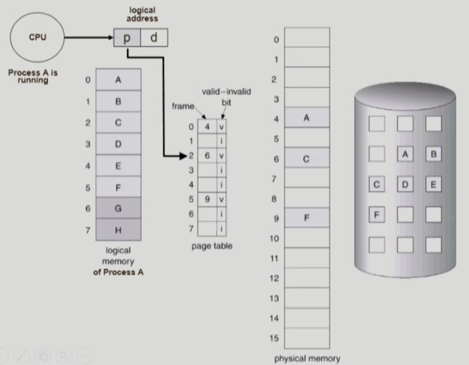

# 캐싱 기법

> `교체 알고리즘(replacement algorithm)`은 가상 메모리 시스템에서의 페이지 교체 뿐 아니라, 어떤 것을 쫓아낼지 결정해야 하는 다양한 환경에서 사용된다.
>
> => 컴퓨터 시스템 안에서 그러한 `교체`를 사용하는 기법을 **캐싱**이라고 부른다.

- 캐싱 기법
  - 한정된 빠른 공간(= 캐시)에 요청된 데이터를 저장해 두었다가, 후속 요청시 캐시로부터 직접 서비스하는 방식
  
  - paging system 외에도 cache memory, buffer caching, Web caching 등 다양한 분야에서 사용
  
    - paging system
  
      - 한정된 빠른 공간 - 물리적 메모리
      - 느린 저장 장치 - 백킹스토어(디스크의 swap area)
      - 가능하면 물리적 메모리로부터 직접 서비스하고, 요청된 페이지가 물리적 메모리에 없는 `페이지 폴트`의 경우에만 백킹스토어에서 물리적 메모리로 읽어온다.
  
    - cache memory
  
      - TLB - `주소 변환`을 위한 캐시
        - CPU가 페이지 테이블을 접근할 때, CPU와 페이지 테이블 사이에 존재하는 **TLB**에 요청된 정보가 있는지 먼저 살펴본다.
      - 그 외에 `일반적인 메모리 참조`에서도 캐시가 사용된다.
      - CPU가 메모리를 접근할 때, CPU와 메모리 사이에 존재하는 **캐시 메모리**에 요청된 정보가 있는지 먼저 살펴본다.
    
  - buffer caching
    
    - 한정된 빠른 공간 - 물리적 메모리
    
    - 느린 저장 장치 - 디스크의 file system
    
      => `paging system`과 매체는 똑같다.
    
    - 파일 시스템에 대한 read/write 요청을 메모리에서 빠르게 서비스하는 방식
    
  - Web caching
    
    - 웹 페이지에 대한 요청을 하면, 멀리 떨어져 있는 웹 서버에서 정보를 가져와서 웹 브라우저에 표시한다. 
    
      만약 잠시 뒤에 동일한 URL에 대해서 요청한다면, 내 컴퓨터에 이미 저장된 웹페이지를 브라우저에 표시하면 더 빠르다.
    
    - 앞의 캐싱 기법들은 단일 시스템에서 저장 매체들 간의 속도 차이 때문에 캐싱을 했던 반면, `Web caching`은 단일 시스템이 아니다.
    
        지리적으로 멀리 떨어져 있는 시스템에서 정보를 읽어오기 때문에 시간이 걸리는 것이다.
- 캐시 운영의 시간 제약
  - `교체 알고리즘`에서 **삭제할 항목을 결정하는 일**에 지나치게 많은 시간이 걸리는 경우, 실제 시스템에서 사용할 수 없음
  - Buffer caching이나 Web caching의 경우
    - O(1)에서 O(log n) 정도까지 허용
  - Paging system인 경우
    - `page fault`인 경우에만 OS가 관여함
    - 페이지가 이미 메모리에 존재하는 경우 참조시각 등의 정보를 OS가 알 수 없음
    - **O(1)인 LRU의 list 조작조차 불가능**

### Paging Sytsem에서 LRU, LFU 가능한가?

*백킹스토어(스왑 영역)에는 이미 모든 페이지가 저장되어 있다.*

- CPU에서 프로세스 A가 `실행(running)`중이다.

  즉 프로세스 A의 <u>논리적 메모리(가상 메모리)</u>에서 매 순간마다 인스트럭션을 읽어서 실행한다.

  > <u>논리적 메모리(가상 메모리)</u>에서 매 순간마다 인스트럭션을 읽어서 실행한다는 말은, 
  >
  > 다음에 실행할 인스트럭션의 `논리적 주소(가상 메모리 주소)`를 **PC**가 가리킨다는 말이다.
>
  > - CPU는 **논리적 주소(가상 주소)에 근거해 `기계어 명령`을 실행**한다.
  > - MMU 기법에서 `사용자 프로그램`이나 `CPU`는 **논리적 주소만을 다룰 뿐**, 실제 물리적 주소는 알지 못하며 알아야 할 필요도 없다.

  - 이때 CPU는 프로세스 A에 대한 `논리적 주소`를 **MMU**에게 입력으로 준다.
  - **MMU**는 페이지 테이블을 통해서 `논리적 주소`를 `물리적 메모리 주소`(출력)로 변환한다.
  - `물리적 메모리 주소`에 해당하는 물리적 메모리 위치에 있는 내용을 CPU로 읽어들인다.

1. `주소 변환`이 완료된 후에 주소에 해당하는 페이지가 이미 물리적 메모리에 올라와 있으면, 물리적 메모리에서 직접 내용을 읽어서 CPU로 가져간다.

   => 이러한 `주소 변환` 과정은 HW가 처리하고 운영체제는 하는 일이 없다. (CPU는 프로세스 A가 점유중)

2. `주소 변환`이 완료된 후에 주소에 해당하는 페이지에 대해 `page fault`가 발생하면, 디스크 접근 즉 I/O가 필요하기 때문에 `페이지 폴트 트랩`을 발생시켜 CPU의 제어권을 운영체제로 넘긴다.

   => 운영체제가 페이지를 디스크로부터 물리적 메모리로 가져오는데, 이때 필요하다면 `교체`를 하게 된다. (물리적 메모리 내에 빈 프레임이 없는 경우)

   - LRU

     - 운영체제는 물리적 메모리 내에 존재하는 페이지 중에서 가장 오래 전에 참조된 페이지를 **알 수 없다**.

     - 1번 경우, 즉 `주소 변환`이 완료된 후에 주소에 해당하는 페이지가 이미 물리적 메모리에 올라와 있는 경우에는 OS에게 CPU가 할당되지 않는다.

       => 따라서 운영체제는 해당 페이지의 **접근시간**을 알 수 없다.

     - 2번 경우, 즉 `주소 변환`이 완료된 후에 주소에 해당하는 페이지에 대해 `page fault`가 발생하는 경우에는 OS에게 CPU가 할당된다.

       => 따라서 운영체제는 디스크에 있던 페이지가 메모리로 올라온 **접근시간**을 알 수 있다.

   - LFU

     - 운영체제는 물리적 메모리 내에 존재하는 페이지 중에서 가장 참조 회수가 적은 페이지를 **알 수 없다**.

   > **페이징 시스템**에서는 `운영체제`에게 정보가 완전하게 주어지지 않으므로, `운영체제`는 `page fault`가 발생한 상황에서만 Linked List나 Heap을 조작할 수 있다.
   >
   > `운영체제`에게 CPU 제어권이 넘어오지 않으면 Linked List나 Heap과 같은 자료구조를 조작할 수 없다.
   >
   > => 따라서 **가상 메모리 시스템(paging system)**에서는 `LRU`, `LFU` 알고리즘을 사용할 수 없다.
   >
   > - 대신 `Clock 알고리즘`을 사용한다.
   >
   > - cf) buffer caching과 Web caching에서는 `LRU`, `LFU` 알고리즘을 사용할 수 있다.

