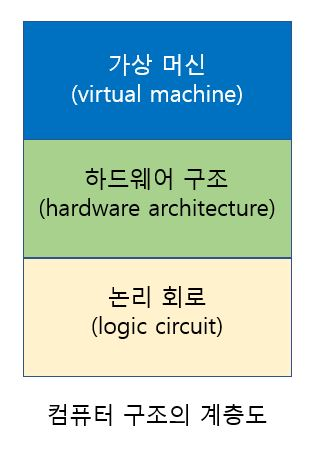

> 
>
> # Part 1: 논리 회로
>
> 반도체를 기반으로 제작되는 `게이트(gate)`를 이용한 논리 회로의 개념에서 시작하여 간단한 회로의 구성법 중심으로 공부한다.
>
> 이 부분에서 공부하는 간단한 연산기(덧셈기 등)의 제작 원리 내용은 컴퓨터 하드웨어 구조에서 CPU를 다루는 부분과 연결된다.

## 2장. 컴퓨터 내부의 데이터 표현

