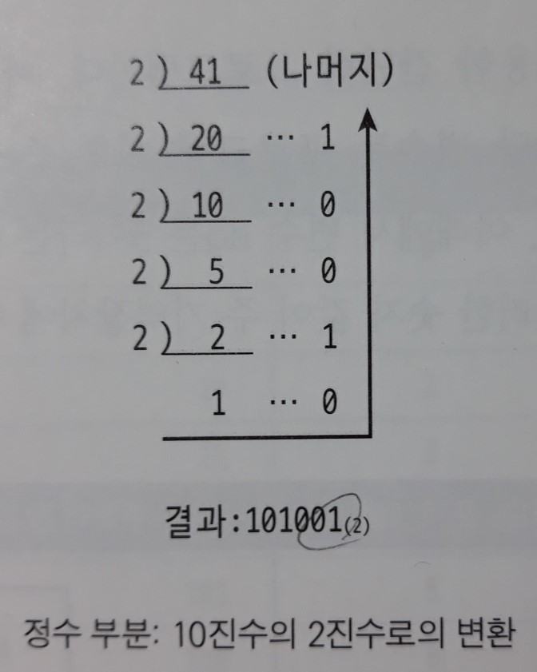
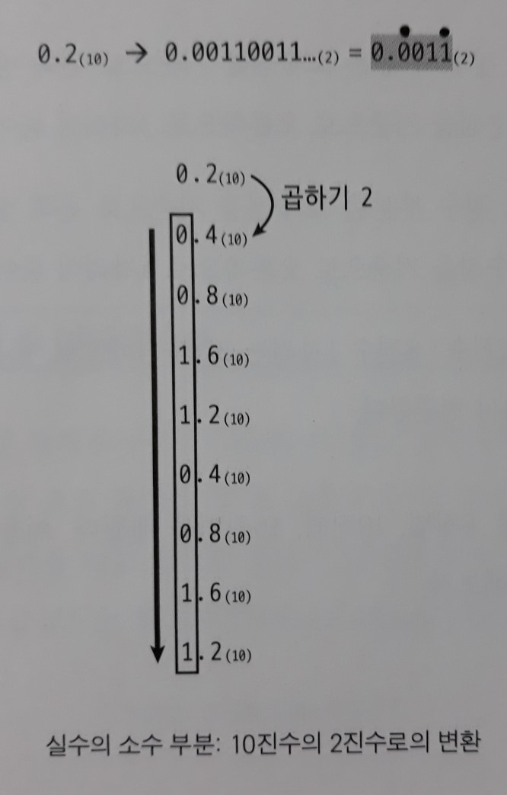

> 
>
> # Part 1: 논리 회로 관점에서의 컴퓨터 구조
>
> 반도체를 기반으로 제작되는 `게이트(gate)`를 이용한 논리 회로의 개념에서 시작하여 간단한 회로의 구성법 중심으로 공부한다.
>
> 이 부분에서 공부하는 간단한 연산기(덧셈기 등)의 제작 원리 내용은 컴퓨터 하드웨어 구조에서 `CPU`를 다루는 부분과 연결된다.

# 2장. 컴퓨터 내부의 데이터 표현

> 실제로 컴퓨터 내부에서 어떻게 데이터가 표현/저장되는지 살펴보자.
>
> 논리 회로는 기본적으로 2진수를 바탕으로 작동하기 때문이다.

## 1. 컴퓨터에서 사용하는 수

컴퓨터 내부에서도 2진법을 이용한 숫자의 표현법의 한계로 원천적으로는 정확한 숫자의 표현이 불가능하다.

- 비트(bit)

  : Binary Digit의 줄임말. 컴퓨터 내부에서의 **정보 저장(표현)의 기본 단위**로써, 2가지 상태(on/off)만 표현 가능하다.

- 바이트(byte)

  : 8비트가 모여 1개의 바이트를 구성한다.

  영문자나 숫자는 보통 1바이트로 표현되며, 한글의 1 글자는 2바이트로 표현한다.

- 워드(word)

  : 여러 개의 바이트를 뭉쳐서 워드라는 단위를 사용한다.
  **일반적으로 컴퓨터에서는 워드 단위로 `주소`를 지정할 수 있다.** (= CPU에서 메인 메모리에 보내는 주소가 워드 단위로 지정된다)

  - Half-Word: 2바이트
  - Full-Word: 4바이트
  - Double-Word: 8바이트


## 2. 진법(numeral system)

10진법은 숫자 기호 10개(0~9)를 이용해서 `무한 개의 숫자`를 표현하는 방법이다.

(진법이 없다면 모든 단위의 숫자에 대한 심볼을 따로 정해야 할 것이다)

- 2진법(binary)

  : 0과 1 두 `심볼(symbol)`만 사용하여 수를 표현하는 방법 

- 8진법(octal)

  : 2진법에서 8진법으로 바꾸려면 오른쪽부터 **3비트**씩 모아서 바꾸면 된다.

- 10진법(decimal)

- 16진법(hexa-decimal)

  : 2진법에서 16진법으로 바꾸려면 오른쪽부터 **4비트**씩 모아서 바꾸면 된다.


## 3. 정수의 표현

2진 데이터는 컴퓨터 내부에서 전기적인 신호로 쉽게 구현되는데, 하드웨어로 구현함에 있어서 수의 표현과 이들 간의 사칙연산(+, -, *, /)에서 `여러 가지 기법`들이 사용된다.

- 컴퓨터에서의 숫자의 표현은 정수(integer numbers)와 실수(real numbers) 표현으로 나눠지며, 이 두 가지는 완전히 다른 형태로 표현된다.

**[2진수로 변환: 정수 부분의 변환]**

- 10진수 -> 2진수: 10진수를 2로 나누어 가면서 남는 **`나머지`를 역순으로 출력**한다.

  

  - 10진법으로 표현된 `41`을 2진법으로 변환하면 `101001`이 되는데, 2진수 표현에서 가장 오른쪽의 1은 해당하는 수를 2로 1번 나누었을 때 생기는 나머지이다.

    즉, 41을 2로 한 번 나누면 나머지는 1이고, 2로 두 번 나누면 나머지는 01이다.

**[2진수로 변환: 소수 부분의 변환]**

- `실수의 변환`을 위해서는 정수 부분의 변환은 2로 나누어가면서 구하고, 소수 부분의 변환은 2로 곱해가면서 구한다.

  - 소수점 아래의 소수 부분은, 2를 계속적으로 곱해가면서 **정수로 자리 올림이 발생하는지 여부**를 기록해서 이를 2진수 변환에 사용하면 된다.

  

  - `10.1011`의 소수점 아래 1번째의 1이라는 숫자는 이 숫자에 2를 1번 곱하면 0보다 큰 수(정수)가 된다. 

    왜냐하면 0.1(2)은 10진수로 보면 1/2 = 0.5이기 때문에 여기서 2를 곱하면 1(10)이 되는 수이기 때문이다.
  
  > 10진수에서는 유한 소수라고 하더라도 2진수에서는 무한 소수가 될 수도 있다.
  >
  > 10진수 0.2는 2진수로 변환하면 무한 소수가 되기 때문에 유한한 비트를 사용하는 컴퓨터에서는 정확하게 표현할 수 없다.

2진수 -> 8진수나, 2진수 -> 16진수 변환의 경우

- 소수점을 기준으로 **정수**는 왼쪽으로 3자리씩, **소수 부분**은 오른쪽으로 3자리씩 세어가면 된다.

  (16진수는 4자리씩)

**[C 언어를 이용하여 정수를 2, 8, 10, 16진법으로 출력하기]**

- 2진수로 출력하는 `포맷 문자(format letter)`는 없다.

``` C
int main(void) {
	int value = 47;
	
	printf("Decimal: %d\n", value);
	printf("Octal: %o\n", value);
	printf("Hexadecimal(small): %x\n", value);
	printf("Hexadecimal(capital): %X\n", value);
	
	printf("Binary: ");
	// 2진수의 모든 비트가 1인지 확인(int는 32비트)
	for(unsigned int i = 1<<31; i>0; i=i/2)
		(value & i) ? printf("1"): printf("0");
	
	return 0;
}

```

결과:

``` C
Decimal: 47
Octal: 57
Hexadecimal(small): 2f
Hexadecimal(capital): 2F
2진수: 00000000000000000000000000101111
```


### 부호없는 정수(unsigned integer: 0과 자연수)

내부적으로 2진수 비트들을 이용해서 표현하기 때문에 표현 방법이 조금 독특하다.

프로그래밍 언어에서 제공해주는 `자료형(data types)`에 따라 다양한 크기(길이)의 비트 수를 사용할 수 있다.

> 실제로는 각 자료형의 크기는 컴파일러에 따라서 조금씩 달라질 수도 있다. 
>
> C 표준안에는 각 자료형이 가져야 하는 '최소한'의 크기로 명시되어 있기 때문이다.

- C언어에서 사용하는 `unsigned integer` 타입은 말 그대로 **부호를 생략**한다.
- 이 경우에는 8비트가 모두 숫자의 '절대값'을 표현하는 방식이다.

|  데이터 타입  | 최소 크기 |  값의 범위  |
| :-----------: | :-------: | :---------: |
| unsigned char | 1 바이트  |  0 ~ +255   |
|     char      | 1 바이트  | -128 ~ +127 |

**[오버플로우]**

``` C
int main(void) {
	unsigned char c;
 
	c = 255;
	c = c+1;
 
	printf("%d\n", c);
 
	c = 0;
	c = c-1;
 
	printf("%d\n", c);
 
	return 0;
}
```

결과:

``` C
0
255
```


n비트를 이용하면 2^n가지 상태를 표현할 수 있다.

> 2진법을 이용한 사칙 연산 방법은 기본적으로는 10진법에서의 연산 방법과 동일하다.

- 덧셈 연산은 가장 오른쪽 자릿수에서 하나씩 더해서 올라가면 된다.

- 오버플로우(overflow)

  : 표현할 수 있는 가장 큰 절대값 수를 넘어서서 정확히 표현할 수 없게 되는 경우
  
  ``` C
    0110 1010(2) = 106(10)
  + 1011 0011(2) = 179(10)
  --------------------------------
  1 0001 1101(2) = 285(10) ???????
  ```
  
  - 덧셈의 결과로 `MSB(Most Significant Bit: 가장 중요한 비트, 가장 왼쪽의 비트)`에서 캐리(carry: 자리 올림)가 발생했다.
  
  - 덧셈 결과인 285은 255보다 크기 때문에 **표현할 수 없다**.
  
    그래서 덧셈의 결과는 캐리를 제외한 `0001 1101(2)` = 29(10)가 된다.
  
  > 컴퓨터는 스스로 오버플로우의 발생 여부를 알 수 있다.
  >
  > 기계어나 어셈블리언어 레벨에서는 이에 대한 대책을 할 수 있다. 저급 언어의 특성을 갖고 있는 C 언어를 이용해서도 할 수 있다.
  >
  > 그렇지만 오버플로우는 프로그램이 실행되는 도중에 발생하기 때문에, 코딩 상황에서 이를 사전에 대비하는 것이 가장 좋은 방법이다.


### 부호있는 정수(signed integer)

부호있는 정수를 표현하는 방법은 2가지 방식이 있다.

- 부호와 절대값 표현
- 보수 표현

#### (1) 부호와 절대값(sign and magnitude)

부호를 명시적으로 표현하는 가장 쉬운 방법

`MSB`가 0이면 '0 또는 양의 정수'를, `MSB`가 1이면 '0 또는 음의 정수'를 나타내는 방식이다.

- 따라서 **+0**과 **-0**, 두 개의 0이 존재한다.
  - `if(a == 0)`과 같은 코드를 내부적으로 두 번 비교해야 한다.

``` C
+5: 0000 0101(2)
-5: 1000 0101(2)
```

- n비트를 이용한 표현 가능한 범위는 -(2^(n-1)-1) ~ (2^(n-1)-1)

  - 장점: 사람에게는 MSB를 제외한 나머지 비트만을 봄으로써 쉽게 부호와 절대값을 알 수 있다.
  - **단점: 컴퓨터로 연산을 수행할 때 복잡한 절차가 필요하다.**

  ``` c
    0000 0101(2) = +5(10)
  + 1000 0101(2) = -5(10)
  ------------------------------
    1000 1010(2) = -10(10)
  ```

  [덧셈의 순서]

  1. 두 수의 부호를 비교한다.
  2. 부호가 동일하면 절대값을 서로 더한 후, 동일한 부호를 붙인다.
  3. 부호가 다르면 절대값이 큰 값에서 절대값이 작은 값을 뺀 후, 큰 절대값의 부호를 붙인다.
  
  => 더해지는 두 수의 부호가 일치하는지 아닌지 검사를 하고,  각각 별도의 연산을 수행해야 함

> CPU의 가장 기본적인 연산은 `덧셈`이다. 덧셈기 하드웨어를 만들고, 이를 조금 수정해서 뺄셈기로 사용하고, 덧셈을 반복적으로 수행해서 곱셈을, 뺄셈을 반복적으로 수행해서 나눗셈을 수행하기 때문이다.

- 그런데 부호와 절대값 표현을 사용하면, 덧셈기의 하드웨어 구현이 복잡해져서 컴퓨터가 느려지게 된다. 

  또한 덧셈기를 만들려고 하는데 내부적으로는 뺄셈기가 필요하게 된다. 

#### (2) 2의 보수표현(two's complement binary representation)

1946년에 EDVAC 컴퓨터를 만들면서 폰 노이만이 제안한 방법으로, 부호를 사용하지 않는 방법이다.

이 보수 표현으로 인해서 CPU 내부의 덧셈기가 간단해 질 수 있었다.

`보수(complement)`는 서로 더하면 0이 되는 숫자들이다.

- **2진수 표현에서 2의 보수**

  : 절대값이 같고 부호가 다른 두 수(= 2진수 덧셈을 수행했을 때 결과가 0이 되는 값을 가지는 숫자 쌍)를 사용하려는 개념에서 출발한다.

  ``` c
    0000 1010(2) = +10(10)
  + 1111 0110(2) = -10(10) <= 이 2진수 숫자 패턴을 -10(10)이라고 생각하는 방식
  -------------------------------
  1 0000 0000(2) =  0(10)  <= 이 결과값을 만들기 위해
  ```

**[2의 보수 표현 구하기`(음수)`]**

보수의 정의를 그대로 사용해서 위의 덧셈식을 아래와 같은 뺄셈식으로 바꾸어 계산하면 된다.

``` c
1 0000 0000(2) =  0(10)
- 0000 1010(2) = +10(10)
----------------------------
  1111 0110(2) = -10(10)
```

- 보통은 이 과정을 2단계로 나누어서 계산한다.

  1. 0보다 1(2) 작은 `1111 1111(2)`에서 빼고

     - 이 뺄셈 연산은 보수를 구하려는 원래 숫자bit에 `NOT 연산`을 한 것과 동일한 결과를 갖는다.

       2진수에서 NOT 연산은 bit를 반전시키는 것을 말하는데, 뺄셈 연산보다 더 빠르다.

     - **따라서 이러한 방식으로 하드웨어를 구현한다.**

  2. 나중에 `1(2)`을 더해준다.

  ``` c
    1111 1111(2)
  - 0000 1010(2)			
  ------------------------
    1111 0101(2)
  + 0000 0001(2)
  ------------------------
    1111 0110(2)
  ```

어떤 양수의 `2진수 표현에서 2의 보수`를, 그에 대응하는 음수bit의 표현으로 사용한다고 정의하면 다음과 같은 **규칙성**을 찾을 수 있다.

- MSB가 1이면 음수, MSB가 0이면 0 또는 양수이다.

- **0의 표현이 하나다.** 0에 해당하는 `0000 0000(2)` 비트 패턴으로 인해서, 실제로 2의 보수는 양수보다 음수가 1가지 더 많은 숫자를 표현할 수 있다.

- n비트를 이용한 표현 가능한 범위는 -2^(n-1) ~ (2^(n-1)-1)

- MSB가 1인 음수들도 MSB를 제외한 나머지 비트들을 보면 **절대값이 큰 수가 실제로도 큰 수**이다. (양수는 당연히 그렇다)

  ex) 1000 0010 = -126(10) `>` 1000 0001 = -127(10) 

**[2의 보수 표현 -> 10진수]**

- MSB가 0이면

  : 0 또는 양수이기 때문에 나머지 비트들의 절대값을 구하면 된다.

- MSB가 1이면

  : 그 수의 2의 보수를 구한 값에 '-'를 붙이면 된다. (2의 보수를 만드는 과정은 `역` 과정도 똑같다 - '보수' 개념상 두 수 모두 서로 보충하는 수라는 점에서 같은 역할이기 때문)

  ex) 1000 1000(2) = -120(10)
  - **장점: 덧셈을 수행할 때 숫자들의 부호에 신경 쓰지 않아도 되므로, 하드웨어로 구현하기 매우 용이하다.** (보수라는 개념 자체가 부호가 없는 표현이기 때문)

    ``` c
      0000 1101(2) = +13(10)
    + 1000 1000(2) = -120(10)
    -------------------------------
      1001 0101(2) = -107(10)
    ```

- 오버플로우

  ``` c
    1111 0011(2) = -13(10)
  + 1000 1000(2) = -120(10)
  --------------------------------
    0111 1011(2) = 123(10)  <= ??? -133(10)은 8비트의 2의 보수 표현으로는 표현 불가능
  ```

**[음의 정수를 2, 8, 10, 16진법으로 출력하기]**

결과:

```c
Decimal: -1
Octal: 37777777777
Hexadecimal(small): ffffffff
Hexadecimal(capital): FFFFFFFF
Binary: 11111111111111111111111111111111
```

> 1의 보수 표현은 0이 +0, -0, 이렇게 2개 존재한다.
>
> 2의 보수 표현은 1의 보수 표현에 비해 음수를 1개 더 표현할 수 있다.


### 정수 연산

- 덧셈

  : 2의 보수에서의 덧셈 연산은 LSB에서 MSB 방향으로(오른쪽에서 왼쪽으로) 차례로 더하면 된다.

  부호를 고려할 필요 없다.

- 뺄셈

  : 2의 보수를 이용하여 덧셈으로 변환한 후 연산한다.

  즉, A-B = A+(-B)

  ex) 3-4 = 3+(-4)

  ```  c
    0011(2) = 3(10)
  + 1100(2) = -4(10)
  -----------------------
    1111(2) = -1(10)
  ```

  