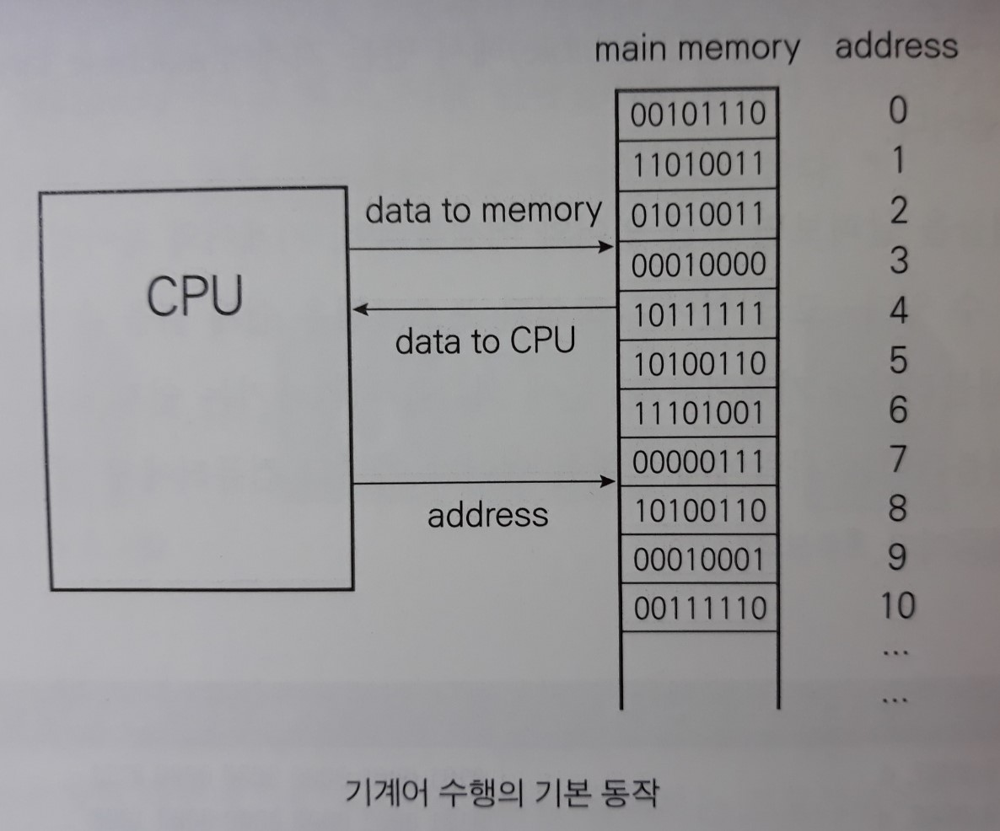
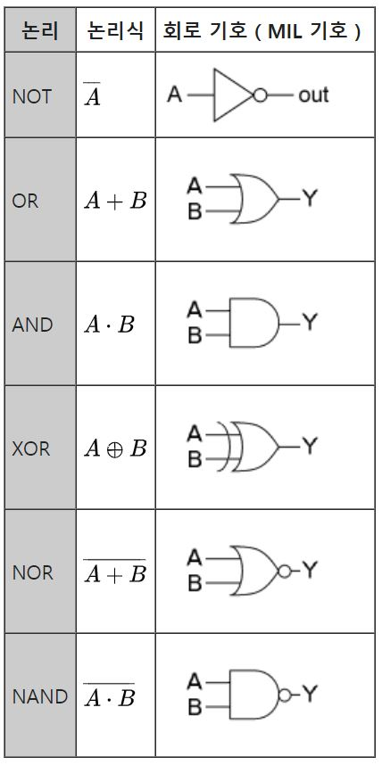

> 
>
> # Part 1: 논리 회로 관점에서의 컴퓨터 구조
>
> 반도체를 기반으로 제작되는 `게이트(gate)`를 이용한 논리 회로의 개념에서 시작하여 간단한 회로의 구성법 중심으로 공부한다.
>
> 이 부분에서 공부하는 간단한 연산기(덧셈기 등)의 제작 원리 내용은 컴퓨터 하드웨어 구조에서 `CPU`를 다루는 부분과 연결된다.

# 3장. 논리 회로 기초

> 실제로 하드웨어 상에서 2진수가 어떻게 표현/연산 되는지를 알기 위해 '논리 회로'를 공부한다.
>
> 논리(logic)라고 말하는 이유는 다음과 같다.
>
> `논리학`에서는 명제가 '참' 또는 '거짓'의 2가지 값으로 표현할 수 있고 이를 바탕으로 논리적인 추론/연산을 수행한다는 점이, 컴퓨터가 '0'과 '1'의 2가지 값을 사용한다는 점과 비슷하기 때문이다.

## 1. 논리 회로를 시작하며

- 기계어(machine language)

  : 컴퓨터 내부에서 수행되는 기계어는 **2진수** 형태이다.

  컴퓨터의 초창기(1960년대)에는 기계어를 이용하여 프로그래밍을 했지만, 지금은 고급 언어로 프로그래밍을 하는 것이 일반적이다.

- 컴파일(compile)

  : 프로그래머가 고급 프로그래밍 언어로 작성한 프로그램을 **기계어**로 바꾸는 과정

  컴파일 해주는 프로그램을 `컴파일러(compiler)`라고 한다.

  - 소스 프로그램(source program)

    : 고급 언어를 이용해서 작성된 프로그램

  - 오브젝트 프로그램(object program)

    : 소스 프로그램을 컴파일러를 통해서 번역한 기계어 프로그램

- 어셈블리어(assembly language)

  : 기계어와 유사하면서 조금 더 읽기 편한 형태의 언어를 의미한다.

기계어 프로그램이 메인 메모리 상에 위치하면서 CPU에 의해서 수행되는 개념

- 디스크 상의 소프트웨어 프로그램은 메인 메모리(주기억 장치)에 올라온 후, 명령어 하나 하나가 순서대로 CPU로 와서 수행된다.

> 이러한 기계어 밑에는 **하드웨어**가 있다.
>
> 따라서 컴퓨터를 구성하는 다양한 세부 시스템들의 기본 구성 원리에 대해서 공부한다.

컴퓨터는 `전자 소자`들의 집합체이다. 컴퓨터는 0과 1을 표현하는 것이 가장 기본이다.

전자 소자들이 어떻게 0과 1을 표현/ 저장하고, 또 어떻게 이들을 이용하여 연산(계산)을 수행하는지 다루는 부분이 **논리 회로(logic gate)**다.

- 전압이 5V이면 1, 전압이 0V이면 0으로 표현하면, 전기 신호로 0과 1이 표현 가능하다.

- `게이트(gates)`

  : 2진수에서의 수학을 다루는 부울 대수(boolean algebra)라는 분야에서 사용하는 다양한 연산들을 실제로 수행하는 하드웨어 소자

  내부적으로는 트랜지스터 회로를 이용해서 만들어진다.

  게이트가 모여서 회로가 되고, 이러한 회로들이 모여서 컴퓨터가 완성된다.

  > 게이트는 **반도체 칩**으로 구성되어 실제 회로 구성에 사용된다.
  >
  > ex) 7400칩 (NAND 게이트를 4개 묶어서 사용하는 구조)

## 2. 기본 게이트

*출처: 위키피디아*

