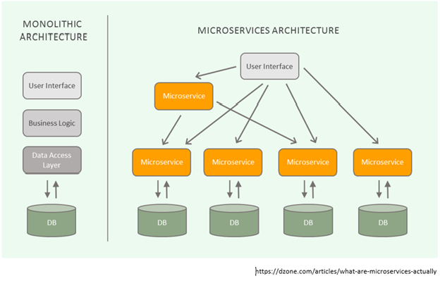

# MSA(Micro Service Architecture)

> 마이크로서비스 아키텍처는 일종의 **소프트웨어 개발 기법**으로, **하나의 큰 어플리케이션을 여러개의 작은 어플리케이션으로 쪼개어 `변경`과 `조합`이 가능하도록 만든 아키텍쳐**이다.

## 등장배경

기존에는 Monolithic Architecture 방식으로 개발을 했다.

`Monolithic Architecture`란 소프트웨어의 모든 구성요소가 한 프로젝트에 통합되어있는 형태이다.

소규모 프로젝트에는 이 Monolithic Architecture가 합리적이다. 간단한 아키텍처이고 유지보수가 용이하기 때문이다.

하지만 일정 규모 이상의 서비스, 혹은 수백명의 개발자가 투입되는 프로젝트에서 한계를 보인다.

- 영향도 파악 및 전체 시스템 구조의 파악이 어려움
- 빌드 시간, 테스트 시간, 배포시간이 기하급수적으로 늘어난다.
- 서비스를 부분적으로 scale-out하기가 힘들다.
- 부분의 장애가 전체 서비스의 장애로 이어지는 경우가 발생한다.

이러한 기존의 Monolithic Architecture의 단점을 보완하는 MSA(Micro Service Architecture)가 탄생했다.

## 특징

- 각각의 서비스는 그 크기가 작을 뿐, 서비스 자체는 하나의 모놀리틱 아키텍처와 유사한 구조를 가짐
- 각 서비스는 독립적으로 배포가 가능해야 함
- 각 서비스는 다른 서비스에 대한 의존성이 최소화 되어야 함
- 각 서비스는 개별 프로세스로 구동, REST와 같은 가벼운 방식으로 통신되어야 함

### 장점

서비스 별 개별 배포 가능(배포시 전체 서비스의 중단이 없음)
클라우드 사용에 적합한 아키텍처
장애가 전체 서비스로 확장될 가능성이 적음

### 단점

서비스 간 호출시 API를 사용하기 때문에 통신 비용이나 Laatency가 그만큼 늘어남
서비스간 장애 전파가 일어날 수 있다.

### Reference

[MSA 제대로 이해하기](https://velog.io/@tedigom/MSA-%EC%A0%9C%EB%8C%80%EB%A1%9C-%EC%9D%B4%ED%95%B4%ED%95%98%EA%B8%B0-1-MSA%EC%9D%98-%EA%B8%B0%EB%B3%B8-%EA%B0%9C%EB%85%90-3sk28yrv0e)

