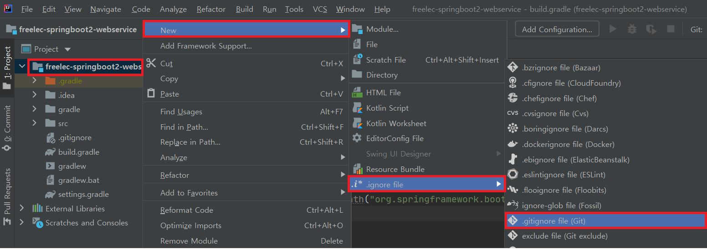

# 1장. 인텔리제이로 스프링 부트 시작하기

스프링 부트 개발 도구로는 `인텔리제이(IntelliJ IDEA)`를 많이 사용한다.

- 다양한 리팩토링과 디버깅 기능을 지원한다.
- 프로젝트를 시작할 때 **인덱싱**을 하여 파일을 비롯한 자원들에 대한 빠른 검색 속도

인텔리제이 커뮤니티(무료)는 HTML과 CSS, 자바스크립트에 대한 지원이 없으므로 VS Code 등 다른 개발 도구를 추천한다.

``` java
젯브레인 툴박스를 이용하면 [설정]->[Settings]에서 Maximum heap size를 설정할 수 있다.
이 설정은 인텔리제이를 실행하는데, 어느 만큼의 메모리를 할당할지 결정하는 값이다.
(기본값 750MB는 개발 PC의 메모리가 4G 이하일 때를 가정하고 설정된 값이다)
```

## 인텔리제이 커뮤니티에서 프로젝트 생성하기

인텔리제이에는 이클립스의 워크스페이스(Workspace)와 같은 개념이 없다. 

`프로젝트(Project)`와 `모듈(Module)`의 개념만 있다.

그래서 인텔리제이를 실행할 때 모든 프로젝트를 한 번에 불러올 수 없다. 

한 화면에서는 하나의 프로젝트만 열린다.

- 프로젝트 유형을 선택하는 화면에서 `Gradle`을 선택해 프로젝트를 생성한다.
- GroupId와 ArtifactId를 등록한다. 여기서 ArtifactId는 프로젝트의 이름이 된다.

모든 설정이 끝나면 Gradle 기반의 자바 프로젝트가 생성된다.


## Gradle 프로젝트를 스프링 부트 프로젝트로 변경하기

> 능숙해지면 **스프링 이니셜라이저(https://start.spring.io/)**를 통해서 진행하면 된다.
>
> 의존성은 라이브러리라고 생각하면 된다.

`build.gradle` 파일을 열어서 최상단에 다음 코드를 입력한다.

``` groovy
buildscript {
    ext {
        springBootVersion = '2.1.7.RELEASE'
    }
    repositories {
        mavenCentral()
        jcenter()
    }
    dependencies {
        classpath("org.springframework.boot:spring-boot-gradle-plugin:${springBootVersion}")
    }
}
```

위의 코드는 이 **프로젝트의 플러그인 의존성 관리**를 위한 설정이다.

- `ext`라는 키워드는 build.gradle에서 사용하는 `전역변수`를 설정하겠다는 의미다.

- `spring-boot-gradle-plugin`(= 말 그대로 gradle의 스프링 부트 플러그인)의 2.1.7.RELEASE를 의존성으로 받겠다는 의미이다.

  > **플러그인**(plugin) 또는 **추가 기능**(애드인;add-in, 애드온;add-on)은 호스트 응용 프로그램과 서로 응답하는 컴퓨터 프로그램이다.
  >
  > 주로 서드파티 개발자들이 응용 프로그램을 확장하는 기능을 만들 수 있도록 제공된다.  
  >
  > -위키백과

다음은 앞서 선언한 **플러그인 의존성들을 적용할 것인지 결정하는 코드**이다.

``` groovy
apply plugin: 'java'
apply plugin: 'eclipse'
apply plugin: 'org.springframework.boot'
apply plugin: 'io.spring.dependency-management'
```

- `io.spring.dependency-management` 플러그인은 스프링 부트의 의존성들을 관리해주는 플러그인이라 꼭 추가해야 한다.
- 앞 4개의 플러그인은 자바와 스프링 부트를 사용하기 위해서는 필수 플러그인들이니 항상 추가하면 된다.

``` groovy
repositories {
    mavenCentral()
    jcenter()
}

dependencies {
    compile('org.springframework.boot:spring-boot-starter-web')
    testCompile('org.springframework.boot:spring-boot-starter-test')
}
```

- `repositories`는 각종 의존성(라이브러리)들을 **어떤 원격 저장소에서 받을지**를 정한다.

  - 기본적으로 mavenCentral을 많이 사용하지만, 개발자들이 직접 만든 라이브러리를 업로드 하기 위해서는 많은 과정이 필요해서 최근에는 jcenter도 많이 사용한다.

- `dependencies`는 프로젝트 개발에 필요한 의존성들을 선언하는 곳이다.

  ``` java
  인텔리제이는 메이븐 저장소의 데이터를 인덱싱해서 관리하기 때문에 커뮤니티 버전을 사용해도 의존성 자동완성이 가능하다.
  자동완성은 compile 메소드 안에 라이브러리의 이름 앞부분을 추가한 뒤 Ctrl+Space를 누르면 목록이 나온다.
  ```

  - 이때 특정 버전을 명시하지 않아야 맨 위에 작성한 `org.springframework.boot:spring-boot-gradle-plugin:${springBootVersion}`의 버전을 따라가게 된다.

    > 이렇게 관리할 경우 각 라이브러리들의 버전 관리가 한 곳에 집중되고, 버전 충돌 문제도 해결되어 편하게 개발을 진행할 수 있다.

전체 코드

``` groovy
buildscript {
    ext {
        springBootVersion = '2.1.7.RELEASE'
    }
    repositories {
        mavenCentral()
        jcenter()
    }
    dependencies {
        classpath("org.springframework.boot:spring-boot-gradle-plugin:${springBootVersion}")
    }
}

apply plugin: 'java'
apply plugin: 'eclipse'
apply plugin: 'org.springframework.boot'
apply plugin: 'io.spring.dependency-management'

group 'com.sonic.book'
version '1.0-SNAPSHOT'

repositories {
    mavenCentral()
    jcenter()
}

dependencies {
    compile('org.springframework.boot:spring-boot-starter-web')
    testCompile('org.springframework.boot:spring-boot-starter-test')
}
```


## 인텔리제이에서 깃과 깃허브 사용하기

대부분의 IT 서비스 회사는 깃을 통해 버전 관리를 하고 있다.

- 깃의 원격 저장소 역할을 하는 서비스는 대표적으로 `깃허브(Github)`와 `깃랩(Gitlab)`이 있다. 둘 다 무료이고 깃허브가 가장 대중적이다.

1. 단축키 Ctrl+Shift+A를 사용해 Action 검색창을 열어 share project on github 검색

2. Share 버튼을 클릭하면 깃허브 저장소와 동기화를 진행한다.

   동기화 과정에서 커밋 항목으로 추가할 것인지 묻는 안내문이 나올 수 있는데 처음에는 **[No]**를 선택한다.

3. 다음으로 프로젝트의 첫 번째 커밋을 위한 팝업창이 등장한다.

   여기서 **`.idea`  디렉토리는 커밋하지 않는다.** 이는 인텔리제이에서 프로젝트 **실행시 자동으로 생성되는 파일들**이기 때문에 깃허브에 올리기에 불필요하다.

4. 커밋 메시지를 작성하고 [OK] 버튼을 누르면 깃 커밋과 깃허브 푸시가 진행된다.

인텔리제이에서는 `.gitignore` 파일에 대한 기본적인 지원이 없다.

대신 **플러그인에서 .gitignore 지원**을 하고 있다. 지원하는 기능은 다음과 같다.

- 파일 위치 자동완성
- 이그노어 처리 여부 확인
- 다양한 이그노어 파일 지원(`.gitignore`, `.npmignore`, `.dockerignore` 등등)

1. 단축키 Ctrl+Shift+A를 사용해 Action 검색창을 열어 plugins를 검색한다.

2. `.ignore`을 검색하여 설치한다.

3. **인텔리제이를 다시 시작해야만 설치한 플러그인이 적용되므로 재시작한다.**

4. 프로젝트 이름을 오른쪽 마우스로 클릭하고 New -> .ignore file -> .gitignore file (Git)

   

5. 미리 만들어 둔 템플릿이 없다면 [Generate] 버튼을 클릭하여 .gitignore 파일을 생성한다.

6. 생성된 파일에 **깃 체크 대상에서 제외하고 싶은** 이름을 작성하면 된다.

   ``` groovy
   # Project exclude paths
   .gradle
   .idea
   ```

깃허브에도 반영하려면

1. Ctrl+K를 눌러 `깃 커밋 창`을 연다.
2. 커밋할 파일을 선택하고 커밋 메시지를 작성한 후 Commit 버튼을 누른다.
3. 단축키 Ctrl+Shift+K를 누르면 푸시 화면이 나온다. Push 버튼을 누르면 된다.

> 깃허브와 연결해두면, **깃허브에 푸시만 하면 바로 배포가 진행되는 환경**을 구성할 수 있게 된다.

