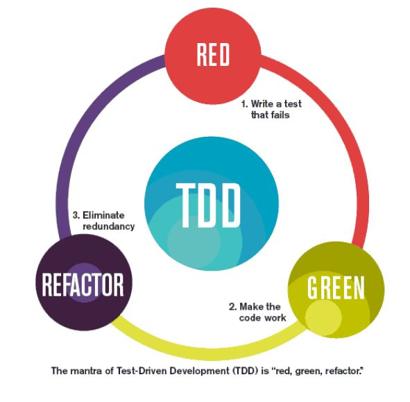
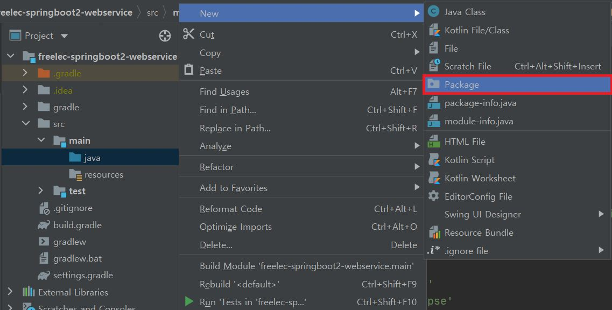
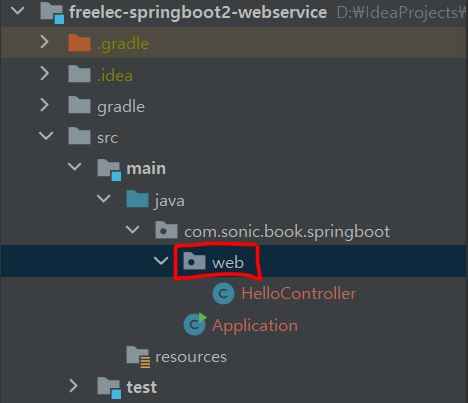

# 2장. 스프링 부트에서 테스트 코드를 작성하자

> 견고한 서비스를 만들기 위해서 TDD를 하거나 최소한 테스트 코드를 꼭 작성하는 것이 좋다.

TDD와 단위 테스트(Unit Test)는 다른 이야기이다.

- TDD 

  : **테스트가 주도하는 개발**

  **테스트 코드를 먼저 작성**하는 것부터 시작한다.

  
  
  **[레드 그린 사이클]**
  
  - 항상 실패하는 테스트를 먼저 작성하고 (`Red`)
  - 테스트가 통과하는 프로덕션 코드를 작성하고 (`Green`)
  - 테스트가 통과하면 프로덕션 코드를 리팩토링 한다. (`Refactor`)
  
- 단위 테스트

  : TDD의 첫 번째 단계인 **기능 단위의 테스트 코드를 작성**하는 것

  TDD와 달리 테스트 코드를 꼭 먼저 작성해야 하는 것도 아니고, 리팩토링도 포함되지 않는다.

  순수하게 테스트 코드만 작성하는 것을 이야기 함

  - 단위 테스트 자체가 문서로 사용할 수 있다.

테스트 코드가 없으면 눈과 손으로 직접 수정된 기능을 확인해야 하므로, 톰캣을 계속 내렸다가 다시 실행하는 일을 반복해야 한다.

**[테스트 코드의 장점]**

1. 테스트 코드를 작성하면 **톰캣을 계속 올렸다 내렸다 할 필요가 없다**. 
2. `System.out.println()`을 통해 눈으로 검증할 필요 없이 **자동검증**이 가능하다.
3. 새로운 기능이 추가될 때, **기존 기능이 잘 작동되는 것을 보장**해준다.

테스트 코드 작성을 도와주는 프레임워크들이 있다.

가장 대중적인 테스트 프레임워크로는 xUnit이 있다. (x는 개발환경)

- JUnit - Java
- DBUnit - DB

## Hello Controller 테스트 코드 작성하기

패키지를 생성한다.



> 일반적으로 패키지명은 **웹 사이트 주소의 역순**으로 한다. 

패키지 아래에 Java 클래스를 생성한다.

패키지 가져오기(`Import`) 단축키는 **[Alt + Enter]**.

``` java
import org.springframework.boot.SpringApplication;
import org.springframework.boot.autoconfigure.SpringBootApplication;

@SpringBootApplication
public class Application {
    public static void main(String[] args){
        SpringApplication.run(Application.class, args);
    }
}
```

- `@SpringBootApplication`으로 인해 스프링 부트의 자동 설정, 스프링 Bean 읽기와 생성이 모두 자동으로 설정된다.

- **`@SpringBootApplication`이 있는 위치부터 설정을 읽어**가기 때문에 이 클래스는 항상 **프로젝트의 최상단에 위치**해야 한다.

- main 메소드에서 실행하는 `SpringApplication.run`으로 인해 **내장 WAS**를 실행한다.

  - 서버에 톰캣을 설치할 필요가 없게 되고, 스프링 부트로 만들어진 `Jar 파일`(실행 가능한 Java 패키징 파일)로 실행하면 된다.

  ``` java
  스프링 부트에서는 내장 WAS를 사용하는 것을 권장한다.
  '언제 어디서나 같은 환경에서 스프링 부트를 배포'할 수 있기 때문이다.
  그래서 많은 회사에서도 내장 WAS를 사용하도록 전환하고 있다.
   *톰캣 역시 서블릿으로 이루어진 자바 애플리케이션으로, 똑같은 코드를 사용하고 있으므로
    성능상 이슈는 크게 차이나지 않는다.
  ```

앞으로 컨트롤러와 관련된 클래스들은 모두 web 패키지에 담을 것



/hello로 요청이 오면 문자열 hello를 반환하는 기능을 가진 API

``` java
import org.springframework.web.bind.annotation.GetMapping;
import org.springframework.web.bind.annotation.RestController;

@RestController
public class HelloController {

    @GetMapping("/hello")
    public String hello(){
        return "hello";
    }
}
```

- `@RestController`
  - 컨트롤러를 **JSON을 반환하는 컨트롤러**로 만들어준다.
  - 예전에는 `@ResponseBody`를 각 메소드마다 선언했던 것을 한번에 사용할 수 있게 해주는 것
- `@GetMapping`
  - HTTP Method인 `Get`의 요청을 받을 수 있는 API를 만들어 준다.
  - 예전에는 `@RequestMapping(method = RequestMethod.GET)`으로 사용되었다.

WAS를 실행하지 않고, 테스트 코드로 검증해보자.

src/test/java 디렉토리에 앞에서 생성했던 패키지를 그대로 생성하여 **테스트 패키지**를 만든다.


``` java
import org.junit.Test;
import org.junit.runner.RunWith;
import org.springframework.beans.factory.annotation.Autowired;
import org.springframework.boot.test.autoconfigure.web.servlet.WebMvcTest;
import org.springframework.test.context.junit4.SpringRunner;
import org.springframework.test.web.servlet.MockMvc;

import static org.springframework.test.web.servlet.request.MockMvcRequestBuilders.get;
import static org.springframework.test.web.servlet.result.MockMvcResultMatchers.content;
import static org.springframework.test.web.servlet.result.MockMvcResultMatchers.status;

@RunWith(SpringRunner.class)
@WebMvcTest(controllers = HelloController.class)
public class HelloControllerTest {

    @Autowired
    private MockMvc mvc;

    @Test
    public void hello가_리턴된다() throws Exception{
        String hello = "hello";

        mvc.perform(get("/hello"))
                .andExpect(status().isOk())
                .andExpect(content().string(hello));
    }
}
```

- `@RunWith(SpringRunner.class)`
  - 테스트를 진행할 때 JUnit에 내장된 실행자 외에 다른 실행자를 실행시킨다.
  - 여기서는 SpringRunner라는 스프링 실행자를 사용한다.
  - 즉, 스프링 부트 테스트와 JUnit 사이에 연결자 역할을 한다.