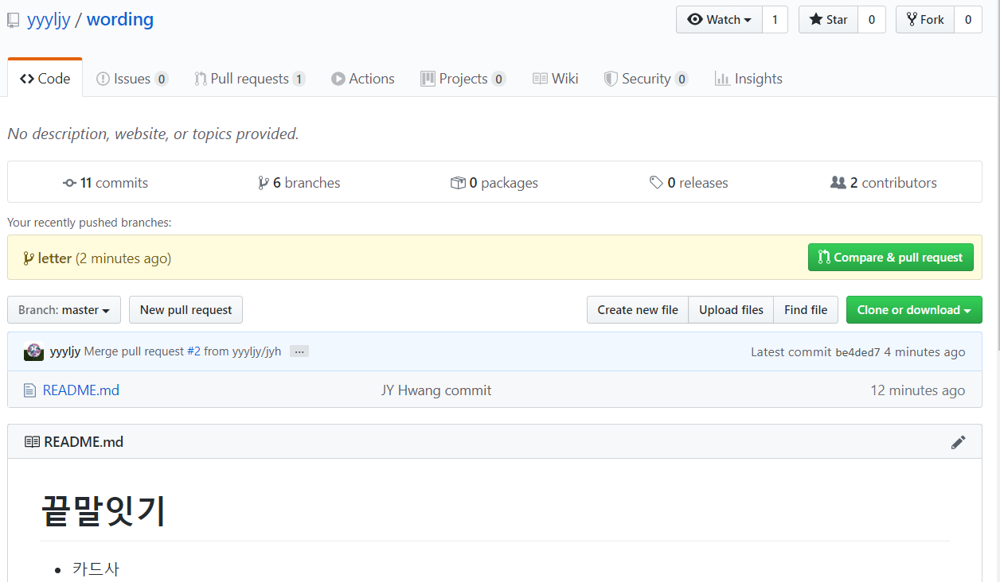
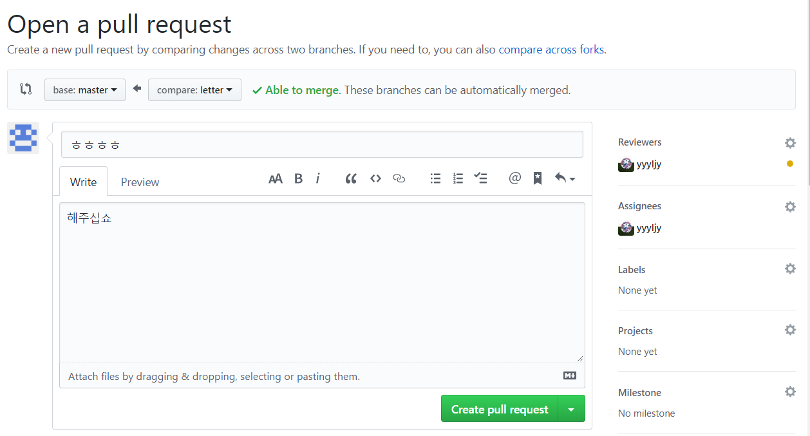

# Github flow

## 1. github (master)

> Collaborator 초대해야 가능
>
> `settings` > `Manage access` > `invite a collaborator`

- 기본 명령어

  ``` bash
  # 폴더 안의 내용만 그대로 가져오고 싶을 때
  $ git clone [git주소] .
  ```

- pull

  |

  add

  |

  commit

  |

  push 	 	반복!!!


## 2. github (branch)

> Collaborator 초대해야 가능

> Pulll Request : branch에서 커밋 하고 병합을 요청

- Pull Request

  : master에서 pull request를 들어가서 병합한 후 merge를 누른다.

  ``` bash
  $ git add .
  $ git commit -m {메시지}
  $ git push origin {브랜치 이름}
  # 그리고 github 저장소에 가서 pull request를 작성한다.
  # 이러면 PR이 master한테 간다. (메시지 공손/ reviewers, assignees를 상대방 이름으로 하면 알람도 감)
  ```

  - Reviewers: 사수가 리뷰해줘야 master한테 넘어간다.

  

  

  

  

- 관리자가 merge or close


## 3. github (Pull request + Fork)

> 권한이 없으므로 fork로 내 저장소로 가져온다.

``` bash
$ git add .
$ git commit -m {메시지}
$ git push origin master
```

- 참여하고 싶은 프로젝트 저장소로 가서 pull request를 만든다.