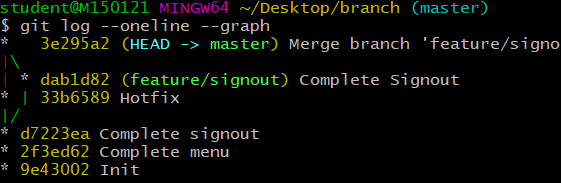
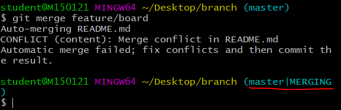
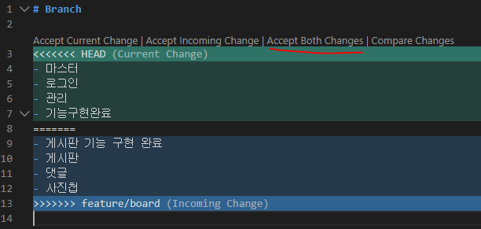
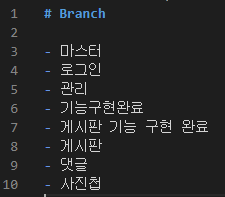
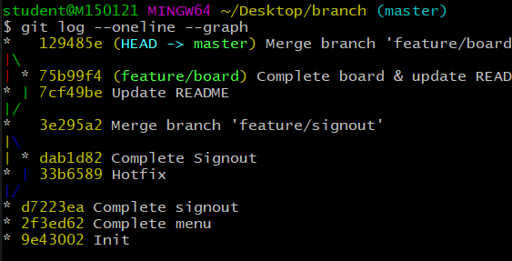

# Git branch

## 1. branch 관련 명령어

> Git 브랜치를 위해 root-commit을 발생시키고 진행하세요.

1. 브랜치 생성

    ```bash
    (master) $ git branch {브랜치명}
    ```

2. 브랜치 이동

    ```bash
    (master) $ git checkout {브랜치명}
    ```

3. 브랜치 생성 및 이동

    ```bash
    (master) $ git checkout -b {브랜치명}
    ```

4. 브랜치 삭제

    => 마스터에 병합된 브랜치는 가지치기 해줘야 한다! 

    ​	<i>(따라서 브랜치 이름을 사람명으로 하지x. 병합한 후 다시 와서 작업하면 안되므로)</i>

    ```bash
    (master) $ git branch -d {브랜치명}
    ```

5. 브랜치 목록

    ```bash
    (master) $ git branch
    ```

6. 브랜치 병합

    ```bash
    (master) $ git merge {브랜치명}
    ```

    * master 브랜치에서 {브랜치명}을 병합

## 2. branch 병합 시나리오

> branch 관련된 명령어는 간단하다.
>
> 다양한 시나리오 속에서 어떤 상황인지 파악하고 자유롭게 활용할 수 있어야 한다.

### 상황 1. fast-foward

> fast-foward는 feature 브랜치 생성된 이후 master 브랜치에 변경 사항이 없는 상황
>
> (나 혼자 작업)

1. feature/test branch 생성 및 이동

   ``` bash
   # 생성하면서 브랜치로 이동함
   (master) $ git checkout -b feature/test 
   Switched to branch 'feature/test'
   (feature/test) $
   ```

2. 작업 완료 후 commit

   ``` bash
   $ touch test.txt
   
   student@M150121 MINGW64 ~/Desktop/branch (feature/test)
   $ git status
   On branch feature/test
   Untracked files:
     (use "git add <file>..." to include in what will be committed)
           test.txt
   
   nothing added to commit but untracked files present (use "git add" to track)
   
   student@M150121 MINGW64 ~/Desktop/branch (feature/test)
   $ git add .
   
   student@M150121 MINGW64 ~/Desktop/branch (feature/test)
   $ git commit -m 'Complete test'
   [feature/test d7223ea] Complete test
    1 file changed, 0 insertions(+), 0 deletions(-)
    create mode 100644 test.txt
   ```


3. master 이동

   ``` bash
   (feature/test) $ git checkout master
   Switched to branch 'master'
   (master) $
   ```


4. master에 병합

   ``` bash
   # 병합할 곳에서 입력해야 한다!
   (master) $ git merge feature/test
   Updating 2f3ed62..d7223ea
   # Fast-forward: master에서는 변경사항이 없었으므로 master를 가리키던 HEAD가 feature/test 가리키면 된다. (이력 하나 앞으로 이동)
   Fast-forward
    test.txt | 0
    1 file changed, 0 insertions(+), 0 deletions(-)
    create mode 100644 test.txt
   ```


5. 결과 -> fast-foward (단순히 HEAD를 이동)

   ``` bash
   $ git log --oneline
   d7223ea (HEAD -> master, feature/test) Complete signout
   2f3ed62 Complete menu
   9e43002 Init
   ```

6. branch 삭제

   ``` bash
   $ git branch -d feature/test
   Deleted branch feature/test (was d7223ea).
   
   ```

---

### 상황 2. merge commit

> 서로 다른 이력(commit)을 병합(merge)하는 과정에서 **다른 파일이 수정**되어 있는 상황
>
> git이 auto merging을 진행하고, **commit이 발생된다.**
>
> (서로 충돌 없이 합칠 수 있는 경우)

1. feature/signout branch 생성 및 이동

   ``` bash
   # 생성하면서 브랜치로 이동함
   (master) $ git checkout -b feature/signout
   Switched to branch 'feature/signout'
   (feature/signout) $
   ```

2. 작업 완료 후 commit

   ``` bash
   $ touch signout.txt
   $ git add .
   $ git commit -m 'Complete Signout'
   
   ```

3. master 이동

   ``` bash
   $ git checkout master
   Switched to branch 'master'
   
   student@M150121 MINGW64 ~/Desktop/branch (master)
   $ git log --oneline
   d7223ea (HEAD -> master) Complete signout
   2f3ed62 Complete menu
   9e43002 Init
   ```

4. *master에 추가 commit 이 발생시키기!!*

   - **다른 파일을 수정 혹은 생성하세요!**

     ``` bash
     $ touch hotfix.txt
     
     student@M150121 MINGW64 ~/Desktop/branch (master)
     $ git add .
     
     student@M150121 MINGW64 ~/Desktop/branch (master)
     $ git commit -m 'Hotfix'
     [master 33b6589] Hotfix
      1 file changed, 0 insertions(+), 0 deletions(-)
      create mode 100644 hotfix.txt
     
     student@M150121 MINGW64 ~/Desktop/branch (master)
     $ git log --oneline
     33b6589 (HEAD -> master) Hotfix
     d7223ea Complete signout
     2f3ed62 Complete menu
     9e43002 Init
     ```

5. master에 병합

   ``` bash
   (master) $ git merge feature/signout
   # vim창: commit 메시지 작성하는 창(저장하고 나가면 커밋이 됨)
   # recursive: 알고리즘 전략 이용됨
   Merge made by the 'recursive' strategy.
    signout.txt | 0
    1 file changed, 0 insertions(+), 0 deletions(-)
    create mode 100644 signout.txt
   ```

6. 결과 -> 자동으로 *merge commit 발생*

   * vim 편집기 화면이 나타납니다.

   * 자동으로 작성된 커밋 메시지를 확인하고, `esc`를 누른 후 `:wq`를 입력하여 저장 및 종료를 합니다.
      * `w` : write
      * `q` : quit
      
   * 커밋이  확인 해봅시다.

      ``` bash
      $ git log --oneline
      3e295a2 (HEAD -> master) Merge branch 'feature/signout'
      33b6589 Hotfix
      dab1d82 (feature/signout) Complete Signout
      d7223ea Complete signout
      2f3ed62 Complete menu
      9e43002 Init
      ```

      

7. 그래프 확인하기

   ``` bash
   $ git log --oneline --graph
   *   3e295a2 (HEAD -> master) Merge branch 'feature/signout'
   |\
   | * dab1d82 (feature/signout) Complete Signout
   * | 33b6589 Hotfix
   |/
   * d7223ea Complete signout
   * 2f3ed62 Complete menu
   * 9e43002 Init
   ```

   

8. branch 삭제

   ``` bash
   $ git branch -d feature/signout
   ```

   

---

### 상황 3. merge commit 충돌

> 서로 다른 이력(commit)을 병합(merge)하는 과정에서 **같은 파일의 동일한 부분이 수정**되어 있는 상황
>
> git이 auto merging을 하지 못하고, 충돌 메시지가 뜬다.
>
> 해당 파일의 위치에 표준형식에 따라 표시 해준다.
>
> 원하는 형태의 코드로 직접 수정을 하고 직접 commit을 발생 시켜야 한다.
>
> (같은 파일을 동시에 작업)

1. feature/board branch 생성 및 이동

   ``` bash
   $ git checkout -b feature/board
   Switched to a new branch 'feature/board'
   ```

2. 작업 완료 후 commit

   ``` bash
   $ touch board.txt
   # README.txt 수정
   $ git status
   On branch feature/board
   Changes not staged for commit:
     (use "git add <file>..." to update what will be committed)
     (use "git restore <file>..." to discard changes in working directory)
           modified:   README.md
   
   Untracked files:
     (use "git add <file>..." to include in what will be committed)
           board.txt
   
   no changes added to commit (use "git add" and/or "git commit -a")
   
   $ git add .
   
   student@M150121 MINGW64 ~/Desktop/branch (feature/board)
   $ git commit -m 'Complete board & update README.md'
   [feature/board 75b99f4] Complete board & update README.md
    2 files changed, 3 insertions(+)
    create mode 100644 board.txt
   
   student@M150121 MINGW64 ~/Desktop/branch (feature/board)
   $ git log --oneline
   75b99f4 (HEAD -> feature/board) Complete board & update README.md
   3e295a2 (master) Merge branch 'feature/signout'
   33b6589 Hotfix
   dab1d82 Complete Signout
   d7223ea Complete signout
   2f3ed62 Complete menu
   9e43002 Init
   ```


3. master 이동

   ``` bash
   $ git checkout master
   ```

   


4. *master에 추가 commit 이 발생시키기!!*

   * **동일 파일을 수정 혹은 생성하세요!**
   
* ``` bash
     # README 수정
     # master에 이동하면 README.txt가 비어있다. 새로 내용 작성(동일한 파일 수정)
     $ git add .
     $ git commit -m 'Update README'
     
     $ git log --oneline
     7cf49be (HEAD -> master) Update README
     3e295a2 Merge branch 'feature/signout'
     33b6589 Hotfix
     dab1d82 Complete Signout
     d7223ea Complete signout
     2f3ed62 Complete menu
     9e43002 Init
     ```
   
   
   
5. master에 병합

   ``` bash
   $ git merge feature/board
   # 자동 머지가 실패했다. 충돌을 고치고 commit 해라
   Auto-merging README.md
   CONFLICT (content): Merge conflict in README.md
   Automatic merge failed; fix conflicts and then commit the result.
   
   (master|MERGING) $
   ```

   

   


6. 결과 -> *merge conflict발생*

   > git status 명령어로 충돌 파일을 확인할 수 있음.
   
   ``` bash
   (master|MERGING) $ git status
   On branch master
   You have unmerged paths.
     (fix conflicts and run "git commit")
     (use "git merge --abort" to abort the merge)
   
   Changes to be committed:
           new file:   board.txt
   
   Unmerged paths:
     (use "git add <file>..." to mark resolution)
           both modified:   README.md
   ```
   
   


7. 충돌 확인 및 해결

   - 해당 파일 편집기창으로 실행해서 원하는대로 수정

   - ```vscode
     <<<<<< HEAD
     * 마스터 작업
     ============
     >>>>>>> feature/board
     * 브랜치 작업
     ```

     

     ​	<i>(이번에는 둘 다  포함을 선택해봄 )</i>

     

     

   - 수정 완료 후 add

   ``` bash
   # VScode 같은 편집기창으로 충돌난 파일을 열면 두 브랜치에서 동일한 부분(#branch)은 그냥 두고 서로 다른 부분만 표시해준다. 그리고 4가지 옵션 중에 하나를 선택하면 자동으로 반영된다.
   # add를 다시 해줘야 한다.
   $ git add .
   ```

   


8. merge commit 진행

    ```bash
    $ git commit
    [master 129485e] Merge branch 'feature/board'
```
   
   * vim 편집기 화면이 나타납니다.
   
   * <b>자동으로 작성된 커밋 메시지</b>를 확인하고, `esc`를 누른 후 `:wq`를 입력하여 저장 및 종료를 합니다.
      * `w` : write
      * `q` : quit
      
   * 커밋이  확인 해봅시다.
   
9. 그래프 확인하기

    


10. branch 삭제

    ``` bash
    $ git branch -d feature/board
    ```


### => 이러한 브랜치 작업들을 로컬에서 하는 것은 힘들기 때문에 `github flow`에서 한다.