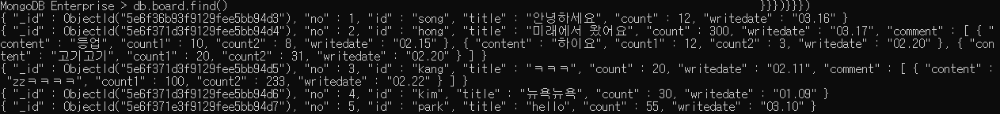

## mongoDB

- noSql = not only sql
- 비정형 데이터(스키마가 없다) - gps, 스트리밍 서버(node.js와 연동)
- 내부에서 데이터를 jSON으로 처리한다.
- 문서 기반: 하나의 문서 안에 모든 데이터들이 들어가므로 JOIN명령어 사용x
- 설문 테이블 => 스키마가 정해져 있으면 7~8개 테이블 JOIN해서 써야해서 힘들다. 비는 공간이 많이 생긴다.

#### [용어]

- collection: 테이블
- document: 레코드
- filed: 컬럼
- _id: 기본키(반드시 들어가야 함)

#### [메소드]

1. collection(rdbms에서 테이블과 동일한 개념)

   => 관계형 데이터베이스처럼 스키마를 정의하지 않는다.

   1) 종류

    - capped collection

      : 고정 사이즈 주고 생성하는 컬렉션 {capped:true, size:10000}

       미리 지정한 저장공간이 모두 사용이 되면 맨 처음에 저장된 데이터가 삭제되고 공간으로 활용된다.

    - non capped collection

      : 일반적인 컬렉션

    2) collection 관리

   ​	[생성]

   - db.createCollection("컬렉션명") -> 일반 collection

   - db.createCollection("컬렉션명", {옵션list})

     => 각각의 옵션을 설정해서 작업(모두 json형식으로 지정)

     [컬렉션 정보 확인]	

     - db.컬렉션명.validate()
     - db.컬렉션명.isCapped()

   ​    [삭제]

   - db.컬렉션명.drop()

   ​    [컬렉션명 변경]

   - db.컬렉션명.renameCollection("변경할 컬렉션명")

##### [실습]

​	-mini 데이터베이스 생성

​	-emp (size: 10000, capped컬렉션)

​	-shop (일반 컬렉션)

​	-데이터베이스 목록, 컬렉션 목록을 캡쳐

​	-컬렉션 validate() 화면 캡처

``` mysql
MongoDB Enterprise > db.logout()
{ "ok" : 1 }
MongoDB Enterprise > use mini
switched to db mini
MongoDB Enterprise > db.createCollection("emp",{capped:true, size:10000})
{ "ok" : 1 }
MongoDB Enterprise > db.createCollection("shop")
{ "ok" : 1 }
MongoDB Enterprise > show dbs
admin   0.000GB
config  0.000GB
local   0.000GB
mini    0.000GB
mydb    0.000GB
MongoDB Enterprise > show collections;
emp
shop
MongoDB Enterprise > db.emp.validate();
{
        "ns" : "mini.emp",
        "nInvalidDocuments" : NumberLong(0),
        "nrecords" : 0,
        "nIndexes" : 1,
        "keysPerIndex" : {
                "_id_" : 0
        },
        "valid" : true,
        "warnings" : [
                "Some checks omitted for speed. use {full:true} option to do more thorough scan."
        ],
        "errors" : [ ],
        "extraIndexEntries" : [ ],
        "missingIndexEntries" : [ ],
        "ok" : 1
}
MongoDB Enterprise > db.shop.validate();
{
        "ns" : "mini.shop",
        "nInvalidDocuments" : NumberLong(0),
        "nrecords" : 0,
        "nIndexes" : 1,
        "keysPerIndex" : {
                "_id_" : 0
        },
        "valid" : true,
        "warnings" : [
                "Some checks omitted for speed. use {full:true} option to do more thorough scan."
        ],
        "errors" : [ ],
        "extraIndexEntries" : [ ],
        "missingIndexEntries" : [ ],
        "ok" : 1
```

2. mongoDB에 insert

   [구문]

   - db.컬렉션명.insert({데이터...})

   - db.컬렉션명.insertOne({데이터...})

   - db.컬렉션명.insertMany({데이터...})

     -document(관계형db에서 레코드와 같은 개념)에 대한 정보는 json의 형식으로 작성

     -mongoDB에서 document를 삽입하면 자동으로 _id가 생성 -기본키의 역할

     "_id" : ObjectId("5e6ee7aad534c83825c2f977")

     "_id" : ObjectId("5e6ee81fd534c83825c2f978")

     ​							=========================

     현재timestamp + machine Id + mongodb프로세스id + 순차번호(추가될 때마다 증가)

   ->jSON validation을 통과하려면 name값에 큰따옴표가 필요하므로 자동으로 할당해준다.(find()로 확인가능)

   ``` mysql
   MongoDB Enterprise > db.emp.find()
   { "_id" : ObjectId("5e6ee7aad534c83825c2f977"), "id" : "jang", "pass" : "1234" }
   ```

   ``` mysql
   MongoDB Enterprise > mydata = {id:"kim",
   ... pass:"1234",
   ... val:1000,
   ... val2:2000}
   { "id" : "kim", "pass" : "1234", "val" : 1000, "val2" : 2000 }
   MongoDB Enterprise > db.emp.save(mydata);
   WriteResult({ "nInserted" : 1 })
   MongoDB Enterprise > for(var i=1100; i<=1120; ++i){
   ... db.emp.save({id:i, msg:"test"})
   ... };
   WriteResult({ "nInserted" : 1 })
   MongoDB Enterprise > db.emp.insert({id:"lee", pass:"1234",info:"jjang", subject: ["java", "jdbc", "hadoop", "sqoop"]});
   WriteResult({ "nInserted" : 1 })
   MongoDB Enterprise > db.emp.insert([{_id:11111, id:"test11", value:2000, value2:3000},
   ... {id:"kang", val1: 2000, val2: 3000, name: "홍길동"},
   ... {id:"hong", val1: 2000, val2: 3000}])
   BulkWriteResult({
           "writeErrors" : [ ],
           "writeConcernErrors" : [ ],
           "nInserted" : 3,
           "nUpserted" : 0,
           "nMatched" : 0,
           "nModified" : 0,
           "nRemoved" : 0,
           "upserted" : [ ]
   })
   MongoDB Enterprise > db.customer.insert({id:"kim", pass: 1234, name:"hj", info: {city: ["seoul", "incheon", "yongin"], toeicjumsu:[700,800,650,850,855]} })
   WriteResult({ "nInserted" : 1 })
   ```

3. mongoDB에 update

   -> document 수정

   -> 조건을 적용해서 수정하기 위한 코드도 json으로 구현

   [update를 위한 명령어]

   ​	$set: 해당 필드의 값을 변경($: 내부에서 인식할 수 있는 명령어)

   ​			non capped collection인 경우 업데이트할 필드가 없는 경우 추가한다.(capped collection에서는 사용불가)	

   ​	$inc: 해당 필드에 저장된 숫자의 값을 증가

   ​	$unset: 해당 필드를 삭제할 수 있다. (관계형 db에서는 스키마가 정해져 있기 때문에 한 필드만 지울 수 없지만 mongoDB에서는 가능하다. capped collection에서는 사용불가)

   ​	- 업데이트 옵션: multi => true를 추가하지 않으면 조건에 만족하는 document 중 첫 번째 document만 update	:{multi:true}

   [구문]

   -> 매개변수 하나하나를 json object로 묶어서 넘겨준다.

   - db.컬렉션명.update({조건필드:값},//sql의 update문 where절

     ​									{$set:{수정할 필드: 수정값}}, //set절 (JSON형식> $set: name, 객체{}: value)

     ​									{update와 관련된 옵션: 옵션값})

``` mysql
MongoDB Enterprise > db.emp.update({id:"jang"}, {$set: {pass:"abcd"}});
WriteResult({ "nMatched" : 1, "nUpserted" : 0, "nModified" : 1 })
MongoDB Enterprise > db.score.update({id:"hong"}, {$set:{msg:"test"}})
WriteResult({ "nMatched" : 1, "nUpserted" : 0, "nModified" : 1 })
MongoDB Enterprise > db.score.update({id:"hong"}, {$unset:{msg:"test"}})
WriteResult({ "nMatched" : 1, "nUpserted" : 0, "nModified" : 1 })
```

*collection을 생성하지 않아도 insert를 하면 자동으로 collection이 생성된다.(non capped collection, 일반 컬렉션으로)


4. mongoDB에서 배열 관리

- 배열 생성

  db.score.update({id:"jang"},

  ​								{$set:

  ​									{info:

  ​										{city:["서울","안양"],

  ​										 movie:["겨울왕국2","극한직업","쉬리"]

  ​										}

  ​									}
  
  ​								})

[배열에서 사용할 수 있는 명령어]

 - $addToSet: 배열의 요소를 추가

    -없는 경우에만 값을 추가, 중복을 체크

   db.score.update({id:"jang"},

   ​								{$addToSet:{"info.city":"인천"}})

- $push: 배열의 요소를 추가 

  -중복을 허용

  db.score.update({id:"jang"},

  ​								{$push:{"info.city":"인천"}})

- $pop: 배열에서 요소를 제거할 때 사용

  1이면 마지막 요소를 제거, -1이면 첫 번째 요소를 제거

  db.score.update({id:"jang"},

  ​								{$pop:{"info.city":1}})

  db.score.update({id:"jang"},

  ​								{$pop:{"info.city":-1}})

``` mysql
MongoDB Enterprise > db.score.update({id:"jang"}, {$set: {info: {city:["서울","안양"],movie:["겨울왕국2","극한직업","쉬리"]}}})
WriteResult({ "nMatched" : 1, "nUpserted" : 0, "nModified" : 1 })
MongoDB Enterprise > db.score.update({id:"jang"}, {$addToSet:{"info.city":"인천"}})
WriteResult({ "nMatched" : 1, "nUpserted" : 0, "nModified" : 1 })
MongoDB Enterprise > db.score.update({id:"jang"}, {$addToSet:{"info.city":"인천"}})
WriteResult({ "nMatched" : 1, "nUpserted" : 0, "nModified" : 0 })
MongoDB Enterprise > db.score.update({id:"jang"}, {$push:{"info.city":"천안"}})  })                              ","쉬리"]}}})
WriteResult({ "nMatched" : 1, "nUpserted" : 0, "nModified" : 1 })
MongoDB Enterprise > db.score.update({id:"jang"}, {$push:{"info.city":"천안"}})
WriteResult({ "nMatched" : 1, "nUpserted" : 0, "nModified" : 1 })
MongoDB Enterprise > db.score.update({id:"jang"}, {$push:{"info.city":"천안"}})
WriteResult({ "nMatched" : 1, "nUpserted" : 0, "nModified" : 1 })
MongoDB Enterprise > db.score.find()
{ "_id" : ObjectId("5e6f128ad534c83825c2f9a7"), "id" : "jang", "name" : "장동건", "dept" : "총무", "addr" : "제주", "java" : 77, "servlet" : 100, "bonus" : 1000, "info" : { "city" : [ "서울", "안양", "인천", "천안", "천안", "천안" ], "movie" : [ "겨울왕국2", "극한직업", "쉬리" ] } }
```

- $each: addToSet이나 push에서 사용할 수 있다.

  여러 개를 배열에 추가할 때 사용

  db.score.update({id:"jang"},

  ​								{$push:

  ​									{"info.city":

  ​										{$each:["천안","가평","군산"]}

  ​									}

  ​								}

  ​							)

- $sort: 정렬(1: 오름차순, -1: 내림차순)

  db.score.update({id:"jang"},

  ​								{$push:

  ​									{"info.city":

  ​										{$each:["천안","가평","군산"],

  ​										 $sort:1

  ​										}

  ​									}

  ​								}

  ​							)

- $pull: 배열에서 조건에 만족하는 요소를 제거(조건은 하나밖에 못준다)

  db.score.update({id:"jang"},

  ​								{$pull:{"info.city":"천안"}}

  ​								)

- $pullAll: 배열에서 조건에 만족하는 요소를 제거(조건을 여러개)

  db.score.update({id:"jang"},

  ​								{$pullAll:{"info.city":["가평","군산"]}}

  ​								)

``` mysql
MongoDB Enterprise > db.score.update({id:"jang"}, {$push:{"info:city":{$each:["천안","가평","군산"]}}})
WriteResult({ "nMatched" : 1, "nUpserted" : 0, "nModified" : 1 })

db.score.update({id:"song"}, {$push:{"history":{$each:["영업 1팀", "총무", "기획실"]}}})
db.score.update({id:"jang"}, {$push:{"history":{$each:["전략팀", "총무", "전산"]}}})
db.score.update({id:"hong"}, {$push:{"history":{$each:["영업 1팀", "기획실", "전산"]}}})

db.score.update({id:"song"}, {$addToSet:{"history":"자금부"}})

db.score.update({id:"jang"}, {$pop:{"history":1}})

db.score.update({servlet:100}, {$inc:{bonus:3000}}, {multi:true})

db.score.update({id:"song"},{$set:{lang:{ms:["visual basic", "asp", ".net"]}}})
```



``` mysql
db.board.insert({no:1, id:"song", title:"안녕하세요", count:12, writedate: "03.16"})
db.board.insert({no:2, id:"hong", title:"미래에서 왔어요", count:300, writedate: "03.17"})
db.board.insert({no:3, id:"kang", title:"ㅋㅋㅋ", count:20, writedate: "02.11"})
db.board.insert({no:4, id:"kim", title:"뉴욕뉴욕", count:30, writedate: "01.09"})
db.board.insert({no:5, id:"park", title:"hello", count:55, writedate: "03.10"})

db.board.update({no:2},{$push:{comment:[
		{content:"등업", count1: 10 ,count2: 8, writedate:"02.15"}]}})

db.board.update({no:2}, {$push:{"comment":{content:"하이요",count1:12,count2:3,writedate:"02.20"}}})
db.board.update({no:2}, {$push:{"comment":{content:"고기고기",count1:20,count2:31,writedate:"02.20"}}})
db.board.update({no:3}, {$push:{"comment":{content:"zzㅋㅋㅋㅋ",count1:100,count2:233,writedate:"02.22"}}})
```

*comment배열을 처음 생성할 때는 대괄호[]를 넣어도 되고 안 넣어도 되지만([]안 넣고 다음 object를 push하면 알아서 배열로 만든다), 그 이후에 push할 때는 대괄호[]를 넣으면 배열 안의 배열이 된다.

​	=> 기본적으로 배열이 원래 존재한다고 생각하고 push해서 원소를 넣으면 된다.

*writedate: new Date()  -> ISODate 타입으로 날짜와 시간이 들어간다.(오라클의 sysdate같은 형태)

 db.board.find().pretty() -> JSON형식을 하나하나 펼쳐서 본다.

 