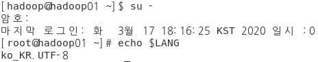
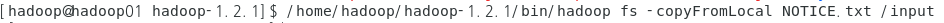
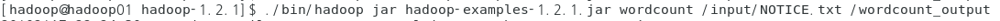
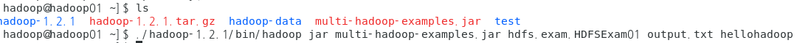
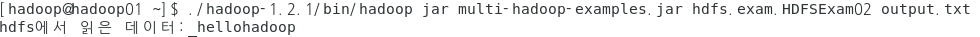

- 인코딩

- fs 명령어 - HDFS를 제어하는 명령어

- 예제 - output

  - 실행 명령어 - 실행하는 명령어

  

  ​	=> 스페이스 단위로 단어를 체크한다.

  

  ​	=> jar명령어/ jar파일명/ jar파일 안에 있는 클래스 명을 패키지까지 포함해서 씀/[ output파일/ 파일에 써줄 내용] (프로그램에 따라 다른 부분)

  ​	=> output 폴더 명시 안해주면 user/hadoop폴더가 생긴다

  

- 예제 - input

