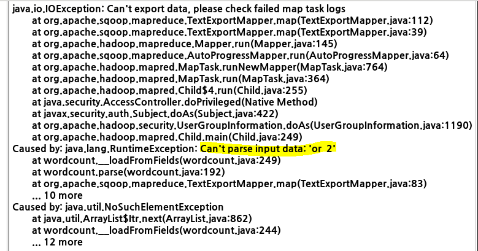
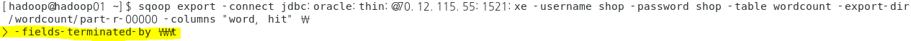

- 폴더 삭제

------

기본 로그 폴더: C:\iot\work\bigdatawork\.metadata\.plugins\org.eclipse.wst.server.core\tmp0\logs

- ip접속 기록 - 총 방문자수, 순 방문자수, ...

HDFS -> DBMS export:

컬럼 1개 짜리를 2개, 3개 컬럼으로 나눠서 export해주는 sqoop옵션자 필요

=> 