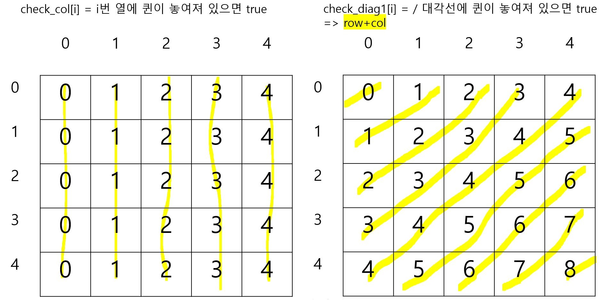
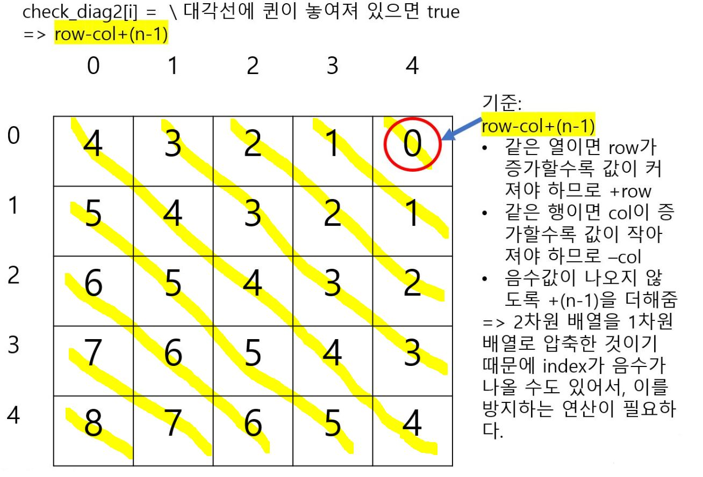

# 브루트 포스

- 모든 경우의 수를 다 해보는 것


**[Java 중복 제거]**

- N과 M (9)

``` java


```


## Problem Solving

- 2차원 배열에서 인접한 4개 칸을 살펴봐야 할 때, 문제에 따라서 오른쪽 칸과 아래쪽 칸만 살펴봐도 되는 문제가 있다. **(순서대로 이동하면 왼쪽과 위쪽을 살펴보는 것은 중복되기 때문)**
  - (사탕 게임)
- N중 for문 -> 재귀 or 비트마스크로 바꿔 풀 수 있다.
- 순서가 중요하거나 선택하는 문제: 순열 or 비트마스크 -> 재귀로 바꿔 풀 수 있다.

### 1. 순열

- Java의 경우에는 [next_permutation 함수]([https://github.com/sonic247897/TIL/blob/master/%EC%95%8C%EA%B3%A0%EB%A6%AC%EC%A6%98/%EC%88%9C%EC%97%B4.md](https://github.com/sonic247897/TIL/blob/master/알고리즘/순열.md))를 만들어서 사용해야 한다.


### 2. 재귀

>1. 불가능한 경우
>
>   : 재귀 호출을 계속해도 정답을 찾을 수 없는 경우/ 문제의 조건을 위배한 경우
>
>2. 정답을 찾은 경우
>
>   : 문제의 조건에 맞는지 확인한다.
>
>3. 다음 경우 호출
>
>   *** 1, 2의 순서는 문제에 따라 바뀔 수 있다.**

``` java
**DFS와 브루트포스의 가장 큰 차이점은 재귀함수 안에서
    check[y][x] = false;
와 같이, DFS는 이미 방문한 칸을 방문하지 않았다는 칸으로 바꾸는 코드를 절대 넣지 않는다.
(모든 브루트포스 문제에서 함수 호출 후에 다시 원 상태로 되돌려주는 작업을 한다)
    
*최단 거리를 구하는 문제에서도 BFS가 아니라 완전탐색으로 풀어야 하는 문제가 있다.
    -두 동전 문제
    구슬이 2개인데 다른 구슬이 이미 방문한 칸(check[y][x]=true)을 또 방문해야 하기 때문에
    BFS가 아니다.
```

**[백트래킹 (Backtracking)]**

- 더 이상 함수 호출이 의미가 없는 경우 더 이상 탐색하지 않는 방법
  
- 경우의 수가 너무 많을 때는, `일단 함수를 작성해보고` 시간복잡도를 개선할 수 있는 방법을 떠올려보자.
  
- **순열, 비트마스크 방법에서도 사용할 수 있다. (일종의 트리 탐색 알고리즘이므로)**
  
  - (맞춰봐 문제)
  
  ``` java
  // 배열 a[] 채워서 리턴 - a의 idx번째 수 정하고 다음경우 호출
  static boolean go(int idx, int n, int[] a, char[][] sum) {
  	// 모든 수 정하면 검사하고 리턴 - 앞에서 먼저 검사했으므로 그냥 리턴
  	if(idx == n) return true;	
      
  	// 다음 경우 호출 - idx열 검사(백트래킹)
  	boolean valid = false; // @ 재귀 함수의 리턴값에 들어갈 값을 저장하는 변수를 선언해야 한다.
  	// '0'이라면 0을 넣는 선택지 밖에 없으므로 따로 처리
  	if(sum[idx][idx] == '0') {
  		a[idx] = 0;
  		if(check(idx, a, sum)) // @@ 백트래킹
  			return go(idx+1, n, a, sum); // 결과가 false면 앞에서부터 잘못 만든 것이므로 true 나올 때까지 리턴
  	}
  		
  	int sign = 1;
  	if(sum[idx][idx] == '-') sign = -1;
  		
  	for(int i=1; i<=10; ++i) {
  		a[idx] = sign*i;
  		if(check(idx, a, sum)) // @@ 백트래킹
  			valid = go(idx+1, n, a, sum);
  		if(valid == true) return true;
  	}
  	// valid == true일 때만 계속 리턴되므로 재귀가 끝나면 올바른 a가 나온다.
  	return false;
  }
  ```
  
- 유명한 백트래킹 문제로는 **N-Queen, 스도쿠** 등이 있다.

  - N-Queen 문제

    : 크기가 N × N인 체스판 위에 퀸 N개를 서로 공격할 수 없게 놓는 문제

    행, 열, 대각선을 check로 표시해두면, 놓을 수 있는지 없는지 검사를 O(1)만에 할 수 있다.

    예를 들어, 행을 기준으로 재귀함수를 구현한다면 열, 왼쪽 대각선, 오른쪽 대각선을 check하는 배열을 만들어야 한다.

    - `대각선의 성질`을 이용하자!
    
    - 노란색 선으로 연결된 칸들은 `하나의 칸`이라고 생각한다. 
    
      먼저, 제일 긴 대각선의 값을 일치시켜주는 식을 생각해보자. (row+col, row-col)
    
    
    
    
    
  - 스도쿠 문제
  
    : 원래 스도쿠는 백트래킹 알고리즘으로는 풀 수 없는 문제이므로, **[백트래킹 알고리즘으로 풀 수 있는 입력만 주어진다.]**라는 제한이 있어야만 풀 수 있다.
  
  - N-Queen: 각각의 칸에 퀸을 넣었을 때 검사해야 할 것 - 열, 대각선
    스도쿠: 각각의 칸에 수를 넣었을 때 검사해야 할 것 - 행, 열, 그 수가 포함되어 있는 정사각형


### 3. 비트마스크

- 비트(bit) 연산을 사용해서 `부분 집합`을 표현할 수 있다.

- `&` (and)

  `|` (or) 

  `~` (not)

  `^` (xor)

- 비트 연산의 시간복잡도는 **O(1)**이다.

- A `<<` B (A를 왼쪽으로 B비트만큼 민다) **==** A*(2^B)

  A `>>` B (A를 오른쪽으로 B비트만큼 민다) **==** A/(2^B)

  > 2^N **==** (1<<N)

**[정수로 이루어진 집합을 정수로 표현]**

- 정수로 집합을 나타낼 수 있다. (64bit을 넘는 비트는 정수로 나타낼 수 없다)

  - {1, 3, 4, 5, 9} = 2^1+2^3+2^4+2^5+2^9 = 570

    - `장점`

      1) 0~9까지의 수 중의 부분집합이라고 하면 boolean[10]배열, 즉 10개의 원소가 필요한데, 이 방법을 사용하면 **1개의 정수로 나타낼 수 있다**. 

      2) 배열의 index로 사용할 수 있다. => `상태 다이나믹`을 할 때 자주 사용

      ​	ex) A[570] **(O)** 

      ​		  A[{1, 3, 4, 5, 9}] **(X)**

- 보통 0부터 N-1까지 정수로 이루어진 집합을 나타낼 때 사용한다.

  - [1, N] 정수로 이루어진 집합은 [0, N-1] 정수로 이루어진 집합을 표현할 때보다 정수가 `2배`로 커지고 연산을 변형해서 사용해야 하므로, **[0, N-1] 집합으로 변형**해서 사용한다.

    (bitmask수를 `배열의 인덱스`로 사용하는 경우, 메모리 사용량이 2배가 되고 연산하는 과정에서 0을 표현하는 bit의 상태를 추적하기 힘들어진다)

  - `&` (and) : 정수가 포함되어 있는지 검사 

    ​	ex) 570 & (1<<3) = 8: 3이 포함되어 있음

    `|` (or) : 정수 추가하기 

    ​	ex) 570 | (1<<2) = 574: 2 추가하기

    `~` (not): 정수 제거하기 

    ​	ex) 570 & ~(1<<4) = 546: 4 제거하기

    `^` (xor): 토글

    ​	ex) 570 ^ (1<<4) = 554: 4 토글하기

  - 전체 집합: (1 << N) - 1 *[2^N-1]*

    > **`원소의 개수`로 N이 주어지고 정수 집합을 [0, N-1]로 두고 풀 때**
    >
    > **2^0+2^1+ ... +2^(N-1) = 2^N -1**
    
    (결국 `원소의 개수`가 중요한데, [0, N] 범위면 원소가 N+1개이므로 (1 << (N+1)) - 1이 전체 집합이다)
    
    공집합: 0 *[0]*
    

**[비트마스크 사용하는 경우]**

  > 문제에 할 수 있는 것이 N개가 있고 **그 중 일부를 선택**해서 할 수 있을 때 모든 방법을 만드는 경우 사용. 
  > **항상 해야하는 일의 개수가 정해져 있고 그 때 2^N으로 모든 상태를 만들 수 있으면 재귀함수 대신 사용할 수 있다.**
  >
  > ​	=> 2^N개의 모든 방법을 다 만들 필요 없는 경우에는 그냥 `재귀`를 쓰는 게 좋다. ex) 스타트와 링크

  - 모든 부분 수열 만들기

    : 각 bit에 0 또는 1 저장

    ``` java
    for(int i=0; i< (1<<n); ++i){
        // 전체 집합 = (1<<n)-1
    }
    // 공집합 제외
    int ans = 0;
    for(int i=1; i< (1<<n); ++i) {
    	int sum = 0;
    	for(int k=0; k<n; ++k) { // for문 돌면서 k번째 수 포함되어 있는지 검사
			if((i & (1<<k)) != 0) {
    		 	sum += a[k];
    		}
    	}
    	if(sum == s) ++ans;
    }
    ```
    
    - (부분수열의 합, 종이 조각)
      - **종이 조각 문제**: 2차원 배열을 1차원 bitmask수로 생각해서 푼다.(가로0와 세로1로 이루어져 있으므로)
