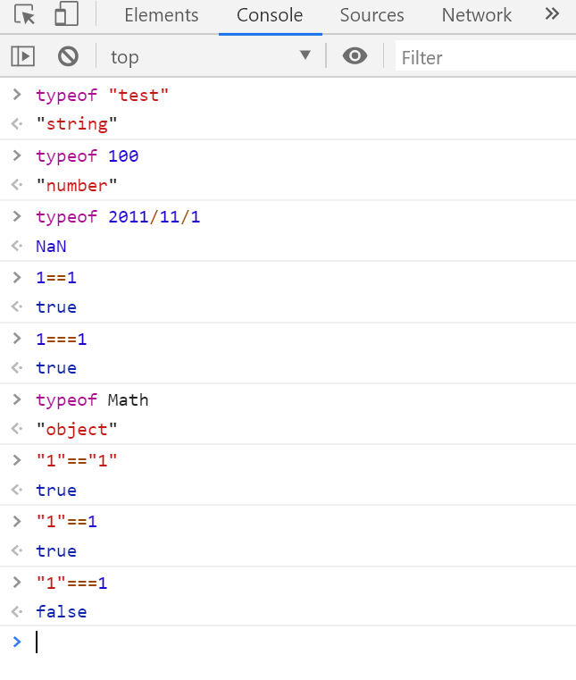

## Console창 사용

``` javascript
function deleteDivAndP(){
			// root의 모든 하위 엘리먼트 제거
			parentNode = document.getElementById("root");
			childnodelist = parentNode.childNodes;
			// length변수는 자동으로 변하므로 for문 조건에 넣기 전에 저장해야 한다.
			size = childnodelist.length;
			for(i=0; i<size; ++i){
				// F12 누르고 console창 누르면 나온다.
				console.log(size);
				parentNode.removeChild(parentNode.lastChild);
			}
			
		}
```

- 크롬의 F12 Console창



`===`은 type까지 체크한다. (권장됨)