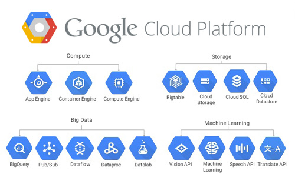

# 1장. 구글 클라우드 소개

> 구글 클라우드는 구글의 **데이터센터 인프라를 기반**으로 `컴퓨트`, `스토리지`, `네트워킹`, `빅데이터`, `머신 러닝 `등의 서비스를 제공하는 글로벌 클라우드다.

- 컴퓨트 서비스
  - VM 기반의 IaaS(Infrastructure as a Service)인 컴퓨트 엔진(Compute Engine)
  - PaaS(Platform as a Service)인 앱 엔진(App Engine)
  - 쿠버네티스(Kubernetes) 기반의 도커 런타임인 컨테이너 엔진(Container Engine)

[구글 클라우드의 특징]

- 빅데이터와 머신 러닝 서비스
- 구글 전용 네트워크를 이용한 글로벌 커버리지
- 저렴한 가격 모델

## 1. 빅데이터와 머신 러닝 서비스

구글은 억 단위의 사용자를 보유한 대규모 서비스를 전 세계에 제공하는 회사다.

그만큼 빅데이터 처리에 관한 노하우를 많이 가지고 있고, 그 노하우를 바탕으로 한 서비스를 구글 클라우드 플랫폼을 통해서 제공하고 있다.

구글의 빅데이터 서비스는 크게 **빅데이터**와 **머신 러닝**으로 구별된다.

### 1) 빅데이터 분석 플랫폼

데이터를 분석하기 위한 데이터의 수집, 가공, 저장 기능을 제공하는 서비스

- 빅쿼리 (BigQuery)

  : 대규모 데이터 저장 및 분석 플랫폼으로, **일종의 데이터 웨어하우스**라고 생각하면 된다.

  - 1,000억 개의 레코드에 대한 질의를 30초 정도에 수행해준다.
  - 문법이 SQL과 유사하다.

- 데이터플로(Dataflow)

  : 아파치 스파크(Spark)나 플링크(Flink)와 같이 **실시간 스트리밍 분석 및 배치 분석**을 지원하는 플랫폼

  - 오픈 소스 프레임워크인 `아파치 빔(Bean)`에 기초하고 있다.
  - 수집한 데이터를 변환하거나
  - 여러 데이터 소스와 저장소 간의 연결(라우팅)을 담당한다.

- 펍/섭(Pub/Sub) 큐

  : 카프카(Kafka)와 같은 **대규모 큐잉 시스템**

  - 데이터를 대규모로 수집하는 역할을 한다.

- 클라우드 데이터랩(Datalab)

  : 데이터 과학자나 엔지니어가 여러 가지 데이터 소스에 접속해서 MS 워드와 같은 환경에서 작업 내용을 저장하고, 구글 빅쿼리 등과 연결해서 바로 질의를 수행할 수 있는 **웹 기반의 도구**이다.

  - 마크업을 지원한다.
  - Jupyter Notebook의 구글 클라우드 버전이라고 생각하면 된다.

- 데이터프록(Dataproc)

  : 오픈소스 빅데이터 플랫폼인 **하둡(Hadoop)과 스파크의 매니지드 서비스**
  
  - 클러스터를 90초 안에 배포할 수 있고 분당 과금을 지원한다.
  
- 데이터 스튜디오(Data Studio)

  : SQL이나 빅쿼리 등의 데이터 소스를 기반으로 시각적인 **보고서를 생성**해주는 제품

  - 파워포인트처럼 간단하게 드래그-앤-드롭 만으로 보고서를 생성할 수 있다.

### 2) 머신 러닝 플랫폼

머신 러닝 기반의 인공 지능 기능들도 서비스로 제공한다.

크게 머신 러닝 API군과 **텐서플로 기반**의 머신 러닝 플랫폼을 제공한다.

- 머신 러닝 API들

  : 머신 러닝 개념을 모르더라도 약 20~30줄의 코드만으로 머신 러닝 기능을 바로 사용할 수 있도록 해준다.

  - 스피치(Speech)

    : 음성을 인식하여 텍스트로 변환해준다.

  - 번역(Translate)

  - 비전(Vision)

    : 사진 이미지에서 사람의 표정과 사물을 인식해준다.

- 텐서플로(Cloud Machine Learning) 서비스

  : Tensorflow는 알파고에 탑재된 `딥러닝 프레임워크`다.

  이 프레임워크는 **오픈소스**로 공개되었고, 구글 클라우드에서는 이 텐서플로를 **CloudML**이라는 이름의 클라우드 서비스로 제공한다.

  - 이 서비스는 구글이 자체 개발한 텐서플로 전용 CPU인 `TPU(Tensor Processing Unit)`를 이용하여 실행된다.
  - 자신만의 머신 러닝 서비스를 개발하고자 하는 사람에게 더 강력하고 대용량의 컴퓨팅 파워를 제공한다.

## 2. 구글 전용 네트워크를 이용한 글로벌 커버리지

구글 클라우드 기능 중에서 **전 세계에 깔린 구글 광케이블망을 이용하여 네트워크를 가속**하는 기능이 있다.

구글 클라우드 데이터센터로 접속하려 하면, 클라이언트에서 가장 가까운 센터로 접속한 후에, **데이터센터 사이를 연결하는 구글 전용망(광케이블)을 통해서** 목표 데이터센터로 연결된다.

- 다른 클라우드 서비스보다 훨씬 빠른 네트워크 접속 시간을 제공
- 별도의 추가 비용도 없다.

## 3. 저렴한 가격 모델

- 시간당 과금이 아닌 분당 과금
- 큰 폭의 할인
- 사용자가 직접 필요한 CPU와 메모리양을 지정하여 자원 낭비 없이 필요한 만큼만 사용할 수 있다.

