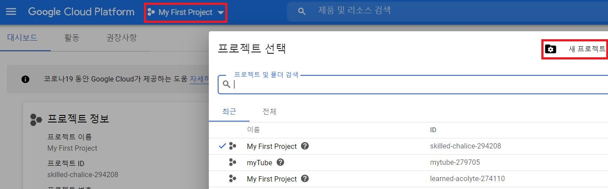
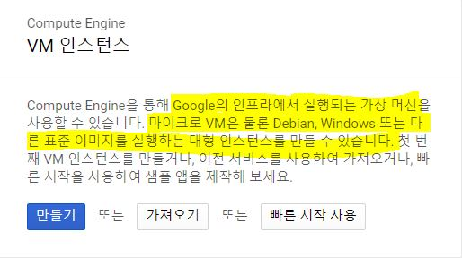

# 2장. 구글 클라우드에서 VM 생성하기

> 클라우드를 이용할 때 가장 기본이 되는 **VM 인스턴스 생성** 방법을 알아보자.

## 1. 계정 가입

https://cloud.google.com/로 가서 [무료로 시작하기] 버튼을 눌러서 구글 클라우드에 가입한다.

무료 평가의 경우 90일간 $300를 사용할 수 있는 크레딧이 자동으로 등록되며, 사용자가 명시적으로 상품을 업그레이드하지 않으면 과금이 발생하지 않는다.

## 2. 프로젝트 생성

프로젝트는 VM, 네트워크 자원, SQL 등의 **클라우드 자원을 묶어서 관리하는 논리적인 집합**이다.

여러 사람이 하나의 클라우드를 사용할 때 이렇게 프로젝트를 만들어서 프로젝트별로 과금하거나, 시스템이나 팀별로 프로젝트를 나눠서 정의하면 관리하기가 쉽다.

- 구글 클라우드 플랫폼(GCP) 콘솔 화면 오른쪽 위의 프로젝트 선택 메뉴 -> [프로젝트 생성]

  

## 3. VM 생성

GCP 콘솔의 왼쪽 위의 버튼을 클릭하면 **GCP가 제공하는 제품과 서비스**를 선택하는 메뉴가 나타난다.

[Compute Engine]을 선택한다.

그러면 왼쪽 메뉴가 바뀌는데 그중 [VM 인스턴스]를 선택한 후, [인스턴스 만들기]를 클릭해서 인스턴스를 생성한다.

- 인스턴스 이름: 마음대로
- 리전: asia-northeast3(서울)
- 영역: asia-northeast3-a
- 머신 유형: e2-medium(vCPU 2개, 4GB 메모리)
- 부팅 디스크: Debian GNU/Linux 10, 표준 영구 디스크 10GB
- ID 및 API 액세스 > 액세스 범위: 모든 Cloud API에 대한 전체 액세스 허용
  - VM에서 Cloud Storage에 write 할 수 있다.
- 방화벽: 기본값
  - HTTP/HTTPS 트래픽 허용은 나중에. 지금은 SSH로만 접근할 수 있도록 설정한다.

영역(zone)은 VM이 생성되는 장소라고 생각하면 된다.

지역(region)이 가장 큰 개념으로 대륙을 정의한다. 각 지역의 데이터센터를 영역으로 생각하면 된다.

[ID 및 API 액세스] > [액세스 범위]를 "`모든 Cloud API에 대한 전체 액세스 허용`"으로 설정해줘야 한다.

구글 클라우드가 제공하는 API나 Cloud SQL, BigQuery, Vision API 등의 다른 서비스를 호출할 수 있는 권한을 이 VM에 주는 것이다. (이 설정은 VM 생성 초기에 하지 않으면 나중에 변경할 수 없다!)

