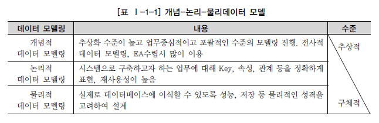
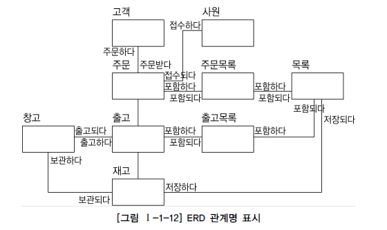
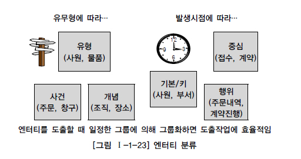
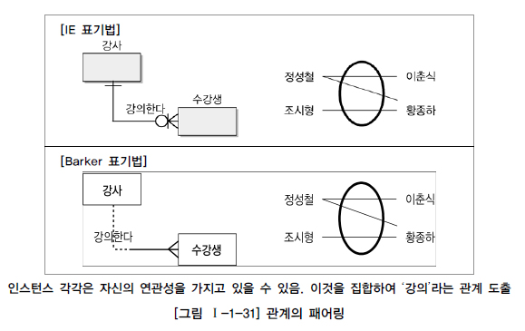
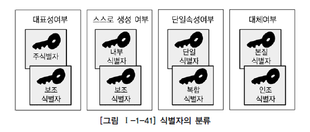
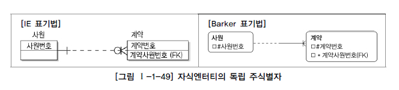

# Ch01. 데이터 모델링의 이해

## 1. 데이터 모델링의 이해

### `제1절 데이터 모델의 이해`

#### 1. 모델링의 이해

##### 가. 모델링의 정의

> **모델링**은 데이터베이스에만 국한된 개념이 아니다. 

- `모델` - 현상에 대해서 **일정한 표기법**에 의해 표현해 놓은 모형

- `모델링` - 모델을 만들어가는 일

##### 나. 모델링의 특징

- 1) 추상화

  : 현실세계를 **일정한 형식(표기법)**에 맞추어 표현

- 2) 단순화

  : 복잡한 현실세계를 **제한된 표기법이나 언어**로 표현

- 3) 명확화

  : 대상에 대한 **애매모호함을 제거**

- 따라서 `모델링`을 다시 정의하면 ‘현실세계를 추상화, 단순화, 명확화하기 위해 일정한 표기법에 의해 표현하는 기법’으로 정리할 수 있다. 

- `정보시스템 구축`에서는 모델링을 `계획/분석/설계` 할 때 업무를 분석하고 설계하는데 이용하고, 이후 `구축/운영` 단계에서는 변경과 관리의 목적으로 이용하게 된다.

##### 다. 모델링의 세 가지 관점


- 1) 데이터관점 : **업무가 어떤 데이터와 관련이 있는지** 또는 **데이터간의 관계는 무엇인지**에 대해서 모델링하는 방법(What, Data) 

  > 이 장에서는 데이터 모델링에 대한 기본 개념이 중요하므로 프로세스와 상관모델링에 대한 내용은 생략하고 `데이터베이스`를 구축하기 위한 **데이터 모델링을 중심으로 설명한다**.

- 2) 프로세스관점 : 실제하고 있는 업무는 무엇인지 또는 무엇을 해야 하는지를 모델링하는 방법(How, Process) 

  > `애플리케이션`을 구축하기 위한 모델링이다.

- 3) 데이터와 프로세스의 상관관점 : 업무가 처리하는 일의 방법에 따라 데이터는 어떻게 영향을 받고 있는지 모델링하는 방법(Interaction)

  > `데이터 축`과 `애플리케이션 축`을 **상호 검증**하는 모델링이다.


#### 2. 데이터 모델의 기본 개념의 이해

##### 가. (데이터)모델링의 정의

- `데이터 모델` - **데이터베이스의 논리적인 구조** 

  `데이터 모델링`은 다음과 같이 정의될 수 있다.
  
  - 정보시스템을 구축하기 위한 **데이터 관점의 업무 분석 기법**
  - **데이터베이스를 구축하기 위한 분석, 설계의 과정**


- 데이터 모델링을 하는 목적

  - 1) 정보들을 일정한 표기법에 의해 표현함으로써 **업무 내용을 정확하게 분석**

  - 2) 분석한 모델을 가지고 **실제 데이터베이스를 생성하여 개발 및 데이터관리에 사용**

    > 즉 `데이터 모델링`이라는 것은 단지 데이터베이스만을 구축하기 위한 용도로만 쓰이는 것이 아니라, 데이터 모델링 자체로서 업무를 설명하고 분석하는 부분에도 매우 중요한 의미를 가지고 있다고 할 수 있다.

##### 나. 데이터 모델이 제공하는 기능

- 업무를 분석하는 관점에서 `데이터 모델`이 제공하는 기능은 다음과 같다.
  - 시스템의 구조와 행동을 **명세화** 할 수 있게 한다.
  - 시스템 구축 과정에서 결정한 것을 **문서화**한다.
  - 다양한 영역에 집중하기 위해 <u>다른 영역의 세부 사항은 숨기는</u> **다양한 관점을 제공**한다.


#### 3. 데이터 모델링의 중요성 및 유의점

##### 가. 파급효과(Leverage)

- `데이터 모델`의 변경이 불가피한 상황이 발생한다고 가정해 보자. 이를 위해서 데이터 구조의 변경에 따른 많은 `영향 분석`을 하고 나서야 실제적인 변경작업이 이뤄진다. **데이터 구조의 변경으로 인한 일련의 변경작업은 전체 시스템 구축 프로젝트에서 큰 위험요소이다.** 이러한 이유로 인해 시스템 구축 작업 중에서 다른 어떤 설계 과정보다 데이터 설계가 중요하다고 볼 수 있다.

##### 나. 복잡한 정보 요구사항의 간결한 표현(Conciseness)

- `데이터 모델`은 구축할 시스템의 정보 **요구사항**과 **한계**를 가장 명확하고 간결하게 표현할 수 있는 도구이다. `데이터 모델`은 시스템을 구축하는 많은 관련자들이 `설계자`의 생각대로 정보요구사항을 이해하고 이를 운용할 수 있는 애플리케이션을 개발하고 데이터 정합성을 유지할 수 있도록 하는 것이다.

##### 다. 데이터 품질(Data Quality)

- 데이터 품질의 문제를 발생시키는 중대한 이유 중 하나가 바로 `데이터 모델의 문제`이다. 
  
  `데이터 모델링`을 할 때 유의점은 다음과 같다.
  
- 1) 중복(Duplication)

  : **`데이터 모델`은 같은 데이터를 사용하는 사람, 시간, 그리고 장소를 파악하는데 도움을 준다.** 이러한 지식 응용은 데이터베이스가 여러 장소에 같은 정보를 저장하는 잘못을 하지 않도록 한다.

- 2) 비유연성(Inflexibility)

  : `데이터 모델`을 어떻게 설계했느냐에 따라 사소한 업무변화에도 `데이터 모델`이 수시로 변경됨으로써 유지보수의 어려움을 가중시킬 수 있다. **데이터의 정의를 데이터의 사용 프로세스와 분리함으로써 `데이터 모델링`은 데이터 혹은 프로세스의 작은 변화가 애플리케이션과 데이터베이스에 중대한 변화를 일으킬 수 있는 가능성을 줄인다.**

- 3) 비일관성(Inconsistency)

  : **데이터의 중복이 없더라도 비일관성은 발생한다.** 예를 들어 신용 상태에 대한 갱신 없이 고객의 납부 이력 정보를 갱신하는 것이다. `개발자(설계자와 다른 경우)`가 다른 데이터와 모순된다는 고려 없이 일련의 데이터를 수정할 수 있기 때문이다. `데이터 모델링`을 할 때 **데이터와 데이터간 상호 연관 관계에 대한 명확한 정의**는 이러한 위험을 사전에 예방할 수 있도록 해준다.


#### 4. 데이터 모델링의 3단계 진행

- 데이터 모델은 `데이터베이스를 만들어내는 설계서`이다. 

- 현실세계에서 데이터베이스까지 만들어지는 과정은 아래와 같이 **시간에 따라 진행되는 과정**으로서 `추상화 수준`에 따라 개념적 데이터 모델, 논리적 데이터 모델, 물리적 데이터 모델로 정리할 수 있다.

  > 모델링의 세 가지 관점 중, 데이터관점으로만 볼 것이기 때문에 전부 **데이터 모델**에 대한 설명이다.

  

  

*전사적 데이터 모델(Enterprise Data Model)은 데이터 모델링 과정이 전 조직에 걸쳐 이루어지는 것이다.*

##### 가. 개념적 데이터 모델링(Conceptual Data Modeling)

- 조직, 사용자의 **데이터 요구사항**을 찾고 분석하는데서 시작한다. 

- `엔터티-관계 다이어그램` - **핵심 엔터티와 그들 간의 관계**를 표현하는 다이어그램

- 개념 데이터 모델을 통해 조직의 데이터 요구를 공식화하는 것은 두 가지의 중요한 기능을 지원한다. 

  첫째, 개념 데이터 모델은 추상적이므로 (`설계자` 외에도) **`사용자`와 `개발자`가 데이터 요구 사항을 발견**하는 것을 지원한다. 

  둘째, 현 시스템이 어떻게 변형되어야 하는가를 추상적 모델링을 통해 더 쉽게 이해할 수 있다.

##### 나. 논리적 데이터 모델링(Logical Data Modeling)

- 논리 데이터 모델링은 **데이터베이스 설계 프로세스의 Input**으로써 비즈니스 정보의 논리적인 구조와 규칙을 **명확하게 표현**하는 과정이다. 논리 데이터 모델은 `물리적인 스키마 설계`를 하기 전에, 누가(Who), 어떻게(How: Process) 그리고 비즈니스 데이터에 존재하는 사실들을 인식하여 기록하는 것이다. 
- `정규화` - 논리 데이터 모델의 일관성을 확보하고 `중복을 제거`하여 속성들이 가장 적절한 엔터티에 배치되도록 한다.
- `상세화` - 식별자 확정, `정규화`, M:M 관계 해소, 참조 무결성 규칙 정의 등

##### 다. 물리적 데이터 모델링(Physical Data Modeling)

- **논리 데이터 모델이 어떻게 컴퓨터 HW에 표현될 것인가**를 다룬다. 데이터가 물리적으로 컴퓨터에 어떻게 저장될 것인가에 대한 정의를 `물리적 스키마`라고 한다. 
- 이 단계에서 결정되는 것은 **테이블, 칼럼 등으로 표현되는 물리적인 저장구조**와 **사용될 저장 장치**, **자료를 추출하기 위해 사용될 접근 방법** 등이 있다.

실제 프로젝트에서는 개념적 데이터 모델링과 논리적 데이터 모델링을 한꺼번에 수행하여 논리적인 데이터 모델링으로 수행하는 경우가 대부분이다. 

프로젝트 생명주기에 따른 일반적인 데이터 모델은 다음과 같이 수행된다.


#### 5. 프로젝트 생명주기(Life Cycle)에서 데이터 모델링

> 분석 -> 설계 -> 개발 -> 테스트 -> 전환/이행
>
> - 프로젝트에서는 대부분 개념적 데이터 모델이 생략되고 개념+논리 데이터 모델링이 **분석**단계 때 수행된다.

- `데이터 축`과 `애플리케이션 축`으로 구분하여 프로젝트를 진행하면서, 각각에 도출한 사항은 **상호 검증**을 지속적으로 수행하면서 단계별 완성도를 높여간다.
- **단, 객체지향 개념은 데이터와 프로세스를 한꺼번에 바라보면서 모델링을 전개하므로 데이터 모델링과 프로세스 모델링을 구분하지 않고 일체형으로 진행하게 된다.** (대표적인 예가 데이터(속성)와 프로세스(Method)가 같이 있는 `클래스(Class)`)


*모델링의 세 가지 관점 - 데이터 모델링/ 프로세스 모델링/ 데이터와 프로세스의 상관 모델링*


#### 6. 데이터 모델링에서 데이터독립성의 이해

##### 가. 데이터독립성의 필요성

- **상호간 영향에서 벗어날 수 있다.**

- **자신이 가지는 고유한 특징을 명확하게 한다.**

- **다른 기능의 변경으로부터 쉽게 변경되지 않는다.**

- 데이터독립성의 반대말은 `데이터종속성`이다. 여기에서 종속의 주체는 보통 응용(Application)을 지칭하는 경우이다. 응용(Application)은 사용자 요구사항을 처리하는 사용자 접점의 인터페이스 오브젝트이다. 

  **과거에 `파일 방식`으로 데이터를 구성**할 때는 <u>데이터가 있는 파일</u>과 <u>데이터에 접근하기 위한 인덱스</u>를 별도로 구현하여 접근하게 했다. 사용자가 접근하는 방법(`트랜잭션의 유형`)에 따라 파일의 정렬순서, 인덱스의 정렬순서, 파일 구성 등을 **별도로 구성**하였다. 

  **=> 즉 사용자가 접근하는 유형(`트랜잭션의 유형`)에 따라 데이터를 구성하는 방법이 영향을 받게 된다.** 

- 데이터독립성은 지속적으로 증가하는 유지보수 비용을 절감하고, 데이터 복잡도를 낮추며, 중복된 데이터를 줄이기 위한 목적이 있다. 또한 끊임없이 요구되는 사용자 요구사항에 대해 화면과 데이터베이스 간에 서로 독립성을 유지하기 위한 목적으로 데이터 독립성 개념이 출현했다고 할 수 있다.

  

  > 데이터독립성은 미국 표준 협회(ANSI)에서 1978년에 DBMS와 그 인터페이스를 위해 제안한 `three-schema architecture(데이터베이스 3단계 구조)`로 정의할 수 있다.
  >
  > - cf) 네트워크의 `OSI 7계층`과 유사하다.

- 데이터독립성을 확보하게 되면 다음과 같은 효과를 얻을 수 있다.

  - 각 View의 독립성을 유지하고 **계층별 View에 영향을 주지 않고 변경이 가능**하다.
  - 단계별 Schema에 따라 데이터 정의어(DDL)와 데이터 조작어(DML)가 다르다.

- 데이터독립성을 이해하기 위해서는 3단계로 표현된 ANSI 표준 모델을 살펴보면 되는데 특히 3단계의 <u>구조</u>, <u>독립성</u>, <u>사상(Mapping)</u> 3가지를 이해하면 된다.

##### 나. 데이터베이스 3단계 구조

- ANSI의 3단계 구성 `데이터 독립성 모델`은 외부단계와 개념적 단계, 내부적 단계로 구성된 **서로 간섭되지 않는 모델**을 제시하고 있다.

  

*스키마 사이의 화살표는 사상(Mapping)을 나타낸다.*

- 위에서 공부한 `데이터 모델`은 개념적 단계의 통합된 1개의 뷰를 설계하는 도구이다.

``` c
=> 모델링의 세 가지 관점 중, 데이터관점으로만 볼 것이기 때문에 전부 '데이터 모델'에 대한 설명이다.
*데이터 모델링의 3단계 진행 vs 데이터 독립성 모델(데이터베이스 3단계 구조)
 1) 데이터 모델링의 3단계 진행
    - 현실세계에서 데이터베이스까지 만들어지는 시간에 따라 진행되는 과정
    - '추상화 수준'에 따라 개념적 데이터 모델, 논리적 데이터 모델, 물리적 데이터 모델로 정리할 수 있다.
 2) 데이터 독립성 모델(데이터베이스 3단계 구조)
    - ANSI의 3단계 구성의 '데이터 독립성 모델'은 외부 스키마와 개념 스키마, 내부 스키마로 구성된 '서로 간섭되지 않는 모델'
    - 각 view의 독립성을 유지하고, 계층별 view에 영향을 주지 않고 변경이 가능하다.
	- 단계별 스키마에 따라 데이터 정의어(DDL)와 데이터 조작어(DML)가 다르다.
    => 1)번의 '데이터 모델링'은 통합관점의 뷰를 가지고 있는 '개념 스키마를 만들어가는 과정'이다.
```

##### 다. 데이터독립성 요소


- 데이터베이스 스키마 구조는 3단계로 구분되고 각각은 **상호 독립적인 의미**를 가지고 **고유한 기능**을 가진다. 

  > `데이터 모델링`은 통합관점의 뷰를 가지고 있는 **개념 스키마를 만들어가는 과정**이다.

##### 라. 두 영역의 데이터독립성

- 이렇게 3단계로 개념이 분리되면서 각각의 영역에 대한 독립성을 지정하는 용어가 바로 논리적인 독립성과 물리적인 독립성이다.

  

- 즉, `논리적인 데이터독립성`은 **외부의 변경에도 개념스키마가 변하지 않는 특징**을 가진다. 물론, 새로운 요건이 추가되거나 삭제될 경우 칼럼이 변형될 수 있지만 그러한 변화가 개별 화면이나 프로세스에 의해 변화된다기 보다는 전체 업무적인 요건을 고려하여 종합적으로 영향을 받음을 의미한다.

##### 마. 사상(Mapping)

- `사상(Mapping)`은 **상호 독립적인 개념을 연결시켜주는 다리**를 뜻한다. 데이터독립성에서는 크게 2가지의 사상이 도출된다.

  

- 즉, <u>외부 화면이나 사용자에게 인터페이스하기 위한 스키마 구조</u>는 <u>전체가 통합된 개념적 스키마</u>와 연결된다는 것이 `논리적 사상`이다. 또한 <u>통합된 개념적 스키마 구조</u>와 <u>물리적으로 저장된 구조의 물리적인 테이블스페이스</u>와 연결되는 구조가 `물리적 사상`이다. 

  > **데이터독립성을 보장하기 위해서는 `사상을 하는 스크립트(DDL)`를 DBA가 필요할 때마다 변경해 주어야 한다.** 즉, 각 단계(외부, 개념적, 내부적)의 독립성을 보장하기 위해서 변경사항이 발생했을 때 DBA가 적절하게 작업을 해주기 때문에 독립성이 보장된다고도 할 수 있다.


#### 7. 데이터 모델링의 중요한 세 가지 개념

##### 가. 데이터 모델링의 세 가지 요소

- 데이터 모델링(`개념 스키마`를 만들어가는 과정)을 구성하는 중요한 개념 세 가지
  - 1) 업무가 관여하는 어떤 것(Things)
    - 사물이나 사건 등을 바라 볼 때 그 전체를 지칭하는 용어
  - 2) 어떤 것이 가지는 성격(Attributes)
  - 그 어떤 것이 가지는 세부적인 사항
  - 3) 업무가 관여하는 어떤 것 간의 관계(Relationships)
    - 각각의 어떤 것은 다른 어떤 것과 연관성을 가질 수 있다.
  
  **=> 자연계에 존재하는 모든 유형의 정보들을 세 가지 관점의 접근 방법을 통해 모델링한다.**
  

##### 나. 단수와 집합(복수)의 명명

- 데이터 모델링에서는 이 세 가지 개념에 대해서 단수와 복수의 개념을 분명하게 구분하고 있고 실제로 데이터 모델링을 할 때 많이 활용되는 용어이다.


- 어떤 것에 대한 개별 지칭으로 엔터티가 단수명사로서 단어의 의미가 있지만, 엔터티를 집합개념으로 사용하는 경우에는 개별요소에 대해서는 인스턴스/어커런스를 단수의 개념으로 사용하여 부른다. 
- 관계(Relationship)도 이를 복수로 통칭하여 관계로 표현하고 관계에 포함된 개별 연관성을 패어링이라고 부르기도 한다. (거의 그냥 '관계'라고 부름)
- 어떤 것이 가지는 성격(Attribute)에 대한 집합개념이 속성이고 그 안에 개별 값들을 속성값으로 구분하여 복수와 단수의 개념으로 구분할 수 있다. 
  - 본 가이드에서는 현장 통용성을 반영하여 국내외적으로 가장 범용적으로 명명되고 있는 용어인 **엔터티를 집합의 개념으로 지칭하고, 인스턴스를 단수의 개념으로 명명**하도록 한다.


#### 8. 데이터 모델링의 이해관계자

##### 가. 이해관계자의 데이터 모델링 중요성 인식

- 실전 프로젝트에서는 데이터베이스를 전문적으로 하는 DBA(DataBase Administrator)가 데이터 모델링을 전적으로 하는 예는 거의 없다. 오히려 업무시스템을 개발하는 **응용시스템 개발자가 데이터 모델링도 같이 하게 된다.**
- Bachmann은 ‘프로그래머는 데이터집합의 탐색자이다’라고 하였다. 그만큼 데이터에 대한 중요성을 높게 평가하는 것이다. 우리가 구축하려는 시스템 대부분을 데이터에 기반한, 데이터가 중심에 있는 `정보시스템`을 구축하기 때문이다.

##### 나. 데이터 모델링의 이해관계자

- 그러면 누가 데이터 모델링에 대해 연구하고 학습해야 하겠는가? 첫 번째는 정보시스템을 구축하는 프로젝트에 참여한 **모든 IT기술자**들은 데이터 모델링에 대해 정확하게 알고 있어야 한다. 두 번째는 IT기술에 종사하거나 전공하지 않았더라도 **해당 업무에서 정보화를 추진하는 사람**도 데이터 모델링에 대한 개념 및 세부사항에 대해 어느 정도 지식을 가지고 있어야 한다.


#### 9. 데이터 모델의 표기법인 ERD의 이해

##### 가. 데이터 모델 표기법

- 데이터 모델에 대한 표기법으로 1976년 **피터첸(Peter Chen)**이 `Entity-relationship model(E-R Model)`이라는 표기법을 만들었다. 엔터티를 사각형으로 표현하고 관계를 마름모 속성을 타원형으로 표현한다.

- `Information Engineering(이하 IE)` 표기법과 `바커` 표기법이 범용적이다.

  

##### 나. ERD(Entity Relationship Diagram) 표기법을 이용하여 모델링하는 방법

- ERD는 각 업무분석에서 도출된 엔터티와 엔터티간의 관계를 이해하기 쉽게 도식화된 다이어그램으로 표시하는 방법으로서 실제 프로젝트에서는 도식화된 그림 정도로만 생각하지 않고 해당 업무에서 **데이터의 흐름과 프로세스와의 연관성을 이야기하는 데 가장 중요한 표기법이자 산출물**이다. 

- 데이터분석이 어느 정도 완료되면, 즉 엔터티, 관계, 속성 등이 데이터사전이나 각종 산출물에 의해 분석된 상태에서 ERD를 그리는 것이 원래 이론적인 작업 방법이지만, 실제 프로젝트에서는 분석된 엔터티와 관계, 속성 정보가 바로 ERD에 표현된다.

- 1) ERD 작업순서 ERD를 작성하는 작업순서는 다음과 같다.
  ① **엔터티**를 그린다. ② 엔터티를 적절하게 배치한다. ③ 엔터티간 **관계**를 설정한다. ④ 관계명을 기술한다. ⑤ 관계의 참여도를 기술한다. ⑥ 관계의 필수여부를 기술한다.

  

  - ERD는 엔터티와 엔터티 사이의 관계가 있는 정보를 나타내므로 두 개를 이용하여 작성하고, 이에 따라 `Primary Key`와 `Foreign Key`를 ERD 규칙에 따라 기술하도록 한다. 엔터티는 사각형으로 표기하여 기술한다.

- 2) 엔터티 배치 - 엔터티를 처음에 어디에 배치하는지는 중요한 문제이다. 일반적으로 사람의 눈은 왼쪽에서 오른쪽, 위 쪽에서 아래쪽으로 이동하는 경향이 있다. 따라서 해당 업무에서 가장 중요한 엔터티는 왼쪽 상단에서 조금 아래쪽 중앙에 배치하여 전체 엔터티와 어울릴 수 있도록 하면 향후 관계를 연결할 때 선이 꼬이지 않고 효과적으로 배치할 수 있게 된다.

  

  - 가장 중요한 엔터티인 고객과 주문을 왼쪽 상단에 배치하여 다른 엔터티를 연결하는 방식으로 엔터티를 배치하였다.

- 3) 서로 관련있는 엔터티간에 관계를 설정하도록 한다. **초기에는 모두 Primary Key로 속성이 상속되는 식별자 관계를 설정하도록 한다.** 중복되는 관계가 발생되지 않도록 하고 Circle 관계도 발생하지 않도록 유의하여 작성하도록 한다.

- 4) 연결된 관계에 **관계이름을 부여**하도록 한다.

  

- 5) ERD 관계 관계차수와 선택성 표시 관계에 대한 이름을 모두 지정하였으면 `관계차수(Cardinality)`(엔터티 내에 인스턴스들이 얼마나 관계에 참여하는 지를 나타냄)를 표현한다. 

  - IE표기법으로는 하나(1, One)의 관계는 실선으로 표기하고 Barker표기법으로는 점선과 실선을 혼합하여 표기한다. 다수참여(Many)의 관계는 까마귀발과 같은 모양으로 그려준다. 또한 관계의 필수/선택표시는 관계선에 원을 표현하여 ERD를 그리도록 한다.

  


#### 10. 좋은 데이터 모델의 요소

- 사실 특정 데이터 모델이 업무 환경에서 요구하는 사항을 얼마나 잘 시스템적으로 구현할 수 있는가를 객관적으로 평가할 수 있다면 가장 좋은 평가의 방법일 것이다. 하지만 어디에도 이것을 객관적으로 평가할 수 있는 기준이 존재하지는 않는 것이 현실이다. 
- 밑에는 대체적으로 좋은 데이터 모델이라고 말할 수 있는 몇 가지의 요소들이다.

##### 가. 완전성(Completeness)

- 업무에서 필요로 하는 모든 데이터가 데이터 모델에 정의되어 있어야 한다. 데이터 모델을 검증하기 위해서 가장 먼저 확인해야 할 부분이다. 이 기준이 충족되지 못하면 다른 어떤 평가 기준도 의미가 없어진다.

##### 나. 중복배제(Non-Redundancy)

- 하나의 데이터베이스 내에 동일한 사실은 반드시 한 번만 기록하여야 한다. 예를 들면, 하나의 테이블에서 ‘나이’ 칼럼과 ‘생년월일’ 칼럼이 동시에 존재한다면 이것은 데이터 중복이라 볼 수 있다.
- 저장공간의 낭비, 중복 관리되고 있는 데이터의 일관성을 유지하기 위한 추가적인 데이터 조작 등의 문제 발생

##### 다. 업무규칙(Business Rules)

- 논리 데이터 모델(Logical Data Model)에서 `업무규칙(Business Rules)`이 포함되어야 함은 매우 중요하다. 예를 들면, 보험사의 사원들은 매월 여러 가지 항목에 대해서 급여를 지급받고 있고 이를 데이터로 관리하고 있다. 각 사원들은 월별로 하나 이상의 급여 항목(기본급, 상여금, 수당, 수수료, 등등)에 대해서 급여를 지급받는다. 여기에 더 나아가 각 사원은 사원 구분별(내근, 설계사, 계약직, 대리점 등)로 위의 급여 항목을 차등적으로 지급받는 다는 **업무규칙**이 있다. 이러한 내용을 데이터 모델에 나타내야 한다.

##### 라. 데이터 재사용(Data Reusability)

- 데이터의 재사용성을 향상시키고자 한다면 데이터의 `통합성`과 `독립성`에 대해서 충분히 고려해야 한다. 과거에 정보시스템이 생성·운영된 형태를 되짚어 보면 철저하게 <u>부서 단위의 정보시스템</u>으로 설계되고 운용되어 왔다.현재 대부분의 회사에서 진행하고 있는 신규 정보시스템의 구축 작업은 <u>회사 전체 관점에서 공통 데이터를 도출하고 이를 전 영역에서 사용하기에 적절한 형태로 설계하여 시스템을 구축하게 된다</u>. 이러한 형태의 데이터 설계에서 가장 중요하게 대두되는 것이 `통합 모델`이다. **통합 모델이어야만 데이터 재사용성을 향상시킬 수 있다.**
- 또 한 측면에서 보면 과거 정보시스템의 데이터 구조의 가장 큰 특징은 데이터 모델이 별도로 존재하지 않고 애플리케이션의 부속품 정도로 인식되어져 왔던 것이 사실이다. <u>이러한 환경에서의 데이터는 프로세스의 흐름에 따라서 관리되게 마련이다.</u> 이렇게 되면 데이터 중복이 많이 발생하고 데이터의 일관성 문제가 심각하게 초래된다. **데이터가 애플리케이션에 대해 독립적으로 설계되어야만 데이터 재사용성을 향상시킬 수 있다.** 

##### 마. 의사소통(Communication)

- 데이터를 분석 과정에서는 자연스럽게 많은 업무 규칙(Business Rules)들이 도출된다. 이렇게 표현된 많은 업무 규칙들을 해당 정보시스템을 운용, 관리하는 많은 관련자들이 동일한 의미로 받아들이고 정보시스템을 활용할 수 있게 하는 역할을 하게 된다. 즉, 데이터 모델이 진정한 의사소통(Communication)의 도구로서의 역할을 하게 된다.

##### 바. 통합성(Integration)

- 데이터 중에서도 고객, 상품 등과 같이 **마스터 성격의 데이터**들이 분할되어 관리됨으로 인해 많은 문제점들이 나타나고 있다. **가장 바람직한 데이터 구조의 형태는 동일한 데이터는 조직의 전체에서 한번 만 정의되고 이를 여러 다른 영역에서 참조, 활용하는 것이다.** 
- 물론 이 때에 성능 등의 부가적인 목적으로 의도적으로 데이터를 중복시키는 경우는 존재할 수 있다. 


### `엔터티`

#### 1. 엔터티의 개념

- 엔터티에 대해서 데이터 모델과 데이터베이스에 권위자가 정의한 사항은 다음과 같다.
  - 변별할 수 있는 사물 - Peter Chen (1976) 
  - 데이터베이스 내에서 변별 가능한 객체 - C.J Date (1986)
  - 정보를 저장할 수 있는 어떤 것 - James Martin (1989)
  - 정보가 저장될 수 있는 사람, 장소, 물건, 사건 그리고 개념 등 - Thomas Bruce (1992)
- 위 정의들의 공통점은 다음과 같다.
  - 엔터티는 사람, 장소, 물건, 사건, 개념 등의 **명사**에 해당한다.
  - 엔터티는 업무상 관리가 필요한 관심사에 해당한다.
  - 엔터티는 저장이 되기 위한 어떤 것(Thing)이다.
- 엔터티는 그 집합에 속하는 개체들의 특성을 설명할 수 있는 `속성(Attribute)`을 갖는데, 예를 들어 ‘학생’이라는 엔터티는 학번, 이름, 이수학점, 등록일자, 생일, 주소, 전화번호, 전공 등의 속성으로 특징지어질 수 있다. 이러한 속성 가운데에는 엔터티 인스턴스 전체가 공유할 수 있는 **공통 속성**도 있고, 엔터티 인스턴스 중 일부에만 해당하는 **개별 속성**도 있을 수 있다.
- **또한 엔터티는 인스턴스의 집합이라고 말할 수 있고, 반대로 인스턴스라는 것은 엔터티의 하나의 값에 해당한다고 정의할 수 있다.** 예를 들어 과목은 수학, 영어, 국어가 존재할 수 있는데 수학, 영어, 국어는 각각이 과목이라는 엔터티의 인스턴스들이라고 할 수 있다. 
- 엔터티를 이해할 때 눈에 보이는(Tangible)한 것만 엔터티로 생각해서는 안되며 눈에 보이지 않는 개념 등에 대해서도 엔터티로서 인식을 할 수 있어야 한다.


#### 2. 엔터티와 인스턴스에 대한 내용과 표기법


- ※ 참고 : `오브젝트 모델링`에는 **클래스(Class)**와 **오브젝트(Object)**라는 개념이 있다. 클래스는 여러 개의 오브젝트를 포함하는 오브젝트 깡통이다. 이러한 개념은 `정보공학`의 **엔터티**가 **인스턴스**를 포함하는 개념과 비슷하다.

  


#### 3. 엔터티의 특징

- 엔터티의 특징
  - 반드시 해당 업무에서 필요하고 관리하고자 하는 정보이어야 한다.
  - **유일한 식별자**에 의해 식별이 가능해야 한다.
  - 영속적으로 존재하는 **인스턴스의 집합**이어야 한다.**(‘한 개’가 아니라 ‘두 개 이상’)**
  - 엔터티는 업무 프로세스에 의해 이용되어야 한다.
  - 엔터티는 반드시 **속성이 있어야 한다**.
  - 엔터티는 다른 엔터티와 **최소 한 개 이상의 관계**가 있어야 한다.

##### 가. 업무에서 필요로 하는 정보

- 엔터티 특징의 첫 번째는 반드시 업무에서 필요로 하고 관리하고자 하는 정보여야 한다는 점이다.

##### 나. 식별이 가능해야 함

- 두 번째는 `식별자(Unique Identifier)`에 의해 식별이 가능해야 한다는 점이다. 어떤 엔터티이건 임의의 식별자(일련번호)를 부여하여 유일하게 만들 수는 있지만, 엔터티를 도출하는 경우에 각각의 업무적으로 의미를 가지는 **인스턴스가 식별자에 의해 한 개씩만 존재하는지 검증해 보아야 한다**.
- 유일한 식별자는 그 엔터티의 인스턴스만의 고유한 이름이다. 예를 들어 직원을 구분할 수 있는 방법은 이름이나 사원번호가 될 수가 있다. 그러나 이름은 동명이인(同名異人)이 될 수 있으므로 유일하게 식별될 수 없다. 사원번호는 회사에 입사한 사람에게 고유하게 부여된 번호이므로 유일한 식별자가 될 수 있는 것이다.

##### 다. 인스턴스의 집합

- 세 번째는 영속적으로 존재하는 인스턴스의 집합이 되어야 한다는 점이다. 엔터티의 특징 중 **“한 개”가 아니라 “두 개 이상”이라는 집합개념은 매우 중요한 개념**이다.

  

##### 라. 업무프로세스에 의해 이용

- 네 번째는 업무프로세스(Business Process)가 그 엔터티를 반드시 이용해야 한다는 점이다. 첫 번째 정의에서처럼 업무에서 반드시 필요하다고 생각하여 엔터티로 선정하였는데 업무프로세스에 의해 전혀 이용되지 않는다면 업무 분석이 정확하게 안되었음을 의미한다. 
- 이러한 경우는 `데이터 모델링`을 할 때 미처 발견하지 못하다가 `프로세스 모델링`을 하면서 데이터 모델과 검증을 하거나, `상관 모델링`을 할 때 엔터티와 단위프로세스를 교차 점검하면서 문제점이 도출된다.

##### 마. 속성을 포함

- 다섯 번째는 엔터티에는 반드시 속성(Attributes)이 포함되어야 한다는 점이다. 
- 주식별자만 존재하고 일반속성은 전혀 없는 경우도 마찬가지로 적절한 엔터티라고 할 수 없다. 단, 예외적으로 `관계엔터티(Associative Entity)`의 경우는 주식별자 속성만 가지고 있어도 엔터티로 인정한다.

##### 바. 관계의 존재

- 여섯 번째는 엔터티는 다른 엔터티와 최소 한 개 이상의 관계가 존재해야 한다는 것이다.

- 단, 데이터 모델링을 하면서 관계를 생략하여 표현해야 하는 경우는 다음과 같은 통계성 엔터티 도출, 코드성 엔터티 도출, 시스템 처리시 내부 필요에 의한 엔터티 도출과 같은 경우이다.

  - 1) 통계를 위한 엔터티

    : **업무진행 엔터티로부터 통계업무만(Read Only)을 위해 별도로 엔터티를 다시 정의**하게 되므로 엔터티간의 관계가 생략되는 경우에 해당한다.

  - 2) 코드를 위한 엔터티

    : 코드성 엔터티는 테이블과 프로그램 구현 이후에도 외부키에 의한 **참조무결성을 체크하기 위한 규칙을 데이터베이스 기능에 맡기지 않는 경우**가 대부분이기 때문에 관계를 설정할 이유가 없다.

  - 3) 시스템 처리시 내부 필요에 의한 엔터티(예를 들어, **트랜잭션 로그 테이블** 등)

    : 시스템 내부적인 필요에 의해 생성된 엔터티이므로 관계를 생략하게 된다.


#### 4. 엔터티의 분류

##### 가. 유무(有無)형에 따른 분류

- 유형엔터티(Tangible Entity)

  : **물리적인 형태가 있고** 안정적이며 지속적으로 활용되는 엔터티로 업무로부터 엔터티를 구분하기가 가장 용이하다. 예를 들면, 사원, 물품, 강사 등이 이에 해당된다. 

- 개념엔터티(Conceptual Entity)

  : **물리적인 형태는 존재하지 않고 개념적 정보**로 구분이 되는 엔터티로 조직, 보험상품 등이 이에 해당된다.

- 사건 엔터티(Event Entity)

  : **업무를 수행함에 따라 발생되는 엔터티**로서 비교적 발생량이 많으며 각종 **통계자료**에 이용될 수 있다. 주문, 청구, 미납 등이 이에 해당된다.

##### 나. 발생시점(發生時點)에 따른 분류

- 기본엔터티/키엔터티(Fundamental Entity, Key Entity)
  : 기본엔터티란 **그 업무에 원래 존재하는 정보로서 다른 엔터티와 관계에 의해 생성되지 않고 독립적으로 생성**이 가능하고 자신은 **타 엔터티의 부모의 역할**을 하게 된다. 다른 엔터티로부터 주식별자를 상속받지 않고 자신의 고유한 주식별자를 가지게 된다. 예를 들어 사원, 부서, 고객, 상품, 자재 등이 기본엔터티가 될 수 있다.

- 중심엔터티(Main Entity)
  : 중심엔터티란 **기본엔터티로부터 발생되고 그 업무에 있어서 중심적인 역할**을 한다. 데이터의 양이 많이 발생되고 **다른 엔터티와의 관계를 통해 많은 행위엔터티를 생성**한다. 예를 들어 계약, 사고, 예금원장, 청구, 주문, 매출 등이 될 수 있다.

- 행위엔터티(Active Entity)
  : 행위엔터티는 **두 개 이상의 부모엔터티로부터 발생**되고 자주 내용이 바뀌거나 데이터량이 증가된다. 분석초기 단계에서는 잘 나타나지 않으며 상세 설계단계나 프로세스와 상관모델링을 진행하면서 도출될 수 있다. 예를 들어 주문목록, 사원변경이력 등이 포함된다.

##### 다. 엔터티 분류 방법의 예




#### 5. 엔터티의 명명

- 엔터티를 명명하는 일반적인 기준 
  - 1) 가능하면 현업업무에서 사용하는 용어를 사용한다. 
  - 2) 가능하면 약어를 사용하지 않는다. 
  - 3) **단수명사**를 사용한다. 
  - 4) **모든 엔터티에서 유일하게 이름이 부여되어야 한다.** 
  - 5) 엔터티 생성의미대로 이름을 부여한다.
    - 예를 들어, 고객이 어떤 제품을 주문한 목록을 주문목록이라고도 할 수 있고 고객제품이라고 할 수 있다. 만약 고객제품이라고 하면 ‘고객이 주문한 제품’인지 아니면 ‘고객의 제품’인지 의미가 애매모호해질 수 있게 된다.


### `속성`

#### 1. 속성 (Attribute)의 개념

- 데이터 모델링 관점에서 속성을 정의하자면, “업무에서 필요로 하는 인스턴스로 관리하고자 하는 **의미상 더 이상 분리되지 않는 최소의 데이터 단위**”로 정의할 수 있다.

  

- 속성의 정의를 정리해 보면 다음과 같다.

  - 업무에서 필요로 한다.
  - 의미상 더 이상 분리되지 않는다.
  - 엔터티를 설명하고 인스턴스의 구성요소가 된다.

- 의미상 더 이상 분리되지 않는다는 특징을 살펴보면 다음과 같다. 예를 들어 **생년월일**은 하나로서 의미가 있다. 만약 이것을 생년, 생월, 생일로 구분한다면 이것은 **사실상 하나의 속성을 관리목적에 따라 구분**했다라고 이해할 수 있다. 이러한 이유로 인해 S/W비용을 산정하는 기능점수(Function Point)를 산정할 때 이렇게 분리된 속성은 하나의 속성(DET)으로 계산하게 된다. 

  - 그러나 만약 서로 관련이 없는 이름, 주소를 하나의 속성 ‘이름주소’로 정의하면 어떻게 될까? 이것은 하나의 속성의 두 개의 의미를 갖기 때문에 기본속성으로서 성립하지 않게 된다. 이렇게 정리된 속성은 그냥 **값의 의미로서 속성보다는 내역(Description)으로서 속성**으로 예를 들어 인적사항이라는 속성으로 정의하여 관리할 수는 있다.


#### 2. 엔터티, 인스턴스와 속성, 속성값에 대한 내용과 표기법

##### 가. 엔터티, 인스턴스, 속성, 속성값의 관계

- 엔터티, 인스턴스, 속성, 속성값에 대한 관계를 분석하면 다음과 같은 결과를 얻을 수 있다.

  - 한 개의 엔터티는 두 개 이상의 인스턴스의 집합이어야 한다.
  - 한 개의 엔터티는 두 개 이상의 속성을 갖는다.
  - 한 개의 속성은 한 개의 속성값을 갖는다.

  

- 속성은 엔터티에 속한 엔터티에 대한 자세하고 구체적인 정보를 나타내며 각각의 속성은 구체적인 값을 갖게 된다.
  예를 들어 사원이라는 엔터티에는 홍길동이라는 사람(엔터티)이 있을 수 있다. 홍길동이라는 사람의 이름은 홍길동이고 주소는 서울시 강서구이며 생년월일 1967년 12월 31일이다. 여기에 이름, 주소, 생년월일과 같은 각각의 값을 대표하는 이름들을 속성이라 하고 홍길동, 서울시 강서구, 1967년 12월 31일과 같이 각각의 이름에 대한 구체적인 값을 속성 값(VALUE)이라고 한다.

##### 나. 속성의 표기법

- 속성의 표기법은 엔터티 내에 이름을 포함하여 표현하면 된다.

  


#### 3. 속성의 특징

- 엔터티와 마찬가지로 반드시 해당 업무에서 필요하고 관리하고자 하는 정보이어야 한다.
- **정규화 이론에 근간하여 정해진 주식별자에 `함수적 종속성`을 가져야 한다.**
- 하나의 속성에는 한 개의 값만을 가진다. 하나의 속성에 여러 개의 값이 있는 <u>다중값일 경우 별도의 엔터티를 이용하여 분리한다</u>.


#### 4. 속성의 분류

##### 가. 속성의 특성에 따른 분류

- 속성은 **업무분석을 통해 바로 정의한 속성**을 기본속성(Basic Attribute), 원래 업무상 존재하지는 않지만 **설계를 하면서 도출해내는 속성**을 설계속성(Designed Attribute), **다른 속성으로부터 계산이나 변형이 되어 생성되는 속성**을 파생속성(Derived Attribute)이라고 한다.

- 1) 기본속성
  : 기본 속성은 업무로부터 추출한 모든 속성이 여기에 해당한다. 코드성 데이터(ex.약품용기코드 등 1:1치환 코드), 엔터티를 식별하기 위해 부여된 일련번호, 그리고 다른 속성을 계산하거나 영향을 받아 생성된 속성을 제외한 모든 속성은 기본속성이다.

- 2) 설계속성
  : 설계속성은 업무상 필요한 데이터 이외에 데이터 모델링을 위해, 업무를 규칙화하기 위해 속성을 새로 만들거나 변형하여 정의하는 속성이다. 대개 **코드성 속성**은 **원래 속성을 업무상 필요에 의해 변형하여 만든 설계속성**이고 **일련번호**와 같은 속성은 **단일(Unique)한 식별자를 부여하기 위해 모델 상에서 새로 정의하는 설계속성**이다.

- 3) 파생속성
  : 파생속성은 다른 속성에 영향을 받아 발생하는 속성으로서 보통 계산된 값들이 이에 해당된다. 다른 속성에 영향을 받기 때문에 가급적 적게 정의하는 것이 좋다.

  

  - 파생속성은 될 수 있으면 꼭 필요한 경우에만 정의하도록 하여 **업무로직이 속성내부에 숨지 않도록 하는 것이 좋다**. 파생속성을 정의한 경우는 `속성정의서`에 파생속성이 가지는 업무로직을 기술하여 **데이터의 정합성이 유지**될 수 있도록 해야 하며 그 파생속성에 원인이 되는 속성을 이용하는 모든 애플리케이션에서는 값을 생성하고, 수정하고 삭제할 때 파생속성도 함께 고려해 주어야 한다. 
  - 파생속성은 일반 엔터티에서는 많이 사용하지 않으며 통계관련 엔터티나 배치 작업이 수행되면서 발생되는 엔터티의 경우 많이 이용된다.

##### 나. 엔터티 구성방식에 따른 분류

- 엔터티를 식별할 수 있는 속성을 `PK(Primary Key)속성`, 다른 엔터티와의 관계에서 포함된 속성을 `FK(Foreign Key)속성`, 엔터티에 포함되어 있고 PK, FK에 포함되지 않은 속성을 `일반속성`이라 한다.

  

- 또한 속성은 그 안에 세부 의미를 쪼갤 수 있는지에 따라 단순형 혹은 복합형으로 분류할 수 있다. 예를 들면 주소 속성은 시, 구, 동, 번지 등과 같은 여러 세부 속성들로 구성될 수 있는데 이를 `복합 속성(Composite Attribute)`이라 한다. 또한 나이, 성별 등의 속성은 더 이상 다른 속성들로 구성될 수 없는 단순한 속성이므로 `단순 속성(Simple Attribute)`이라 한다.

- 일반적으로 속성은 하나의 값을 가지고 있으나, 그 안에 동일한 성질의 여러 개의 값이 나타나는 경우가 있다. 이 때 속성 하나에 한 개의 값을 가지는 경우를 `단일값(Single Value) 속성`, 그리고 여러 개의 값을 가지는 경우를 `다중값(Multi Value) 속성`이라 한다. 주민등록번호와 같은 속성은 반드시 하나의 값만 존재하므로 이 속성은 단일값 속성(Single-Valued Attribute)이라 하고, 어떤 사람의 전화번호와 같은 속성은 집, 휴대전화, 회사 전화번호와 같이 여러 개의 값을 가질 수 있다. 이런 속성을 다중값 속성(Multi-Valued Attribute)이라 한다. 

  - **다중값 속성의 경우 하나의 엔터티에 포함될 수 없으므로 `1차 정규화`를 하거나, 아니면 별도의 엔터티를 만들어 관계로 연결해야 한다.**


#### 5. 도메인(Domain)

- 각 속성은 **가질 수 있는 값의 범위(데이터타입과 크기 그리고 제약사항)**가 있는데 이를 그 속성의 도메인(Domain)이라 한다. 
- 예를 들면 학생이라는 엔터티가 있을 때 학점이라는 속성의 도메인은 0.0에서 4.0 사이의 실수 값이며 주소라는 속성은 길이가 20자리 이내인 문자열로 정의할 수 있다.


#### 6. 속성의 명명(Naming)

- 속성 이름을 정확하게 부여하고 용어의 혼란을 없애기 위해 `용어사전`이라는 업무사전을 프로젝트에 사용하게 된다. 또한 각 속성이 가지는 값의 종류와 범위를 명확하게 하기 위해 도메인정의를 미리 하여 정의하여 용어사전과 같이 사용한다.

  


### `관계`

#### 1. 관계의 개념

##### 가. 관계의 정의

- “엔터티의 **인스턴스 사이의 논리적인 연관성**으로서 존재의 형태로서나 행위로서 서로에게 연관성이 부여된 상태”

  

##### 나. 관계의 패어링

- **유의해야할 점은 관계는 엔터티 안에 <u>인스턴스가 개별적으로 관계를 가지는 것(패어링)</u>이고 이것의 집합을 관계로 표현한다는 것이다.** 따라서 개별 인스턴스가 각각 다른 종류의 관계를 가지고 있다면 두 엔터티 사이에 두 개 이상의 관계가 형성될 수 있다.

- 각각의 엔터티의 인스턴스들은 자신이 관련된 인스턴스들과 관계의 어커런스로 참여하는 형태를 관계 패어링(Relationship Paring)이라 한다. 

  

- 강사인 정성철은 이춘식과 황종하에게 강의를 하는 형태로 관계가 표현되어 있고 조시형은 황종하에게 강의를 하는 형태로 되어 있다. 이와 같이 엔터티 내에 인스턴스와 인스턴스사이에 관계가 설정되어 있는 어커런스를 관계 패어링이라고 한다. **엔터티는 인스턴스의 집합을 논리적으로 표현하였다면 관계는 관계 패어링의 집합을 논리적으로 표현한 것이다.**

- 관계의 표현에는 이항 관계(Binary Relationship), 삼항 관계(Ternary Relationship), n항 관계가 존재할 수 있는데 실제에 있어서 삼항 관계 이상은 잘 나타나지 않는다.


#### 2. 관계의 분류

- 관계가 **존재에 의한 관계**와 **행위에 의한 관계**로 구분될 수 있는 것은 관계를 연결함에 있어 <u>어떤 목적으로 연결되었느냐에 따라 분류</u>하기 때문이다.

  


#### 3. 관계의 표기법

- 관계명(Membership) : 관계의 이름
- 관계차수(Cardinality) : 1:1, 1:M, M:N
- 관계선택사양(Optionality) : 필수관계, 선택관계

##### 가. 관계명(Membership)

- 관계명은 엔터티가 관계에 참여하는 형태를 지칭한다. **각각의 관계는 두 개의 관계명을 가지고 있다. 또한 각각의 관계명에 의해 두 가지의 관점으로 표현될 수 있다.**

  

- 엔터티에서 관계가 시작되는 편을 관계시작점(The Beginning)이라고 부르고 받는 편을 관계끝점(The End)이라고 부른다. 관계 시작점과 끝점 모두 관계이름을 가져야 하며 참여자의 관점에 따라 관계이름이 능동적(Active)이거나 수동적(Passive)으로 명명된다. 

##### 나. 관계차수(Degree/Cardinality)

- 두 개의 엔터티간 관계에서 참여자의 수를 표현하는 것을 관계차수(Cardinality)라고 한다. 가장 일반적인 관계차수 표현방법은 1:M, 1:1, M:N이다. 

- 1) 1:1(ONE TO ONE) 관계를 표시하는 방법

  

- 2) 1:M(ONE TO MANY) 관계를 표시하는 방법

  

- 3) M:M(MANY TO MANY) 관계를 표시하는 방법

  

  - 이렇게 M:N 관계로 표현된 데이터 모델은 이후에 두 개의 주식별자를 상속받은 관계엔터티를 이용하여 3개의 엔터티로 구분하여 표현한다.

##### 다. 관계선택사양(Optionality)

- 참여하는 엔터티가 항상 참여하는지 아니면 참여할 수도 있는지를 나타내는 방법이 필수참여(Mandatory Membership)와 선택참여(Optional Membership)이다.

- `필수참여`는 **참여하는 모든 참여자가 반드시 관계를 가지는, 타 엔터티의 참여자와 연결이 되어야 하는 관계**이다. 예를 들면 주문서는 반드시 주문목록을 가져야 하며 주문목록이 없는 주문서는 의미가 없으므로 주문서와 주문목록은 필수참여관계가 되는 것이다. 

- 반대로 목록은 주문이 될 수도 있고 주문이 되지 않은 목록이 있을 수도 있으므로 목록과 주문목록과의 관계는 `선택참여`가 되는 것이다. 

  - **선택참여된 항목은 물리속성에서 Foreign Key로 연결될 경우 Null을 허용할 수 있는 항목이 된다.** 만약 선택참여로 지정해야 할 관계를 필수참여로 잘못 지정하면 애플리케이션에서 데이터가 발생할 때 반드시 한 개의 트랜잭션으로 제어해야 하는 제약사항이 발생한다. 그러므로 설계단계에서 필수참여와 선택참여는 개발시점에 업무 로직과 직접적으로 관련된 부분이므로 반드시 고려되어야 한다.
  - 선택참여관계는 ERD에서 관계를 나타내는 선에서 선택참여하는 엔터티 쪽을 **원으로 표시**한다. 필수참여는 아무런 표시를 하지 않는다.
    만약 관계가 표시된 양쪽 엔터티에 모두 선택참여가 표시된다면, 즉 0:0(Zero to Zero)의 관계가 된다면 그 관계는 잘못될 확률이 많으므로 관계설정이 잘못되었는지를 검토해 보아야 한다.

  

- 관계선택사양을 어떻게 설정했는지에 따라 **참조무결성 제약조건의 규칙**이 바뀌게 되므로 주의 깊게 모델링을 해야 한다.


#### 4. 관계의 정의 및 읽는 방법

##### 가. 관계 체크사항

- 두 개의 엔터티 사이에 관심있는 연관규칙이 존재하는가?
- 두 개의 엔터티 사이에 정보의 조합이 발생되는가?
- 업무기술서, 장표에 관계연결에 대한 규칙이 서술되어 있는가?
- 업무기술서, 장표에 관계연결을 가능하게 하는 동사(Verb)가 있는가?

##### 나. 관계 읽기

- 기준(Source) 엔터티를 한 개(One) 또는 각(Each)으로 읽는다.

- 대상(Target) 엔터티의 관계참여도 즉 개수(하나, 하나 이상)를 읽는다.

- 관계선택사양과 관계명을 읽는다.

  


### `식별자`

#### 1. 식별자(Identifiers) 개념

- 엔터티는 인스턴스들의 집합이라고 하였다. 여러 개의 집합체를 담고 있는 하나의 통에서 **각각을 구분할 수 있는 논리적인 이름**이 있어야 한다. 이 구분자를 `식별자(Identifier)`라고 한다. 식별자란 하나의 엔터티에 구성되어 있는 여러 개의 속성 중에 **엔터티를 대표할 수 있는 속성**을 의미하며 **하나의 엔터티는 반드시 하나의 유일한 식별자가 존재해야 한다**. 

- 보통 식별자와 `키(Key)`를 동일하게 생각하는 경우가 있는데 식별자라는 용어는 업무적으로 구분이 되는 정보로 생각할 수 있으므로 **논리 데이터 모델링 단계**에서 사용하고 키는 **데이터베이스 테이블에 접근을 위한 매개체로서 물리 데이터 모델링 단계**에서 사용한다.

  


#### 2. 식별자의 특징

- 주식별자인지 아니면 외부식별자인지 등에 따라 특성이 다소 차이가 있다. 먼저 주식별자일 경우 다음과 같은 특징을 갖는다.
  - 주식별자에 의해 엔터티내에 모든 인스턴스들이 **유일하게 구분**되어야 한다.
  - 주식별자를 구성하는 속성의 수는 유일성을 만족하는 **최소**의 수가 되어야 한다.
  - 지정된 주식별자의 값은 자주 변하지 않는 것이어야 한다.
  - 주식별자가 지정이 되면 **반드시 값이 들어와야 한다**.

  


#### 3. 식별자 분류 및 표기법

##### 가. 식별자 분류

- 식별자의 종류는 자신의 엔터티 내에서 대표성을 가지는가에 따라 주식별자(Primary Identifier)와 보조식별자(Alternate Identifier)로 구분한다.

  - 주식별자는 대표성을 가지고 있기 때문에 타 엔터티와 참조관계를 연결할 수 있다.

- 엔터티 내에서 스스로 생성되었는지 여부에 따라 내부식별자와 외부식별자(Foreign Identifier)로 구분할 수 있다. 

  - 외부식별자는 타 엔터티와의 관계를 통해 타 엔터티로부터 받아오는 식별자이다.

- 또한 단일 속성으로 식별이 되는가에 따라 단일식별자(Single Identifier)와 복합식별자(Composit Identifier)로 구분할 수 있다. 

- 원래 업무적으로 의미가 있던 식별자 속성을 대체하여(원조식별자가 복잡한 구성을 가지고 있기 때문에) 일련번호와 같이 새롭게 만든 식별자를 구분하기 위해 본질식별자와 인조식별자로도 구분할 수 있다.

  


##### 나. 식별자 표기법


#### 4. 주식별자 도출기준

- 해당 업무에서 자주 이용되는 속성을 주식별자로 지정한다.
- 명칭, 내역 등과 같이 이름으로 기술되는 것들은 가능하면 주식별자로 지정하지 않는다.
- 복합으로 주식별자로 구성할 경우 너무 많은 속성이 포함되지 않도록 한다.

##### 가. 해당 업무에서 자주 이용되는 속성을 주식별자로 지정하도록 함

- 예를 들면, 직원이라는 엔터티가 있을 때 유일하게 식별가능한 속성으로는 주민등록번호와 사원번호가 존재할 수 있다. 사원번호가 그 회사에서 직원을 관리할 때 흔히 사용되므로 **사원번호를 주식별자로 지정하고 주민등록번호는 보조식별자로 사용**할 수 있다.

  

##### 나. 명칭, 내역 등과 같이 이름으로 기술되는 것은 피함

- 예를 들어, 한 회사에 부서이름이 100개가 있다고 할 때, 각각의 부서이름은 유일하게 구별될 수 있다고 하여 부서이름을 주식별자로 지정하지 않도록 해야 한다. 만약 부서이름을 주식별자로 선정하면 물리 데이터베이스로 테이블을 생성하여 데이터를 읽을 때 항상 **부서이름이 `WHERE 조건절`에 기술되는 현상이 발생된다. 부서이름은 많은 경우 20자 이상이 될 수 있으므로 조건절에 정확한 부서이름을 기술하기는 쉬운 일이 아니다.**

- 이와 같이 명칭이나 내역이 있고 인스턴스들을 식별할 수 있는 **다른 구분자가 존재하지 않을 경우는 새로운 식별자를 생성하도록 한다. 보통 일련번호와 코드를 많이 사용한다.**

  

- 부서명과 같은 경우는 부서코드를 부여하여 코드엔터티에 등록한 후 부서코드로 주식별자를 지정하는 방법과 부서일련번호(부서번호)를 주식별자로 하고 부서명은 보조식별자로 활용하는 두 가지 방법이 있다.

##### 다. 속성의 수가 많아지지 않도록 함

- 주식별자로 선정하기 위한 속성이 복합으로 구성되어 주식별자가 될 수 있을 때 가능하면 주식별자 선정하기 위한 속성의 수가 많지 않도록 해야 한다. 

- 그러나 만약 주식별자로 선정된 속성들이 자신이 가지고 있는 자식엔터티로부터 손자엔터티, .. 까지 계속해서 상속이 되는 속성이고, 복잡한 데이터 모델이 구현되어 물리데이터베이스에서 조인으로 인한 성능저하가 예상되는 모습을 가지고 있다면 **속성의 `반정규화` 측면에서 하나의 테이블에 많은 속성이 있는 것이 인정될 수도 있다**.

  


#### 5. 식별자관계와 비식별자관계에 따른 식별자

##### 가. 식별자 관계와 비식별자 관계의 결정

- 외부식별자(Foreign Identifier)는 자기 자신의 **엔터티에서 필요한 속성이 아니라 다른 엔터티와의 관계를 통해 <u>자식 엔터티</u>에 생성되는 속성**이며 데이터베이스 생성 시에 **Foreign Key역할**을 한다. 

- 관계와 속성을 정의하고 주식별자를 정의하면 논리적인 관계에 의해 자연스럽게 외부식별자가 도출되지만 중요하게 고려해야 할 사항이 있다. 엔터티에 주식별자가 지정되고 엔터티간 관계를 연결하면 부모쪽의 주식별자를 자식엔터티의 속성으로 내려 보낸다. 이 때 자식엔터티에서 **부모엔터티로부터 받은 외부식별자를 자신의 주식별자로 이용할 것인지(`식별자 관계`) 또는 부모와 연결이 되는 속성으로서만 이용할 것인지(`비식별자 관계`)를 결정해야 한다.**

  


##### 나. 식별자관계

- <u>부모로부터 받은 식별자를 자식엔터티의 주식별자로 이용하는 경우</u>는 Null값이 오면 안되므로 **반드시 부모엔터티가 생성되어야 자기 자신의 엔터티가 생성되는 경우**이다. 부모로부터 받은 속성을 자식엔터티가 모두 사용하고 그것만으로 주식별자로 사용한다면 부모엔터티와 자식엔터티의 관계는 **1:1의 관계**가 될 것이고 만약 부모로부터 받은 속성을 포함하여 다른 부모엔터티에서 받은 속성을 포함하거나 스스로 가지고 있는 속성과 함께 주식별자로 구성되는 경우는 **1:M 관계**가 된다.

  

- 발령엔터티는 반드시 사원엔터티가 있어야 자신도 생성될 수 있고 자신의 주식별자도 부모엔터티의 외부식별자 사원번호와 자신의 속성 발령번호로 이루어져 있음을 알 수 있다. 이 때 사원과 발령의 관계는 1:M 관계이다. 또한 사원과 임시직사원의 관계와 주식별자를 보면, 임시직사원의 주식별자는 사원의 주식별자와 동일하게 이용되는 경우를 볼 수 있다. 1:1 관계에서 이와 같이 나타나며 주식별자가 동일하며 엔터티 통합의 대상이 됨을 알 수 있다. 

- 이와 같이 자식엔터티의 주식별자로 부모의 주식별자가 상속이 되는 경우를 **식별자 관계(Identifying Relationship)**라고 지칭한다.

##### 다. 비식별자관계

- <u>부모엔터티로부터 속성을 받았지만 자식엔터티의 주식별자로 사용하지 않고 일반적인 속성으로만 사용하는 경우</u>가 있다. 이과 같은 경우를 **비식별자 관계(Non-Identifying Relationship)**라고 하며 다음의 네 가지 경우에 비식별자 관계에 의한 외부속성을 생성한다.

- 1) 자식엔터티에서 받은 속성이 반드시 **필수가 아니어도 무방하기 때문에 부모 없는 자식이 생성될 수 있는 경우**이다.

- 2) **엔터티별로 데이터의 생명주기(Life Cycle)를 다르게 관리할 경우**이다. 예를 들어 부모엔터티에 인스턴스가 자식의 엔터티와 관계를 가지고 있었지만 자식만 남겨두고 먼저 소멸될 수 있는 경우가 이에 해당된다.

- 3) 여러 개의 엔터티가 하나의 엔터티로 통합되어 표현되었는데 각각의 엔터티가 별도의 관계를 가질 때이며 이에 해당된다.

  - 접수엔터티가 인터넷접수, 내방접수, 전화접수가 하나로 통합되어 표현되어 있는 경우에 해당되며 통합된 엔터티에 각각의 엔터티가 별도의 관계를 가지고 있고 각각의 관계로부터 받은 주식별자(전자메일 ID, 주민등록번호, 전화번호)를 접수엔터티의 주식별자로 사용할 수 없는 모습을 보여준다.

  

- 4) 자식엔터티에 주식별자로 사용하여도 되지만 자식엔터티에서 별도의 주식별자를 생성하는 것이 더 유리하다고 판단될 때 비식별자 관계에 의한 외부식별자로 표현한다.

  

  - 계약이 반드시 사원에 의해 이루어져 사원번호와 계약번호로 주식별자를 구성할 수 있지만 계약번호 단독으로도 계약 엔터티의 주식별자를 구성할 수 있으므로 하나만 가지고 있는 것이 더 효율적이라고 판단하여 계약번호만 주식별자로 하고 계약사원번호는 일반속성 외부식별자로서 사용하게 된 경우이다.

##### 라. 식별자 관계로만 설정할 경우의 문제점

- 부모 엔터티에는 PK속성의 수가 1개이고 관계가 1:M(1:1도 포함)으로 전개되면 자식엔터티는 <u>부모 엔터티의 PK속성의 수 + 1</u>이 성립된다. 물론 1개 이상의 속성의 추가되어야 1:M 관계를 만족할 수 있다. 이와 같은 원리에 의해 1:M 관계의 식별자관계의 PK속성의 수는 다음과 같다.

  - 원 부모엔터티 : 1개 

    2대 부모엔터티 : 2개 이상 = **원부모 1개** + 추가 1개 이상

    3대 부모엔터티 : 3개 이상 = **원부모 1개** + **2대 1개** + 추가 1개 이상

- 이와 같은 규칙에 의해 지속적으로 식별자 관계를 연결한 데이터 모델의 PK속성의 수는 데이터 모델의 흐름이 길어질수록 증가할 수 밖에 없는 구조를 가지게 된다.

- 고작 몇 개의 엔터티를 조인했을 뿐인데 SQL구문의 `WHERE절`이 매우 길어진다. 정리하면 식별자 관계만으로 연결된 데이터 모델의 특징은 **주식별자 속성이 지속적으로 증가할 수 밖에 없는 구조로서 개발자 복잡성과 오류가능성을 유발시킬 수 있는 요인**이 될 수 있다는 사실을 기억해야 한다.

##### 마. 비식별자 관계로만 설정할 경우의 문제점

- 일반적으로 각각의 엔터티에는 중요한 기준 속성이 있는데 이러한 기준속성은 부모엔터티에 있는 PK속성으로부터 상속되어 자식엔터티에 존재하는 경우가 많다. 이러한 속성의 예로 ‘주민등록번호’, ‘사원번호’, ‘주문번호’, ‘목록번호’ 등이 있다. 이런 속성은 부모엔터티를 조회할 때도 당연히 쓰이지만 자식엔터티의 데이터를 조회할 때도 해당 조건이 조회의 조건으로 걸리는 경우가 다수이다. 

- 그런데 데이터 모델링을 전개할 때 각 엔터티 간의 관계를 비식별자 관계로 설정하면 이런 유형의 속성이 자식엔터티로 상속이 되지 않아 **자식엔터티에서 데이터를 처리할 때 쓸데없이 부모엔터티까지 찾아가야 하는 경우가 발생**된다.

  

  - REP001T, REP005T, REP007T 간의 관계가 비식별자 관계로 연결되면서 점검번호, 분야번호 속성이 관계를 타고 자식엔터티로 내려가는 것을 차단하였다. 이러한 모델에서는 만약 위 모델에 있는 맨 하위에 있는 REP007T 엔터티에서 어떤 점검에 대한 정보를 보려고 하면 불필요한 조인이 다량으로 유발되면서 SQL구문도 길어지고 성능이 저하되는 현상이 발생이 된다.

  

  - 왼쪽과 같이 **비식별자 관계**로만 데이터 모델링을 전개하다 보면 SQL구문에 많은 조인이 걸리게 되고 그에 따라 복잡성이 증가하고 성능이 저하되게 되는 것이다.
    오른쪽과 같이 **식별자관계**를 통해 연결하다보면, 부모의 모든 주식별자 속성을 상속받음으로 인해 맨 하위에 있는 자식엔터티에서 바로 조회의 조건을 이용하여 원하는 정보를 가져올 수 있다. 이러한 경우는 당연히 성능과 개발의 용이성 측면에서는 식별자관계가 우위에 있음을 보여준다.

##### 바. 식별자관계와 비식별자관계 모델링

- 1) 비식별자관계 선택 프로세스
  : 실제로 프로젝트를 전개할 때 식별자관계와 비식별자관계를 취사선택하여 연결하는 내공은 높은 수준의 기술을 요하고 있다. 다음 흐름(Flow)에 따라 비식별자관계를 선정한다면 합리적으로 관계를 설정하는 모습이 될 수 있다. **기본적으로 식별자관계로 모든 관계가 연결된다고 가정하고 다음 조건에 해당할 경우 비식별자관계로 조정하면 된다.**

  - 여기에서 가장 중요한 요인은 <u>자식엔터티의 독립된 주식별자 구성이 필요한지</u>를 분석하는 부분이다. 독립적으로 주식별자를 구성한다는 의미는 업무적 필요성과 성능상 필요여부를 모두 포함하는 의미로 이해하면 된다.

  

- 2) 식별자와 비식별자관계 비교
  

