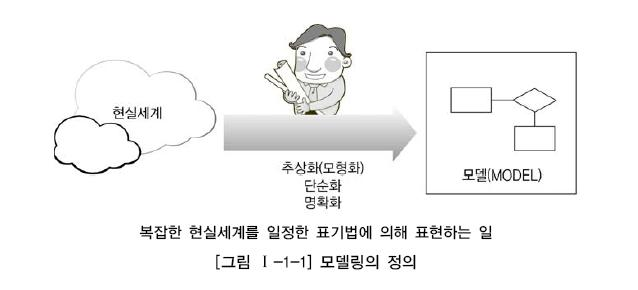

# Ch01. 데이터 모델링의 이해

## 1. 데이터 모델링의 이해

### `데이터 모델의 이해`

#### 1. 모델링의 이해

##### 가. 모델링의 정의

- `모델`이라고 하는 것은 사람이 다양한 현상에 대해서 **일정한 표기법(규칙)에 의해 표현해 놓은 모형**이라고 할 수 있다. 이 역시 커뮤니케이션의 **효율성을 극대화한** 고급화된 표현방법으로 설명될 수 있다.

- `모델링` - 모델을 만들어가는 일

  

##### 나. 모델링의 특징

- 1) 추상화(모형화, 가설적)

  : 현실세계를 **일정한 형식(표기법)**에 맞추어 표현한다.

- 2) 단순화

  : 복잡한 현실세계를 **제한된 표기법이나 언어로 표현하여 쉽게 이해할 수 있도록** 한다.

- 3) 명확화

  : **대상에 대한 애매모호함을 제거**하고 정확하게 현상을 기술한다.

- 따라서 모델링을 다시 정의하면 ‘현실세계를 추상화, 단순화, 명확화하기 위해 일정한 표기법에 의해 표현하는 기법’으로 정리할 수 있다. 정보시스템 구축에서는 모델링을 계획/분석/설계 할 때 업무를 분석하고 설계하는데 이용하고 이후 구축/운영 단계에서는 변경과 관리의 목적으로 이용하게 된다.

##### 다. 모델링의 세 가지 관점

- 모델링은 크게 세 가지 관점인 데이터관점, 프로세스관점, 데이터와 프로세스의 상관관점으로 구분하여 설명할 수 있다.

  

- 1) 데이터관점 : **업무가 어떤 데이터와 관련이 있는지** 또는 **데이터간의 관계는 무엇인지**에 대해서 모델링하는 방법(What, Data) 

  - 이 장에서는 데이터 모델링에 대한 기본 개념이 중요하므로 프로세스와 상관모델링에 대한 내용은 생략하고 데이터베이스를 구축하기 위한 **데이터 모델링을 중심으로 설명한다**.

- 2) 프로세스관점 : 업무가 실제하고 있는 일은 무엇인지 또는 무엇을 해야 하는지를 모델링하는 방법(How, Process) 

- 3) 데이터와 프로세스의 상관관점 : 업무가 처리하는 일의 방법에 따라 데이터는 어떻게 영향을 받고 있는지 모델링하는 방법(Interaction)으로 설명될 수 있다.

#### 2. 데이터 모델의 기본 개념의 이해

##### 가. (데이터)모델링의 정의

- 데이터베이스의 **논리적인 구조인 데이터 모델**을 이해하는 것은 SQL에 대한 지식을 쌓기 위한 핵심 이론이다. 일반적으로 `데이터 모델링`은 다음과 같이 다양하게 정의될 수 있다.

  - 정보시스템을 구축하기 위해, 해당 업무에 어떤 데이터가 존재하는지 또는 업무가 필요로 하는 정보는 무엇인지를 분석하는 방법
  - 기업 업무에 대한 종합적인 이해를 바탕으로 데이터에 존재하는 업무 규칙(Business Rule)에 대하여 참(True) 또는 거짓(False)을 판별할 수 있는 사실(사실명제)을 데이터에 접근하는 방법(How), 사람(Who), 전산화와는 별개의(독립적인) 관점에서 이를 명확하게 표현하는 추상화 기법

  

  이것을 좀 더 실무적으로 해석해 보면 업무에서 필요로 하는 데이터를 시스템 구축 방법론에 의해 분석하고 설계하여 정보시스템을 구축하는 과정으로 정의할 수 있다. 데이터 모델링을 하는 주요한 이유는 업무정보를 구성하는 기초가 되는 정보들을 일정한 표기법에 의해 표현함으로써 정보시스템 구축의 대상이 되는 업무 내용을 정확하게 분석하는 것이 첫 번째 목적이다. 두 번째는 분석된 모델을 가지고 실제 데이터베이스를 생성하여 개발 및 데이터관리에 사용하기 위한 것이다. 즉, 데이터 모델링이라는 것은 단지 데이터베이스만을 구축하기 위한 용도로만 쓰이는 것이 아니라 데이터 모델링 자체로서 업무를 설명하고 분석하는 부분에도 매우 중요한 의미를 가지고 있다고 할 수 있다.