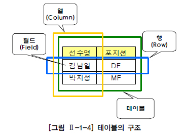
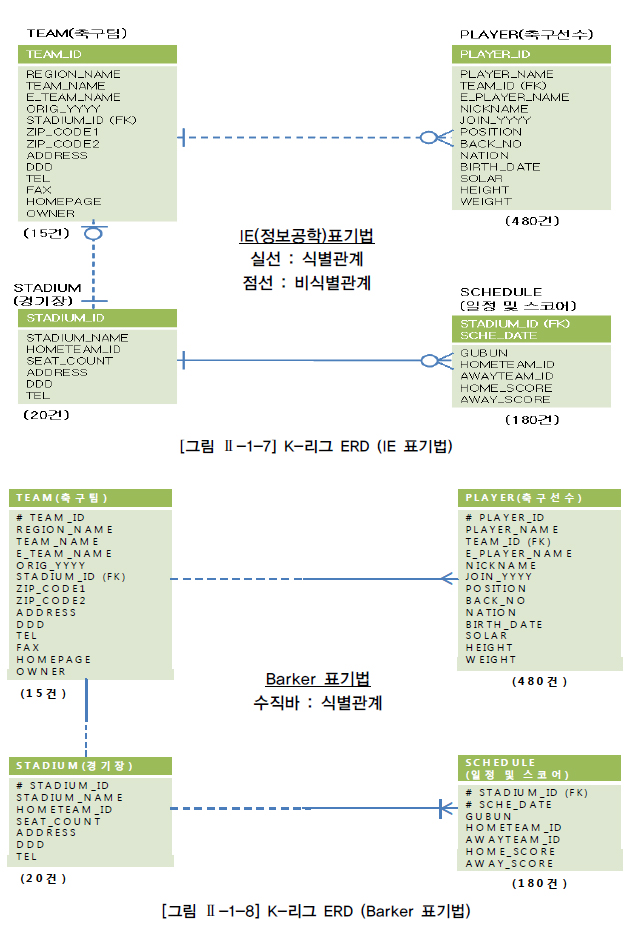
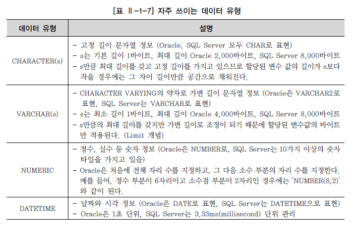
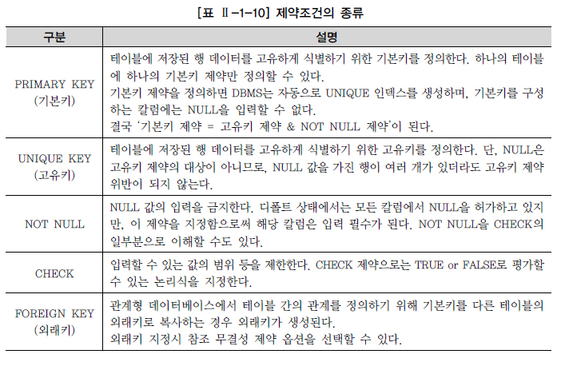
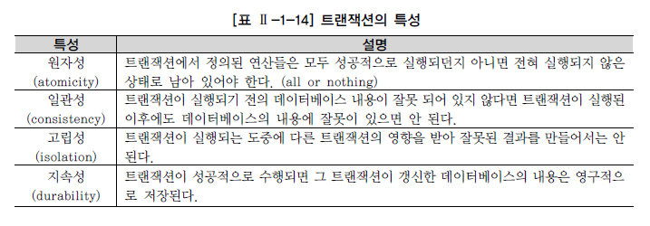
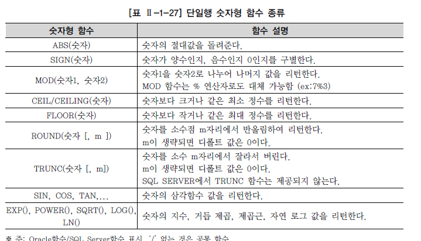

# Ch02. SQL 기본 및 활용

## 1. SQL 기본

### `관계형 데이터베이스 개요`

#### 1. 데이터베이스

- 넓은 의미에서의 데이터베이스는 일상적인 정보들을 모아 놓은 것 자체를 의미한다. 그러나 일반적으로 데이터베이스라고 말할 때는 특정 기업이나 조직 또는 개인이 필요에 의해(ex: 부가가치가 발생하는) **데이터를 일정한 형태로 저장해 놓은 것**을 의미한다.
- 보다 **효율적인 데이터의 관리** 뿐만 아니라 예기치 못한 사건으로 인한 데이터의 손상을 피하고, 필요시 필요한 데이터를 **복구**하기 위한 강력한 기능의 소프트웨어를 필요로 하게 되었고 이러한 기본적인 요구사항을 만족시켜주는 시스템을 `DBMS(Database Management System)`라고 한다.

- 관계형 데이터베이스(Relational Database)

  : 1970년 영국의 수학자였던 E.F. Codd 박사의 논문에서 처음으로 관계형 데이터베이스가 소개된 이후, IBM의 SQL 개발 단계를 거쳐서, Oracle을 선발로 여러 회사에서 상용화된 제품을 내놓았다. 이후 관계형 데이터베이스의 여러 장점이 알려지면서 기존의 파일시스템과 계층형, 망형 데이터베이스를 대부분 대체하면서 주력 데이터베이스가 되었다.
  (단, 단일 사용자나 단일 어플리케이션이 파일시스템을 사용하는 경우 데이터베이스보다 처리 성능이 뛰어나므로 특정 업무에서는 아직도 파일시스템을 유용하게 사용하고 있다.)

  - 관계형 데이터베이스는 정규화를 통한 합리적인 테이블 모델링을 통해 **이상(ANOMALY) 현상을 제거**하고 **데이터 중복을 피할 수** 있으며, **동시성 관리**, **병행 제어**를 통해 많은 사용자들이 동시에 데이터를 공유 및 조작할 수 있는 기능을 제공하고 있다.
  - 또한, 관계형 데이터베이스는 **메타 데이터를 총괄 관리**할 수 있기 때문에 데이터의 성격, 속성 또는 표현 방법 등을 체계화할 수 있고, 데이터 표준화를 통한 데이터 품질을 확보할 수 있는 장점을 가지고 있다.

- DBMS는 **인증**된 사용자만이 참조할 수 있도록 **보안 기능**을 제공하고 있다. 테이블 생성 시에 사용할 수 있는 다양한 제약조건을 이용하여 사용자가 실수로 조건에 위배되는 데이터를 입력한다든지, 관계를 연결하는 중요 데이터를 삭제하는 것을 방지하여 데이터 `무결성(Integrity)`을 보장할 수 있다.


#### 2. SQL(Structured Query Language)

- SQL(Structured Query Language)은 관계형 데이터베이스에서 데이터 정의, 데이터 조작, 데이터 제어를 하기 위해 사용하는 언어이다.
  1986년부터 ANSI/ISO를 통해 **표준화되고 정의된 SQL 기능은 벤더별 DBMS 개발의 목표**가 된다. 일부 구체적인 용어는 다르더라도 대부분 표준을 최대한 따르고 있기 때문에, SQL에 대한 지식은 다른 데이터베이스를 사용하더라도 상당 부분 기존 지식을 재활용할 수 있다.
- SQL 문장은 단순 **스크립트가 아니라** 이름에도 포함되어 있듯이, 일반적인 개발 언어처럼 **독립된 하나의 개발 언어**이다. 하지만 일반적인 프로그래밍 언어와는 달리 SQL은 관계형 데이터베이스에 대한 전담 접속(다른 언어는 관계형 데이터베이스에 접속할 수 없다) 용도로 사용되며, **집합 논리**에 입각한 것이므로, <u>SQL도 데이터를 집합으로써 취급한다</u>. 예를 들어 ‘포지션이 미드필더(MF)인 선수의 정보를 검색한다’고 할 경우, 선수라는 큰 집합에서 포지션이 미드필더인 조건을 만족하는 요구 집합을 추출하는 조작이 된다.
  


#### 3. TABLE


- 데이터는 **관계형 데이터베이스의 기본 단위인 `테이블`** 형태로 저장된다. 모든 자료는 테이블에 등록이 되고, 우리는 테이블로부터 원하는 자료를 꺼내 올 수 있다.
  테이블은 어느 특정한 주제와 목적으로 만들어지는 일종의 **집합**이다.

- `테이블(TABLE)`은 데이터를 저장하는 객체(Object)로서 관계형 데이터베이스의 기본 단위이다. 관계형 데이터베이스에서는 모든 데이터를 칼럼과 행의 2차원 구조로 나타낸다. 세로 방향을 `칼럼(Column)`, 가로 방향을 `행(Row)`이라고 하고, 칼럼과 행이 겹치는 하나의 공간을 `필드(Field)`라고 한다.

  

- **테이블을 분할하여 데이터의 불필요한 중복을 줄이는 것**을 `정규화(Normalization)`라고 한다. 데이터의 **정합성 확보**와 데이터 **입력/수정/삭제시 발생할 수 있는 이상현상(Anomaly)을 방지**하기 위해 정규화는 관계형 데이터베이스 모델링에서 매우 중요한 프로세스이다.

  

- 각 행을 한 가지 의미로 특정할 수 있는 한 개 이상의 칼럼을 `기본키(Primary Key)`라고 하며, 여기서는 <선수> 테이블의 ‘선수번호’와 <구단> 테이블의 ‘구단코드’가 기본키가 된다. 또, <선수> 테이블의 ‘구단코드’와 같이 **다른 테이블의 기본 키로 사용되면서 테이블과의 관계를 연결하는 역할을 하는 칼럼**을 `외부키(Foreign Key)`라고 한다.


#### 4. ERD(Entity Relationship Diagram)

- ERD(Entity Relationship Diagram)는 관계의 의미를 직관적으로 표현할 수 있는 좋은 수단이다.

  

- **테이블 간** 서로의 상관 관계를 그림으로 도식화한 것을 **E-R 다이어그램**이라고 하며, 간략히 ERD라고 한다. ERD의 구성 요소는 **엔터티(Entity)**, **관계(Relationship)**, **속성(Attribute)** 3가지이며 현실 세계의 데이터는 이 3가지 구성 요소로 모두 표현이 가능하다.

- K-리그 테이블 간의 양방향 관계는 다음과 같다.

  \- 하나의 팀은 여러 명의 선수를 포함할 수 있다. - 한 명의 선수는 하나의 팀에 꼭 속한다.

  \- 하나의 팀은 하나의 전용 구장을 꼭 가진다. - 하나의 운동장은 하나의 홈팀을 가질 수 있다.

  \- 하나의 운동장은 여러 게임의 스케줄을 가질 수 있다. - 하나의 스케줄은 하나의 운동장에 꼭 배정된다.

  

- 앞으로 사용하게 될 부서-사원 테이블 간의 관계를 IE 표기법과 Barker 표기법으로 표현한 ERD이다.

- 사원-부서 테이블 간의 양방향 관계는 다음과 같다.

  \- 하나의 부서는 여러 명의 사원을 보유할 수 있다. - 한 명의 사원은 하나의 부서에 꼭 소속된다.

  

  


### `DDL`

#### 1. 데이터 유형

- `데이터 유형`은 데이터베이스의 테이블에 특정 자료를 입력할 때, 그 자료를 받아들일 공간을 자료의 유형별로 나누는 기준이라고 생각하면 된다. 또한 데이터 유형과 더불어 지정한 `크기(SIZE)`도 중요하다. 

- **벤더별로 SQL 문장의 차이는 적어지고 있지만, 데이터 유형과 내장형 함수 부분에서는 차이가 많은 편이다.** 숫자 타입을 예를 들어 보면 ANSI/ISO 기준에서는 NUMERIC Type의 하위 개념으로 NUMERIC, DECIMAL, DEC, SMALLINT, INTEGER, INT, BIGINT, FLOAT, REAL, DOUBLE PRECISION을 소개하고 있다. `SQL Server`와 `Sybase`는 ANSI/ISO 기준의 하위 개념에 맞추어서 작은 정수형, 정수형, 큰 정수형, 실수형 등 여러 숫자 타입을 제공하고 있으며, 추가로 MONEY, SMALLMONEY 등의 숫자 타입도 가지고 있다. 반면, `Oracle`은 숫자형 타입에 대해서 NUMBER 한 가지 숫자 타입의 데이터 유형만 지원한다. 

  

- 문자열 유형의 경우, CHAR 유형과 VARCHAR 유형 중 어느 유형을 지정하는지에 대한 문제가 자주 논의된다. 중요한 것은 **저장 영역**과 **문자열의 비교 방법**이다. 

  - **VARCHAR 유형은 가변 길이**이므로 필요한 영역은 실제 데이터 크기뿐이다. 그렇기 때문에 길이가 다양한 칼럼과, 정의된 길이와 실제 데이터 길이에 차이가 있는 칼럼에 적합하다. 저장 측면에서도 CHAR 유형보다 작은 영역에 저장할 수 있으므로 장점이 있다. 

  - 또 하나는 비교 방법의 차이이다. **CHAR에서는 문자열을 비교할 때 공백(BLANK)을 채워서 비교하는 방법을 사용한다.** 공백 채우기 비교에서는 우선 짧은 쪽의 끝에 공백을 추가하여 2개의 데이터가 같은 길이가 되도록 한다. 그리고 앞에서부터 한 문자씩 비교한다. 그렇기 때문에 끝의 공백만 다른 문자열은 같다고 판단된다. 그에 반해 **VARCHAR 유형에서는 맨 처음부터 한 문자씩 비교하고 공백도 하나의 문자로 취급**하므로 끝의 공백이 다르면 다른 문자로 판단한다.

    ``` sql
    예) CHAR 유형'AA' = 'AA '
     	VARCHAR 유형 'AA' ≠ 'AA '
    ```

  - 영문 이름이 VARCHAR(40)으로 40바이트가 지정되더라도 실제 ‘PARK,JISUNG’으로 데이터가 입력되는 경우 11바이트의 공간만을 차지한다. <u>주민등록번호나 사번처럼 자료들이 고정된 길이의 문자열을 가지지 않는다면 데이터 유형은 VARCHAR 유형을 적용하는 것이 바람직하다.</u>


#### 2. CREATE TABLE

##### 가. 테이블과 칼럼 정의

- 테이블에 존재하는 모든 데이터를 **고유하게 식별**할 수 있으면서 **반드시 값이 존재하는** 단일 칼럼이나 칼럼의 조합들(후보키) 중에 하나를 선정하여 `기본키` 칼럼으로 지정한다. **기본키는 단일 칼럼이 아닌 여러 개의 칼럼으로도 만들어질 수 있다. **
- 그리고 **테이블과 테이블 간에 정의된 관계**는 기본키(PRIMARY KEY)와 외부키(FOREIGN KEY)를 활용해서 설정하도록 한다. 선수 테이블에 선수의 소속팀 정보가 같이 존재한다고 가정하면, 특정 팀의 이름이 변경되었을 경우 그 팀에 소속된 선수 데이터를 일일이 찾아서 수정을 하거나, 또한 팀이 해체되었을 경우 선수 관련 정보까지 삭제되는 `수정/삭제 이상(Anomaly) 현상`이 발생할 수 있다. 이런 이상 현상을 방지하기 위해 팀 정보를 관리하는 팀 테이블을 별도로 분리해서 팀ID와 팀 이름을 저장하고, 선수 테이블에서는 팀ID를 외부키로 참조하게 한다.

##### 나. CREATE TABLE

``` sql
CREATE　TABLE　테이블이름 ( 
    칼럼명1 DATATYPE [DEFAULT 형식], 
    칼럼명2 DATATYPE [DEFAULT 형식], 
    칼럼명3 DATATYPE [DEFAULT 형식] );
```

- 다음은 테이블 생성 시에 주의해야 할 몇 가지 규칙이다.
  - 칼럼에 대해서는 다른 테이블까지 고려하여 데이터베이스 내에서는 일관성 있게 사용하는 것이 좋다.(데이터 표준화 관점) 
  - **테이블명과 칼럼명은 반드시 문자로 시작**해야 하고, 벤더별로 길이에 대한 한계가 있다.
- 한 테이블 안에서 칼럼 이름은 달라야 하지만, 다른 테이블의 칼럼 이름과는 같을 수 있다. 예를 들면 선수 테이블의 TEAM_ID, 팀 테이블의 TEAM_ID는 같은 칼럼 이름을 가지고 있다. <u>실제 DBMS는 팀 테이블의 TEAM_ID를 PC나 UNIX의 디렉토리 구조처럼 ‘DB명+DB사용자명+테이블명+칼럼명’처럼 계층적 구조를 가진 전체 경로로 관리하고 있다. 이처럼 같은 이름을 가진 칼럼들은 기본키와 외래키의 관계를 가지는 경우가 많으며, 향후 테이블 간의 조인 조건으로 주로 사용되는 중요한 연결고리 칼럼들이다.</u>

  ``` sql
CREATE TABLE PLAYER ( 
    PLAYER_ID CHAR(7) NOT NULL, 
    PLAYER_NAME VARCHAR2(20) NOT NULL, 
    TEAM_ID CHAR(3) NOT NULL,
    CONSTRAINT PLAYER_PK PRIMARY KEY (PLAYER_ID), 
    CONSTRAINT PLAYER_FK FOREIGN KEY (TEAM_ID) REFERENCES TEAM(TEAM_ID) );
  ```

  - 테이블 생성시 대/소문자 구분은 하지 않는다. 기본적으로 테이블이나 칼럼명은 대문자로 만들어진다. 
  - 문자 데이터 유형은 반드시 가질 수 있는 최대 길이를 표시해야 한다. 
  - 칼럼에 대한 제약조건이 있으면 **CONSTRAINT**를 이용하여 추가할 수 있다.

- 제약조건은 NOT NULL을 정의한 사례와 같은 **칼럼 LEVEL 정의 방식**과, PLAYER_PK PRIMARY KEY, PLAYER_FK FOREIGN KEY 사례처럼 테이블 생성 마지막에 모든 제약조건을 기술하는 **테이블 LEVEL 정의 방식**이 있다.

##### 다. 제약조건(CONSTRAINT)

- 제약조건(CONSTRAINT)이란 **테이블의 특정 칼럼에 설정하는 제약**이다. 테이블을 생성할 때 제약조건을 반드시 기술할 필요는 없지만, 이후에 ALTER TABLE을 이용해서 추가, 수정하는 경우 데이터가 이미 입력된 경우라면 처리 과정이 쉽지 않으므로 초기 테이블 생성 시점부터 충분한 검토가 있어야 한다.

  

- DEFAULT 의미

  : 데이터 기본값(DEFAULT)을 사전에 설정할 수 있다. 데이터 입력시 명시된 값을 지정하지 않은 경우에 NULL 값이 입력되고, DEFAULT 값을 정의했다면 사전에 정의된 기본 값이 자동으로 입력된다.

##### 라. 생성된 테이블 구조 확인

- 테이블을 생성한 후 테이블의 구조가 제대로 만들어졌는지 확인할 필요가 있다. Oracle의 경우 “DESCRIBE 테이블명;” 또는 간략히 “DESC 테이블명;”으로 해당 테이블에 대한 정보를 확인할 수 있다. SQL Server의 경우 “sp_help ‘dbo.테이블명’”으로 해당 테이블에 대한 정보를 확인할 수 있다.

  ``` sql
  DESCRIBE PLAYER; /*Oracle*/
  exec sp_help 'dbo.PLAYER' go /*SQL Server*/
  ```

##### 마. SELECT 문장을 통한 테이블 생성 사례

- DML 문장 중에 SELECT 문장을 활용해서 테이블을 생성할 수 있는 방법(`CTAS`: Create Table ~ As Select ~)이 있다. **기존 테이블을 이용한 CTAS 방법**을 이용할 수 있다면 칼럼별로 데이터 유형을 다시 재정의 하지 않아도 되는 장점이 있다. 그러나 CTAS 기법 사용시 주의할 점은 기존 테이블의 제약조건 중에 NOT NULL만 새로운 복제 테이블에 적용이 되고, **기본키, 고유키, 외래키, CHECK 등의 다른 제약 조건은 없어진다**는 점이다. 제약 조건을 추가하기 위해서는 뒤에 나오는 ALTER TABLE 기능을 사용해야 한다. 

  ``` sql
  CREATE TABLE TEAM_TEMP AS SELECT * FROM TEAM; /*Oracle*/
  SELECT * INTO TEAM_TEMP FROM TEAM; /*SQL Server*/
  ```


#### 3. ALTER TABLE

- 처음의 테이블 구조를 그대로 유지하는 것이 최선이지만, 업무적인 요구 사항이나 시스템 운영상 테이블을 사용하는 도중에 변경해야 할 일들이 발생할 수도 있다. 이 경우 주로 **칼럼을 추가/삭제**하거나 **제약조건을 추가/삭제**하는 작업을 진행하게 된다.

##### 가. ADD COLUMN

- 다음은 기존 테이블에 필요한 칼럼을 추가하는 명령이다. 새롭게 추가된 칼럼은 테이블의 **마지막 칼럼이 되며** 칼럼의 위치를 지정할 수는 없다.

  ``` sql
  ALTER TABLE 테이블명 ADD 추가할 칼럼명 데이터 유형;
  [예제] ALTER TABLE PLAYER ADD (ADDRESS VARCHAR2(80));
  ```

##### 나. DROP COLUMN

- 테이블에서 필요 없는 칼럼을 삭제할 수 있으며, 데이터가 있거나 없거나 모두 삭제 가능하다. 한 번 삭제된 칼럼은 복구가 불가능하다.

  ``` sql
  ALTER TABLE 테이블명 DROP COLUMN 삭제할 칼럼명;
  [예제] ALTER TABLE PLAYER DROP COLUMN ADDRESS;
  ```
```
  

##### 다. MODIFY COLUMN

- 칼럼의 데이터 유형, 디폴트(DEFAULT) 값, NOT NULL 제약조건에 대한 변경을 포함할 수 있다.

  ``` sql
  ALTER TABLE 테이블명 MODIFY (칼럼명1 데이터 유형 [DEFAULT 식] [NOT NULL], 칼럼명2 데이터 유형 …);
  [예제] ALTER TABLE TEAM_TEMP MODIFY (ORIG_YYYY VARCHAR2(8) DEFAULT '20020129' NOT NULL);
```

- 칼럼을 변경할 때는 몇 가지 사항을 고려해서 변경해야 한다.
  - 해당 칼럼의 크기를 늘릴 수는 있지만 줄이지는 못한다. 이는 기존의 데이터가 훼손될 수 있기 때문이다. 
  - 해당 칼럼이 NULL 값만 가지고 있거나 테이블에 아무 행도 없으면 칼럼의 폭을 줄일 수 있다. 
  - 해당 칼럼이 NULL 값만을 가지고 있으면 데이터 유형을 변경할 수 있다.

- 아래는 테이블을 생성하면서 만들어졌던 칼럼명을 어떤 이유로 불가피하게 변경해야 하는 경우에 유용하게 쓰일 수 있는 RENAME COLUMN 문구이다.

  ``` sql
  ALTER TABLE 테이블명 RENAME COLUMN 변경해야 할 칼럼명 TO 새로운 칼럼명;
  ```

  - ANSI/ISO에 명시되어 있는 기능이 아니고 Oracle 등 **일부 DBMS에서만 지원**하는 기능이다.

##### 라. DROP CONSTRAINT

- 테이블 생성 시 부여했던 제약조건을 삭제하는 명령어 형태는 다음과 같다.

  ``` sql
  ALTER TABLE 테이블명 DROP CONSTRAINT 제약조건명;
  [예제] ALTER TABLE PLAYER DROP CONSTRAINT PLAYER_FK;
  ```


#### 4. RENAME TABLE

- RENAME 명령어를 사용하여 테이블의 이름을 변경할 수 있다.

  ``` sql
  RENAME 변경전 테이블명 TO 변경후 테이블명;
  [예제] RENAME TEAM TO TEAM_BACKUP;
  ```


#### 5. DROP TABLE

- 테이블을 잘못 만들었거나 테이블이 더 이상 필요 없을 경우 해당 테이블을 삭제해야 한다. 다음은 불필요한 테이블을 삭제하는 명령이다.

  ``` sql
  DROP TABLE 테이블명 [CASCADE CONSTRAINT];
  [예제] DROP TABLE PLAYER;
  ```
  - CASCADE CONSTRAINT 옵션은 해당 테이블과 관계가 있었던 **참조되는 제약조건에 대해서도 삭제**한다는 것을 의미한다.


#### 6. TRUNCATE TABLE

- TRUNCATE TABLE은 테이블 자체가 삭제되는 것이 아니고, **해당 테이블에 들어있던 모든 행들이 제거**되고 저장 공간을 재사용 가능하도록 해제한다. 테이블 구조를 완전히 삭제하기 위해서는 DROP TABLE을 실행하면 된다.

  ``` sql
  TRUNCATE TABLE PLAYER;
  [예제] TRUNCATE TABLE TEAM; 테이블이 트렁케이트되었다.
  ```

- TRUNCATE는 데이터 구조의 변경 없이 테이블의 데이터를 일괄 삭제하는 명령어로 DML로 분류할 수도 있지만 **내부 처리 방식이나 Auto Commit 특성 등으로 인해 DDL로 분류**하였다.


### `DML`

- 만들어진 테이블에 관리하기를 원하는 자료들을 입력, 수정, 삭제, 조회하는 DML(DATA MANIPULATION LANGUAGE) 사용 방법을 알아본다.

#### 1. INSERT

- 테이블에 데이터를 입력하는 방법은 **두 가지 유형**이 있으며 **한 번에 한 건만 입력**된다.

  ``` sql
  ▶ INSERT INTO 테이블명 (COLUMN_LIST)VALUES (COLUMN_LIST에 넣을 VALUE_LIST); 
  ▶ INSERT INTO 테이블명 VALUES (전체 COLUMN에 넣을 VALUE_LIST);
  ```
  - 첫 번째 유형은 정의하지 않은 칼럼은 Default로 NULL 값이 입력된다. 
  - 두 번째 유형은 모든 칼럼에 데이터를 입력하는 경우로 굳이 COLUMN_LIST를 언급하지 않아도 되지만, 칼럼의 **순서대로** 빠짐없이 데이터가 입력되어야 한다.

  ``` sql
  [예제] INSERT INTO PLAYER (PLAYER_ID, PLAYER_NAME, TEAM_ID, POSITION, HEIGHT, WEIGHT, BACK_NO) VALUES ('2002007', '박지성', 'K07', 'MF', 178, 73, 7); 
  ```

  


#### 2. UPDATE

- 잘못 입력되거나 변경이 발생하여 정보를 수정해야 하는 경우가 발생할 수 있다.

  ``` sql
  UPDATE 테이블명 SET 수정되어야 할 칼럼명 = 수정되기를 원하는 새로운 값;
  [예제] UPDATE PLAYER SET BACK_NO = 99;
  ```


#### 3. DELETE

- 데이터 삭제를 수행한다. FROM 문구는 생략이 가능한 키워드이며, 뒤에서 배울 **WHERE 절을 사용하지 않는다면 테이블의 전체 데이터가 삭제**된다.

  ``` sql
  DELETE [FROM] 삭제를 원하는 정보가 들어있는 테이블명;
  [예제] DELETE FROM PLAYER;
  ```

- 참고로 데이터베이스는 DDL 명령어와 DML 명령어를 처리하는 방식에 있어서 차이를 보인다. 
  - DDL(CREATE, ALTER, RENAME, DROP) 명령어인 경우에는 **직접 데이터베이스의 테이블에 영향을 미치기 때문에** DDL 명령어를 입력하는 순간 명령어에 해당하는 **작업이 즉시(`AUTO COMMIT`) 완료**된다. 
  - 하지만 DML(INSERT, UPDATE, DELETE, SELECT) 명령어의 경우, 조작하려는 **테이블을 `메모리 버퍼`에 올려놓고 작업을 하기 때문에 실시간으로 테이블에 영향을 미치는 것은 아니다**. 따라서 버퍼에서 처리한 DML 명령어가 실제 테이블에 반영되기 위해서는 **COMMIT 명령어를 입력하여 TRANSACTION을 종료**해야 한다.
  - 테이블의 전체 데이터를 삭제하는 경우, 시스템 활용 측면에서는 삭제된 데이터를 로그로 저장하는 DELETE TABLE 보다는 시스템 부하가 적은 TRUNCATE TABLE을 권고한다. 단, TRUNCATE TABLE의 경우 삭제된 데이터의 로그가 없으므로 ROLLBACK이 불가능하므로 주의해야 한다.


#### 4. SELECT

- 사용자가 입력한 데이터는 언제라도 조회가 가능하다. 

- ALL : Default 옵션이므로 별도로 표시하지 않아도 된다. 중복된 데이터가 있어도 모두 출력한다.

  DISTINCT : 중복된 데이터가 있는 경우 1건으로 처리해서 출력한다.

  ``` sql
  [예제] SELECT PLAYER_ID, PLAYER_NAME, TEAM_ID, POSITION, HEIGHT, WEIGHT, BACK_NO FROM PLAYER;
  [예제] SELECT ALL POSITION FROM PLAYER; /*ALL은 생략 가능한 키워드*/
  [예제] SELECT DISTINCT POSITION FROM PLAYER;
  ```

- WILDCARD 사용하기

  : 해당 테이블의 모든 칼럼 정보를 보고 싶을 경우에는 와일드카드로 애스터리스크(*)를 사용하여 조회할 수 있다.

  ``` sql
  SELECT * FROM 테이블명;
  [예제] SELECT * FROM PLAYER;
  ```

- ALIAS 부여하기

  : 조회된 결과에 일종의 **별명(ALIAS, ALIASES)**을 부여해서 칼럼 레이블을 변경할 수 있다.
  - 칼럼명과 ALIAS 사이에 AS, as 키워드를 사용할 수도 있다.
  - 이중 인용부호(Double quotation)`" "`는 ALIAS가 공백, 특수문자를 포함할 경우와 대소문자 구분이 필요할 경우 사용된다.

  ``` sql
  [예제] SELECT PLAYER_NAME 선수명, POSITION 위치, HEIGHT 키, WEIGHT 몸무게 FROM PLAYER;
  [예제] SELECT PLAYER_NAME "선수 이름", POSITION "그라운드 포지션", HEIGHT "키", WEIGHT "몸무게" FROM PLAYER;
  ```


#### 5. 산술 연산자와 합성 연산자

- 산술 연산자

  : 산술 연산자는 NUMBER와 DATE 자료형에 대해 적용되며 일반적으로 수학에서의 4칙 연산과 동일하다. 그리고 우선순위를 위한 괄호 적용이 가능하다. 일반적으로 산술 연산을 사용하거나 특정 함수를 적용하게 되면 칼럼의 LABEL이 길어지게 되고, 기존의 칼럼에 대해 새로운 의미를 부여한 것이므로 **적절한 ALIAS를 새롭게 부여하는 것이 좋다**. 그리고 산술 연산자는 수학에서와 같이 (), *, /, +, - 의 **우선순위**를 가진다.

  ``` sql
  [예제] SELECT PLAYER_NAME 이름, HEIGHT - WEIGHT "키-몸무게" FROM PLAYER;
  ```

- 합성(CONCATENATION) 연산자

  : 문자와 문자를 연결하는 합성(CONCATENATION) 연산자를 사용하면 별도의 프로그램 도움 없이도 SQL 문장만으로도 유용한 리포트를 출력할 수 있다.
  - 문자와 문자를 연결하는 경우 2개의 수직 바(`||`)에 의해 이루어진다. (`Oracle`) 
  - 문자와 문자를 연결하는 경우 `+` 표시에 의해 이루어진다. (`SQL Server`) 
  - 두 벤더 모두 공통적으로 `CONCAT (string1, string2)` 함수를 사용할 수 있다.

  ``` sql
  [예제] SELECT PLAYER_NAME || '선수,' || HEIGHT || 'cm,' || WEIGHT || 'kg' 체격정보 FROM PLAYER;
  ```


### `TCL`

#### 1. 트랜잭션 개요

- 트랜잭션은 데이터베이스의 **논리적 연산단위**이다. 트랜잭션(TRANSACTION)이란 **밀접히 관련되어 분리될 수 없는 한 개 이상의 데이터베이스 조작**을 가리킨다. 하나의 트랜잭션에는 하나 이상의 SQL 문장이 포함된다. 
- 트랜잭션은 분할할 수 없는 최소의 단위이다. 그렇기 때문에 **전부 적용하거나 전부 취소**한다. 

- **올바르게 반영된 데이터를 데이터베이스에 반영시키는 것**을 `커밋(COMMIT)`, 트랜잭션 시작 이전의 상태로 되돌리는 것을 `롤백(ROLLBACK)`이라고 하며, `저장점(SAVEPOINT)` 기능과 함께 3가지 명령어를 트랜잭션을 콘트롤하는 `TCL(TRANSACTION CONTROL LANGUAGE)`로 분류한다. 

- **트랜잭션의 대상이 되는 SQL문은** UPDATE, INSERT, DELETE 등 데이터를 수정하는 **DML 문**이다. SELECT 문장은 직접적인 트랜잭션의 대상이 아니지만, SELECT FOR UPDATE 등 배타적 LOCK을 요구하는 SELECT 문장은 트랜잭션의 대상이 될 수 있다.

  

- `잠금(LOCKING)`은 기본적으로 트랜잭션이 수행하는 동안 특정 **데이터에 대해서 다른 트랜잭션이 동시에 접근하지 못하도록 제한**하는 기법이다. 잠금이 걸린 데이터는 잠금을 실행한 트랜잭션만 독점적으로 접근할 수 있고 다른 트랜잭션으로부터 간섭이나 방해를 받지 않는 것이 보장된다. 그리고 잠금이 걸린 데이터는 잠금을 수행한 트랜잭션만이 해제할 수 있다.

- SQL Server의 트랜잭션은 DBMS가 트랜잭션을 컨트롤하는 방식인 AUTO COMMIT이 기본 방식이다. 다음의 경우는 Oracle과 같이 자동으로 트랜잭션이 종료된다.

  - 애플리케이션의 이상 종료로 데이터베이스(인스턴스)와의 접속이 단절되었을 때는 트랜잭션이 자동으로 롤백된다.


#### 2. COMMIT

- COMMIT 명령어를 통해서 트랜잭션을 완료할 수 있다. 

- COMMIT이나 ROLLBACK 이전의 데이터 상태는 다음과 같다.
  - **단지 메모리 BUFFER에만 영향을 받았기 때문에 데이터의 변경 이전 상태로 복구 가능하다.**
  - 현재 사용자는 SELECT 문장으로 결과를 확인 가능하다. 
  - 다른 사용자는 현재 사용자가 수행한 명령의 결과를 볼 수 없다. 
  - 변경된 행은 잠금(LOCKING)이 설정되어서 다른 사용자가 변경할 수 없다.

  ``` sql
  [예제] UPDATE PLAYER SET HEIGHT = 100;
  COMMIT; /*커밋이 완료되었다.*/
  ```


#### 3. ROLLBACK

- COMMIT 이전에는 변경 사항을 취소할 수 있는데 데이터베이스에서는 롤백(ROLLBACK) 기능을 사용한다.

  ``` sql
  Oracle UPDATE PLAYER SET HEIGHT = 100; 
  ROLLBACK;
  ```

- COMMIT과 ROLLBACK을 사용함으로써 다음과 같은 효과를 볼 수 있다.

  - 데이터 **무결성** 보장
  - 논리적으로 연관된 작업을 그룹핑하여 처리 가능


#### 4. SAVEPOINT

- 저장점(SAVEPOINT)을 정의하면 롤백(ROLLBACK)할 때 트랜잭션에 포함된 **전체 작업을 롤백하는 것이 아니라 현 시점에서 SAVEPOINT까지 트랜잭션의 일부만 롤백할 수 있다**. 따라서 복잡한 대규모 트랜잭션에서 에러가 발생했을 때 SAVEPOINT까지의 트랜잭션만 롤백하고 실패한 부분에 대해서만 다시 실행할 수 있다.

  ``` sql
  SAVEPOINT SVPT1;
  UPDATE PLAYER SET WEIGHT = 100;
  ROLLBACK TO SVPT1;
  ```


- 저장점 A로 되돌리고 나서 다시 B와 같이 **미래 방향으로 되돌릴 수는 없다**. 일단 특정 저장점까지 롤백하면 그 저장점 이후에 설정한 저장점이 무효가 되기 때문이다. 즉, ‘ROLLBACK TO A’를 실행한 시점에서 저장점 A 이후에 정의한 저장점 B는 존재하지 않는다. 
- 저장점 지정 없이 “ROLLBACK”을 실행했을 경우 반영안된 모든 변경 사항을 취소하고 트랜잭션 시작 위치로 되돌아간다.


### `WHERE 절`

#### 1. WHERE 조건절 개요

- WHERE 절에는 두 개 이상의 테이블에 대한 **조인 조건**을 기술하거나 **결과를 제한하기 위한 조건**을 기술할 수도 있다. 

- WHERE 절에 조건이 없는 FTS(Full Table Scan) 문장은 SQL 튜닝의 1차적인 검토 대상이 된다. (FTS가 무조건 나쁜 것은 아니며 `병렬 처리` 등을 이용해 유용하게 사용하는 경우도 많다.)

  ``` sql
  SELECT [DISTINCT/ALL] 칼럼명 [ALIAS명] FROM 테이블명 WHERE 조건식;
  ```


#### 2. 연산자의 종류


#### 3. 비교 연산자

``` sql
[예제] SELECT PLAYER_NAME 선수이름, POSITION 포지션, BACK_NO 백넘버, HEIGHT 키 
	FROM PLAYER 
	WHERE POSITION = 'MF';
[예제] SELECT PLAYER_NAME 선수이름, POSITION 포지션, BACK_NO 백넘버, HEIGHT 키 
	FROM PLAYER 
	WHERE HEIGHT >= 170;
```


#### 4. SQL 연산자

- SQL 연산자는 SQL 문장에서 사용하도록 기본적으로 예약되어 있는 연산자로서 모든 데이터 타입에 대해서 연산이 가능한 4가지 종류가 있다.

- 1) IN (list) 연산자

  ``` sql
  [예제] SELECT PLAYER_NAME 선수이름, POSITION 포지션, BACK_NO 백넘버, HEIGHT 키 
  	FROM PLAYER 
  	WHERE TEAM_ID IN ('K02','K07');
  [예제] 사원 테이블에서 JOB이 MANAGER이면서 20번 부서에 속하거나, 
  JOB이 CLERK이면서 30번 부서에 속하는 사원의 정보를 
  IN 연산자의 다중 리스트를 이용해 출력하라.
  [예제] SELECT ENAME, JOB, DEPTNO 
  	FROM EMP 
  	WHERE (JOB, DEPTNO) IN (('MANAGER',20),('CLERK',30));
  ```
  - 사용자들이 잘 모르고 있는 **다중 리스트를 이용한 IN 연산자**는 SQL 문장을 짧게 만들어 주면서도 성능 측면에서도 장점을 가질 수 있는 매우 유용한 연산자이므로 적극적인 사용을 권고한다. 다만, 아래 SQL 문장과는 다른 결과가 나오게 되므로 용도를 구분해서 사용해야 한다.

  ``` sql
  [예제] SELECT ENAME, JOB, DEPTNO FROM EMP WHERE JOB IN ('MANAGER','CLERK') AND DEPTNO IN (20,30);
  ```

- 2) LIKE 연산자

  : 만약 “장”씨 성을 가진 선수들을 조회할 경우는 어떻게 할까? 이런 문제를 해결하기 위해서 LIKE 연산자에서는 **와일드카드(WildCard)**를 사용할 수 있다. 와일드카드(WildCard)란 한 개 혹은 0개 이상의 문자를 대신해서 사용하기 위한 특수 문자를 의미한다.

  

  ``` sql
  [예제] SELECT PLAYER_NAME 선수이름, POSITION 포지션, BACK_NO 백넘버, HEIGHT 키 
  	FROM PLAYER 
  	WHERE PLAYER_NAME LIKE '장%';
  ```

- 3) BETWEEN a AND b 연산자

  ``` sql
  [예제] SELECT PLAYER_NAME 선수이름, POSITION 포지션, BACK_NO 백넘버, HEIGHT 키 
  	FROM PLAYER 
  	WHERE HEIGHT BETWEEN 170 AND 180; 
  	/* BETWEEN a AND b는 범위에서 'a'와 'b'의 값을 포함하는 범위를 말하는 것이다.*/
  ```

- 4) IS NULL 연산자

  : **NULL(ASCII 00)은 값이 존재하지 않는 것으로 비교 자체가 불가능**한 값인 것이다. 연산 관련 NULL의 특성은 다음과 같다.
  - NULL 값과의 수치연산은 NULL 값을 리턴한다. 
  - NULL 값과의 비교연산은 거짓(FALSE)을 리턴한다. 
  - 어떤 값과 비교할 수도 없으며, 특정 값보다 크다, 적다라고 표현할 수 없다.

- **NULL 값의 비교 연산은 IS NULL, IS NOT NULL 이라는 정해진 문구를 사용해야 제대로 된 결과를 얻을 수 있다.**

  ``` sql
  [예제 및 실행 결과] SELECT PLAYER_NAME 선수이름, POSITION 포지션, BACK_NO 백넘버, HEIGHT 키 
  	FROM PLAYER 
  	WHERE POSITION = NULL; /*선택된 레코드가 없다.*/
  ```

  - 실행 결과로 “선택된 레코드가 없다.”라는 메시지가 출력되었다. 앞에서 살펴본 대로 WHERE 절에서 POSITION = NULL을 사용했는데 문법 에러가 나지는 않았지만 <u>WHERE 절의 조건이 거짓(FALSE)이 되어 WHERE 절의 조건을 만족하는 데이터를 한건도 얻지 못하게 된 것</u>으로 의미 없는 SQL이 되고 말았다.

  ``` sql
  [예제] POSITION 칼럼(Column) 값이 NULL 값인지를 판단하기 위해서는 IS NULL을 사용하여 다음과 같이 SQL 문장을 수정하여 실행한다.
  [예제] SELECT PLAYER_NAME 선수이름, POSITION 포지션, TEAM_ID FROM PLAYER WHERE POSITION IS NULL;
  ```


#### 5. 논리 연산자

- 논리 연산자는 비교 연산자나 SQL 비교 연산자들로 이루어진 여러 개의 조건들을 논리적으로 연결시키기 위해서 사용되는 연산자라고 생각하면 된다.

  ``` sql
  [예제] SELECT PLAYER_NAME 선수이름, POSITION 포지션, BACK_NO 백넘버, HEIGHT 키 
  	FROM PLAYER 
  	WHERE TEAM_ID = 'K02' AND HEIGHT >= 170;
  [예제] SELECT PLAYER_NAME 선수이름, POSITION 포지션, BACK_NO 백넘버, HEIGHT 키 
  	FROM PLAYER 
  	WHERE (TEAM_ID = 'K02' OR TEAM_ID = 'K07') AND POSITION = 'MF' AND HEIGHT >= 170 AND HEIGHT <= 180;
  ```

  

- [예제] IN (list) `[= OR]`와 BETWEEN a AND b `[= ≥ AND ≤]`연산자를 활용하여 같은 결과를 출력하는 SQL 문장을 작성한다. 두개의 SQL 문장은 DBMS **내부적으로 같은 프로세스**를 거쳐 수행되므로 당연히 실행 결과도 같다.

  ``` sql
  [예제] SELECT PLAYER_NAME 선수이름, POSITION 포지션, BACK_NO 백넘버, HEIGHT 키 
  	FROM PLAYER 
  	WHERE TEAM_ID IN ('K02','K07') AND POSITION = 'MF' AND HEIGHT BETWEEN 170 AND 180 ;
  ```


#### 6. 부정 연산자

- 비교 연산자, SQL 비교 연산자에 대한 부정 표현을 부정 논리 연산자, 부정 SQL 연산자로 구분할 수 있다.

  ``` sql
  [예제] SELECT PLAYER_NAME 선수이름, POSITION 포지션, BACK_NO 백넘버, HEIGHT 키 
  	FROM PLAYER 
  	WHERE TEAM_ID = 'K02' AND NOT POSITION = 'MF' AND NOT HEIGHT BETWEEN 175 AND 185;
  [예제] 위의 SQL과 아래 SQL은 같은 내용을 나타내는 SQL이다. 
  SELECT PLAYER_NAME 선수이름, POSITION 포지션, BACK_NO 백넘버, HEIGHT 키 
  	FROM PLAYER 
  	WHERE TEAM_ID = 'K02' AND POSITION <> 'MF' AND HEIGHT NOT BETWEEN 175 AND 185;
  	
  [예제] SELECT PLAYER_NAME 선수이름, NATION 국적 
  	FROM PLAYER 
  	WHERE NATION IS NOT NULL;
  ```


#### 7. ROWNUM, TOP 사용

- ROWNUM

  : `Oracle`의 ROWNUM은 칼럼과 비슷한 성격의 **Pseudo Column**으로써 **SQL 처리 결과 집합의 각 행에 대해 임시로 부여되는 일련번호**이며, 테이블이나 집합에서 원하는 만큼의 행만 가져오고 싶을 때 WHERE 절에서 행의 개수를 제한하는 목적으로 사용한다.

  - 1 건의 행만 가져오고 싶을 때는 다음처럼 사용할 수 있다.

  ``` sql
  SELECT PLAYER_NAME FROM PLAYER WHERE ROWNUM = 1; 
  SELECT PLAYER_NAME FROM PLAYER WHERE ROWNUM <= 1;
  SELECT PLAYER_NAME FROM PLAYER WHERE ROWNUM < 2;
  ```

  - **두 건 이상의 N 행을 가져오고 싶을 때는 ROWNUM = N; 처럼 사용할 수 없다.**

  ``` sql
  SELECT PLAYER_NAME FROM PLAYER WHERE ROWNUM <= N;
  ```

- TOP 절

  : SQL Server는 TOP 절을 사용하여 결과 집합으로 출력되는 행의 수를 제한할 수 있다. TOP 절의 표현식은 다음과 같다.

- SQL 문장에서 ORDER BY 절이 사용되지 않으면 Oracle의 ROWNUM과 SQL Server의 TOP 절은 같은 기능을 하지만, **ORDER BY 절이 같이 사용되면 기능의 차이가 발생한다**.


### `함수(FUNCTION)`

#### 1. 내장 함수(BUILT-IN FUNCTION) 개요

- 함수는 다양한 기준으로 분류할 수 있는데, 벤더에서 제공하는 함수인 `내장 함수(Built-in Function)`와 `사용자가 정의할 수 있는 함수(User Defined Function)`로 나눌 수 있다. 본 절에서는 각 벤더에서 제공하는 데이터베이스를 설치하면 기본적으로 제공되는 SQL 내장 함수에 대해 설명한다. 

- 내장 함수는 SQL을 더욱 강력하게 해주고 데이터 값을 간편하게 조작하는데 사용된다. 내장 함수는 벤더별로 가장 큰 차이를 보이는 부분이지만, 핵심적인 기능들은 이름이나 표현법이 다르더라도 대부분의 데이터베이스가 공통적으로 제공하고 있다. 

- 내장 함수는 다시 함수의 입력 값이 단일행 값이 입력되는 **단일행 함수(Single-Row Function)**와 여러 행의 값이 입력되는 **다중행 함수(Multi-Row Function)**로 나눌 수 있다. 다중행 함수는 다시 집계 함수(Aggregate Function), 그룹 함수(Group Function), 윈도우 함수(Window Function)로 나눌 수 있는데, 본 절에서는 단일행 함수에 대해서만 설명한다. 

- 함수는 **입력되는 값이 아무리 많아도 출력은 하나만 된다는 M:1 관계**라는 중요한 특징을 가지고 있다. 단일행 함수의 경우 단일행 내에 있는 하나의 값 또는 여러 값이 입력 인수로 표현될 수 있다. 다중행 함수의 경우도 여러 레코드의 값들을 입력 인수로 사용하는 것이다.

  ``` sql
  함수명 (칼럼이나 표현식 [, Arg1, Arg2, ... ])
  ```

  

- 단일행 함수의 중요한 특징은 다음과 같다.
  - **SELECT, WHERE, ORDER BY 절에 사용 가능하다. **
  - 각 행(Row)들에 대해 개별적으로 작용하여 데이터 값들을 조작하고, 각각의 행에 대한 조작 결과를 리턴한다.
  - 특별한 경우가 아니면 함수의 인자(Arguments)로 함수를 사용하는 **함수의 중첩**이 가능하다.


#### 2. 문자형 함수

- 문자형 함수는 문자 데이터를 매개 변수로 받아들여서 문자나 숫자 값의 결과를 돌려주는 함수이다. 몇몇 문자형 함수의 경우는 결과를 숫자로 리턴하는 함수도 있다.

  

  

  ``` sql
  [예제] ‘SQL Expert’라는 문자형 데이터의 길이를 구하는 문자형 함수를 사용한다.
  
  [예제] SELECT LENGTH('SQL Expert') FROM DUAL; 
  [실행 결과] LENGTH('SQL Expert') --------------- 10
  ```

- 예제 및 실행 결과를 보면 함수에 대한 결과 값을 마치 테이블에서 값을 조회했을 때와 비슷하게 표현한다. `Oracle`은 SELECT 절과 **FROM 절** 두 개의 절을 **SELECT 문장의 필수 절**로 지정하였으므로 **사용자 테이블이 필요 없는 SQL 문장의 경우에도 필수적으로 `DUAL`이라는 테이블을 FROM 절에 지정한다**. DUAL 테이블의 특성은 다음과 같다.

  - 사용자 SYS가 소유하며 모든 사용자가 액세스 가능한 테이블이다. 
  - SELECT ~ FROM ~ 의 형식을 갖추기 위한 일종의 **DUMMY 테이블**이다. 
    - DUMMY라는 문자열 유형의 칼럼에 'X'라는 값이 들어 있는 행을 1건 포함하고 있다.

- 반면 Sybase나 `SQL Server`의 경우에는 SELECT 절만으로도 SQL 문장이 수행 가능하도록 정의하였기 때문에 DUAL이란 DUMMY 테이블이 필요 없다.


#### 3. 숫자형 함수

- 숫자형 함수는 숫자 데이터를 입력받아 처리하고 숫자를 리턴하는 함수이다.

  

  

  ``` sql
  [예제] SELECT ENAME, ROUND(SAL/12,1), TRUNC(SAL/12,1) FROM EMP;
  ```


#### 4. 날짜형 함수

- 날짜형 함수는 DATE 타입의 값을 연산하는 함수이다. Oracle의 TO_NUMBER(TO_CHAR( )) 함수의 경우 변환형 함수로 구분할 수도 있으나 SQL Server의 YEAR, MONTH,DAY 함수와 매핑하기 위하여 날짜형 함수에서 설명한다. EXTRACT/DATEPART는 같은 기능을 하는 Oracle 내장 함수와 SQL Server 내장 함수를 표현한 것이다